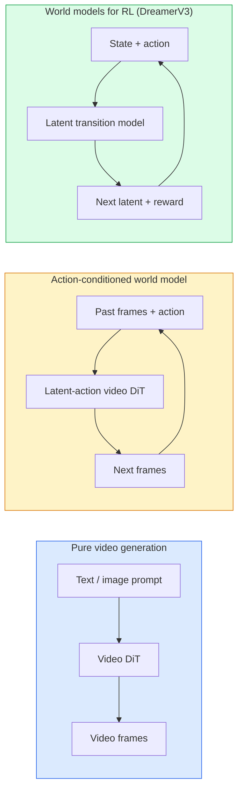

# Dünya Modeller ve Video Yayınlama

> Bir video modeli, gelecekteki olayları tahmin edebilen bir dünya simülatörüdür. Bu tahminleri hareket halinde ayarlayınca, öğrenilmiş bir oyun motoru elde edersiniz.

**Type:** Learn + Build
**Languages:** Python
**Prerequisites:** Phase 4 Lesson 10 (Diffusion), Phase 4 Lesson 12 (Video Understanding), Phase 4 Lesson 23 (DiT + Rectified Flow)
**Time:** ~75 分钟

## Öğrenme hedefi
- 解释纯视频生成模型(Sora 2) ve aksiyon koşullu dünya modeli(Genie 3, DreamerV3) arasındaki fark
- Video anlatımı DiT:spazio-temporal patches, 3D pozisyon kodlaması,跨`(T, H, W)`Tokens'in ortak ilgisi
- 追踪 World Model 如何接入机器人:VLM 规划 → video model 模拟 → ters dinamik 输出动作
- 针对给定用例 ((creative video、interactive sim、autonomous-driving synthesis) 在 Sora 2、Genie 3、Runway GWM-1 Worlds、Wan-Video 和 HunyuanVideo 之间做选择

## 问题
Video üretimi ve Dünya modeli 2026 yılında ️ ️ ️ ️ ️ ️ ️ ️ ️ ️ ️ ️ ️ ️ ️ ️ ️ ️ ️ ️ ️ ️ ️ ️ ️ ️ ️ ️ ️ ️ ️ ️ ️ ️ ️ ️ ️ ️ ️ ️ ️ ️ ️ ️ ️ ️ ️ ️ ️ ️ ️ ️ ️ ️ ️ ️ ️ ️ ️ ️ ️ ️ ️ ️ ️ ️ ️ ️ ️ ️ ️ ️ ️ ️ ️ ️ ️ ️ ️ ️ ️ ️ ️ ️ ️ ️ ️ ️ ️ ️ ️ ️ ️ ️ ️ ️ ️ ️ ️ ️ ️ ️ ️ ️ ️ ️ ️ ️ ️ ️ ️ ️ ️ ️ ️ ️ ️ ️ ️ ️ ️ ️ ️ ️ ️ ️ ️ ️ ️ ️ ️ ️ ️ ️ ️ ️ ️ ️ ️ ️ ️ ️ ️ ️ ️ ️ ️ ️  ️ ️  ️ ️  ️                  

Sonraki yıllarda, yeni bir model modelin geliştirilmesi ve geliştirilmesi için kullanılan araçlar ve araçlar üzerinde çalışmalar yapıldı.

Bu ders, 4. aşamada yapılmış bir mimari örneği oluşturur.

## 概念
### Dünya Modelinin üç sınıfı



- **Sora 2**Bu videolar, isteklere dayalıdır.
- **Genie 3**- Evet.**GWM-1 Worlds**- Evet.**Mirage / Magica**Bu, hareketli bir dünya modelidir. Onlar izleme videolarında gizli eylemleri tahmin eder, sonra da gelecekte bir hareketle koşullandırılır.
- **DreamerV3**和经典 RL World Model 家族, gizli alanda öngörülmüş,                                                                                                                                                                                                                                                        

### Video DiT mimarisi

```
Video latent:          (C, T, H, W)
Patchify (spatial):    grid of P_h x P_w patches per frame
Patchify (temporal):   group P_t frames into a temporal patch
Resulting tokens:      (T / P_t) * (H / P_h) * (W / P_w) tokens
```

Pozisyon kodlaması 3D: her bir kişiye yönelik`(t, h, w)`坐标使用 rotary 或 learned embedding──A dikkat:

- **Full joint** Tüm tokenler tüm tokenlere katılır.
- **Divided** 交替执行 temporal attention( aynı uzay pozisyonu、跨时间:`(H*W) * T^2`) ve uzaylı dikkat( aynı zaman aşamasında、跨空间:`T * (H*W)^2`TimeSformer ve çoğu video DiT bu şekilde kullanıyor.
- **Window** 在 `(t, h, w)`İçinde kullanılan pencereler. Video Swin

Her 2026 yılının video yayımı  modelleri bu üç moddan birini kullanır, AdaLN şartlandırmasını tekrar ekler, Ders 23) ve düzeltilmiş akışını oluşturur.

### 基于动作的Konditioning:latent action models

Genius bir dizi arasındaki hareketleri birbirinden öğrenmek için bir süre ayırt eder.**latent action**△ sonra modelin dekodörü ⇒ koşullandırma ⇒ sonucu ortaya çıkan gizli eylem üzerinde, açık bir klavye tıklaması üzerinde değil ⇒ sonucu ⇒ kullanıcının yeni bir önceki iç örnekten bir tane belirleyebileceği bir eylem üzerinde, model bu eylemle uyumlu olan aşağıdaki bir bölümde oluşacaktır ⇒

Sora  tamamen hareketli bir bağlantı atladı. Onun dekodörü geçmiş uzay-zaman belirtilerinden 预测下一个空间-zaman belirtilerinden 

### Fiziksel makulluk

Sora 2 ' nin 2026 yılında yayınladığı açık ilanı .**physical plausibility**: ağırlık, denge, nesne kalıcılığı, sebep ve etkisi, ekip tarafından yapay değerlendirmeler yoluyla makullik puanları ölçülür; Sora 1 ile karşılaştırıldığında, bu model düşen nesne, rol çarpması ve kasıtlı başarısızlık (bir kez atlamamış başarısızlık) gibi durumlarda belirgin bir gelişme gösterir.

Makulluk  hala başlıca başarısız bir modeldir. 2024-2025 yılları insanlar İtalyan yemekleri veya bir bardak su içerek videolar, kalıcı nesne temsil etme eksikliğinin problemini ortaya çıkardı.

### Otomatik sürücü dünya modelleri

Sürüş dünya modelleri                                                                                                                                                                                                                                                             

- **Cosmos-Drive-Dreams**(NVIDIA)  RL eğitim için 生成数分钟驾驶视频。
- **Gaia-2**(Wayve)  Politik değerlendirmeyi bir trajektör koşullu sahne sentezi için kullanılmıştır。
- **DrivingWorld**(Tesla)  模拟多样气, günün zamanı, ulaşım koşulları
- **Vista**(ByteDance)  响应式驾驶场景合成──

Bu araçlar, gece yolcuların yolları karıştığı, buzlu yolların sıkıntısı gibi köşelerdeki durumları kapsayacak pahalı gerçek dünya verileri toplamalarını değiştirdi.

### 机器人技术:VLM + video modeli + ters dinamik

Üç elemanlı robotluk döngüsü ortaya çıkıyor:

1. **VLM**解析目标(拿起红色杯子), yüksek düzeyde eylem sırasını düzenlemek
2. **Video generation model**模拟执行每个动作会是什么样子,预测未来 N  gözlemleri。
3. **Inverse dynamics model**提取会产生这些观察的具体动机命令──

Bu ödül şekillendirme ve örnek ağır RL'yi değiştirdi. Dünya Modelli sorumlu düşünce; invers dinamikleri, bir uygulama seviyesinde kapalı bir çevrede.

### Değerlendirme

- **Visual quality** FVD (Fréchet Video Distance) 、用户研究──
- **Prompt alignment**  CLIPScore、VQA tarzı değerlendirme¬¬
- **Physical plausibility**                                                                                                                                                                                                                                                              
- **Controllability**(İnteraktif dünya modelleri için)  eylem → gözlem tutarlılığı;

### 2026 yıl model sürümü

| Model | Use | Parameters | Output | License |
|-------|-----|------------|--------|---------|
| Sora 2 | text-to-video, audio | — | 1-min 1080p + audio | API only |
| Runway Gen-5 | text/image-to-video | — | 10s clips | API |
| Runway GWM-1 Worlds | interactive world | — | infinite 3D rollout | API |
| Genie 3 | interactive world from image | 11B+ | playable frames | research preview |
| Wan-Video 2.1 | open text-to-video | 14B | high-quality clips | non-commercial |
| HunyuanVideo | open text-to-video | 13B | 10s clips | permissive |
| Cosmos / Cosmos-Drive | autonomous driving sim | 7-14B | driving scenes | NVIDIA open |
| Magica / Mirage 2 | AI-native game engine | — | modifiable worlds | product |


```figure
v4-world-rollout
```

## Yapın onu.
### 步骤 1: video'nun 3D patchify

```python
import torch
import torch.nn as nn


class VideoPatch3D(nn.Module):
    def __init__(self, in_channels=4, dim=64, patch_t=2, patch_h=2, patch_w=2):
        super().__init__()
        self.proj = nn.Conv3d(
            in_channels, dim,
            kernel_size=(patch_t, patch_h, patch_w),
            stride=(patch_t, patch_h, patch_w),
        )
        self.patch_t = patch_t
        self.patch_h = patch_h
        self.patch_w = patch_w

    def forward(self, x):
        # x: (N, C, T, H, W)
        x = self.proj(x)
        n, c, t, h, w = x.shape
        tokens = x.reshape(n, c, t * h * w).transpose(1, 2)
        return tokens, (t, h, w)
```

Bir adım çekirdeğin 3D konforu gibi bir uzay-zaman patchifier olarak doldurulacak.`(T, H, W) -> (T/2, H/2, W/2)`网格──

### 步骤 2: 3D dönüm pozisyon kodlaması

Rotary Position Embeddings (RoPE) 分別沿 `t`- Evet.`h`- Evet.`w`轴应用:

```python
def rope_3d(tokens, t_dim, h_dim, w_dim, grid):
    """
    tokens: (N, T*H*W, D)
    grid: (T, H, W) sizes
    t_dim + h_dim + w_dim == D
    """
    T, H, W = grid
    n, seq, d = tokens.shape
    if t_dim + h_dim + w_dim != d:
        raise ValueError(f"t_dim+h_dim+w_dim ({t_dim}+{h_dim}+{w_dim}) must equal D={d}")
    assert seq == T * H * W
    t_idx = torch.arange(T, device=tokens.device).repeat_interleave(H * W)
    h_idx = torch.arange(H, device=tokens.device).repeat_interleave(W).repeat(T)
    w_idx = torch.arange(W, device=tokens.device).repeat(T * H)
    # Simplified: just scale channels by frequencies. Real RoPE rotates pairs.
    freqs_t = torch.exp(-torch.log(torch.tensor(10000.0)) * torch.arange(t_dim // 2, device=tokens.device) / (t_dim // 2))
    freqs_h = torch.exp(-torch.log(torch.tensor(10000.0)) * torch.arange(h_dim // 2, device=tokens.device) / (h_dim // 2))
    freqs_w = torch.exp(-torch.log(torch.tensor(10000.0)) * torch.arange(w_dim // 2, device=tokens.device) / (w_dim // 2))
    emb_t = torch.cat([torch.sin(t_idx[:, None] * freqs_t), torch.cos(t_idx[:, None] * freqs_t)], dim=-1)
    emb_h = torch.cat([torch.sin(h_idx[:, None] * freqs_h), torch.cos(h_idx[:, None] * freqs_h)], dim=-1)
    emb_w = torch.cat([torch.sin(w_idx[:, None] * freqs_w), torch.cos(w_idx[:, None] * freqs_w)], dim=-1)
    return tokens + torch.cat([emb_t, emb_h, emb_w], dim=-1)
```

Bu basitleştirilmiş bir katkı biçimidir. Gerçek RoPE, frekansına göre kanallara dönüşür.

### 步骤 3: Bölünmüş dikkat blokları

```python
class DividedAttentionBlock(nn.Module):
    def __init__(self, dim=64, heads=2):
        super().__init__()
        self.time_attn = nn.MultiheadAttention(dim, heads, batch_first=True)
        self.space_attn = nn.MultiheadAttention(dim, heads, batch_first=True)
        self.ln1 = nn.LayerNorm(dim)
        self.ln2 = nn.LayerNorm(dim)
        self.ln3 = nn.LayerNorm(dim)
        self.mlp = nn.Sequential(nn.Linear(dim, 4 * dim), nn.GELU(), nn.Linear(4 * dim, dim))

    def forward(self, x, grid):
        T, H, W = grid
        n, seq, d = x.shape
        # time attention: same (h, w), across t
        xt = x.view(n, T, H * W, d).permute(0, 2, 1, 3).reshape(n * H * W, T, d)
        a, _ = self.time_attn(self.ln1(xt), self.ln1(xt), self.ln1(xt), need_weights=False)
        xt = (xt + a).reshape(n, H * W, T, d).permute(0, 2, 1, 3).reshape(n, seq, d)
        # space attention: same t, across (h, w)
        xs = xt.view(n, T, H * W, d).reshape(n * T, H * W, d)
        a, _ = self.space_attn(self.ln2(xs), self.ln2(xs), self.ln2(xs), need_weights=False)
        xs = (xs + a).reshape(n, T, H * W, d).reshape(n, seq, d)
        xs = xs + self.mlp(self.ln3(xs))
        return xs
```

Zaman dikkatı, her uzay pozisyonunda, zaman içinde, zaman içinde, zaman içinde, zaman içinde, zaman içinde, zaman içinde, zaman içinde, zaman içinde, zaman içinde, zaman içinde, zaman içinde, zaman içinde, zaman içinde, zaman içinde, zaman içinde, zaman içinde, zaman içinde, zaman içinde, zaman içinde, zaman içinde, zaman içinde, zaman içinde, zaman içinde, zaman içinde ve zaman içinde, zaman içinde, zaman içinde, zaman içinde, zaman içinde ve zaman içinde, zaman içinde, zaman içinde, zaman içinde, zaman içinde ve zaman içinde, zaman içinde, zaman içinde, zaman içinde, zaman içinde, zaman içinde, zaman içinde, zaman içinde, zaman içinde, zaman içinde, zaman içinde, zaman içinde, zaman içinde, zaman içinde, zaman içinde ve zaman içinde, zaman içinde, zaman içinde, zaman içinde, zaman içinde, zaman içinde, zaman içinde, zaman içinde ve zaman içinde, zaman içinde, zaman içinde, zaman içinde, zaman içinde, zaman içinde, her zaman içinde ve zaman içinde, her zaman içinde, her zaman içinde, her zamanında, her zamanında, her zaman içinde ve her zamanında, her zamanında, her zamanında, her zamanında, her zamanında, her zamanında, her zamanında, her zamanında, her zamanında, her zamanında, her zamanında, her zamanında, her zamanında, her zamanında, her zamanında, her zamanında, her zamanında, her zamanında, her zamanında, her zamanında, her zamanında, her zamanında, her zamanında, her zamanında, her zamanında, herda, herda, herda, herda, herda, herda, herda, herda, herda, herda, herda, herda, herda, herda, herda, herda, herda, herda, herda, herda, herda, herda, herda, herda, herda, herda, herda, herda, herda, herda, herda, herda, herda, herda, herda, herda, herda, herda, herda, herda, herda, herda, herda, herda, herda, herda, herda, herda, herda, herda, herda, herda, herda, herda, herda, herda, herda, herda, herda, herda, herda, herda

### 4 adım: 组合一个小视频 DiT

```python
class TinyVideoDiT(nn.Module):
    def __init__(self, in_channels=4, dim=64, depth=2, heads=2):
        super().__init__()
        self.patch = VideoPatch3D(in_channels=in_channels, dim=dim, patch_t=2, patch_h=2, patch_w=2)
        self.blocks = nn.ModuleList([DividedAttentionBlock(dim, heads) for _ in range(depth)])
        self.out = nn.Linear(dim, in_channels * 2 * 2 * 2)

    def forward(self, x):
        tokens, grid = self.patch(x)
        for blk in self.blocks:
            tokens = blk(tokens, grid)
        return self.out(tokens), grid
```

Bu çalışılabilir bir video jeneratörü değil; her bölümün şeklini doğru gösteren bir yapı göstergesi.

### 步骤 5: 检查形状

```python
vid = torch.randn(1, 4, 8, 16, 16)  # (N, C, T, H, W)
model = TinyVideoDiT()
out, grid = model(vid)
print(f"input  {tuple(vid.shape)}")
print(f"tokens grid {grid}")
print(f"output {tuple(out.shape)}")
```

patching 后预期  Yapıştırma`grid = (4, 8, 8)`Ve`out = (1, 256, 32)`; başı  sonra her token için proje                                                                                                                                                                                                                                                                                                                                                                                                                                                                                                                     

## Kullan
2026 yılının üretim ziyaret modeli:

- **Sora 2 API**(OpenAI)  metin-video 同步音频──Premium fiyatlandırma──
- **Runway Gen-5 / GWM-1**(Runway)  görüntü-video ‒ etkileşimli dünyalar
- **Wan-Video 2.1 / HunyuanVideo**  开源自托管。
- **Cosmos / Cosmos-Drive**(NVIDIA)  araba simülasyonu açık ağırlıklar。
- **Genie 3** araştırma ön görüşü, ziyaret için başvuru gerekmektedir.

构建互动世界模型演示:从 Wan-Video 开始以获得质量,再叠加一个潜伏动作适配器实现交互性──自动驾驶模拟:Cosmos-Drive是2026年的开放参考──

现实中的 robotlar:

1. Dil hedefi -> VLM (Qwen3-VL) -> Yüksek düzeyde planı。
2. Plan -> gizli eylem video modeli -> hayal edilmiş yayımlanmak。
3. Çıkarma -> ters dinamik modeli -> düşük düzeyde eylemler。
4. 执行 Actions -> gözlem adım 1'e geri döndürülmüştür.

## - Söyle.
本课产 出:

- `outputs/prompt-video-model-picker.md`                                                                                                                                                                                                                                                              
- `outputs/skill-physical-plausibility-checks.md` Bir tanımlı otomatik kontrol (objek kalıcılığı, yerçekimi, devamlılık) becerisi, teslimat öncesi herhangi bir video oluşturma kontrolünde kullanılır.

## 练习
1. **(Easy)**計算一个 5 秒 360p 视频在补丁-t=2、补丁-h=8、补丁-w=8 时的代币数――推理这个规模下关注的内存需求――
2. **(Medium)**Üstteki bölünmüş dikkat blokuyu 并测量形和参数数──解释为什么真实视频模型 必须使用分心块──
3. **(Hard)**构建一个最小潜伏视频模型:使用 `(frame_t, action_t, frame_{t+1})`Üçlü sayı sayı集(任意简单 2D oyun), 条件化 action based embeddings 条件化 微小视频 DiT,并展示不同动作会产生不同的下一──

## 关键术语
| Term | What people say | What it actually means |
|------|----------------|----------------------|
| World model | “Learned simulator” | 一个在给定 state 和 action 时预测未来 observations 的模型 |
| Video DiT | “Spacetime transformer” | 使用 3D patchification 和 divided attention 的 Diffusion transformer |
| Latent action | “Inferred control” | 从帧对中推断出的离散或连续 action latent；用于条件化 next-frame generation |
| Divided attention | “Time then space” | 每个 block 中的两个 attention 操作：先跨时间，再跨空间，用来让 O(N^2) 保持可控 |
| Object permanence | “Things stay real” | video models 必须学会的场景属性；在食物、玻璃器皿上的经典失败模式 |
| FVD | “Fréchet Video Distance” | FID 的视频等价物；主要 visual quality metric |
| Inverse dynamics model | “Observations to actions” | 给定 `(state, next state)`，输出连接二者的 action；闭合 robotics loop |
| Cosmos-Drive | “NVIDIA driving sim” | 用于 RL 和 evaluation 的 open-weights autonomous-driving world model |

## 延伸阅读
- [Sora technical report (OpenAI)](https://openai.com/index/video-generation-models-as-world-simulators/)
- [Genie: Generative Interactive Environments (Bruce et al., 2024)](https://arxiv.org/abs/2402.15391) Gizli eylem dünya modelleri
- [TimeSformer (Bertasius et al., 2021)](https://arxiv.org/abs/2102.05095) Video dönüştürücülerin paylaşılan dikkat
- [DreamerV3 (Hafner et al., 2023)](https://arxiv.org/abs/2301.04104)RL'nin dünya modelleri
- [Cosmos-Drive-Dreams (NVIDIA, 2025)](https://research.nvidia.com/labs/toronto-ai/cosmos-drive-dreams/) Sürüş dünya modeli
- [Top 10 Video Generation Models 2026 (DataCamp)](https://www.datacamp.com/blog/top-video-generation-models)
- [From Video Generation to World Model — survey repo](https://github.com/ziqihuangg/Awesome-From-Video-Generation-to-World-Model/)
