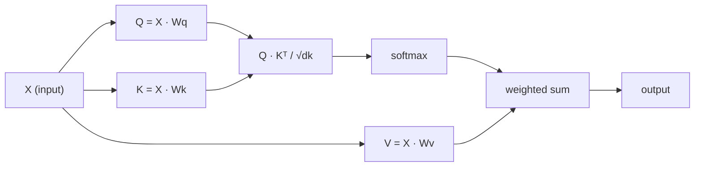

# Özdeyişle

> Dikkat bir soru sorgu şeklidir, her kelimenin bir sonucu vardır:

**类型：**Yapım
**语言：**Python
**先修要求：**3 (Depth Learning Core), 5 (Sequence to Sequence) 10. Ders
**时间：**~ 90 dakika

## Öğrenme hedefi

- 仅使用 NumPy 从零实现 查询/key/value 投影和 softmax 加权求和
- 构建多头注意层,用于拆分头、计算并行注意,并拼接结果
-                                                                                                                                                                                                                                                                                                                                                                                                                                                                                                                              
- 应用因果掩饰,将双向关注 转换为autoregressive(decoder-style) dikkat

## 问题

RNN'ler bir Token'i bir kez işledi. 50 Token'e ulaştığında, 1. Token'den gelen bilgiler 50 kez sıkıştırılmıştır. Uzun mesafe bağımlılığı, sabit büyüklükte bir gizli duruma sıkıştırılır.

2014 Bahdanau dikkat 论文 展示了解如何:让解码器回看每个编码器位置,并判断哪些位置对当前步骤重要――但它仍然附在RNN 上的――2017 "Atention Is All You Need" makale daha akıcı bir soru ortaya koydu: eğer dikkat tek* mekanizmadırsa?

Kendine dikkat et 序列deki her pozisyonun tek bir paralel adım içinde diğer her konumlara katılabilmesine izin ver  İşte bu, transformörlerin 快速、可扩展且占占主地位的原因

## 概念

### Veriler Kaynağı Sorguları

Dikkatinizi bir yumuşak veri tabanı sorgu olarak düşünün:

```
Traditional database:
  Query: "capital of France"  -->  exact match  -->  "Paris"

Attention:
  Query: "capital of France"  -->  similarity to ALL keys  -->  weighted blend of ALL values
```

Her bir simge üç vektör üretir:
- **Query (Q)**Ne arıyorum?
- **Key (K)**Ne içermektedir?
- **Value (V)**Seçilirse, ne bilgi vereceğim?

Bir sorgu tüm anahtarların nokta ürünü ile dikkat puanları elde eder.

### Bilgisayar

Her bir simgeyi yerleştirmek için üç tane ağırlık matrisine ulaşılacak:

```
Input embeddings (sequence of n tokens, each d-dimensional):

  X = [x1, x2, x3, ..., xn]       shape: (n, d)

Three weight matrices:

  Wq  shape: (d, dk)
  Wk  shape: (d, dk)
  Wv  shape: (d, dv)

Projections:

  Q = X @ Wq    shape: (n, dk)      each token's query
  K = X @ Wk    shape: (n, dk)      each token's key
  V = X @ Wv    shape: (n, dv)      each token's value
```

Görüşümden bakıldığında, bir Token için:

```
             Wq
  x_i ------[*]------> q_i    "What am I looking for?"
       |
       |     Wk
       +----[*]------> k_i    "What do I contain?"
       |
       |     Wv
       +----[*]------> v_i    "What do I offer?"
```

### Dikkat Matrisi

Tüm Tokenlerin Q,K,V, dikkat puanları elde ettikten sonra bir Matrix oluşturacak:

```
Scores = Q @ K^T    shape: (n, n)

              k1    k2    k3    k4    k5
        +-----+-----+-----+-----+-----+
   q1   | 2.1 | 0.3 | 0.1 | 0.8 | 0.2 |   <- how much q1 attends to each key
        +-----+-----+-----+-----+-----+
   q2   | 0.4 | 1.9 | 0.7 | 0.1 | 0.3 |
        +-----+-----+-----+-----+-----+
   q3   | 0.2 | 0.6 | 2.3 | 0.5 | 0.1 |
        +-----+-----+-----+-----+-----+
   q4   | 0.9 | 0.1 | 0.4 | 1.7 | 0.6 |
        +-----+-----+-----+-----+-----+
   q5   | 0.1 | 0.3 | 0.2 | 0.5 | 2.0 |
        +-----+-----+-----+-----+-----+

Each row: one token's attention over the entire sequence
```

Bir kez bakın bir sorgu nasıl tüm anahtarları tarayın: Her satır her bir simgeyi 打分,softmax verir, puanları  ağırlıklara çevirir, bağlam vektörü ise değerlerin artışını oluşturuyor.

```figure
attention-matrix
```

### Neden küçülüyorsun?

D.D. = 64, d.D.D. ürünleri birkaç dilimde olabilirse, yumuşak maksimumı Gradient  kayboluyor bölgeye sokun.

```
Scaled scores = (Q @ K^T) / sqrt(dk)
```

Bu sayıyı kullanışlı derecelerin aralığında yumuşak maksimum olarak tutacaktır.

### Softmax puanları ağırlıklara dönüştürecek

Softmax 会将原始分 转换为每一行概率分布:

```
Raw scores for q1:   [2.1, 0.3, 0.1, 0.8, 0.2]
                            |
                         softmax
                            |
Attention weights:   [0.52, 0.09, 0.07, 0.14, 0.08]   (sums to ~1.0)
```

Şimdi, her token bir grup ağırlık var, diğer her token'a katılmak gerektiği anlamına geliyor.

### Değerler

Her bir simge son çıkışı tüm değer vektörlerinin artış ve:

```
output_i = sum( attention_weight[i][j] * v_j  for all j )

For token 1:
  output_1 = 0.52 * v1 + 0.09 * v2 + 0.07 * v3 + 0.14 * v4 + 0.08 * v5
```

### 完整流程



Birçe formül:

```
Attention(Q, K, V) = softmax( Q @ K^T / sqrt(dk) ) @ V
```

```figure
softmax-attention-scaling
```

## Yapın onu.

### 步骤 1: Softmax'ı sıfırdan gerçekleştirmek

Softmax 会将原始logits 转换为概率──数值稳定性, önce en büyük değerini indirir──

```python
import numpy as np

def softmax(x):
    shifted = x - np.max(x, axis=-1, keepdims=True)
    exp_x = np.exp(shifted)
    return exp_x / np.sum(exp_x, axis=-1, keepdims=True)

logits = np.array([2.0, 1.0, 0.1])
print(f"logits:  {logits}")
print(f"softmax: {softmax(logits)}")
print(f"sum:     {softmax(logits).sum():.4f}")
```

### 步骤 2:Dok ürün dikkatinin ölçeklendirilmesi

核心函数──接收 Q、K、V matrisleri,并返回注意输出 和重量矩阵──

```python
def scaled_dot_product_attention(Q, K, V):
    dk = Q.shape[-1]
    scores = Q @ K.T / np.sqrt(dk)
    weights = softmax(scores)
    output = weights @ V
    return output, weights
```

### 步骤 3:带学习投影'ın Kendi dikkat sınıfı

Bir tam kendi dikkat modülü, Xavier gibi ölçekleme başlangıç Wq、Wk、Wv ağırlık matrisleri kullanımı içerir.

```python
class SelfAttention:
    def __init__(self, d_model, dk, dv, seed=42):
        rng = np.random.default_rng(seed)
        scale = np.sqrt(2.0 / (d_model + dk))
        self.Wq = rng.normal(0, scale, (d_model, dk))
        self.Wk = rng.normal(0, scale, (d_model, dk))
        scale_v = np.sqrt(2.0 / (d_model + dv))
        self.Wv = rng.normal(0, scale_v, (d_model, dv))
        self.dk = dk

    def forward(self, X):
        Q = X @ self.Wq
        K = X @ self.Wk
        V = X @ self.Wv
        output, weights = scaled_dot_product_attention(Q, K, V)
        return output, weights
```

### 4 adım: Bir cümle üzerinde çalışmak

Bir cümle yaratmak için sahte yerleşimler,并观察注意重量──

```python
sentence = ["The", "cat", "sat", "on", "the", "mat"]
n_tokens = len(sentence)
d_model = 8
dk = 4
dv = 4

rng = np.random.default_rng(42)
X = rng.normal(0, 1, (n_tokens, d_model))

attn = SelfAttention(d_model, dk, dv, seed=42)
output, weights = attn.forward(X)

print("Attention weights (each row: where that token looks):\n")
print(f"{'':>6}", end="")
for token in sentence:
    print(f"{token:>6}", end="")
print()

for i, token in enumerate(sentence):
    print(f"{token:>6}", end="")
    for j in range(n_tokens):
        w = weights[i][j]
        print(f"{w:6.3f}", end="")
    print()
```

### 步骤 5: ASCII ısı haritasını kullan 可視化 Dikkat

Gözlem ve dikkat ağırlıklarını 映射为字符,快速获得视觉结果──

```python
def ascii_heatmap(weights, tokens, chars=" ░▒▓█"):
    n = len(tokens)
    print(f"\n{'':>6}", end="")
    for t in tokens:
        print(f"{t:>6}", end="")
    print()

    for i in range(n):
        print(f"{tokens[i]:>6}", end="")
        for j in range(n):
            level = int(weights[i][j] * (len(chars) - 1) / weights.max())
            level = min(level, len(chars) - 1)
            print(f"{'  ' + chars[level] + '   '}", end="")
        print()

ascii_heatmap(weights, sentence)
```

## Kullan

PyTorch'in `nn.MultiheadAttention`Yapmamız gereken şey tam da bir çok başlı bölünme ve çıkış projesi.

```python
import torch
import torch.nn as nn

d_model = 8
n_heads = 2
seq_len = 6

mha = nn.MultiheadAttention(embed_dim=d_model, num_heads=n_heads, batch_first=True)

X_torch = torch.randn(1, seq_len, d_model)

output, attn_weights = mha(X_torch, X_torch, X_torch)

print(f"Input shape:            {X_torch.shape}")
print(f"Output shape:           {output.shape}")
print(f"Attention weight shape: {attn_weights.shape}")
print(f"\nAttn weights (averaged over heads):")
print(attn_weights[0].detach().numpy().round(3))
```

关键区别:multi-head attention 会并行运行多个注意功能,每个都有自己的Q、K、V投影,大小为 dk = d_model / n_heads,然后拼接结果──这让模型能够同时参加到不同类型的关系──

## - Söyle.

Bu ders:
- `outputs/prompt-attention-explainer.md`- Bir veri tabanı sorgu sınıfı açıklamak için Dikkat çabuk

## 练习

1. 修改 `scaled_dot_product_attention`, bunu seçilebilir bir maskesi matrisi kabul et, softmax  önce bazı konumları negatif olarak ayarlanacaktır.
2. Çoğu başlı dikkatin gerçekleşmesini de çerez Q、K、V                                                                                                                                                                                                                                                                                                                                                                                                                                                                                                              `n_heads`个块,在每个块上运行注意,拼接,并通过最终重量矩阵 Wo 投影
3. Aynı uzunlukta iki farklı cümleyi alın, onları aynı SelfAttention örneğine ekleyin ve dikkat kalıplarını karşılaştırın.

## 关键术语

| Term | 人们常说 | 实际含义 |
|------|----------------|----------------------|
| Query (Q) | “问题 Vector” | 输入的一个学习投影，表示这个 Token 正在寻找什么信息 |
| Key (K) | “标签 Vector” | 一个学习投影，表示这个 Token 包含什么信息，并会与 queries 进行匹配 |
| Value (V) | “内容 Vector” | 一个学习投影，携带会基于 attention scores 被聚合的实际信息 |
| Scaled dot-product attention | “Attention 公式” | softmax(QK^T / sqrt(dk)) @ V - 缩放可以防止高维中的 softmax 饱和 |
| Self-attention | “Token 看自己和其他 Token” | Q、K、V 都来自同一序列的 Attention，让每个位置都能 attend 到其他每个位置 |
| Attention weights | “关注程度” | 位置上的概率分布，由 scaled dot products 上的 softmax 产生 |
| Multi-head attention | “并行 Attention” | 使用不同 projections 运行多个 attention functions，然后拼接结果，以获得更丰富的 representations |

## 延伸阅读

- [Attention Is All You Need (Vaswani et al., 2017)](https://arxiv.org/abs/1706.03762)- 原始 dönüştürücü 论文
- [The Illustrated Transformer (Jay Alammar)](https://jalammar.github.io/illustrated-transformer/)- Tam yapı için en iyi görülebilir açıklama
- [The Annotated Transformer (Harvard NLP)](https://nlp.seas.harvard.edu/annotated-transformer/)- 带解释的逐行 PyTorch 实现
