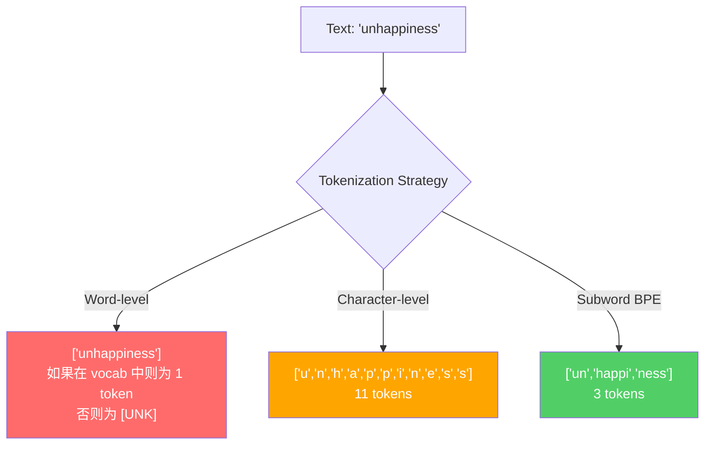
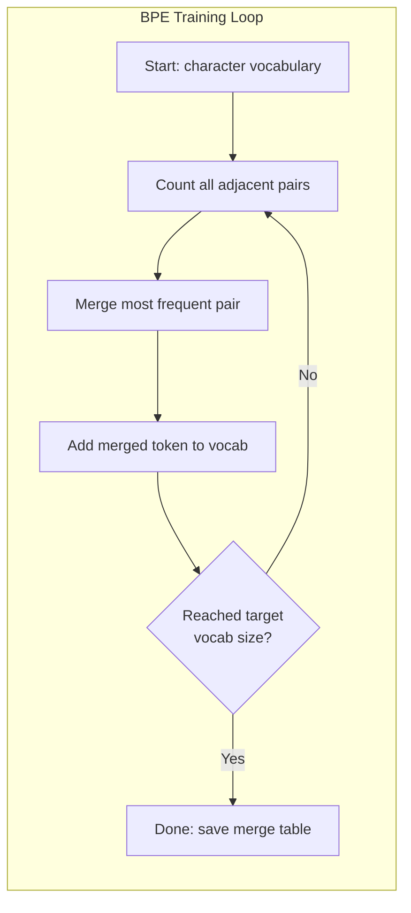
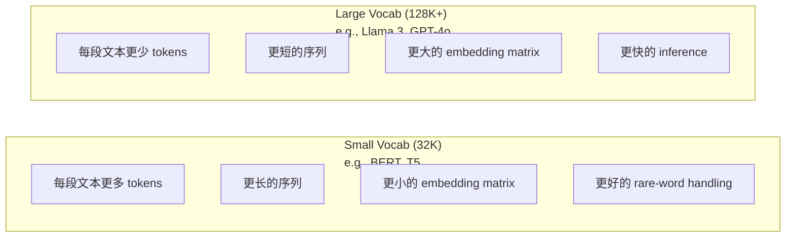

# Tokenizers: BPE, WordPiece, SentencePiece

> Bu sayıları kullanmak için bir değer veya bir harcama belirlenir.

**Type:** Build
**Languages:** Python
**Prerequisites:** Phase 05 (NLP Foundations)
**Time:** ~90 minutes

## Öğrenme hedefi
- BPE 、WordPiece 、 Unigram tokenizasyon algoritmaları, ve onların birleşme stratejilerini karşılaştırma
- 解释词汇大小会产生长序列, 过大会浪费嵌入参数
- 分析不同语言和代码中的代码化文物,识别特定代码化者 在哪里失效
- Tiktoken ve cümle parçaları kütüphaneleri kullanmak, metin için token oluşturmak, ve oluşturulan token kimliklerini kontrol etmek

## 问题
Senin LLM'nin İngilizce okumayı.

"Merhaba dünya!"'den [15496, 11, 995, 0]'a kadar olan fark, Tokenizer'dir. Her kelime, her boşluk, her işaret noktası, önce tam sayıya dönüştürülmelidir, model onu işlemek için. Bu dönüşüm ortalama değildir.

Eğer burada bir hata yaparsanız, model bir çok token ile kodlama kapasitesini kaybedecektir. "Ne yazık ki" bir değil dört token haline gelir. "çok sesli bir metin için, 128K bağlam pencereniz aslında %75'e kısaldı.

GPT-4 veya Claude'un 发起的每一次API电话,都是按 Token 定价――模型生成的每个 Token都会消耗计算――表示一个输出所需的 Tokens 越少,端到端推断 就越快――Tokenization不是预处理――它是建筑――

## 概念
### Üç türlü başarısızlık yöntemleri (sadece bir şekilde kazanmak için)

Metni sayıya dönüştürmek için üç açık yöntem vardır. Bunlardan ikisi de ölçeklenemez.

**Word-level tokenization**按空格和标点切分──"Kedi oturdu" 会变成 ["The", "cat", "sat"]──很简单──但是"tokenization" 怎么办?"GPT-4o" 呢?或像"Geschwindigkeitsbegrenzung" 这样德语复合词呢?`[UNK]`Token --------- bu modelde konuşuyor  我完全不知道这是什么──------ sadece İngilizce'de bir milyondan fazla kelime şekli vardır.

**Character-level tokenization**走向另一个方向──"hello" 会变成 ["h", "e", "l", "l", "o"]──Vokabulary 很小(几百个字符)──永远不会有未知代币──但序列会变得极长──一个本来就是10个字级代币的句子,会变成50个字级代币──模型必须学会"t"、"h"、"e" 放在一起表示"the" ----把注意能力消耗在一个人类三岁就能学会的东西上──

**Subword tokenization**找到了平衡点──常见词保持完整:"the" 是一个 Token──罕见词会分解成有意的片段:"不快乐" 变成 ["un", "happy", "ness"]──词典 保持可控(30K~128K jetonları)──序列保持较短──未知 jetonları 基本消失,因为任何词都可以由子词碎片构建出来──

Her modern LLM'de alt sözcük tokenizasyonu kullanılıyor. GPT-2、GPT-4、BERT、Llama 3、Claude -- 全都是── soru hangi algoritma kullanmakla ilgilidir.



### BPE: Byte çift kodlama

BPE, daha sonra tekrar tokenizasyon için kullanılmış bir algoritma.

Tek karakterden başlamak için, her komşu çiftin bir tek token haline birleşmesi için, hedef kelime birikimi boyutuna ulaşıncaya kadar, bu süreci tekrar tekrar yapın.

Aşağıda, "en düşük" ̳En düşük" ve "en yeni" içeren çok küçük bir korpusda çalışan BPE'ler bulunmaktadır:

```
Corpus（带 word frequencies）:
  "lower"  x5
  "lowest" x2
  "newest" x6

Step 0 -- 从字符开始:
  l o w e r       (x5)
  l o w e s t     (x2)
  n e w e s t     (x6)

Step 1 -- 统计相邻 pairs:
  (e,s): 8    (s,t): 8    (l,o): 7    (o,w): 7
  (w,e): 13   (e,r): 5    (n,e): 6    ...

Step 2 -- Merge 最高频 pair (w,e) -> "we":
  l o we r        (x5)
  l o we s t      (x2)
  n e we s t      (x6)

Step 3 -- 重新统计并 merge (e,s) -> "es":
  l o we r        (x5)
  l o we s t      (x2)    <- 'es' 只由 'e'+'s' 形成，不是 'we'+'s'
  n e we s t      (x6)    <- 等等，'we' 前面有 'e'，'we' 后面有 's'

实际精确跟踪如下:
  在 "we" merge 之后，剩余 pairs:
  (l,o): 7   (o,we): 7   (we,r): 5   (we,s): 8
  (s,t): 8   (n,e): 6    (e,we): 6

Step 3 -- Merge (we,s) -> "wes" 或 (s,t) -> "st"（同为 8，选第一个）:
  Merge (we,s) -> "wes":
  l o we r        (x5)
  l o wes t       (x2)
  n e wes t       (x6)

Step 4 -- Merge (wes,t) -> "west":
  l o we r        (x5)
  l o west        (x2)
  n e west        (x6)

...继续，直到达到目标 vocab size。
```

Birleştirme tablosu budur Tokenizer. Yeni metin kodlanması gerekir, birleştirme işleminin sırasıyla öğrenilmelidir.



### Bite seviyesindeki BPE (GPT-2, GPT-3, GPT-4)

Standart BPE, Unicode karakterlerinde üstü çalışmaktadır. Bu size 256 temel kelime birikimi verir, herhangi bir dil veya kodlama işleyebilir ve asla bilinmeyen bir token üretmez.

GPT-2 bu yöntemi tanıttı. temel sözlükleri kapsamaktadır. BPE, bu sözlük boyutlarını kullanarak, OpenAI'nin tiktoken kütüphanesi tarafından yapılandırılmıştır.

- GPT-2: 50.257 token
- GPT-3.5/GPT-4: ~100,256 token (cl100k_base kodlaması)
- GPT-4o: 200,019 token (o200k_base kodlaması)

### WordPiece (BERT)

WordPiece BPE'ye benzer görünüyor, ancak birleşme yönteminin farklı olması için seçilir.

```
BPE merge criterion:      count(A, B)
WordPiece merge criterion: count(AB) / (count(A) * count(B))
```

BPE  soruları:  Hangi çift en sık ortaya çıkıyor?  WordPiece  soruları:  Hangi çiftin ortaya çıkma sıklığı rastgele durumların beklenmesinden daha yüksek?  Bu küçük fark farklı kelime depoları oluşturur.

WordPiece ayrıca devamı alt kelimeleri göstermek için "##" önlüğünü kullanıyor:

```
"unhappiness" -> ["un", "##happi", "##ness"]
"embedding"   -> ["em", "##bed", "##ding"]
```

"##" önlüğü  tell you this piece 延续前一个 Token──BERT WordPiece kullanın, sözlük 30,522 token için var.

### CezaBöğüt (Llama, T5)

SentencePiece 流, boş boş karakterler içerir. Öntanımlı bir tokenizasyon aşaması yoktur. Sözcük sınırı hakkında belirli dil kuralları yoktur. Bu, onu gerçekten dil-agnostik hale getirir.

SentencePiece 支持两种算法:
- **BPE mode**BPE standartına benzer bir birleşme mantığı, orijinal karakter sırası için kullanılır
- **Unigram mode**Bir büyük kelime hazinesinden  başlayın, sonra 代移除对整体概率 影响最小的代币──BPE'nin ters yönüdür.

Llama 2 kullanı cümlePiece BPE, sözlüklük için 32.000 token, T5 kullanı cümlePiece Unigram, sözlük için 32.000 token, Not:Llama 3 切换到了基于Tik Token的字节级 BPE Tokenizer,包含128.256 token,──

### Sözlük Boyutu Aralıklar

Bu gerçek bir tasarım kararı ve ölçülebilir sonuçlar vardır.



具体数字── 128K kelimeforumu için 和 4,096 维 embedings, sadece embeding matrisi için 128,000 x 4,096 = 5.24 milyar parametredir── 32K kelimeforumu için ise 1,31 milyar parametredir── sadece Tokenizer 选择不同,就会产生 400M parametresi fark──

Ancak daha büyük kelime hazineleri daha da yoğunlaşacak. 32K kelime hazinesiyle 100 token gerekebilir, 128K kelime hazinesiyle sadece 70 token gerekebilir. Bu, ırkın ırkın ırkın ırkın ırkın ırkın ırkın ırkın ırkın ırkın ırkın ırkın ırkın ırkın ırkın ırkın ırkın ırkın ırkın ırkın ırkın ırkın ırkın ırkın ırkın ırkın ırkın ırkın ırkın ırkın ırkın ırkın ırkın ırkın ırkın ırkın ırkın ırkın ırkın ırkın ırkın ırkın ırkın ırkın ırkın ırkın ırkın ırkın ırkın ırkın ırkın ırkın ırkın ırkın ırkın ırkın ırkın ırkın ırkın ırkın ırkın ırkın ırkın ırkın ırkın ırkın ırkın ırkın ırkın ırkın ırkın ırkın ırkın ırkın ırkın ırkın ırkın ırkın ırkın ırkın ırkın ırkın ırkın ırkın ırk ırkın ırk ırk ırk ırk ırk ırk ırk ırk ırk ırk ırk ırk ırk ırk ırk ırk ırk ırk ırk ırk ırk ırk ırk ırk ırk ırk ırk ırk ırk ırk ırk ırk ırk ırk ırk ırk ırk ırk

趋势很明确:语句库大小 正在增长──GPT-2 使用 50,257──GPT-4 使用 ~100K──Llama 3 使用 128K──GPT-4o 使用 200K──

| Model | Vocab Size | Tokenizer Type | Avg Tokens per English Word |
|-------|-----------|----------------|---------------------------|
| BERT | 30,522 | WordPiece | ~1.4 |
| GPT-2 | 50,257 | Byte-level BPE | ~1.3 |
| Llama 2 | 32,000 | SentencePiece BPE | ~1.4 |
| GPT-4 | ~100,256 | Byte-level BPE | ~1.2 |
| Llama 3 | 128,256 | Byte-level BPE (tiktoken) | ~1.1 |
| GPT-4o | 200,019 | Byte-level BPE | ~1.0 |

### Çok Dilli Vergi

Başlıca İngilizce dayalı Tokenizers diğer dillere karşı çok kötüdür. GPT-2 Tokenizer'de ortalama her kelime 2-3 token gerektirir.

İşte Llama 3'ün sözlük birikmesini 32K'den 128K'ye genişletmesinin nedeni budur.


```figure
tokenizer-bpe
```

```figure
tokenizer-tradeoff
```

## Yapın onu.
### 步骤 1: Karakter seviyesindeki Tokenizer

Temelden başlamak. Karakter seviyeli Tokenizer her karakterin Unicode kod noktasına yerleştirilir.

```python
class CharTokenizer:
    def encode(self, text):
        return [ord(c) for c in text]

    def decode(self, tokens):
        return "".join(chr(t) for t in tokens)
```

"Merhaba" dönüşecek [104, 101, 108, 108, 111].

### 步骤 2: BPE Tokenizer İptalden

Gerçek gerçekleşme── 我们在原始字节上训练(像GPT-2 一样),统计对,合并 最频繁的对,并按顺序记录每一次合并──合并表就是Tokenizer──

```python
from collections import Counter

class BPETokenizer:
    def __init__(self):
        self.merges = {}
        self.vocab = {}

    def _get_pairs(self, tokens):
        pairs = Counter()
        for i in range(len(tokens) - 1):
            pairs[(tokens[i], tokens[i + 1])] += 1
        return pairs

    def _merge_pair(self, tokens, pair, new_token):
        merged = []
        i = 0
        while i < len(tokens):
            if i < len(tokens) - 1 and tokens[i] == pair[0] and tokens[i + 1] == pair[1]:
                merged.append(new_token)
                i += 2
            else:
                merged.append(tokens[i])
                i += 1
        return merged

    def train(self, text, num_merges):
        tokens = list(text.encode("utf-8"))
        self.vocab = {i: bytes([i]) for i in range(256)}

        for i in range(num_merges):
            pairs = self._get_pairs(tokens)
            if not pairs:
                break
            best_pair = max(pairs, key=pairs.get)
            new_token = 256 + i
            tokens = self._merge_pair(tokens, best_pair, new_token)
            self.merges[best_pair] = new_token
            self.vocab[new_token] = self.vocab[best_pair[0]] + self.vocab[best_pair[1]]

        return self

    def encode(self, text):
        tokens = list(text.encode("utf-8"))
        for pair, new_token in self.merges.items():
            tokens = self._merge_pair(tokens, pair, new_token)
        return tokens

    def decode(self, tokens):
        byte_sequence = b"".join(self.vocab[t] for t in tokens)
        return byte_sequence.decode("utf-8", errors="replace")
```

Eğitim döngüsü BPE'nin merkezi: statistik çiftler, birleşim 胜出的 çift,重复── her birleşim şehir toplam token sayısını azaltır──经过`num_merges`轮 sonra, sözcüklük 256  baz bayttan 256  + num_merges 

Kodlama, öğrenilene göre gerçekleşecek. Bu çok önemlidir. Eğer 1 'th' oluşturursa, 5 'e' oluşturursa, kodlama önce 1 'e'yi birleştirmekle birlikte 5 'den 'th' + 'e' oluşur.

Çözümleme bir ters süreçtir: Sözlükte her bir token kimliğini, bağlantı bytesini bulmak ve sonra UTF-8 olarak çözmek için.

### 步骤 3: Encode ve Decode Roundtrip

```python
corpus = (
    "The cat sat on the mat. The cat ate the rat. "
    "The dog sat on the log. The dog ate the frog. "
    "Natural language processing is the study of how computers "
    "understand and generate human language. "
    "Tokenization is the first step in any NLP pipeline."
)

tokenizer = BPETokenizer()
tokenizer.train(corpus, num_merges=40)

test_sentences = [
    "The cat sat on the mat.",
    "Natural language processing",
    "tokenization pipeline",
    "unhappiness",
]

for sentence in test_sentences:
    encoded = tokenizer.encode(sentence)
    decoded = tokenizer.decode(encoded)
    raw_bytes = len(sentence.encode("utf-8"))
    ratio = len(encoded) / raw_bytes
    print(f"'{sentence}'")
    print(f"  Tokens: {len(encoded)} (from {raw_bytes} bytes) -- ratio: {ratio:.2f}")
    print(f"  Roundtrip: {'PASS' if decoded == sentence else 'FAIL'}")
```

Sıkıştırma oranı  tell you Tokenizer has more effective──ratio 为 0.50 表示 Tokenizer will text compress to original bytes One half of the amount of Tokens──越低越好──在训练 corpus上,ratio 会很好──在"neşane" Bu tür dağıtım dışı 文本上(on appeared in corpus on),ratio 会更差 -- Tokenizer 会对未见的模式回归到字符级编码──

### 步骤 4: Tiktoken ile karşılaştır

```python
import tiktoken

enc = tiktoken.get_encoding("cl100k_base")

texts = [
    "The cat sat on the mat.",
    "unhappiness",
    "Hello, world!",
    "def fibonacci(n): return n if n < 2 else fibonacci(n-1) + fibonacci(n-2)",
    "Geschwindigkeitsbegrenzung",
]

for text in texts:
    our_tokens = tokenizer.encode(text)
    tiktoken_tokens = enc.encode(text)
    tiktoken_pieces = [enc.decode([t]) for t in tiktoken_tokens]
    print(f"'{text}'")
    print(f"  Our BPE:   {len(our_tokens)} tokens")
    print(f"  tiktoken:  {len(tiktoken_tokens)} tokens -> {tiktoken_pieces}")
```

tiktoken tamamen aynı algoritmayı kullanır, ancak 100 GB 文本 üzerinde eğitilmiştir, ve 100.000 合并 içerir.

### 步骤 5: Sözlük Analizi

```python
def analyze_vocabulary(tokenizer, test_texts):
    total_tokens = 0
    total_chars = 0
    token_usage = Counter()

    for text in test_texts:
        encoded = tokenizer.encode(text)
        total_tokens += len(encoded)
        total_chars += len(text)
        for t in encoded:
            token_usage[t] += 1

    print(f"Vocabulary size: {len(tokenizer.vocab)}")
    print(f"Total tokens across all texts: {total_tokens}")
    print(f"Total characters: {total_chars}")
    print(f"Avg tokens per character: {total_tokens / total_chars:.2f}")

    print(f"\nMost used tokens:")
    for token_id, count in token_usage.most_common(10):
        token_bytes = tokenizer.vocab[token_id]
        display = token_bytes.decode("utf-8", errors="replace")
        print(f"  Token {token_id:4d}: '{display}' (used {count} times)")

    unused = [t for t in tokenizer.vocab if t not in token_usage]
    print(f"\nUnused tokens: {len(unused)} out of {len(tokenizer.vocab)}")
```

Bu, sözlükte Zipf dağılımını ortaya çıkarır. Az sayıda Token 占占占占主导(空格、"the"、"e") ❖ Çoğu Token 很少使用──生产级 Tokenizers 会围绕这个分布进行优化-- 常见模式 获得较短的代号ID,罕见模式 使用更长的表示──

## Kullan
Senin çizik BPE'nin işe yarayabilir. Şimdi de yapım sınıfının aletlerinin nasıl olduğunu gör.

### tiktoken (OpenAI)

```python
import tiktoken

enc = tiktoken.get_encoding("cl100k_base")

text = "Tokenizers convert text to integers"
tokens = enc.encode(text)
print(f"Tokens: {tokens}")
print(f"Pieces: {[enc.decode([t]) for t in tokens]}")
print(f"Roundtrip: {enc.decode(tokens)}")
```

tiktoken kullanır Rust 编写,并提供 Python bindings──它每秒可编码数百万代币──同样BPE算法,工业级实现──

### Kucaklayan Yüz Tokenizeri

```python
from tokenizers import Tokenizer
from tokenizers.models import BPE
from tokenizers.trainers import BpeTrainer
from tokenizers.pre_tokenizers import ByteLevel

tokenizer = Tokenizer(BPE())
tokenizer.pre_tokenizer = ByteLevel()

trainer = BpeTrainer(vocab_size=1000, special_tokens=["<pad>", "<eos>", "<unk>"])
tokenizer.train(["corpus.txt"], trainer)

output = tokenizer.encode("The cat sat on the mat.")
print(f"Tokens: {output.tokens}")
print(f"IDs: {output.ids}")
```

Üst katı Rust'tir. Bir kaç saniye içinde GB seviyesinde kurumlar üzerinde çalıştırılabilir.

### Llama'nın Tokenizer'ini yükleniyor

```python
from transformers import AutoTokenizer

tokenizer = AutoTokenizer.from_pretrained("meta-llama/Llama-3.1-8B")

text = "Tokenizers are the unsung heroes of LLMs"
tokens = tokenizer.encode(text)
print(f"Token IDs: {tokens}")
print(f"Tokens: {tokenizer.convert_ids_to_tokens(tokens)}")
print(f"Vocab size: {tokenizer.vocab_size}")

multilingual = ["Hello world", "Hola mundo", "Bonjour le monde"]
for text in multilingual:
    ids = tokenizer.encode(text)
    print(f"'{text}' -> {len(ids)} tokens")
```

Llama 3'ün 128K kelime havuzu, İngilizce olmayan metinlerin sıkıştırılmasına göre GPT-2'nin 50K kelime havuzundan açıkça daha iyidir. Bunu kendiniz de doğrulayabilirsiniz.

## - Söyle.
本课会产 出 `outputs/prompt-tokenizer-analyzer.md`-- Bir tekrarlanabilir ipucu, herhangi bir metin ve model kombinasyonunun işaretlenme verimliliğini analiz etmek için kullanılır.

## 练习
1. 修改 BPE Tokenizer,让它在每个 merge step 打印词汇――观察 "t" + "h" 如何变成 "th",然后 "th" + "e" 如何变成 "the"――跟踪常见英文词如何一步组装出来──

2. 向 BPE Tokenizer 添加 özel tokenlar(`<pad>`- Evet.`<eos>`- Evet.`<unk>`)。 Onlara 0、1、2 kimliklerini dağıtmak,并相应地移动所有其他 Tokens── BPE 运行前白空切分── bir önceden tokenizasyon aşamasını gerçekleştirmek.

3. 实现 WordPiece merge kriterini(frequency yerine olasılıkla oran kullanmak) ―― aynı korpus üzerinde, aynı birleştirme sayı antrenmanı ile BPE ve WordPiece── oluşturulan kelime birikmelerini karşılaştırmak - 哪一个产生的子词在语言学上更有意义?

4. 构建一个多语言 Tokenizer效率基准――选取英语、西班牙语、中文、韩语和阿拉伯语各 10 个句子──使用tiktoken(cl100k_base) 对每个句子进行代码,并测量平均每字符 Tokens──量化每种语言的"多语言税"──

5. Daha büyük bir korpusda BPE Tokenizerinizi eğitmek için, aynı metinde bir sıkıştırma oranı elde etmek için birleştirme numarasını düzenleyin. Bu, korpus boyutunun, birleştirme sayısının ve sıkıştırma kalitesinin arasındaki ilişkiyi anlamanızı zorlayacaktır.

## 关键术语
| Term | What people say | What it actually means |
|------|----------------|----------------------|
| Token | “一个词” | 模型 vocabulary 中的一个单元 -- 可以是字符、subword、word，或 multi-word chunk |
| BPE | “某种压缩东西” | Byte Pair Encoding -- 迭代 merge 出现最频繁的相邻 token pair，直到达到目标 vocabulary size |
| WordPiece | “BERT 的 Tokenizer” | 类似 BPE，但 merges 最大化 likelihood ratio count(AB)/(count(A)*count(B))，而不是原始 frequency |
| SentencePiece | “一个 Tokenizer library” | 一种 language-agnostic Tokenizer，在没有 pre-tokenization 的情况下直接处理原始 Unicode，并支持 BPE 和 Unigram algorithms |
| Vocabulary size | “它知道多少词” | 唯一 Tokens 的总数：GPT-2 有 50,257，BERT 有 30,522，Llama 3 有 128,256 |
| Fertility | “不是 Tokenizer 术语” | 每个词的平均 Tokens 数 -- 衡量 Tokenizer 在不同语言上的效率（1.0 是理想值，3.0 表示模型要多工作三倍） |
| Byte-level BPE | “GPT 的 Tokenizer” | 在原始 bytes（0-255）而不是 Unicode characters 上运行的 BPE，保证任何输入都不会产生 unknown tokens |
| Merge table | “Tokenizer 文件” | 训练期间学习到的有序 pair merges 列表 -- 这就是 Tokenizer 本身，而且顺序很重要 |
| Pre-tokenization | “按空格切分” | 在 subword tokenization 之前应用的规则：whitespace splitting、digit separation、punctuation handling |
| Compression ratio | “Tokenizer 有多高效” | 生成的 Tokens 数除以输入 bytes 数 -- 越低表示压缩越好，inference 越快 |

## 延伸阅读
- [Sennrich et al., 2016 -- "Neural Machine Translation of Rare Words with Subword Units"](https://arxiv.org/abs/1508.07909)Bu makale BPE'yi NLP'ye soktu ve 1994'te üretilen bir basınç algoritmasını modern tokenizeleme temeline dönüştürdü.
- [Kudo & Richardson, 2018 -- "SentencePiece: A simple and language independent subword tokenizer"](https://arxiv.org/abs/1808.06226)-- dil-agnostik tokenizasyon, çok dilli modeller 变得实用
- [OpenAI tiktoken repository](https://github.com/openai/tiktoken)-- 用 Rust 编写并带有Python绑定的生产级 BPE 实现, 由 GPT-3.5/4/4o 使用
- [Hugging Face Tokenizers documentation](https://huggingface.co/docs/tokenizers)-- 具備                                                                                                                                                                                                                                                             
