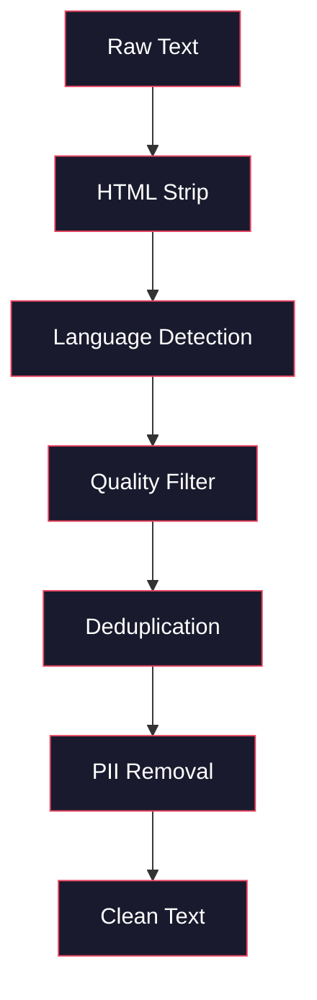
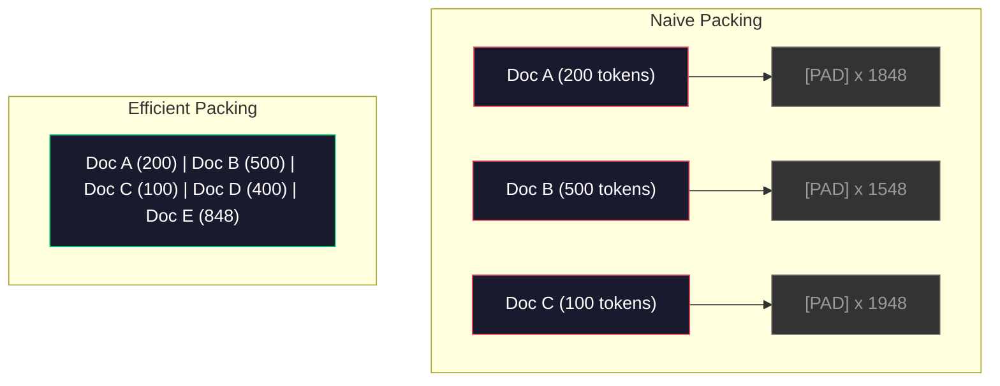

# Ön Eğitim Veriler

> Model bir ayna. Sana verdiğin herhangi bir veriyi yansıtır.

**Type:** Build
**Languages:** Python
**Prerequisites:** Phase 10, Lessons 01-02 (Tokenizers, Building a Tokenizer)
**Time:** ~90 minutes

## Öğrenme hedefi

- string veri borusu oluşturmak, tüm verileri kayda yükleme durumunda, TB seviyesindeki metinleri tokenize 、切块、shuffle 和 batch yapmak
- 实现真实预训管线 中使用的数据质量过器(duplication、language detection、content filtration)
- 创建固定长度训练序列,并正确处理注意面具 和文档边界
- Profil boru geçiş, veri yüklemeci 能跟上 GPU 训练速度

## 问题

Bir Tokenizer'in var. Şimdi verilere ihtiyacın var.

Bir veri kümesi değil, CSV dosyası değil, TB sınıfı: Çözüm, Dükseş, Kalite, Tokenizasyon, sabit uzunluklı bir dizi oluşturmak ve yeterli hızlı bir hızla bir seri olarak sunmak, 8 GPU 集群'unuzun bir sonraki seriyi asla beklemeyeceğini sağlamak için.

Büyük çoğunluk bir LLM'nin çekirdeğini model yapılandırması olarak düşünmüştür. Llama 3 15.6 trilyon Token kullanmıştır. GPT-3 300 trilyon kullanmıştır. DeepSeek-V2 8.1 trilyon kullanmıştır. Bu üç kişinin yapılandırması büyük ölçüde aynıdır: toplanmış Transformer blokları, Attention ve ön katları içerir.

DeepMind'in Chinchilla makalesi bunu net bir şekilde açıkladı. Verilmiş hesaplama bütçesi, model parametre sayısı ve eğitim token sayısı arasında en iyi oran var. Chinchilla gösterir ki, 2022 yılının büyük çoğunluğu modeller ciddi bir şekilde yetersiz eğitimli: görülen veri miktarına kıyasla, onların parametreleri çok fazla.

Verileriniz, öğrendiğiniz modelin dil mi, ses mi olduğuna karar verir.

## 核心概念

### Veriler nereden geliyor?

Her büyük dil modeli çeşitli kaynaklardan oluşan karışık veriler üzerinde eğitim alır. Çoğu laboratuvar için, kesin verilerin bileşimi çok gizli, ancak bu kategorileri anlayabilmemiz için yeterince şey biliyoruz.

| Source | Size | Quality | Used By |
|--------|------|---------|---------|
| Common Crawl | ~250 TB raw | 低（需要大量过滤） | GPT-3, Llama, most open models |
| Wikipedia | ~20 GB | 高 | Every major LLM |
| GitHub code | ~1 TB+ | 中等（大量重复、废弃代码） | StarCoder, CodeLlama, DeepSeek-Coder |
| Books (BookCorpus, Pile) | ~100 GB | 高 | GPT-2, GPT-3, early models |
| Academic papers (arXiv, S2ORC) | ~100 GB | STEM 领域质量高 | Llama, Galactica |
| StackOverflow, Reddit | ~100 GB | 中等 | Llama, Falcon |
| Curated web (C4, RefinedWeb) | ~5 TB | 中高（已预过滤） | T5, Falcon |

Llama 3'ün verilerinin karışık oranını açıkladı: yaklaşık %50 web verileri, %25 kod, %13 kitaplar ve akademik makaleler, %8 matematik verileri ve %4 çok dilli web verileri.

Örneğin ve toplam miktar da aynı şekilde önemlidir. Web verileri 太多,模型将成Reddit 复读机. 代码 太少,它就无法编程.

### Bilgi temizliği

İlk web verileri 很脏──一个典型的常见爬虫垃圾填埋 包含:

- HTML etiketleri ve JavaScript
- 模板化 başlıklar, ayaklar, gezinti menüleri
- 重复页面(完全重复和近似重复)
- 机器生成的垃圾邮件
- Kişisel olarak tanımlanabilir bilgiler (PII)
- 低质量文本(关键词列表、SEO spam)
- Edebiyat biçiminde kodlanan metin dışı içerik

清洗不是选项──它决定模型是生成连贯段落,还是输出混杂的产品列表的HTML标签──



Her adımında bir çeşit gürültü ortadan kalkacak:

**HTML stripping:**Tüm işaretleri kaldırın. Sadece görünen metin içeriğini koruyun.`trafilatura`Ya da`readability`Bu tür kitaplar yazılar içeriğini çıkarırken, aynı zamanda yönlendirmeyi, reklamları ve modelleştirme içeriğini terk eder.

**Language detection:**kullan fastText'in dil tanımlama modeli ({{lang-FastText}}) ({{lang-FastText}}) her dosya için sınıflandırma yapılsın.

**Quality filtering:**Bu yüzden, bu konuyla ilgili olarak, bu konuyla ilgili olarak, bu konuyla ilgili olarak, bu konuyla ilgili olarak, bu konuyla ilgili olarak, bu konuyla ilgili olarak, bu konuyla ilgili olarak, bu konuyla ilgili olarak, bu konuyla ilgili olarak, bu konuyla ilgili olarak, bu konuyla ilgili olarak, bu konuyla ilgili olarak, bu konuyla ilgili olarak, bu konuyla ilgili olarak, bu konuyla ilgili olarak, bu konuyla ilgili olarak, bu konuyla ilgili olarak, bu konuyla ilgili olarak, bu konuyla ilgili olarak, bu konuyla ilgili olarak, bu konuyla ilgili olarak, bu konuyla ilgili olarak, bu konuyla ilgili olarak, bu konuyla ilgili olarak, bu konuyla ilgili olarak, bu konuyla ilgili olarak, bu konuyla ilgili olarak, bu konuyla ilgili olarak, bu konuyla ilgili olarak, bu konuyla ilgili olarak, bu konuyla ilgili olarak, bu konuyla ilgili olarak, bu konuyla ilgili olarak, bu konuyla ilgili olarak, bu konuyla ilgili olarak, bu konuyla ilgili olarak, bu konuyla ilgili olarak, bu konuyla ilgili olarak, bu konuyla ilgili olarak, bu konuyla ilgili olarak, bu konuyla ilgili olarak, bu konuyla ilgili olarak, "Bu konuyla ilgili olarak, "Bu konuyla ilgili olarak, "Bu konuyla ilgili olarak, "Bu konuyla ilgili olarak, "Bu konuyla ilgili olarak, "bu" olarak, "Bu konuyla ilgili olarak, "Bu konuyla ilgili olarak, " (ya göre, "neyeyeyeyeyeyeyeyeyeyeyeyeyeyeyeyeyeyeyeyeyeyeyeyeyeyeyeyeyeyeyeyeyeyeyeyeyeyeyeyeyeyeyeyeyeyeyeyeyeyeyeyeyeyeyeyeyeyeyeyeyeyeyeyeyeyeyeyeyeyeyeyeyeyeyeyeyeyeyeyeyeyeyeyeyeyeyeyeyeyeyeyeyeyeyeyeyeyeyeyeyeyeyeyeyeyeyeyeyeyeyeyeyeyeyeyeyeyeyeyeyeyeyeyeyeyeyeyeyeyeyeyeyeyeyeyeyeyeyeyeyeyeyeyeye

**Deduplication:**单个最有影响的清洗步骤――Common Crawl 包含海量重复页面:法律免责声明、cookie notices、服务条款──重复数据上训练会浪费计算,并可能导致模型记忆并逐字吐出特定段落──

**PII removal:**姓名、电子邮件地址、电话号码、社会安全号码──对结构化 PII 使用基于regex的检测,对上下文中的姓名使用NER模型──

### MinHash kullanın

精确扣复 很容易:对每文档做哈希,移除重复项──但真正的问题是近似重复──两份相同新闻文章的复制,周围广告略有不同,就是近似重复──内容 95%相同,但按字节比较不一致──

MinHash + Yerel- Duyarlı Hashing (LSH) bu sorunu yüksek verimli bir şekilde çözebilir.


Düşünce:

1. **Shingling:**"Hızlı kahverengi tilki" kullanmak için 3 kelime şindil 会成 {"Hızlı kahverengi tilki", "Hızlı kahverengi tilki"}。

2. **MinHash:**Her dosyanın şingle seti için, hesap k 个 哈ッシュ 值── her 哈ッシュ 值 farklı bir 哈ッシュ işlevi altında tüm şingles ∞ ∞ ∞ ∞ ∞ ∞ ∞ ∞ ∞ ∞ ∞ ∞ ∞ ∞ ∞ ∞ ∞ ∞ ∞ ∞ ∞ ∞ ∞ ∞ ∞ ∞ ∞ ∞ ∞ ∞ ∞ ∞ ∞ ∞ ∞ ∞ ∞ ∞ ∞ ∞ ∞ ∞ ∞ ∞ ∞ ∞ ∞ ∞ ∞ ∞ ∞ ∞ ∞ ∞ ∞ ∞ ∞ ∞ ∞ ∞ ∞ ∞ ∞ ∞ ∞ ∞ ∞ ∞ ∞ ∞ ∞ ∞ ∞ ∞ ∞ ∞ ∞ ∞ ∞ ∞ ∞ ∞ ∞ ∞ ∞ ∞ ∞ ∞ ∞ ∞ ∞ ∞ ∞ ∞ ∞ ∞ ∞ ∞ ∞ ∞ ∞ ∞ ∞ ∞ ∞ ∞ ∞ ∞ ∞ ∞ ∞ ∞ ∞ ∞ ∞ ∞ ∞ ∞ ∞ ∞ ∞ ∞ ∞ ∞ ∞ ∞ ∞ ∞ ∞ ∞ ∞ ∞ ∞ ∞ ∞ ∞ ∞ ∞ ∞ ∞ ∞ ∞ ∞ ∞ ∞ ∞ ∞ ∞ ∞ ∞ ∞ ∞ ∞ ∞ ∞ ∞ ∞ ∞ ∞ ∞ ∞ ∞ ∞ ∞ ∞ ∞ ∞ ∞ ∞ ∞ ∞ ∞ ∞ ∞ ∞ ∞ ∞ ∞   ∞ ∞ ∞          ∞                                                                                                  

3. **LSH:**MinHash imzası bantına göre, dosyaları kovalara ayırın. Aynı kova içindeki dosyalar, adayların yakınlıklı tekrarlamalarıdır.

4. **Verify:**Her aday çiftine, hesaplama yapılır Jaccard benzerliği. Eğer benzerlik  değerinden fazlasa, genellikle 0.8'dir.

Llama 团队 raporuna göre, deduplasyon yoluyla  yaklaşık %38'i web verileri kaldırdılar. Bu küçük bir rakam değil.

### Sıradan Paketleme

Modeliniz, giriş sırasını sabitlemeyi bekler. Dosyalarınızın uzunluğu değişebilir. Bazıları 50 Token. Bazıları 50.000 Token.

简单做法:把每个文档pad至最大序列长度──这将在学习无贡献的填充标记上浪费大量计算──

Daha iyi uygulama: Bir diziye bir çok dosya paketini ayırmak, bir 2048-doğru dosya dizisi arasında üç kısa dosya içerebilir, ortalarında [EOS] Token 拼接──



Dikkat maskası 必須正确設定──同一个包装序列 中,Document A 的 Token 不应关注 Document B 的 Token──这需要一个区块斜角的注意面罩──

长文档会在序列边界处被切断或分断成块──分分点很重要:在句子中分会迫使模型看到不完整的思路──有些管道会尽可能把分分分分给齐到段落或句子边界──

### Chinchilla Ölçekleme Yasası

固定计算预算 C(以 FLOPs 衡量),最优模型大小 N 和数据集 大小 D 遵循:

```
N_opt ~ C^0.5
D_opt ~ C^0.5
```

 Praktiki olarak, bu, büyüklükte ve büyüklükte genişleme oranında bir model oluşturmanız gerektiği anlamına gelir.

| Model | Parameters | Training Tokens | Chinchilla-Optimal? |
|-------|-----------|----------------|-------------------|
| GPT-3 | 175B | 300B | 否（undertrained 3-4x） |
| Chinchilla | 70B | 1.4T | 是（按设计） |
| Llama 2 | 70B | 2T | Overtrained（有意为之） |
| Llama 3 | 70B | 15T | 严重 overtrained |

Llama 3 Chinchilla yasasını kasten ihlal etmiştir. Meta'nın bulduğu gibi, daha fazla veri üzerinde aşırı eğitim, farkettikten daha fazla hesaplama-optimal oranı, daha uygun sonuçlamalar için daha uygun modeller üretir. Ekstra eğitim maliyeti sadece bir kez ödenir, ancak daha küçük modeller uzun süreli hizmette daha düşük maliyetler ödenir.


```figure
l5-data-pipeline
```

## Yapın onu.

### 步骤 1: Metin Temizleme

剥离 HTML、规范化白空域、移除文本内容──我们将使用公共领域文本(Gutenberg Projesi) 小型体──

```python
import re

def clean_text(text):
    text = re.sub(r"<[^>]+>", "", text)
    text = re.sub(r"http\S+", "", text)
    text = re.sub(r"[^\x20-\x7E\n]", "", text)
    text = re.sub(r"\n{3,}", "\n\n", text)
    text = re.sub(r" {2,}", " ", text)
    return text.strip()

def quality_filter(text, min_words=50, max_ratio_caps=0.3, max_ratio_special=0.1):
    words = text.split()
    if len(words) < min_words:
        return False
    caps_ratio = sum(1 for w in words if w.isupper()) / len(words)
    if caps_ratio > max_ratio_caps:
        return False
    special_chars = sum(1 for c in text if not c.isalnum() and not c.isspace())
    if special_chars / max(len(text), 1) > max_ratio_special:
        return False
    return True
```

Bu kalite filtre SEO spamı yakalar. Bu kalite filtre, tüm CAPS'leri, ses üreten makineleri ve bu üç kontrolden sonra web taramalarından şaşırtıcı bir miktar çöp içeriğini kaldırır.

### 步骤 2: MinHash Deduplikasyon

MinHash'ı gerçekleştirmek için dışı bir depo gerekmiyor.`hashlib`- Evet.

```python
import hashlib
from collections import defaultdict

def get_shingles(text, k=5):
    words = text.lower().split()
    if len(words) < k:
        return set()
    return {" ".join(words[i:i+k]) for i in range(len(words) - k + 1)}

def minhash_signature(shingles, num_hashes=128):
    signature = []
    for i in range(num_hashes):
        min_hash = float("inf")
        for shingle in shingles:
            h = int(hashlib.sha256(f"{i}:{shingle}".encode()).hexdigest(), 16)
            min_hash = min(min_hash, h)
        signature.append(min_hash)
    return signature

def lsh_buckets(signature, bands=16):
    rows_per_band = len(signature) // bands
    buckets = []
    for b in range(bands):
        start = b * rows_per_band
        band_data = tuple(signature[start:start + rows_per_band])
        bucket_hash = hashlib.md5(str(band_data).encode()).hexdigest()
        buckets.append((b, bucket_hash))
    return buckets

def deduplicate(documents, threshold=0.8, num_hashes=128, bands=16):
    signatures = []
    shingle_sets = []
    for doc in documents:
        shingles = get_shingles(doc)
        shingle_sets.append(shingles)
        signatures.append(minhash_signature(shingles, num_hashes))

    bucket_map = defaultdict(list)
    for doc_idx, sig in enumerate(signatures):
        for band_id, bucket_hash in lsh_buckets(sig, bands):
            bucket_map[(band_id, bucket_hash)].append(doc_idx)

    duplicate_pairs = set()
    for bucket_docs in bucket_map.values():
        if len(bucket_docs) < 2:
            continue
        for i in range(len(bucket_docs)):
            for j in range(i + 1, len(bucket_docs)):
                duplicate_pairs.add((bucket_docs[i], bucket_docs[j]))

    removed = set()
    for i, j in duplicate_pairs:
        if i in removed or j in removed:
            continue
        s1, s2 = shingle_sets[i], shingle_sets[j]
        if not s1 or not s2:
            continue
        jaccard = len(s1 & s2) / len(s1 | s2)
        if jaccard >= threshold:
            removed.add(j)

    return [doc for idx, doc in enumerate(documents) if idx not in removed], len(removed)
```

`num_hashes=128`和 `bands=16`参数控制精度回忆 tradeoff──更多哈希会给出更准确的相似性──估计──更多频段会提高回忆──捕捉更多重复项),代价是更多的虚假正──这些值对典型的网页文本 效果很好──

### 步骤 3: Tokenize 并打包序列

 Get to干净且 deduplikat edilmiş metin, bunun için Tokenization yapın, ve eğitime yönelik sabit uzunluklı bir dizi paketleyin.

```python
def tokenize_corpus(documents, tokenizer):
    all_tokens = []
    for doc in documents:
        tokens = tokenizer.encode(doc)
        all_tokens.extend(tokens)
        all_tokens.append(tokenizer.eos_id)
    return all_tokens

def pack_sequences(token_ids, seq_length, pad_id=0):
    sequences = []
    attention_masks = []
    for i in range(0, len(token_ids), seq_length):
        seq = token_ids[i:i + seq_length]
        mask = [1] * len(seq)
        if len(seq) < seq_length:
            pad_count = seq_length - len(seq)
            seq = seq + [pad_id] * pad_count
            mask = mask + [0] * pad_count
        sequences.append(seq)
        attention_masks.append(mask)
    return sequences, attention_masks
```

### Adım 4: Eğitim için kullanın DataLoader

产出包装序列的随机批量──这是训练循环的内容──

```python
import random

class PreTrainingDataLoader:
    def __init__(self, sequences, attention_masks, batch_size, shuffle=True):
        self.sequences = sequences
        self.attention_masks = attention_masks
        self.batch_size = batch_size
        self.shuffle = shuffle

    def __len__(self):
        return (len(self.sequences) + self.batch_size - 1) // self.batch_size

    def __iter__(self):
        indices = list(range(len(self.sequences)))
        if self.shuffle:
            random.shuffle(indices)
        for start in range(0, len(indices), self.batch_size):
            batch_idx = indices[start:start + self.batch_size]
            batch_seqs = [self.sequences[i] for i in batch_idx]
            batch_masks = [self.attention_masks[i] for i in batch_idx]
            yield batch_seqs, batch_masks
```

### 5 adım: Veritahtıksal

計算重要数字:总 Token 数、唯一 Token 数、sıkıştırma oran、文档长度分布──

```python
from collections import Counter

def compute_statistics(documents, token_ids, sequences, tokenizer_vocab_size):
    total_chars = sum(len(d) for d in documents)
    total_tokens = len(token_ids)
    unique_tokens = len(set(token_ids))
    compression_ratio = total_chars / total_tokens

    doc_lengths = [len(d.split()) for d in documents]
    avg_doc_length = sum(doc_lengths) / max(len(doc_lengths), 1)
    max_doc_length = max(doc_lengths) if doc_lengths else 0
    min_doc_length = min(doc_lengths) if doc_lengths else 0

    token_counts = Counter(token_ids)
    top_tokens = token_counts.most_common(10)

    non_pad_tokens = sum(sum(1 for t in seq if t != 0) for seq in sequences)
    total_positions = sum(len(seq) for seq in sequences)
    utilization = non_pad_tokens / max(total_positions, 1)

    stats = {
        "total_documents": len(documents),
        "total_characters": total_chars,
        "total_tokens": total_tokens,
        "unique_tokens": unique_tokens,
        "vocab_utilization": unique_tokens / tokenizer_vocab_size,
        "compression_ratio": compression_ratio,
        "avg_doc_length_words": avg_doc_length,
        "max_doc_length_words": max_doc_length,
        "min_doc_length_words": min_doc_length,
        "num_sequences": len(sequences),
        "sequence_utilization": utilization,
        "top_10_tokens": top_tokens,
    }
    return stats
```

Sıkıştırma oranı  size Tokenizer'in bu korpusda çok yüksek bir etkisi olduğunu söyleyin  İngilizce metin genellikle her bir token'a yaklaşık 3-4 karakterle sıkıştırılır  Eğer her token'ı 1.5 karakterle görürseniz, Tokenizer'inizi 切分得太激进── Eğer 8 + görürseniz, çok özel bir alanın birleşmesini öğrendiğini gösterir 😇

Sequence utilization  tell you packaged sequences there is much is real data, instead of padding―% 90'dan az yani senin paketleme efficiency low:

## Kullan

### HuggingFace Verim Setleri ile karşılaştırıldığında

通过 HuggingFace's datasets library 加载同一个体,并比较管道速度

```python
from datasets import load_dataset
from transformers import AutoTokenizer

ds = load_dataset("wikitext", "wikitext-2-raw-v1", split="train")
tokenizer = AutoTokenizer.from_pretrained("meta-llama/Meta-Llama-3-8B")

import time

start = time.time()
tokenized = ds.map(
    lambda x: tokenizer(x["text"], truncation=True, max_length=2048),
    batched=True,
    num_proc=4,
)
hf_time = time.time() - start
total_tokens = sum(len(t) for t in tokenized["input_ids"])
print(f"HuggingFace: {total_tokens:,} tokens in {hf_time:.2f}s ({total_tokens/hf_time:,.0f} tokens/sec)")
```

HuggingFace borusu, alt katta Rust tokenizeri kullanıyor ve 4 çekirdek üzerinde işlem yapılıyor.

## - Söyle.

Bu ders, LLM eğitim borusunu test ve düzenlemek için bir anında ortaya çıktı.`outputs/prompt-data-quality-checker.md`- Evet.

## 练习

1. **Easy:**Bir basit başlangıç yöntemini kullanın.
2. **Medium:**MinHash yakın deduplasyon dışında, SHA-256 hash kullanılarak kesin deduplasyon elde edilir.
3. **Hard:**                                                                                                                                                                                                                                                              

## 关键术语

| Term | 人们通常怎么说 | 它真正的含义 |
|------|----------------|----------------------|
| Common Crawl | “互联网” | 一个每月抓取 web 的非营利组织：约 250TB 原始数据，是大多数 LLM 训练数据的起点 |
| MinHash | “某种 hashing trick” | 一种使用固定大小 signature 来估计集合间 Jaccard similarity 的技术：支持大规模 near-duplicate detection |
| LSH | “Locality-Sensitive Hashing” | 一种把相似项分到同一 bucket 的方法：将 pairwise comparisons 从 O(n^2) 降到接近线性 |
| Sequence packing | “拼接文档” | 用正确的 attention masks 把多个文档放入固定长度序列：消除 padding 浪费 |
| Chinchilla scaling | “在更多数据上训练” | 对于固定计算预算，最优性能要求模型大小和训练 Token 数大致等比例扩展 |
| Fertility | “Tokens per word” | 每个词平均对应的 Token 数：GPT-4 中英文约为 1.3，非拉丁文字系统更高 |
| Data mixing | “选择训练数据” | code、text、math、multilingual data 之间的比例：没有公式，需要实验 |
| Perplexity filter | “质量打分” | 使用小型语言模型给文档打分：高 perplexity 意味着文本不像干净的 reference data |
| Deduplication | “移除副本” | 消除完全重复和近似重复文档：通常会移除 30-40% 的原始 web data |
| Attention mask | “要看哪些 Token” | 一种 binary mask，用于阻止 packed sequences 中跨文档边界的 Attention |

## 延伸阅读

- [Hoffmann et al., 2022 -- Training Compute-Optimal Large Language Models (Chinchilla)](https://arxiv.org/abs/2203.15556)--                                                                                                                                                                                                                                                                                                                                                                                                                                                                                                                             
- [Penedo et al., 2023 -- The RefinedWeb Dataset for Falcon LLM](https://arxiv.org/abs/2306.01116)-- 如何将普通爬行 过成高质量数据
- [Touvron et al., 2023 -- Llama 2: Open Foundation and Fine-Tuned Chat Models](https://arxiv.org/abs/2307.09288)-- Llama 2 ' nin veri boru hattı 细节
- [Lee et al., 2022 -- Deduplicating Training Data Makes Language Models Better](https://arxiv.org/abs/2107.06499)- Neden deduplasyon hayal ettiğinden daha önemli ?
- [Broder, 1997 -- On the Resemblance and Containment of Documents](https://ieeexplore.ieee.org/document/666900)- İlk MinHash kağıdı
- [Meta, 2024 -- Llama 3 Technical Report](https://arxiv.org/abs/2407.21783)-- 15.6T Token DATA Mixing Ratio Filtrasyon borusu
