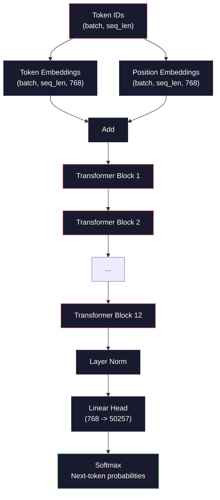
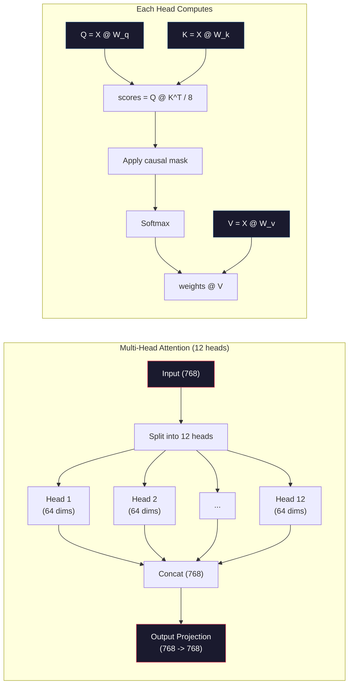
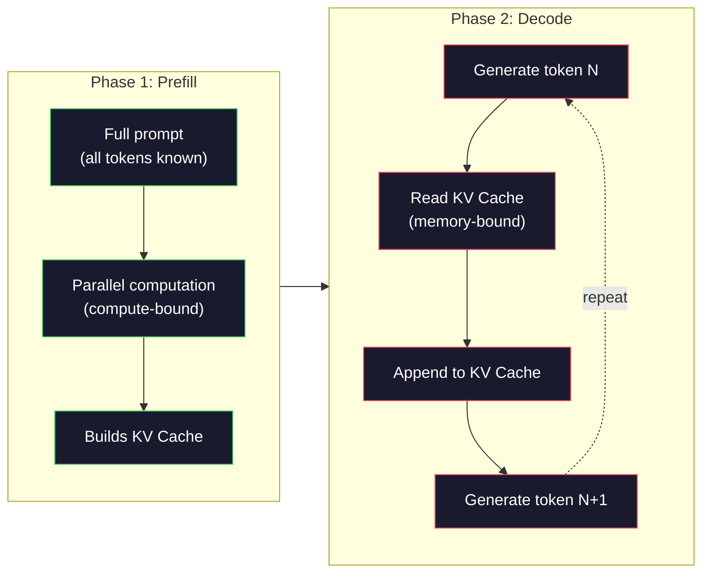

# Zero Ön Eğitimden Bir Mini GPT ((124M 参数)

> GPT-2 Small'ın 1.24 milyar parametri vardır. Yani 12 Transformer katmanı, 12 Dikkat başlığı ve 768 维 Embedding'i vardır. Tek bir GPU'da birkaç saat boyunca sıfırdan antrenman yapabilirsin. Çoğu insan bunu asla yapmaz. Önceden eğitilmiş kontrol noktalarını kullanırlar.

**类型：**Yapım
**语言：**Python(numpy ile)
**前置要求：**Eğitimler 01-03(Tokenizler, Tokenizer Oluşturma, Veri Pipelines)
**时间：**~ 120 dakika

## Öğrenme hedefi
- GPT-2 架构(124M 参数):Token Embeddings、positional embeddings、Transformer blokları, yanı sıra dil model başlığı
- Kullanım sonraki belirti tahminleri ve çapraz entropi kaybı, in文本语料上训练 GPT modeli
- 实现带 sıcaklık örneklemesi ve üst-k/üst-p filtrelenmesi
- 監控訓練損失曲線,并验证模型学到了连贯的语言模式

## 问题
Transformer nedir biliyor musun? Bu resimleri gördün mü?

Bu, bir model oluştururken ne olduğunu anladığını göstermez.

GPT-2 Küçük(vez bağlaması ile) 124.438.272 个参数 vardır. Her bir参数, tren döngüsü ile oluşturulur: ileri geçiş, hesaplama kaybı, geri geçiş, yenileme ağırlığı. 12 个变形器块── her blok 12 个注意头── 768 维 的嵌入空间──一个包含 50,257 个收藏符号的词汇──每当模型生成一个符号时,全部 1.24 亿参数都参与一个矩阵乘链:它接一串代码 ID,并输出下一个代码的概率分布──

Eğer bunları hiç kendi elinizle inşa etmemişseniz, bir kara kutu kullanıyorsunuz. API'yi kullanabilirsiniz.

Bu ders GPT-2 Küçük bir yapıtan başlayarak geçecek. PiTork kullanımı ile yapılmaz. Numpy kullanımı ile yapılır. Her matris çarpımı görülebilir. Her bir derecenin hesaplanması kodunuzla yapılır.

## 概念
### GPT Mimarlığı

GPT bir autoregressive dil modelitir. Autoregressive 的意思是它一次生成一个代币,每个代币都基于前面所有代币.

Aşağıda Token ID ' den sonraki token olasılıklarına kadar tam hesaplama grafiği:

1. Token ID 输入。Form: (batch_size, seq_len)。
2. Token Embedding lookup。每个 ID 映射到一个 768 维 矢量──形: (batch_size, seq_len, 768)。
3. Konum Ekleme bakımı── her pozisyon(0, 1, 2, ...)映射到一个 768 维 vektörü──Form 相同──
4. 将 Token Embeddings + pozisyon embeddings 相加──
5. 12 tane Transformer blokları üzerinden.
6. Son katman normallaştırma.
7. Lineer projeksiyonı sözcük büyüklüğüne kadar── Şekil: (batch_size, seq_len, vocab_size)──
8. Softmax  get概率──

İşte tüm model. Yüklenme yok. Tekrarlanma yok. Sadece yerleşimler. Dikkat.



### Transformer Blok

12 bloklar arasında her biri aynı modelden sonra yapılır.

1. LayerNorm
2. Çok Başlı Kendine Dikkat
3. Geri kalan bağlantı ((把输入加回来)
4. LayerNorm
5. İlaçlı İlaçlı Ağ (MLP)
6. Geri kalan bağlantı ((把输入加回来)

Geri kalan bağlantılar 至关重要──没有它们,在后扩散过程中,Gradient到达块1时会消失──有它们,Gradient可以通过skip路从损失 直接流向任意层──这就是为什么你可以堆叠12、32,甚至96块(GPT-4传闻使用120个) ⋅

### Dikkat: 核心机制

Kendine Dikkat 让每个代币 查看前面所有代币,并决定应该关注每个代币 多少──下面是数学形式──

Her bir token pozisyonu için, girişden 计算三个矢量:
- **Query (Q)**Ne arıyorum?
- **Key (K)**İçinde ne var?
- **Value (V)**Ne haber taşıyorum?

```
Q = input @ W_q    (768 -> 768)
K = input @ W_k    (768 -> 768)
V = input @ W_v    (768 -> 768)

attention_scores = Q @ K^T / sqrt(d_k)
attention_scores = mask(attention_scores)   # causal mask: -inf for future positions
attention_weights = softmax(attention_scores)
output = attention_weights @ V
```

Sebep maskası, GPT'nin otomatik olarak geri dönme özelliği olan bir mekanizma sahip olmasını sağlar. 5. pozisyon 0-5 pozisyonlarına katılabilir, ancak 6、7、8 pozisyonlarına katılamaz. Bu, modelin eğitim sırasında gelecek belirtilerini görerek yanıltıcılık yapmasını önler.

**Multi-head attention**Bir başı, belki de bir ifadeyi takip eder. Konu-ketim anlaşması. Başka bir başı da, belki de bir komşu konumunu takip eder. Yakın bir kelime.



Ek olarak şıklıklı olarak (d_k) sqrt(64) = 8 is scaling。 yoksa, yüksek boyutlu vektörün nokta ürünü çok büyük olur,  softmax 推至 Gradient 几乎为零的区域──这是原始 注意是你需要的纸 中的关键洞见之一──

### KV: 推理为什么快

訓練時,あなたは一度全体序列を処理します。Inference 时,あなたは一度 Token bir tane üretir。 eğer optimize edilmezse, Token N 生成 N 需要为前面所有 N-1 个 Token 重新计算 注意。 her bir Token için, bu O(N), uzunluk için N 序列 için,总体是 O(N^2) 計算, ve ayrıca tekrar tekrar tekrar çok sayıda giriş taraflı Matrix çarpımı gerçekleştirir。

KV Cache  bu sorunu çözdü. K ve V için hesaplayın. K ve V için hesaplayın. Sonra onları saklayın. N+1 için yeni bir token oluşturduğunda, yeni bir token oluşturmanız gerekir.

12 katman ve 12 baş içeren GPT-2,KV kasesi için her bir token  depolama 2(K + V) x 12 katman x 12 baş x 64 dims = 18,432 个值。 1024-Token dizisi için, FP32 aşağı yaklaşık 75MB。 128 katman Llama 3 405B, tek bir dizisi için KV kasesi 10GB'den fazla olabilir。 bu yüzden uzun bağlamlı sonuçlar 约束 受存储──

### Ön doldurma vs. Dekodlama: 推理的两个阶段

LLM'ye gönderilince, ders iki farklı aşama ayrılır.

**Prefill**Bu aşamada hesaplama bağlı GPU tam throughput  Matrix çarpmalarını gerçekleştirmek üzere  A100'de, 1000-Token prompt'un önceden doldurulması yaklaşık olarak 20-50 ms gerektirir

**Decode**Bu aşamada, bir kez bir token oluşturulur. Her yeni token tüm önceki tokenlere bağlıdır. Bu aşamada, bir süre önce GPU bellekinden bir süre önce, bir süre sonra bir süre sonra bir kez daha bir tane tane oluşturulur.

Bu tür bir fark üretim sisteminde önemlidir. Ön doldurma throughputı GPU hesaplama ile birlikte  genişleşiyor. Daha fazla FLOPS = daha hızlı prefill) Decode throughput  daha hızlı bellek bant genişliği ile birlikte  genişleşiyor.



### Eğitim Çelişkisi

訓練 LLM 就是下記記号预测──给定 Token [0, 1, 2, ..., N-1],预测 Token [1, 2, 3, ..., N]──Loss Fonksiyon 是模型预测概率分布与真实下記号 之间的交叉 Entropy──

Bir eğitim adım:

1. **Forward pass**: let batch 通過全部 12 个ブロック── get her pozisyonun logits(pre-softmax puanları)──
2. **Compute loss**:logits ve hedef tokenler arasındaki çapraz entropi
3. **Backward pass**: kullan Backpropagation 为全部 124M 参数计算 Gradient。
4. **Optimizer step**GPT-2 GPT-2 GPT-2 GPT-2 GPT-2 GPT-2 GPT-2 GPT-2 GPT-2 GPT-2 GPT-2 GPT-2 GPT-2 GPT-2 GPT-2 GPT-2 GPT-2 GPT-2 GPT-2 GPT-2 GPT-2 GPT-2 GPT-2 GPT-2 GPT-2 GPT-2 GPT-2 GPT-2 GPT-2 GPT-2 GPT-2 GPT-2 GPT-2 GPT-2 GPT-2 GPT-2 GPT-2 GPT-2 GPT-2 GPT 2 GPT GPT GPT GPT GPT GPT GPT GPT GPT GPT GPT GPT GPT GPT GPT GPT GPT GPT GPT GPT GPT GPT GPT GPT GPT GPT GPT GPT GPT GPT GPT GPT GPT GPT GPT GPT GPT GPT GPT GPT GPT GPT GPT GPT GPT GPT GPT GPT GPT GPT GPT GPT GPT GPT GPT GPT GPT GPT GPT GPT GPT GPT GPT GPT GPT GPT GPT GPT GPT GPT GPT GPT GPT GPT GPT GPT GPT GPT GPT GPT GPT GPT GPT GPT GPT GPT GPT GPT GPT GPT GPT GPT GPT GPT GPT GPT GPT GPT GPT GPT GPT GPT GPT GPT GPT GPT GPT GPT GPT GPT GPT GPT GPT GPT GPT GPT GPT GPT GPT GPT GPT GPT GPT GPT GPT GPT GPT GPT GPT G G GPT GPT GPT G GPT GPT GPT G GPT GPT GPT G GPT G G G G GPT GPT G G GPT G G G G GPT G G G G G GPT GPT G G GPT GPT GPT G G G GPT G G G G GPT G GPT G G G G G G GPT GPT G G G G GPT G G G G G GPT GPT G G G G G G G G G G G G G GPT G G G G G G G G G G G G G G G G G G

Öğrenme oranı programı, hayal etmenizden daha önemlidir. GPT-2 ön 2000 aşamada 0'dan ısınarak en yüksek öğrenme oranına kadar, sonra da kozin eğriyi takip ederek  düşüşe başlar. Çok yüksek öğrenme oranı, model değişmesine neden olur.

### GPT-2 Küçük: Sayılar

| Component | Shape | Parameters |
|-----------|-------|------------|
| Token embeddings | (50257, 768) | 38,597,376 |
| Position embeddings | (1024, 768) | 786,432 |
| Per-block attention (W_q, W_k, W_v, W_out) | 4 x (768, 768) | 2,359,296 |
| Per-block FFN (up + down) | (768, 3072) + (3072, 768) | 4,718,592 |
| Per-block LayerNorms (2x) | 2 x 768 x 2 | 3,072 |
| Final LayerNorm | 768 x 2 | 1,536 |
| **Total per block** | | **7,080,960** |
| **Total (12 blocks)** | | **85,054,464 + 39,383,808 = 124,438,272** |

Çıkış projesi(logits başı) Token Embedding Matrix ile 共享权重── Thiscal weight tying It reduced 38M 参数,并提升性能,因为 it forces the model to input 和 output Using the same representation space──


```figure
sampling-decoder
```

## Yapın onu.
### 步骤 1: Ekleme katmanı

Token yerleşimleri 50,257 个可能 Token içindeki her birini bir 768 维 vektora yerleştirecektir.

```python
import numpy as np

class Embedding:
    def __init__(self, vocab_size, embed_dim, max_seq_len):
        self.token_embed = np.random.randn(vocab_size, embed_dim) * 0.02
        self.pos_embed = np.random.randn(max_seq_len, embed_dim) * 0.02

    def forward(self, token_ids):
        seq_len = token_ids.shape[-1]
        tok_emb = self.token_embed[token_ids]
        pos_emb = self.pos_embed[:seq_len]
        return tok_emb + pos_emb
```

İlk başlama 0.02 standart sapma kullanmak, GPT-2 kağıdından kaynaklanır. Çok büyük, başlangıç ileri geçişleri, son değer üretir, eğitim sabitliğini bozur.

### 2 adım: 带 Causal Mask'ın Kendine Dikkat

Önceden tek başlı dikkatle ilgilenmek için, nedenlik maskası, önceden yumuşak maksimum olarak, gelecek pozisyonunu negatif sonsuzluk için ayarlayın, her pozisyonun sadece kendi ve daha erken pozisyonuna dikkat edebilmesini sağlayın.

```python
def attention(Q, K, V, mask=None):
    d_k = Q.shape[-1]
    scores = Q @ K.transpose(0, -1, -2 if Q.ndim == 4 else 1) / np.sqrt(d_k)
    if mask is not None:
        scores = scores + mask
    weights = np.exp(scores - scores.max(axis=-1, keepdims=True))
    weights = weights / weights.sum(axis=-1, keepdims=True)
    return weights @ V
```

softmax 实现会在指数化前减去最大值──否则,exp(large_number) 会溢れ成無限──这是一个数值稳定性技巧,并不会改变输出,因为对于任意常数 c,softmax(x - c) = softmax(x)──

### 3 adım: Çok Başlı Dikkat

768 维 giriş 分割 12 个头,每个头 64 维──每个头 独立计算 注意──将结果连锁,并项目 回 768 维──

```python
class MultiHeadAttention:
    def __init__(self, embed_dim, num_heads):
        self.num_heads = num_heads
        self.head_dim = embed_dim // num_heads
        self.W_q = np.random.randn(embed_dim, embed_dim) * 0.02
        self.W_k = np.random.randn(embed_dim, embed_dim) * 0.02
        self.W_v = np.random.randn(embed_dim, embed_dim) * 0.02
        self.W_out = np.random.randn(embed_dim, embed_dim) * 0.02

    def forward(self, x, mask=None):
        batch, seq_len, d = x.shape
        Q = (x @ self.W_q).reshape(batch, seq_len, self.num_heads, self.head_dim).transpose(0, 2, 1, 3)
        K = (x @ self.W_k).reshape(batch, seq_len, self.num_heads, self.head_dim).transpose(0, 2, 1, 3)
        V = (x @ self.W_v).reshape(batch, seq_len, self.num_heads, self.head_dim).transpose(0, 2, 1, 3)

        scores = Q @ K.transpose(0, 1, 3, 2) / np.sqrt(self.head_dim)
        if mask is not None:
            scores = scores + mask
        weights = np.exp(scores - scores.max(axis=-1, keepdims=True))
        weights = weights / weights.sum(axis=-1, keepdims=True)
        attn_out = weights @ V

        attn_out = attn_out.transpose(0, 2, 1, 3).reshape(batch, seq_len, d)
        return attn_out @ self.W_out
```

reshape-transpose-reshape Bu süs operasyon çok başlı ilgi içindir. Bu kısım gerçekleşir: şekil biçimli  dönüştürülmek (batch, seq_len, 12, 64), yeniden dönüştürülmek (batch, 12, seq_len, 64) ・・・ şimdi 12 个头 中的每个都有自己的 (seq_len, 64) 矩阵 来运行行 注意. Attention 结束后,我们反向执行这个过程:((batch, 12, seq_len, 64) 变成 (batch, seq_len, 12, 64),再变成 (batch, seq_len, 768) ・・・

### 步骤 4: Transformer Blok

Bir tam Transformer bloğu:LayerNorm 带 residual  multi-head attention  LayerNorm 带 residual ⋅ feedforward ⋅

```python
class LayerNorm:
    def __init__(self, dim, eps=1e-5):
        self.gamma = np.ones(dim)
        self.beta = np.zeros(dim)
        self.eps = eps

    def forward(self, x):
        mean = x.mean(axis=-1, keepdims=True)
        var = x.var(axis=-1, keepdims=True)
        return self.gamma * (x - mean) / np.sqrt(var + self.eps) + self.beta


class FeedForward:
    def __init__(self, embed_dim, ff_dim):
        self.W1 = np.random.randn(embed_dim, ff_dim) * 0.02
        self.b1 = np.zeros(ff_dim)
        self.W2 = np.random.randn(ff_dim, embed_dim) * 0.02
        self.b2 = np.zeros(embed_dim)

    def forward(self, x):
        h = x @ self.W1 + self.b1
        h = np.maximum(0, h)  # GELU approximation: ReLU for simplicity
        return h @ self.W2 + self.b2


class TransformerBlock:
    def __init__(self, embed_dim, num_heads, ff_dim):
        self.ln1 = LayerNorm(embed_dim)
        self.attn = MultiHeadAttention(embed_dim, num_heads)
        self.ln2 = LayerNorm(embed_dim)
        self.ffn = FeedForward(embed_dim, ff_dim)

    def forward(self, x, mask=None):
        x = x + self.attn.forward(self.ln1.forward(x), mask)
        x = x + self.ffn.forward(self.ln2.forward(x))
        return x
```

Feedforward ağı 768 维 girişini  genişletecek 3,072 维(4x), bir çizgizliği uygulayacak, sonra da projeye döner 768 维。 Bu genişleme-sıkıştırma örneği  modelin her pozisyonda bir  daha geniş  iç temsiline sahip olmasına izin verir. GPT-2 GELU etkinleştirmesini kullanır, ama burada basitçe kullanmak ReLU anlama yapısı için fark yok.

### 步骤 5: Tam GPT Modülü

堆叠 12 个 Transformer blokları──在前面加入嵌套层,在后面加入输出投影──

```python
class MiniGPT:
    def __init__(self, vocab_size=50257, embed_dim=768, num_heads=12,
                 num_layers=12, max_seq_len=1024, ff_dim=3072):
        self.embedding = Embedding(vocab_size, embed_dim, max_seq_len)
        self.blocks = [
            TransformerBlock(embed_dim, num_heads, ff_dim)
            for _ in range(num_layers)
        ]
        self.ln_f = LayerNorm(embed_dim)
        self.vocab_size = vocab_size
        self.embed_dim = embed_dim

    def forward(self, token_ids):
        seq_len = token_ids.shape[-1]
        mask = np.triu(np.full((seq_len, seq_len), -1e9), k=1)

        x = self.embedding.forward(token_ids)
        for block in self.blocks:
            x = block.forward(x, mask)
        x = self.ln_f.forward(x)

        logits = x @ self.embedding.token_embed.T
        return logits

    def count_parameters(self):
        total = 0
        total += self.embedding.token_embed.size
        total += self.embedding.pos_embed.size
        for block in self.blocks:
            total += block.attn.W_q.size + block.attn.W_k.size
            total += block.attn.W_v.size + block.attn.W_out.size
            total += block.ffn.W1.size + block.ffn.b1.size
            total += block.ffn.W2.size + block.ffn.b2.size
            total += block.ln1.gamma.size + block.ln1.beta.size
            total += block.ln2.gamma.size + block.ln2.beta.size
        total += self.ln_f.gamma.size + self.ln_f.beta.size
        return total
```

Dikkat et ağırlık bağlama:`logits = x @ self.embedding.token_embed.T`△output projesi △Token Embedding Matrix(转置) ・・・This is not just a节省参数的技巧──It means model with the same Vector space to understand Token(embeddings) 和预测 Token(output) ・・・

### 步骤 6: Eğitim Çubuğu

Gerçek 124M parametr eğitimi için, GPU ve PyTorch gerekir. Bu eğitim döngüsü, basit bir numpy ile çalıştırılabilen küçük bir model üzerinde gösterim mekanizmasıdır.

```python
def cross_entropy_loss(logits, targets):
    batch, seq_len, vocab_size = logits.shape
    logits_flat = logits.reshape(-1, vocab_size)
    targets_flat = targets.reshape(-1)

    max_logits = logits_flat.max(axis=-1, keepdims=True)
    log_softmax = logits_flat - max_logits - np.log(
        np.exp(logits_flat - max_logits).sum(axis=-1, keepdims=True)
    )

    loss = -log_softmax[np.arange(len(targets_flat)), targets_flat].mean()
    return loss


def train_mini_gpt(text, vocab_size=256, embed_dim=128, num_heads=4,
                   num_layers=4, seq_len=64, num_steps=200, lr=3e-4):
    tokens = np.array(list(text.encode("utf-8")[:2048]))
    model = MiniGPT(
        vocab_size=vocab_size, embed_dim=embed_dim, num_heads=num_heads,
        num_layers=num_layers, max_seq_len=seq_len, ff_dim=embed_dim * 4
    )

    print(f"Model parameters: {model.count_parameters():,}")
    print(f"Training tokens: {len(tokens):,}")
    print(f"Config: {num_layers} layers, {num_heads} heads, {embed_dim} dims")
    print()

    for step in range(num_steps):
        start_idx = np.random.randint(0, max(1, len(tokens) - seq_len - 1))
        batch_tokens = tokens[start_idx:start_idx + seq_len + 1]

        input_ids = batch_tokens[:-1].reshape(1, -1)
        target_ids = batch_tokens[1:].reshape(1, -1)

        logits = model.forward(input_ids)
        loss = cross_entropy_loss(logits, target_ids)

        if step % 20 == 0:
            print(f"Step {step:4d} | Loss: {loss:.4f}")

    return model
```

Kayıp, 256-Token'in byte seviyesindeki kelimeforumu için, yani ln(256) = 5.55。随机模型会给每个 token 分配相等概率──; eğitim ilerledikçe, Kayıp 会下降,因为模型学会预测常见模式:如 t 后面的 th、句号后的空格,等等──.

Üretim sırasında, Adam Optimizer'i kullanacaksınız, Gradient birikimi, öğrenme oranı ısınması ve Gradient kesimi, ileri-geçme-kayıp-geri-daha güncelleme döngüsü aynıdır.

### 步骤 7: Metin Yürütme

Genre kullanın iyi model bir kez tahmin bir Token.. Her bir tahmin de çıkış dağılımında örneklerden veya açgözlülükle argmax almak için..

```python
def generate(model, prompt_tokens, max_new_tokens=100, temperature=0.8):
    tokens = list(prompt_tokens)
    seq_len = model.embedding.pos_embed.shape[0]

    for _ in range(max_new_tokens):
        context = np.array(tokens[-seq_len:]).reshape(1, -1)
        logits = model.forward(context)
        next_logits = logits[0, -1, :]

        next_logits = next_logits / temperature
        probs = np.exp(next_logits - next_logits.max())
        probs = probs / probs.sum()

        next_token = np.random.choice(len(probs), p=probs)
        tokens.append(next_token)

    return tokens
```

Temperatür  kontrol随机性──Temperatür 1.0 使用原始分布──Temperatür 0.5 会让分布更尖(更确定模型更经常选择顶级选择)──Temperatür 1.5 会让分布更平坦(更随机低概率 Token 获得更大的机会)──Temperatür 0.0 açgözlülükle çözme(总是选择最高概率 Token)──

`tokens[-seq_len:]`Bu pencerenin en büyük bağlam uzunluğu olduğu için gerekli.

## Kullan
### 完整训练与生成 Demo

```python
corpus = """The transformer architecture has revolutionized natural language processing.
Attention mechanisms allow the model to focus on relevant parts of the input.
Self-attention computes relationships between all pairs of positions in a sequence.
Multi-head attention splits the representation into multiple subspaces.
Each attention head can learn different types of relationships.
The feedforward network provides nonlinear transformations at each position.
Residual connections enable gradient flow through deep networks.
Layer normalization stabilizes training by normalizing activations.
Position embeddings give the model information about token ordering.
The causal mask ensures autoregressive generation during training.
Pre-training on large text corpora teaches the model general language understanding.
Fine-tuning adapts the pre-trained model to specific downstream tasks."""

model = train_mini_gpt(corpus, num_steps=200)

prompt = list("The transformer".encode("utf-8"))
output_tokens = generate(model, prompt, max_new_tokens=100, temperature=0.8)
generated_text = bytes(output_tokens).decode("utf-8", errors="replace")
print(f"\nGenerated: {generated_text}")
```

Küçük dil ve küçük modellerde, metin üretimi en çok yarı bağlantı ile gerçekleşir. Bu metin eğitimi metinlerinden bazı byte düzeyde bir örneğe kadar öğrenir, ancak GPT-2 gibi 40GB ı eğitmek için kullanılamaz.

## - Söyle.
本课会产 出 `outputs/prompt-gpt-architecture-analyzer.md` Bir GPT tarzı modelinin herhangi bir analizini yapmak için kullanılır 架构选择的提示──把模型卡或技术报告 交给它,它会解解参数配置、注意设计和规模决策──

## 练习
1. Model 12/12 yerine 24 kat ve 16 baş kullanmak için değiştirilmiştir.

2. 实现 GELU etkinleştirme işlevi(GELU(x) = x * 0.5 * (1 + erf(x / sqrt(2)))),并替换源向网络 中的 ReLU──分别使用两种激活 训练500步,并比较最终损失──

3. 给生成函数 添加KV缓存──在第一次前传后,存储每层的K和V  tensors,并后续代币中复用它们──测量速度:分别在有缓存和无缓存的情况下生成200个代币,并比较墙钟时间──

4. 实现 top-k sampling(only consider概率最高的 k 个代币) y top-p sampling(nukleus sampling:考虑累计概率超过 p 的最小代币 集合) ⋅ 0.8 下温度下比较 top-k=50 与 top-p=0.95 的输出质量──

5. 构建一个训练损失曲线图案设计者──训练模型 1000 adım,并绘制损失 vs. step──识别三个阶段:快速初始下降(学习常见字节)、较慢的中间阶段(学习字节模式) 以及平原(在小语料上过化)──无论你训练的是128-dimen model 还是GPT-4,这条曲线的形状都是一样的──

## 关键术语
| Term | What people say | What it actually means |
|------|----------------|----------------------|
| Autoregressive | “它一次生成一个词” | 每个输出 Token 都基于所有之前的 Token——模型预测 P(token_n \| token_0, ..., token_{n-1}) |
| Causal mask | “它看不到未来” | 一个由 -infinity 值组成的 upper-triangular Matrix，用于在训练期间阻止 Attention 指向未来 position |
| Multi-head attention | “多种 Attention pattern” | 将 Q、K、V 拆成并行 heads（例如 GPT-2 中 12 个 head，每个 64 dims），让每个 head 学习不同的关系类型 |
| KV Cache | “用于提速的缓存” | 存储来自之前 Token 的已计算 Key 和 Value tensors，以避免 autoregressive generation 期间的冗余计算 |
| Prefill | “处理 prompt” | 第一个 inference 阶段，所有 prompt Token 并行处理——在 GPU FLOPS 上 compute-bound |
| Decode | “生成 Token” | 第二个 inference 阶段，Token 一次生成一个——在 GPU bandwidth 上 memory-bound |
| Weight tying | “共享 embeddings” | 对 input Token embeddings 和 output projection head 使用同一个 Matrix——在 GPT-2 中节省 38M 参数 |
| Residual connection | “Skip connection” | 将 input 直接加到 sublayer 的 output 上（x + sublayer(x)）——支持 deep networks 中的 Gradient flow |
| Layer normalization | “规范化 activations” | 沿 feature dimension 规范化到 mean 0 和 variance 1，并带有可学习的 scale 与 bias 参数 |
| Cross-entropy loss | “预测错得有多离谱” | -log(分配给正确 next Token 的概率)，在所有 position 上取平均——标准 LLM 训练目标 |

## 延伸阅读
- [Radford et al., 2019 -- "Language Models are Unsupervised Multitask Learners" (GPT-2)](https://cdn.openai.com/better-language-models/language_models_are_unsupervised_multitask_learners.pdf)-- 介绍 124M to 1.5B 参数家族 GPT-2 kağıdı
- [Vaswani et al., 2017 -- "Attention Is All You Need"](https://arxiv.org/abs/1706.03762)--                                                                                                                                                                                                                                                                                                                                                                                                                                                                                                                             
- [Llama 3 Technical Report](https://arxiv.org/abs/2407.21783)-- Meta  16K GPU'ları nasıl kullanılır GPT mimarisi  405B 参数'e kadar genişletilmeli
- [Pope et al., 2022 -- "Efficiently Scaling Transformer Inference"](https://arxiv.org/abs/2211.05102)-- KV cache analizi ile prefill vs decode  formalize kağıdı
