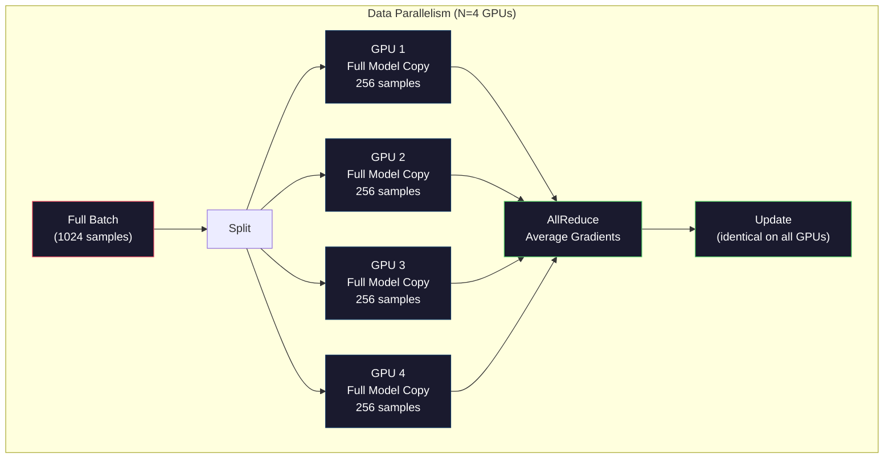
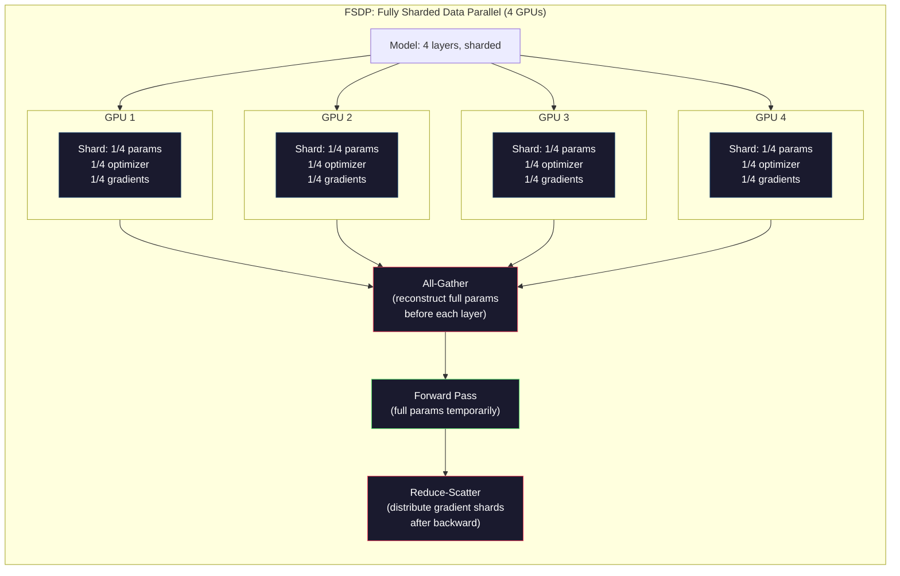
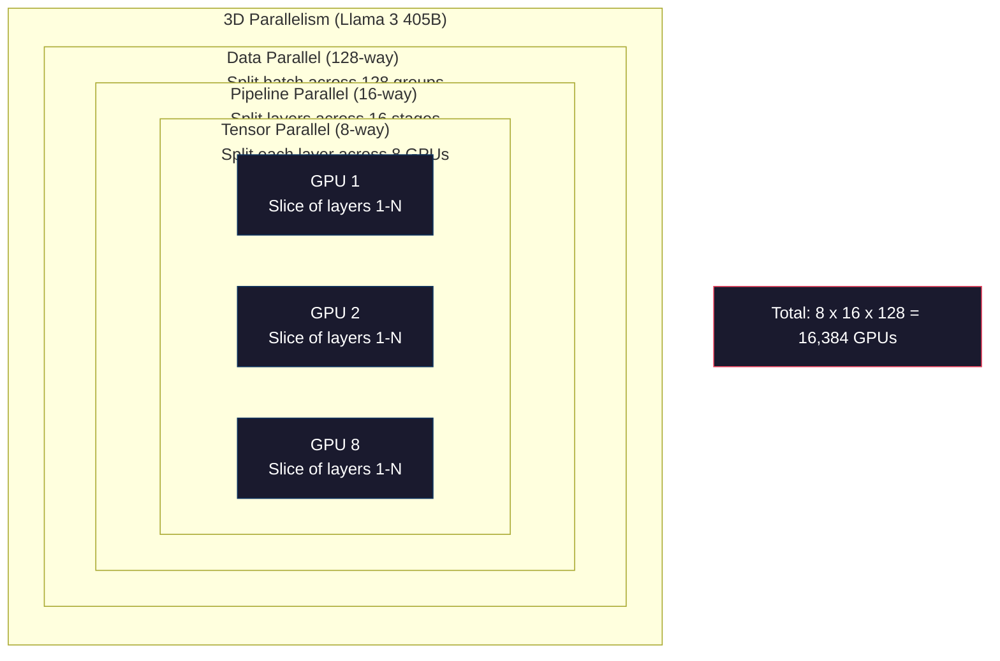

# Ölçekleme:Yüklü Eğitim, FSDP, Derin Hız

> 124M modeliniz bir GPU'da eğitim tamamlandı. Şimdi 70 milyar parametre deneyin.

**Type:** Build
**Languages:** Python
**Prerequisites:** Phase 10, Lesson 04 (Pre-Training a Mini GPT)
**Time:** ~120 minutes

## Öğrenme hedefi
- 解释三种平行性 (Data、Tensor、Pipeline), ve model boyutuna ve grup boyutuna göre bunları ne zaman kullanılması gerektiği konusunda karar vermek
- PyTorch DDP kullanın  Data Paralel eğitim gerçekleştirmek ve çok blok GPU  arasındaki eşzamanlı derecelendirme
- 計算给定模型规模的显存预算( ağırlıklar + optimizer durumları + gradients + aktivasyonlar), en düşük硬件 ihtiyacını belirlemek için
- FSDP veya DeepSpeed ZeRO aşamalarını yapılandırmak, model durumunu bir çok GPU'ya ayırarak, böylece tek bir grafik kaydedilen modelden daha fazla kapasiteye sahip olacaktır.

## 问题
Bir 7B parametr modeli FP16 kullanırken, sadece ağırlıklar 14GB gerekir. Adam optimizer her parametre ekstra depolama için iki kopyasını yapar.

Bir NVIDIA A100'in 80 GB'sı var.

80GB'de 56GB'yi tüketilmiştir. Sadece 24GB'ye kalmış aktifasyonlar, yani ileri geçiş sırasında hesaplanan orta değer, geri yayılma kullanımına kadar kalmalıdır. 2048-token dizisi ve 4096 boyutlu model için, tek katlı aktivasyonlar yaklaşık 64MB'yi kullanmaktadır. 32 katlılık her örnek için 2GB'ye ihtiyaç vardır.

现在试试 70B 参数──仅重量:FP16 下 140GB──单块 GPU 放不下──你至少需要2块 A100(2 x 80GB = 160GB)才能只放下重量──加上优化状态和梯度,需要的 GPU 远不止这些:最低3+块,实际上通常取决于碎片化策,需要8-16块──

Llama 3 405B 16.384 blok NVIDIA H100 GPU kullanmak  eğitim。 Bu eğitim yürütülmesinin tahmin ettiği maliyet yaklaşık 1 milyar dolar hesaplama 成本。DeepSeek V3  daha da巧妙 bir mimariden geçerek(Ekspertlerin karışımı yani her bir token sadece küçük bir bölümünü etkinleştirir) ve eğitim verimliliği, yaklaşık 560 milyon dolar ile bir kıyaslanabilir model eğitmek。

Bu ders, büyük ölçekli eğitimlerin mümkün hale getirilmesini sağlar.

## 概念
### Neden dağıtılı

Aşağıda gerçek modelin belirgin kalıp hesaplaması yer alır. Her sayı hesaplanmıştır, tahmin değil.

| Model | Params | Weights (FP16) | Adam States | Gradients (FP16) | Total (no activations) |
|-------|--------|----------------|-------------|------------------|----------------------|
| GPT-2 Small | 124M | 248 MB | 992 MB | 248 MB | 1.5 GB |
| Llama 3 8B | 8B | 16 GB | 64 GB | 16 GB | 96 GB |
| Llama 3 70B | 70B | 140 GB | 560 GB | 140 GB | 840 GB |
| Llama 3 405B | 405B | 810 GB | 3,240 GB | 810 GB | 4,860 GB |

Adam Devletleri 这一列才是真正的显存杀手──Adam 会为每个参数存储运行平均 (m) 和运行变量 (v),两者都是FP32──对于70B 模型,这就是70B x 4 bytes x 2 = 560GB──只有优化器就需要七块A100──

单块H100 80GB vardır──Llama 3 405B en az 61 blok H100 才能容纳 weights、optimizer 和 gradients──加上激活,数量也将继续增加──Meta 16.384 块 GPU kullanıyor çünkü onlar bunu düşünüyor değil, çünkü onlar bunu yapmak zorunda──

### Veriler paralelliği

En basit dağıtıcı strateji. N 块 GPU'ya kadar bütün modelini kopyalamak. Her eğitim partiğini N 个相等部分に分解する. Her GPU bloku kendi veri şarjında ileriye doğru ve geriye doğru geçmek. Arka doğru geçmek.

**优点：**Çıktılık 近似线性扩展──N 块 GPU Her adım 处理 N 倍数据──通信 sadece gradient ortalamasıyla sınırlıdır ve hesaplamalarla üst üste geçebilir──

**缺点：**Her GPU bloku tam bir model ‒ optimizer durumları ve gradientleri ‒ taşıyor. 70B model için her GPU bloku 840 GB ‒ ihtiyaç duyar. ‒ Veriler paralelliği, tek bir GPU bloku'nun kaydedilmiş kullanımını azaltmaz. ‒ Sadece eğitim süresini kısaltır.

**计算：**Etkili parti boyutu = per_gpu_batch_size x N。 N=64 blok GPU 且 per-GPU parti için 16, etkili parti için 1,024。 Llama 3 kullanımın etkili parti boyutu ise her adım 16000000 tokens。



### Tensör paralelliği

Tek katmanı bir GPU'ya ayırmak. Bir kez matris çarpımı bir GPU'ya ayırmak.

考虑 feedforward layer 中一个形 为 (8192, 8192) 体重矩阵──使用四向 tensor paralelism 时,每个块 GPU 拥有一个 (8192, 2048) 碎片──每个块 GPU 用输入乘以自己的碎片,产生一个部分结果──部分结果会被组合──通过全减或全集合) 产生完整输出──

**优点：**降低每块 GPU 上的模型重量 显存占用──70B 模型拆分到8块 GPU 上, yani her GPU 块 持有约8.75B 参数规模的重量──

**缺点：**Her aşamalı işlem için yüksek hızlı GPU 间通信── her matmul 后的全减会增加延迟── NVLink 间 900 GB/s arasındaki GPU 间 900 GB/s arasındaki aynı noktada iyi sonuçlar elde ediyor, ancak InfiniBand 间 400 Gb/s, yaklaşık 50 GB/s arasındaki bağlantı noktası arasındaki sonuçlar farklılıkları göstermektedir── Tensor paralelliği neredeyse her zaman tek bir noktada sınırlıdır.

**真实用法：**Megatron-LM  tenzor paralelliğini başlattı― Llama 3 405B                                                                                                                                                                                                                                                                                                                                                                                                                                                                                                          

### Pipeline paralelliği

按层 拆分模型──GPU 1 运行层 1-8──GPU 2 运行层 9-16──GPU 3 运行层 17-24──GPU 4 运行层 25-32──数据流经管道:GPU 1 计算自己的层并把激活 发送给 GPU 2,GPU 2 计算自己的层 后发送给 GPU 3,依此类推──

**优点：**GPU 间通信极少, yalnızca 传层 边界处的激活;相比梯度或重量,这些数据很小──因为带宽需求低,所以可以跨节点工作──

**缺点：**Pipeline balonları── GPU 4'ün 1 mikro-batch'in ön geçişini hesapladığında, GPU 1、2、3 tamamen boş durumda olurlar.

**GPipe and PipeDream**通過把批次 拆成微批次 問題──GPU 1 一完成微批次 進一步,就開始處理微批次 2──这让不同的管道阶段的计算发生重叠──使用 M 个微批 和 N 个阶段时,泡 fraktion 降为 (N-1) / M。N=4阶段、M=16 mikro批 时,泡为 3/16 = 18.75% idle time──

### FSDP: Tamamen parçalanmış veriler paralel

FSDP, verilerin paralelliğinin genişletilmesi ve parçalanmasının gösterilen kaydetme verimliliğini birleştirdi.

Bir katmanın ileri geçişinden önce, FSDP İzleyici**all-gather**, tüm GPU'ların tam parametrelerini toplayıp, her GPU'nun görünen kaydını toplayıp, ileri geçişten sonra, her GPU'nun yerel olmayan parametrelerini bırakıp geri geçişten sonra, gradient hesaplama parametrelerini yeniden inşa etmek için yeniden çalıştırmak için geri geçişten sonra,**reduce-scatter**Gradyent parçalarını bölün, GPU'nun her bir blokunun sadece 1/N'nin gradientlerini depolaması için.

**70B 模型在 8 块 GPU 上的计算：**

| Component | Without FSDP | With FSDP |
|-----------|-------------|-----------|
| Weights (FP16) | 140 GB per GPU | 17.5 GB per GPU |
| Adam States (FP32) | 560 GB per GPU | 70 GB per GPU |
| Gradients (FP16) | 140 GB per GPU | 17.5 GB per GPU |
| **Total** | **840 GB per GPU** | **105 GB per GPU** |

FSDP olmadan, 70B modelini 80GB GPU'ya yerleştiremezsiniz. 8 GB GPU'nun FSDP'sinden sonra, her GPU'nun 105 GB'sı kullanılır. Bu hala bırakılmıyor.

通信 maliyeti, her katman önce her şeyi toplamak zorunda olduğu için vanilya verileri paralellikten daha yüksektir.



### DeepSpeed ZeRO

DeepSpeed'in ZeRO (Zero Redundancy Optimizer) kavramda FSDP ile aynıdır, ancak Microsoft tarafından bağımsız olarak geliştirilmiştir.

| Stage | Shards | Memory Savings | Communication |
|-------|--------|---------------|---------------|
| ZeRO-1 | 仅 Optimizer states | ~4x reduction | 与 data parallel 相同 |
| ZeRO-2 | + Gradients | ~8x reduction | 略多 |
| ZeRO-3 | + Parameters | ~Nx reduction (N GPUs) | 每层 All-gather |

ZeRO-3 ATAPASYON FSDP ATAPASYON ATAPASYON ATAPASYON ATAPASYON ATAPASYON ATAPASYON ATAPASYON ATAPASYON ATAPASYON ATAPASYON ATAPASYON ATAPASYON ATAPASYON ATAPASYON ATAPASYON ATAPASYON ATAPASYON ATAPASYON ATAPASYON ATAPASYON ATAPASYON ATAPASYON ATAPASYON ATAPASYON ATAPASYON ATAPASYON ATAPASYON ATAPASYON ATAPASYON ATAPASYON ATAPASYON ATAPASYON ATAPASYON ATAPASYON ATAPASYON ATAPASYON ATAPASYON ATAPASYON ATAPASYON ATAPASYON ATAPASYON ATAPASYON ATAPASYON ATAPASON ATAPASON ATAPASON ATAPASON ATAPASON ATAPASON ATAPASON ATAPASON ATAPASON ATAPASON ATAPASON ATAPASON ATAPASON ATAPASON ATAPASON ATAPASON ATAPASON ATAPASON ATAPASON ATAPASON ATAPASON ATAPASON ATAPASON ATAPASON ATAPASON ATAPASON ATAPASON ATAPASON ATAPASON ATAPASON ATAPASON ATAPASON ATAPASON ATAPASON ATAPASON ATAPASON ATAPASON ATAPASON ATAPASON ATAPASON ATAPAS ATAPASON ATAPASON ATAPAS ATAPASON ATAPAS ATAPASON ATAPASON ATAPAS

DeepSpeed ayrıca ZeRO-Offload'u (Optimiser durumlarını CPU RAM'a, CPU RAM'ı daha ucuz ve daha büyük kapasiteye) ve ZeRO-Infinity'yi (Offload'u NVMe SSD'lerine) başlattı.

### Karışık Düzgünlük Eğitimleri

现代训练会同时使用多种浮点格式:

- **Forward pass**:FP16 veya BF16(16 bit) ―― görünüş depolama FP32'nin yarısıdır──Matmulslar tenzor çekirdeğinde 2 倍 
- **Master weights**:FP32(32 bit) ―― optimizer tarafından 维护, ağırlık güncellemeleri sırasında kullanılır 保持数值精度──
- **Loss scaling**Önceki kayıplar, FP16 gradiyentilerinin önlenmesi için büyük bir sabit sayısını çarpıyor.

BF16(Brain Float 16) FP32 ile benzer bir eksponent aralığı vardır(8 eksponent bit), ancak daha düşük bir doğruluk vardır(7 mantissa bit, FP32 ise 23);;;

Google'ın TPU'ları orijinal olarak BF16 kullanıyor. NVIDIA'nın A100 ve H100'leri aynı zamanda FP16 ve BF16'ı destekliyor.

**7B 模型的显存对比：**

| Precision | Weights | Optimizer | Gradients | Total |
|-----------|---------|-----------|-----------|-------|
| FP32 everywhere | 28 GB | 56 GB | 28 GB | 112 GB |
| Mixed (BF16 + FP32 master) | 14 GB | 56 GB | 14 GB | 84 GB |

Bu modelde, karışık hassaslık tasarruf 28GB ⋅ optimizer durumları                                                                                                                                                                                                                                                                                                                                                                                                                                                                                                           

### Megatron-LM ile 3D paralellik

Gerçek büyük çaplı eğitimler üç paralellik içindedir:

- **Data parallelism**跨节点组(扩展 parti boyutu)
- **Tensor parallelism**Bu aşamaları 8 blok GPU'ya ayırmak için kullanın.
- **Pipeline parallelism**跨节点(把 katman grupları 拆到多台机器)

Llama 3 405B , 16,384 blok H100 上:
- Her noktada 8 yönlü tensor paralelliği
- 跨节点 16 yollu boru hattı paralelliği ((16 个管道阶段)
- 余余维度上 128 yönlü veri paralelliği ((16,384 / 8 / 16 = 128)

Bu 3 boyutlu parçalanma ((8 x 16 x 128 = 16,384) = 1000 blok GPU'ya genişletmek için kullanılan yöntemlerdir.

DeepSeek V3 farklı yöntemler kullanmıştır. Onların Uzman mimarisi her token üzerinde sadece 671B 参数 içindeki 37B'yi etkinleştirir. Bu, her GPU blokunun sadece hesaplanması gerektiği anlamına gelir.




```figure
paged-kv-cache
```

## Yapın onu.
### 步骤 1: Veriler paralelliğini simüle edin

Bir partiyi  söküp biçimli GPU'ya yerleştir. Her GPU parçası kendi parçacığındadır.

```python
import numpy as np

def simulate_data_parallelism(data, num_gpus, model_fn):
    batch_size = len(data)
    shard_size = batch_size // num_gpus
    remainder = batch_size % num_gpus

    gpu_losses = []
    gpu_gradients = []

    offset = 0
    for gpu_id in range(num_gpus):
        extra = 1 if gpu_id < remainder else 0
        shard = data[offset:offset + shard_size + extra]
        offset += shard_size + extra

        loss, grad = model_fn(shard)
        gpu_losses.append(loss)
        gpu_gradients.append(grad)

    avg_loss = np.mean(gpu_losses)
    avg_gradient = np.mean(gpu_gradients, axis=0)

    return avg_loss, avg_gradient
```

tüm azaltma işlemleri (nvidia GPU) ise NCCL kütüphanesi kullanılarak gerçekleştirilmiştir. Her GPU blokunun kendi gradientlerinin 1/N'ini kendi GPU'ya gönderir.

### 步骤 2: Tensiyon paralelliğini taklit edin

Ağırlık matrisini                                                                                                                                                                                                                                                                                                                                                                                                                                                                                                                        

```python
def simulate_tensor_parallelism(input_data, weight_matrix, num_gpus):
    d_in, d_out = weight_matrix.shape
    assert d_out % num_gpus == 0, f"d_out {d_out} not divisible by num_gpus {num_gpus}"
    shard_size = d_out // num_gpus

    partial_results = []
    for gpu_id in range(num_gpus):
        start = gpu_id * shard_size
        end = start + shard_size
        weight_shard = weight_matrix[:, start:end]

        partial = input_data @ weight_shard
        partial_results.append(partial)

    full_output = np.concatenate(partial_results, axis=-1)

    direct_output = input_data @ weight_matrix
    error = np.abs(full_output - direct_output).max()

    return full_output, error
```

hata 应该严格为零((或机器epsilon) ――Tensor paralelism Matematikte精确, sonuçları bir GPU üzerinde hesaplama tam matmul ile aynı。 kesim boyunca çıkış boyutu 进行, böylece her GPU blokları farklı sütunlar parçacık, konkatenasyon 会重建完整的结果──

对于列-parallel linear layers(切分 output dimension),你执行 concatenate──对列-parallel(切分 input dimension),你执行 sum──在变压器 FFN 中,第一个线性(扩展) 使用列-parallel,第二个线性(合同) 使用列-parallel──这样可以避免两层之间一次全减少──

### 步骤 3: Pipeline paralelliğini simüle edin

Model katmanlarını  söküp görsel GPU 上。 gösterme balon sorunu: erken aşama 会在后续 aşama 计算时处于空。

```python
def simulate_pipeline_parallelism(num_layers, num_stages, num_microbatches):
    layers_per_stage = num_layers // num_stages

    timeline = {}
    clock = 0

    for mb in range(num_microbatches):
        for stage in range(num_stages):
            start_time = max(
                timeline.get((stage, mb - 1, "fwd"), (0, 0))[1] if mb > 0 else 0,
                timeline.get((stage - 1, mb, "fwd"), (0, 0))[1] if stage > 0 else 0,
            )
            end_time = start_time + layers_per_stage
            timeline[(stage, mb, "fwd")] = (start_time, end_time)

    last_fwd_end = max(v[1] for v in timeline.values())

    for mb in range(num_microbatches - 1, -1, -1):
        for stage in range(num_stages - 1, -1, -1):
            deps = [last_fwd_end]
            if mb < num_microbatches - 1 and (stage, mb + 1, "bwd") in timeline:
                deps.append(timeline[(stage, mb + 1, "bwd")][1])
            if stage < num_stages - 1 and (stage + 1, mb, "bwd") in timeline:
                deps.append(timeline[(stage + 1, mb, "bwd")][1])
            start_time = max(deps)
            end_time = start_time + layers_per_stage
            timeline[(stage, mb, "bwd")] = (start_time, end_time)

    total_time = max(v[1] for v in timeline.values())
    compute_time = num_microbatches * num_stages * layers_per_stage * 2
    bubble_fraction = 1.0 - compute_time / (total_time * num_stages)

    return timeline, total_time, bubble_fraction
```

4 aşama ve 1 mikro-batch kullanıldığında, kabarcık bölümü %75'dir, yani herhangi bir zamanda dört blok GPU'da üç boşluk vardır. 16 mikro-batch kullanıldığında, bu yaklaşık %19'a düşer.

### 步骤 4: Hatıra Hesaplayıcı

計算任意模型規模訓練時の精確显存需要──

```python
def memory_calculator(
    params_billions,
    precision_bytes=2,
    optimizer="adam",
    num_gpus=1,
    sharding="none",
    sequence_length=2048,
    batch_size_per_gpu=1,
    hidden_dim=None,
    num_layers=None,
):
    params = params_billions * 1e9

    weight_memory = params * precision_bytes

    if optimizer == "adam":
        optimizer_memory = params * 4 * 2
    elif optimizer == "sgd":
        optimizer_memory = params * 4
    else:
        optimizer_memory = 0

    gradient_memory = params * precision_bytes

    total_no_activation = weight_memory + optimizer_memory + gradient_memory

    if hidden_dim and num_layers:
        activation_per_layer = (
            sequence_length * batch_size_per_gpu * hidden_dim * precision_bytes * 4
        )
        activation_memory = activation_per_layer * num_layers
    else:
        activation_memory = params * precision_bytes * 0.5

    if sharding == "fsdp" or sharding == "zero3":
        weight_memory /= num_gpus
        optimizer_memory /= num_gpus
        gradient_memory /= num_gpus
    elif sharding == "zero2":
        optimizer_memory /= num_gpus
        gradient_memory /= num_gpus
    elif sharding == "zero1":
        optimizer_memory /= num_gpus

    per_gpu_total = weight_memory + optimizer_memory + gradient_memory + activation_memory

    return {
        "params_billions": params_billions,
        "weights_gb": weight_memory / 1e9,
        "optimizer_gb": optimizer_memory / 1e9,
        "gradients_gb": gradient_memory / 1e9,
        "activations_gb": activation_memory / 1e9,
        "per_gpu_total_gb": per_gpu_total / 1e9,
        "total_across_gpus_gb": per_gpu_total * num_gpus / 1e9,
        "fits_on_80gb": per_gpu_total / 1e9 <= 80,
        "num_gpus": num_gpus,
        "sharding": sharding,
    }
```

Bu hesaplama makinesi her ML mühendisi sorusuna cevap verdi: 

### 步骤 5: Karışık Precision Simülasyon

FP32、FP16 ve karışık hassaslık eğitimi ile karşılaştırın.

```python
def mixed_precision_comparison(params_billions):
    params = params_billions * 1e9

    fp32_weights = params * 4
    fp32_optimizer = params * 4 * 2
    fp32_gradients = params * 4
    fp32_total = fp32_weights + fp32_optimizer + fp32_gradients

    fp16_weights = params * 2
    fp16_master = params * 4
    fp16_optimizer = params * 4 * 2
    fp16_gradients = params * 2
    fp16_total = fp16_weights + fp16_master + fp16_optimizer + fp16_gradients

    mixed_weights = params * 2
    mixed_optimizer = params * 4 * 2
    mixed_gradients = params * 2
    mixed_total = mixed_weights + mixed_optimizer + mixed_gradients

    return {
        "fp32_total_gb": fp32_total / 1e9,
        "fp16_with_master_gb": fp16_total / 1e9,
        "mixed_bf16_gb": mixed_total / 1e9,
        "savings_vs_fp32": 1 - mixed_total / fp32_total,
    }
```

Çoğu insan için en büyük beklenmedik şey: karışık hassasiyet %25 oranında azalıyor, %50 değil %25 oranında azalıyor.

## Kullan
### Tüm Simülasyonları Çalıştır

```python
def run_all_demos():
    print("=" * 70)
    print("DATA PARALLELISM SIMULATION")
    print("=" * 70)

    np.random.seed(42)
    data = np.random.randn(64, 32)
    weight = np.random.randn(32, 16)

    def model_fn(batch):
        output = batch @ weight
        loss = np.mean(output ** 2)
        grad = 2 * batch.T @ (batch @ weight) / len(batch)
        return loss, grad

    for n_gpus in [1, 2, 4, 8]:
        loss, grad = simulate_data_parallelism(data, n_gpus, model_fn)
        print(f"  {n_gpus} GPUs: loss={loss:.4f}, grad_norm={np.linalg.norm(grad):.4f}")

    print()
    print("=" * 70)
    print("TENSOR PARALLELISM SIMULATION")
    print("=" * 70)

    x = np.random.randn(4, 8192)
    W = np.random.randn(8192, 8192)

    for n_gpus in [1, 2, 4, 8]:
        output, error = simulate_tensor_parallelism(x, W, n_gpus)
        print(f"  {n_gpus} GPUs: output_shape={output.shape}, max_error={error:.2e}")

    print()
    print("=" * 70)
    print("PIPELINE PARALLELISM SIMULATION")
    print("=" * 70)

    for n_mb in [1, 4, 8, 16, 32]:
        _, total_t, bubble = simulate_pipeline_parallelism(32, 4, n_mb)
        print(f"  {n_mb:2d} micro-batches: total_time={total_t:4d}, bubble={bubble:.1%}")

    print()
    print("=" * 70)
    print("MEMORY CALCULATOR")
    print("=" * 70)

    configs = [
        (7, "none", 1),
        (7, "fsdp", 8),
        (70, "none", 1),
        (70, "fsdp", 8),
        (70, "fsdp", 16),
        (405, "fsdp", 64),
        (405, "fsdp", 128),
    ]

    print(f"  {'Model':>8} {'Sharding':>8} {'GPUs':>5} {'Per-GPU':>10} {'Fits 80GB':>10}")
    print("  " + "-" * 50)
    for params, shard, gpus in configs:
        result = memory_calculator(params, num_gpus=gpus, sharding=shard)
        fits = "Yes" if result["fits_on_80gb"] else "No"
        print(f"  {params:>6}B {shard:>8} {gpus:>5} {result['per_gpu_total_gb']:>8.1f}GB {fits:>10}")

    print()
    print("=" * 70)
    print("MIXED PRECISION COMPARISON")
    print("=" * 70)

    for params_b in [7, 13, 70, 405]:
        result = mixed_precision_comparison(params_b)
        print(f"  {params_b}B: FP32={result['fp32_total_gb']:.0f}GB, "
              f"Mixed BF16={result['mixed_bf16_gb']:.0f}GB, "
              f"Savings={result['savings_vs_fp32']:.0%}")
```

## - Söyle.
本课会产 出 `outputs/prompt-distributed-training-planner.md`Bir an önce model boyutunu ve mevcut donanımı alır ve sonra tam bir dağıtılmış eğitim planı oluşturur: paralellik stratejisi, bellek bütçesi, iletişim genel maliyeti ve beklenen geçiş.

## 练习
1. 修改记忆计算器,加入激活检查点──使用检查点时,只在每第 K 层存储激活中

2. PipeDream'ın kullanımı için 1F1B'yi gerçekleştirmek için, pipeline paralelliği simülasyonunu genişletmek için, bir ileri, bir geri) çizelge. 4 aşama ve 8 mikro-batch'a karşı, bunu saf bir çizelgeyle karşılaştırın.

3. ◦ bir gradient birikimi simülatörü gerçekleştirmek. ◦ her mikro-batch 后都 后都 后都 后都 后都 后都 后都 后都 后都 后都 后都 后都 后都 后都 后都 后都 后都 后都 后都 后都 后都 后都 后都 后都 后都 后都 后都 后都 后都 后都 后都 后都 后都 后都 后都 后都 后都 后都 后都 后都 后都 后都 后都 后都 后都 后都 后都 后都 后都 后都 后都 后都 后都 后都 后都 后都 后都 后期 后期 后期 后期 后期 后期 后期 后期 后期 后期 后期 后期 后期 后期 后期 后期 后期 后期 后期 后期 后期 后期 后期 后期 后期 后期 后期 后期 后期 后期 后期 后期 后期 后期 后期 后期 后期 后期 后期 后期 后期 后期 后期 后期 后期 后期 后期 后期 后期 后期 后期 后期 后期 后期 后期 后期 后期 后期 后期 后期 后期 后期 后期 后期 后期 后期 后期 后期 后期 后期 后期 后期 后期 后期 后期 后期 后期 后期 后期 后期 后期 后期 后期 后期 后期 后期 后期 后期 后期 后期 后期 后期 后期 后期 后期 后期 后期 后期 后期 后期 后期 后期 后期 后期 后期 后期

4. Bir maliyet tahmincisi oluşturun.  Model boyutunu belirleyin.$2/hr，H100 at $3.50/h) ve paralellik stratejisi, tahmin toplam eğitim maliyeti (USD) ◊ bilinen maliyet testi ile:Llama 3 405B 据称成本约 $100M，DeepSeek V3 成本约 $5.6M.

5. ZERO-Offload.de yerleştirilmiştir. Her bir noktada 512GB CPU RAM ve 2TB NVMe bulunur.

## 关键术语
| Term | What people say | What it actually means |
|------|----------------|----------------------|
| Data parallelism | “把模型复制到每块 GPU” | 每块 GPU 处理不同的 data shard；每一步之后通过 all-reduce 平均 gradients |
| Tensor parallelism | “把一层拆到多块 GPU 上” | 切分 weight matrices，让每块 GPU 计算 matmul 的一部分；需要高速 NVLink interconnect |
| Pipeline parallelism | “把 layers 拆到多块 GPU 上” | 每块 GPU 运行不同的一组 layers；数据通过 pipeline 流动，并使用 micro-batches 减少 bubbles |
| FSDP | “Shard everything” | Fully Sharded Data Parallel：每块 GPU 持有 1/N 的 weights、gradients 和 optimizer states；计算前执行 all-gather |
| ZeRO | “DeepSpeed 版本的 FSDP” | Zero Redundancy Optimizer，包含 3 个 stages：shard optimizer（Stage 1）、+ gradients（Stage 2）、+ parameters（Stage 3） |
| All-reduce | “在 GPU 之间求平均” | collective operation，让每块 GPU 最终都拥有所有 GPU 输入的 sum（或 average），通常实现为 ring all-reduce |
| All-gather | “从所有 GPU 收集” | collective operation，让每块 GPU 最终都拥有所有 GPU 数据的 concatenation；FSDP 中用于重建完整 parameters |
| Reduce-scatter | “求和并分发” | collective operation，对数据进行 reduce（sum）并把不同 chunks scatter 到不同 GPU；FSDP 中用于 gradient sharding |
| Mixed precision | “用 half precision 训练” | forward/backward 使用 FP16/BF16，optimizer states 使用 FP32；节省约 25% 显存，而不是 50%，因为 optimizer 占主导 |
| Pipeline bubble | “pipeline 中的 idle time” | GPU 等待上一 stage 数据时处于空闲的时间比例；可通过使用更多 micro-batches 降低 |

## 延伸阅读
- [Rajbhandari et al., 2020 -- "ZeRO: Memory Optimizations Toward Training Trillion Parameter Models"](https://arxiv.org/abs/1910.02054)-- 定義三个碎片化阶段的DeepSpeed ZeRO kağıdı
- [Shoeybi et al., 2020 -- "Megatron-LM: Training Multi-Billion Parameter Language Models Using Model Parallelism"](https://arxiv.org/abs/1909.08053)-- NVIDIA 面向变压器 的 tensor paralelliği
- [Narayanan et al., 2021 -- "Efficient Large-Scale Language Model Training on GPU Clusters Using Megatron-LM"](https://arxiv.org/abs/2104.04473)-- 结合数据、ensor 和管道的3D paralellik
- [Zhao et al., 2023 -- "PyTorch FSDP: Experiences on Scaling Fully Sharded Data Parallel"](https://arxiv.org/abs/2304.11277)-- PyTorch'ın FSDP   实现
- [Llama 3 Technical Report](https://arxiv.org/abs/2407.21783)-- 16.384 GPU eğitiminin 3D paralelliği 细节
- [DeepSeek-V3 Technical Report](https://arxiv.org/abs/2412.19437)-- MoE mimarisi  nasıl eğitim maliyetini bir sayı seviyesini düşürür
