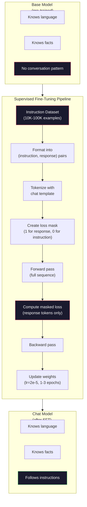

# Görev ayarlama (SFT)

> Bas model 会预测下一个 Token──仅此而已── It will not follow instructions、 answer questions, nor will reject harmful requests──SFT is a token 预测器 and useful assistant 桥梁──You've ever conversed with each model ― Claude、GPT、Llama Chat ― 都经历过这个步骤──

**类型：**Yapım
**语言：**Python (numpy ile)
**前置要求：**10. aşama, Ders 04 (Mini GPT'yi önceden eğitmek)
**时间：**~ 90 dakika

## Öğrenme hedefi

- 实现 supervised fine-tuning (SFT),将 baz dil modeli 转换为遵循指令的助手
- Sistem içeren kullanıcının ve yardımcı rollerinin sohbet şablonları  biçimlendirme eğitim verileri,并对非助手代码 屏蔽 Loss
- SFT'nin neden gerekli olduğunu açıklayın: Temel modeller soruları cevaplamak yerine metni devam ettirir
- 通過在保留的指示集合 上比较基模型与精细调调模型的回复,评估 SFT 质量

## 问题

Ders 04'te bir model eğitilmiştir. Bir dizi belirlemiş, bir sonraki simgeyi tahmin edebilmektedir. "Transformatör mimarisi"ne girmiş, sonra "doğal dil işlemeyi devrimlendirdi" ifadelerini çıkarabilir.

现在试试这个:向它输入 "Fransa'nın başkenti nedir?" temel modeli "Paris" cevabını vermez. "Bu modeli devam edecek. "Bu modeli üretebilmek mümkün. "Almanya'nın başkenti nedir? İspanya'nın başkenti nedir?", çünkü bu modeli içeren problem listesi dosyalarında bu modelin bulunduğu bir yerden öğrenmiştir.

İşte GPT-3 (basik model, 2020 yıl 6 ay yayınlandı) ve ChatGPT (gönüllü olarak düzenlenmiş, 2022 yıl 11 ay yayınlandı) arasındaki farkı. Aynı mimarlık, aynı ön eğitim.

Stanford Alpaca  kanıtlamak için milyonlarca örnek gerekmez. 2023 yılının 3 ayı, sadece GPT-3.5 ile Llama 7B'ye yapılan 52.000 talimat-reaksiyonla ince ayarlamalar yapıldı.

Meta'nın Llama 2 Chat'ı ilk SFT aşamasında sadece yaklaşık 27.000 yüksek kaliteli örnek kullanıldı.

## 概念

### SFT 实际做了什么

Denetim edilmiş Fine-Tuning                                                                                                                                                                                                                                                                                                                                                                                                                                                                                                                       

```json
{
  "system": "You are a helpful assistant.",
  "user": "What is the capital of France?",
  "assistant": "The capital of France is Paris."
}
```

model 已知道巴黎是法国的首都──它在维基百科、教材和网页上预训 中学到了这一点──SFT model yeni gerçekleri öğretmiyor──它教学模型 一种新的行为*:当你看到问题时,生成答──当你看到指示时,生成补全──当你看到有害请求时,生成拒绝──

Bu şekilde anlayabilirsiniz. Ön eğitim, model eğitimi.

### Görevi biçimi

Yapılarda üç biçim vardır. Her biçim aynı bilgiyi kodlar. Kim ne dedi? Sadece farklı ayırt edici kullanıyor.

**Alpaca Format**(Stanford, Mart 2023):

```json
{
  "instruction": "Summarize the following article in 3 sentences.",
  "input": "The European Central Bank raised interest rates...",
  "output": "The ECB increased rates by 25 basis points..."
}
```

简单且被广泛使用──`input`字段是可选的-- 许多指令不需要额外上下文──Stanford 发布了52,000 种这种格式的例子,由GPT-3.5 以 600 美元成本生成──这开启了开源指示调节运动──

**ShareGPT Format**(Topluluk, 2023):

```json
{
  "conversations": [
    {"from": "system", "value": "You are a helpful assistant."},
    {"from": "human", "value": "What causes tides?"},
    {"from": "gpt", "value": "Tides are caused by the gravitational pull of the Moon..."},
    {"from": "human", "value": "How often do they occur?"},
    {"from": "gpt", "value": "Most coastal areas experience two high tides and two low tides per day..."}
  ]
}
```

支持多轮对话──惯例, "from" 字段使用"human" 和 "gpt",不管实际模型是什么──Vicuna 使用从用户共享的ChatGPT抄录中抓取的70,000条 ShareGPT 对话进行训练──

**ChatML Format**(OpenAI, birçok açık kaynaklı modelde kullanılır):

```
<|im_start|>system
You are a helpful assistant.<|im_end|>
<|im_start|>user
What is the capital of France?<|im_end|>
<|im_start|>assistant
The capital of France is Paris.<|im_end|>
```

使用特殊 Token(`<|im_start|>`- Evet.`<|im_end|>`Bu Tokenler, ince ayarlama sırasında Tokenizer'in sözlüküne eklenir.

Üç çeşit biçim aynı şeyi gerçekleştirdi: modellere anlatıyorlar  bu talimat, bu cevap, öğrenmek bu biçim.

### Neden işe yarıyor?

Model, eğitim öncesi dönemlerden itibaren dil öğrenmiştir. Bu model, milyarlarca sorunun ardından cevapların ardından talimatların ardından tamamlanmaların yanı sıra insanla insan arasındaki konuşmaların örneklerini görmüştür.

SFT, bu potansiyel yeteneği odaklamak için, bir model olarak, soruya cevap vermesi gerektiğini belirlemek için, bir başvuruda bulunmak için, bir başvuruda bulunmak için, bir başvuruda bulunmak için, bir başvuruda bulunmak için, bir başvuruda bulunmak için, bir başvuruda bulunmak için, bir başvuruda bulunmak için, bir başvuruda bulunmak için, bir başvuruda bulunmak için, bir başvuruda bulunmak için, bir başvuruda bulunmak için, bir başvuruda bulunmak için, bir başvuruda bulunmak için, bir başvuruda bulunmak için, bir başvuruda bulunmak için, bir başvuruda bulunmak için, bir başvuruda bulunmak için, bir başvuruda bulunmak için, bir başvuruda bulunmak için, bir başvuruda bulunmak için, bir başvuruda bulunmak için, bir başvuruda bulunmak için, bir başvuruda bulunmak için, bir başvuruda bulunmak için, bir başvuruda bulunmak için, bir başvuruda bir başvuruda bulunmak için, bir başvuruda bulunmak için, bir başvuru bir başvuru olarak, bir başvuruda bulunmak için, bir başvuru olarak, bir başvuru olarak, bir başvuru olarak, bir başvuru olarak, bir başvuru olarak, bir başvuru olarak, bir başvuru olarak, bir başvuru olarak, bir başvuru olarak, bir başvuru olarak, bir başvuru olarak, bir başvuru olarak, bir başvuru olarak, bir başvuru, bir başvuru, bir başvuru,

Bu yüzden 27 bin örnek yeterlidir. İngilizceyi öğreten bir model değilsin. Dünyadaki gerçekleri öğreten bir model değilsin.

### Gizli Kayıplar

Bu SFT'de en önemli teknik ayrıntıdır, ama çoğu öğretim bunu atlatır.

SFT döneminde, sadece * cevap* Token  hesaplama Kayıpları için talimat Token kullanılır, ancak model yanlışlıktan ötürü  tahmin                                                                                                                                                                                                                                                                                                                                                                                                                                                                                           

Neden? Çünkü sen model istemiyorsun 学会*生成*指示──你希望它学会*响应*指示── Eğer talimatlara karşı karşısındasın Token 计算 Loss,你就是在训练模型 预测 "Fransa'nın başkenti nedir?",仿佛它才是问问者──

實踐中,你會创建一个损失面具:响应代币为 1,指示代币为 0──在取平均之前,将每个代币的损失 乘以这个面具──

```
Tokens:    [SYS] You are helpful [USER] What is the capital? [ASST] Paris is the capital [EOS]
Loss mask:   0    0    0     0      0     0   0  0     0       1     1    1   1     1      1
```

Sadece .`[ASST]`后的Token 会贡献 Loss──model 在前进传递期间将会看到完整对话( doğru bir yanıt oluşturmak için talimat gerektirir), ancak sadece onun öngörü yanıtının etkisine göre yenilemeler için ağırlıklar。

### 訓練 Hiperparametre

SFT kullanımı hiperparametre öncesi eğitimden çok farklıdır.

| Parameter | Pre-Training (Llama 2 7B) | SFT (Llama 2 Chat) |
|-----------|---------------------------|---------------------|
| Learning rate | 3e-4 (peak) | 2e-5 |
| Epochs | 1（单次遍历数据） | 2 |
| Batch size | 4M tokens | 64 examples |
| Warmup steps | 2,000 | 0-100 |
| Weight decay | 0.1 | 0.0-0.1 |
| Data size | 2T tokens | 27,000 examples |

SFT'nin öğrenme oranı 低15倍──これは非常に重要な──fine-tuning 期間中の過高の学習率 会破壊する前訓練知識──モデル 会忘れる学んだ内容,并超フィットする小型細調データセット 上──これは災難的な忘れる──

两个时代意味着模型将看到每个训练示例两次――在小数据集上超过3时代将导致记忆化――模型 开始逐字复现训练示例,而不是泛化――

### Kazaflı Unutulma

Düzgün ayarlama genel kapasiteyi bozabilir. Örgütleri takip eden veri üzerinde eğitim çok uzun süre, model kod yazma, matematik yapmak veya yaratıcı metin oluşturma yeteneğini kaybedebilir.

Üç çeşit çözümü:

1. **低 learning rate。**1e-5'e kadar 5e-5'e kadar daha küçük bir güncelleme önceden eğitilmiş özelliklere daha az zarar vermek anlamına gelir.

2. **短训练。**1-3 dönem.

3. **混入 pre-training 数据。**Llama 2 Chat 将一小部分(2-5%) 原始预训 数据混入 SFT dataset──这样可以在学习新指示后的行为时,提醒模型 保持通用能力──

### Gerçek sayı

10.000 个高质量 instruction pairs 上 fine-tune 一个7B modeli,单张NVIDIA A100 80GB GPU kullanmak yaklaşık 1 小时──计算如下:

- 10.000 örnek x 平均 512 token = 5.12M token
- 2 dönem =  toplam 10.24M token
- A100 için 7B model ince ayarlama ıııııııııııııııııııııııııııııııııııııııııııııııııııııııııııııııııııııııııııııııııııııııııııııııııııııııııııııııııııııııııııııııııııııııııııııııııııııııııııııııııııııııııııııııııııııııııııııııııııııııııııııııııııııııııııııııııııııııııııııııııııııııııııııııııııııııııııııııııııııııııııııııııııııııııııııııııııııııııııııııııııııııııııııııııııııııııııııııııııııııııııııııııııııııııııııııııııııııııııııııııııııııııııııııııııııııııııııııııııııııııııııııııııııııııııııııııııııııııııııııııııııııııııııııııııı
- 10.24M / 3,000 = ~ 3.400 saniye = ~ 57 dakika

◊ 4 katman, 128 dims) için, eğitim neredeyse anlık bir süreçtir.




```figure
loss-masking
```

## Yapım

### 步骤 1: Eğitim Verileri

合成 talimat verisi oluşturmak ⋅ üretim ortamında, AI ve Anthropic gibi şirketler bu verileri yazmak için yapay etiketçi işe alacak ⋅ biz bunları bir programlı şekilde oluştururuz, gösterim biçiminde ⋅

```python
import numpy as np

INSTRUCTION_DATA = [
    {
        "instruction": "What is the capital of France?",
        "response": "The capital of France is Paris."
    },
    {
        "instruction": "Explain gravity in one sentence.",
        "response": "Gravity is the force that attracts objects with mass toward each other."
    },
    {
        "instruction": "Write a haiku about the ocean.",
        "response": "Waves crash on the shore, salt and foam beneath the sun, endless blue expanse."
    },
    {
        "instruction": "What is 15 multiplied by 7?",
        "response": "15 multiplied by 7 is 105."
    },
    {
        "instruction": "Name three programming languages.",
        "response": "Three programming languages are Python, Rust, and TypeScript."
    },
    {
        "instruction": "Summarize photosynthesis.",
        "response": "Photosynthesis converts sunlight, water, and carbon dioxide into glucose and oxygen."
    },
    {
        "instruction": "What year did World War II end?",
        "response": "World War II ended in 1945."
    },
    {
        "instruction": "Define machine learning.",
        "response": "Machine learning is a field where algorithms learn patterns from data to make predictions."
    },
]
```

Stanford Alpaca'nın 52.000 tane kullandığı çok az örnek var. Ama 8 tane mi yoksa 52.000 tane mi varsa, tüm mekanizmalar aynı:

### 步骤 2: 使用 sohbet Şablonı  işaretleme yapın

Bu işaretler, model talimatın nerede bittiğini, cevapın nerede başladığını anlatır.

```python
SPECIAL_TOKENS = {
    "INST_START": 253,
    "INST_END": 254,
    "RESP_START": 255,
}


def tokenize_instruction_pair(instruction, response, vocab_size=256):
    inst_tokens = list(instruction.encode("utf-8"))
    resp_tokens = list(response.encode("utf-8"))

    inst_tokens = [min(t, vocab_size - 4) for t in inst_tokens]
    resp_tokens = [min(t, vocab_size - 4) for t in resp_tokens]

    tokens = (
        [SPECIAL_TOKENS["INST_START"]]
        + inst_tokens
        + [SPECIAL_TOKENS["INST_END"]]
        + [SPECIAL_TOKENS["RESP_START"]]
        + resp_tokens
    )

    return tokens


def create_loss_mask(tokens):
    mask = np.zeros(len(tokens), dtype=np.float32)
    in_response = False

    for i, token in enumerate(tokens):
        if token == SPECIAL_TOKENS["RESP_START"]:
            in_response = True
            continue
        if in_response:
            mask[i] = 1.0

    return mask
```

Kayıp maskesi, talimat simgesi, cevap simgesi,`RESP_START`Token'in maskası 0, çünkü bu bir ayırıcıdır, cevap içeriğinin bir parçası değil.

### 步骤 3: Gizli çapraz entropi kaybı

標準 交叉エントロピー, fakat乘以損失 maskı― 只有响应 Token 会贡献 Gradient―

```python
def masked_cross_entropy_loss(logits, targets, loss_mask):
    batch, seq_len, vocab_size = logits.shape
    logits_flat = logits.reshape(-1, vocab_size)
    targets_flat = targets.reshape(-1)
    mask_flat = loss_mask.reshape(-1)

    max_logits = logits_flat.max(axis=-1, keepdims=True)
    log_softmax = logits_flat - max_logits - np.log(
        np.exp(logits_flat - max_logits).sum(axis=-1, keepdims=True)
    )

    per_token_loss = -log_softmax[np.arange(len(targets_flat)), targets_flat]

    masked_loss = per_token_loss * mask_flat
    num_response_tokens = mask_flat.sum()
    if num_response_tokens == 0:
        return 0.0
    loss = masked_loss.sum() / num_response_tokens

    return loss
```

- Evet .`num_response_tokens`- Hayır .`seq_len`◊ Eğer genel dizi uzunluğu dışında, daha uzun talimatlar olacaktır rare释 Gradient 信号──除以响应符号数 命令长度如何, her cevap符号的权重相同──

### 步骤 4: SFT  eğitim döngüsü

复用课04 中的 MiniGPT──训练循环看起来几乎与预训类似,只是加入了指令格式化和掩盖损失──

```python
import sys
import os
sys.path.insert(0, os.path.join(os.path.dirname(__file__), "..", "..", "04-pre-training-mini-gpt", "code"))
from main import MiniGPT, LayerNorm, FeedForward, MultiHeadAttention, TransformerBlock, Embedding


def sft_train(model, dataset, num_epochs=2, lr=2e-5, seq_len=64):
    formatted_data = []
    for example in dataset:
        tokens = tokenize_instruction_pair(example["instruction"], example["response"])
        mask = create_loss_mask(tokens)
        formatted_data.append((tokens, mask))

    print(f"SFT Training: {len(formatted_data)} examples, {num_epochs} epochs, lr={lr}")
    print(f"Total tokens: {sum(len(t) for t, _ in formatted_data):,}")
    print()

    losses = []

    for epoch in range(num_epochs):
        epoch_loss = 0.0
        num_batches = 0

        indices = np.random.permutation(len(formatted_data))

        for idx in indices:
            tokens, mask = formatted_data[idx]

            if len(tokens) < 3:
                continue
            if len(tokens) > seq_len:
                tokens = tokens[:seq_len]
                mask = mask[:seq_len]

            input_ids = np.array(tokens[:-1]).reshape(1, -1)
            target_ids = np.array(tokens[1:]).reshape(1, -1)
            loss_mask = np.array(mask[1:]).reshape(1, -1)

            logits = model.forward(input_ids)
            loss = masked_cross_entropy_loss(logits, target_ids, loss_mask)

            batch_size, s_len, v_size = logits.shape
            probs = np.exp(logits - logits.max(axis=-1, keepdims=True))
            probs = probs / probs.sum(axis=-1, keepdims=True)
            dlogits = probs.copy()
            dlogits[np.arange(batch_size)[:, None], np.arange(s_len), target_ids] -= 1.0

            mask_expanded = loss_mask[:, :, np.newaxis]
            num_resp = loss_mask.sum()
            if num_resp > 0:
                dlogits = dlogits * mask_expanded / num_resp

            for block in model.blocks:
                block.ffn.W1 -= lr * np.random.randn(*block.ffn.W1.shape) * 0.01
                block.ffn.W2 -= lr * np.random.randn(*block.ffn.W2.shape) * 0.01
                block.ffn.b1 -= lr * np.random.randn(*block.ffn.b1.shape) * 0.01
                block.ffn.b2 -= lr * np.random.randn(*block.ffn.b2.shape) * 0.01

            epoch_loss += loss
            num_batches += 1
            losses.append(loss)

        avg_loss = epoch_loss / max(num_batches, 1)
        print(f"Epoch {epoch + 1}/{num_epochs} | Avg Loss: {avg_loss:.4f}")

    return model, losses
```

Öğrenme oranı 2e-5, 匹匹──将它与预训中使用的 3e-4对比-- 小 15 倍── Gradient 被蒙面:指示令牌 产生零 Gradient──只有响应令牌 推动重量──

### 5 adım: Base ile SFT modeli karşılaştır

SFT'nin tüm anlamı davranış değişiminde yer almaktadır.

```python
def generate_response(model, prompt_tokens, max_new_tokens=50, temperature=0.8):
    tokens = list(prompt_tokens)
    seq_len = model.embedding.pos_embed.shape[0]

    for _ in range(max_new_tokens):
        context = np.array(tokens[-seq_len:]).reshape(1, -1)
        logits = model.forward(context)
        next_logits = logits[0, -1, :]

        next_logits = next_logits / max(temperature, 1e-8)
        probs = np.exp(next_logits - next_logits.max())
        probs = probs / probs.sum()
        probs = np.clip(probs, 1e-10, 1.0)
        probs = probs / probs.sum()

        next_token = np.random.choice(len(probs), p=probs)
        tokens.append(int(next_token))

    return tokens


def evaluate_instruction_following(model, instructions):
    print("Evaluating instruction following:")
    print("-" * 50)

    for instruction in instructions:
        tokens = (
            [SPECIAL_TOKENS["INST_START"]]
            + [min(t, 252) for t in list(instruction.encode("utf-8"))]
            + [SPECIAL_TOKENS["INST_END"]]
            + [SPECIAL_TOKENS["RESP_START"]]
        )

        output = generate_response(model, tokens, max_new_tokens=30, temperature=0.6)
        response_start = len(tokens)
        response_tokens = output[response_start:]
        response_bytes = bytes([t for t in response_tokens if t < 128])
        response_text = response_bytes.decode("utf-8", errors="replace")

        print(f"  Q: {instruction}")
        print(f"  A: {response_text[:80]}")
        print()
```

Sadece 8 örnekten oluşan küçük modellerde, tekrarlama gerçek anlamı olmayacaktır. Bu beklenilen bir şeydir. Önemli olan, model, daha fazla talimat üretmeye devam etmek yerine, cevap işaretçisinde çıkış üretir.

### 步骤 6: 衡量灾难性忘记

SFT'nin önümüzdeki modelinin öncü belirti tahmin yeteneği ile karşılaştırın. SFT'nin genel kullanım yeteneğini bozarsa, ham metin üstündeki kaybı artacaktır.

```python
def measure_forgetting(model, test_text, seq_len=64):
    tokens = np.array(list(test_text.encode("utf-8")[:512]))

    total_loss = 0.0
    num_windows = 0

    for start in range(0, len(tokens) - seq_len - 1, seq_len):
        input_ids = tokens[start:start + seq_len].reshape(1, -1)
        target_ids = tokens[start + 1:start + seq_len + 1].reshape(1, -1)

        logits = model.forward(input_ids)

        batch, s_len, vocab_size = logits.shape
        logits_flat = logits.reshape(-1, vocab_size)
        targets_flat = target_ids.reshape(-1)

        max_logits = logits_flat.max(axis=-1, keepdims=True)
        log_softmax = logits_flat - max_logits - np.log(
            np.exp(logits_flat - max_logits).sum(axis=-1, keepdims=True)
        )

        loss = -log_softmax[np.arange(len(targets_flat)), targets_flat].mean()
        total_loss += loss
        num_windows += 1

    return total_loss / max(num_windows, 1)
```

Gerçek ince ayarlamalarda, tüm antrenman süreci boyunca bu metrikleri takip edeceksiniz. Eğer ham metin kaybı %10-15'in üzerinde artarsa, SFT'nin aşırı gelişimini gösterir.

## kullanımı

### 完整 SFT boru hattı demo

```python
if __name__ == "__main__":
    np.random.seed(42)

    test_text = """The transformer architecture processes sequences through self-attention.
Each layer applies multi-head attention followed by a feedforward network.
Residual connections and layer normalization stabilize deep networks.
The model learns to predict the next token given all previous tokens."""

    print("=" * 70)
    print("INSTRUCTION TUNING (SFT) DEMO")
    print("=" * 70)
    print()

    model = MiniGPT(
        vocab_size=256, embed_dim=128, num_heads=4,
        num_layers=4, max_seq_len=128, ff_dim=512
    )
    print(f"Model: {model.count_parameters():,} parameters")
    print(f"Config: 4 layers, 4 heads, 128 dims (mini GPT from Lesson 04)")
    print()

    print("PRE-SFT: Measuring base model loss on raw text")
    base_loss = measure_forgetting(model, test_text)
    print(f"  Base model loss: {base_loss:.4f}")
    print()

    print("=" * 70)
    print("SFT TRAINING")
    print("=" * 70)

    model, losses = sft_train(
        model, INSTRUCTION_DATA, num_epochs=3, lr=2e-5, seq_len=128
    )

    print()
    print("POST-SFT: Measuring fine-tuned model loss on raw text")
    sft_loss = measure_forgetting(model, test_text)
    print(f"  SFT model loss: {sft_loss:.4f}")
    print(f"  Change: {((sft_loss - base_loss) / base_loss * 100):+.1f}%")
    if abs(sft_loss - base_loss) / base_loss < 0.15:
        print("  Minimal forgetting (< 15% change)")
    else:
        print("  Significant forgetting detected")
    print()

    print("=" * 70)
    print("INSTRUCTION FOLLOWING EVALUATION")
    print("=" * 70)
    print()

    test_instructions = [
        "What is the capital of France?",
        "Name a programming language.",
        "Define gravity.",
    ]
    evaluate_instruction_following(model, test_instructions)

    print("=" * 70)
    print("DATA FORMAT EXAMPLES")
    print("=" * 70)
    print()

    for i, example in enumerate(INSTRUCTION_DATA[:3]):
        tokens = tokenize_instruction_pair(example["instruction"], example["response"])
        mask = create_loss_mask(tokens)
        resp_count = int(mask.sum())
        total_count = len(tokens)
        print(f"  Example {i + 1}: {total_count} tokens, {resp_count} response tokens ({resp_count/total_count:.0%} of sequence)")
        print(f"    Instruction: {example['instruction']}")
        print(f"    Response: {example['response']}")
        print()

    print("=" * 70)
    print("TRAINING LOSS CURVE")
    print("=" * 70)
    print()

    if losses:
        window = max(1, len(losses) // 5)
        for i in range(0, len(losses), window):
            chunk = losses[i:i + window]
            avg = sum(chunk) / len(chunk)
            print(f"  Steps {i:3d}-{i + len(chunk) - 1:3d}: avg loss = {avg:.4f}")
```

## 交付

本课会产 出 `outputs/prompt-sft-data-curator.md`-- bir sürpriz, size SFT  tasarım ve kurgu talimatları veri kümeleri için yardımcı olacaktır.

## 练习

1. 添加 sistem prompt 支持──修改 `tokenize_instruction_pair`, sistem mesajını kabul etmesini sağlamak,并将其置 instruction 之前──创建 5 个带有不同的系统提示的例子:"Sen bir şairsin"",Sen bir matematik öğretmeniysen") ,并验证模型 在训练期间会见不同的系统提示──

2. 实现数据混合──创建一个函数,接收一个SFT数据集 和一个原文体,然后生成训练批,其中5%的例子是原文 (((无掩饰),95%是指令对 (((掩饰) ;;运行 3 个时代,并将忘记指标与纯SFT训练 进行比较──

3. 构建数据质量评分器──对每个指示-响应对,计算:(a)响应长度在代币中,(b)指示-响应比例,(c)词汇多样性(独特代币/总代币)──过掉响应长度 < 10代币或多样性 < 0.3 的示例──展示过如何影响最终损失──

4. 实现多轮对话训练――扩展代码化,使其处理3轮对话(user-assistant-user-assistant-user-assistant) ――loss mask 应覆盖全部三个助手转――通过打印一个示例的代码-面具配线 来验证面具 是否正确――

5. Etkinlik oranlarını karşılaştırın. Lr=1e-4、lr=2e-5 和 lr=1e-6 分別訓練同一個模型三次──绘制損失曲線──1e-4'ün çalışmaları hızlı başlangıçta düşeceği, ancak son kaybı daha yüksek hale getiren, daha yüksek hale getiren, daha fazla uyum sağlayan, daha yüksek hale getiren, daha yüksek hale getiren, daha yüksek hale getiren, daha yüksek hale getiren, daha yüksek hale getiren, daha yüksek hale getiren, daha yüksek hale getiren, daha yüksek hale getiren, daha yüksek hale getiren, daha yüksek hale getiren, daha yüksek hale getiren, daha yüksek hale getiren, daha yüksek hale getiren, daha yüksek hale getiren, daha yüksek hale getiren, daha yüksek hale getiren, daha yüksek hale getiren, daha yüksek hale getiren, daha yüksek hale getiren, daha yüksek hale getiren, daha yüksek hale getiren, daha yüksek hale getiren, daha yüksek hale getiren, daha yüksek hale getiren, daha yüksek düzeye ulaşan, daha yüksek düzeyde, daha yüksek düzeyde yükselen.

## 关键术语

| Term | 常见说法 | 实际含义 |
|------|----------------|----------------------|
| SFT | “在对话上 fine-tuning” | Supervised Fine-Tuning：在 (instruction, response) pairs 上继续训练，并且只对 response Token 计算 Loss |
| Instruction tuning | “教 model 遵循指令” | 在显式 instruction-response pairs 上训练，使 base model 学会对话模式，而不是新知识 |
| Loss masking | “忽略 prompt” | 将 instruction Token 的 Loss 设为零，使 Gradient 只来自 response Token 预测 |
| ChatML | “Chat Markup Language” | 一种 Token 格式，使用 `<\|im_start\|>` 和 `<\|im_end\|>` 分隔符标记 conversation data 中的说话者角色 |
| Alpaca format | “Stanford 的格式” | 一种包含 instruction/input/output 字段的 JSON 格式，用于 52K 个由 GPT-3.5 生成、成本为 600 美元的示例 |
| Catastrophic forgetting | “model 变笨了” | Fine-tuning 会破坏 pre-trained capabilities，因为 Gradient 更新会用 task-specific patterns 覆盖 general knowledge |
| Weight tying | “共享 Embeddings” | 对 input Token Embeddings 和 output prediction head 使用同一个 Matrix，从而节省参数并提升一致性 |
| Chat template | “prompt 的格式化方式” | 用于为 model 结构化对话的特定 Token 序列（role markers、delimiters） |

## 延伸阅读

- [Ouyang et al., 2022 -- "Training language models to follow instructions with human feedback" (InstructGPT)](https://arxiv.org/abs/2203.02155)-- 在 OpenAI 引入 instruction tuning + RLHF 的论文
- [Taori et al., 2023 -- "Stanford Alpaca: An Instruction-following LLaMA Model"](https://github.com/tatsu-lab/stanford_alpaca)-- 600 $ üretilen 52K talimat örnekleri, SFT küçük veri kitlesinde de geçerli kanıt
- [Touvron et al., 2023 -- "Llama 2: Open Foundation and Fine-Tuned Chat Models"](https://arxiv.org/abs/2307.09288)-- Meta kullanmak 27K Yüksek Kaliteli örnekler SFT + RLHF boru hattı
- [Chiang et al., 2023 -- "Vicuna: An Open-Source Chatbot Impressing GPT-4"](https://lmsys.org/blog/2023-03-30-vicuna/)-- 70K ShareGPT sohbetlerinde eğitim yapın
- [Zhou et al., 2023 -- "LIMA: Less Is More for Alignment"](https://arxiv.org/abs/2305.11206)--                                                                                                                                                                                                                                                                                                                                                                                                                                                                                                                             
