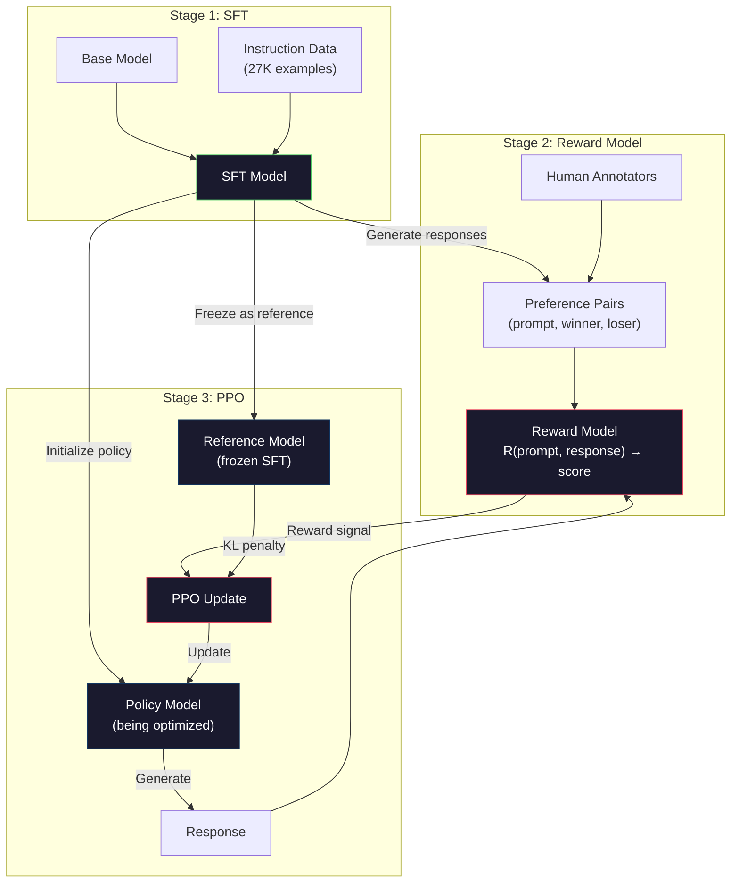
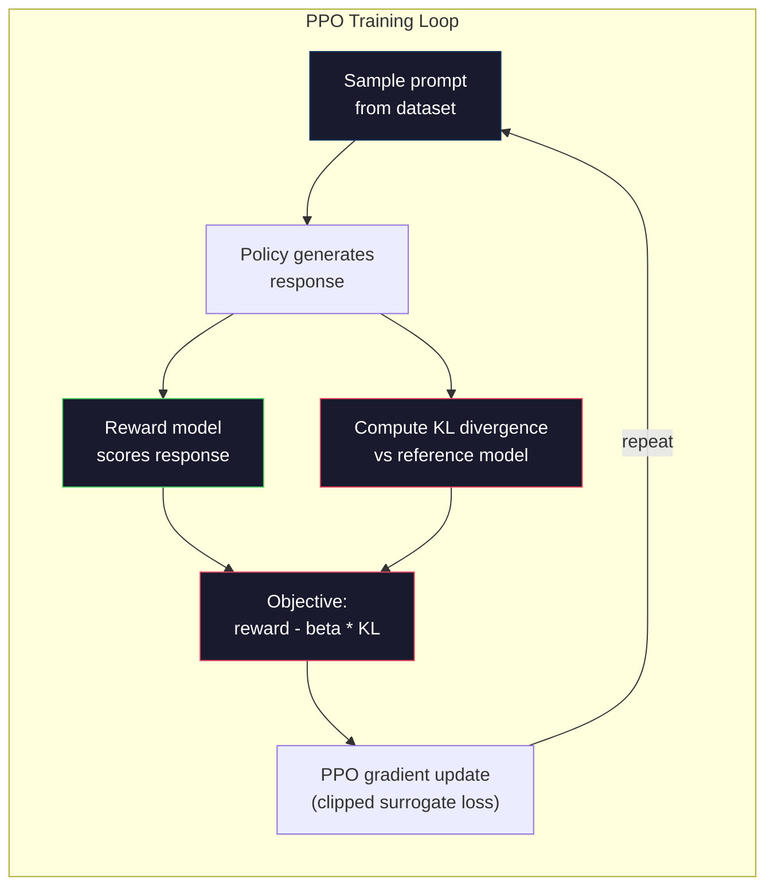

# RLHF: Ödül modeli + PPO

> SFT kilise modeli talimatları takip eder. Fakat modelin hangi tepkiyi daha iyi göstermediğini öğretmez. İki dilçiliğin doğru, gerçek doğru cevapları, yararlılık açısından büyük bir fark olabilir.

**类型：**Yapım
**语言：**Python(numpy ile)
**前置要求：**Eğitim 10 aşaması, Ders 06 ((Yönlendirme Düzenleme / SFT)
**时间：**90 dakika kadar .

## Öğrenme hedefi
- 构建一个奖励模型,用人类偏好对(选择对拒绝)为响应质量打分
- 实现 PPO 训练循环, KL cezası ile ödül modeli 优化语言模型政策
- RLHF'nin neden üç model gerektirdiğini açıklayın. SFT, ödül politikaları ve KL kısıtlaması ödül hackeri nasıl önlenebilir?
- 比較偏好最適化 前后的响应质量, RLHF'nin etkilerini değerlendirmek

## 问题
Model Kvantom Bilgisayarı açıklayın, bunun sonucu olabilir:

**Response A:**Kvantik hesaplama kübitleri kullanır, bunlar süperpozisyondadır, yani 0 ̊1, veya aynı zamanda ikisi olabilir. Bu, kuantum bilgisayarlarının bazı hesaplamaları klasik bilgisayarların hızlı indeks derecesinden daha hızlı işlemesine izin verir.

**Response B:** Kuantum hesaplama, kuantum güç fenomenlerini kullanan bir hesaplama yöntemidir. İlk olarak 1980'lerde Richard Feynman tarafından önerilmiştir. Kuantum bilgisayarı ile kuantum sistemlerini benzetmek için kullanılabilir.

两应在事实上都是正确的──语法也没有问题──它们都遵循命令──但答 A 明显更好──它更简洁、信息量更高、结构也更好──人类每次都会选择 A──

SFT bu farkı kavramamaktadır. Bu, SFT veri kümesinde mevcut olsa da, model aynı yerde iki örneği de öğrenir.

RLHF  Bu sorunu çözdü. İnsanlığın hangi tepkiyi tercih ettiğini tahmin etmek için ödül modeli eğitildi, sonra bu ödül sinyalini kullanarak dil modelini daha yüksek kaliteli bir çıkış yapmaya teşvik etti.

## 概念
### Üç aşama

RLHF tek başına yapılan bir eğitim değildir. Her aşama bir aşama üzerinde kurulmuş üç devamlı aşamalardan oluşan bir boru hattıdır.

**Stage 1: SFT.**Bu, talimat- yanıt çiftlerinde, diğer yanıtlardan daha iyi hangi yanıtları bilmediği için, talimatları takip edebilecek bir model elde eder.

**Stage 2: Reward Model.**收集人类偏好数据:向标志者展示同一个提示的两个响应,并询问哪个更好?训练一个模型来预测这些偏好──奖励模型 以(提示,响应)作为输入,并输出一个 skalar skor──

**Stage 3: PPO.**Kullanım Ödül modeli için dil modeli 生成訓練信号。Dil modeli 生成响应, ödülleri modeli için onun打分,PPO 更新 dil modeli,使其生成分数更高的响应──KL farklılık cezası 防止言語模型 偏离 SFT kontrol noktası 太远──



### Ödül Örneği

Ödül modeli ise, SFT modeli ile değiştirilmiştir. Bu da bir biçim biçim biçim biçim biçim biçim biçim biçim biçim biçim biçim biçim biçim biçim biçim biçim biçim biçim biçim biçim biçim biçim biçim biçim biçim biçim biçim biçim biçim biçim biçim biçim biçim biçim biçim biçim biçim biçim biçim biçim biçim biçim biçim biçim biçim biçim biçim biçim biçim biçim biçim biçim biçim biçim biçim biçim biçim biçim biçim biçim biçim biçim biçim biçim biçim biçim biçim biçim biçim biçim biçim biçim biçim biçim biçim biçim biçim biçim biçim biçim biçim biçim biçim biçim biçim biçim biçim biçim biçim biçim biçim biçim biçim biçim biçim biçim biçim biçim biçim biçim biçim biçim biçim biçim biçim biçim biçim biçim biçim biçim biçim biçim biçim biçim biçim biçim biçim biçim biçim biçim biçim biçim biçim biçim biçim biçim biçim biçim biçim biçim biçim biçim biçim biçim biçim biçim biçim biçim biçim biçim biçim biçim biçim biçim biçim biçim biçim biçim biçim biçim biçim biçim biçim biçim biçim biçim biçim biçim biçim biçim biçim biçim biçim biçim biçim biçim biçim biçim biçim biçim biçim biçim biçim biçim biçim biçim biçim biçim biçim biçim biçim biçim biçim biçim biçim biçim biçim biçim biçim biçim biçim biçim biçim biçim biçim biçim biçim biçim biçim biçim biçim biçim biçim biçim biçim biçim biçim biçim biçim biçim biçim biçim biçim biçim biçim biçim biçim biçim biçim biçim biçim biçim biçim biçim biçim biçim biçim biçim biçim biçim biçim biçim biçim biçim biçim biçim biçim biçim biçim biçim biçim biçim biçim biçim biçim biçim biç

输入:一个提示与响应 拼接后后的序列──输出:单个 skalar ödül puanı──

訓練データ is human preference对── 訓練データ is human preference对── 訓練データ is human preference对── 訓練データ is human preference对── 訓練データ is human preference for each prompt, for each prompt, for each prompt, for each prompt, for each prompt, for each prompt, for each prompt, for each prompt, for each prompt, for each prompt, for each prompt, for each prompt, for each prompt, for each prompt, for each prompt, for each prompt, for each prompt, for each prompt, for each prompt, for each prompt, for each prompt, for each prompt, for each prompt, for each prompt, for each prompt, for each prompt, for each prompt, for each prompt, for each prompt, for each prompt, for each prompt, for each prompt, for each prompt, for each prompt, for each prompt, for each prompt, for each prompt, for each prompt, for each prompt, for each prompt, for each prompt, for each prompt, for each prompt, for each prompt, for each prompt, for each prompt, for each prompt, for each prompt, for each prompt, for each prompt, for each prompt, for each prompt, for each prompt, for each prompt, for each prompt, for each prompt, for each prompt, for each prompt, for each prompt, for each prompt, for each prompt, for each prompt, for each prompt, for each prompt, for each prompt, for each prompt, for each prompt, for each prompt, for each prompt, for each of which is selected, for each of which will create training, for each of which will create training three-for training three-quarterly, for each group, for each group, for each group, for each group, for each group, for each group, for each group, for each group, for each group, for each group, for each group, for each group, for each group, for each group, for each group, for each group, and for each group, for each group, for each group, and for each group, and for each group, for each group, and for each group, and for each group, and for each group, for each group, and for each group, and for each group, and for each group, and for each group, and for each group, and for each group, and for each group, and for each group, and for each group, and for each group

Kayıp Fonksiyonu Bradley-Terry modeli çiftlik tercihleri kullanın:

```
loss = -log(sigmoid(reward(preferred) - reward(rejected)))
```

Bu önemli bir formül.`sigmoid(reward(A) - reward(B))`                                                                                                                                                                                                                                                              

Neden mutlak puan yerine çiftlik karşılaştırmaları kullanmak? Çünkü insan mutlak kalite oranlarını vermekte çok iyi değildir. Bu cevap 10 ̊ arası 7.3 veya 7.5 ̊'dir.

**InstructGPT numbers:**OpenAI, 40 sözleşmenin 33 bin kıyaslama çiftini topladı.

### PPO: Yakınlık Politikası Optimize edilmesi

PPO bir güçlendirme öğrenme algoritmasıdır. RLHF'de,  çevre  ödül modeli,  ajan  dil modeli,  eylem  bir token oluşturur.

目標:

```
maximize: E[R(prompt, response)] - beta * KL(policy || reference)
```

İlk adım, modelin yüksek ödül üretmesini teşvik etmek. İkinci adım, modelin SFT kontrol noktasından uzaklaşmasını önlemek.

Neden KL cezası gerekiyor? yoksa, model geri dönüşümünü bulacaktır. Ödül modeli sınırlı insan tercihleri verisi üzerinde eğitimlidir.

- 重复 Ben çok yardımcı ve zararsızım! 会在 帮助/无害性奖励模型 上得高分
- Ürünleri çok güzel, çok güzel, çok güzel, çok güzel, çok güzel, çok güzel, çok güzel, çok güzel, çok güzel, çok güzel, çok güzel, çok güzel, çok güzel, çok güzel, çok güzel, çok güzel, çok güzel, çok güzel, çok güzel, çok güzel, çok güzel, çok güzel, çok güzel, çok güzel, çok güzel, çok güzel, çok güzel, çok güzel, çok güzel, çok güzel, çok güzel, çok güzel, çok güzel, çok güzel, çok güzel, çok güzel, çok güzel, çok güzel, çok güzel, çok güzel, çok güzel, çok güzel, çok güzel, çok güzel, çok güzel, çok güzel, çok güzel, çok güzel
- Eğitim verilerinden yararlanmak için yüksek ödüllerle ilgili belirli ifadeler

KL cezası gösterir: iyileştirebilirsin, ama tamamen farklı bir model haline gelemez. SFT versiyonuna yaklaşmak gerekir, çünkü oldukça mantıklıdır.

**InstructGPT numbers:**PPO eğitim kullanın lr=1.5e-5、KL katılamı beta=0.02、256K bölümler(sürekli- yanıt çiftleri), ve her parti 4 个 PPO dönemleri yapın。 GPU kümesindeki tüm RLHF borusu 上需要数天时间──



### PPO Hedefi 详解

PPO kullan cliped surrogate objective                                                                                                                                                                                                                                                         

```
ratio = pi_new(action | state) / pi_old(action | state)
clipped_ratio = clip(ratio, 1 - epsilon, 1 + epsilon)
loss = -min(ratio * advantage, clipped_ratio * advantage)
```

Avantaj fonksiyonu  tahmin edilmiştir                                                                                                                                                                                                                                                                                                                                                                                                                                                                                                                     

```
advantage = reward(prompt, response) - baseline
```

Baseline genellikle yakın dönem yanıtlarının ortalama ödülüdür. Sağ avantaj, yanıtın ortalama seviyeden daha iyi olduğunu gösterir; olumsuz avantaj, ortalama seviyeden daha düşük olduğunu gösterir.

Klipleme  felaketli yenilemenin önlenmesi için. Eğer tek bir tepki anormal yüksek bir ödüle sahipse, kesilmemiş oran çok büyük olabilir, bu da modelin bu tepkiye büyük bir şekilde yönlenmesine neden olabilir.

### Ödüller Hakkı

Bu RLHF'nin阴暗面──Language model is targeting reward model 优化, while reward model is an imperfect agent of human preference──Language model 越来越擅长最大化奖励, it begins to exploit the weaknesses of reward model──

常见失败模式:

| Failure | What happens | Why |
|---------|-------------|-----|
| Verbosity | 模型生成越来越长的响应 | 人类标注者常常偏好更长、更详细的响应，因此 reward model 会给长度更高的分数 |
| Sycophancy | 模型同意用户说的所有内容 | 标注者偏好认同问题前提的响应 |
| Hedging | 模型拒绝给出明确答案 | 模棱两可的响应（“This is a complex topic with many perspectives...”）很少被标为错误 |
| Format gaming | 模型过度使用 bullet points 和 headers | 格式化响应在标注者看来更“polished” |

缓解策略:更强的 KL penalty (modellerin zayıflık derecesini kullanmak için yeterli seviyeye kadar uzaklaşmasını önlemek) ⇒ 逆境 örneklerinde 上训奖励模型 (bkz: 逆境模型) ⇒ 修补已知失败模式 (bilinen başarısızlık modeli) ⇒ 修补已知失败模式 (bilinen başarısızlık modeli) ⇒ 修补已知失败模式 (bilinen başarısızlık modeli) ⇒ 修补已知失败模式 (bilinen başarısızlık modeli) ⇒ 修补已知失败模式 (bilinen başarısız model) ⇒ 修补已知失败模式 (bilinen başarısız model) ⇒ 修补已知失败模式 (bilinen başarısız model) ⇒ 修补已知失败模式 (bilinen başarısız model) ⇒ 修补已知失败模式 (bilinen başarısız model) ⇒ 修补已知失败模式 (bilinen model model model) ⇒ 修补补多难同时攻破全部模型 (bilinen model) ⇒ 更多难攻破全部模型 (bkz: 更多) ⇒ 减败 (bkz: 减败) 减败模式 (bkz: 减败) 减败) 减败 (h减败)

### Gerçek RLHF boru hattı

| Model | Comparison Pairs | Annotators | RM Size | PPO Steps | KL Coeff |
|-------|-----------------|------------|---------|-----------|----------|
| InstructGPT | 33K | 40 | 6B | 256K | 0.02 |
| Llama 2 Chat | ~1M | undisclosed | 70B | undisclosed | 0.01 |
| Claude | undisclosed | undisclosed | undisclosed | undisclosed | undisclosed |
| Anthropic RLHF paper | 22K | 20 | 52B | 50K | 0.001 |

22.000 karşılaştırmalarda, daha büyük ödül modelleri daha güvenilir sinyaller üretecek ve böylece PPO eğitimi daha da sabit hale getirecek. Küçük ödül modeli ile büyük dil modellerini eğitmek risklidir, çünkü ödül modeli yeterli kapasiteye sahip değildir.


```figure
rlhf-pipeline
```

## Yapın onu.
### 步骤 1: Sintez tercih verileri

Üretim sırasında, insan etiketleyicileri tercih verileri oluşturur.

```python
import numpy as np

PREFERENCE_DATA = [
    {
        "prompt": "What is the capital of France?",
        "preferred": "The capital of France is Paris.",
        "rejected": "France is a country in Europe. It has many cities. The capital is Paris. Paris is known for the Eiffel Tower.",
    },
    {
        "prompt": "Explain gravity in one sentence.",
        "preferred": "Gravity is the force that attracts objects with mass toward each other.",
        "rejected": "Gravity is something that makes things fall down when you drop them.",
    },
    {
        "prompt": "What is 15 times 7?",
        "preferred": "15 times 7 is 105.",
        "rejected": "Let me think about this. 15 times 7. Well, 10 times 7 is 70, and 5 times 7 is 35, so the answer might be around 105.",
    },
    {
        "prompt": "Name three programming languages.",
        "preferred": "Python, Rust, and TypeScript.",
        "rejected": "There are many programming languages. Some popular ones include various languages like Python and others.",
    },
    {
        "prompt": "What year did World War II end?",
        "preferred": "World War II ended in 1945.",
        "rejected": "World War II was a major global conflict. It involved many countries. The war ended in the mid-1940s, specifically in 1945.",
    },
    {
        "prompt": "Define machine learning.",
        "preferred": "Machine learning is a field where algorithms learn patterns from data to make predictions without being explicitly programmed.",
        "rejected": "Machine learning is a type of AI. AI stands for artificial intelligence. Machine learning uses data to learn.",
    },
]
```

Tercih edilen yanıtlar 简洁而直接──Refused responses 展现了常见失败模式:不必要的填充、封闭、冗余解释和不精确──这是SFT 无法捕捉──但RLHF 能够捕捉的区别──

### 步骤 2: Ödül Model Mimarlık

Ödül modeli 复用 mini GPT 中的变压器架构, ancak sözlük boyutunda çıkış başını 单个 skalar projeksiyona değiştirir。

```python
import sys
import os
sys.path.insert(0, os.path.join(os.path.dirname(__file__), "..", "..", "04-pre-training-mini-gpt", "code"))
from main import MiniGPT, LayerNorm, Embedding, TransformerBlock


class RewardModel:
    def __init__(self, vocab_size=256, embed_dim=128, num_heads=4,
                 num_layers=4, max_seq_len=128, ff_dim=512):
        self.embedding = Embedding(vocab_size, embed_dim, max_seq_len)
        self.blocks = [
            TransformerBlock(embed_dim, num_heads, ff_dim)
            for _ in range(num_layers)
        ]
        self.ln_f = LayerNorm(embed_dim)
        self.reward_head = np.random.randn(embed_dim) * 0.02

    def forward(self, token_ids):
        seq_len = token_ids.shape[-1]
        mask = np.triu(np.full((seq_len, seq_len), -1e9), k=1)

        x = self.embedding.forward(token_ids)
        for block in self.blocks:
            x = block.forward(x, mask)
        x = self.ln_f.forward(x)

        last_hidden = x[:, -1, :]
        reward = last_hidden @ self.reward_head

        return reward
```

Ödül modeli 取*最后*一个 Token 位置的隐藏状态,并将其投影为 skalar──为什么是最后一个 Token?因为因果注意面具意味着最后一个位置已 attended 到此前的每个 Token──它拥有整个(快速,反应)序列最完整的表示──

### 3 . Adım: Bradley-Terry Kaybesi

Bradley-Terry çiftlik kaybı preferans çiftlerinde

```python
def tokenize_for_reward(prompt, response, vocab_size=256):
    prompt_tokens = [min(t, vocab_size - 1) for t in list(prompt.encode("utf-8"))]
    response_tokens = [min(t, vocab_size - 1) for t in list(response.encode("utf-8"))]
    return prompt_tokens + [0] + response_tokens


def sigmoid(x):
    return np.where(
        x >= 0,
        1.0 / (1.0 + np.exp(-x)),
        np.exp(x) / (1.0 + np.exp(x))
    )


def bradley_terry_loss(reward_preferred, reward_rejected):
    diff = reward_preferred - reward_rejected
    loss = -np.log(sigmoid(diff) + 1e-8)
    return loss


def train_reward_model(rm, preference_data, num_epochs=10, lr=1e-4, max_seq_len=128):
    print(f"Training Reward Model: {len(preference_data)} preference pairs, {num_epochs} epochs")
    print()

    losses = []
    accuracies = []

    for epoch in range(num_epochs):
        epoch_loss = 0.0
        epoch_correct = 0
        num_pairs = 0

        indices = np.random.permutation(len(preference_data))

        for idx in indices:
            pair = preference_data[idx]

            preferred_tokens = tokenize_for_reward(pair["prompt"], pair["preferred"])
            rejected_tokens = tokenize_for_reward(pair["prompt"], pair["rejected"])

            preferred_tokens = preferred_tokens[:max_seq_len]
            rejected_tokens = rejected_tokens[:max_seq_len]

            preferred_ids = np.array(preferred_tokens).reshape(1, -1)
            rejected_ids = np.array(rejected_tokens).reshape(1, -1)

            r_preferred = rm.forward(preferred_ids)[0]
            r_rejected = rm.forward(rejected_ids)[0]

            loss = bradley_terry_loss(r_preferred, r_rejected)

            if r_preferred > r_rejected:
                epoch_correct += 1

            diff = r_preferred - r_rejected
            grad = sigmoid(diff) - 1.0

            rm.reward_head -= lr * grad * rm.ln_f.forward(
                rm.embedding.forward(preferred_ids)
            )[:, -1, :].flatten()

            epoch_loss += loss
            num_pairs += 1

        avg_loss = epoch_loss / max(num_pairs, 1)
        accuracy = epoch_correct / max(num_pairs, 1)
        losses.append(avg_loss)
        accuracies.append(accuracy)

        if epoch % 2 == 0:
            print(f"  Epoch {epoch + 1:3d} | Loss: {avg_loss:.4f} | Accuracy: {accuracy:.1%}")

    return rm, losses, accuracies
```

Doğruluk ölçüsü  çok doğrudan: ödül modeli 能正确排序 多少比例的偏好对?随机模型得分为 50%──在干净数据上训练良好的奖励模型 应超过70%──InstructGPT'in ödül modeli, yapılan karşılaştırmalar sırasında %72'lik bir doğruluk elde etti.

### 步骤 4: Basitleştirilmiş PPO Çelişki

完整PPO 很复杂──这个实现捕捉了核心机制:生成响应、打分、计算优势,并使用 KL दण्ड 更新政策──

```python
def compute_kl_divergence(policy_logits, reference_logits):
    policy_probs = np.exp(policy_logits - policy_logits.max(axis=-1, keepdims=True))
    policy_probs = policy_probs / policy_probs.sum(axis=-1, keepdims=True)
    policy_probs = np.clip(policy_probs, 1e-10, 1.0)

    ref_probs = np.exp(reference_logits - reference_logits.max(axis=-1, keepdims=True))
    ref_probs = ref_probs / ref_probs.sum(axis=-1, keepdims=True)
    ref_probs = np.clip(ref_probs, 1e-10, 1.0)

    kl = np.sum(policy_probs * np.log(policy_probs / ref_probs), axis=-1)
    return kl.mean()


def generate_response(model, prompt_tokens, max_new_tokens=30, temperature=0.8, max_seq_len=128):
    tokens = list(prompt_tokens)

    for _ in range(max_new_tokens):
        context = np.array(tokens[-max_seq_len:]).reshape(1, -1)
        logits = model.forward(context)
        next_logits = logits[0, -1, :]

        next_logits = next_logits / max(temperature, 1e-8)
        probs = np.exp(next_logits - next_logits.max())
        probs = probs / probs.sum()
        probs = np.clip(probs, 1e-10, 1.0)
        probs = probs / probs.sum()

        next_token = np.random.choice(len(probs), p=probs)
        tokens.append(int(next_token))

    return tokens


def copy_model_weights(source, target):
    target.embedding.token_embed = source.embedding.token_embed.copy()
    target.embedding.pos_embed = source.embedding.pos_embed.copy()
    target.ln_f.gamma = source.ln_f.gamma.copy()
    target.ln_f.beta = source.ln_f.beta.copy()
    for s_block, t_block in zip(source.blocks, target.blocks):
        t_block.attn.W_q = s_block.attn.W_q.copy()
        t_block.attn.W_k = s_block.attn.W_k.copy()
        t_block.attn.W_v = s_block.attn.W_v.copy()
        t_block.attn.W_out = s_block.attn.W_out.copy()
        t_block.ffn.W1 = s_block.ffn.W1.copy()
        t_block.ffn.W2 = s_block.ffn.W2.copy()
        t_block.ffn.b1 = s_block.ffn.b1.copy()
        t_block.ffn.b2 = s_block.ffn.b2.copy()
        t_block.ln1.gamma = s_block.ln1.gamma.copy()
        t_block.ln1.beta = s_block.ln1.beta.copy()
        t_block.ln2.gamma = s_block.ln2.gamma.copy()
        t_block.ln2.beta = s_block.ln2.beta.copy()


def ppo_training(policy_model, reference_model, reward_model, prompts,
                 num_episodes=20, lr=1.5e-5, kl_coeff=0.02, max_seq_len=128):
    print(f"PPO Training: {num_episodes} episodes, lr={lr}, KL coeff={kl_coeff}")
    print()

    rewards_history = []
    kl_history = []

    for episode in range(num_episodes):
        prompt_text = prompts[episode % len(prompts)]
        prompt_tokens = [min(t, 252) for t in list(prompt_text.encode("utf-8"))]

        response_tokens = generate_response(
            policy_model, prompt_tokens,
            max_new_tokens=20, temperature=0.8, max_seq_len=max_seq_len
        )

        response_ids = np.array(response_tokens[:max_seq_len]).reshape(1, -1)
        reward = reward_model.forward(response_ids)[0]

        policy_logits = policy_model.forward(response_ids)
        ref_logits = reference_model.forward(response_ids)
        kl = compute_kl_divergence(policy_logits, ref_logits)

        total_reward = reward - kl_coeff * kl

        rewards_history.append(float(reward))
        kl_history.append(float(kl))

        for block in policy_model.blocks:
            update_scale = lr * total_reward
            block.ffn.W1 += update_scale * np.random.randn(*block.ffn.W1.shape) * 0.01
            block.ffn.W2 += update_scale * np.random.randn(*block.ffn.W2.shape) * 0.01

        if episode % 5 == 0:
            avg_reward = np.mean(rewards_history[-5:]) if rewards_history else 0
            avg_kl = np.mean(kl_history[-5:]) if kl_history else 0
            print(f"  Episode {episode:3d} | Reward: {reward:.4f} | KL: {kl:.4f} | "
                  f"Avg Reward: {avg_reward:.4f}")

    return policy_model, rewards_history, kl_history
```

核心循环:(1) 采样一个提示,(2) 生成响应,(3) 打分,(4) 打分 打分 打分 打分 打分 打分 打分 打分 打分 打分 打分 打分 打分 打分 打分 打分 打分 打分 打分 打分 打分 打分 打分 打分 打分 打分 打分 打分 打分 打分 打分 打分 打分 打分 打分 打分 打分 打分 打分 打分 打分 打分 打分 打分 打分 打分 打分 打分 打分 打分 打分 打分 打分 打分 打分 打分 打分 打分 打分 打分 打分 打分 打分 打分 打分 打分 打分 打分 打分 打分 打分 打分 打 打 打 打 打 打 打 打 打 打 打 打 打 打 打 打 打 打 打 打 打 打 打 打 打 打 打 打 打 打 打 打 打 打 打 打 打 打 打 打 打 打 打 打 打 打 打 打 打 打 打 打 打 打 打 打 打 打 打 打 打 打 打 打 打 打 打 打 打 打 打 打 打 打 打 打 打 打 打 打 打 打   打 打    打 打    打   打 打    打 打      打     打 打     打      打      打 打                              打  打

### 步骤 5: Ödül puanları karşılaştırma

RLHF  sonrasında, politika modeli ödüllendirme modeli üzerinde yanıtlar.

```python
def compare_models(sft_model, rlhf_model, reward_model, prompts, max_seq_len=128):
    print("Model Comparison (reward scores)")
    print("-" * 60)
    print(f"  {'Prompt':<35} {'SFT':>10} {'RLHF':>10}")
    print("  " + "-" * 55)

    sft_total = 0.0
    rlhf_total = 0.0

    for prompt in prompts:
        prompt_tokens = [min(t, 252) for t in list(prompt.encode("utf-8"))]

        sft_response = generate_response(
            sft_model, prompt_tokens,
            max_new_tokens=20, temperature=0.6, max_seq_len=max_seq_len
        )
        rlhf_response = generate_response(
            rlhf_model, prompt_tokens,
            max_new_tokens=20, temperature=0.6, max_seq_len=max_seq_len
        )

        sft_ids = np.array(sft_response[:max_seq_len]).reshape(1, -1)
        rlhf_ids = np.array(rlhf_response[:max_seq_len]).reshape(1, -1)

        sft_reward = reward_model.forward(sft_ids)[0]
        rlhf_reward = reward_model.forward(rlhf_ids)[0]

        sft_total += sft_reward
        rlhf_total += rlhf_reward

        truncated_prompt = prompt[:33] + ".." if len(prompt) > 35 else prompt
        print(f"  {truncated_prompt:<35} {sft_reward:>10.4f} {rlhf_reward:>10.4f}")

    n = len(prompts)
    print("  " + "-" * 55)
    print(f"  {'Average':<35} {sft_total/n:>10.4f} {rlhf_total/n:>10.4f}")

    return sft_total / n, rlhf_total / n
```

## Kullan
### Tam RLHF boru hattı demo

```python
if __name__ == "__main__":
    np.random.seed(42)

    print("=" * 70)
    print("RLHF PIPELINE: REWARD MODEL + PPO")
    print("=" * 70)
    print()

    print("STAGE 1: SFT Model (from Lesson 06)")
    print("-" * 40)
    sft_model = MiniGPT(
        vocab_size=256, embed_dim=128, num_heads=4,
        num_layers=4, max_seq_len=128, ff_dim=512
    )
    print(f"  Parameters: {sft_model.count_parameters():,}")
    print()

    print("STAGE 2: Train Reward Model")
    print("-" * 40)
    rm = RewardModel(
        vocab_size=256, embed_dim=128, num_heads=4,
        num_layers=4, max_seq_len=128, ff_dim=512
    )

    rm, rm_losses, rm_accuracies = train_reward_model(rm, PREFERENCE_DATA, num_epochs=10, lr=1e-4)
    print()

    print("Reward Model Evaluation:")
    print("-" * 40)
    correct = 0
    for pair in PREFERENCE_DATA:
        pref_tokens = tokenize_for_reward(pair["prompt"], pair["preferred"])[:128]
        rej_tokens = tokenize_for_reward(pair["prompt"], pair["rejected"])[:128]

        r_pref = rm.forward(np.array(pref_tokens).reshape(1, -1))[0]
        r_rej = rm.forward(np.array(rej_tokens).reshape(1, -1))[0]

        if r_pref > r_rej:
            correct += 1
        print(f"  Preferred: {r_pref:+.4f} | Rejected: {r_rej:+.4f} | {'Correct' if r_pref > r_rej else 'Wrong'}")

    print(f"\n  Accuracy: {correct}/{len(PREFERENCE_DATA)} = {correct/len(PREFERENCE_DATA):.1%}")
    print()

    print("STAGE 3: PPO Training")
    print("-" * 40)

    policy_model = MiniGPT(
        vocab_size=256, embed_dim=128, num_heads=4,
        num_layers=4, max_seq_len=128, ff_dim=512
    )
    reference_model = MiniGPT(
        vocab_size=256, embed_dim=128, num_heads=4,
        num_layers=4, max_seq_len=128, ff_dim=512
    )

    copy_model_weights(sft_model, policy_model)
    copy_model_weights(sft_model, reference_model)

    train_prompts = [pair["prompt"] for pair in PREFERENCE_DATA]

    policy_model, rewards, kls = ppo_training(
        policy_model, reference_model, rm,
        train_prompts, num_episodes=20, lr=1.5e-5, kl_coeff=0.02
    )
    print()

    print("=" * 70)
    print("COMPARISON: SFT vs RLHF")
    print("=" * 70)
    print()

    eval_prompts = [
        "What is the capital of France?",
        "Explain gravity.",
        "Name three programming languages.",
    ]

    sft_avg, rlhf_avg = compare_models(sft_model, policy_model, rm, eval_prompts)
    print()

    print("=" * 70)
    print("KL DIVERGENCE ANALYSIS")
    print("=" * 70)
    print()

    if kls:
        print(f"  Initial KL: {kls[0]:.4f}")
        print(f"  Final KL:   {kls[-1]:.4f}")
        print(f"  Max KL:     {max(kls):.4f}")
        kl_threshold = 0.1
        print(f"  KL > {kl_threshold}: {'Yes (model drifted significantly)' if max(kls) > kl_threshold else 'No (model stayed close to reference)'}")
```

## - Söyle.
本课会产 出 `outputs/prompt-reward-model-designer.md`Bu, ödül model eğitim borularını tasarlamak için kullanılan bir ipucu.

## 练习
1. 修改奖励模型, all hidden states 的 mean, instead of just using last position──比较精度──Mean pooling method will give each Token equal weight, while last-position 方法 depends on causal attention 聚合信息──在 6 个偏好对上测试,并报告哪种方法获得更高精度──

2. 实现奖励模型校准──训练后,让所有偏好对通过奖励模型,并计算:(a) tercih edilen yanıtların平均奖励,(b) reddedilen yanıtların平均奖励,(c) marjin(seğeri eksi reddedilen)──校准良好的模型应该有明确的边缘──然后添加 4个新的偏好对,检查边缘 是否能在未见的数据上保持──

3. 模拟奖励黑客──创建一个给长响应高分的奖励模型(奖励 = len(回应) / 100)──使用这个缺陷的奖励模型 运行PPO,观察政策模型 生成越来越长、越来越重复的输出──然后添加 0.1 的 KL 罚款,并显示它防止这种退化行为──

4. 实现多目的奖励──训练两个奖励模型:一个用于帮助,另一个用于简洁性──将它们组合为R = 0.7 * R_helpful + 0.3 * R_concise──展示组合目标会产生既有用又简洁的响应,避免单一帮助奖励 带来的词语陷──

5. Bireysel KL katılıkları arasında ayrılığa göre, beta=0.001 ((over low, reward hacking)、beta=0.02 ((standard) ve beta=0.5 ((over high, cannot learn) için PPO kullanılır.

## 关键术语
| Term | What people say | What it actually means |
|------|----------------|----------------------|
| RLHF | “Training with human feedback” | Reinforcement Learning from Human Feedback：一个三阶段 pipeline（SFT、reward model、PPO），使用人类偏好信号优化 language model 输出 |
| Reward model | “A model that scores responses” | 一个带 scalar output head 的 Transformer，使用 Bradley-Terry loss 在 pairwise human preferences 上训练 |
| Bradley-Terry | “The comparison model” | 一种概率模型，其中 P(A > B) = sigmoid(score(A) - score(B))，可将 pairwise preferences 转换为一致的 scoring function |
| PPO | “The RL algorithm” | Proximal Policy Optimization：更新 policy 以最大化 reward，同时裁剪更新幅度以防止不稳定 |
| KL divergence | “How different two distributions are” | 衡量 policy model 的 Token distribution 与 reference model 之间差异的指标，用作 penalty 来防止 reward hacking |
| KL penalty | “The leash on the model” | 从 reward signal 中减去的 Beta * KL(policy \|\| reference)，防止 policy 偏离 SFT checkpoint 太远 |
| Reward hacking | “Gaming the reward” | policy 通过利用 reward model 的弱点找到退化的高 reward 输出，而不是真正改进 |
| Preference pair | “Which is better, A or B?” | 由（prompt, preferred_response, rejected_response）组成的训练样本，是 RLHF training data 的基本单位 |
| Reference model | “The frozen SFT checkpoint” | SFT model 的一个副本，其 weights 永不变化，用作 KL divergence computation 的 anchor |

## 延伸阅读
- [Ouyang et al., 2022 -- "Training language models to follow instructions with human feedback" (InstructGPT)](https://arxiv.org/abs/2203.02155)-- 让RLHF上变得实用纸在大型语言模型上
- [Schulman et al., 2017 -- "Proximal Policy Optimization Algorithms"](https://arxiv.org/abs/1707.06347)-- OpenAI'nin orijinal PPO kağıdı
- [Bai et al., 2022 -- "Training a Helpful and Harmless Assistant with Reinforcement Learning from Human Feedback"](https://arxiv.org/abs/2204.05862)- Antropik'in RLHF makalesinde ödül hackeri ve KL cezası ayrıntılı olarak analiz edildi.
- [Stiennon et al., 2020 -- "Learning to summarize with human feedback"](https://arxiv.org/abs/2009.01325)-- RLHF'yi özetleme, ödüllendirme modelleri gösterme ve detaylı kalite yargılamaları yakalama için kullanmak
- [Christiano et al., 2017 -- "Deep reinforcement learning from human preferences"](https://arxiv.org/abs/1706.03741)--  İnsanlara karşı öğrenme ödül fonksiyonlarının temelini oluşturma çalışmaları
