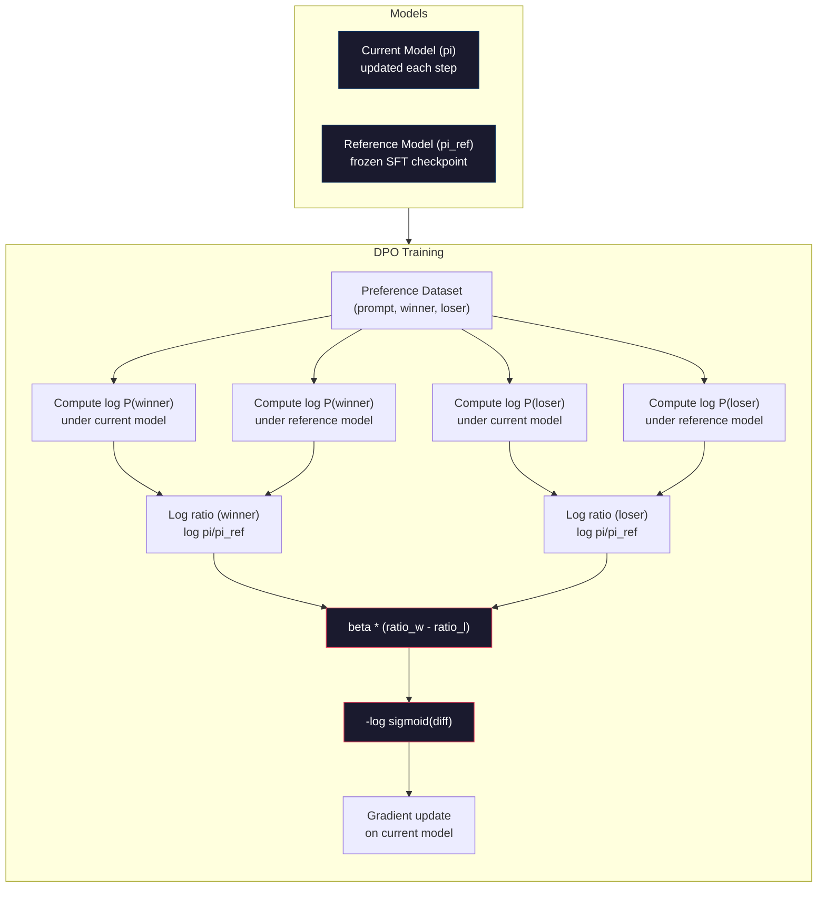

# DPO: Doğrudan Tercihleri Optimize

> RLHF'nin etkisi vardır. Fakat aynı zamanda üç model eğitimi gerekir. SFT, ödül modeli, politika, PPO'nun dengesizliğini yönetmek, KL cezasını düzenlemek.

**Type:** Build
**Languages:** Python (with numpy)
**Prerequisites:** Phase 10, Lesson 07 (RLHF)
**Time:** ~90 分钟

## Öğrenme hedefi
- 实现 DPO eğitim, doğrudan preference çiftleri 上优化语言模型, tek başına ödül modeli kullanmadan
- 推导 DPO Kayıp Fonksiyonu,并解释它如何通过政策的日志概率 隐式表示奖励模型
- DPO ile RLHF arasındaki eğitim sabitliği, hesaplama maliyeti ve model sayısı açısından
- 调节 beta 参数,控制训练后的政策 偏离参考模型的程度

## 问题
Ders 07'de RLHF borusunu oluşturmuş olursunuz. Üç aşama. Üç model. SFT modeli, ödül modeli, PPO'nun optimize edilmesiyle birlikte ödül modeli. Sadece ödül modeli, binlerce bireysel tercih çifti ve tek başına bir eğitim döngüsü gerektirir.

Praktiki olarak, PPO eğitimi 以不稳定著称──很小的超参数 变化就可能导致训练发散──奖励模型是人类偏好的不完美代理,而政策会找到利用其弱点的方式──KL cezaları yardımcı olur, ancak kendi içinde de düzenlenmesi gerekir: çok düşük ödül hackeriye yol açar, çok yüksek ödülleri model neredeyse hiçbir şey öğrenmez──

Bu karmaşıklık, InstructGPT'nin yayınlandıktan sonraki yıllarda, çoğu açık kaynak modeli RLHF kullanımı zor olduğunu açıklıyor.

2023 yıl Mayıs, Stanford'daki Rafael Rafailov、Archit Sharma  ve meslektaşları yayınladı Direct Preference Optimization: Your Language Model Is Secretly a Reward Model──核心洞见是:你不需要单独的奖励模型──最优奖励功能 在数学上由语言模型自身的代币 概率决定──你可以完全跳过奖励模型,直接在偏好对上优化语言模型──

DPO RLHF'yi denetim altında öğrenme adımlarına ▌ bir model ▌ bir Kayıp Fonksiyon ▌ bir eğitim döngüsü ▌ hiç güçlendirme öğrenimi ▌ Zephyr-7B, birçok referans üzerinde DPO'nun en büyük ölçekte kullanılmış modelleri arasından biridir.

## 概念
### Anahtar Bilgi

RLHF 优化这个目标:

```
maximize: E[R(x, y)] - beta * KL(pi || pi_ref)
```

R, ödül modeli, pi, politika, pi_ref referans modeli, beta, KL katılamıdır.

DPO kağıdı 証明,この目標存在閉式最优解──任意報酬関数 R için,最优政策 şudur:

```
pi*(y | x) = pi_ref(y | x) * exp(R(x, y) / beta) / Z(x)
```

Z (x) arasında birleştirilmiş normal sayı vardır.

```
R(x, y) = beta * log(pi*(y | x) / pi_ref(y | x)) + beta * log Z(x)
```

Bu, bir atılım noktası. Ödül, tamamen politika modeli ve referans modeli olasılıklarını kullanarak ifade edilmektedir.

Bradley-Terry tercih modeli yerine:

```
P(y_w > y_l | x) = sigmoid(R(x, y_w) - R(x, y_l))
                  = sigmoid(beta * (log pi(y_w|x)/pi_ref(y_w|x) - log pi(y_l|x)/pi_ref(y_l|x)))
```

Z(x) 项会抵消, çünkü iki cevap aynı istekle x 为条件――下面只是政策模型和参考模型 在上的 log-probabilities的函数 在偏好与拒绝的答案上的日志概率――下面只是政策模型和参考模型 在上的 log-probabilities的函数在上的 log-probabilities 在上的 log-probabilities 在上的 log-probabilities 在上的 log-probabilities 在上的 log-probabilities 在上的 log-probabilities 在上的 log-probabilities 在上的 log-probabilities 在上的 log-probabilities 在上的 log-probability 在上的 log-probability 在上的 log-probability 在上的 log-probability 在上的 log-probability 在

### DPO Kaybesi

```
L_DPO = -log(sigmoid(beta * (log pi(y_w|x)/pi_ref(y_w|x) - log pi(y_l|x)/pi_ref(y_l|x))))
```

Her bölümünü çözeceğiz:

- **y_w**= tercih edilen(kazan) cevap
- **y_l**= redded ((losing) cevap
- **x**= hızlı
- **pi**= 当前模型(正在训练)
- **pi_ref**= referans modeli ((结的 SFT kontrol noktası)
- **beta**= 控制偏离 参照 温度 参数(genellikle 0,1 ila 0,5)

比值 `log pi(y|x) / pi_ref(y|x)`Bu oran doğru zaman, mevcut modelin yanıt vermesinin olasılığı referanstan daha yüksek olduğunda, mevcut modelin vermesinin olasılığı daha düşüktür.

DPO Loss, tercih edilen yanıtların log- olasılık oranını arttırır ve reddedilen yanıtların log- olasılık oranını düşürür. Beta  Parametr kontrol modeli daha fazla hareket ettirebilir: daha küçük beta daha büyük bir kayıp, daha büyük beta modeli daha yakın bir referans olmasına izin verir.



### Neden DPO Daha Basit

| Aspect | RLHF (PPO) | DPO |
|--------|-----------|-----|
| 需要训练的模型 | 3（SFT + reward + policy） | 1（仅 policy） |
| Training loops | 3（SFT、RM training、PPO） | 2（SFT、DPO） |
| Hyperparameters | lr、KL coeff、clip ratio、RM lr、epochs x3 | lr、beta、epochs |
| Reward model | 必需（单独训练） | 隐式存在于模型概率中 |
| RL algorithm | PPO（复杂、不稳定） | Supervised learning（稳定） |
| GPU memory | PPO 期间内存中有 3-4 个模型 | 2 个模型（current + reference） |
| 训练稳定性 | 对 hyperparameters 敏感 | 稳健，类似 SFT |

DPO eğitiminde iki modelin belleğe yerleştirilmesi gerekir: mevcut model ve sonuç referansı. RLHF'nin üç veya dört modeline ihtiyacı vardır: politika, referans, ödül modeli ve seçilebilir değer fonksiyonu temel çizgi. 70B model için, FP16'da her bir kopya 140GB'ye ihtiyaç duyulur.

### DPO RLHF'yi Yaptığında

**小数据集。**5.000-20.000 tercih çiftinin büyüklüğünde, DPO genellikle RLHF ve RLHF arasındaki ödül modelinin eşit veya daha fazla olması gerekir.

**计算资源有限。**DPO sadece tam RLHF yaklaşık üçte biri hesaplama miktarı gerekir.

**快速迭代。**想尝试 10 farklı tercih veri kümesi, bakın hangisi en iyi modeli oluşturabilir?DPO 让你能在几个小时内完成每个实验――RLHF 则需要每一个数据集重新训练奖励模型――

### RLHF DPO'yu yendiğinde

**大规模训练。**GPT-4 veya Claude'un boyutunda, RLHF'nin tek başına ödül modeli daha ayrıntılı tercih sinyallerini yakalayabilir.

**复杂 reward signals。**Eğer daha iyi bir ödül modeli varsa, bu tür bir ödül modeli öğrenmek mümkündür.

**迭代式 alignment。**RLHF boruları mevcut politika ile yeni tepkiler üretmek, insanların değerlendirmesini sağlamak ve ardından çevrimiçi döngüde yeniden eğitilen ödül modeli kullanılabilir.

### DPO  dışında: KTO, ORPO, SimPO

DPO 启发了一系列简化对齐方法──

**KTO (Kahneman-Tversky Optimization, 2024)：**KTO kullanımı: her yanıtı iyi veya kötü olarak işaretlemek, başka bir alternatif ile karşılaştırmak gerekmez. Bu, veri toplamayı büyük ölçüde basitleştirdi. Bu, işaretleyicilere iki yanıt göstermek değil, hangisi daha iyi olduğunu sormak değil, bir yanıt göstermek ve bu iyi mi?  Kayıp Fonksiyonu                                                                                                                                                                                                                                                                                                                                                                                                                                     

**ORPO (Odds Ratio Preference Optimization, 2024)：**SFT ve uyumluluğu bir eğitim aşamasına ortaklaştırmak.ORPO önce SFT yapmamak ve DPO yapmamak, tersine SFT Kaybını değiştirmek ve tercih sinyali içerir.

**SimPO (Simple Preference Optimization, 2024)：**完全排除参照模型──SIMPO 計算 log-probability ratios,而使用答案的平均 log-probability──按长度归结) 隐式報酬──这省内存──不需要参考模型──并简化训──长度归结防止模型偏好更短的答案──

| Method | Year | Models in Memory | Needs Pairs? | Needs Reference? | Training Loops |
|--------|------|-----------------|-------------|-----------------|----------------|
| RLHF | 2022 | 3-4 | Yes（用于 RM） | Yes | 3 |
| DPO | 2023 | 2 | Yes | Yes | 2 |
| KTO | 2024 | 2 | No（未配对） | Yes | 2 |
| ORPO | 2024 | 1 | Yes | No | 1 |
| SimPO | 2024 | 1 | Yes | No | 1 |

趋势很清楚:每种方法都消除了一部分复杂性──RLHF 需要奖励模型 和 PPO──DPO 消除了二者──KTO 消除了成对数据──ORPO 消除了单独的SFT 阶段──SIMPO 消除了参考模型──alignment tax,即基本模型到配合模型所需的计算和复杂性成本,正在持续下降──

### Gerçek DPO Deployment

**Zephyr-7B (HuggingFace, October 2023)：**Mistral 7B tabanı olarak, UltraChat'te ((200K örnekler) SFT yapın, sonra UltraFeedback'te ((60K tercih çiftlerinde) DPO yapın. MT-Bench'te 6.47 puan, o zaman en yüksek 7B modeliydi.

**Llama 3 (Meta, April 2024)：**İlk RLHF aşamasında DPO kullanıldıktan sonra bu kombinasyon DPO ve RLHF'yi birbirine ekleyebileceğini gösterir: RLHF geniş bir uyum için kullanılır, DPO ise hedefli bir gelişme için kullanılır.

**Neural Magic / nm-chat (2024)：**DPO'yu çok sayıda açık kaynak modeli için kullanmak, SFT'lerin temel seviyesine göre bir artan %5-15% oranında yükseltilmeyi göstermek ve düzeltilme referansları üzerinde çalışmak.


```figure
dpo-loss
```

## Yapın onu.
### 步骤 1: Seçenek Verim kümesi

RLHF kullanma biçimi:(sürekli, tercih edilen, reddedilen) 三元组──DPO 直接消费这些数据,不需要中间的奖励模型──

```python
import numpy as np
import sys
import os
sys.path.insert(0, os.path.join(os.path.dirname(__file__), "..", "..", "04-pre-training-mini-gpt", "code"))
from main import MiniGPT, LayerNorm, Embedding, TransformerBlock

PREFERENCE_DATA = [
    {
        "prompt": "What is the capital of France?",
        "preferred": "The capital of France is Paris.",
        "rejected": "France is a country in Europe. It has many cities. The capital is Paris. Paris is known for the Eiffel Tower.",
    },
    {
        "prompt": "Explain gravity in one sentence.",
        "preferred": "Gravity is the force that attracts objects with mass toward each other.",
        "rejected": "Gravity is something that makes things fall down when you drop them.",
    },
    {
        "prompt": "What is 15 times 7?",
        "preferred": "15 times 7 is 105.",
        "rejected": "Let me think about this. 15 times 7. Well, 10 times 7 is 70, and 5 times 7 is 35, so the answer might be around 105.",
    },
    {
        "prompt": "Name three programming languages.",
        "preferred": "Python, Rust, and TypeScript.",
        "rejected": "There are many programming languages. Some popular ones include various languages like Python and others.",
    },
    {
        "prompt": "What year did World War II end?",
        "preferred": "World War II ended in 1945.",
        "rejected": "World War II was a major global conflict. It involved many countries. The war ended in the mid-1940s, specifically in 1945.",
    },
    {
        "prompt": "Define machine learning.",
        "preferred": "Machine learning is a field where algorithms learn patterns from data to make predictions without being explicitly programmed.",
        "rejected": "Machine learning is a type of AI. AI stands for artificial intelligence. Machine learning uses data to learn.",
    },
]
```

### 步骤 2: Sequence Log-Problem

DPO Kayıpı  需要计算给定提示时某个响应的总日记概率──这意味着要在完整的(快速+响应)序列上运行模型,并对每个响应代币的日记概率 求和──

```python
def tokenize_sequence(text, vocab_size=256):
    return [min(t, vocab_size - 1) for t in list(text.encode("utf-8"))]


def compute_sequence_log_prob(model, prompt_tokens, response_tokens, max_seq_len=128):
    full_sequence = prompt_tokens + response_tokens
    if len(full_sequence) > max_seq_len:
        full_sequence = full_sequence[:max_seq_len]

    if len(full_sequence) < 2:
        return 0.0

    input_ids = np.array(full_sequence[:-1]).reshape(1, -1)
    target_ids = np.array(full_sequence[1:])

    logits = model.forward(input_ids)
    logits = logits[0]

    max_logits = logits.max(axis=-1, keepdims=True)
    log_probs = logits - max_logits - np.log(
        np.exp(logits - max_logits).sum(axis=-1, keepdims=True)
    )

    prompt_len = len(prompt_tokens)
    response_start = max(0, prompt_len - 1)
    response_end = len(target_ids)

    if response_start >= response_end:
        return 0.0

    response_log_probs = log_probs[response_start:response_end, :]
    response_targets = target_ids[response_start:response_end]

    total_log_prob = 0.0
    for i, target in enumerate(response_targets):
        total_log_prob += response_log_probs[i, target]

    return total_log_prob
```

Bu işlev DPO'nun temel aracıdır. Her bir tercih çifti için dört kez çalışır: model 计算 tercih edilen yanıt, model 计算 reddedilen yanıt, referans 计算 tercih edilen yanıt, referans 计算 reddedilen yanıt── yani her eğitim örneği 4 kez ileri geçiyor; karşılaştırıldığında, RLHF 需要 generation + reward scoring + value estimation + PPO update──更简单、更快、更稳定──

### 步骤 3: DPO Kaybesi

论文核心用代码表示──一个函数──一个 Loss──不需要奖励模型──

```python
def sigmoid(x):
    return np.where(
        x >= 0,
        1.0 / (1.0 + np.exp(-x)),
        np.exp(x) / (1.0 + np.exp(x))
    )


def dpo_loss(policy_logprob_preferred, policy_logprob_rejected,
             ref_logprob_preferred, ref_logprob_rejected, beta=0.1):
    preferred_ratio = policy_logprob_preferred - ref_logprob_preferred
    rejected_ratio = policy_logprob_rejected - ref_logprob_rejected

    logit = beta * (preferred_ratio - rejected_ratio)

    loss = -np.log(sigmoid(logit) + 1e-8)

    preferred_reward = beta * preferred_ratio
    rejected_reward = beta * rejected_ratio

    return loss, {
        "preferred_ratio": float(preferred_ratio),
        "rejected_ratio": float(rejected_ratio),
        "logit": float(logit),
        "implicit_preferred_reward": float(preferred_reward),
        "implicit_rejected_reward": float(rejected_reward),
        "reward_margin": float(preferred_reward - rejected_reward),
    }
```

`preferred_ratio`和 `rejected_ratio`DPO 推导中的 log-probability ratios──当前模型 (reference) için tercih edilen tepki 分配更高概率,并 için reddedilmiş tepki 分配更低概率, logit 为正,Loss 较低──训练信号正是把模型推向这个方向──

`implicit_preferred_reward`和 `implicit_rejected_reward`DPO Kayıpları  Gizli olarak dağıtılmış ödüller :DPO Kayıpları   Gizli olarak dağıtılmış ödüller :DPO Kayıpları                                                                                                                                                                                                                                                                                                                                                                                                                                                                                    

### 4 adım: DPO Eğitim Çubuğu

Bir standart denetimli eğitim döngüsü yok. PPO yok. Ödül modeli yok. Sadece ileri geçişler ve gradient güncellemeleri var.

```python
def copy_model_weights(source, target):
    target.embedding.token_embed = source.embedding.token_embed.copy()
    target.embedding.pos_embed = source.embedding.pos_embed.copy()
    target.ln_f.gamma = source.ln_f.gamma.copy()
    target.ln_f.beta = source.ln_f.beta.copy()
    for s_block, t_block in zip(source.blocks, target.blocks):
        t_block.attn.W_q = s_block.attn.W_q.copy()
        t_block.attn.W_k = s_block.attn.W_k.copy()
        t_block.attn.W_v = s_block.attn.W_v.copy()
        t_block.attn.W_out = s_block.attn.W_out.copy()
        t_block.ffn.W1 = s_block.ffn.W1.copy()
        t_block.ffn.W2 = s_block.ffn.W2.copy()
        t_block.ffn.b1 = s_block.ffn.b1.copy()
        t_block.ffn.b2 = s_block.ffn.b2.copy()
        t_block.ln1.gamma = s_block.ln1.gamma.copy()
        t_block.ln1.beta = s_block.ln1.beta.copy()
        t_block.ln2.gamma = s_block.ln2.gamma.copy()
        t_block.ln2.beta = s_block.ln2.beta.copy()


def dpo_train(policy_model, reference_model, preference_data,
              num_epochs=5, lr=5e-6, beta=0.1, max_seq_len=128):
    print(f"DPO Training: {len(preference_data)} pairs, {num_epochs} epochs, "
          f"lr={lr}, beta={beta}")
    print()

    losses = []
    margins = []

    for epoch in range(num_epochs):
        epoch_loss = 0.0
        epoch_margin = 0.0
        num_examples = 0

        indices = np.random.permutation(len(preference_data))

        for idx in indices:
            pair = preference_data[idx]

            prompt_tokens = tokenize_sequence(pair["prompt"])
            preferred_tokens = tokenize_sequence(pair["preferred"])
            rejected_tokens = tokenize_sequence(pair["rejected"])

            pi_logprob_w = compute_sequence_log_prob(
                policy_model, prompt_tokens, preferred_tokens, max_seq_len
            )
            pi_logprob_l = compute_sequence_log_prob(
                policy_model, prompt_tokens, rejected_tokens, max_seq_len
            )
            ref_logprob_w = compute_sequence_log_prob(
                reference_model, prompt_tokens, preferred_tokens, max_seq_len
            )
            ref_logprob_l = compute_sequence_log_prob(
                reference_model, prompt_tokens, rejected_tokens, max_seq_len
            )

            loss, metrics = dpo_loss(
                pi_logprob_w, pi_logprob_l,
                ref_logprob_w, ref_logprob_l, beta
            )

            update_direction = 1.0 if metrics["logit"] < 0 else -0.1
            for block in policy_model.blocks:
                block.ffn.W1 += lr * update_direction * np.random.randn(*block.ffn.W1.shape) * 0.01
                block.ffn.W2 += lr * update_direction * np.random.randn(*block.ffn.W2.shape) * 0.01

            epoch_loss += loss
            epoch_margin += metrics["reward_margin"]
            num_examples += 1
            losses.append(float(loss))
            margins.append(metrics["reward_margin"])

        avg_loss = epoch_loss / max(num_examples, 1)
        avg_margin = epoch_margin / max(num_examples, 1)

        print(f"  Epoch {epoch + 1}/{num_epochs} | Loss: {avg_loss:.4f} | "
              f"Avg Margin: {avg_margin:.4f}")

    return policy_model, losses, margins
```

RLHF'ye göre, bu eğitim döngüsü 简洁得令人耳目一新── her tercih çifti için: hesaplayın dört log- olasılıkları:

### 步骤 5: DPO vs RLHF karşılaştır

测量隐式奖励利率和日志概率变化,将 DPO与07 ders 中的 RLHF modeli 进行比较──

```python
def evaluate_preference_accuracy(model, reference_model, preference_data, beta=0.1, max_seq_len=128):
    correct = 0
    total = 0

    for pair in preference_data:
        prompt_tokens = tokenize_sequence(pair["prompt"])
        preferred_tokens = tokenize_sequence(pair["preferred"])
        rejected_tokens = tokenize_sequence(pair["rejected"])

        pi_w = compute_sequence_log_prob(model, prompt_tokens, preferred_tokens, max_seq_len)
        pi_l = compute_sequence_log_prob(model, prompt_tokens, rejected_tokens, max_seq_len)
        ref_w = compute_sequence_log_prob(reference_model, prompt_tokens, preferred_tokens, max_seq_len)
        ref_l = compute_sequence_log_prob(reference_model, prompt_tokens, rejected_tokens, max_seq_len)

        preferred_reward = beta * (pi_w - ref_w)
        rejected_reward = beta * (pi_l - ref_l)

        if preferred_reward > rejected_reward:
            correct += 1
        total += 1

    return correct / max(total, 1)


def analyze_implicit_rewards(model, reference_model, preference_data, beta=0.1, max_seq_len=128):
    print("Implicit Reward Analysis:")
    print("-" * 65)
    print(f"  {'Prompt':<30} {'Pref Reward':>12} {'Rej Reward':>12} {'Margin':>10}")
    print("  " + "-" * 60)

    for pair in preference_data:
        prompt_tokens = tokenize_sequence(pair["prompt"])
        preferred_tokens = tokenize_sequence(pair["preferred"])
        rejected_tokens = tokenize_sequence(pair["rejected"])

        pi_w = compute_sequence_log_prob(model, prompt_tokens, preferred_tokens, max_seq_len)
        pi_l = compute_sequence_log_prob(model, prompt_tokens, rejected_tokens, max_seq_len)
        ref_w = compute_sequence_log_prob(reference_model, prompt_tokens, preferred_tokens, max_seq_len)
        ref_l = compute_sequence_log_prob(reference_model, prompt_tokens, rejected_tokens, max_seq_len)

        pref_reward = beta * (pi_w - ref_w)
        rej_reward = beta * (pi_l - ref_l)
        margin = pref_reward - rej_reward

        truncated = pair["prompt"][:28] + ".." if len(pair["prompt"]) > 30 else pair["prompt"]
        print(f"  {truncated:<30} {pref_reward:>12.4f} {rej_reward:>12.4f} {margin:>10.4f}")

    print()
```

### 步骤 6: Beta Duyarlılık Analizi

Beta 参数 DPO 中对应 RLHF 里 KL katılayıcısının parametresidir.

```python
def beta_sensitivity_analysis(sft_model, preference_data, betas, max_seq_len=128):
    print("Beta Sensitivity Analysis")
    print("-" * 60)
    print(f"  {'Beta':>8} {'Final Loss':>12} {'Final Margin':>14} {'Accuracy':>10}")
    print("  " + "-" * 55)

    results = []

    for beta in betas:
        policy = MiniGPT(
            vocab_size=256, embed_dim=128, num_heads=4,
            num_layers=4, max_seq_len=max_seq_len, ff_dim=512
        )
        reference = MiniGPT(
            vocab_size=256, embed_dim=128, num_heads=4,
            num_layers=4, max_seq_len=max_seq_len, ff_dim=512
        )
        copy_model_weights(sft_model, policy)
        copy_model_weights(sft_model, reference)

        policy, losses, margins_list = dpo_train(
            policy, reference, preference_data,
            num_epochs=3, lr=5e-6, beta=beta, max_seq_len=max_seq_len
        )

        accuracy = evaluate_preference_accuracy(
            policy, reference, preference_data, beta, max_seq_len
        )

        final_loss = losses[-1] if losses else 0
        final_margin = margins_list[-1] if margins_list else 0

        print(f"  {beta:>8.3f} {final_loss:>12.4f} {final_margin:>14.4f} {accuracy:>10.1%}")
        results.append({
            "beta": beta,
            "final_loss": final_loss,
            "final_margin": final_margin,
            "accuracy": accuracy,
        })

        print()

    return results
```

较小的beta(0.01) modelin serbestçe etkinlik oranına izin verir:学习速度快,但有退化解风险──较大的beta(1.0) modelin referansın yakın olmasına izin verir:稳定但学习慢──大多数应用的最佳区间为0.1~0.3──

## Kullan
### DPO Pipeline Demo

```python
if __name__ == "__main__":
    np.random.seed(42)

    print("=" * 70)
    print("DPO: DIRECT PREFERENCE OPTIMIZATION")
    print("=" * 70)
    print()

    print("STEP 1: Initialize SFT Model (from Lesson 06)")
    print("-" * 50)
    sft_model = MiniGPT(
        vocab_size=256, embed_dim=128, num_heads=4,
        num_layers=4, max_seq_len=128, ff_dim=512
    )
    print(f"  Parameters: {sft_model.count_parameters():,}")
    print()

    print("STEP 2: DPO Training")
    print("-" * 50)

    policy_model = MiniGPT(
        vocab_size=256, embed_dim=128, num_heads=4,
        num_layers=4, max_seq_len=128, ff_dim=512
    )
    reference_model = MiniGPT(
        vocab_size=256, embed_dim=128, num_heads=4,
        num_layers=4, max_seq_len=128, ff_dim=512
    )
    copy_model_weights(sft_model, policy_model)
    copy_model_weights(sft_model, reference_model)

    policy_model, losses, margins = dpo_train(
        policy_model, reference_model, PREFERENCE_DATA,
        num_epochs=5, lr=5e-6, beta=0.1
    )
    print()

    print("=" * 70)
    print("STEP 3: Evaluate")
    print("=" * 70)
    print()

    pre_accuracy = evaluate_preference_accuracy(
        sft_model, reference_model, PREFERENCE_DATA, beta=0.1
    )
    post_accuracy = evaluate_preference_accuracy(
        policy_model, reference_model, PREFERENCE_DATA, beta=0.1
    )

    print(f"  Preference accuracy (pre-DPO):  {pre_accuracy:.1%}")
    print(f"  Preference accuracy (post-DPO): {post_accuracy:.1%}")
    print()

    analyze_implicit_rewards(policy_model, reference_model, PREFERENCE_DATA, beta=0.1)

    print("=" * 70)
    print("STEP 4: Training Dynamics")
    print("=" * 70)
    print()

    if losses:
        print("  Loss curve:")
        window = max(1, len(losses) // 5)
        for i in range(0, len(losses), window):
            chunk = losses[i:i + window]
            avg = sum(chunk) / len(chunk)
            print(f"    Steps {i:3d}-{i + len(chunk) - 1:3d}: loss = {avg:.4f}")
        print()

    if margins:
        print("  Reward margin curve:")
        window = max(1, len(margins) // 5)
        for i in range(0, len(margins), window):
            chunk = margins[i:i + window]
            avg = sum(chunk) / len(chunk)
            print(f"    Steps {i:3d}-{i + len(chunk) - 1:3d}: margin = {avg:.4f}")
        print()

    print("=" * 70)
    print("STEP 5: Beta Sensitivity")
    print("=" * 70)
    print()

    beta_results = beta_sensitivity_analysis(
        sft_model, PREFERENCE_DATA, betas=[0.01, 0.1, 0.3, 1.0]
    )

    print("=" * 70)
    print("DPO vs RLHF COMPARISON")
    print("=" * 70)
    print()
    print("  DPO advantages:")
    print("    - 1 training loop (vs 3 for RLHF)")
    print("    - 2 models in memory (vs 3-4 for RLHF)")
    print("    - Supervised learning (vs RL, more stable)")
    print("    - No reward model to train or maintain")
    print()
    print("  RLHF advantages:")
    print("    - Separate reward model captures complex preferences")
    print("    - Online learning: generate, rate, retrain")
    print("    - Better for multi-objective alignment")
    print("    - Proven at largest scales (GPT-4, Claude)")
    print()
    print("  Practical guidance:")
    print("    - Start with DPO. It's simpler and often sufficient.")
    print("    - Switch to RLHF if DPO plateaus on your eval metrics.")
    print("    - Many production systems use both: RLHF first, DPO to refine.")
```

## - Söyle.
本课会产 出 `outputs/prompt-alignment-method-selector.md`SFT,RLHF,DPO,KTO,ORPO,SimPO) sorgulaması için yardımcı olacaktır. Verilen verileri kullanılabilirliği belirlemek için, bütçe ve uyumlulık hedeflerini hesaplamak için, bir yöntem ve eğitim planı önerir.

## 练习
1. KTO'nun gerçekleşmesi (Kahneman-Tversky Optimization) ◊ KTO'nun veriye ihtiyacı yoktur, sadece her tepkiyi iyi veya kötü için işaretlemek gerekir ◊ iyi tepkinin kaybı ◊`-log(sigmoid(beta * log_ratio))`Kötü tepki kaybı.`-log(1 - sigmoid(beta * log_ratio))`,并对不良反应 Loss 使用损失厌恶乘数(通常为1.5x) ⋅在同一份数据上训练(分别将优先 当作好、拒绝 当作坏),并与DPO比较精确性──

2. 实现 length-normalized DPO── do not use original log-probabilities, but divided into the number of response tokens:`normalized_logprob = total_logprob / num_tokens`Bu, modelin daha kısa yanıtlarını önleyebilir.

3. 构建一个ORPO 风格的组合损失──向 DPO Loss 中添加首选响应 上的标准下一个代码预测损失:`L = L_sft(preferred) + alpha * L_dpo` 0.1 ̊ 0.5 ̊ 1.0 ̊ alfa ≠                                                                                                                                                                                                                                                                                                                           

4. DPO'yu tekrarlanarak gerçekleştirmek, DPO'yu 3 dönemden sonra çalıştırmak ve sonra da yeni tepkiler üretmek, onları yeni tercih çiftleri için çiftleştirmek için orijinal tercih edilen tepkilerle birlikte çalıştırmak, tekrar DPO'yu gerçekleştirmek, iki döngü kendi kendine oynamak için bir süreç oluşturmak.

5. DPO'nun farklı referans modelleri ile karşılaştırın. Referans olarak SFT kontrol noktasını kullanmayın, bunun yerine deneyin: a) temel model, b) DPO'nun 1. dönem kontrol noktası, c) politika modelinin eksponensel hareketli ortalaması.

## 关键术语
| Term | What people say | What it actually means |
|------|----------------|----------------------|
| DPO | “没有 RL 的 RLHF” | Direct Preference Optimization：一种 supervised learning algorithm，直接在 preference pairs 上优化语言模型，绕过 reward model 和 PPO |
| Implicit reward | “reward 在模型里” | reward function 由 policy 与 reference models 之间的 log-probability ratio 决定，不需要单独的 reward model |
| Beta (DPO) | “temperature” | 控制 policy 可以偏离 reference model 的程度：小 beta 允许大偏离，大 beta 让模型保持接近 |
| Log-probability ratio | “模型变化了多少” | log pi(y\|x) - log pi_ref(y\|x)：正值表示当前模型分配的概率高于 reference |
| Reference model | “冻结的 checkpoint” | SFT model 的一个副本，其 weights 永不改变，用作计算概率比的锚点 |
| KTO | “没有成对数据的 DPO” | Kahneman-Tversky Optimization：使用未配对的“good”或“bad”labels，而不是要求 preference pairs |
| ORPO | “一步 alignment” | Odds Ratio Preference Optimization：通过向 SFT Loss 添加 preference term，将 SFT 和 alignment 合并到单个 training loop |
| SimPO | “不需要 reference” | Simple Preference Optimization：通过使用长度归一化的平均 log-probability 作为隐式 reward，消除 reference model |
| Alignment tax | “让模型安全的成本” | 从 base model 到 aligned model 所需的额外计算、数据和复杂性；DPO 显著降低了这一成本 |

## 延伸阅读
- [Rafailov et al., 2023 -- "Direct Preference Optimization: Your Language Model is Secretly a Reward Model"](https://arxiv.org/abs/2305.18290)-- RLHF' den den den denetimli öğrenme için DPO kağıdı
- [Tunstall et al., 2023 -- "Zephyr: Direct Distillation of LM Alignment"](https://arxiv.org/abs/2310.16944)- Zephyr-7B, UltraFeedback'in en yüksek DPO'sını gösterdi.
- [Ethayarajh et al., 2024 -- "KTO: Model Alignment as Prospect Theoretic Optimization"](https://arxiv.org/abs/2402.01306)--                                                                                                                                                                                                                                                               
- [Hong et al., 2024 -- "ORPO: Monolithic Preference Optimization without Reference Model"](https://arxiv.org/abs/2403.07691)-- SFT ile uyumlu bir adım için 合并为一步
- [Meng et al., 2024 -- "SimPO: Simple Preference Optimization with a Reference-Free Reward"](https://arxiv.org/abs/2405.14734)-- 完全消除参照模型
- [Llama 3 Technical Report](https://arxiv.org/abs/2407.21783)-- Meta 结合 RLHF ile DPO'nun uyumlu boru hattı
