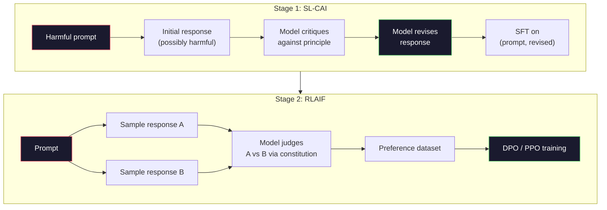
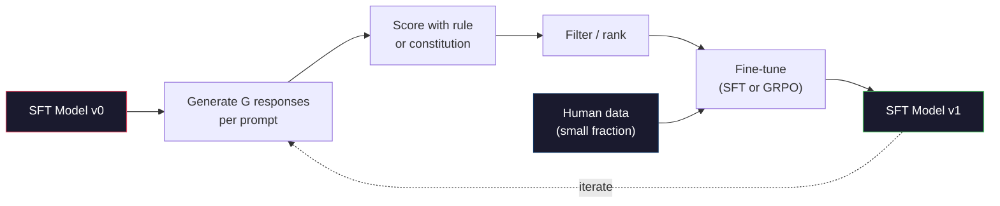

# Anayasacı AI ve Kendini İyileştirme

> RLHF  insanı döngü içinde gerektirir. Anayasa AI kullanımı modeli  kendiliğinden bunların büyük kısmını değiştirir. ⇒ write down a group of principles, let model 根据这些原则批评 自己的输出,并基于这些批评 进行训练. DeepSeek-R1 2025 yılında bu düşünceyi daha da ileriye çıkarmak için: let model 生成数百万条推理的痕迹,用规则给它们打分,并基于结果运行 GRPO──2026 yıl sınır modeli                                                                                                                                                                                                     

**Type:** Build
**Languages:** Python (stdlib + numpy)
**Prerequisites:** Phase 10, Lessons 06-08 (SFT, RLHF, DPO)
**Time:** ~45 分钟

## Öğrenme hedefi
- 实现宪法AI'nın iki aşama döngüsü: kendi kendini eleştirmek, kendi kendini gözden geçirmek, sonra düzeltme sonrası çift üzerinde tercih eğitimi yapmak
- 推导 GRPO hedefleri(DeepSeek-R1'in grup ilişkili politika optimizasyonu),并将其与PPO'nun değer fonksiyon baz çizelgesi karşılaştırıldığında
- 生成可验证的推理痕迹, kural tabanlı sonuç ödülleri kullanmak ve bağımsız ödülleri model kullanmamak durumunda 打分
- 判断自我改善 何時优于人类偏好数据,何時会退化为模式寻求

## 问题
Siz ders 07'de RLHF'yi oluşturdu, ders 08'de DPO'yu oluşturdu. İkisi de aynı pahalı girişlere bağlıdır: insan tercihleri çiftleri. Antropik'in InstructGPT zaman borusu yaklaşık 33.000 karşılaştırma kullanıldı. Llama 2 Chat 150'den fazla kişiyi kullanmıştır.

2022 yılında yapılan Anayasa Yapayciliği makalesi basit bir soruyu ortaya koydu: Eğer model kendini tercih etiketleri üretirse, nasıl olur? Ona bir kitle yazılı prensip ver, yani Anayasa, sonra kendi tepkilerini eleştirmesine izin ver.

2024 yılında, DeepSeek bu düşünceyi daha da ileriye sürer. Onlar, herhangi bir kalıcı sonuçlı matematik görevleri için, test yaparak veya başarısız kod kullanarak veya başarısız bir oyun yaparak veya test ederek, eleştiriden tamamen geçebileceklerini kanıtlar.

Bu iki döngü, önyargılı davranışlarda anayasal AI ve kanıtılı davranışlarda kurallara dayalı RL'ler için 2026 yılının ana hatalı uyum tarifleri olarak kullanılır.

## 概念
### Anayasacı AI döngüsü

Bai et al. (2022) boru hattını iki aşamaya ayıracak.

**Stage 1: Supervised Learning from AI Feedback (SL-CAI)。**Bu, bir SFT modelinden ∞, ∞, ∞, ∞, ∞, ∞, ∞, ∞, ∞, ∞, ∞, ∞, ∞, ∞, ∞, ∞, ∞, ∞, ∞, ∞, ∞, ∞, ∞, ∞, ∞, ∞, ∞, ∞, ∞, ∞, ∞, ∞, ∞, ∞, ∞, ∞, ∞, ∞, ∞, ∞, ∞, ∞, ∞, ∞, ∞, ∞, ∞, ∞, ∞, ∞, ∞, ∞, ∞, ∞, ∞, ∞, ∞, ∞, ∞, ∞, ∞, ∞, ∞, ∞, ∞, ∞, ∞, ∞, ∞, ∞, ∞, ∞, ∞, ∞, ∞, ∞, ∞, ∞, ∞, ∞, ∞, ∞, ∞, ∞, ∞, ∞, ∞, ∞, ∞, ∞, ∞, ∞, ∞, ∞, ∞, ∞, ∞, ∞, ∞, ∞, ∞, ∞, ∞, ∞, ∞, ∞, ∞, ∞, ∞, ∞, ∞, ∞, ∞, ∞, ∞, ∞, ∞, ∞, ∞, ∞, ∞, ∞, ∞, ∞, ∞, ∞, ∞, ∞, ∞, ∞, ∞, ∞, ∞, ∞, ∞, ∞, ∞, ∞, ∞, ∞, ∞, ∞, ∞, ∞, ∞, ∞, ∞, ∞, ∞, ∞, ∞, ∞, ∞, ∞

**Stage 2: Reinforcement Learning from AI Feedback (RLAIF)。**采样响应对――询问模型 哪一个更符合宪法――对式偏好 用来训练奖励模型――然后使用该奖励对模型 运行PPO或DPO──与RLHF的关键区别是:modelden gelen偏好,而不是人类──



Antropik ilk sürüm 16 条原则(后来扩展) ・・・一条原则可能写成: Lütfen kültürel geçmişin çok çeşitli birinden herhangi biri için en az itiraz edilebilir olan yanıt seçin. 你为每一步选择原则,有时随机选择,有时根据快速类别 选择。

### Anayasa 实际做了什么

Anayasa, bir uyumlaşma sözleşmesini veriden metne aktarır. RLHF'de değişiklik davranışları binlerce çiftin yeniden etiketlenmesi anlamına gelir. CAI'de değişiklik davranışları bir yazı düzenlemesi anlamına gelir.

Bu, aynı zamanda bir modelin kendi yargısını da ödüllendirir. Sadece ilk kalibrasyonuna benzer şekilde iyi bir şekilde. SFT modeli kör noktalar varsa, örneğin, kontrolsel ifadeleri tanımamayan kritik adımlar, bu kör noktalar üzerinde kalır. CAI, bir uyum döngüsünü daraltır, ancak sinyalleri temel modelin üst sınırlarını aşamaya kadar büyütemez. Bu nedenle her üretim CAI boru hattı hala insan tercihleri verilerini kullanır, genellikle saf miktarda RLHF verileri % 5-10 arasında değişir.

### GRPO: Gruplara Önemli Politikası Optimizasyonu

DeepSeek, DeepSeekMath kağıdı (2024) 'de GRPO'yu tanıttı ve bunu DeepSeek-R1 (2025) 'in kökenli bir parçası olarak kabul etti.

PPO'nun amacı hatırlayın (Lection 07):

```
L_PPO = E[min(r(theta) * A, clip(r(theta), 1-eps, 1+eps) * A)]
```

İçlerinden `A`Evet, avantaj, genellikle öğrenilen değer ağıyla.`V(s)`△ GAE 估计──值网络是第二个模型,大小与政策相同──它会使内存翻倍,并引入自己的培训循环──

GRPO  değer fonksiyonunu terk etti. G 个 个 个 个 个 个 个 个 个 个 个 个 个 个 个 个 个 个 个 个 个 个 个 个 个 个 个 个 个 个 个 个 个 个 个 个 个 个 个 个 个 个 个 个 个 个 个 个 个 个 个 个 个 个 个 个 个 个 个 个 个 个 个 个 个 个 个 个 个 个 个 个 个 个 个 个 个 个 个 个 个 个 个 个 个 个 个 个 个 个 个 个 个 个 个 个 个 个 个 个 个 个 个 个 个 个 个 个 个 个 个 个 个 个 个 个 个 个 个 个 个 个 个 个 个 个 个 个 个 个 个 个 个 个 个 个 个 个 个 个 个 个 个 个 个 个 个 个 个 个 个 个 个 个 个 个 个 个 个 个 个 个 个 个 个 个 个 个 个 个 个 个 个 个 个 个 个 个 个 个 个 个 个 个 个 个 个 个 个 个 个 个 个 个 个 个 个 个 个 个 个 个 个 个 个 个 个 个 个 个 个 个 个 个 个 个 个 个 个 个 个 个 个 个 个 个 个 个 个 个 个 个 个 个 个 个 个 个 个 个 个 个 个 个 个 个 个 个 个

```
A_i = (r_i - mean(r_1, ..., r_G)) / std(r_1, ..., r_G)
```

avantajı bu yanıtın ödülüdür.

```
L_GRPO = E[min(r(theta) * A_group, clip(r(theta), 1-eps, 1+eps) * A_group)] - beta * KL(pi || pi_ref)
```

Referans modeline yönelik KL cezası  hâlâ var, ve PPO bir şekilde ‒klips oranı ‒ hâlâ var.

### Neden GRPO , bir öneride önemli ?

Düşünme görevleri için ödül 往往稀疏且二元:最終答 要么对,要么错. 稀疏二元 ödüllerde üst eğitim değeri işlevi is浪费; yararlı bir orta tahmini öğrenemez, çünkü son adımdan önce, neredeyse her devlet aynı beklenen geri dönüşe sahiptir.

İşte kurallara dayalı ödüller.

- **Math**:simpy veya sembolik kontrolcü 判断最終回答 是否匹配。
- **Code**:test suite 判断 pass/fail。
- **Formatting**:regex 判断 cevap evet değil 要求的 XML 标签 中──
- **Multi-step proofs**... kanıt yardımcıları... ..

DeepSeek-R1-Zero sadece iki ödül kullanır                                                                                                                                                                                                                                                                                                                                                                                                                                                                                                                `<answer>`Etiketler 内) ・ hiç insan tercihleri ・ hiç eleştirmen modeli ・ DeepSeek paper 所描述的 aha momentmodel 自发学会自检 和 后行只有通过稀疏规则奖励 上的GRPO 就涌现了──

### İşlem Ödülü Modelleri ve Sonuç Ödülü Modelleri karşılaştırma

Yine de bir tasarım seçeneği yapmanız gerekiyor: ödül son cevabı, sonuç ödül modeli, ORM), veya ödül Her ara adım, süreç ödül modeli, PRM)

| Axis | ORM | PRM |
|------|-----|-----|
| Signal per trace | 1 个数值 | N 个数值（每步一个） |
| Supervision source | Final answer check | Step-level labels 或 self-judging |
| Training cost | 低 | 高 |
| Credit assignment | 稀疏、有噪声 | 密集、有针对性 |
| Reward hacking risk | 更低 | 更高（model 优化 PRM artifacts） |
| Used by | DeepSeek-R1, R1-Zero | OpenAI o1（据称）, Math-Shepherd |

2024-2025 yıllarındaki ortak görüş ise, ORM'ler PRM'lerden daha kolay ölçeklendirilir. PRM'ler her bir token üzerinde daha örnek verimli, ancak pahalı adım etiketli verilere ihtiyaç duyar ve kısa yol davranışlarına dönüşecek bir eğilim gösterir.

### Özüm改进: Feedback Multiplier

Bu iki döngü örneği varsa, eleştirel / revize ve kural ödülleri ile grup-sâlamlı RL), onları bir araya getirebiliriz.

1. Bir SFT modeliden 開始──
2. Her an için birden fazla aday yanıtları oluştu.
3. Use rule-based reward (Kâyavalıtif görevleri için) veya anayasa eleştirisi için (Sübabı görevleri için)打分。
4. Yeni SFT verileri veya tercih çiftleri olarak en iyi adayları tutmak.
5. Düzgün ayarlama. Son modelle 2. adım.

DeepSeek, R1-Zero'da bu yöntemi uygulamaya geçirdiğinde Refusal sample fine-tuning olarak adlandırıldı. Antropik olarak bu yöntemi ilk sürümüne Constitutional AI distillation olarak adlandırıldı. Bu örnektir: Her zaman Doo'yu modelin içinde var olan sinyalleri büyütür. Yeni sinyallere katılmaz.

危险在模式崩──自发生成数据的分布总是比训练语料更窄──经过3~5轮自发蒸后,模型通常会在创意任务上失去多样性,变得过于自信,并表现出典型的AI voice(重复措辞、公式化结构)──生产管道将自发生成数据与少量新鲜的人数据混合,以保持分布真实可靠性──



### Ne Zaman Kullanmalı

- **Pure CAI**Konu: Konuşma davranışları: (语气、安全性、拒答风格)
- **GRPO + ORM**Bu nedenle, bu programın en iyi yönleri, bu programın en iyi yönleri ve sonuçları ile ilgili olarak, bu programın en iyi yönleri ve sonuçları ile ilgili olarak, bu programın en iyi yönleri ile ilgili olarak, bu programın en iyi yönleri ile ilgili olarak, bu programın en iyi yönleri ile ilgili olarak, bu programın en iyi yönleri ile ilgili olarak, bu programın en iyi yönleri ile ilgili olarak, bu programın en iyi yönleri ile ilgili olarak, bu programın en iyi yönleri ile ilgili olarak, bu programın en iyi yönlerini belirleyebiliriz.
- **DPO on self-generated pairs**Bu yüzden, bir çiftin önceliği, PPO/GRPO yerine DPO (Diplo) ile eğitilmektedir.
- **Full RLHF**Bu nedenle, bir kurallar ve kurallar tarafından ifade edilmez.

Büyük çoğunluk 2026 yılı sınır boru hattları Bu dört yöntemleri aynı anda yürütmektedir. CAI güvenlik katmanları için kullanılır. GRPO, akıl yürütme için kullanılır.


```figure
self-critique-loop
```

## Yapın onu.
代码 Pure Python + numpy kullanmak 实现三件事: bir Anayasa AI kendi kendine eleştirme döngüsü; basit hesaplama için kullanılacak kural tabanlı ödül kontrolörü; en küçük GRPO eğitmeni, Lection 04'ün küçük dil modeli 上运行。

### 步骤 1: Anayasa

Bir grup prensip. Bilimsel olarak, her bir satır daha zengin, ve kategorilerle birlikte.

```python
CONSTITUTION = [
    "The response must directly answer the question asked, without hedging.",
    "The response must not include unnecessary filler or padding.",
    "If the question has a single numeric answer, state the number plainly.",
    "The response must not refuse a reasonable, benign request.",
]
```

### 步骤 2: Kendini Eleştir ve Değiştir

Bu derslerde, biz el yazma rubrikası 模拟批評, böylece pipeline 调用也能运行.

```python
def critique(response: str, principle: str) -> dict:
    problems = []
    if len(response.split()) > 40 and "plainly" in principle:
        problems.append("answer buried in extra prose")
    if response.strip().lower().startswith(("i can't", "i cannot", "as an ai")):
        problems.append("unwarranted refusal")
    if response.count(",") > 4:
        problems.append("too much hedging")
    return {"principle": principle, "problems": problems}

def revise(response: str, critique_result: dict) -> str:
    if "answer buried" in " ".join(critique_result["problems"]):
        return response.split(".")[-2].strip() + "."
    if "unwarranted refusal" in " ".join(critique_result["problems"]):
        return "Here is the answer: " + response.split(":")[-1].strip()
    return response
```

revise işlevi  is a substitute.                                                                                                                                                                                                                                                          

### 步骤 3: Kurallara dayalı ödüller

Bu kontrolcü, hesaplama cevaplarını verecek.

```python
import re

def reward_math(prompt: str, response: str) -> float:
    try:
        expected = eval(prompt.replace("What is ", "").replace("?", "").strip())
    except Exception:
        return 0.0
    numbers = re.findall(r"-?\d+", response)
    if not numbers:
        return 0.0
    return 1.0 if int(numbers[-1]) == expected else 0.0

def reward_format(response: str) -> float:
    return 1.0 if re.search(r"<answer>.*</answer>", response) else 0.0
```

两个确定性规则──没有培训数据──没有人标签──组合奖励是`reward_math + 0.1 * reward_format`...sadece doğruyu boğmayacaktır.

### 步骤 4: Gruplara Önemli

给定同一个快速的一组的回应的回报,计算 z-score:

```python
import numpy as np

def group_relative_advantage(rewards: list[float]) -> np.ndarray:
    r = np.array(rewards, dtype=float)
    if r.std() < 1e-8:
        return np.zeros_like(r)
    return (r - r.mean()) / (r.std() + 1e-8)
```

Eğer gruptaki her örnek aynı ödül, avantajı da sıfır olursa, gradient sinyal üretilmez. Bu bir özelliktir.

### 步骤 5: GRPO Güncelleme

Bir adım sembolik gradient──---------------------------------------------------------------------------------------------------------------------------------------------------------------------------------------------------------------------------------------------------------------------------------------------------------------------------------------------------------------------------------------------------------------------------------------------------------------------------------------------------------------------------------------------------------------------------------------------------------------------------------------------------------------------------------------------------------------------------------------------------------------------------------------------------------------------------------------------------------------------------------------------------------------------------------------------------------------------------------------------------------------------------------------------------------------------------------------------------------------------------------------------------------------------------------------------------------------------------------------------------------------------------------------------------------------------------------------------------------------------------------------------------------------------------------------------------------------------------------------------------------------------------------------------------------------------

```python
def grpo_step(policy_logprobs: np.ndarray, ref_logprobs: np.ndarray,
              advantages: np.ndarray, beta: float = 0.01, clip_eps: float = 0.2) -> dict:
    ratios = np.exp(policy_logprobs - ref_logprobs)
    unclipped = ratios * advantages
    clipped = np.clip(ratios, 1 - clip_eps, 1 + clip_eps) * advantages
    policy_loss = -np.minimum(unclipped, clipped).mean()
    kl = (ref_logprobs - policy_logprobs).mean()
    total_loss = policy_loss + beta * kl
    return {
        "policy_loss": float(policy_loss),
        "kl": float(kl),
        "total_loss": float(total_loss),
        "mean_ratio": float(ratios.mean()),
    }
```

Bu PPO'nun kesilmiş bir surrogası, sadece bir değişim: grup-sör z-notlarından gelen avantajlar, değer fonksiyonu değil.

### 步骤 6: Kendini geliştirme döngüsü

Bu bileşenleri bir araya getirmek için bir grup oluşturun, her bir cevap için kural kullanın 打分, hesap avantajları,并报告你将输入到真优化器的尺度──

```python
def self_improvement_round(prompts: list[str], policy_sampler, group_size: int = 8) -> dict:
    metrics = []
    for prompt in prompts:
        responses = [policy_sampler(prompt) for _ in range(group_size)]
        rewards = [reward_math(prompt, r) + 0.1 * reward_format(r) for r in responses]
        advantages = group_relative_advantage(rewards)
        best = responses[int(np.argmax(rewards))]
        metrics.append({
            "prompt": prompt,
            "mean_reward": float(np.mean(rewards)),
            "best_reward": float(np.max(rewards)),
            "std_reward": float(np.std(rewards)),
            "best_response": best,
            "advantages": advantages.tolist(),
        })
    return {"per_prompt": metrics,
            "overall_mean": float(np.mean([m["mean_reward"] for m in metrics]))}
```

## Kullan
运行  İşlem`code/main.py`会端到端运行两个循环──CAI循环 会生成一小组可用于细调的 (初始,修正) çiftleri──GRPO循环 会为算术问题生成 per-prompt ödül istatistikleri, göster grup-relatif avantajları 如何让弱样品在没有价值函数或人类标签的情况下改进──

sayı kendisi bir çekirdek değildir. Eğitimli model kullanımı gerçek çalışmasında, ödül anlamı  devreklerle birlikte yükselmeli, ödül anlamı                                                                                                                                                                                                                                                                                                                                                                                                                                                                                         

## - Söyle.
本课会产 出 `outputs/skill-self-improvement-auditor.md` Ona önerilen bir kendi gelişimi boru hattı ile bağlanırsa, anlaşılmaz kapılar uygulayacaktır: gerçek bir kanıtlanmış ödül kuralı  referans KL bütçesine göre  çeşitlilik zemini, ve insan verileri kvotaları                                                                                                                                                                                                                                                                              

## 练习
1. 2. Adımdaki el yazısı eleştirmeni LLM'ye değiştirmek için kullanmak. İstediği yerel sohbet modeli kullanmak. Eleştirileri ve revizyonu ölçmek.

2. 添加第三条关于事实性的宪法原则──在需要事实性要求的提示上运行管道,并衡量有多少修改 删除事实错误,又有多少引入新事实错误──

3. CAI 2. aşamasında ortaya çıkan tercih çiftleri DPO'yu gerçekleştirmek için 20 ipucu alın, her iki yanıt üretin, eleştirmenin her çift için kazananı seçmesine izin verin, sonra Ders 08'deki DPO kaybını gerçekleştirin. Aynı verilerdeki GRPO yollarıyla karşılaştırın.

4. GRPO hedefi 添加 ентропия düzenlenmesi。项 `-alpha * entropy(policy)`Alfa = 0.01'de çeşitlilik teşvik edilir.

5. İki aşamalı hesaplama sorusu Yapım süreci ödül puanlayıcısı── 给定  (3+4)*5 nedir?, model 必须显示中间步骤 3+4=7──分别给中间步骤和最后答 打分,并在10轮中比较PRM-weighted GRPO与纯ORM-weighted GRPO──

## 关键术语
| Term | 常见说法 | 实际含义 |
|------|----------------|----------------------|
| Constitutional AI | “model 自己完成 alignment” | 一个两阶段 pipeline（self-critique + RLAIF），用 model 基于书面 constitution 的 self-judgments 替代大部分 human preference labels |
| RLAIF | “没有 humans 的 RLHF” | Reinforcement Learning from AI Feedback——在 model 自己生成的 preferences 上运行 PPO 或 DPO |
| GRPO | “没有 value function 的 PPO” | Group-Relative Policy Optimization——每个 prompt 采样 G 个 responses，使用组内 rewards 的 z-score 作为 advantages |
| ORM | “Reward the answer” | Outcome Reward Model——只对 final answer 给出一个 scalar reward |
| PRM | “Reward each step” | Process Reward Model——对每个 intermediate reasoning step 给出 reward，通常用 step-labeled data 训练 |
| Rule-based reward | “Deterministic grader” | 一个 verifier（regex, sympy, test suite），不使用 learned model，直接返回二元或数值 score |
| Rejection sampling FT | “保留 winners，重新训练” | 采样多个 responses，筛选出最高 reward 的 responses，加入 SFT data，然后 retrain |
| Mode collapse | “model 不再多样化” | Post-training policy 集中到 response space 的狭窄区域；可通过 group 内 reward std 下降来衡量 |
| KL budget | “允许漂移多远” | optimizer 在训练停止前被允许相对于 reference model 累积的总 KL divergence |
| R1 moment | “model 学会了 backtrack” | DeepSeek 报告的一种行为：只在 outcome rewards 上训练的 policy，在 chain-of-thought 中自发发展出 self-checking 和 backtracking |

## 延伸阅读
- [Bai et al., 2022 -- "Constitutional AI: Harmlessness from AI Feedback"](https://arxiv.org/abs/2212.08073)-- Antropik ilk CAI kağıdı, iki aşamalı SL-CAI + RLAIF borusunu içerir
- [Shao et al., 2024 -- "DeepSeekMath: Pushing the Limits of Mathematical Reasoning in Open Language Models"](https://arxiv.org/abs/2402.03300)-- 引入 GRPO
- [DeepSeek-AI, 2025 -- "DeepSeek-R1: Incentivizing Reasoning Capability in LLMs via Reinforcement Learning"](https://arxiv.org/abs/2501.12948)-- R1 + R1 + Zero, büyük ölçekli GRPO + kural ödülleri
- [Lightman et al., 2023 -- "Let's Verify Step by Step"](https://arxiv.org/abs/2305.20050)-- OpenAI'nin PRM800K'ı ve destekleyen süreç ödül modelleri hakkında çalışma
- [Wang et al., 2024 -- "Math-Shepherd: Verify and Reinforce LLMs Step-by-step without Human Annotations"](https://arxiv.org/abs/2312.08935)-- 通过蒙特卡洛部署自动标注PRM
- [Huang et al., 2024 -- "Large Language Models Cannot Self-Correct Reasoning Yet"](https://arxiv.org/abs/2310.01798)-- ⇒ Dıştan kaynaklanmayan kendi kendini geliştirme konusunda şüphecilik
