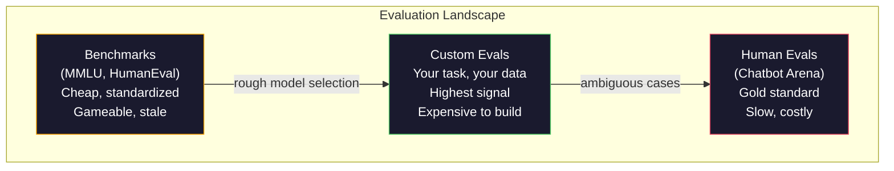
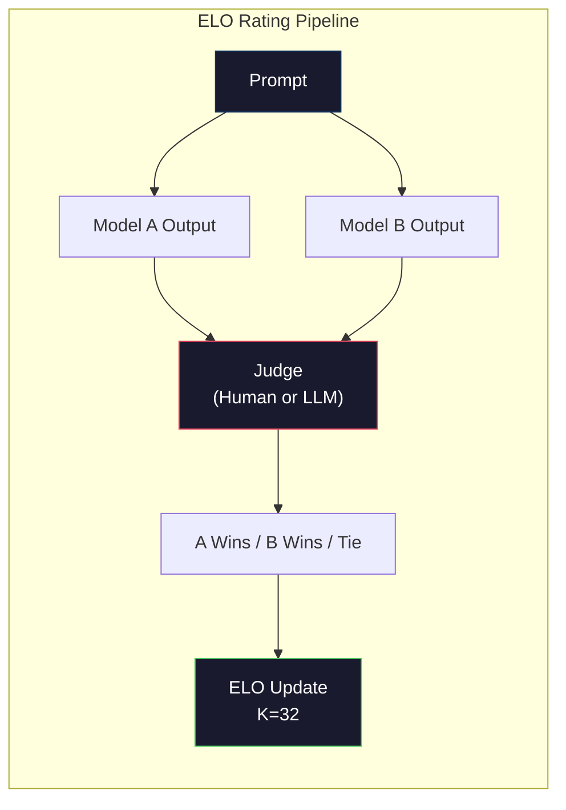

# Değerlendirme:Benchmarks、Evals、LM Harness

> Goodhart Kanunu: Bir gösterge hedefe dönüştüğünde, bu artık iyi bir gösterge olmayacaktır. Her sınır laboratuvarı, referans değerlerine odaklanır, optimize eder. MMLU bölük sayısı , ancak model hala güvenilir bir şekilde "çilek"ten sayılamaz.

**Type:** Build
**Languages:** Python
**前置要求:**Eğlence 10, kursu 01-05 (Büyük İlgiden Yüksek Lisans)
**Time:** ~90 minutes

## Öğrenme hedefi
- Özel bir değerlendirme harnesini oluşturmak, dil modeline yönelik olarak kullanılır 运行多选择和开放式基准
- 解释为什么标准基准(MMLU、HumanEval) 会和,并且无法区分边界模型
- Uygulamayı uygun ölçümler kullanmak  Görev-sözlü değerlendirmeleri gerçekleştirmek:exact match、F1、BLEU 和 LLM-as-judge puanlama
- 设计面向您特定使用案的自定义评价套件, yalnızca açık liderbordlara dayanan değil

## 问题
MMLU 2020 yılında yayınlandı, 57 个学科的 15,908 道题──三年内, sınır modelleri 就让它和了──GPT-4 得分 86.4%──Claude 3 Opus 得分 86.8%──Llama 3 405B 得分 88.6%──leaderboard 3 分范围内压缩, fark sadece istatistiksel gürültü, gerçek kapasite boşlukları değil──

Bu arada, bu modeller 10 yaşındaki bir çocuğun tamamlayabileceği bir görev üzerinde düşünmeden başarısız olurlar. Claude 3.5 Sonnet MMLU'da yüzde 88,7 puan aldı, başlangıçta "strawberry"deki harf sayısını sayamıyordu. Bu görev herhangi bir dünya bilgisi gerektirmez, mantık gerektirmez, sadece karakter düzeyde iterasyon gerektirir. HumanEval 164 sorunun test kod üretimi kullanır. Model üzerinde yüzde 90'dan fazla puan elde edilir, ancak hala sınır durumlarında çöküş kodları üretir, herhangi bir ilk sınıf geliştiricisi bu sınırları bulabilir.

Benchmark performansı ile gerçek dünya güvenilirliği arasındaki fark, LLM değerlendirmesinin temel sorudur. Benchmarks sadece size modelin benchmark üzerinde nasıl performans gösterdiğini söyleyebilir. Onlar neredeyse size modelin belirli görevlerinizde, belirli verilerinizde, belirli başarısızlık modlarında nasıl performans gösterdiğini söylemezler. Müşteri destek botunu inşa ediyorsanız, MMLU'nun önemli olmadığı görülür.

Özel değerlendirmelere ihtiyacınız var. Benchmarks kullanılamaz, kaba model seçimi için benchmarks çok yararlı değil, ama son değerlendirmelerin sizin yerleştirme koşullarınıza doğru uyum sağlaması gerekir.

## 概念
### Eval Manzarası

Değerlendirme üç sınıfta ayrılmıştır, her sınıfın maliyeti ve sinyal kalitesi farklıdır.

**Benchmarks**MMLU, HumanEval, SWE-bench, MATH,ARC,HellaSwag,Modeli çalıştırmak için bir değer elde etmeniz için bir değer elde etmeniz için bir değer elde etmeniz için bir değer kullanmanız için bir değer kullanmanız gerekir.

**Custom evals**Bu testler, kendi kullanımsal durumunuz için test süitleri oluşturur. Girişleri tanımlarsınız. Beklenen çıkışları ve puanlama fonksiyonunu tanımlarsınız.

**Human evals**Uygulama, kullanımı, kullanımı, doğruluk, akıcılık, güvenlik ve diğer standartlar için değerlendirme modeli.$0.10-$2.00) ve hız (((数小时到数天)



### Neden Değerlendirme Kayıpları

Üç mekanizma, değerlendirme oranının gerçek kapasiteyi yansıtmasına neden olur.

**Data contamination。**訓練语料会抓取互联网──Benchmark 问题也在互联网──模型在训练期间看到了答案──这是不是传统意义上的骗局,实验室并非有意含有基准数据──但网络规模的抓取使排除它们几乎不可能──

**Teaching to the test。**Laboratuvarlar, referans performansına yönelik  Optimize training mixed data. Eğer eğitim mixed data'nın %5'i MMLU tarzında çoklu seçim ise, model bu biçim ve cevap dağılımını yapar.

**Saturation。**Her sınır modeli bir referans değerinde %85-90%'e ulaştığında bu referans, ayırt etme yeteneğini durdurur. Geri kalan %10-15'lik sorunlar belirsiz olabilir, etiketlenme hatası olabilir veya soğuk alan bilgisi gerekebilir. MMLU %87'den %89'a yükseltildiğinde, modelin daha akıllı olmaktan ziyade iki soğuk konuyu hatırladığını gösterir.

### Kafası karışık: 快速健康检查

Kafası karışıklık  ölçüm modeli bir dizi jeton için var var var var var bir beklenmedik.

```
PPL = exp(-1/N * sum(log P(token_i | context)))
```

Kafası 10 ⇒ model ⇒ model ⇒ model ⇒ model ⇒ model ⇒ model ⇒ model ⇒ model ⇒ model ⇒ model ⇒ model ⇒ model ⇒ model ⇒ model ⇒ model ⇒ model ⇒ model ⇒ model ⇒ model ⇒ model ⇒ model ⇒ model ⇒ model ⇒ model ⇒ model ⇒ model ⇒ model ⇒ model ⇒ model ⇒ model ⇒ model ⇒ model ⇒ model ⇒ model ⇒ model ⇒ model ⇒ model ⇒ model ⇒ model ⇒ model ⇒ model ⇒ model ⇒ model ⇒ model ⇒ model ⇒ model ⇒ model ⇒ model ⇒ model ⇒ model ⇒ model ⇒ model ⇒ model ⇒ model ⇒ model ⇒ model ⇒ model ⇒ model ⇒ model ⇒ model ⇒ model ⇒ model ⇒ model ⇒ model ⇒ model ⇒ model ⇒ model ⇒ model ⇒ model ⇒ model ⇒ model ⇒ model ⇒ ⇒ ⇒ ⇒ ⇒ ⇒ ⇒ ⇒ ⇒ ⇒ ⇒ ⇒ ⇒ ⇒ ⇒ ⇒ ⇒ ⇒ ⇒ ⇒ ⇒ ⇒ ⇒ ⇒ ⇒ ⇒ ⇒ ⇒ ⇒ ⇒ ⇒ ⇒ ⇒ ⇒ ⇒ ⇒ ⇒ ⇒ ⇒ ⇒ ⇒ ⇒ ⇒ ⇒ ⇒ ⇒ ⇒ ⇒ ⇒ ⇒ ⇒ ⇒ ⇒ ⇒ ⇒ ⇒ ⇒ ⇒ ⇒ ⇒ ⇒ ⇒ ⇒                                                                                                                                                                    

Kafasızlık                                                                                                                                                                                                                                                                                                                                                                                                                                                                                                                          

### Yargıç olarak LLM

GPT-4o-mini kullanırken, her yargılama yaklaşık 0.01 dolar harcar ve insan yargısı ile ilişkisi oldukça yüksek, çoğu görev yaklaşık %80'lik bir anlaşma vardır.

Notlama promptı kendi kendine daha önemlidir. Modelleden daha önemlidir. "Bu yanıt oranı") gürültü oranı oluşturur.

Başarısızlık modları: yargıç modelleri pozisyon tercihleri gösterir (((parlı karşılaştırmalar sırasında Orta tercihleri ilk tepki) 、verbosity tercihleri (((tercihleri daha uzun cevaplar) ve kendi tercihleri (((GPT-4 için GPT-4 çıkışları ⭐⭐⭐⭐⭐⭐⭐⭐⭐⭐⭐⭐⭐⭐⭐⭐⭐⭐⭐⭐⭐⭐⭐⭐⭐⭐⭐⭐⭐⭐⭐⭐⭐⭐⭐⭐⭐⭐⭐⭐⭐⭐⭐⭐⭐⭐⭐⭐⭐⭐⭐⭐⭐⭐⭐⭐⭐⭐⭐⭐⭐⭐⭐⭐⭐⭐⭐⭐⭐⭐⭐⭐⭐⭐⭐⭐⭐⭐⭐⭐⭐⭐⭐⭐⭐⭐⭐⭐⭐⭐⭐⭐⭐⭐⭐⭐⭐⭐⭐⭐⭐⭐⭐⭐⭐⭐⭐⭐⭐⭐⭐⭐⭐⭐⭐⭐⭐⭐⭐⭐⭐⭐⭐⭐⭐⭐⭐⭐⭐⭐⭐⭐⭐⭐⭐⭐⭐⭐⭐⭐⭐⭐⭐⭐⭐⭐⭐⭐⭐⭐⭐⭐⭐⭐⭐⭐⭐⭐⭐⭐⭐⭐⭐⭐⭐⭐⭐⭐⭐⭐⭐⭐⭐⭐⭐⭐⭐⭐⭐⭐⭐⭐⭐⭐⭐⭐⭐⭐⭐⭐⭐⭐⭐⭐⭐⭐⭐⭐⭐⭐⭐⭐⭐⭐⭐⭐⭐⭐⭐⭐⭐⭐⭐⭐⭐⭐⭐⭐⭐⭐⭐⭐⭐⭐⭐⭐⭐⭐⭐⭐⭐⭐⭐⭐⭐⭐⭐⭐⭐⭐⭐⭐⭐⭐⭐⭐⭐⭐⭐⭐⭐⭐⭐⭐⭐⭐⭐⭐⭐⭐⭐⭐⭐⭐⭐⭐⭐⭐⭐⭐⭐⭐⭐⭐⭐⭐⭐⭐⭐⭐⭐⭐⭐⭐⭐⭐⭐⭐⭐⭐⭐⭐⭐⭐⭐⭐⭐⭐⭐⭐⭐⭐⭐⭐⭐⭐⭐⭐⭐⭐⭐⭐⭐⭐⭐⭐⭐⭐⭐⭐⭐⭐⭐⭐⭐⭐⭐⭐⭐⭐⭐⭐⭐⭐⭐⭐⭐⭐⭐⭐⭐⭐⭐⭐⭐⭐⭐⭐⭐⭐⭐⭐⭐⭐⭐⭐⭐⭐⭐⭐⭐⭐⭐⭐⭐⭐⭐⭐⭐⭐⭐⭐⭐⭐⭐⭐⭐⭐⭐⭐⭐⭐⭐⭐⭐⭐⭐⭐⭐⭐⭐⭐⭐⭐⭐⭐⭐⭐⭐⭐⭐⭐⭐⭐⭐⭐⭐⭐⭐⭐⭐⭐⭐⭐⭐⭐⭐⭐⭐⭐⭐⭐⭐⭐⭐⭐⭐⭐⭐⭐⭐⭐⭐⭐⭐

### Düşüşüye dayanarak ELO dereceleri

Bu Chatbot Arena'nın yöntemidir. Aynı soruya farklı modellerden iki yanıt gösterir. İnsan veya LLM yargıçı daha iyi bir tanesini seçer.

ELO'nun avantajları: mutlak puanlardan daha güvenilir, daha iyi ilişkileri işleyen ve her çıkış için daha az karşılaştırma gerektiren bir değer değer değerlendirmesi. 2026 yılına kadar, Chatbot Arena  sıralaması GPT-4o、Claude 3.5 Sonnet 和 Gemini 1.5 Pro'nun 20 ELO puanına kadar birbirinden farklılık gösterdiği göstermektedir.



### Eval Çerçeve

**lm-evaluation-harness**(EleutherAI): Standards of open-source evalu framework── support 200+ benchmarks── use a条命令即可让任意 Hugging Face 模型跑 MMLU、HellaSwag、ARC 等──Open LLM Leaderboard 使用它──

**RAGAS**Bu nedenle, bu konuyla ilgili olarak, bu konuyla ilgili olarak, bu konuyla ilgili olarak, bu konuyla ilgili olarak, bu konuyla ilgili olarak, bu konuyla ilgili olarak, bu konuyla ilgili olarak, bu konuyla ilgili olarak, bu konuyla ilgili olarak, bu konuyla ilgili olarak, bu konuyla ilgili olarak, bu konuyla ilgili olarak, bu konuyla ilgili olarak, bu konuyla ilgili olarak, bu konuyla ilgili olarak, bu konuyla ilgili olarak, bu konuyla ilgili olarak, bu konuyla ilgili olarak, bu konuyla ilgili olarak, bu konuyla ilgili olarak, bu konuyla ilgili olarak, bu konuyla ilgili olarak, bu konuyla ilgili olarak, bu konuyla ilgili olarak, bu konuyla ilgili olarak, bu konuyla ilgili olarak, bu konuyla ilgili olarak, bu konuyla ilgili olarak, bu konuyla ilgili olarak, bu konuyla ilgili olarak, bu konuyla ilgili olarak, bu konuyla ilgili olarak, bu konuyla ilgili olarak, bu konuyla ilgili olarak, bu konuyla ilgili olarak, bu konuyla ilgili olarak, bu konuyla ilgili olarak, bu konuyla ilgili olarak, bu konu hakkında, bu konu hakkında, bu konu hakkında, bu konu hakkında,

**promptfoo**YAML'de tanımlanan test vakaları, birden fazla model çalışması için, geçiş/başarısızlık raporunu elde etmek için kullanılır.

### Özel Evaller Yapmak

Bu üretim için önemli olan tek değerlendirme:

1. **Define the task。**模型到底应该做什么?要精确──"Soruların cevabını" 太模糊──"Bir müşteri şikayet e-posta verildiğinde, ürün adını, sorun kategorisini ve duyguyu çıkarmak" 才是一个可以评估的任务──

2. **Create test cases。**Prototip değerlendirme en az 50 个, üretim en az 200 个── her test vakaı bir (gönüllü, beklenen_ürüntü) ⋅ içerir kenar vakalar:空输入、adversarial inputs、ambiguous inputs、其他语言的 inputs──

3. **Define scoring。**Yapılandırılmış çıkışlar, tam eşleşme kullanımı, BLEU/ROUGE kullanımı, açık kaliteli kullanımı, LLM-as-judge kullanımı, çıkarma görevleri, F1 kullanımı,

4. **Automate。**Her değerlendirme bir emirle yürütülebilir. Zamanla karşılaştırılmış bir biçimdeki depolama sonuçlarını desteklemek için hiçbir el adım yoktur.

5. **Track over time。**单独一个评分分 没有意义――你需要趋势线――上一次提示变化后分数是否提升?切换模型后是否回归?把评与提示 一起版本――

| Eval Type | 每次 judgment 成本 | 与人类的一致性 | 最适合 |
|-----------|------------------|----------------------|----------|
| Exact match | ~$0 | 100%（适用时） | Structured output、classification |
| BLEU/ROUGE | ~$0 | ~60% | Translation、summarization |
| LLM-as-judge | ~$0.01 | ~80% | Open-ended generation |
| Human eval | $0.10-$2.00 | N/A（即 ground truth） | Ambiguous、high-stakes tasks |


```figure
perplexity-loss
```

## Yapın onu.
### 步骤 1: minimum Eval 框架

定義核心抽象──一 eval case 有输入、预期输出 和可选的元数据 dict──一个得分者 接收预测 和引用,并返回 0 到 1 之间的分数──

```python
import json
from collections import Counter

class EvalCase:
    def __init__(self, input_text, expected, metadata=None):
        self.input_text = input_text
        self.expected = expected
        self.metadata = metadata or {}

class EvalSuite:
    def __init__(self, name, cases, scorers):
        self.name = name
        self.cases = cases
        self.scorers = scorers

    def run(self, model_fn):
        results = []
        for case in self.cases:
            prediction = model_fn(case.input_text)
            scores = {}
            for scorer_name, scorer_fn in self.scorers.items():
                scores[scorer_name] = scorer_fn(prediction, case.expected)
            results.append({
                "input": case.input_text,
                "expected": case.expected,
                "prediction": prediction,
                "scores": scores,
            })
        return results
```

### 步骤 2: İşlevleri notlama

Tam bir eşleşme oluşturun F1 simgesi ve bir benzer LLM-bir yargıç puanlayıcı.

```python
def exact_match(prediction, expected):
    return 1.0 if prediction.strip().lower() == expected.strip().lower() else 0.0

def token_f1(prediction, expected):
    pred_tokens = set(prediction.lower().split())
    exp_tokens = set(expected.lower().split())
    if not pred_tokens or not exp_tokens:
        return 0.0
    common = pred_tokens & exp_tokens
    precision = len(common) / len(pred_tokens)
    recall = len(common) / len(exp_tokens)
    if precision + recall == 0:
        return 0.0
    return 2 * (precision * recall) / (precision + recall)

def llm_judge_simulated(prediction, expected):
    pred_words = set(prediction.lower().split())
    exp_words = set(expected.lower().split())
    if not exp_words:
        return 0.0
    overlap = len(pred_words & exp_words) / len(exp_words)
    length_penalty = min(1.0, len(prediction) / max(len(expected), 1))
    return round(overlap * 0.7 + length_penalty * 0.3, 3)
```

### 步骤 3: ELO derecelendirme sistemi

ELO güncellemelerini kullanmak çiftlik karşılaştırmaları gerçekleştirmek için kullanılıyor.

```python
class ELOTracker:
    def __init__(self, k=32, initial_rating=1500):
        self.ratings = {}
        self.k = k
        self.initial_rating = initial_rating
        self.history = []

    def _ensure_player(self, name):
        if name not in self.ratings:
            self.ratings[name] = self.initial_rating

    def expected_score(self, rating_a, rating_b):
        return 1 / (1 + 10 ** ((rating_b - rating_a) / 400))

    def record_match(self, player_a, player_b, outcome):
        self._ensure_player(player_a)
        self._ensure_player(player_b)

        ea = self.expected_score(self.ratings[player_a], self.ratings[player_b])
        eb = 1 - ea

        if outcome == "a":
            sa, sb = 1.0, 0.0
        elif outcome == "b":
            sa, sb = 0.0, 1.0
        else:
            sa, sb = 0.5, 0.5

        self.ratings[player_a] += self.k * (sa - ea)
        self.ratings[player_b] += self.k * (sb - eb)

        self.history.append({
            "a": player_a, "b": player_b,
            "outcome": outcome,
            "rating_a": round(self.ratings[player_a], 1),
            "rating_b": round(self.ratings[player_b], 1),
        })

    def leaderboard(self):
        return sorted(self.ratings.items(), key=lambda x: -x[1])
```

### 步骤 4: Kafası Kalkülülasyonu

Bu değerleri model logitlerinden elde edeceksiniz. Burada muhtemellik dağılımını simgeleyeceğiz.

```python
import numpy as np

def perplexity(log_probs):
    if not log_probs:
        return float("inf")
    avg_neg_log_prob = -np.mean(log_probs)
    return float(np.exp(avg_neg_log_prob))

def token_log_probs_simulated(text, model_quality=0.8):
    np.random.seed(hash(text) % 2**31)
    tokens = text.split()
    log_probs = []
    for i, token in enumerate(tokens):
        base_prob = model_quality
        if len(token) > 8:
            base_prob *= 0.6
        if i == 0:
            base_prob *= 0.7
        prob = np.clip(base_prob + np.random.normal(0, 0.1), 0.01, 0.99)
        log_probs.append(float(np.log(prob)))
    return log_probs
```

### 5 adım: Toplam Sonuçlar

计算一次 eval run:平均、中、门值 下的通过率,以及按米特的分类──

```python
def summarize_results(results, threshold=0.8):
    all_scores = {}
    for r in results:
        for metric, score in r["scores"].items():
            all_scores.setdefault(metric, []).append(score)

    summary = {}
    for metric, scores in all_scores.items():
        arr = np.array(scores)
        summary[metric] = {
            "mean": round(float(np.mean(arr)), 3),
            "median": round(float(np.median(arr)), 3),
            "std": round(float(np.std(arr)), 3),
            "min": round(float(np.min(arr)), 3),
            "max": round(float(np.max(arr)), 3),
            "pass_rate": round(float(np.mean(arr >= threshold)), 3),
            "n": len(scores),
        }
    return summary

def print_summary(summary, suite_name="Eval"):
    print(f"\n{'=' * 60}")
    print(f"  {suite_name} Summary")
    print(f"{'=' * 60}")
    for metric, stats in summary.items():
        print(f"\n  {metric}:")
        print(f"    Mean:      {stats['mean']:.3f}")
        print(f"    Median:    {stats['median']:.3f}")
        print(f"    Std:       {stats['std']:.3f}")
        print(f"    Range:     [{stats['min']:.3f}, {stats['max']:.3f}]")
        print(f"    Pass rate: {stats['pass_rate']:.1%} (threshold >= 0.8)")
        print(f"    N:         {stats['n']}")
```

### 步骤 6: Tam boru hattını çalıştır

Bütün içeriği bağlayın, bir görevi tanımlayın, test vakaları oluşturun, iki modeli simgeleyin, değerlendirmeleri yürütün, çiftlik karşılaştırmalardan 計算 ELO,并印 leaderboard──

```python
def demo_model_good(prompt):
    responses = {
        "What is the capital of France?": "Paris",
        "What is 2 + 2?": "4",
        "Who wrote Hamlet?": "William Shakespeare",
        "What language is PyTorch written in?": "Python and C++",
        "What is the boiling point of water?": "100 degrees Celsius",
    }
    return responses.get(prompt, "I don't know")

def demo_model_bad(prompt):
    responses = {
        "What is the capital of France?": "Paris is the capital city of France",
        "What is 2 + 2?": "The answer is four",
        "Who wrote Hamlet?": "Shakespeare",
        "What language is PyTorch written in?": "Python",
        "What is the boiling point of water?": "212 Fahrenheit",
    }
    return responses.get(prompt, "Unknown")

cases = [
    EvalCase("What is the capital of France?", "Paris"),
    EvalCase("What is 2 + 2?", "4"),
    EvalCase("Who wrote Hamlet?", "William Shakespeare"),
    EvalCase("What language is PyTorch written in?", "Python and C++"),
    EvalCase("What is the boiling point of water?", "100 degrees Celsius"),
]

suite = EvalSuite(
    name="General Knowledge",
    cases=cases,
    scorers={
        "exact_match": exact_match,
        "token_f1": token_f1,
        "llm_judge": llm_judge_simulated,
    },
)

results_good = suite.run(demo_model_good)
results_bad = suite.run(demo_model_bad)

print_summary(summarize_results(results_good), "Model A (concise)")
print_summary(summarize_results(results_bad), "Model B (verbose)")
```

"iyi" model kesin bir cevap verir. "kötü" model uzun uzun ifadeler verir.

### 步骤 7: ELO Turnuvası

Birçok dönemde, ortalama bir ikili bir model ile diğerleri arasında bir çiftlik karşılaştırmalar yapılır.

```python
elo = ELOTracker(k=32)

for case in cases:
    pred_a = demo_model_good(case.input_text)
    pred_b = demo_model_bad(case.input_text)

    score_a = token_f1(pred_a, case.expected)
    score_b = token_f1(pred_b, case.expected)

    if score_a > score_b:
        outcome = "a"
    elif score_b > score_a:
        outcome = "b"
    else:
        outcome = "tie"

    elo.record_match("model_a_concise", "model_b_verbose", outcome)

print("\nELO Leaderboard:")
for name, rating in elo.leaderboard():
    print(f"  {name}: {rating:.0f}")
```

### 步骤 8: Kafası karışıklık karşılaştırma

Farklı kalite seviyelerinin karmaşıklığı

```python
test_text = "The quick brown fox jumps over the lazy dog in the garden"

for quality, label in [(0.9, "Strong model"), (0.7, "Medium model"), (0.4, "Weak model")]:
    log_probs = token_log_probs_simulated(test_text, model_quality=quality)
    ppl = perplexity(log_probs)
    print(f"  {label} (quality={quality}): perplexity = {ppl:.2f}")
```

## Kullan
### değerlendirme aletleri (EleutherAI)

Önemli model üzerinde çalışmak için standart araçlar.

```python
# pip install lm-eval
# Command line:
# lm_eval --model hf --model_args pretrained=meta-llama/Llama-3.1-8B --tasks mmlu --batch_size 8

# Python API:
# import lm_eval
# results = lm_eval.simple_evaluate(
#     model="hf",
#     model_args="pretrained=meta-llama/Llama-3.1-8B",
#     tasks=["mmlu", "hellaswag", "arc_easy"],
#     batch_size=8,
# )
# print(results["results"])
```

### promptfoo

YAML'de tanımlanan testler için kullanılmış olan, çok sayıda sağlayıcıya yönelik olan 运行──

```yaml
# promptfoo.yaml
providers:
  - openai:gpt-4o-mini
  - anthropic:claude-3-haiku

prompts:
  - "Answer in one word: {{question}}"

tests:
  - vars:
      question: "What is the capital of France?"
    assert:
      - type: contains
        value: "Paris"
  - vars:
      question: "What is 2 + 2?"
    assert:
      - type: equals
        value: "4"
```

### RAG değerlendirmesi için RAGAS

```python
# pip install ragas
# from ragas import evaluate
# from ragas.metrics import faithfulness, answer_relevancy, context_precision
#
# result = evaluate(
#     dataset,
#     metrics=[faithfulness, answer_relevancy, context_precision],
# )
# print(result)
```

RAGAS 衡量通用 evals 会遗漏的内容:模型答案是否基于回收的文本,而不是仅仅在抽象意义上是否正确──

## - Söyle.
本课会产 出 `outputs/prompt-eval-designer.md`Bu, herhangi bir görev için kullanılabilecek bir tekrarlanabilir istekleme, özel değerlendirme süitleri tasarlamak için kullanılır.

Yine ortaya çıkacak.`outputs/skill-llm-evaluation.md`Bu, görev türüne göre kullanılacak bir karar çerçevesidir.

## 练习
1. ⇒ "Dayanıklılık" puanlayıcı ekleyin: Aynı giriş ile 模型 5 kez çalışsın, 匹配的频率的输出并衡量──deterministik girişler 上的不一致答案会暴露脆弱的提示或过高的温度设置──

2. 扩展 ELO tracker,使其支持多个法官功能 (精确匹配、F1、LLM-as-judge)并为它们加权──比较当你大幅提高精确匹配权重与大幅提高F1权重时,领导板 会如何变化──

3. Bu nedenle, bir özel görev oluşturmak için eval suite oluşturmak: 5 kategoriye e-posta sınıflandırmasını oluşturmak. Birçok örnek ve kenar vakaları içeren 100 test vakaları oluşturmak.

4.  kirliliği tespit etmesi: given determined one set evaluation questions 和 a training corpus, checkha has how much proportion of evaluation questions (checkha has how much proportion of evaluation questions)  veya yakın parafrases) eğitim verilerinde ortaya çıkmaktadır.

5. Bu bir "model farklılık" aracı oluşturmak.  İki model sürümünün değerlendirme sonuçlarını belirlemek, hangi spesifik test vakalarının yükseltilmesi, hangi durumların geri dönüşü ve hangi durumların değişmemesi için Bu değerlendirme sürümünün kod farklılığıdır.

## 关键术语
| Term | 人们的说法 | 它实际上的含义 |
|------|----------------|----------------------|
| MMLU | "The benchmark" | Massive Multitask Language Understanding，包含 57 个学科的 15,908 道 multiple choice questions，到 2025 年已在 88% 以上饱和 |
| HumanEval | "Code eval" | OpenAI 的 164 个 Python function-completion problems，只测试 isolated function generation |
| SWE-bench | "Real coding eval" | 来自 12 个 Python repos 的 2,294 个 GitHub issues，衡量包括 test generation 在内的 end-to-end bug fixing |
| Perplexity | "How confused the model is" | exp(-avg(log P(token_i given context)))，越低表示模型给实际 tokens 分配的概率越高 |
| ELO rating | "Chess ranking for models" | 根据 pairwise win/loss records 计算的 relative skill rating，Chatbot Arena 用它对 100+ models 排名 |
| LLM-as-judge | "Using AI to grade AI" | 强模型按照 rubric 评价弱模型 outputs，与人类 judges 约 80% agreement，成本约 $0.01/judgment |
| Data contamination | "The model saw the test" | Training data 包含 benchmark questions，在不提升真实 capability 的情况下抬高分数 |
| Eval suite | "A bunch of tests" | 一个 versioned collection，由 (input, expected_output, scorer) triples 组成，用于衡量特定 capability |
| Pass rate | "What percentage it gets right" | Eval cases 中得分超过阈值的比例，比 mean score 更可操作，因为它衡量 reliability |
| Chatbot Arena | "Model ranking website" | LMSYS 平台，拥有 2M+ human preference votes，并通过 ELO ratings 生成最可信的 LLM leaderboard |

## 延伸阅读
- [Hendrycks et al., 2021 -- "Measuring Massive Multitask Language Understanding"](https://arxiv.org/abs/2009.03300)-- MMLU makalesi, henüz alıntı yapılmasına rağmen, hala en çok alıntılanan LLM referansı
- [Chen et al., 2021 -- "Evaluating Large Language Models Trained on Code"](https://arxiv.org/abs/2107.03374)-- OpenAI'nin HumanEval makalesi, kod üretimi değerlendirme metodolojisini belirledi
- [Zheng et al., 2023 -- "Judging LLM-as-a-Judge"](https://arxiv.org/abs/2306.05685)- LLM değerlendirmesi kullanımı LLM'lerin sistemli analizi, pozisyon ve sözcüksellik yanlışı da dahil olmak üzere
- [LMSYS Chatbot Arena](https://chat.lmsys.org/)-- Crowdsourced model karşılaştırma platformu, 2M+ oylara sahip, en güvenilir gerçek dünya LLM sıralaması
