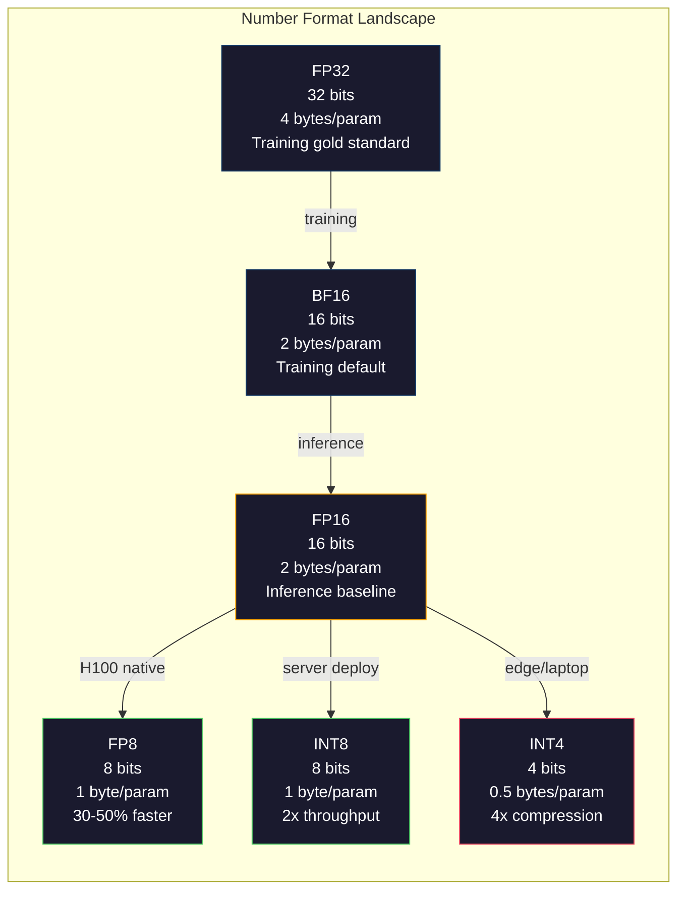
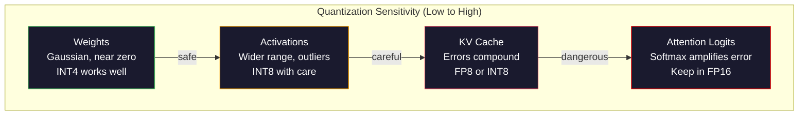
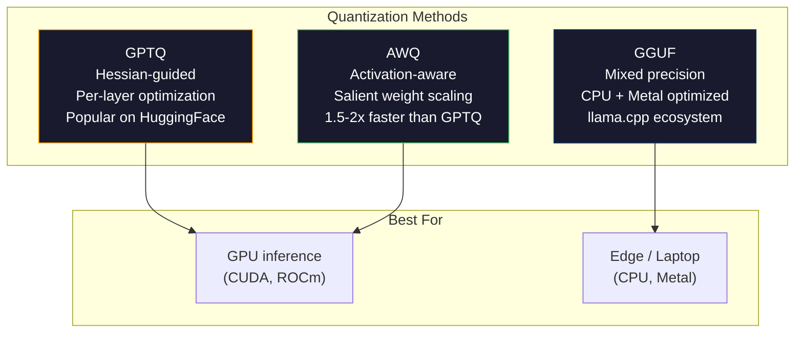

# Kvantizasyon: 让模型装得下

> Bir 70B  model FP16  140GB ⋅光是权重 ⋅需要两张 A100──Quantise到 FP8:一张80GB GPU──INT4:一台 MacBook──

**Type:** Build
**Languages:** Python (with numpy)
**前置要求:**Eğlence 10, kursu 01-10 (Büyük İlgiden Yüksek Lisans)
**Time:** ~120 minutes

## Öğrenme hedefi
- FP16'dan INT8'e ve INT4'e karşı simetrik ve asimetrik kuantitasyon, yani per-tensor ve per-kanal ölçeklendirme ile gerçekleşir
- 计算量化 带来的内存节省,并判断哪种精度 能装进给定的 GPU 的VRAM
- 解释 Post-training quantization (PTQ) ile quantization-conscious training (QAT) arasındaki fark
- GPTQ veya AWQ kullanın bir gerçek modeli kuantite edin ve doğruluk-hüyeyelik pazarlamasını ölçün

## 问题
Llama 3 70B 700 milyar parametre vardır. Her parametre 16 bit yüzen nokta numarasıdır.

Ancak her parametre 16 bitten fazla kullanılıyor. Neural Network'de büyük çoğunlukta ağırlık sıfır civarında toplanıyor. FP16'ın tam dinamik aralığı ise neredeyse tamamen kullanılmıyor. Llama 3 70B'nin ağırlık real dağılımını ölçerseniz, %95 oranı -0.1 ile +0.1 arasında düşüyor.

Kvantisaj düşük hassasiyetli sayı yerine yüksek hassasiyetli sayılarda. FP16'dan FP8'e kadar, hafıza yarıya kesilecek. FP16'dan INT4'e kadar, dörtte bir kesilecek. O 140GB'lik model 35GB'ye dönüşecek. Tek bir CPU'ya yüklenebilir. Daha sonra 2 bitli kuantisajıya doğru ilerleyebilir.

代価は正確さ──you移除の各位は都会破坏信息──問題は,あなたがどれだけ正確さ,以及損失を失うだろう. どれ位正確さ,以及損失は何里──i çok iyi INT4 モデル elde eder, çoğu referanslamada 上能保存原始モデルの質は95-99%──INT4'e kadar bir kez saf miktarda kuantleştirmek, modelleri tamamen yok edebilir.

社区对Llama 3做INT4 GPTQ 量化结果显示,在WikiText 上大约损失1-2 困难点──Mistral 发布了Mixtral 8x22B 的FP8 检查点,在MMLU 上没有可测量质量损失──GGUF biçimi 支了 llama.cpp,让70B 模型能在搭载M-series 芯片的MacBooks上运行──量化不是黑客──它是所有7B 模型的标准署路径──

## 概念
### Sayı biçimleri: Her bit ne yapılır

Her kaygan nokta numarası vardır üç bölüm: işaret, gösterge ve mantissa, işaret bir bittir, gösterge bir gösterge olarak adlandırılır.

```
FP32:  [1 sign] [8 exponent] [23 mantissa]  = 32 bits
FP16:  [1 sign] [5 exponent] [10 mantissa]  = 16 bits
BF16:  [1 sign] [8 exponent] [7  mantissa]  = 16 bits
FP8:   [1 sign] [4 exponent] [3  mantissa]  = 8  bits (E4M3)
FP8:   [1 sign] [5 exponent] [2  mantissa]  = 8  bits (E5M2)
INT8:  [1 sign] [7 value]                   = 8  bits (uniform steps)
INT4:  [1 sign] [3 value]                   = 4  bits (16 levels total)
```

**FP32**Bu, bir dizi farklı metrikler oluşturur. Bu, bir dizi metrikler oluşturur.

**FP16**Bu, ağırlık kaybı sorunudur, ancak eğitim sırasında niden artan aktivasyonlar ve gradientler nce tehlikelidirFP16 eğitiminde nce kayıp ölçeklendirme gerektirir 

**BF16**(Brain Float 16) FP32'nin 8 bitli katılımcılığını korur, ancak mantissa'yı 7 bitlere kadar küçültür. FP16'a göre daha düşük. Google'ın Deep Learning için tasarladığı bir uygulama.

**FP8**E4M3,4 katı, 3 mantissa) eğitici süreci  ağırlıkları ve aktivasyonları  sonucu olarak kullanılır E5M2,5 katı, 2 mantissa) eğitim süreci  gradientleri, bu zaman aralığı daha doğruluk daha önemlidir H100 GPU'larda, FP8 sonucu karşılaştırıldığında FP16 30-50% hızlandırılabilir, ve kalite kaybı göz ardı edilebilir.

**INT8**-128'den 127'e kadar olan 256 个等间隔值'dan sadece bir ölçek faktörü gerekir. -128'den 127'e kadar olan 256 个等间隔值'dan sadece -128'e kadar olan 256 个等间隔值'ya kadar.

**INT4**Daha da ileriye kadar, sadece 16 个可能值――scale factor 承担了大量的工作──质量完全取决于你如何选择规模,以及量化哪些权重──state-of-the-art INT4 methods(GPTQ、AWQ)



### Kvantisa 如何工作

核心操作很简单──一个浮点值的 tensor,一个尺度因子,乘除、圆到最近的整数,然后存储整数加尺度因子──

**Quantize:**
```
scale = max(abs(tensor)) / max_int_value
quantized = round(tensor / scale)
```

**Dequantize:**
```
reconstructed = quantized * scale
```

 simetrik aralığı için -127 ila 127) :
```
scale = max(abs(tensor)) / 127
quantized = clamp(round(tensor / scale), -128, 127)
```

误差就是圆错――每个值最偏离 `scale / 2`❖ Bir katmanın genel hata farkı, ne kadar ağırlık sahibi olduğunuza ve modelin bu ağırlıklara karşı hassasiyetine bağlıdır.

**Per-tensor vs per-channel quantization。**Per-tensor tüm ağırlık matrisi için bir ölçek faktörü kullanın. Basit ama kayıp: Eğer bir sıra büyük değer, diğer bir sıra küçük değer varsa, küçük değer büyük ölçüde hasar görür.

**Asymmetric quantization**添加一个零点抵消:`quantized = round(tensor / scale) + zero_point`◊ Bu, sıfır merkezli dağılımlarla işlenebilir. Örneğin, ReLU etkinleştirmeleri ‒forever non-negative of―Simetrik kuantitasyon ‒half integer aralığını ‒waste ‒forever ‒on ‒negative value üzerinde ‒Asimetrik kuantitasyon ‒real range ‒min, max ‒map into full integer range―

### Duyarlılık Hierarşi

Modeldeki farklı bölümlerin kuantitasyon için toleransları aynı değildir.

**Weights（最稳健）。**模型权重在训练期间变化缓慢,并遵循大致以零为中心的高斯分布──它们非常适合量化──带每频道尺度的INT8重量 几乎无损──INT4 需要更复杂的方法,但也可行──

**Activations（中等敏感）。**Aktifleştirmeler, 期间流经网络的中间值的推断です. Onların dinamik aralığı, 权重比较宽,并且包含outliers. 单个注意头可能产生比平均值大于100倍的激活值.

**KV cache（高敏感）。**Anahtar değerli kaş  depolama tüm önceki tokenlerin dikkatini belirler. Uzun bağlam uzunluğunda 下,KV kaş 会主导内存。 32K bağlam 70B 模型 için, sadece KV kaş FP16 下就是 40GB。 KV kaşını FP8 veya INT8'ye kadar kuantleştirmek 能节省大量内存, ancak herhangi bir hata tüm sonraki dikkat hesaplamalarında oluşur.

**Attention logits（最敏感）。**Dikkat İçindeki Softmax, girişlerin küçük değişikliklerine karşı yüksek hassaslıklı olacaktır. Pre-softmax logit içindeki 0.01'in kuantitasyon hatası da dikkat dağılımını önemli ölçüde değiştirebilir.



### PTQ vs. QAT

**Post-Training Quantization (PTQ)**Bir iyi eğitimli modelı kuantite etmek için. FP16 ağırlıklarını, hesaplama ölçek faktörlerini, yuvarlak, sonra dağıtmak için kullanılır.

**Quantization-Aware Training (QAT)**Geliştirme ön geçişinde, sahte kuantitasyon işlemlerini yerleştirmek için, model öğrencilerinin yoğunluğu, yuvarlama hatalarına daha küçük bir yerleştirilmektedir.

| Aspect | PTQ | QAT |
|--------|-----|-----|
| Cost | 几分钟到几小时 | 完整 training run |
| Quality at INT8 | 极佳（< 0.1% 损失） | 极佳 |
| Quality at INT4 | 使用 GPTQ/AWQ 时良好（1-3% 损失） | 更好（< 1% 损失） |
| Quality at INT2 | 较差 | 对某些任务可用 |
| Calibration data | 128-1024 个 examples | 完整 training dataset |
| When to use | 部署、迭代 | 低 bit-width 下的最高质量 |

### GPTQ, AWQ, GGUF

**GPTQ (GPT Quantization)**Hessian, her bir ağırlığa karşı hassaslığı üretimi tanımlamak için bir kez küçük kalibrasyon verisi kullanır. Hessian, önemli bir ağırlığın daha dikkatli olarak miktarlandırıldığını düşünüyor. GPTQ, LLM'lere karşı INT4 miktarlandırmasının uygulanabilir bir yöntem olmasına ilk neden oldu.

**AWQ (Activation-Aware Weight Quantization)**观察到少量权重 (約 1%) 极其重要,因为它们会与较大的激活值 相乘──AWQ 使用校准数据 找到这些突出重量,并量子化 前放大它们(然后把应应激活 缩小) ⋅ This will keep the important weight in the range of INT4 quantization 能准确表示──AWQ'ın kalitesi genellikle GPTQ'den biraz daha iyi olur, aynı zamanda hızlı 1.5-2x hızla uygulanır.

**GGUF (GPT-Generated Unified Format)**llama.cpp  ve onun ekolojik kullanım dosya biçimi。 farklı katmanlar kullanan karışık kuantitasyon desteklemektedir: farklı bit genişlikleri。 birinci katman ve son katmanı(Embedding ve çıkış başı) genellikle daha yüksek hassaslığı tutmaktadır。 orta katmanlar INT4 veya INT3 kullanır。GGUF dosyaları ise kendi içinde bulunmaktadır: ağırlıklar、Tokenizer、metadatalar bir dosyada bulunmaktadır。 bu biçim  yönündedir CPU sonucu ve Apple Silicon  tasarım, bu ortamlarda, tüm modelin içinde yüklenmesi ve CPU Metal GPU üzerinde çalışması veya matris çarpmaları standart yoludur。Q4_K_M en yaygın GGUF kuantitasyonıdır, kalitede ve büyüklükte dengeleme elde edilir。



### Kalite Ölçümü

Kvantistik modelin hala iyi olup olmadığını nasıl anlayacaksın?

**Perplexity。**En sık görülen metrikler──越低越好── ,iki metrikte yapılan hesaplamalarda, ilk ve kuantitasyonlu modellerin karmaşıklığı──delta size kuantitasyonun çok fazla bilgiyi bozan olduğunu söyleyecektir.

**Task-specific benchmarks。**MMLU、HumanEval、GSM8K veya kendi kendini tanımlayan değerlendirme süiti üzerinde çalıştırılan kuantitasyonlu model¬lerle orijinal model karşılaştırma¬ları.

**Output comparison。**Bu nedenle, bu iki modelin yanıtları oluşturması için iki örnek kullanılır.

**Latency and throughput。**Kvantisalizasyonun varlığı, modelin daha hızlı olması için daha uygun bir şekilde kullanılır.

| Model | Format | Size | Perplexity (WikiText-2) | MMLU | Tokens/sec (A100) |
|-------|--------|------|------------------------|------|-------------------|
| Llama 3 70B | FP16 | 140GB | 3.12 | 79.5% | 38 |
| Llama 3 70B | FP8 | 70GB | 3.14 | 79.3% | 55 |
| Llama 3 70B | GPTQ INT4 | 35GB | 4.32 | 77.8% | 72 |
| Llama 3 70B | AWQ INT4 | 35GB | 4.18 | 78.1% | 75 |
| Llama 3 70B | GGUF Q4_K_M | 40GB | 4.25 | 77.9% | 28 (CPU) |

规律是:FP8 几乎没有价格──INT4 损失 1-2 MMLU puan,但吞吞翻倍、内存降至四分之一──对几乎所有部署而言,这个交易都值得──

### Gerçek Sayılar

H100 yukarı FP16 FP8: inference hız artışı 30-50%, kalite kaybı < 0.1%── bu açıkça görülebilir bir kuantizasyon── her H100'in dağıtımında kullanılmalıdır──

FP16'a INT8'e (LLM.int8() kadar:内存 2x azaldı,质量损失 < 0.5%──混合精度 方法把异异特特质 保持在FP16,同时把其他所有内容量化到INT8──

FP16'ya INT4'e (GPTQ/AWQ):内存 4x azaltılmış, kalite kaybı 1-3%'dir, model ve yöntemden farklıdır.

FP16'a INT4'e (GGUF Q4_K_M):内存 azalması 3.5x, kalite kaybı 1-2%── CPU sonuçlarına yönelik 优化──Q4_K_M 下的70B 模型约40GB,配备中64GB M3 Max 上以 10-15 token/second 运行──

FP16'ya kadar INT2:内存 8x azaldı, kalite kaybı 5-15%'dir.


```figure
quantization
```

## Yapın onu.
### 步骤 1: 数字格式表示

构建每种格式的位级表示,准确观察 sign、exponent 和 mantissa 的作用──

```python
import numpy as np


def float_to_fp32_bits(value):
    bits = np.float32(value).view(np.uint32)
    sign = (bits >> 31) & 1
    exponent = (bits >> 23) & 0xFF
    mantissa = bits & 0x7FFFFF
    return {"sign": int(sign), "exponent": int(exponent), "mantissa": int(mantissa),
            "exponent_bits": format(int(exponent), '08b'),
            "mantissa_bits": format(int(mantissa), '023b'),
            "value": float(value),
            "actual_exponent": int(exponent) - 127}


def float_to_fp16_bits(value):
    fp16 = np.float16(value)
    bits = fp16.view(np.uint16)
    sign = (bits >> 15) & 1
    exponent = (bits >> 10) & 0x1F
    mantissa = bits & 0x3FF
    return {"sign": int(sign), "exponent": int(exponent), "mantissa": int(mantissa),
            "exponent_bits": format(int(exponent), '05b'),
            "mantissa_bits": format(int(mantissa), '010b'),
            "value": float(fp16),
            "actual_exponent": int(exponent) - 15}


def float_to_bf16_bits(value):
    fp32_bits = np.float32(value).view(np.uint32)
    bf16_bits = (fp32_bits >> 16).astype(np.uint16)
    sign = (bf16_bits >> 15) & 1
    exponent = (bf16_bits >> 7) & 0xFF
    mantissa = bf16_bits & 0x7F
    reconstructed = np.uint32(bf16_bits.astype(np.uint32) << 16).view(np.float32)
    return {"sign": int(sign), "exponent": int(exponent), "mantissa": int(mantissa),
            "exponent_bits": format(int(exponent), '08b'),
            "mantissa_bits": format(int(mantissa), '07b'),
            "value": float(reconstructed),
            "actual_exponent": int(exponent) - 127}


def simulate_fp8_e4m3(value):
    sign = 1 if value < 0 else 0
    abs_val = abs(value)
    max_val = 448.0
    abs_val = min(abs_val, max_val)
    if abs_val == 0:
        return {"sign": sign, "exponent": 0, "mantissa": 0, "value": 0.0,
                "exponent_bits": "0000", "mantissa_bits": "000"}
    exp = int(np.floor(np.log2(abs_val)))
    exp = max(-6, min(8, exp))
    mantissa_val = abs_val / (2.0 ** exp) - 1.0
    mantissa_quant = round(mantissa_val * 8) / 8
    mantissa_quant = max(0, min(0.875, mantissa_quant))
    reconstructed = (1.0 + mantissa_quant) * (2.0 ** exp)
    if sign:
        reconstructed = -reconstructed
    mantissa_int = int(round(mantissa_quant * 8))
    return {"sign": sign, "exponent": exp + 7, "mantissa": mantissa_int,
            "exponent_bits": format(exp + 7, '04b'),
            "mantissa_bits": format(mantissa_int, '03b'),
            "value": float(reconstructed),
            "actual_exponent": exp}


def display_format_comparison(value):
    fp32 = float_to_fp32_bits(value)
    fp16 = float_to_fp16_bits(value)
    bf16 = float_to_bf16_bits(value)
    fp8 = simulate_fp8_e4m3(value)

    print(f"\n  Value: {value}")
    print(f"  {'Format':<8} {'Stored Value':>14} {'Error':>12} {'Sign':>5} {'Exp Bits':>10} {'Man Bits':>25}")
    print(f"  {'-'*76}")
    print(f"  {'FP32':<8} {fp32['value']:>14.6f} {abs(fp32['value'] - value):>12.8f} {fp32['sign']:>5} {fp32['exponent_bits']:>10} {fp32['mantissa_bits']:>25}")
    print(f"  {'FP16':<8} {fp16['value']:>14.6f} {abs(fp16['value'] - value):>12.8f} {fp16['sign']:>5} {fp16['exponent_bits']:>10} {fp16['mantissa_bits']:>25}")
    print(f"  {'BF16':<8} {bf16['value']:>14.6f} {abs(bf16['value'] - value):>12.8f} {bf16['sign']:>5} {bf16['exponent_bits']:>10} {bf16['mantissa_bits']:>25}")
    print(f"  {'FP8e4m3':<8} {fp8['value']:>14.6f} {abs(fp8['value'] - value):>12.8f} {fp8['sign']:>5} {fp8['exponent_bits']:>10} {fp8['mantissa_bits']:>25}")
```

### 步骤 2: Simetrik Kvantizasyon (Tensor ve Kanal başına)

基础量化操作──per-tensor for the whole matrix Use a scale──per-channel for each line or per one row use a scale──

```python
def quantize_symmetric(tensor, num_bits=8):
    qmin = -(2 ** (num_bits - 1))
    qmax = 2 ** (num_bits - 1) - 1
    abs_max = np.max(np.abs(tensor))
    if abs_max == 0:
        return np.zeros_like(tensor, dtype=np.int32), 1.0
    scale = abs_max / qmax
    quantized = np.clip(np.round(tensor / scale), qmin, qmax).astype(np.int32)
    return quantized, float(scale)


def dequantize_symmetric(quantized, scale):
    return quantized.astype(np.float64) * scale


def quantize_per_channel(tensor, num_bits=8, axis=0):
    qmin = -(2 ** (num_bits - 1))
    qmax = 2 ** (num_bits - 1) - 1

    if axis == 0:
        abs_max = np.max(np.abs(tensor), axis=1, keepdims=True)
    else:
        abs_max = np.max(np.abs(tensor), axis=0, keepdims=True)

    abs_max = np.where(abs_max == 0, 1.0, abs_max)
    scales = abs_max / qmax
    quantized = np.clip(np.round(tensor / scales), qmin, qmax).astype(np.int32)
    return quantized, scales.squeeze()


def dequantize_per_channel(quantized, scales, axis=0):
    if axis == 0:
        return quantized.astype(np.float64) * scales.reshape(-1, 1)
    else:
        return quantized.astype(np.float64) * scales.reshape(1, -1)


def quantize_asymmetric(tensor, num_bits=8):
    qmin = 0
    qmax = 2 ** num_bits - 1
    t_min = np.min(tensor)
    t_max = np.max(tensor)
    if t_max == t_min:
        return np.zeros_like(tensor, dtype=np.int32), 1.0, 0
    scale = (t_max - t_min) / (qmax - qmin)
    zero_point = int(np.round(qmin - t_min / scale))
    zero_point = max(qmin, min(qmax, zero_point))
    quantized = np.clip(np.round(tensor / scale + zero_point), qmin, qmax).astype(np.int32)
    return quantized, float(scale), int(zero_point)


def dequantize_asymmetric(quantized, scale, zero_point):
    return (quantized.astype(np.float64) - zero_point) * scale
```

### 3 adım:质量测量

量化 破坏了多少信息── ortalama kare hatası、sinyal-gürültü oranı, yanı sıra orijinal tensor ile ağırlıklı tensor  arasındaki kozine benzerliği──

```python
def quantization_error(original, reconstructed):
    diff = original - reconstructed
    mse = float(np.mean(diff ** 2))
    rmse = float(np.sqrt(mse))
    max_error = float(np.max(np.abs(diff)))
    signal_power = float(np.mean(original ** 2))
    snr_db = 10 * np.log10(signal_power / max(mse, 1e-20))

    orig_flat = original.flatten()
    recon_flat = reconstructed.flatten()
    norm_orig = np.linalg.norm(orig_flat)
    norm_recon = np.linalg.norm(recon_flat)
    if norm_orig == 0 or norm_recon == 0:
        cosine_sim = 0.0
    else:
        cosine_sim = float(np.dot(orig_flat, recon_flat) / (norm_orig * norm_recon))

    return {"mse": mse, "rmse": rmse, "max_error": max_error,
            "snr_db": float(snr_db), "cosine_similarity": cosine_sim}


def compare_quantization_methods(tensor, num_bits=8):
    q_pt, s_pt = quantize_symmetric(tensor, num_bits)
    recon_pt = dequantize_symmetric(q_pt, s_pt)
    err_pt = quantization_error(tensor, recon_pt)

    q_pc, s_pc = quantize_per_channel(tensor, num_bits, axis=0)
    recon_pc = dequantize_per_channel(q_pc, s_pc, axis=0)
    err_pc = quantization_error(tensor, recon_pc)

    q_asym, s_asym, zp = quantize_asymmetric(tensor, num_bits)
    recon_asym = dequantize_asymmetric(q_asym, s_asym, zp)
    err_asym = quantization_error(tensor, recon_asym)

    print(f"\n  Quantization Comparison ({num_bits}-bit, tensor shape {tensor.shape}):")
    print(f"  {'Method':<20} {'MSE':>12} {'SNR (dB)':>10} {'Cosine Sim':>12} {'Max Error':>12}")
    print(f"  {'-'*68}")
    print(f"  {'Per-tensor sym':<20} {err_pt['mse']:>12.8f} {err_pt['snr_db']:>10.2f} {err_pt['cosine_similarity']:>12.8f} {err_pt['max_error']:>12.8f}")
    print(f"  {'Per-channel sym':<20} {err_pc['mse']:>12.8f} {err_pc['snr_db']:>10.2f} {err_pc['cosine_similarity']:>12.8f} {err_pc['max_error']:>12.8f}")
    print(f"  {'Asymmetric':<20} {err_asym['mse']:>12.8f} {err_asym['snr_db']:>10.2f} {err_asym['cosine_similarity']:>12.8f} {err_asym['max_error']:>12.8f}")

    return {"per_tensor": err_pt, "per_channel": err_pc, "asymmetric": err_asym}
```

### 4 adım: Bit-Width Sweep

Farklı bit genişlikleri ile aynı tenzorla ölçerek ve her seviyeye göre kaliteyi ölçerek.

```python
def bit_width_sweep(tensor):
    print(f"\n  Bit-Width Sweep (tensor shape {tensor.shape}):")
    print(f"  {'Bits':>6} {'Levels':>8} {'MSE':>14} {'SNR (dB)':>10} {'Cosine Sim':>12} {'Compression':>12}")
    print(f"  {'-'*64}")

    results = []
    for bits in [2, 3, 4, 8, 16]:
        q, s = quantize_per_channel(tensor, bits, axis=0)
        recon = dequantize_per_channel(q, s, axis=0)
        err = quantization_error(tensor, recon)
        levels = 2 ** bits
        compression = 32.0 / bits

        print(f"  {bits:>6} {levels:>8} {err['mse']:>14.8f} {err['snr_db']:>10.2f} {err['cosine_similarity']:>12.8f} {compression:>11.1f}x")
        results.append({"bits": bits, "levels": levels, "error": err, "compression": compression})

    return results
```

### 5 adım: Duyarlılık deneyi

模拟量化变压器的不同部分,并衡量哪些组件最敏感──这显示了敏感性等级:重量 <激活< KV cache < attention──

```python
def simulate_transformer_layer(input_data, weights, kv_scale=1.0):
    hidden = input_data @ weights["qkv"]
    seq_len = hidden.shape[1]
    d_model = weights["qkv"].shape[1] // 3
    q, k, v = hidden[:, :, :d_model], hidden[:, :, d_model:2*d_model], hidden[:, :, 2*d_model:]

    attn_scores = (q @ k.transpose(0, 2, 1)) / np.sqrt(d_model) * kv_scale
    attn_max = np.max(attn_scores, axis=-1, keepdims=True)
    attn_exp = np.exp(attn_scores - attn_max)
    attn_weights = attn_exp / np.sum(attn_exp, axis=-1, keepdims=True)

    attn_output = attn_weights @ v
    output = attn_output @ weights["out"]
    return output, {"q": q, "k": k, "v": v, "attn_scores": attn_scores,
                    "attn_weights": attn_weights, "attn_output": attn_output}


def sensitivity_experiment(batch_size=2, seq_len=16, d_model=64, num_bits=8):
    np.random.seed(42)
    input_data = np.random.randn(batch_size, seq_len, d_model) * 0.1

    weights = {
        "qkv": np.random.randn(d_model, 3 * d_model) * (2.0 / d_model) ** 0.5,
        "out": np.random.randn(d_model, d_model) * (2.0 / d_model) ** 0.5,
    }

    baseline_output, baseline_internals = simulate_transformer_layer(input_data, weights)

    experiments = {}

    q_qkv, s_qkv = quantize_per_channel(weights["qkv"], num_bits, axis=0)
    q_out, s_out = quantize_per_channel(weights["out"], num_bits, axis=0)
    quantized_weights = {
        "qkv": dequantize_per_channel(q_qkv, s_qkv, axis=0),
        "out": dequantize_per_channel(q_out, s_out, axis=0),
    }
    weight_quant_output, _ = simulate_transformer_layer(input_data, quantized_weights)
    experiments["Weights only"] = quantization_error(baseline_output, weight_quant_output)

    _, fresh_internals = simulate_transformer_layer(input_data, weights)
    q_act, s_act = quantize_per_channel(
        fresh_internals["attn_output"].reshape(-1, d_model), num_bits, axis=0
    )
    quant_attn_out = dequantize_per_channel(q_act, s_act, axis=0).reshape(batch_size, seq_len, d_model)
    act_quant_output = quant_attn_out @ weights["out"]
    experiments["Activations only"] = quantization_error(baseline_output, act_quant_output)

    q_k, s_k = quantize_per_channel(fresh_internals["k"].reshape(-1, d_model), num_bits, axis=0)
    q_v, s_v = quantize_per_channel(fresh_internals["v"].reshape(-1, d_model), num_bits, axis=0)
    quant_k = dequantize_per_channel(q_k, s_k, axis=0).reshape(batch_size, seq_len, d_model)
    quant_v = dequantize_per_channel(q_v, s_v, axis=0).reshape(batch_size, seq_len, d_model)
    attn_scores_kv = (fresh_internals["q"] @ quant_k.transpose(0, 2, 1)) / np.sqrt(d_model)
    attn_max_kv = np.max(attn_scores_kv, axis=-1, keepdims=True)
    attn_exp_kv = np.exp(attn_scores_kv - attn_max_kv)
    attn_weights_kv = attn_exp_kv / np.sum(attn_exp_kv, axis=-1, keepdims=True)
    kv_quant_output = (attn_weights_kv @ quant_v) @ weights["out"]
    experiments["KV cache only"] = quantization_error(baseline_output, kv_quant_output)

    noise_scale = np.std(fresh_internals["attn_scores"]) * 0.05
    noisy_scores = fresh_internals["attn_scores"] + np.random.randn(*fresh_internals["attn_scores"].shape) * noise_scale
    noisy_max = np.max(noisy_scores, axis=-1, keepdims=True)
    noisy_exp = np.exp(noisy_scores - noisy_max)
    noisy_weights = noisy_exp / np.sum(noisy_exp, axis=-1, keepdims=True)
    attn_quant_output = (noisy_weights @ fresh_internals["v"]) @ weights["out"]
    experiments["Attention logits (5% noise)"] = quantization_error(baseline_output, attn_quant_output)

    print(f"\n  Sensitivity Experiment ({num_bits}-bit quantization):")
    print(f"  {'Component':<30} {'MSE':>14} {'SNR (dB)':>10} {'Cosine Sim':>12}")
    print(f"  {'-'*68}")
    for name, err in sorted(experiments.items(), key=lambda x: x[1]["mse"]):
        print(f"  {name:<30} {err['mse']:>14.8f} {err['snr_db']:>10.2f} {err['cosine_similarity']:>12.8f}")

    return experiments
```

### 步骤 6: Simülasyon GPTQ

GPTQ 一次量化 一列, Hessian kullanarak nasıl yuvarlama hatası dağıtılacağını belirlemiştir.

```python
def simulated_gptq(weight_matrix, calibration_inputs, num_bits=4):
    n_in, n_out = weight_matrix.shape
    qmin = -(2 ** (num_bits - 1))
    qmax = 2 ** (num_bits - 1) - 1

    H = np.zeros((n_in, n_in))
    for x in calibration_inputs:
        x = x.reshape(-1, 1) if x.ndim == 1 else x
        for row in range(x.shape[0]):
            xi = x[row].reshape(-1, 1)
            H += xi @ xi.T
    H /= len(calibration_inputs)
    H += np.eye(n_in) * 1e-4

    weight_importance = np.diag(H)

    quantized = np.zeros_like(weight_matrix, dtype=np.int32)
    scales = np.zeros(n_out)
    errors = np.zeros(n_out)

    W = weight_matrix.copy()

    for col in range(n_out):
        w_col = W[:, col]
        abs_max = np.max(np.abs(w_col))
        if abs_max == 0:
            scales[col] = 1.0
            continue
        scale = abs_max / qmax
        scales[col] = scale

        q_col = np.clip(np.round(w_col / scale), qmin, qmax).astype(np.int32)
        quantized[:, col] = q_col

        quant_error = w_col - q_col * scale
        errors[col] = np.sqrt(np.mean(quant_error ** 2))

        if col < n_out - 1:
            importance_weights = weight_importance / (np.max(weight_importance) + 1e-10)
            for next_col in range(col + 1, min(col + 4, n_out)):
                compensation = quant_error * importance_weights * 0.1
                W[:, next_col] += compensation

    return quantized, scales, {"column_errors": errors,
                               "mean_error": float(np.mean(errors)),
                               "max_error": float(np.max(errors))}


def dequantize_gptq(quantized, scales):
    result = np.zeros_like(quantized, dtype=np.float64)
    for col in range(quantized.shape[1]):
        result[:, col] = quantized[:, col] * scales[col]
    return result
```

### 步骤 7: AWQ Simülasyonu

AWQ 識別突顯重量 (Büyük aktivasyonlarla birlikte çarpı ağırlık) ve onları korumak için kuantitasyon ön ölçeklemesini yaparak

```python
def simulated_awq(weight_matrix, calibration_inputs, num_bits=4, salient_fraction=0.01):
    n_in, n_out = weight_matrix.shape
    qmin = -(2 ** (num_bits - 1))
    qmax = 2 ** (num_bits - 1) - 1

    activation_magnitudes = np.zeros(n_in)
    for x in calibration_inputs:
        if x.ndim == 1:
            activation_magnitudes += np.abs(x)
        else:
            activation_magnitudes += np.mean(np.abs(x), axis=0)
    activation_magnitudes /= len(calibration_inputs)

    n_salient = max(1, int(n_in * salient_fraction))
    salient_indices = np.argsort(activation_magnitudes)[-n_salient:]

    scale_factors = np.ones(n_in)
    for idx in salient_indices:
        col_max = np.max(np.abs(weight_matrix[idx, :]))
        if col_max > 0:
            scale_factors[idx] = min(4.0, 1.0 / (col_max + 1e-8) * np.mean(np.abs(weight_matrix)))

    scaled_weights = weight_matrix * scale_factors.reshape(-1, 1)

    quantized, scales = quantize_per_channel(scaled_weights, num_bits, axis=0)
    dequantized = dequantize_per_channel(quantized, scales, axis=0)

    result = dequantized / scale_factors.reshape(-1, 1)

    err = quantization_error(weight_matrix, result)

    return result, {"salient_indices": salient_indices,
                    "scale_factors": scale_factors[salient_indices],
                    "error": err,
                    "n_salient": n_salient}
```

### 步骤 8: Tam boru hattı

Tüm içeriği bağlamak. Aynı ağırlık matrisinde.

```python
def full_quantization_comparison(d_in=256, d_out=512, num_bits=4, n_calibration=32):
    np.random.seed(42)

    weight = np.random.randn(d_in, d_out) * 0.02
    outlier_rows = np.random.choice(d_in, size=5, replace=False)
    weight[outlier_rows] *= 10

    calibration = [np.random.randn(8, d_in) * 0.1 for _ in range(n_calibration)]

    q_naive, s_naive = quantize_symmetric(weight, num_bits)
    recon_naive = dequantize_symmetric(q_naive, s_naive)
    err_naive = quantization_error(weight, recon_naive)

    q_pc, s_pc = quantize_per_channel(weight, num_bits, axis=0)
    recon_pc = dequantize_per_channel(q_pc, s_pc, axis=0)
    err_pc = quantization_error(weight, recon_pc)

    q_gptq, s_gptq, gptq_info = simulated_gptq(weight, calibration, num_bits)
    recon_gptq = dequantize_gptq(q_gptq, s_gptq)
    err_gptq = quantization_error(weight, recon_gptq)

    recon_awq, awq_info = simulated_awq(weight, calibration, num_bits)
    err_awq = awq_info["error"]

    print(f"\n  Full Quantization Comparison ({num_bits}-bit, {d_in}x{d_out} matrix)")
    print(f"  Matrix has {len(outlier_rows)} outlier rows (10x scale)")
    print()
    print(f"  {'Method':<20} {'MSE':>14} {'SNR (dB)':>10} {'Cosine Sim':>12}")
    print(f"  {'-'*58}")
    print(f"  {'Naive per-tensor':<20} {err_naive['mse']:>14.8f} {err_naive['snr_db']:>10.2f} {err_naive['cosine_similarity']:>12.8f}")
    print(f"  {'Per-channel':<20} {err_pc['mse']:>14.8f} {err_pc['snr_db']:>10.2f} {err_pc['cosine_similarity']:>12.8f}")
    print(f"  {'Simulated GPTQ':<20} {err_gptq['mse']:>14.8f} {err_gptq['snr_db']:>10.2f} {err_gptq['cosine_similarity']:>12.8f}")
    print(f"  {'Simulated AWQ':<20} {err_awq['mse']:>14.8f} {err_awq['snr_db']:>10.2f} {err_awq['cosine_similarity']:>12.8f}")

    test_input = np.random.randn(4, d_in) * 0.1
    baseline = test_input @ weight
    output_naive = test_input @ recon_naive
    output_pc = test_input @ recon_pc
    output_gptq = test_input @ recon_gptq
    output_awq = test_input @ recon_awq

    print(f"\n  End-to-End Output Error (matmul with test input):")
    print(f"  {'Method':<20} {'Output MSE':>14} {'Output Cosine':>14}")
    print(f"  {'-'*50}")
    for name, output in [("Naive", output_naive), ("Per-channel", output_pc),
                          ("GPTQ", output_gptq), ("AWQ", output_awq)]:
        out_err = quantization_error(baseline, output)
        print(f"  {name:<20} {out_err['mse']:>14.8f} {out_err['cosine_similarity']:>14.8f}")

    return {"naive": err_naive, "per_channel": err_pc, "gptq": err_gptq, "awq": err_awq}


def memory_calculator(num_params_billions, bits_per_param):
    bytes_per_param = bits_per_param / 8
    total_bytes = num_params_billions * 1e9 * bytes_per_param
    total_gb = total_bytes / (1024 ** 3)
    return total_gb


def print_memory_table():
    print("\n  Memory Requirements by Model and Precision:")
    print(f"  {'Model':<15} {'FP32':>8} {'FP16':>8} {'FP8':>8} {'INT8':>8} {'INT4':>8} {'INT2':>8}")
    print(f"  {'-'*64}")
    for name, params in [("7B", 7), ("13B", 13), ("34B", 34), ("70B", 70), ("405B", 405)]:
        fp32 = memory_calculator(params, 32)
        fp16 = memory_calculator(params, 16)
        fp8 = memory_calculator(params, 8)
        int8 = memory_calculator(params, 8)
        int4 = memory_calculator(params, 4)
        int2 = memory_calculator(params, 2)
        print(f"  {name:<15} {fp32:>7.1f}G {fp16:>7.1f}G {fp8:>7.1f}G {int8:>7.1f}G {int4:>7.1f}G {int2:>7.1f}G")


if __name__ == "__main__":
    np.random.seed(42)

    print("=" * 70)
    print("QUANTIZATION: MAKING MODELS FIT")
    print("=" * 70)

    print("\nSTEP 1: Number Format Comparison")
    print("-" * 50)
    for val in [0.1, 3.14159, -0.00073, 42.5, 0.0000012]:
        display_format_comparison(val)

    print("\n\nSTEP 2: Memory Requirements")
    print("-" * 50)
    print_memory_table()

    print("\n\nSTEP 3: Quantization Methods Comparison")
    print("-" * 50)
    weight_matrix = np.random.randn(128, 256) * 0.02
    weight_matrix[0] *= 15
    weight_matrix[42] *= 8
    compare_quantization_methods(weight_matrix, num_bits=8)
    compare_quantization_methods(weight_matrix, num_bits=4)

    print("\n\nSTEP 4: Bit-Width Sweep")
    print("-" * 50)
    sweep_tensor = np.random.randn(64, 128) * 0.05
    bit_width_sweep(sweep_tensor)

    print("\n\nSTEP 5: Sensitivity Experiment")
    print("-" * 50)
    print("\n  INT8:")
    sensitivity_experiment(num_bits=8)
    print("\n  INT4:")
    sensitivity_experiment(num_bits=4)

    print("\n\nSTEP 6: GPTQ vs AWQ vs Naive (INT4)")
    print("-" * 50)
    full_quantization_comparison(d_in=256, d_out=512, num_bits=4)

    print("\n\nSTEP 7: Distribution Analysis")
    print("-" * 50)
    np.random.seed(0)
    simulated_weights = np.random.randn(1000) * 0.02
    abs_vals = np.abs(simulated_weights)
    pct_in_range = np.mean(abs_vals < 0.1) * 100
    print(f"\n  Simulated weight distribution (1000 params, std=0.02):")
    print(f"  Weights in [-0.1, 0.1]: {pct_in_range:.1f}%")
    print(f"  Weights in [-0.05, 0.05]: {np.mean(abs_vals < 0.05) * 100:.1f}%")
    print(f"  Weights in [-0.01, 0.01]: {np.mean(abs_vals < 0.01) * 100:.1f}%")
    print(f"  Max absolute value: {np.max(abs_vals):.6f}")
    print(f"  Mean absolute value: {np.mean(abs_vals):.6f}")

    histogram = np.histogram(simulated_weights, bins=20)
    print(f"\n  Weight histogram:")
    max_count = max(histogram[0])
    for i in range(len(histogram[0])):
        bar_len = int(histogram[0][i] / max_count * 40)
        lo = histogram[1][i]
        hi = histogram[1][i + 1]
        print(f"  [{lo:>7.4f}, {hi:>7.4f}] {'#' * bar_len} ({histogram[0][i]})")

    print("\n\n" + "=" * 70)
    print("DONE")
    print("=" * 70)
```

## Kullan
### AutoGPTQ ile kuantitasyon

```python
# pip install auto-gptq transformers
# from auto_gptq import AutoGPTQForCausalLM, BaseQuantizeConfig
# from transformers import AutoTokenizer
#
# model_id = "meta-llama/Llama-3.1-8B"
# quantize_config = BaseQuantizeConfig(
#     bits=4,
#     group_size=128,
#     desc_act=False,
# )
#
# tokenizer = AutoTokenizer.from_pretrained(model_id)
# model = AutoGPTQForCausalLM.from_pretrained(model_id, quantize_config)
#
# calibration = [tokenizer(t, return_tensors="pt") for t in calibration_texts[:128]]
# model.quantize(calibration)
# model.save_quantized("llama-8b-gptq-int4")
```

### AutoAWQ ile kuantitasyon

```python
# pip install autoawq
# from awq import AutoAWQForCausalLM
# from transformers import AutoTokenizer
#
# model_id = "meta-llama/Llama-3.1-8B"
# model = AutoAWQForCausalLM.from_pretrained(model_id)
# tokenizer = AutoTokenizer.from_pretrained(model_id)
#
# model.quantize(tokenizer, quant_config={"zero_point": True, "q_group_size": 128, "w_bit": 4})
# model.save_quantized("llama-8b-awq-int4")
```

### GGUF'ye dönüştürülüyor

```bash
# pip install llama-cpp-python
# python convert_hf_to_gguf.py meta-llama/Llama-3.1-8B --outtype q4_k_m --outfile llama-8b-q4km.gguf
# llama-server -m llama-8b-q4km.gguf -c 4096 -ngl 99
```

### VLLM ile servis

```python
# pip install vllm
# vllm serve model-awq --quantization awq --dtype half --max-model-len 8192
```

vLLM 原生支持 AWQ 和 GPTQ modeller。 bu matris çarpımı sırasında dequantisation işleme,并对 KV cache 使用 paged attention。对 H100 上的 FP8,添加 `--dtype float8_e4m3fn`- Evet.

## - Söyle.
本课会产 出 `outputs/skill-quantization.md`, doğru kuantitasyon stratejisi seçmek için bir karar çerçevesidir. Modelinizi ölçmek için size hangi biçimleri, yöntemleri ve onay adımlarını kullanmanız gerektiğini söyleyecektir.

## 练习
1. グループ kvantifleştirmesini gerçekleştirmek için 〜 her kanalın bir ölçeği değil, bir kanalın içinde her 128 个重量使用一个尺度── işte GPTQ 和 AWQ 实际使用的方法── 〜 △ △ △ △ △ △ △ △ △ △ △ △ △ △ △ △ △ △ △ △ △ △ △ △ △ △ △ △ △ △ △ △ △ △ △ △ △ △ △ △ △ △ △ △ △ △ △ △ △ △ △ △ △ △ △ △ △ △ △ △ △ △ △ △ △ △ △ △ △ △ △ △ △ △ △ △ △ △ △ △ △ △ △ △ △ △ △ △ △ △ △ △ △ △ △ △ △ △ △ △ △ △ △ △ △ △ △ △ △ △ △ △ △ △ △ △ △ △ △ △ △ △ △ △ △ △ △ △ △ △ △ △ △ △ △ △ △ △ △ △ △ △ △ △ △ △ △ △ △ △ △ △ △ △ △ △ △ △ △ △ △ △ △ △ △ △ △ △ △ △ △ △ △ △ △                                                       

2. Kontaktörü oluşturmak karışık hassaslıklı kuantitör¬¬¬¬¬¬¬¬¬¬¬¬¬¬¬¬¬¬¬¬¬¬¬¬¬¬¬¬¬¬¬¬¬¬¬¬¬¬¬¬¬¬¬¬¬¬¬¬¬¬¬¬¬¬¬¬¬¬¬¬¬¬¬¬¬¬¬¬¬¬¬¬¬¬¬¬¬¬¬¬¬¬¬¬¬¬¬¬¬¬¬¬¬¬¬¬¬¬¬¬¬¬¬¬¬¬¬¬¬¬¬¬¬¬¬¬¬¬¬¬¬¬¬¬¬¬¬¬¬¬¬¬¬¬¬¬¬¬¬¬¬¬¬¬¬¬¬¬¬¬¬¬¬¬¬¬¬¬¬¬¬¬¬¬¬¬¬¬¬¬¬¬¬¬¬¬¬¬¬¬¬¬¬¬¬¬¬¬¬¬¬¬¬¬¬¬¬¬¬¬¬¬¬¬¬¬¬¬¬¬¬¬¬¬¬¬¬¬¬¬¬¬¬¬¬¬¬¬¬¬¬¬¬¬¬¬¬¬¬¬¬¬¬¬¬¬¬¬¬¬¬¬¬¬¬¬¬¬¬¬¬¬¬¬¬¬¬¬¬¬¬¬¬¬¬¬¬¬¬¬¬¬¬¬¬¬¬¬¬¬¬¬¬¬¬¬¬¬¬¬¬¬¬¬¬¬¬¬¬¬¬¬¬¬¬¬¬¬¬¬¬¬¬¬¬¬¬¬¬¬¬¬¬¬¬¬¬¬¬¬¬¬¬¬¬¬¬¬¬¬¬¬¬¬¬¬¬¬¬¬¬¬¬¬¬¬¬¬¬¬¬¬¬¬¬¬¬¬¬¬¬¬¬¬¬¬¬¬¬¬¬¬¬¬¬¬¬¬¬¬¬¬¬¬¬¬¬¬¬¬¬¬¬¬¬¬¬¬¬¬¬¬¬¬¬¬¬¬¬¬¬¬¬¬¬¬¬¬¬¬¬¬¬¬¬¬¬¬¬¬¬¬¬¬¬¬¬¬¬¬¬¬¬¬¬¬¬¬¬¬¬¬¬¬¬¬¬¬¬¬¬¬¬¬¬¬¬¬¬¬¬¬

3. Kvantisajdan haberdar eğitim için, doğrudan-önce tahminci (STE) uygulamak için, gerileme görevi için kullanılan basit iki katlı ağın ileri geçişinde sahte kuantitasyon/dequantise işlemlerini yerleştirmek için, PTQ ile INT4 arasındaki modellerin başlangıçtan itibaren kullanıldığı QAT eğitiminin modelleri arasındaki son kaybı karşılaştırın.

4. 构建一个受 LLM.int8() 启发的异异异异异异异异异异异异异异异异异异异异异异异异异异异异异异异异异异异异异异异异异异异异异异异异异异异异异异异异异异异异异异异异异异异异异异异异异异异异异异异异异异异异异异异异异异异异异异异异异异异异异异异异异异异异异异异异异异异异异异异异异异异异异异异异异异异异异异异异异异异异异异异异异异异异异异异异异异异异异异异异异异异异异异异异异异异异异异异异异异异异异异异异异异异异异异异异异异异异异异异异异异异异异异异异异异异异异异异异异异异异异异异异异异异异异异异异异异异异异异异异异异异异异异异异异异异异异异异异异异异异异异异异异异异异异异异异异异异异异异异异异异异异异异异异异异异异异异异异异异异异异异异异异异异异异异异异异异异异异异异异异异异异异异异异异异异异异异异异异异异异异异异异异异异异异异异异异异异异异异异异异异异异异异异异异异异异异异异异异异异异异异异异异异异异异异异异异异异异异异异异异异异异异异异异异异异异异异异异异异异异异异异异异异异异异异异异异异异异异异异异异异异异异异异异异异异异异异异异异异异异异异异异异异异异异异异异异异异异异异异异异异异异异异异异异异异异异异

5. 实现量化质仪表.给定一个权力矩阵,计算并显示:权力分布 histogram、量化错误分布、per-channel ölçekleri faktörleri、量化得差的频道(最高重建错),以及 100 个随机输入 上原始输出 上原始输出 上原始输出与量化输出 之间的 cosine benzerliği──识别哪些频道 应该保持更高精度──

## 关键术语
| Term | What people say | What it actually means |
|------|----------------|----------------------|
| FP16 | “Half precision” | 16-bit float，包含 5 个 exponent bits 和 10 个 mantissa bits，最大值 65,504，标准 inference format |
| BF16 | “Brain float” | 16-bit float，包含 8 个 exponent bits（范围与 FP32 相同）和 7 个 mantissa bits，由 Google 为 training 设计 |
| FP8 | “Eight-bit float” | 两种 variants：E4M3（inference，更高 precision）和 E5M2（training，更大范围），H100 原生支持 |
| INT8 | “Eight-bit integer” | 从 -128 到 127 的 256 个均匀间隔值，需要 scale factor 从 floats 映射过来 |
| INT4 | “Four-bit integer” | 总共 16 个 levels，需要复杂方法（GPTQ、AWQ）来维持质量 |
| Per-channel quantization | “One scale per row” | 为每个 output channel 使用单独的 scale factor，而不是整个 tensor 共用一个，大幅降低误差 |
| GPTQ | “The Hessian method” | 使用二阶信息最小化 output error 的 post-training quantization，一次处理一个 layer |
| AWQ | “Activation-aware” | 在 quantization 前 scaling salient weights（那些与大 activations 相乘的权重）以保护它们 |
| GGUF | “The llama.cpp format” | 包含 mixed-precision layers 的自包含模型文件，针对 CPU 和 Apple Silicon inference 优化 |
| PTQ | “Quantize after training” | 不重新训练，将已训练模型的权重转换为更低 precision；速度快，但在极限压缩下受限 |
| QAT | “Quantize during training” | 在 forward pass 中插入 fake quantization，让模型学会容忍 rounding；在 INT4/INT2 下更好 |
| Calibration data | “The 128 examples” | 通过模型运行的小型 dataset，用于计算 activation statistics 以设置 scale factors |
| Scale factor | “The multiplier” | 在 floating-point range 和 integer range 之间转换：`float_val = int_val * scale` |
| Perplexity delta | “How much worse” | 原始模型与 quantized model 之间的 perplexity 差值，< 0.5 极佳，> 2.0 表示有问题 |

## 延伸阅读
- [Frantar et al., 2022 -- "GPTQ: Accurate Post-Training Quantization for Generative Pre-trained Transformers"](https://arxiv.org/abs/2210.17323)-- This article paper through Hessian-guided weight rounding, let INT4 quantization for LLM  become practical
- [Lin et al., 2023 -- "AWQ: Activation-aware Weight Quantization for LLM Compression and Acceleration"](https://arxiv.org/abs/2306.00978)-- 通過在量化前規模化 來保護突顯重量,質量匹配或超 GPTQ
- [Dettmers et al., 2022 -- "LLM.int8(): 8-bit Matrix Multiplication for Transformers at Scale"](https://arxiv.org/abs/2208.07339)-- karışık hassaslık INT8, ≠ dış özellikler  保持在FP16, ≠不损质量情况下支持 INT8 sonucu
- [Xiao et al., 2023 -- "SmoothQuant: Accurate and Efficient Post-Training Quantization for Large Language Models"](https://arxiv.org/abs/2211.10438)-- W8A8 dağıtımını gerçekleştirmek için aktivasyonlardan ağırlıklara taşınma zorluklarını ölçmek
- [Micikevicius et al., 2022 -- "FP8 Formats for Deep Learning"](https://arxiv.org/abs/2209.05433)-- NVIDIA/ARM/Intel 论文, bugün H100 上原生支持的 E4M3 和 E5M2 biçimlerini tanımladı
