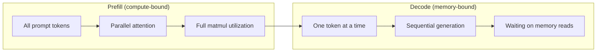
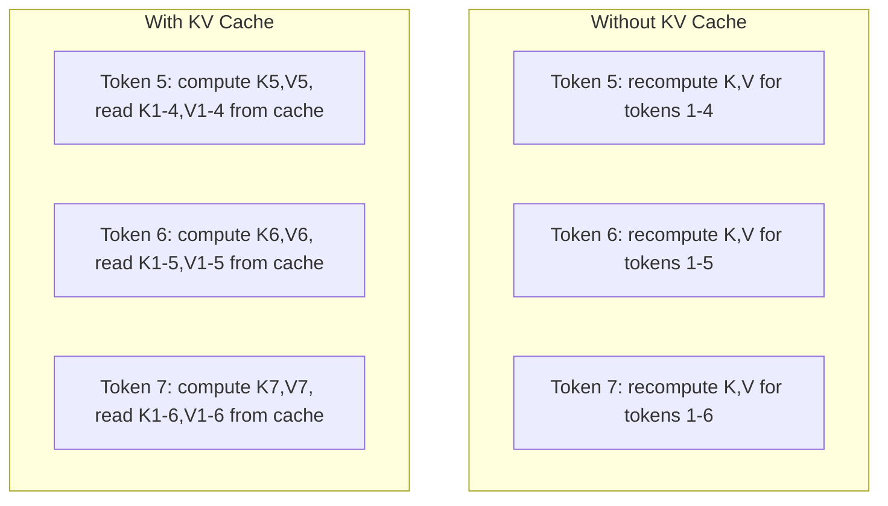
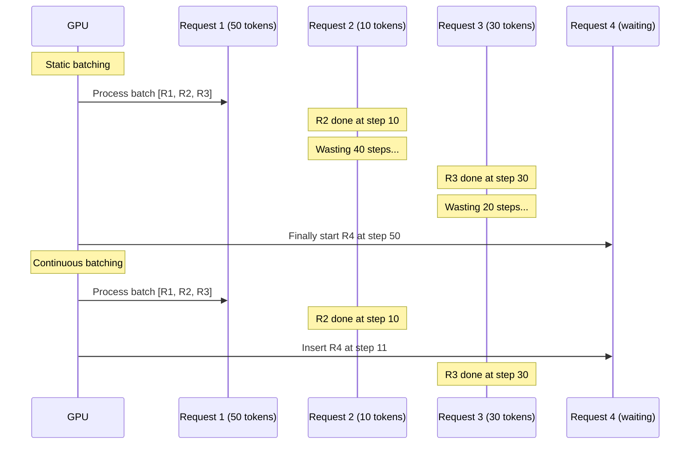
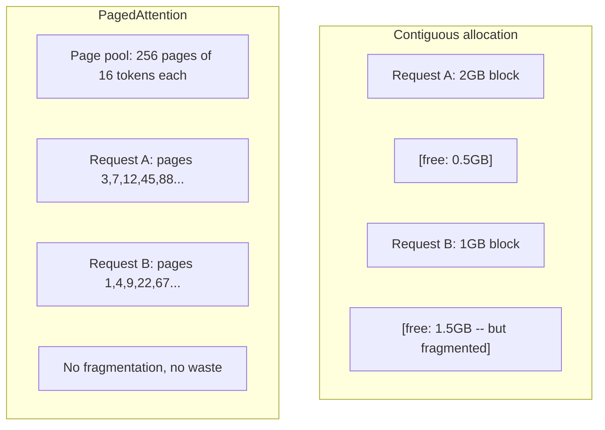
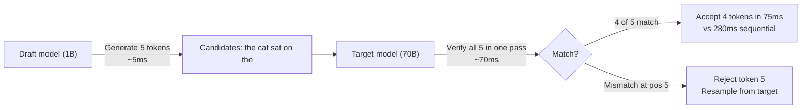

# İndirim 优化

> 两个阶段定义了LLM推:──Prefill 并行处理你的提示--计算-bound──Decode 一次生成一个代币--内存-bound──每个优化都针对其中一个或两个阶段──

**Type:** Build
**Languages:** Python
**Prerequisites:** Phase 10, Lessons 01-08 (Transformer architecture, attention)
**Time:** ~120 分钟

## Öğrenme hedefi

- 实现 KV-cache, auto-regressive Token 生成 sırasında reduküt hesaplama ortadan kaldırmak için
- LLM sonuçlarının önceden doldurulması ve çözülmesi aşamasını ve neden iki şeyin farklılıkları olduğunu açıklayın
- 实现持续 batching 和 PagedAttention 概念, 发发请求下最大化GPU kullanım oranı
- Birey 优化技术(KV-cache, spekülatör dekodlama, flaş dikkat) ve onun geçiş/kenareti 取舍

## 问题

4xA100 GPU'larda Llama 3 70B'yi dağıtmakla birlikte, tek kullanıcı saniyede yaklaşık 50 token alabiliyor.

Model kendisi 1 kullanıcı ile 100 kullanıcı arasında değişmedi. Aynı ağırlıklar, aynı mimarlık, aynı matematik. Aynı şekilde çalışmanın nasıl düzenlendiği değişmektedir. Basit bir sonuca varmak, kullanılabilir GPU hesaplamalarının %90'ını harcamayı gerektirir. Bir bekleme tokeni 47'nin kullanıcıları tüm parti yuvasını ele alacak.

Bu, ölçekleme değil  sorun. Bu, programlama  sorun. Bu ders içindeki teknikler KV önbelleği, sürekli serileme, PayedAtention, spekülasyonsal dekodlama, önbelleği önbelleği, aylık 25 bin dolarlık bir sonucu oluşturmak.

vLLM, 4xA100-80GB'de Llama 3 70B'ye hizmet ederken, düşük并发下'da yaklaşık 50 token/sekunde/kullanıcıya ulaşırken, sürekli bir serileme ve PagedAttention ile 100 个并发请求下维持15-25 TPS/kullanıcıya ulaşır.

## 概念

### Ön doldurma vs. çözme

Her LLM sonucu iki farklı aşama vardır.

**Prefill**Tüm giriş hızı işleme. Tüm tokenler bilinir, bu nedenle dikkat tam bir dizide yapılabilir. Bu büyük bir matris çarpımıdır. GPU çekirdekleri meşgul kalır.

**Decode**Bir kez bir çıkış belirti oluşturur. Her yeni belirti tüm önceki belirtilere katılır, ancak her kez ilerle sadece bir belirti oluşturur. Ağırlık matrislerinin boyutu ve doldurma sürecinde aynıdır, ancak matris değil tek bir vektörle onları kullanır.



**ops:byte ratio**(alışımlı olarak da adlandırılır) böyle bir işlem çizmiş.

```
ops:byte ratio = FLOPs per token / bytes read from memory
```

4.096 token'un bir seriyle önceden doldurulunca, her yükle bir ağırlık, yaklaşık 4.096 kez çarpma-tüklenme işlemleri yapar. Bu oran 很高 -- 你是计算的.

核心洞察:*decode is memory-bound, because you read the entire model only for generating one token*── aşağıdaki her optimization, ya da okuma içeriğini azaltmak, ya da her bir okuma işleminin işlenmesi için token seriyi artırmak, ya da tamamen okumaktan kaçınmak.

### KV Kayıt

Dikkatte, her token'in sorguları, önceki token'ın anahtarı ve değer vektörlerine katılacak. Kaşlama yok, oluşturma token N ı yeniden hesaplamak gerekir. N-1 ı token'ın anahtarı ve değer projeleri. Token 1 oluşturma token 2 projelendi, sonra token 3 tekrar tekrar, token 4 tekrar tekrar oluşturma token.

KV cache  depolama tüm önceki tokenlerin anahtarı ve değer projeleri── oluşturmak token N 时, sadece hesap token N'in anahtarı ve değer, sonra onları 1 ile N-1'in önbelleğe alınmış K/V 拼拼音起来──



**KV cache 的 memory 公式：**

```
KV cache size = 2 * num_layers * num_kv_heads * head_dim * seq_len * bytes_per_param
```

Llama 3 70B için 80 katman 、8 KV başı GQA、 başı_dim=128、BF16):

```
per token: 2 * 80 * 8 * 128 * 2 bytes = 327,680 bytes = 320 KB
at 4,096 tokens: 320 KB * 4,096 = 1.28 GB
at 128K tokens: 320 KB * 131,072 = 40 GB
```

Bir Llama 3 70B'nin 128K bağlamlı konuşması 40 GB KV kaydını tüketir -- 半张 A100'ün belleği──100 个并发用户、每人4K token 时,只 KV kaydını 128 GB gerekir──这就是为什么 KV kaydını yönetmek 优化的核心挑战──

### Sürekli Çöpçöleme

Statik partileşme, bir N 个请求的批次到来,将它们一起处理,并等等等等等等等等等等等等等等等等等等等等等等等等等等等等等等等等等等等等等等等等等等等等等等等等等等等等等等等等等等等等等等等等等等等等等等等等等等等等等等等等等等等等等等等等等等等等等等等等等等等等等等等等等等等等等等等等等等等等等等等等等等等等等等等等等等等等等等等等等等等等等等等等等等等等等等等等等等等等等等等等等等等等等等等等等等等等等等等等等等等等等等等等等等等等等等等等等等等等等等等等等等等等等等等等等等等等等等等等等等等等等等等等等等等等等等等等等等等等等等等等等等等等等等等等等等等等等等等等等等等等等等等等等等等等等等等等等等等等等等等等等等等等等等等等等等等等等等等等等等等等等等等等等等等等等等等等等等等等等等等等等等等等等等等等等等等等等等等等等等等等等等等等等等等等等等等等等等等等等等等等等等等等等等等等等等等等等等等等等等等等等等等等等等等等等等等等等等等等等等等等等等等等等等等等等等等等等等等等等等等等等等等等等等等等等等等等等等等等等等等等等等等等等等等等等等等等等等等等等等等等等等等等等等等等等等等等等等等等等等等等等等等等等等等

Sürekli serilişim (sırçlama seviyesinde serilişim de denir) herhangi bir istek tamamlandıktan sonra hemen yeni istek ekleyecektir. Her dekode adımı, bir tane daha seriliğe yeniden değerlendirecektir.



Çıktı 提升取决于输出长度的变化程度──长度一致时,持续批发与静态批发 相当──长度可变时,常见情况,持续批发, GPU yuvaları 永远不会空置── nedeniyle 2-5 倍更高的吞吐量提供可能.

### Sayfalarİzle

Her istek için KV cache bir parça bitişik bellektir. İstek ile ulaşmak ve ayrılmak, bellek bölünmesi - Operasyon sistemindeki RAM bölünmesi gibi. 4K-token bir istek için 1.28 GB bitişik gerekir.

PagedAttention( vLLM'den) OS tarzında sanal bellek KV kasesi için kullanılacak. Bu, her talebin bir bitişik bloğu tahsis etmesi için değil, sabit büyüklükte "sayfalar" dağıtılması için kullanılır.



PagedAttention ayrıca paylaşılan önlükleri destekler **copy-on-write**◊ Eğer 50 个请求共享 cùng một hệ thống提示, bu sistem prompt'ın KV önbelleği sayfaları yalnızca bir kez depolanır ve 50 个请求共同引用被存储, ◊ yalnızca bir 个请求分叉 (bkz. farklı kullanıcı mesajları) olduğunda, kendi sayfalarını elde eder.

vLLM  rapor, PagedAttention üzerinden neredeyse sıfır hafıza kaybı elde edilebilir, yaklaşık %4'lik, akılsızca tahsis ise yaklaşık %60-80'liktir.

### Tahmin edici Çözümleme

Çözümler yavaş yavaş, çünkü bir simge oluşturur, geri çevirir, bir sonraki simge olarak yeniden oluşturur. Ama eğer bir sonraki 5 simgeyi tahmin edersen, bir kez doğrulayabilir misin?

İstifadede bir küçük ve hızlı kodlama.**draft model**生成 K 个 aday simgeler。 büyük **target model**Daha sonra tek bir ileri geçiş sırasında tüm K 个 adaylarını işleyebilirsiniz. Bu, ön doldurma gibi görünüyor.



Hızlandırma 取決于**acceptance rate**-- taslak modelinin öngörü ve hedef 匹配的频率── Llama 3 8B Llama 3 70B ile taslak yaparken, doğal dillerde tipik kabul oranları %70-85%’dir── bu, 2-3 kat daha hızlı çözme hızına dönüşür.

Tahmin edici çözme üç yöntem:

| Method | Draft source | Acceptance rate | Overhead |
|--------|-------------|-----------------|----------|
| Draft-target (Leviathan et al.) | 独立小模型 | 70-85% | Draft model memory |
| EAGLE (Li et al.) | Target 上的轻量 head | 75-90% | ~1% extra parameters |
| N-gram lookup | Token n-gram table | 40-60% | 可忽略 |

**EAGLE**Hedef modelinin gizli durumlarında 之上训练一个小型autoregressive head──它使用目标模型的倒数第二层功能来预测下一个代币的嵌入──因为它操作的是目标模型的自身表示(而不是独立模型的),所以能以极极少的额外内存获得更高的接受率──EAGLE-2 增加了动态草案树,可根据背景调整候选人数──

**N-gram speculative decoding**维护来自当前文本或预构建 corpus'un n-gram devamları tabloları── eğer taslak 匹配相同对话中此前出现的内容(重复模式、代码、结构化输出), bu sıfır sinir ağının genel 触发──平均 kabul oranları daha düşüktür, ancak her spekülasyon maliyeti temel olarak sıfırdır──

Spekülatör çözme matematikte doğru bir* - 输出分布与目标模型的分布完全相同────────────────────────────────────────────────────────────────────────────────────────────────────────────────────────────────────────────────────────────────────────────────────────────────────────────────────────────────────────────────────────────────────────────────────────────────────────────────────────────────────────────────────────────────────────────────────────────────────────────────────────────────────────────────────────────────────────────────────────────────────────────────────────────────────────────────────────────────────────────────────────────────────────────────────────────────────────────────────────────────────────────────────────────────────────────────────────────────────────────────────────────────────────────────────────────────────────────────────────────────────────────────────────────────────────────────────────────────────────────────────────────────────────────────────────────────────────────────────────────────────────────

### Önbellek Kayıtlama

许多请求共享相同的预写――Chatbot sistem prompt──RAG bağlamı bloku──Few-shot example set──没有预写缓存时,每个请求都会从头重新计算这些共享代币的KV缓存──

Önbellek önbellekleme  depolama KV önbellekleri, ve istekler arasında tekrar kullanılır。 yeni istekler bilinen önbellekle birlikte varır.

Tüm istekler için 2000 token sistemini kullanmak için, önbelleği önbelleği önbelleği, her istek için 400 ms önbölümünü ortadan kaldıracak. 100 istek/sekunde zamanında, bu her saniyede 40 saniyelik GPU hesaplama tasarruf eder.

SGLang'ın RadixAttention kullanın radix ağacı(trie) başlık önbelleği önbelleği gerçekleştirmek, token içeriğine göre 索引 önbelleği。 herhangi bir uyumlu depolanan önbelleğin istekleri hepsi ücretsiz olarak KV önbelleği elde edilmelidir。 bu ağaç 支持部分 prefix matches--- Eğer bir önbelleğe girilen giriş ile 共享2000 个预写符号中1,500 个,就复用这1,500 个,只重新计算500 个──

### İndirim Motorları

Üç motor 主导 üretim LLM hizmet:

| Engine | Key innovation | Best for |
|--------|---------------|----------|
| vLLM | PagedAttention、continuous batching | 通用 serving、最高兼容性 |
| SGLang | RadixAttention（prefix caching）、structured generation | Multi-turn chatbots、constrained decoding |
| TensorRT-LLM | NVIDIA kernel fusion、FP8 quantization | NVIDIA hardware 上的最大 single-GPU throughput |

**vLLM**Yapılan işlemler, tüm GPU üreticileri tarafından desteklenir ve PagedAttention + sürekli batching üzerinden güçlü bir çıkış sağlanır. OpenAI uyumlu API'yi kullanmak için herhangi bir OpenAI API çağrısının bir alternatif olarak doğrudan bağlantı kurabilirsiniz.

**SGLang**建立在与vLLM 相同的基础之上,但增加了用于前置缓存的RadixAttention,以及用于结构化LLM programlarının etki alanı-spesifik dili──如果您的工作负载包含多转对话、工具使用或限制式解码(JSON输出、regex-guided generation),SGLang 往往能通过前置重复使用比vLLM 快 2-5 倍──

**TensorRT-LLM**将模型编译成优化NVIDIA GPU kernels──它融合操作(attention + linear + activation 在一个内核中), H100 GPUs 上使用FP8,并与NVIDIA Triton Inference Server 集成进行生产部署──它实现最高单GPU throughput,但设置更多,并且只适用于NVIDIA GPUs──

Llama 3 70B 的真实世界数字(4xA100-80GB,BF16):

| Metric | vLLM | SGLang | TensorRT-LLM |
|--------|------|--------|---------------|
| Throughput（1 user） | ~50 TPS | ~55 TPS | ~65 TPS |
| Throughput（100 users） | ~2,500 total TPS | ~3,200 total TPS | ~3,000 total TPS |
| Time to first token | ~400ms | ~300ms（prefix hit） | ~350ms |
| Max context | 128K | 128K | 128K |

### Ops:Byte 框架

Kendinizi ölçülmemiş bir şeyle optimize edemezsiniz. Ops:byte oranı size iş yükünün hesaplama ve hafıza bağlı olduğunu söyler. Bu da hangi optimizeyi gerçekten önemli belirler.

```
Compute roof: peak FLOPS of the GPU
Memory roof:  peak bandwidth * ops:byte ratio
```

Operasyonlar: byte 较低时(decode、小 batches), siz de touch touch touch touch memory bandwidth roof──增加更多计算(更高钟、更多核心) hiç yardımcı olmaması──你需要减少记忆读数(量子化、KV缓存压缩),或增加批量,将读分分到更多有用工作上──

Operasyonlar: byte 较高时(prefill、大批), siz bilgisayar çatısına değineceksiniz.

| Scenario | ops:byte | Bound | Optimize with |
|----------|----------|-------|---------------|
| Prefill, batch=1 | ~4,096 | Compute | Kernel fusion, FP8 |
| Decode, batch=1 | ~1 | Memory | Quantization, KV compression |
| Decode, batch=32 | ~32 | Memory | Larger batch, continuous batching |
| Decode, batch=256 | ~256 | Transitioning | 两者都重要 |
| Decode, batch=1024 | ~1,024 | Compute | Kernel fusion, tensor parallelism |

A100 上のクロスオーバーポイント 大約是 ops:byte = 156(312 TFLOPS / 2 TB/s) ⋅低于 156 时,你是内存束縛──高于 156 时,你是计算束縛──連続批量 通过每次回复 打包更多代币,将解码 推向这个跨越──


```figure
context-window-slide
```

## Yapın onu.

### 步骤 1: KV Cache'yi sıfırdan gerçekleştirmek

Bir çok başlı KV kasesi oluşturduk, katmanlara göre oluşturduk, başlıca depolama anahtarı ve değer projeleri, ve hafıza gösterdi büyüme modeli.

```python
import numpy as np

class KVCache:
    def __init__(self, num_layers, num_heads, head_dim, max_seq_len, dtype=np.float16):
        self.num_layers = num_layers
        self.num_heads = num_heads
        self.head_dim = head_dim
        self.max_seq_len = max_seq_len
        self.dtype = dtype

        self.k_cache = np.zeros(
            (num_layers, num_heads, max_seq_len, head_dim), dtype=dtype
        )
        self.v_cache = np.zeros(
            (num_layers, num_heads, max_seq_len, head_dim), dtype=dtype
        )
        self.seq_len = 0

    def update(self, layer_idx, new_keys, new_values):
        num_new = new_keys.shape[1]
        end = self.seq_len + num_new
        self.k_cache[layer_idx, :, self.seq_len:end, :] = new_keys
        self.v_cache[layer_idx, :, self.seq_len:end, :] = new_values
        return (
            self.k_cache[layer_idx, :, :end, :],
            self.v_cache[layer_idx, :, :end, :]
        )

    def advance(self, num_tokens):
        self.seq_len += num_tokens

    def memory_bytes(self):
        return self.k_cache.nbytes + self.v_cache.nbytes

    def used_bytes(self):
        per_token = 2 * self.num_layers * self.num_heads * self.head_dim * np.dtype(self.dtype).itemsize
        return per_token * self.seq_len
```

### 步骤 2: KV Cache kullanın Dikkat

Bir basitleştirilmiş çok başlı dikkat, KV kasesi kullanmak için dekode adımlarında.

```python
def scaled_dot_product_attention(query, keys, values):
    head_dim = query.shape[-1]
    scores = np.matmul(query, keys.transpose(0, 1, 3, 2)) / np.sqrt(head_dim)
    seq_len_q = scores.shape[-2]
    seq_len_k = scores.shape[-1]
    if seq_len_q > 1:
        mask = np.triu(np.ones((seq_len_q, seq_len_k), dtype=np.float32), k=seq_len_k - seq_len_q + 1)
        scores = scores + mask * (-1e9)
    max_scores = np.max(scores, axis=-1, keepdims=True)
    exp_scores = np.exp(scores - max_scores)
    attn_weights = exp_scores / np.sum(exp_scores, axis=-1, keepdims=True)
    return np.matmul(attn_weights, values)


class MultiHeadAttention:
    def __init__(self, d_model, num_heads):
        self.num_heads = num_heads
        self.head_dim = d_model // num_heads
        scale = np.sqrt(2.0 / d_model)
        self.W_q = np.random.randn(d_model, d_model).astype(np.float32) * scale
        self.W_k = np.random.randn(d_model, d_model).astype(np.float32) * scale
        self.W_v = np.random.randn(d_model, d_model).astype(np.float32) * scale
        self.W_o = np.random.randn(d_model, d_model).astype(np.float32) * scale

    def forward(self, x, kv_cache=None, layer_idx=0):
        batch, seq_len, d_model = x.shape
        Q = np.matmul(x, self.W_q).reshape(batch, seq_len, self.num_heads, self.head_dim).transpose(0, 2, 1, 3)
        K = np.matmul(x, self.W_k).reshape(batch, seq_len, self.num_heads, self.head_dim).transpose(0, 2, 1, 3)
        V = np.matmul(x, self.W_v).reshape(batch, seq_len, self.num_heads, self.head_dim).transpose(0, 2, 1, 3)

        if kv_cache is not None:
            K_full, V_full = kv_cache.update(layer_idx, K[0], V[0])
            K = K_full[np.newaxis, :, :, :]
            V = V_full[np.newaxis, :, :, :]
            if seq_len == 1:
                kv_cache.advance(1)

        attn_out = scaled_dot_product_attention(Q, K, V)
        attn_out = attn_out.transpose(0, 2, 1, 3).reshape(batch, -1, d_model)
        return np.matmul(attn_out, self.W_o)
```

### 步骤 3: Sürekli Batching 模拟器

O, statik partiyle sürekli parti arasındaki düzen farkına benziyor.

```python
import heapq

class Request:
    def __init__(self, request_id, prompt_tokens, output_tokens, arrival_step):
        self.request_id = request_id
        self.prompt_tokens = prompt_tokens
        self.output_tokens = output_tokens
        self.arrival_step = arrival_step
        self.tokens_generated = 0
        self.start_step = None
        self.end_step = None

    def is_done(self):
        return self.tokens_generated >= self.output_tokens


def simulate_static_batching(requests, batch_size):
    step = 0
    completed = []
    queue = list(requests)
    queue.sort(key=lambda r: r.arrival_step)

    while queue:
        batch = []
        while queue and len(batch) < batch_size:
            r = queue.pop(0)
            r.start_step = max(step, r.arrival_step)
            batch.append(r)

        if batch:
            step = max(step, max(r.start_step for r in batch))
            max_output = max(r.output_tokens for r in batch)
            for r in batch:
                r.tokens_generated = r.output_tokens
                r.end_step = step + max_output
            step += max_output
            completed.extend(batch)

    return completed


def simulate_continuous_batching(requests, batch_size):
    step = 0
    completed = []
    queue = sorted(requests, key=lambda r: r.arrival_step)
    queue_idx = 0
    active = []
    waiting = []

    while queue_idx < len(queue) or active or waiting:
        while queue_idx < len(queue) and queue[queue_idx].arrival_step <= step:
            waiting.append(queue[queue_idx])
            queue_idx += 1

        while waiting and len(active) < batch_size:
            r = waiting.pop(0)
            r.start_step = step
            active.append(r)

        if not active:
            if waiting:
                step += 1
                continue
            elif queue_idx < len(queue):
                step = queue[queue_idx].arrival_step
                continue
            else:
                break

        for r in active:
            r.tokens_generated += 1

        done = [r for r in active if r.is_done()]
        for r in done:
            r.end_step = step + 1
            completed.append(r)
        active = [r for r in active if not r.is_done()]

        step += 1

    return completed


def batching_stats(completed):
    latencies = [r.end_step - r.arrival_step for r in completed]
    total_time = max(r.end_step for r in completed) - min(r.arrival_step for r in completed)
    total_tokens = sum(r.output_tokens for r in completed)
    return {
        "avg_latency": np.mean(latencies),
        "p50_latency": np.median(latencies),
        "p99_latency": np.percentile(latencies, 99),
        "total_time": total_time,
        "throughput": total_tokens / total_time if total_time > 0 else 0,
    }
```

### 步骤 4: Önbelleği Kaynak

Bir tri tabanlı prefix cache, paylaşılan prefixes KV girişleri depolamak için kullanılır。

```python
class TrieNode:
    def __init__(self):
        self.children = {}
        self.kv_data = None
        self.hit_count = 0


class PrefixCache:
    def __init__(self, max_entries=1000):
        self.root = TrieNode()
        self.max_entries = max_entries
        self.total_entries = 0
        self.hits = 0
        self.misses = 0

    def _walk(self, token_ids):
        node = self.root
        depth = 0
        for tid in token_ids:
            if tid not in node.children:
                break
            node = node.children[tid]
            depth += 1
        return node, depth

    def lookup(self, token_ids):
        node, depth = self._walk(token_ids)
        if depth > 0:
            self.hits += 1
            current = self.root
            for tid in token_ids[:depth]:
                current = current.children[tid]
                current.hit_count += 1
            kv_entries = []
            current = self.root
            for tid in token_ids[:depth]:
                current = current.children[tid]
                if current.kv_data is not None:
                    kv_entries.append(current.kv_data)
            return depth, kv_entries
        self.misses += 1
        return 0, []

    def insert(self, token_ids, kv_per_token):
        node = self.root
        for i, tid in enumerate(token_ids):
            if tid not in node.children:
                if self.total_entries >= self.max_entries:
                    return i
                node.children[tid] = TrieNode()
                self.total_entries += 1
            node = node.children[tid]
            if i < len(kv_per_token):
                node.kv_data = kv_per_token[i]
        return len(token_ids)

    def hit_rate(self):
        total = self.hits + self.misses
        return self.hits / total if total > 0 else 0.0
```

### 步骤 5: Speküel Çözümleme 模拟器

Biz de ayarlanabilir kabul oranları kullanarak proje-hedef spekülatif çözümü oluşturduk.

```python
class DraftModel:
    def __init__(self, vocab_size, acceptance_rate=0.8):
        self.vocab_size = vocab_size
        self.acceptance_rate = acceptance_rate

    def generate(self, context, num_tokens):
        tokens = np.random.randint(0, self.vocab_size, size=num_tokens)
        return tokens

    def get_probs(self, context, token):
        probs = np.random.dirichlet(np.ones(self.vocab_size))
        return probs


class TargetModel:
    def __init__(self, vocab_size):
        self.vocab_size = vocab_size

    def get_probs(self, context, tokens=None):
        if tokens is not None:
            return [np.random.dirichlet(np.ones(self.vocab_size)) for _ in tokens]
        return np.random.dirichlet(np.ones(self.vocab_size))


def speculative_decode(draft_model, target_model, context, num_speculative=5,
                       draft_cost=1.0, target_cost=10.0, verify_cost=12.0):
    total_tokens = 0
    total_cost = 0.0
    accepted_counts = []
    context = list(context)

    max_tokens = 100

    while total_tokens < max_tokens:
        draft_tokens = draft_model.generate(context, num_speculative)
        total_cost += draft_cost * num_speculative

        target_probs = target_model.get_probs(context, draft_tokens)
        total_cost += verify_cost

        accepted = 0
        for i, token in enumerate(draft_tokens):
            draft_p = draft_model.get_probs(context + list(draft_tokens[:i]), token)
            target_p = target_probs[i]

            r = np.random.random()
            acceptance_prob = min(1.0, target_p[token] / (draft_p[token] + 1e-10))

            if r < draft_model.acceptance_rate:
                accepted += 1
                context.append(token)
                total_tokens += 1
            else:
                new_token = np.random.choice(draft_model.vocab_size, p=target_p)
                context.append(new_token)
                total_tokens += 1
                break

        accepted_counts.append(accepted)

        if accepted == num_speculative:
            bonus_probs = target_model.get_probs(context)
            bonus_token = np.random.choice(draft_model.vocab_size, p=bonus_probs)
            context.append(bonus_token)
            total_tokens += 1

    sequential_cost = total_tokens * target_cost
    return {
        "total_tokens": total_tokens,
        "speculative_cost": total_cost,
        "sequential_cost": sequential_cost,
        "speedup": sequential_cost / total_cost if total_cost > 0 else 1.0,
        "avg_accepted": np.mean(accepted_counts),
        "acceptance_rate": np.mean(accepted_counts) / num_speculative,
    }


def compare_speculation_strategies(vocab_size=1000, num_trials=20):
    results = {}

    for name, acceptance_rate, spec_tokens in [
        ("Draft-target (8B->70B)", 0.78, 5),
        ("EAGLE", 0.85, 6),
        ("N-gram", 0.50, 4),
        ("No speculation", 0.0, 0),
    ]:
        if spec_tokens == 0:
            results[name] = {
                "speedup": 1.0,
                "acceptance_rate": 0.0,
                "avg_accepted": 0.0,
            }
            continue

        trial_results = []
        for _ in range(num_trials):
            draft = DraftModel(vocab_size, acceptance_rate=acceptance_rate)
            target = TargetModel(vocab_size)
            context = list(np.random.randint(0, vocab_size, size=10))
            result = speculative_decode(draft, target, context, num_speculative=spec_tokens)
            trial_results.append(result)

        results[name] = {
            "speedup": np.mean([r["speedup"] for r in trial_results]),
            "acceptance_rate": np.mean([r["acceptance_rate"] for r in trial_results]),
            "avg_accepted": np.mean([r["avg_accepted"] for r in trial_results]),
        }

    return results
```

### 步骤 6: KV Cache hafıza profileri

计算真实模型配置的 KV缓存 bellek gereksinimleri。

```python
MODEL_CONFIGS = {
    "Llama-3-8B": {
        "num_layers": 32, "num_kv_heads": 8, "head_dim": 128,
        "model_params_b": 8, "gqa": True,
    },
    "Llama-3-70B": {
        "num_layers": 80, "num_kv_heads": 8, "head_dim": 128,
        "model_params_b": 70, "gqa": True,
    },
    "Llama-3-405B": {
        "num_layers": 126, "num_kv_heads": 8, "head_dim": 128,
        "model_params_b": 405, "gqa": True,
    },
    "Mistral-7B": {
        "num_layers": 32, "num_kv_heads": 8, "head_dim": 128,
        "model_params_b": 7, "gqa": True,
    },
    "GPT-4-est": {
        "num_layers": 120, "num_kv_heads": 96, "head_dim": 128,
        "model_params_b": 1800, "gqa": False,
    },
}


def kv_cache_memory(config, seq_len, dtype_bytes=2):
    per_token = 2 * config["num_layers"] * config["num_kv_heads"] * config["head_dim"] * dtype_bytes
    total = per_token * seq_len
    return {
        "per_token_bytes": per_token,
        "per_token_kb": per_token / 1024,
        "total_bytes": total,
        "total_mb": total / (1024 ** 2),
        "total_gb": total / (1024 ** 3),
    }


def memory_budget(config, gpu_memory_gb, model_dtype_bytes=2, kv_dtype_bytes=2):
    model_memory_gb = config["model_params_b"] * 1e9 * model_dtype_bytes / (1024 ** 3)
    overhead_gb = gpu_memory_gb * 0.1
    available_for_kv = gpu_memory_gb - model_memory_gb - overhead_gb

    if available_for_kv <= 0:
        return {"error": "Model does not fit in GPU memory", "model_memory_gb": model_memory_gb}

    per_token = 2 * config["num_layers"] * config["num_kv_heads"] * config["head_dim"] * kv_dtype_bytes
    max_tokens = int(available_for_kv * (1024 ** 3) / per_token)

    return {
        "gpu_memory_gb": gpu_memory_gb,
        "model_memory_gb": round(model_memory_gb, 1),
        "overhead_gb": round(overhead_gb, 1),
        "available_for_kv_gb": round(available_for_kv, 1),
        "max_total_tokens": max_tokens,
        "max_users_at_2k": max_tokens // 2048,
        "max_users_at_4k": max_tokens // 4096,
        "max_users_at_32k": max_tokens // 32768,
    }
```

## Kullan

VLLM kullan:

```python
from vllm import LLM, SamplingParams

llm = LLM(
    model="meta-llama/Llama-3-70B-Instruct",
    tensor_parallel_size=4,
    enable_prefix_caching=True,
    max_model_len=8192,
    gpu_memory_utilization=0.9,
)

params = SamplingParams(temperature=0.7, max_tokens=256)
outputs = llm.generate(["Explain inference optimization in one paragraph."], params)
```

SGLang kullanmak için önbellekleme + yapılandırılmış çıkış:

```python
import sglang as sgl

@sgl.function
def classify(s, text):
    s += sgl.system("You are a classifier. Output JSON only.")
    s += sgl.user(f"Classify this text: {text}")
    s += sgl.assistant(sgl.gen("result", regex=r'\{"label": "(positive|negative|neutral)"\}'))

runtime = sgl.Runtime(model_path="meta-llama/Llama-3-70B-Instruct", tp_size=4)
sgl.set_default_backend(runtime)

results = classify.run_batch([
    {"text": "This product is amazing!"},
    {"text": "Terrible experience."},
    {"text": "It was okay I guess."},
])
```

TensorRT-LLM kullan:

```python
import tensorrt_llm
from tensorrt_llm.runtime import ModelRunner

runner = ModelRunner.from_dir("./llama-70b-trt-engine/", rank=0)

outputs = runner.generate(
    batch_input_ids=[tokenizer.encode("Explain KV caching.")],
    max_new_tokens=256,
    temperature=0.7,
)
```

## - Söyle.

本课产 出:
- `outputs/skill-inference-optimization.md`-- bir tanı ve optimize LLM sonuç hizmet vermesi için bir beceri

## 练习

1.  Modify KV cache profile, compare FP16 vs FP8 vs INT4 KV cache quantization。 4K bağlamı için aşağıdaki Llama 3 70B, hesaplama her türlü ayar 4xA100-80GB'da en fazla 并发 kullanıcı sayısı。 KV quantization INT4  yaklaşık olarak kullanıcı kapasitesini 4 kat artırmak gerekir。

2. 模拟器,以跟踪GPU utilization(每步被填满的批发槽比如) 对静态和连续批发 分别绘制利用时间,其中 50 个请求的输出长度服从Pareto分布(形=1.5,规模=20) Seperiymiş批发 应保持>80%利用──

3. 实现 a grouped-query attention(GQA) versiyonunun KV önbelleği, bunlardan `num_kv_heads < num_query_heads`◊ Llama 3 70B 64 sorgu başlığı kullanıyor, ancak sadece 8 KV başlığı kullanıyor.

4. 构建一个使用 LRU驱逐的预写缓存──将 max_entries 设置为500,并生成 1,000 个请求,其中60% 共享 5 个共同预写之一──测量击率 并与无限缓存比较──使用良好的驱逐时,击率应保持在 55% 以上──

5. 扩展投机解码 模拟器,实现树基投机(EAGLE-2 风格) ――单条 K 个草案代币的链,而是生成候选人树(例如每3层各 2个分枝 = 8 个叶候选人) ――比较每验证轮 接受的全部代币与线性投机的差异──

## 关键术语

| Term | 人们怎么说 | 它实际意味着什么 |
|------|----------------|----------------------|
| Prefill | "Processing the prompt" | 在所有输入 tokens 上并行计算 attention -- compute-bound，因为完整 matrix multiplication 会让 GPU cores 保持忙碌 |
| Decode | "Generating tokens" | 每次 forward pass 产生一个 token，每次都读取完整 model weights -- memory-bound，因为 compute 会在下一批 weights 到达前完成 |
| KV cache | "Caching attention states" | 存储所有 previous tokens 的 key 和 value projections，使它们不会在每个 decode step 被重新计算 -- 用 memory 换 compute |
| Continuous batching | "Dynamic batching" | 在任何请求完成后立即将新请求插入 running batch，每个 decode iteration 都进行评估，而不是等待整个 batch |
| PagedAttention | "Virtual memory for KV cache" | 用固定大小 pages 而不是 contiguous blocks 分配 KV cache，消除 memory fragmentation，并为 shared prefixes 启用 copy-on-write |
| Speculative decoding | "Draft and verify" | 使用快速 draft model 提出多个 tokens，然后在一次 target model forward pass 中全部验证 -- 数学上精确，2-3 倍 speedup |
| EAGLE | "Self-speculative decoding" | 一种 speculative decoding 变体，在 target model 自身的 hidden states 上训练 lightweight head，相比独立 draft model 获得更高 acceptance rates |
| Prefix caching | "Reusing system prompt KV" | 为 common prefixes（system prompts、few-shot examples）存储已计算的 KV cache entries，并跨请求复用它们以跳过冗余 prefill |
| Ops:byte ratio | "Arithmetic intensity" | Compute operations 与读取的 memory bytes 之比 -- 决定 workload 是 compute-bound（高 ratio）还是 memory-bound（低 ratio） |
| Time to first token | "TTFT" | 从接收请求到产生第一个输出 token 的延迟 -- 对于长 prompts，主要由 prefill time 主导 |

## 延伸阅读

- Kwon et al., "PageedAttention ile Hizmet Eten Büyük Dil Modelleri için Etkili Hatırlama Yönetimi" (2023) -- 介绍 paged KV cache yönetimi vLLM 论文,如今它已成为推断服务的行业标准
- Leviathan et al., "Speculative Decoding via Fast Inference from Transformers" (2023) -- temel kağıt, prov draft-verify spekülasyonu 2-3 kat hızlandırma gerçekleştirmek sırasında, kesin hedef model dağıtımları meydana gelecek
- Li et al., "EAGLE: Speküel Örnekleme Karakteristik belirsizlikleri yeniden düşünmeyi gerektirir" (2024) -- 通過在目標モデル 自身機能 上訓練頭,而不是使用独立草案模型,获得更高接受率
- Zheng et al., "SGLang: Structured Language Model Programs'ın Verimli İcra Etimi" (2024) -- 介绍 RadixAttention'ın önbellek önbelleği önbelleği önbelleği önbelleği için kullanılması, ayrıca çok çağrılı LLM programlarının programlama modeli için kullanılması
- Williams et al., "Roofline: Multicore Arsitektürler için An insightful Visual Performance Model" (2009) -- orijinal çatı çizgi kağıdı, formalisasyon için kullanıldı hesaplama vs bellek şişek boynuzları
