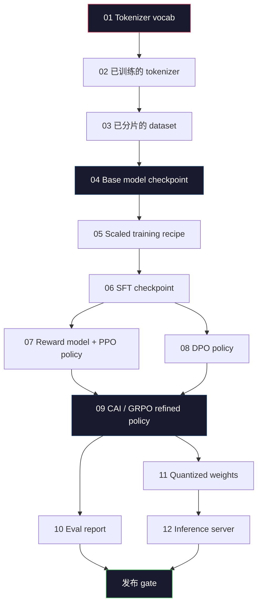
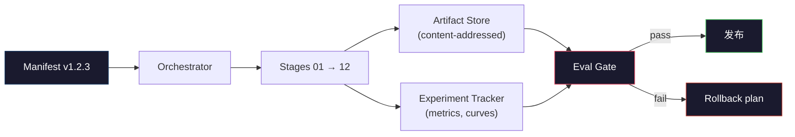

# Complete LLM Pipeline inşa edilmesi

> Ders 01-12'nin tüm içeriği aynı boru hattının bir aşamasıdır. Bu aşamaları bir sonundan birine dönüştürmek için bir basamak: tokenize, pre-train, ölçek, SFT, align, evaluate, quantize, serve.

**Type:** Build
**Languages:** Python (stdlib)
**Prerequisites:** All Phase 10 lessons 01-12
**Time:** ~120 minutes

## Öğrenme hedefi
- 将前十一课(tokenizer、data、pre-training、scaling、SFT、RLHF、DPO、CAI、eval、quantization、inference)
-  define varlık sözleşmesi: her aşamada ne tüketilir, ne üretilir ve bir sonraki aşamada nasıl verified input
- Construct a orchestrator, to track experiments ∼ artefacts  perform hash,并 evalu thresholds based decide whether to pass the release gate
- Design rollback planı: hangi eserlerin yeniden kullanımı düşük, hangi maliyet yüksek ve bir bozukluk kontrol noktası ne bedeli getirecek

## 问题
Önceki dersler Önceki dersler Önceki dersler Özgür çalışmaları Yapıldı Tokenizer Trained完成。Tiny GPT Trained pre-training。SFT veri kümesi 组装。Reward model Trained。DPO 运行。Evals 量化量量量量量量量量量量量量量量量量量量量量量量量量量量量量量量量量量量量量量量量量量量量量量量量量量量量量量量量量量量量量量量量量量量量量量量量量量量量量量量量量量量量量量量量量量量量量量量量量量量量量量量量量量量量量量量量量量量量量量量量量量量量量量量量量量量量量量量量量量量量量量量量量量量量量量量量量量量量量量量量量量量量量量量量量量量量量量量量量量量量量量量量量量量量量量量量量量量量量量量量量量量量量量量量量量量量量量量量量量量量量量量量量量量量量量量量量量量量量量量量量量量量量量量量量量量量量量量量量量量量量量量量量量量量量量量量量量量量量量量量量量量量量量量量量量量量量量量量量量量量量量量量量量量量量量量量量量量量量量量量量量量量量量量量量量量量量量量量量量量量量量量量量量量量量量量量量量量量量量量量量量量量量量量量量量量量量量量量量量量量量量量量量量量量量量量量量量量量量量量量量量量量量量量量量量量量量量量量量量量量量量量量量量量量量量量量量量量量量

Sınır eğitim süresi Notbook değil。Llama 3 405B yaklaşık 30 milyon H100 saat, yaklaşık 54 天。DeepSeek-V3 yaklaşık 2.8 milyon H800 saat kullanmıştır。 Bu süre içinde, bir bozukluk kontrol noktası、 bir veri kirliliği、 bir değerlendirme geri dönüşü, tüm olasılıkları takım kaybı bir hafta duvar saatı ve bir ay GPU bütçesi için kullanılmıştır。 takım boru hattı hijyenine dayanarak hayata kavuşturulur: her aşamada kesin bir giriş, kesin bir çıkış, belirlenmiş bir çıkış, belirlenmiş bir hat ve kapı vardır。

Bu son taşı. Bütün boru hattını bir bilgisayarın üstünden diğerine kadar çalıştırmayacaksın. Bu işlemin açıklaması, çıkış kapısının doğrulanmasını belirleyen bir düzenleyici yazacaksın.

Bu model 100M'den 1T'ye kadar değişmez. Aynı dört bileşen - manifesto, orkestratör, ev kapısı, eser mağazası - zaten Llama 3'yi çalıştırabilir, ayrıca geri kalan GPT'lerinizi çalıştırabilir.

## 概念
### On İki Adım

Her bölüm 10 aşama  dersler bir aşama ∞ aşağıdaki tamamen bağımlılık grafiği ∞



阶段 07 和 08 可以并行运行──其他所有阶段都是硬依赖──阶段 02(tokenizer) 变化将使所有下游文物失效──阶段 10(eval) 变化将使发行决策失效──

### Açıklama

manifest tek bir dosyadır, bir seferinde çalışmanın açıklaması tekrarlanmak için tamamlanmalıdır.

```
pipeline_version: 1.2.3
seed: 42
git_commit: a1b2c3d4
stages:
  01_tokenizer:
    recipe: bpe_32k
    input_hash: sha256:...
    output_hash: sha256:...
    wall_clock_sec: 3600
    cost_usd: 12
```

阶段 N'in çıkış haşi, 阶段 N+1'in giriş haşi, herhangi bir ayrım olursa, boru durdurulur. Bu, veri bozukluğunu en erken zamanda fark ettiğin bir yol.

實踐中,團隊會使用一小小的YAML schema,加上一個明示表檢查器,用于和上一次成功运行做不同──任何出现在预期字段 (((成本、壁鐘) 之外的 delta 都是红旗──

### Sanatlı Tipleme

Her aşama çıkışı bir katalog blob değil, bir çürük değil, bilinen bir şema ile adlandırma tipiyle yazılmış bir eser.

| Stage | Artifact Type | Key Fields |
|-------|--------------|-----------|
| 01-02 | Tokenizer | vocab.json, merges.txt, config.json, hash |
| 03 | Dataset | shards[], row count, token count, dedup stats |
| 04-05 | Checkpoint | weights.safetensors, config.json, optimizer state, step count |
| 06 | SFT Model | checkpoint + SFT recipe + data mix |
| 07 | Reward Model | RM checkpoint + preference data hash |
| 08-09 | Policy | checkpoint + reference hash + beta + KL budget consumed |
| 10 | Eval Report | benchmark scores + regression diffs + eval data hash |
| 11 | Quantized Model | quantized weights + calibration data + accuracy delta vs FP16 |
| 12 | Server Spec | endpoint + model hash + config + observability hooks |

Tipleme en yaygın başarısızlık modunu önleyebilir: ⇒ SATHATHATHATHATHATHATHATHATHATHATHATHATHATHATHATHATHATHATHATHATHATHATHATHATHATHATHATHATHATHATHATHATHATHATHATHATHATHATHATHATHATHATHATHATHATHATHATHATHATHATHATHATHATHATHATHATHATHATHATHATHATHATHATHATHATHATHATHATHATHATHATHATHATHATHATHATHATHATHATHATHATHATHATHATHATHATHATHATHATHATHATHATHATHATHATHATHATHATHATHATHATHATHATHATHATHATHATHATHATHATHATHATHATHATHATHATHATHATHATHATHATHATHATHATHATHATHATHATHATHATHATHATHATHATHATHATHATHATHATHATHATHATHATHATHATHATHATHATHATHATHATHATHATHATHATHATHATHATHATHATHATHATHATHATHATHATHATHATHATHATHATHATHATHATHATHATHATHATHATHATHATHATHATHATHATHATHATHATHATHATHATHATHATHATHATHATHATHATHATHATHATHATHATHATHATHATHATHATHATHATHATHATHATHATHATHATHATHATHATHATHATHATHATHATHATHATHATHATHATHATHATHATHATHATHATHATHATHATHATHATHATHATHATHATHATHATH

### Eval Kapısı

发布不是培训完成──发布是培训完成和 eval gate passed── gate 在运行开始前就定义好──

```
gates:
  mmlu:      >= baseline + 0.5   # 无 regression
  humaneval: >= baseline + 1.0
  truthfulqa: >= baseline         # 无下降
  safety_refusal_rate: <= 0.05
  kl_from_reference: <= 25.0
  cost_total_usd: <= 50000
```

Her kapı sayısal bir eşiğidir. Hiç bir kapı yok. Başlangıçlı bir işaret yok. Eğer tüm kapılar geçerse, eser gönderilebilir olarak işaretlenecek. Eğer herhangi bir kapı başarısız olursa, bu işlem devam edecek.

两个门 能抓住大多数灾难──*Regression* gate(新模型在核心基准上必须至少和之前一样好) 能抓住培训 bugs──*KL bütçe* gate(aligned policy 偏离参照程度不能超过 X) 能抓住alignment 过度加工──每个生产管道都同时拥有这两者──

### Orkestratör

Bu bir kod parçası, açıklama aşamalarını, gönderme aşamalarını, eserleri takip ederek herhangi bir sözleşme ihlalinden sonra durdurulması. Bu Hava akışı değil. Bu Kubeflow değil.

Orkestratör'ün görevi çok kısıtlı:

1. Manifest'ten 解析 DAG──
2. Her aşamada, kontrol beklenmiş çıkışın doğru bir şekilde var olup olmadığını kontrol ederek 
3. 运行该阶段,捕获 stdout/stderr,测量墙钟和成本──
4. 根据下游阶段预期的输入哈希 验证输出哈希──
5. 失败时,写入包含精确失败阶段的部分宣言,并以非零状态退出──

Bu yaklaşık 200 Python. Bu dersdeki gibi görünüyor.`code/main.py`文件──底层真实管道 会使用 `torchrun`Ya da`ray`Gruplardaki her aşamaları gerçekleştirirken orkeströr kendiliğinden tek bir makine üzerinde çalışır.

### Deneyim Takip ve Sanatlı Sanatlı Depolama

İki dış sistemle boru hattı.

**Experiment tracker (wandb, neptune, mlflow).**阶段记录 loss curves、eval metrics、system telemetry──当你三周后需要比较运行 A 和运行 B 时,tracker就是你查看的地方──团队几乎总是使用主机追踪器──自写会浪费本应用于训练时间──

**Artifact store (S3, R2, GCS).**Kontrol noktaları, veri kümeleri, tokenizerler, ev raporlarının değişmez nesne depolamaları için kullanılır.`latest.pt`Bu tür dosya adı ayak tabancası;`ckpt-7b-step-20000-sha256:abc123.safetensors`Sadece bir sözleşme.

Orkestör 会同时写入二者──Tracker 面向看图的人──Artifact store 面向需要查找输入的下一个阶段──

### Maliyet

Sınırcılık bir dolar numarasıyla bağlanmıştır.

**Pre-run estimate.**Manifest  hesaplama beklenen FLOPs ((pre-training:6 x params x tokens) 、 beklenen GPU saatleri(FLOPs / peak throughput / utilization), ve şimdiki kira oranı  hesaplama dolar maliyeti。 Eğer tahmin 予算 kapısından fazla ise, boru hattı açılmayı reddeder。

**In-run tracking.**阶段的壁钟和成本会记录到表――每个阶段之后,都会检查剩余预算――如果某阶段超支,下阶段的门将使用新的剩余预算――进行评估――你不会等到VC 打电话时才发现钱已经用完了――

Llama 3  rapor maliyeti $61M。DeepSeek-V3 报告 main pre-training run 为 $5.6M. Bu oran esas olarak donanım verimliliğinden ve uzmanların karışımından kaynaklanıyor. Ancak özel maliyetler, iki takımın sadece tüm sürenin ardından değil, aşama göre takip etmesinden kaynaklanıyor.

### Tekrarlanılabilirlik vs. Determinizm

İkinci farklılık: * Tekrarlanabilir* aynı manifest, aynı kod ve aynı altyapı anlamına gelir, aşağı akım metriklerinde bir kontrol noktası oluşur.

现代 LLM eğitiminin yeniden üretilebilir, ancak belirginli değil. Yayınlanmış eğitimin azaltma düzenini、 GPU çekirdeği belirsizliği(cuBLAS、flash-attn) ve karışık hassaslık yuvarlaması, 1e-5 量级 farklı yüzeyleri arasında birlikte oluşan bir çalışma yapar.



### Rollback Planı

İşlem başlamadan önce, her aşamada başarısız olduğunda neler olacağını yazın.

- **重新运行成本低**(saatler):tokenizer、eval、quantisation、inference server──直接重新运行──
- **中等成本**(günler):SFT、DPO、CAI。 temel modelini korumak; sadece yeniden çalıştırmak için uyum aşamaları。
- **成本高**(haftalar ve milyonlarca dolar):Önce eğitim. Bu planın geri dönüşü, son iyi kontrol noktasını kullanmak yerine, son günleri de kullanmakla kalmış.

Oranın bağımlılıkları tipize edilince ve hashed olduğundan, orkeströr otomatik olarak rollback setini hesaplayabilir: make failure阶段 ve tüm soyları 失效──阶段 06(SFT) failure will make 06、07、08、09、10、11、12 失效──阶段 11(quantization) failure will only make 11 和 12 失效──提前命名这些内容,能避免团队在凌晨4点精疲力尽时临场即兴表演──

### 2026 yıl gözlemlenmiş üretim tarifi

Çoğu sınır takımları aynı kemikleri bulmuştur.

- Tokenizer:128k BPE byte fallback── small 均衡 基于小型、平衡的多语言切片 训练──
- Ön eğitim:10-20T tokenleri, esas olarak web 加 kodu 加 sentez 组成──Muon veya AdamW optimizer──FSDP2 veya DeepSpeed ZeRO-3──Gradient kontrol noktası──BF16 ağırlıkları,FP32 ustası──
- SFT:500k-2M talimat çiftleri, mixte insan 和 sintetik,并严格对 eval set做 dedup──
- DPO veya CAI + GRPO için sadece RLHF kullanmak için DPO için tercih sinyali kullanılır.
- Eval:MMLU-Pro、MATH、HumanEval+、GPQA、SWE-Bench Verified、LiveBench,加上一个公共
- Kvantisa:serving 使用 4-bit GPTQ veya AWQ; doğruluk deltası  önemli güvenlik değerlendirmeleri 使用 8-bit。
- Servis: vLLM、TensorRT-LLM veya iç içi──Sıradan serilişim──Spekülatör çözme──KV önbelleği çıkarımı──

Sayılar her altı ayda değişir.


```figure
beam-search
```

## Yapın onu.
Bu ders kodu, 12 eğitim senaryoları yerine orkeströr ve manifesto kontrolcüsüdür. Her aşamada bir yer tutucu kullanılır.

完整实现见 `code/main.py`❖ Key bölüm:

- `Manifest`veri sınıfı:pipeline versiyonu、seed、git commit、stages、gates。
- `Stage`veri sınıfı:name、type、inputs(hashes)、output(hash)、wall clock、cost。
- `Orchestrator.run()`:解析 DAG、dispatch stages、验证 hashes、更新 manifest。
- `EvalGate.check()`:读取门,与最新评估报告比较,返回通过/失败――
- `ArtifactStore`(memory stub): hash put/get,模拟 S3。
- `CostTracker`: aşama aşama ve toplam maliyet, sınırdan fazla 时停止──

`main.py`Orta boru, 12 yer tutma aşamasını yürütür, bir manifesto oluşturur ve başarısız bir değerleme kapısı gösterir.

## Kullan
Kanonik iş akışı üç emir vardır.

```
python code/main.py plan    # 验证 manifest，计算 cost estimate，打印 DAG
python code/main.py run     # 执行 stages，写入 manifest.out.yaml
python code/main.py gate    # 读取 manifest.out.yaml，应用 eval gates，ship-or-hold
```

Her seferinde.`plan`◊ Çoğu boru hattı hataları 会在计划时间 出现 -- 缺失门门、固定的哈希es、预算过剩──运行`plan`- Evet.`run`Çok pahalı. Ödeme yapmak için ucuz bir şekilde böcekleri yakalamak.

`gate`Çıkışın ne olması gerekiyor?`SHIP`- Evet .`HOLD: <reason>`❖ Held run 不是 failure; it is a decision point────────────────────────────────────────────────────────────────────────────────────────────────────────────────────────────────────────────────────────────────────────────────────────────────────────────────────────────────────────────────────────────────────────────────────────────────────────────────────────────────────────────────────────────────────────────────────────────────────────────────────────────────────────────────────────────────────────────────────────────────────────────────────────────────────────────────────────────────────────────────────────────────────────────────────────────────────────────────────────────────────────────────────────────────────────────────────────────────────────────────────────────────────────────────────────────────────────────────────────────────────────────────────────────────────────────────────────────────────────────────────────────────────────────────────────────────────────────────────────────────────────────────────────────────

## - Söyle.
本课会产 出 `outputs/skill-llm-pipeline-reviewer.md` Önerilen bir boru hattı manifesti  ona verirsek, tüm sözleşmeleri kontrol eder: aşama yazımı, has zinciri, kapılar, geri dönüş planı, maliyet tahminleri.

## 练习
1. 扩展 orkestrator,让它支持阶段 07 和 08 的并行执行──使用 stdlib `concurrent.futures`Modül:  Konkreti final manifest  iki aşamaların çıkışını kaydetti ve  aşama 09'un giriş hashı ikisinin belirleyici bir kombinasyonu olmuştur.

2. 添加一个污染检查门──给定 eval数据集 hash 和训练数据集 碎片,计算重叠(精确字符串匹配或13g匹配)──如果重叠 超过0.1%,gate 失败──进入一个被污染的训练集,并确认门将保持 这次运行──

3. İlk ilkelerden                                                                                                                                                                                                                                                                                                                                                                                                                                                                                                                          

4. 构建部分滚倒――模拟阶段 09(CAI)失败,然后在保留 01-08缓存的情况下重新运行阶段 09至12──Orchestrator 应该通过哈希检查 检查缓存文物并跳过它们──测量与完整重新运行相比省的墙-钟──

5. 添加可观性──为每阶段发发发 OpenTelemetry 跨度,参数,参数,seen tokens、loss 和 cost──将跨度 管道传到本地收藏器──重点不是仪表板;重点是每个阶段的健康 都能通过单个追踪ID 追踪──

## 关键术语
| Term | What people say | What it actually means |
|------|----------------|----------------------|
| Manifest | “recipe file” | 描述 pipeline version、seed、per-stage config 和 gate thresholds 的 YAML 或 JSON，足以 replay 一次 run |
| Content-addressed | “按 hash 而不是 name” | Artifacts 按其内容的 SHA-256 存储，因此你永远不会把 version A 和 version B 混淆 |
| Eval gate | “发布标准” | Benchmark metrics 和 safety scores 上的 numeric thresholds，必须通过后 artifact 才会被标记为 shippable |
| KL budget | “alignment drifted 有多远” | 对 alignment stages 上累计 KL(policy || reference) 的 cap，并作为 gate 强制执行 |
| MFU | “你用了多少 GPU” | Model FLOPs Utilization，即 achieved FLOPs 除以 theoretical peak。70B scale 典型值为 40%，7B 为 55% |
| Rollback plan | “出问题时我们做什么” | 每个阶段失败时预先写好的 actions：re-run、fall back、使用修订后的 inputs retrain |
| Orchestrator | “conductor” | 读取 manifest、dispatch stages、验证 hashes，并在任何 contract violation 时停止的 process |
| Artifact store | “用于 weights 的 versioned S3” | Immutable content-addressed object store，是 checkpoints、datasets、eval reports 的 single source of truth |
| Reproducible | “Replay 时 metrics 相同” | Bit-level weights 不同但 downstream metrics 等价，这是 distributed LLM training 的现实目标 |
| Cost gate | “不能超过 X” | Pre-run cost estimate 加 in-run tracker；如果 estimate 超过 budget，pipeline 会拒绝启动 |

## 延伸阅读
- [Dubey et al., 2024 -- "The Llama 3 Herd of Models"](https://arxiv.org/abs/2407.21783)- sınır boru hattı için en detaylı açık açık açıklama, verileri, eğitim, uyum,
- [DeepSeek-AI, 2024 -- "DeepSeek-V3 Technical Report"](https://arxiv.org/abs/2412.19437)-- Efektlilik önceliği ile, Llama 3 sınıfı eğitiminin yaklaşık onunda bir kısmı
- [Kaplan et al., 2020 -- "Scaling Laws for Neural Language Models"](https://arxiv.org/abs/2001.08361)-- İlk hesaplama- veri-param ölçekleme ilişkisi
- [Hoffmann et al., 2022 -- "Training Compute-Optimal Large Language Models (Chinchilla)"](https://arxiv.org/abs/2203.15556)-- Kaplan'ın düzeltmelerine, modern veri bütçelerini yeniden düzenlemeye
- [PyTorch FSDP2 documentation](https://pytorch.org/docs/stable/fsdp.html)-- PyTorch 2.4+ 中替代 FSDP1 配分训练原始
- [Weights & Biases LLM Reports](https://wandb.ai/site/llms)-- Açık kaynaklı LLM çalıştırmaların gerçek manifestoları ve deney izleyici çıkışı,
