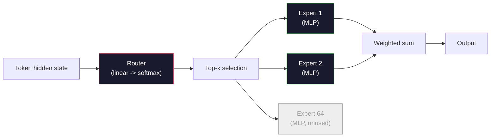

# Açık Modeller: 架构讲解

> 4. Sınıfdan sıfırdan bir GPT-2 Küçük.2026 yılının ön kenar açık modellerini oluşturmak. Aynı aileye ait, sadece beş altı spesifik değişim var. RMSNorm ile LayerNorm değiştirmek. SwiGLU ile GELU değiştirmek. RoPE ile öğrenilen pozisyonları değiştirmek. GQA veya MLA ile tam MHA değiştirmek. Büyük çapta MHA kullanmak. Uzmanlar karışımı.

**Type:** Learn
**Languages:** Python (stdlib)
**Prerequisites:** Phase 10, Lessons 04, 05, 12 (Pre-training, Scaling, Inference)
**Time:** ~45 minutes

## Öğrenme hedefi
- Llama 3 、Mistral、Mixtral、Gemma 2 、Qwen 2.5 和 DeepSeek-V3'ün yapılandırmasını okuyun.
- GPT-2 ile ilgili her modelin küçük yapıldığı belirli yapı değişimleri,
- Config  hesaplamak 任意 open model 参数、KV cache 大小和激活内存
- Gecikme – hafıza – ve yetenek – belirlenirken, hedefleri belirlemek için uygun açık model seçin.

## 问题
4. dersinde 350 sayfa numpy yazdın, bir GPT-2 şekli modeli aldın. Llama 3 405B'nin 200 sayfalık bir teknik raporu var. İnsaniyetiniz onları farklı türler olarak düşünebilir. Aslında değil.

Bu ders bir farklılık. Bu ders, her ana açık model için ayrıntılı olarak belirlenecek.

Gerçek fayda: Meta Llama 5 veya DeepSeek V4'i yayınladığında, yeni bir zihin modeliye ihtiyacınız yok. Konfig'e bakıp, hangi birçok bilgili çevrimiçi hareket ettiğini göreceksiniz. Sonra aşağıdaki etkiyi anlayacaksınız. 2026 yılının yapısı sınırlı bir araç kutusudur.

## 概念
### Değişmeyen Çekirdek

Tüm autoregressive açık modeller paylaşılan:

- Token Embedding Matrix ((vocab_size x hidden_dim) 』
- N 个 dekoder blokları 堆叠:norm、self-attention、residual、norm、MLP、residual。
- Son norm 和投影到 vocab_size 的线性头 (通常与嵌入式重量绑定)
- Sebep maskası, sonraki belirtiler çapraz entropi kaybı.

İşte bu şekil. Gerisi de bir dönüm.

### Gerçek işe yarayan altı düğme.

Tüm 2024-2026 yılları önde açık modellerde, aynı şekilde altı tasarım seçeneği tekrar tekrar ortaya çıktı:

1. **Normalization.**LayerNorm -> RMSNorm。
2. **Positional encoding.**Mutlak öğrendim -> RoPE(加上变体:YaRN、NTK)
3. **Activation.**GELU -> SwiGLU(or GeGLU)
4. **Attention head sharing.**MHA -> GQA -> MQA -> MLA。
5. **Dense vs sparse MLP.**Dense -> Uzmanların Karıştırması
6. **Pre-norm placement.**保持 Pre-norm──post-norm 已消失──

其他一切 (öğrenme oranı şeması, veri karışımı, parti boyutu, bağlam uzunluğu) yapı değil eğitim yapılarına aittir.

### Kürek 1: RMSNorm

LayerNorm, ortalama değerini küçültmek için, std'den çıkarmak için, küçültmek için ve düzeltmek için kullanılır.

```
RMSNorm(x) = x / sqrt(mean(x^2) + eps) * gamma
```

没有均值消除──没有偏见──每个代币少一次 matmul── Zhang and Sennrich (2019) 认为它在机器翻译上可以匹配LayerNorm,同时快 10%──所有现代开放模型都使用它──

代价:没有──收益:小幅吞吐量 提升,代码更简单──

### Kürek 2: RoPE

Öğrenilen pozisyon yerleşimleri, GPT-2'de bir 1024 槽位の検索表──Kontext 1025 就超出表の末端──模型不能外推到訓練長度以外──

Rotary Position Embedding (RoPE, Su et al. 2021) ından önce, her Q ve K vektörü, boyutla dönüştürülür ve pozisyonu yerleştirir.

```
q_rotated = rotate(q, angle(pos))
k_rotated = rotate(k, angle(pos))
score = q_rotated . k_rotated
```

Her Llama、Mistral、Qwen、DeepSeek 和 Gemma 都使用 RoPE──Gemma 2 使用混合方式(Büyük bölgeyi RoPE kullanır, diğer bölgeyi yerel kaydırma penceresi dikkatinden kullanır)。

### Kürek 3: SwiGLU

GPT-2' nin MLP'si`x -> gelu(xW1 + b1) -> (...)W2 + b2`▽SwiGLU(Shazeer 2020) Gated Product 替换激活:

```
SwiGLU(x) = (xW1) * sigmoid(xW1) * xV
```

两个并行投射,一个而不是一个,由Swiss激活 进行 gate──实证上,它在每参数困难上更强──Llama 2 采用它,随后大家都跟进──MLP'nin gizli boyutu genellikle toplam参数 miktarını orijinal yoğun MLP'ye uyumlu hale getirmek için ayarlanır: eğer GPT-2 kullanılırsa`ff_dim = 4 * hidden`,SwiGLU  kullan`ff_dim = (2/3) * 4 * hidden = 8/3 * hidden`- Evet.

### Dörtüncü düğüm: Dikkat Baş Paylaşım

GPT-2 使用 **Multi-Head Attention (MHA)**Her başın kendi Q 、K 、V projesi vardır.

**Multi-Query Attention (MQA, Shazeer 2019)**Tüm başlar arasında bir K ve bir V paylaşmak KV kasesi  num_heads  küçülmek, tipik modelde 12x ile 32x arasında düşüştür.

**Grouped-Query Attention (GQA, Ainslie et al. 2023)**Bu arada, G 组 Q başları 共享一个 K 和一个 V。Llama 3 8B GQA kullanın, içerir 32 个 Q başları 和 8 个 KV başları(G=8), bu yüzden tamamlanmış MHA, KV önbelleği 缩小4x。

**Multi-Head Latent Attention (MLA, DeepSeek 2024)**K ve V'yi paylaşımdaki düşük dereceli latente basarak, yeniden başla 投影回去── daha da azaltarak KV önbelleğini azaltırken her başın ifade yeteneğini korur. DeepSeek-V2 ve V3 uzun bağlamlı 性能¬ları elde etmeye bağlıdır.

| Scheme | KV Heads | KV Cache | Accuracy |
|--------|----------|----------|----------|
| MHA    | num_heads | full | 最好 |
| GQA    | num_groups (G < num_heads) | num_heads / G 缩减 | 接近 MHA |
| MQA    | 1 | num_heads 缩减 | 小幅损失 |
| MLA    | latent, per-head decompression | 小于 MQA | 接近 MHA |

13B'den fazla bir model için GQA veya MLA aslında gereklidir. Büyük çaplı tam MHA KV kasesi felaketlere yol açacaktır.

### 5. düğüm: Uzmanların karışımı

Dense MLP her bir token için  aktive tüm parametreleri。 MoE MLP her blokta K 个 uzmanları vardır, yanı sıra bir yönlendiricisi, her bir token için  seçer üst-k uzmanları(genellikle üst-2)。 Sadece bu uzmanların ağırlıkları 会对该 token 执行前进通过。

```
router_logits = xW_r
indices, weights = top_k(router_logits, k=2)
output = sum_i weights[i] * expert[indices[i]](x)
```

吸引力在于: 64 个各自的7B大小的专家可以有,所以总参数巨大),但是每个代币只运行其中2个,所以每代币计算匹配密集 7B模型) ――混合 8x7B 总参数为47B,但每个代币只激活 13B──DeepSeek-V3 总参数为671B,但每个代币只激活 37B──



优点: Aynı hesaplama 更多参数 更多强容量 缺点:专家内存 仍然必须放在某处((((((((((((((((((((((((((((((((((((((((((((((((((((((((((((((((((((((((((((((((((((((((((((((((((((((((((((((((((((((((((((((((((((((((((((((((((((((((((((((((((((((((((((((((((((((((((((((((((((((((((((((((((((((((((((((((((((((((((((((((((((((((((((((((((((((((((((((((((((((((((((((((((((((((((((((((((((((((((((((((((((((((((((((((((((((((((((((((((((((((((((((((((((((((((((((((((((((((((((((((((((((((((((((((((((((((((((((((((((((((((((((((((((((((((((((((((((((((((((((((

### Kürek 6: Normalden önce kalır

İlk transformatör, her alt katman içinde  sonrası uygulama katman normı。 GPT-2'den beri, her açık model bunu her alt katman içinde yerleştirmiştir.

### Model-Model Fark

Aşağıda, tüm içeriği belirtiyor.

| Model | Year | Total Params | Active Params | Norm | Activation | Position | Attention | MoE | Context |
|-------|------|-------------|---------------|------|-----------|----------|-----------|-----|---------|
| GPT-2 Small | 2019 | 124M | 124M | LayerNorm | GELU | Learned | MHA (12 heads) | no | 1k |
| Llama 3 8B | 2024 | 8B | 8B | RMSNorm | SwiGLU | RoPE | GQA (32/8) | no | 128k |
| Llama 3 70B | 2024 | 70B | 70B | RMSNorm | SwiGLU | RoPE | GQA (64/8) | no | 128k |
| Llama 3 405B | 2024 | 405B | 405B | RMSNorm | SwiGLU | RoPE | GQA (128/16) | no | 128k |
| Mistral 7B | 2023 | 7.2B | 7.2B | RMSNorm | SwiGLU | RoPE | GQA | no | 32k |
| Mixtral 8x7B | 2023 | 47B | 13B | RMSNorm | SwiGLU | RoPE | GQA | yes (8 experts, top-2) | 32k |
| Gemma 2 9B | 2024 | 9B | 9B | RMSNorm (pre+post) | GeGLU | RoPE + sliding | GQA | no | 8k |
| Qwen 2.5 72B | 2024 | 72B | 72B | RMSNorm | SwiGLU | RoPE (YaRN) | GQA (64/8) | no | 128k |
| DeepSeek V2 236B | 2024 | 236B | 21B | RMSNorm | SwiGLU | RoPE | MLA | yes (160 experts, top-6) | 128k |
| DeepSeek V3 | 2024 | 671B | 37B | RMSNorm | SwiGLU | RoPE | MLA | yes (256 experts, top-8) | 128k |

扫描这些列──RMSNorm is通用──SwiGLU 或其GeGLU 近亲是通用──RoPE is通用──7B 以上 GQA is通用,除非被MLA 替代──MoE 是最高端模型的差异点──

### Bir config.json okuyorum

Llama 3 8B yapılandırması:

```
{
  "hidden_size": 4096,
  "intermediate_size": 14336,
  "num_hidden_layers": 32,
  "num_attention_heads": 32,
  "num_key_value_heads": 8,
  "max_position_embeddings": 131072,
  "rope_theta": 500000.0,
  "rms_norm_eps": 1e-5,
  "vocab_size": 128256
}
```

Her bölümde, başardığın her şeye karşılık.

- `hidden_size`: yerleştirme boyutu:
- `intermediate_size`: MLP gizli boyut ((3.5x gizli -- SwiGLU 数学) 』
- `num_hidden_layers`: deposu.
- `num_attention_heads`: Q başları
- `num_key_value_heads`: KV başları(GQA)。
- `max_position_embeddings`: eğitim bağlamı uzunluğu¬¬¬¬¬¬¬¬¬¬¬¬¬¬¬¬¬¬¬¬¬¬¬¬¬¬¬¬¬¬¬¬¬¬¬¬¬¬¬¬¬¬¬¬¬¬¬¬¬¬¬¬¬¬¬¬¬¬¬¬¬¬¬¬¬¬¬¬¬¬¬¬¬¬¬¬¬¬¬¬¬¬¬¬¬¬¬¬¬¬¬¬¬¬¬¬¬¬¬¬¬
- `rope_theta`RoPE temel frekansı: Meta, uzun bağlamlı ekstrapolasyon için 10k ölçeğinden 500k'ye kadar kullanılır.
- `rms_norm_eps`: sayısal istikrarı¬¬¬¬¬¬¬¬¬¬¬¬¬¬¬¬¬¬¬¬¬¬¬¬¬¬¬¬¬¬¬¬¬¬¬¬¬¬¬¬¬¬¬¬¬¬¬¬¬¬¬¬¬¬¬¬¬¬¬¬¬¬¬¬¬¬¬¬¬¬¬¬¬¬¬¬¬¬¬¬¬¬¬¬¬¬¬¬¬¬¬¬¬¬¬¬¬¬¬¬¬¬¬¬¬¬¬¬
- `vocab_size`: tokens。

Sadece bu sayılarla, toplam parametre sayısı, KV önbelleği ve zirve değer aktivasyonu hafızasını hesaplayabilirsin.`code/main.py`- Evet.

### Aktifleştirme belleği bütçesi

Birkaç milyar parametre üzerinde, aktivasyonlar, eğitim hafızasını yönlendirecek.

```
activation_mem ~ batch_size * seq_len * hidden_size * num_layers * bytes_per_element
```

Llama 3 8B için, 1 ̊ batch 8192 ̊ sek BF16 ̊ 32 katman ̊ gizli 4096 时: sadece aktivasyonlar yaklaşık 8 GB kullanmak gerekir), 40 GB kullanmamak gerekir. İşte akıl akışı ve halka akışı  önemli nedenler: bunlar dikkat hesaplamalarını yeniden yazırlar, aktivasyonları 能够放得下──

### KV Kaynak bütçesi

对于最大的背景下的推论:

```
kv_cache = 2 * num_layers * num_kv_heads * head_dim * max_seq_len * bytes_per_element
```

Llama 3 8B 128k bağlamında BF16 √ baş_dim = gizli / num_head = 128 时:
`2 * 32 * 8 * 128 * 131072 * 2 = 17.2 GB`Her bir dizi.

8B ağırlıkları BF16'da 16 GB'dır. 128k dizisi KV kaydı daha büyüktür. Bu, GQA'yı güçlendirir.

### Her Model Kazanırken

- **单张 80GB GPU，无 MoE**Llama 3 8B、Mistral 7B、Gemma 2 9B。 Hizmet etmek kolaydır, araçlar 广泛。
- **单节点（8x80GB），大 capacity**Llama 3 70B、Qwen 2.5 72B── en yoğun açık kapasite
- **最大的 open capability，可接受 MoE 复杂度**DeepSeek V3、Mixtral 8x22B── her aktif FLOP'un en iyi kapasitesi
- **Long-context 需求**Llama 3 ((Rope Scaling  128k'e ulaşmak)
- **Low-latency serving**:Gemma 2 9B(Gizleme penceresi 降低 uzun bağlamlı hesaplama)


```figure
rmsnorm-vs-layernorm
```

## Yapın onu.
Bu dersin kodu bir hesaplama makinesi. Bu, yapılandırma biçiminde belirlenen herhangi bir yapılandırma biçiminde, yapılandırma biçiminde, yapılandırma biçiminde, yapılandırma biçiminde, yapılandırma biçiminde, yapılandırma biçiminde, yapılandırma biçiminde, yapılandırma biçiminde, yapılandırma biçiminde, yapılandırma biçiminde, yapılandırma biçiminde, yapılandırma biçiminde, yapılandırma biçiminde, yapılandırma biçiminde, yapılandırma biçiminde, yapılandırma biçiminde, yapılandırma biçiminde, yapılandırma biçiminde, yapılandırma biçiminde, yapılandırma biçiminde, yapılandırma biçiminde, yapılandırma biçiminde, yapılandırma biçiminde, yapılandırma biçiminde, yapılandırma biçiminde, yapılandırma biçiminde, yapılandırma biçiminde, yapılandırma biçiminde, yapılandırma biçiminde, biçiminde, biçiminde, biçiminde, biçiminde, biçiminde, biçiminde, biçiminde, biçiminde, biçiminde, biçiminde, biçiminde, biçiminde, biçiminde, biçiminde, biçiminde, biçiminde, biçiminde, biçiminde, biçiminde, biçiminde, biçiminde, biçiminde, biçiminde, biçiminde, biçiminde, biçiminde, biçiminde, biçiminde, biçiminde, biçiminde, biçiminde, biçiminde, biçiminde, biçiminde, biçiminde, biçim, biçiminde, biçim, biçim, biçim, biçim, biçim, biçim, biçim, biçim, biçim, biçim, biçim, biçim, biçim, biçim, biçim, biçim, biçim, biçim, biçim, biçim, biçim, biçim, biçim, biçim, biçim, biçim, biçim, biçim, biçim, biçim, biçim, biçim, biçim, biçim, biçim, biçim, biçim, biçim, biçim, biçim, biçim, biçim, biçim, biçim, biçim, biçim,

```python
config = {
    "hidden_size": 4096, "intermediate_size": 14336,
    "num_hidden_layers": 32, "num_attention_heads": 32,
    "num_key_value_heads": 8, "vocab_size": 128256,
    "max_position_embeddings": 131072,
}
```

脚本会逐字段遍历架构,计算嵌入、attention(带 GQA azaltımı)、MLP(带 SwiGLU genişletilmesi)、layernorms 和 head 的参数──然后它会根据给定的背景长度计算 KV缓存,并打印总结──

实现见 `code/main.py`- Evet.

## Kullan
运行计算器,脚本中捆绑的Llama 3 8B、Mistral 7B、Mixtral 8x7B 和 DeepSeek V3 konfigüratörleri kullanılarak.

Sonra kendi modelinizin yapılandırmasını ekleyin, özet okuyun ve GPU'ya uygun olup olmadığını belirleyin.

## - Söyle.
本课会生成 `outputs/skill-open-model-picker.md` Bir uygulama hedefi belirle­lenir (GPU tipi,VRAM, bağlam uzunluğu, gecikme bütçesi) ve bir görev görüntüsü (chat,code,reasoning,long-context), açık bir model önerir.

## 练习
1. HuggingFace'dan Qwen 2.5 72B yapılandırmasını okuyun.

2. DeepSeek V3 256 uzman kullanıyor, en üst 8 yönlendirmeyi kullanıyor, hesaplama etkin uzmanların toplam uzmanların oranıyla, Mixtral 8x7B'nin 8'inden en üst 2'e karşılaştırıyor, nadirden ((25%) yoğunluğa daha nadirdir ((3%) için her FLOP kapasitesi için ne anlama gelir?

3. 計算 Llama 3 405B 128k bağlamında 下使用 FP8 和 BF16 时的 KV缓存──FP8 BF16 数值نىڭ bir yarısı──在单个8xH100 节点上(每张 80GB = 总计 640GB,减重内存),你能服务多少的平行序列?

4. Gemma 2 交替使用全注意 和滑走窗-注意层──当一半层 使用 4096-token滑走窗而不是全文 context 时,写出 KV缓存的数学公式──在 8k 总文本下能节省多少内存?

5. Bu ders yazıldıktan sonra yayınlanan yakın dönem öncü açık model bulmak. Bu altı dönümden hangisini seçtiğini ve yedinci dönümden birini içeriyor muyduğunu belirlemek. Yeni yapı yayınlandığında derslerin bir an önce ortaya çıkması - hedef yeniden inşa edilmeyen zihin modelinin şartıyla formunuzu yenilemek.

## 关键术语
| Term | What people say | What it actually means |
|------|----------------|----------------------|
| RMSNorm | “没有均值的 LayerNorm” | 只按 root mean square 进行 normalize，并使用 learned scale -- 更便宜且可与 LayerNorm 相比 |
| RoPE | “Rotary positions” | 将每个 Q 和 K Vector 按 2D pairs 旋转，角度取决于 position -- 结合 scaling 技巧可外推到训练长度之外 |
| SwiGLU | “新的 MLP activation” | 带 Swish 的 gated linear unit：`(xW1) * sigmoid(xW1) * xV` -- 是每个 2024+ open model 的标准配置 |
| GQA | “中间路线 attention” | Grouped-Query Attention：G 组 Q heads 共享一个 K 和一个 V head -- 在避免 MQA accuracy 损失的同时缩小 KV cache |
| MLA | “DeepSeek 的 attention” | Multi-Head Latent Attention：将 K/V 压缩到共享 low-rank latent，再按 head 解压 -- 大模型中最小的 KV cache |
| MoE | “Sparse experts” | Mixture of Experts：每个 block 有 N 个 MLPs，router 为每个 Token 选择 top-k -- 巨大的 total params，较小的 active params |
| Top-k routing | “每个 Token 选择 k 个 experts” | Router 为每个 expert 计算分数，并激活最高的 k 个 -- 典型 k 从 2（Mixtral）到 8（DeepSeek） |
| YaRN | “拉伸 RoPE” | Yet another RoPE extension -- 通过插值 rotary angles，在 inference 时将 context 从 8k 扩展到 128k+ |
| Sliding-window attention | “不要 attend to everything” | 每个 Token 只 attend 到最近 W 个 Tokens -- 将 attention cost 限制为每 Token O(W)，用于 Gemma 2 和早期 Mistral |
| Active params | “每个 Token 实际运行的部分” | 对于 MoE models，指每个 Token 会经历 forward pass 的参数量（远小于 total params）-- 决定 per-token FLOPs |

## 延伸阅读
- [Dubey et al., 2024 -- "The Llama 3 Herd of Models"](https://arxiv.org/abs/2407.21783)-- yoğun Llama 3 aile yapı ve eğitim referansı
- [DeepSeek-AI, 2024 -- "DeepSeek-V3 Technical Report"](https://arxiv.org/abs/2412.19437)-- MLA 加 yardımcı kayıpsız yük dengeleme 加 671B MoE
- [Jiang et al., 2024 -- "Mixtral of Experts"](https://arxiv.org/abs/2401.04088)-- 经典 MoE açık model 论文
- [Su et al., 2021 -- "RoFormer: Enhanced Transformer with Rotary Position Embedding"](https://arxiv.org/abs/2104.09864)-- RoPE 论文
- [Shazeer, 2020 -- "GLU Variants Improve Transformer"](https://arxiv.org/abs/2002.05202)-- SwiGLU、GeGLU 及相关方法
- [Ainslie et al., 2023 -- "GQA: Training Generalized Multi-Query Transformer Models"](https://arxiv.org/abs/2305.13245)-- GQA 论文
- [Gemma 2 Team, 2024 -- "Gemma 2: Improving Open Language Models at a Practical Size"](https://arxiv.org/abs/2408.00118)-- hibrid tam+slip dikkat 、pre+post-norm
- [Qwen Team, 2024 -- "Qwen 2.5 Technical Report"](https://arxiv.org/abs/2412.15115)-- YaRN bağlamı uzatma ve uzun bağlamlı eğitim tarifleri
