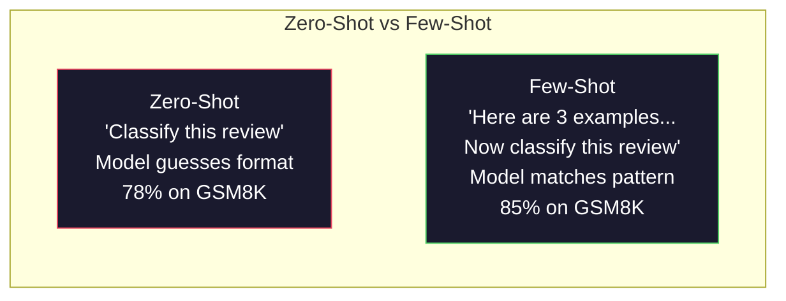
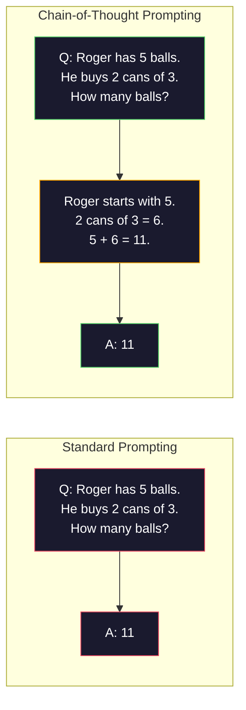
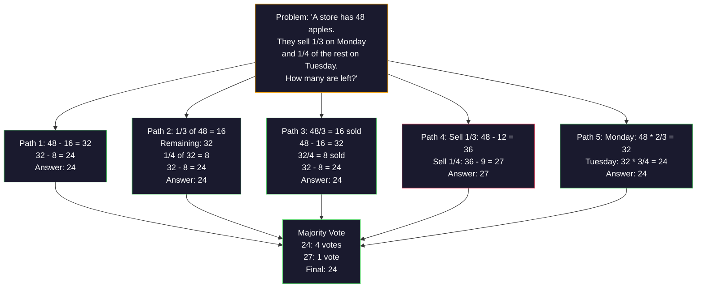
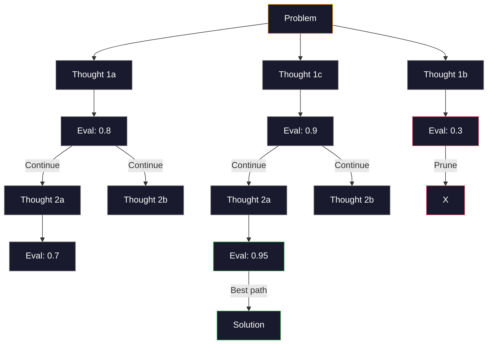

# Birkaç atış, düşünce zinciri, düşünce ağacı.

>  modelin yapması gerekenleri söyleyin                                                                                                                                                                                                                                                          

**类型：**Yapım
**语言：**Python
**先修要求：**Ders 11.01 (Hızlı Mühendislik)
**时间：**45 dakika kadar .

## Öğrenme hedefi

- Seçim ve biçimlendirme örnek gösterileri ile birkaç atışlı isteklemeyi gerçekleştirmek için, böylece görev doğruluğunu en üst düzeye çıkarmak için
- Application chain of thought (CoT) 推理, improve mathematics application problems etc. multi-step problemlerin doğruluğu oranı
- 构建 tree-of-thought prompt,探索多条推理路径并选择最佳路径
- Standart referans değerinde sıfır çekim, az çekim ve COT ile getirilen doğruluk oranının yükseltilmesi

## 问题

Siz bir matematik rehberliği uygulaması inşa ediyorsunuz. Sizin sorunuzu  Yazıyor:  Bu kelime sorunu çöz. GSM8K bu standart küçük matematik referansı üzerinde, GPT-5 % 94'lik bir cevaplama süresi var.

Ekstra 5 kelimeler İşte bir adım  doğruluk oranı %91'e kadar yükseldiğini düşünün.

Bu hack değil. Bu düşünce yöntemidir. İnsan bir kere bile bir çok adımla çözmeye kalkışmaz. Transformer de olmaz. Eğer bir model oluşturmak zorunda kalırsanız, bu belirtiler bir sonraki belirtiye dönüşecek.

Ama think step by step  just start, not endpoint. Eğer bir model oluşturursan, sonra da çoğunlukla oy verirseniz ne olacak? Eğer bir olasılık ağacını keşfetmek için bir model oluşturursan, nasıl değerlendirilir? Eğer bir fikir ve araç kullanırsanız, nasıl birleştirilir? Bunlar varsayımlar değil. Bunlar zaten yayınlanmıştır, ve geliştirilmiş teknikler var, bu ders onları tümüyle inşa edersiniz.

## 核心概念

### Zero-Shot vs Few-Shot: Örnek何時胜过命令

Zero-shot prompting sadece model için bir görev verir, bunun dışında hiçbir şey vermez.

Wei et al. (2022) 8 referans değerinde bu noktayı ölçtü.

直觉是: örnekler sıkıştırıldıktan sonra bir talimatdır. Özetlerdeki açıklama biçimi, doğrudan gösterilmez.



**few-shot 适合的场景：**biçim hassas görevleri, sınıflandırma, yapısal çekim, alan özel terimleri, ve belirli model uyumlu herhangi bir gereksinimli görevler

**zero-shot 适合的场景：**简单事实问题、例会限制创造力创意任务,以及找到好例比写好命令更难的任务――

### Örnek Seçim: 似胜过随机

Tüm örnekler aynı değildir. Seçim ve hedef giriş benzer örnekler, sınıflandırma görevlerinde sıradan seçim oranı %5-15% oranında yüksektir.

1. **语义相似性**:选择 Embedding 空间中最接近输入的示例
2. **标签多样性**: örnek tüm çıkış sınıflarını kapsamalı
3. **难度匹配**: Uygunluk hedef sorununun karmaşıklığı seviyesi

Çoğu görev için en iyi örnek sayısı 3-5 ̇̇̇ üç ̇ üç ̇ zaman, model yeterli sinyal çekim modeli ̇ 5 ̇ zaman, gelir gider gider gider gider gider gider gider bağlam penceresi Token。 çok fazla etiket kategori için, her etiket bir örnek kullanır。

### Düşünce zinciri: give模型草稿紙

Google Brain'in Wei et al. tarafından önerilen (CoT) düşünce zinciri.



Mekanik bakış açısından, neden bu geçerli?Transformer 生产的每个代币都会成为下一个代币的上下文──没有CoT 时,模型必须将所有推理压缩到一次前进传递的隐藏状态中──有CoT,模型将中计算外化为代币──每个推理代币都延长有效计算深度──

**GSM8K benchmark（小学数学，8.5K 道题）：**

| Model | Zero-Shot | Zero-Shot CoT | Few-Shot CoT |
|-------|-----------|---------------|--------------|
| GPT-4o | 78% | 91% | 95% |
| GPT-5 | 94% | 97% | 98% |
| o4-mini (reasoning) | 97% | — | — |
| Claude Opus 4.7 | 93% | 97% | 98% |
| Gemini 3 Pro | 92% | 96% | 98% |
| Llama 4 70B | 80% | 89% | 94% |
| DeepSeek-V3.1 | 89% | 94% | 96% |

**关于 reasoning models 的说明。**OpenAI'nin o-seri ((o3、o4-mini) ve DeepSeek-R1 等 modelleri, fikir zinciri için bir giriş yapmaktadır.

İki tür tür vardır:

**Zero-shot CoT**Bu cümle, hesaplamacılık, normal bilgi ve simgeyi tahmin etme görevinin doğruluğunu artırabileceğini göstermektedir.

**Few-shot CoT**Bu, sıfır çekimli bir CoT'den daha etkili olur, çünkü model beklediğiniz doğru bir düşünce biçimini görebilir.

**CoT 会伤害表现的场景**:简单事实回忆(Fransa'nın başkenti nedir?) 、单步分类、速度比准确率更重要任务──CoT Her sorguda 50-200 推理 Token'ın satışına katkı sağlar──高吞吐、低复杂性任务, bu bir haraç masrafı──

### Kendiliğinden uyum: çok kez, bir kez oy kullanmak

Wang et al. (2023)  öz tutarlılığı önermiştir.



İlk PaLM 540B deneyinde, kendiliğinden tutarlılık GSM8K doğruluk oranını %56.5'ten %74.4'e yükseltecek. GPT-5'de çok küçük bir artış %97.98.

权衡是:N 个样本意味着N 倍 API 成本和延迟――实践中,N=5 能获得大部分收益――N=3 is meaningful vote's minimum value――大多数任务,N > 10 收益递减――

### Düşünce ağacı:分支式探索

Yao et al. (2023) Ticik Ağacı (ToT)  CoT                                                                                                                                                                                                                                                                                                                                                                                                                                                                                                        



Üç bölüm vardır:

1. **Thought generation**:生成多个候选人 下一步
2. **State evaluation**: For Each Candidate打分(LLM  kendini değerlendirme aracı olarak kullanabilirsiniz)
3. **Search algorithm**BFS veya DFS üzerinden                                                                                                                                                                                                                                                            

24 görev oyununda ({{lang-en_{{lang-en_{{lang-en_{{lang-en_{{lang-en_{{lang-en_{{lang-en_{{lang-en_{{lang-en_{{lang-en_{{lang-en_{{lang-en_{{lang-en_{{lang-en_{{lang-en_lang-en_lang-en_lang-en_lang-en_lang-en_lang-en_lang-en_lang-en_lang-en_lang}}) 4 个数字 elde edilir) }}), standart isteklenmeyle GPT-4 çözme oranı %7.3'dir.

Ağacın her bir noktası bir kez LLM'ye ihtiyaç duyar. 3 ̊ derinlik 3 ̊ en fazla ağaç 39 kez LLM'ye ihtiyaç duyar.

### ReAct: Düşünme + Yaptırma

Yao et al. (2022) düşünce tarzı ile hareketin birleştirilmesi için kullanılacak.

```mermaid
graph LR
    Q["Question:\nWhat is the\npopulation of the\ncountry where\nthe Eiffel Tower\nis located?"]
    T1["Thought: I need to\nfind which country\nhas the Eiffel Tower"]
    A1["Action: search\n'Eiffel Tower location'"]
    O1["Observation:\nParis, France"]
    T2["Thought: Now I need\nFrance's population"]
    A2["Action: search\n'France population 2024'"]
    O2["Observation:\n68.4 million"]
    T3["Thought: I have\nthe answer"]
    F["Answer:\n68.4 million"]

    Q --> T1 --> A1 --> O1 --> T2 --> A2 --> O2 --> T3 --> F

    style Q fill:#1a1a2e,stroke:#ffa500,color:#fff
    style T1 fill:#1a1a2e,stroke:#51cf66,color:#fff
    style A1 fill:#1a1a2e,stroke:#e94560,color:#fff
    style O1 fill:#1a1a2e,stroke:#808080,color:#fff
    style T2 fill:#1a1a2e,stroke:#51cf66,color:#fff
    style A2 fill:#1a1a2e,stroke:#e94560,color:#fff
    style O2 fill:#1a1a2e,stroke:#808080,color:#fff
    style T3 fill:#1a1a2e,stroke:#51cf66,color:#fff
    style F fill:#1a1a2e,stroke:#51cf66,color:#fff
```



ReAct, bilgi yoğunluğu görevlerinde saf bir CoT'den üstündür, çünkü gerçek verilerde kararlı bir şekilde düşünceyi ortaya koyabilir.

ReAct, modern AI ajanlarının temelidir. Her bir ajan çerçevesinde bir çeşit Düşünce- eylem- gözlem döngüsü değişikliği gerçekleşir.

### Yapılandırılmış Çözüm:XML Etiketleri、Kötüleştiriciler、Başlıklar

                                                                                                                                                                                                                                                              

**XML tags**(En uygun Claude, her yerde sağlam):
```
<context>
You are reviewing a pull request.
The codebase uses TypeScript and React.
</context>

<task>
Review the following diff for bugs, security issues, and style violations.
</task>

<diff>
{diff_content}
</diff>

<output_format>
List each issue with: file, line, severity (critical/warning/info), description.
</output_format>
```

**Markdown headers**(Böyük):
```
## Role
Senior security engineer at a fintech company.

## Task
Analyze this API endpoint for vulnerabilities.

## Input
{api_code}

## Rules
- Focus on OWASP Top 10
- Rate each finding: critical, high, medium, low
- Include remediation steps
```

**Delimiters**(Çok basit ama geçerli):
```
---INPUT---
{user_text}
---END INPUT---

---INSTRUCTIONS---
Summarize the above in 3 bullet points.
---END INSTRUCTIONS---
```

### Hızlı zincirleme:顺序分解

Bazı görevler tek bir istekle çok karmaşıkdır.


Zincirleme 优于单速 有三个原因:

1. **每一步更简单**Model: Tüm şeyleri aynı anda bir arada tutmak yerine, bir odaklanma görevini işlemek.
2. **中间输出可检查**Bu adımlar arasında doğrulamayı ve düzeltmeyi yapabilirsin.
3. **不同步骤可以使用不同模型**Ucuz modelle çekim yap, pahalı modelle önerim yap

###  Performans karşılığı

| Technique | Best For | GSM8K Accuracy (GPT-5) | API Calls | Token Overhead | Complexity |
|-----------|----------|------------------------|-----------|----------------|------------|
| Zero-Shot | 简单任务 | 94% | 1 | 无 | 极低 |
| Few-Shot | 格式匹配 | 96% | 1 | 200-500 tokens | 低 |
| Zero-Shot CoT | 快速推理提升 | 97% | 1 | 50-200 tokens | 极低 |
| Few-Shot CoT | 最高单次调用准确率 | 98% | 1 | 300-600 tokens | 低 |
| Self-Consistency (N=5) | 高风险推理 | 98.5% | 5 | 5x token cost | 中 |
| Reasoning model (o4-mini) | CoT 的直接替代 | 97% | 1 | hidden (2-10x internal) | 极低 |
| Tree-of-Thought | 搜索/规划问题 | N/A (74% on Game of 24) | 10-40+ | 10-40x token cost | 高 |
| ReAct | 基于知识的推理 | N/A (35.1% on HotpotQA) | 3-10+ | 可变 | 高 |
| Prompt Chaining | 复杂多步骤任务 | 96% (pipeline) | 2-5 | 2-5x token cost | 中 |

Doğruluk teknolojisi üç faktöre bağlıdır: doğruluk oranı gereksinimleri, gecikme bütçesi ve maliyet toleransı. Çoğu üretim sistemi için, az çekimli CoT ile 3 örnek kendi kendine tutarlılık düşüşü %90'ı kaplayabilir.


```figure
few-shot-curve
```

## Yapın onu.

Biz bir matematik sorunu çözme makinesi inşa edeceğiz, birkaç atışlı teşvikleri, düşünce zincirini, düşünce ve kendi kendine uyumlu oylamaları, bir boru hattını oluştururuz.

完整实现在 `code/advanced_prompting.py`İç... Aşağıda önemli bir yapıtaş var.

### 步骤1:Few-Shot Örnek Mağazası

İlk Komponent yönetim birkaç atış örneği,并为给定问题选择最相关的示例──

```python
GSM8K_EXAMPLES = [
    {
        "question": "Janet's ducks lay 16 eggs per day. She eats three for breakfast every morning and bakes muffins for her friends every day with four. She sells every egg at the farmers' market for $2. How much does she make every day at the farmers' market?",
        "reasoning": "Janet's ducks lay 16 eggs per day. She eats 3 and bakes 4, using 3 + 4 = 7 eggs. So she has 16 - 7 = 9 eggs left. She sells each for $2, so she makes 9 * 2 = $18 per day.",
        "answer": "18"
    },
    ...
]
```

Her örnek üç bölüm içerir: sorun、 öneriler zinciri ve son cevap¬¬¬¬¬¬¬¬¬¬¬¬¬¬¬¬¬¬¬¬¬¬¬¬¬¬¬¬¬¬¬¬¬¬¬¬¬¬¬¬¬¬¬¬¬¬¬¬¬¬¬¬¬¬¬¬¬¬¬¬¬¬¬¬¬¬¬¬¬¬¬¬¬¬¬¬¬¬¬¬¬¬¬¬¬¬¬¬¬¬¬¬¬¬¬¬¬¬¬¬¬¬¬¬¬¬¬¬¬¬¬¬¬¬¬¬¬¬¬¬¬¬¬¬¬¬¬¬¬¬¬¬¬¬¬¬¬¬¬¬¬¬¬¬¬¬¬¬¬¬¬¬¬¬¬¬¬¬¬¬¬¬¬¬¬¬¬¬¬¬¬¬¬¬¬¬¬¬¬¬¬¬¬¬¬¬¬¬¬¬¬¬¬¬¬¬¬¬¬¬¬¬¬¬¬¬¬¬¬¬¬¬¬¬¬¬¬¬¬¬¬¬¬¬¬¬¬¬¬¬¬¬¬¬¬¬¬¬¬¬¬¬¬¬¬¬¬¬¬¬¬¬¬¬¬¬¬¬¬¬¬¬¬¬¬¬¬¬¬¬¬¬¬¬¬¬¬¬¬¬¬¬¬¬¬¬¬¬¬¬¬¬¬¬¬¬¬¬¬¬¬¬¬¬¬¬¬¬¬¬¬¬¬¬¬¬¬¬¬¬¬¬¬¬¬¬¬¬¬¬¬¬¬¬¬¬¬¬¬¬¬¬¬¬¬¬¬¬¬¬¬¬¬¬¬¬¬¬¬¬¬¬¬¬¬¬¬¬¬¬¬¬¬¬¬¬¬¬¬¬¬¬¬¬¬¬¬¬¬¬¬¬¬¬¬¬¬¬¬¬¬¬¬¬¬¬¬¬¬¬¬¬¬¬¬¬¬¬¬¬¬¬¬¬¬¬¬¬¬¬¬¬¬¬¬¬¬¬¬¬¬¬¬¬¬¬¬¬¬¬¬¬¬¬¬¬¬¬¬¬¬¬¬¬¬¬¬¬¬¬¬¬¬¬¬¬¬¬¬¬¬¬¬¬¬¬¬¬¬¬¬¬¬¬

### 步骤 2: Düşünce Zinciri Çabası Oluşturucu

prompt builder sistem mesajını                                                                                                                                                                                                                                                            

```python
def build_cot_prompt(question, examples, num_examples=3):
    system = (
        "You are a math problem solver. "
        "For each problem, show your step-by-step reasoning, "
        "then give the final numerical answer on the last line "
        "in the format: 'The answer is [number]'."
    )

    example_text = ""
    for ex in examples[:num_examples]:
        example_text += f"Q: {ex['question']}\n"
        example_text += f"A: {ex['reasoning']} The answer is {ex['answer']}.\n\n"

    user = f"{example_text}Q: {question}\nA:"
    return system, user
```

格式约束( Cevap [çeşit])至关重要──没有它,自连性就无法跨样本抽取并比较答案──

### 步骤 3:Özbirliği Oylaması

采样 N 条推理路径,并取多数答案──

```python
def self_consistency_solve(question, examples, client, model, n_samples=5):
    system, user = build_cot_prompt(question, examples)

    answers = []
    reasonings = []
    for _ in range(n_samples):
        response = client.chat.completions.create(
            model=model,
            messages=[
                {"role": "system", "content": system},
                {"role": "user", "content": user}
            ],
            temperature=0.7
        )
        text = response.choices[0].message.content
        reasonings.append(text)
        answer = extract_answer(text)
        if answer is not None:
            answers.append(answer)

    vote_counts = Counter(answers)
    best_answer = vote_counts.most_common(1)[0][0] if vote_counts else None
    confidence = vote_counts[best_answer] / len(answers) if best_answer else 0

    return best_answer, confidence, reasonings, vote_counts
```

Temperatür 0.7  çok önemlidir. 0.0 ında tüm N 个样本都会相同,从而失去意义.

### 步骤 4:Tree-of-Though Solver

Lineal reasoning failure problemleri için, birçok yönü keşfetmek ve hangi yönün en iyi geleceği değerlendirmek için yapılacak.

```python
def tree_of_thought_solve(question, client, model, breadth=3, depth=3):
    thoughts = generate_initial_thoughts(question, client, model, breadth)
    scored = [(t, evaluate_thought(t, question, client, model)) for t in thoughts]
    scored.sort(key=lambda x: x[1], reverse=True)

    for current_depth in range(1, depth):
        next_thoughts = []
        for thought, score in scored[:2]:
            extensions = extend_thought(thought, question, client, model, breadth)
            for ext in extensions:
                ext_score = evaluate_thought(ext, question, client, model)
                next_thoughts.append((ext, ext_score))
        scored = sorted(next_thoughts, key=lambda x: x[1], reverse=True)

    best_thought = scored[0][0] if scored else ""
    return extract_answer(best_thought), best_thought
```

评估器本身也是一次 LLM 调用──你问模型:0.0 ila 1.0 oranında, bu mantık yolu sorunun çözülmesi için ne kadar umut verici? 这是 ToT'ın关键洞察模型会评估自己的部分解法──

### 5 adım: Tam bir boru hattı

Kökü yoluyla yükseltme stratejisi tüm teknolojileri birleştirmek için.

```python
def solve_with_escalation(question, examples, client, model):
    system, user = build_cot_prompt(question, examples)
    single_response = call_llm(client, model, system, user, temperature=0.0)
    single_answer = extract_answer(single_response)

    sc_answer, confidence, _, _ = self_consistency_solve(
        question, examples, client, model, n_samples=5
    )

    if confidence >= 0.8:
        return sc_answer, "self_consistency", confidence

    tot_answer, _ = tree_of_thought_solve(question, client, model)
    return tot_answer, "tree_of_thought", None
```

升级逻辑:先尝试便宜方案(单次 CoT) ・・・ Eğer kendi kendine güveni 低于0.8(5 样本中低于4 个一致),则升级至T──这样能平衡成本和准确率大多数问题便宜地解决,难题获得更多计算──

## Kullan

### LangChain ile

LangChain için hızlı şablonlar ve çıkış analizleri 提供内置支持,能简化 few-shot 和 CoT patterns:

```python
from langchain_core.prompts import FewShotPromptTemplate, PromptTemplate
from langchain_openai import ChatOpenAI

example_prompt = PromptTemplate(
    input_variables=["question", "reasoning", "answer"],
    template="Q: {question}\nA: {reasoning} The answer is {answer}."
)

few_shot_prompt = FewShotPromptTemplate(
    examples=examples,
    example_prompt=example_prompt,
    suffix="Q: {input}\nA: Let's think step by step.",
    input_variables=["input"]
)

llm = ChatOpenAI(model="gpt-4o", temperature=0.7)
chain = few_shot_prompt | llm
result = chain.invoke({"input": "If a train travels 120 km in 2 hours..."})
```

LangChain'in de kullanıldığı dil anlamı benzerlik seçimi.`ExampleSelector`sınıflar:

```python
from langchain_core.example_selectors import SemanticSimilarityExampleSelector
from langchain_openai import OpenAIEmbeddings

selector = SemanticSimilarityExampleSelector.from_examples(
    examples,
    OpenAIEmbeddings(),
    k=3
)
```

### DSPy ile

DSPy stratejileri 视为可优化模块──你无需手写CoT提示,而定义一个签名,然后让DSPy 优化提示:

```python
import dspy

dspy.configure(lm=dspy.LM("openai/gpt-4o", temperature=0.7))

class MathSolver(dspy.Module):
    def __init__(self):
        self.solve = dspy.ChainOfThought("question -> answer")

    def forward(self, question):
        return self.solve(question=question)

solver = MathSolver()
result = solver(question="Janet's ducks lay 16 eggs per day...")
```

DSPy'nin `ChainOfThought`Kendiliğinden bir yol katlayacağım.`dspy.majority`auto-konsistenliği gerçekleştirmek:

```python
result = dspy.majority(
    [solver(question=q) for _ in range(5)],
    field="answer"
)
```

### karşılaştırma:Scratch vs Frameworks

| Feature | From-Scratch (this lesson) | LangChain | DSPy |
|---------|--------------------------|-----------|------|
| 对 prompt format 的控制 | 完全控制 | 基于 template | 自动 |
| Self-consistency | 手动投票 | 手动 | 内置（`dspy.majority`） |
| Example selection | 自定义逻辑 | `ExampleSelector` | `dspy.BootstrapFewShot` |
| Tree-of-Thought | 自定义 tree search | Community chains | 未内置 |
| Prompt optimization | 手动迭代 | 手动 | 自动编译 |
| 最适合 | 学习、自定义 pipelines | 标准 workflows | 研究、优化 |

## - Söyle.

Bu ders iki eserle sonuçlandı.

**1. Reasoning Chain Prompt**(`outputs/prompt-reasoning-chain.md`): Bir üretim hazır hızlı şablon, kendi kendine tutarlılık getirmek için kullanılabilir birkaç atışlı CoT──

**2. CoT Pattern Selection Skill**(`outputs/skill-cot-patterns.md`): Bir karar çerçevesini, görev türüne, doğruluk oranı gereksinimlerine ve maliyet kısıtlamalarına dayalı olarak uygun bir önerme tekniğini seçmek için kullanılır.

## 练习

1. **衡量差距**: Get 10 Way GSM8K 题──分别用零射、少射、零射 CoT 和少射 CoT 解每一题──记录每种方法的准确率──哪种技术带来最大提升在你的模型上?

2. **示例选择实验**Bu nedenle, bu konularda, örneğin kalitesi, örneğin sayısından daha önemli olan nedir?

3. **Self-consistency 成本曲线**20 yolu GSM8K 题 üzerinde N=1、3、5、7、10 运行自一致性──绘制准确率 vs 成本(总代币)──

4. **构建 ReAct loop**: hesap makinesi aracı ile pipeline genişletmek için, Python'un kullanımı ile matematik ifade oluşturmak için`eval()`(on sandbox) onu gerçekleştirir, sonucu geriye döner.

5. **ToT 用于创意任务**Bu yüzden, bu konuda çok daha fazla bilgi almak için, bir araştırma makinesi olarak kullanın.

## 关键术语

| Term | 人们通常说 | 实际含义 |
|------|----------------|----------------------|
| Few-shot prompting | “给它一些示例” | 在 prompt 中包含 input-output demonstrations，用于锚定模型的输出格式和行为 |
| Chain-of-Thought | “让它一步步思考” | 引出中间推理 Token，在生成最终答案前延长模型的有效计算 |
| Self-Consistency | “多运行几次” | 在 temperature > 0 下采样 N 条多样推理路径，并通过多数投票选择最常见的最终答案 |
| Tree-of-Thought | “让它探索选项” | 对推理分支进行结构化搜索，每个部分解法都会被评估，只有有前景的路径会被扩展 |
| ReAct | “思考 + 工具使用” | 在 Thought-Action-Observation loop 中交织推理轨迹与外部动作（搜索、计算、API calls） |
| Prompt chaining | “拆成步骤” | 将复杂任务分解为顺序 prompts，每一步输出都会馈入下一步输入 |
| Zero-shot CoT | “只加上 ‘think step by step’” | 不提供任何示例，只在 prompt 后追加推理触发短语，依赖模型的潜在推理能力 |

## 延伸阅读

- [Chain-of-Thought Prompting Elicits Reasoning in Large Language Models](https://arxiv.org/abs/2201.11903)-- Wei et al. 2022──Google Brain'ın orijinal CoT makalesi── okuyun.
- [Self-Consistency Improves Chain of Thought Reasoning in Language Models](https://arxiv.org/abs/2203.11171)-- Wang et al. 2023― kendi kendine uyumlulık 论文―表 1
- [Tree of Thoughts: Deliberate Problem Solving with Large Language Models](https://arxiv.org/abs/2305.10601)-- Yao et al. 2023──ToT 论文──第 4 节的24 oyunun sonucu 亮点──
- [ReAct: Synergizing Reasoning and Acting in Language Models](https://arxiv.org/abs/2210.03629)-- Yao et al. 2022──现代 AI ajanlarının temelleri──第 3 节 düşündü Düşünce- eylem- gözlem döngüsü──
- [Large Language Models are Zero-Shot Reasoners](https://arxiv.org/abs/2205.11916)-- Kojima et al. 2022―İşte bu kadar basit bir şekilde beklenen sonuçları adım adım düşünün.
- [DSPy: Compiling Declarative Language Model Calls into Self-Improving Pipelines](https://arxiv.org/abs/2310.03714)-- Khattab et al. 2023──will prompting 视为编译问题── eğer overhand动 prompt engineering düşünüyorsanız, okumaya değer──
- [OpenAI — Reasoning models guide](https://platform.openai.com/docs/guides/reasoning)-- 关于何时链-of-thought 会从快速级技巧 变成内部 根据代币计价的 理性模式的供应商指导――
- [Lightman et al., "Let's Verify Step by Step" (2023)](https://arxiv.org/abs/2305.20050)-- süreç ödül modelleri (PRM), zincirdeki her aşamada kullanılan; bu sadece sonuç ödüllerine göre daha başarılı bir düşünce kontrol sinyalidir.
- [Snell et al., "Scaling LLM Test-Time Compute Optimally" (2024)](https://arxiv.org/abs/2408.03314)-- CoT 长度、自一致性采样和 MCTS 系统研究; 准确率 than delay is more important when, 思考一步会走向何处──
