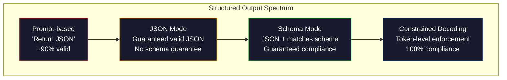
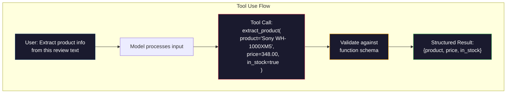

# 结构化输出:JSON、Schema Validation、Crestrained Decoding

> LLM'nin geri dönüşü bir satırdır. Uygulamanız JSON'a ihtiyaç duyar. Bu gerginlik, herhangi bir modelden daha fazla bir üretim sisteminin çökmesine neden olur.

**类型：**Yapım
**语言：**Python
**先修要求：**10. aşama, 01-05 dersleri (Çoktan LM)
**时间：**90 dakika kadar .
**相关内容：**5 · 20 aşama (Strukturlandırılmış Çıktıranlar ve Sınırlı Dekodlama) 涵盖 dekoder 层面的理论(FSM/CFG logit işlemcileri、Outlines、XGrammar)`response_format`、Antropik araç kullanımı 、Instruktor)  API altında neler olduğunu anlamak istiyorsanız önce 5 · 20 aşamasını okuyun.

## Öğrenme hedefi

- OpenAI ve Anthropic API 参数 kullanılarak JSON mod ve schema kısıtlı çıkışları gerçekleştirmek
- Pydantic onay aşamasını oluşturmak, yanlış bir LLM çıkışlarını reddetmek için,  yanlış bir karşı karşı karşıya tekrar deneme yapmak için
-  açıklama kısıtlı çözme  nasıl Token 层面强制生成有效 JSON,而无需后处理
- 设计稳健的抽取提示,将非结构化文本可靠地转换为类型化数据结构

## 问题

Siz LLM sorusunu soruyorsunuz:

```
The product is the Sony WH-1000XM5 headphones, which cost $348.00 and are currently in stock.
```

Bu tamamen doğru bir cevap. Uygulamanız için de tamamen kullanılmaz.`{"product": "Sony WH-1000XM5", "price": 348.00, "in_stock": true}`△You need a specific key、 specific type and specific value binding JSON nesneyi kullanmak zorunda değilsin.

朴素解法: 在快速里加上JSON中回答. Bu %90'da geçerlidir. %10'da ise, modelleri JSON'u işaretleme kod çitlerinde, ya da benzer şekilde paketleyecektir. İşte JSON:'un ön sözleri, ya da öncesinde kapanarak ifade sistemi oluşturduğu için JSON'ın etkisizliği yok. JSON'u oluşturan JSON ── JSON parseriniz 崩── Your pipeline 中断────加上试/除你 和再试──重试有时会产生不同的数据──现在你在解析循环问题上又一个一致性问题──

Bu hızlı mühendislik değil 问题──这是解码 问题──模型从左到右生成代币──在每个位置上,它会从10万多选项的词汇中选择最可能的下一个代币──在任意给定位置上,其中大多数选项都会产生无效的JSON──如果模型刚刚输出了`{"price":`,下一个标记 必须是数字、引号(string için kullanılır)`null`- Evet.`true`- Evet.`false`Ya da negatif sayı. Diğer tüm içerikler etkisiz JSON oluşturacaktır.

## 概念

###  Struktural Output Seviye

Strukturel çıkış kontrolü dört kat katlı, her kat önceki katlardan daha güvenilirdir.



**基于 Prompt**(Response in valid JSON): no mandat约束──模型通常遵守,但有时不会──可靠性:約 90%──失败模式:markdown fences、前言文本、截断输出、结构错误──

**JSON mode**API Güvenli Çıktı: Valide JSON。OpenAI `response_format: { type: "json_object" }`Bu modayı etkinleştirmek için, çıkış hata çözülmesi mümkündür. Ancak, bu, beklediğiniz schema'ya uygun değildir.

**Schema mode**API, bir JSON Şema'yı alır ve 2026 yılına kadar tüm ana sağlayıcıların bu noktayı desteklemesini sağlar.`response_format: { type: "json_schema", json_schema: {...} }`(Yalnızca geçiyor)`tool_choice="required"`)、Antropik araç kullanımı 配合 `input_schema`, ve Gemini'nin `response_schema`+ `response_mime_type: "application/json"`◊输遇包含你指定的精确钥──类型和约束──

**Constrained decoding**Çözüm: Çözüm sürecinde her bir Token'in konumunda, dekodör tümünü koruyacak ve tümünün etkin olmayan bir çıkışa yol açacak. Eğer bir şema bir sayı gerektiriyorsa ve model bir harf çıkarıyorsa, bu Token'in olasılıkları sıfır olarak belirlenecektir.

### JSON Şema:契约语言

JSON Schema, modelin hangi biçime sahip olması gerektiğini anlatmak için kullanılır. Tüm ana yapısal çıkış sistemleri bunu kullanır.

```json
{
  "type": "object",
  "properties": {
    "product": { "type": "string" },
    "price": { "type": "number", "minimum": 0 },
    "in_stock": { "type": "boolean" },
    "categories": {
      "type": "array",
      "items": { "type": "string" }
    }
  },
  "required": ["product", "price", "in_stock"]
}
```

Şema gösterir: output bir nesne olmalıdır, içerir string 类型 `product`、非负数 类型 `price`、boolean 类型 `in_stock`, ve seçilebilir bir dizilme numarası `categories`                                                                                                                                                                                                                                                              

Şemalar zorluk durumunu işleyebilir:嵌套 nesneler、包含类型化对象的阵列、enums(将字符串 约束到特定取值)、模式匹配(对字符串使用regex),以及组合器(用于多态输出oneOf、任何Of、allOf) ⋅

### Pydantik 模式

Python'da, JSON Şema'yı elle yazmazsınız.

```python
from pydantic import BaseModel

class Product(BaseModel):
    product: str
    price: float
    in_stock: bool
    categories: list[str] = []
```

Bu, yukarıdaki JSON Şema ile aynı JSON Şemaı oluşturur. İnstruktor kütüphanesi ve OpenAI'nin SDK'sı doğrudan Pydantic modellerini kabul edebilir: model sınıfına geçiyor, bir deney örneğine geri döner.

### Fonksiyon Çağrıları / Araç Kullanımı

Bu aynı sorunun başka bir arayüzüdür. JSON'u doğrudan üretmek için model oluşturmak yerine, bir tür türden yapılandırma parametresi oluşturmak için bir tür türden araçlar oluşturmak için bir türden bir iletişim oluşturmak için bir türden bir iletişim oluşturmak için bir türden bir iletişim oluşturmak için bir türden bir iletişim oluşturmak için bir türden bir iletişim oluşturmak için bir türden bir iletişim oluşturmak için bir türden bir iletişim oluşturmak için bir türden bir iletişim oluşturmak için bir türden bir iletişim oluşturmak için bir türden bir iletişim oluşturmak için bir türden bir iletişim oluşturmak için bir türden bir iletişim oluşturmak için bir türden bir iletişim oluşturmak için bir türden bir iletişim oluşturmak için bir türden bir iletişim oluşturmak için bir türden bir iletişim oluşturmak için bir yöntem oluşturmak için bir yöntem oluşturmak için bir yöntem oluşturmak için bir yöntem oluşturmak için bir yöntem oluşturmak için bir yöntem oluşturmak için bir yöntem oluşturmak için bir yöntem oluşturmak için bir yöntem oluşturmak için bir yöntem oluşturmak için bir yöntem oluşturmak için bir yöntem oluşturmak için bir yöntem oluşturmak için bir yöntem oluşturmak için bir yöntem oluşturmak için bir yöntem oluşturmak için bir yöntemdir.



Model, sadece parametre doldururken değil, hangi işlevi kullanmayı seçerken, araç kullanmak daha uygun olur. Eğer 10 farklı çekim şeması varsa, model de doğru bir giriş seçeneğine göre kullanmalıdır.

### 常见失败模式

Şema uygulanması olsa bile yapısal çıkışlar, küçük bir şekilde başarısız olabilir.

**幻觉值**Bu da bir örnek. Bu da bir örnek.`{"price": 299.99}` Şema doğrulama 捕捉不到这一点类型正确,但值错误──

**Enum 混淆**Sen de bu kadar.`["in_stock", "out_of_stock", "preorder"]` Model Output `"available"`语义正确, fakat集合中允许中では。优秀的限制式解码可以避免这一点──基于快速的方法不能──

**嵌套 object 深度**Bu nedenle, bu sistemin en önemli yönleri, daha fazla hata oluşur.

**Array 长度**Model: Model: Array'da fazla veya fazla az öğe üretmek mümkün.`minItems`和 `maxItems`Ancak tüm tedarikçiler bunları açıklama aşamasında zorla yerine getirmezler.

**可选字段省略**Modeller teknik olarak seçilebilecekleri noktaları kaydetir, ancak kullanım örneklerinizin anlamda önemli bölümleri vardır. Veriler eksik olsa bile, bunları şema içinde gerekli  zorlayıcı model açık üretimi için ayarlamak gerekir.`null`- Evet.


```figure
mx-schema-funnel
```

## Yapın onu.

### 步骤1:JSON Şema Doğrulama

Python nesnesinin JSON Şema'ya uygun olup olmadığını kontrol etmek için bir onaylayıcı oluşturmak için.

```python
import json

def validate_schema(data, schema):
    errors = []
    _validate(data, schema, "", errors)
    return errors

def _validate(data, schema, path, errors):
    schema_type = schema.get("type")

    if schema_type == "object":
        if not isinstance(data, dict):
            errors.append(f"{path}: expected object, got {type(data).__name__}")
            return
        for key in schema.get("required", []):
            if key not in data:
                errors.append(f"{path}.{key}: required field missing")
        properties = schema.get("properties", {})
        for key, value in data.items():
            if key in properties:
                _validate(value, properties[key], f"{path}.{key}", errors)

    elif schema_type == "array":
        if not isinstance(data, list):
            errors.append(f"{path}: expected array, got {type(data).__name__}")
            return
        min_items = schema.get("minItems", 0)
        max_items = schema.get("maxItems", float("inf"))
        if len(data) < min_items:
            errors.append(f"{path}: array has {len(data)} items, minimum is {min_items}")
        if len(data) > max_items:
            errors.append(f"{path}: array has {len(data)} items, maximum is {max_items}")
        items_schema = schema.get("items", {})
        for i, item in enumerate(data):
            _validate(item, items_schema, f"{path}[{i}]", errors)

    elif schema_type == "string":
        if not isinstance(data, str):
            errors.append(f"{path}: expected string, got {type(data).__name__}")
            return
        enum_values = schema.get("enum")
        if enum_values and data not in enum_values:
            errors.append(f"{path}: '{data}' not in allowed values {enum_values}")

    elif schema_type == "number":
        if not isinstance(data, (int, float)):
            errors.append(f"{path}: expected number, got {type(data).__name__}")
            return
        minimum = schema.get("minimum")
        maximum = schema.get("maximum")
        if minimum is not None and data < minimum:
            errors.append(f"{path}: {data} is less than minimum {minimum}")
        if maximum is not None and data > maximum:
            errors.append(f"{path}: {data} is greater than maximum {maximum}")

    elif schema_type == "boolean":
        if not isinstance(data, bool):
            errors.append(f"{path}: expected boolean, got {type(data).__name__}")

    elif schema_type == "integer":
        if not isinstance(data, int) or isinstance(data, bool):
            errors.append(f"{path}: expected integer, got {type(data).__name__}")
```

### 步骤 2:Pydantik 风格 Model to Schema

构建一个最小的类到方案转换器──定义一个Python类,并自动生成它的JSON Schema──

```python
class SchemaField:
    def __init__(self, field_type, required=True, default=None, enum=None, minimum=None, maximum=None):
        self.field_type = field_type
        self.required = required
        self.default = default
        self.enum = enum
        self.minimum = minimum
        self.maximum = maximum

def python_type_to_schema(field):
    type_map = {
        str: "string",
        int: "integer",
        float: "number",
        bool: "boolean",
    }

    schema = {}

    if field.field_type in type_map:
        schema["type"] = type_map[field.field_type]
    elif field.field_type == list:
        schema["type"] = "array"
        schema["items"] = {"type": "string"}
    elif isinstance(field.field_type, dict):
        schema = field.field_type

    if field.enum:
        schema["enum"] = field.enum
    if field.minimum is not None:
        schema["minimum"] = field.minimum
    if field.maximum is not None:
        schema["maximum"] = field.maximum

    return schema

def model_to_schema(name, fields):
    properties = {}
    required = []

    for field_name, field in fields.items():
        properties[field_name] = python_type_to_schema(field)
        if field.required:
            required.append(field_name)

    return {
        "type": "object",
        "properties": properties,
        "required": required,
    }
```

### 步骤 3: Sınırlı Token Filtresi

模拟限制式解码──给定一个部分 JSON string 和一个 schema,判断当前位点哪些 Token 类别是有效的──

```python
def next_valid_tokens(partial_json, schema):
    stripped = partial_json.strip()

    if not stripped:
        return ["{"]

    try:
        json.loads(stripped)
        return ["<EOS>"]
    except json.JSONDecodeError:
        pass

    last_char = stripped[-1] if stripped else ""

    if last_char == "{":
        return ['"', "}"]
    elif last_char == '"':
        if stripped.endswith('":'):
            return ['"', "0-9", "true", "false", "null", "[", "{"]
        return ["a-z", '"']
    elif last_char == ":":
        return [" ", '"', "0-9", "true", "false", "null", "[", "{"]
    elif last_char == ",":
        return [" ", '"', "{", "["]
    elif last_char in "0123456789":
        return ["0-9", ".", ",", "}", "]"]
    elif last_char == "}":
        return [",", "}", "]", "<EOS>"]
    elif last_char == "]":
        return [",", "}", "<EOS>"]
    elif last_char == "[":
        return ['"', "0-9", "true", "false", "null", "{", "[", "]"]
    else:
        return ["any"]

def demonstrate_constrained_decoding():
    partial_states = [
        '',
        '{',
        '{"product"',
        '{"product":',
        '{"product": "Sony"',
        '{"product": "Sony",',
        '{"product": "Sony", "price":',
        '{"product": "Sony", "price": 348',
        '{"product": "Sony", "price": 348}',
    ]

    print(f"{'Partial JSON':<45} {'Valid Next Tokens'}")
    print("-" * 80)
    for state in partial_states:
        valid = next_valid_tokens(state, {})
        display = state if state else "(empty)"
        print(f"{display:<45} {valid}")
```

### 4 adım: Pipeline çekmek

Tüm içeriği bir çekim borusunu oluşturmak: tanımlama şeması, LLM'yi oluşturmak, yapılandırılmış çıkış, test çıkışı,并处理重试――

```python
def simulate_llm_extraction(text, schema, attempt=0):
    if "headphones" in text.lower() or "sony" in text.lower():
        if attempt == 0:
            return '{"product": "Sony WH-1000XM5", "price": 348.00, "in_stock": true, "categories": ["audio", "headphones"]}'
        return '{"product": "Sony WH-1000XM5", "price": 348.00, "in_stock": true}'

    if "laptop" in text.lower():
        return '{"product": "MacBook Pro 16", "price": 2499.00, "in_stock": false, "categories": ["computers"]}'

    return '{"product": "Unknown", "price": 0, "in_stock": false}'

def extract_with_retry(text, schema, max_retries=3):
    for attempt in range(max_retries):
        raw = simulate_llm_extraction(text, schema, attempt)

        try:
            data = json.loads(raw)
        except json.JSONDecodeError as e:
            print(f"  Attempt {attempt + 1}: JSON parse error -- {e}")
            continue

        errors = validate_schema(data, schema)
        if not errors:
            return data

        print(f"  Attempt {attempt + 1}: Schema validation errors -- {errors}")

    return None

product_schema = {
    "type": "object",
    "properties": {
        "product": {"type": "string"},
        "price": {"type": "number", "minimum": 0},
        "in_stock": {"type": "boolean"},
        "categories": {"type": "array", "items": {"type": "string"}},
    },
    "required": ["product", "price", "in_stock"],
}
```

### 5 adım: Çöp hattı

```python
def run_demo():
    print("=" * 60)
    print("  Structured Output Pipeline Demo")
    print("=" * 60)

    print("\n--- Schema Definition ---")
    product_fields = {
        "product": SchemaField(str),
        "price": SchemaField(float, minimum=0),
        "in_stock": SchemaField(bool),
        "categories": SchemaField(list, required=False),
    }
    generated_schema = model_to_schema("Product", product_fields)
    print(json.dumps(generated_schema, indent=2))

    print("\n--- Schema Validation ---")
    test_cases = [
        ({"product": "Test", "price": 10.0, "in_stock": True}, "Valid object"),
        ({"product": "Test", "price": -5.0, "in_stock": True}, "Negative price"),
        ({"product": "Test", "in_stock": True}, "Missing price"),
        ({"product": "Test", "price": "ten", "in_stock": True}, "String as price"),
        ("not an object", "String instead of object"),
    ]

    for data, label in test_cases:
        errors = validate_schema(data, product_schema)
        status = "PASS" if not errors else f"FAIL: {errors}"
        print(f"  {label}: {status}")

    print("\n--- Constrained Decoding Simulation ---")
    demonstrate_constrained_decoding()

    print("\n--- Extraction Pipeline ---")
    texts = [
        "The Sony WH-1000XM5 headphones are priced at $348 and currently available.",
        "The new MacBook Pro 16-inch laptop costs $2499 but is sold out.",
        "This is a random sentence with no product info.",
    ]

    for text in texts:
        print(f"\n  Input: {text[:60]}...")
        result = extract_with_retry(text, product_schema)
        if result:
            print(f"  Output: {json.dumps(result)}")
        else:
            print(f"  Output: FAILED after retries")
```

## Kullan

### OpenAI Yapılandırılmış Çıktıranlar

```python
# from openai import OpenAI
# from pydantic import BaseModel
#
# client = OpenAI()
#
# class Product(BaseModel):
#     product: str
#     price: float
#     in_stock: bool
#
# response = client.beta.chat.completions.parse(
#     model="gpt-5-mini",
#     messages=[
#         {"role": "system", "content": "Extract product information."},
#         {"role": "user", "content": "Sony WH-1000XM5, $348, in stock"},
#     ],
#     response_format=Product,
# )
#
# product = response.choices[0].message.parsed
# print(product.product, product.price, product.in_stock)
```

OpenAI'nin yapılandırılmış çıkış modusu içeride kısıtlı çözme kullanımında kullanılır. Model üretilen her bir token, Pydantic şemalarının çıkışına uygun olarak üretildiği garanti altına alınır.

### Antropik Araç Kullanımı

```python
# import anthropic
#
# client = anthropic.Anthropic()
#
# response = client.messages.create(
#     model="claude-opus-4-7",
#     max_tokens=1024,
#     tools=[{
#         "name": "extract_product",
#         "description": "Extract product information from text",
#         "input_schema": {
#             "type": "object",
#             "properties": {
#                 "product": {"type": "string"},
#                 "price": {"type": "number"},
#                 "in_stock": {"type": "boolean"},
#             },
#             "required": ["product", "price", "in_stock"],
#         },
#     }],
#     messages=[{"role": "user", "content": "Extract: Sony WH-1000XM5, $348, in stock"}],
# )
```

Antropik  aracı kullanımı  yapılandırılmış çıkışı gerçekleştirmek için 模型 will issue a tool call, which contains matching input_schema's structured arguments── result is the same, API surface is different──

### Eğitmen Kütüphanesi

```python
# pip install instructor
# import instructor
# from openai import OpenAI
# from pydantic import BaseModel
#
# client = instructor.from_openai(OpenAI())
#
# class Product(BaseModel):
#     product: str
#     price: float
#     in_stock: bool
#
# product = client.chat.completions.create(
#     model="gpt-5-mini",
#     response_model=Product,
#     messages=[{"role": "user", "content": "Sony WH-1000XM5, $348, in stock"}],
# )
```

Eğitmen  paket istedik LLM müşteri,并加入带验证的自动重试―― eğer ilk kez deney 验证 失败, bu hata bağlamı olarak 发送给模型,并要求模型修复输出―― Bu herhangi bir sağlayıcı için geçerlidir, sadece OpenAI değil.

## - Söyle.

本课会产 出 `outputs/prompt-structured-extractor.md` Bir tekrarlanabilir çabuk şablon, schema tanımına göre herhangi bir metinden yapılandırılmış verileri çekmek için kullanılır. JSON Schema ve yapılandırılmamış metin verildiğinde, test edilmiş JSON'u geri gönderir.

Yine ortaya çıkacak.`outputs/skill-structured-outputs.md` Bir karar çerçevesini, sağlayıcıya göre kullanılır  güvenilirlik gereksinimleri ve şema  karmaşıklık doğru yapılandırılmış çıkış stratejisini seçmek için

## 练习

1. 扩展 schema validator,使其支持 `oneOf`(veriler birden fazla şema arasında doğru bir şekilde uyumlu olmalıdır)`Product`nesne, de olabilir farklı şekil.`Service`nesne

2. Şema farklılıkları aracı oluşturmak, iki şema karşılaştırmak için, şema farklılıklarını tanımlamak için, şema farklılıklarını tanımlamak için, şema farklılıklarını tanımlamak için, şema farklılıklarını tanımlamak için, şema farklılıklarını tanımlamak için, şema farklılıklarını tanımlamak için, şema farklılıklarını tanımlamak için, şema farklılıklarını tanımlamak için, şema farklılıklarını tanımlamak için, şema farklılıklarını tanımlamak için, şema farklılıklarını tanımlamak için, şema farklılıklarını tanımlamak için, şema farklılıklarını tanımlamak için, şemaları yenileştirmek için, şemaları genişletmek için, şemaları genişletmek için, şemaları genişletmek için, şemaları genişletmek için, şemaları oluşturmak için şema şemalar şemalar şemalar şemalar şema şema  şema şema  şema   şema     şema                                                                                                               

3. 实现一个更真实的限制式解码模拟器──给定一个 JSON Schema 和一个包含100 个 Token 的词汇――字母、数字、点句、关键字),逐步走过代,在每个位置屏蔽不有效 Tokens──衡量每一步词汇中有效 Token 的比例──

4.  oluşturmak                                                                                                                                                                                                                                                             

5. Çöpleme borusunuzu oluşturmak için  güven puanları ── her çekim bölümüne güven, tahmin modeli ──────────────────────────────────────────────────────────────────────────────────────────────────────────────────────────────────────────────────────────────────────────────────────────────────────────────────────────────────────────────────────────────────────────────────────────────────────────────────────────────────────────────────────────────────────────────────────────────────────────────────────────────────────────────────────────────────────────────────────────────────────────────────────────────────────────────────────────────────────────────────────────────────────────────────────────────────────────────────────────────────────────────────────────────────────────────────────────────────────────────────────────────────────────────────────────────────────────────────────────────────────────────────────────────────────────────────────────────────────────────────────────────────────────────────────────────────────────────────────────────────

## 关键术语

| Term | 人们通常怎么说 | 它实际意味着什么 |
|------|----------------|----------------------|
| JSON mode | “返回 JSON” | 一个 API flag，保证输出在语法上是有效 JSON，但不强制任何特定 schema |
| Structured output | “类型化 JSON” | 匹配特定 JSON Schema 的输出，具有正确的 key、type 和 constraint |
| Constrained decoding | “引导式生成” | 在每个 Token 位置屏蔽会产生无效输出的 Tokens——保证 100% schema compliance |
| JSON Schema | “一个 JSON template” | 用于描述 JSON 数据结构、type 和 constraint 的声明式语言（被 OpenAPI、JSON Forms 等使用） |
| Pydantic | “Python dataclasses+” | Python library，用于定义带有 type validation 的 data models，FastAPI 和 Instructor 使用它生成 JSON Schemas |
| Function calling | “Tool use” | LLM 输出结构化 function invocation（name + typed arguments），而不是 free text——OpenAI 和 Anthropic 都支持 |
| Instructor | “面向 LLMs 的 Pydantic” | Python library，用于包装 LLM clients 以返回经过验证的 Pydantic instances，并在 validation failure 时自动 retry |
| Token masking | “过滤 vocabulary” | 在 generation 期间将特定 Token probabilities 设为零，使模型无法生成它们 |
| Schema compliance | “匹配形状” | 输出包含每个 required field、正确 types、约束范围内的 values，并且没有额外的不允许字段 |
| Retry loop | “不断重试直到成功” | 将 validation errors 发回给模型，并要求它修复输出——Instructor 会自动执行这一点，最多重试到可配置上限 |

## 延伸阅读

- [OpenAI Structured Outputs Guide](https://platform.openai.com/docs/guides/structured-outputs)OpenAI API 中 JSON Şema'ya dayalı kısıtlı çözme 官方文档
- [Willard & Louf, 2023——“Efficient Guided Generation for Large Language Models”](https://arxiv.org/abs/2307.09702)Şöhret 论文, nasıl JSON Şemaları 编译为有限状态机实现的代币级约束
- [Instructor documentation](https://python.useinstructor.com/)Pydantic doğrulama ve geri deney kullanmak Pydantic doğrulama ve geri deney Pydantic doğrulama ve geri deney Pydantic doğrulama Pydantic doğrulama Pydantic doğrulama Pydantic doğrulama Pydantic doğrulama Pydantic doğrulama Pydantic doğrulama Pydantic doğrulama Pydantic doğrulama Pydantic doğrulama Pydantic doğrulama Pydantic doğrulama Pydantic doğrulama Pydantic doğrulama Pydantic doğrulama Pydantic doğrulama Pydantic doğrulama Pydantic doğrulama Pydantic doğrulama Pydantic doğrulama Pydantic doğrulama Pydantic doğrulama Pydantic doğrulama Pydantic doğrulama Pydantic doğrulama Pydantic doğrulama Pydantic doğrulama Pidantic doğrulama 
- [Anthropic Tool Use Guide](https://docs.anthropic.com/en/docs/tool-use)Claude  nasıl araç kullanımı ile 和 JSON Schema input_schema  yapılandırılmış çıkış gerçekleştirmek
- [JSON Schema specification](https://json-schema.org/) tüm ana yapılandırılmış çıkış 系统使用的方案语言 完整规范
- [Outlines library](https://github.com/outlines-dev/outlines) regex ve编译为有限状态机的 JSON Schema 开源限制生成
- [Dong et al., “XGrammar: Flexible and Efficient Structured Generation Engine for Large Language Models” (MLSys 2025)](https://arxiv.org/abs/2411.15100)                                                                                                                                                                                                                                                              
- [Beurer-Kellner et al., “Prompting Is Programming: A Query Language for Large Language Models” (LMQL)](https://arxiv.org/abs/2212.06094)LMQL 论文, 将限制式解码表述为带有类型和值限制的查询语言──
- [Microsoft Guidance (framework docs)](https://github.com/guidance-ai/guidance)Şablon yönlendirilmiş kısıtlı nesil;Könüllü ve XGrammar'ın tedarikçi-agnostik 补充──
