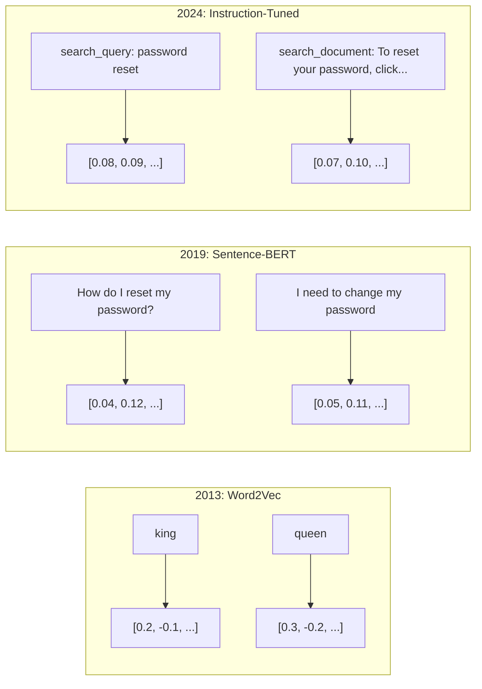
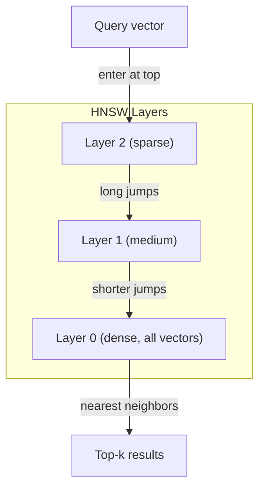
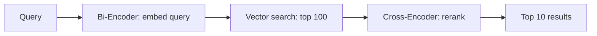

# Eklemler ve vektör göster

> 文本是离散的──数学是连续的── 每当你要求LLM 查找相似文档、比较含义,或超越关键词进行搜索时,你都依赖于连接这两个世界的一个桥──这个桥就是嵌入──如果你不理解嵌入──你就不理解现代AI──你只是会使用它──

**Type:** Build
**Languages:** Python
**Prerequisites:** Phase 11, Lesson 01 (Prompt Engineering)
**Time:** ~75 minutes
**Related:**5 · 22 (Embedding Models Deep Dive) 涵盖密集 VS稀 VS çok vektör、Matryoshka 截断,以及按轴选择模型──本课聚焦生产管eline(vektor DBs、HNSW、相似度数学)──在选择模型之前,请先阅读Phase 5 · 22──

## Öğrenme hedefi
- API sağlayıcıları ve açık kaynaklı modeller kullanın.
- 解释为什么嵌入式 能解决关键词搜索 无法处理的词汇不匹配问题 解释为什么嵌入式 能解决关键词搜索 无法处理的词汇不匹配问题
- Construct a semantic search index, according to meaning rather than precise keywords match to search document
- kullanın geri alım referansları(precision@k、recall) değerlendirmek Embedding 质量,并为你的任务选择合适的 Embedding model

## 问题
                                                                                                                                                                                                                                                              

İşte sözcük kaynağı eşleşme sorunu budur. İnsan dilinde aynı şeyi ifade etmenin birçok yolu vardır. Anahtar kelime arama.

 You need a text representation, let similarity be decided by meaning, rather than by spelling decided. You need a method, My payment didn't go through 和 transaction was declined 放 into some mathematical space in a nearby position, simultaneously my payment arrived on time 推得很远, even if it shared payment 这个词──

Bu ifade yerleştirme demek.

## 概念
### Bir İçeride Yerleşme Nedir?

Eklenti, metin anlamını ifade etmek için kullanılan bir sıfır vektördür.

Kediler yatağa oturmuş, sanki bir şey gibiydi.`[0.023, -0.041, 0.087, ..., 0.012]`Modeline göre farklı olan bir şey, 768 ila 3072 rakamları içeren bir liste. Bu rakamlar anlamı kodlamıştır.

### Word2Vec'in Yürüyüşü

2013 yılında, Google'dan Tomas Mikolov ve meslektaşları Word2Vec──核心洞见是:训练一个神经网络,根据邻近词预测一个词(或根据一个词预测邻近词),隐藏层权重就会变成有意的矢量表示──

著名结果:

```
king - man + woman = queen
```

Sözcük yerleştirmeleri için vektör aritmetik yapılır. man to woman yönünden man to woman yönüne, king to queen yönüne benzer şekilde man to woman yönüne ulaşılabilir.

Word2Vec 300 维 vektörüne dönüştürülmüştür. Her kelime ne olursa olsun, sadece bir vektör vardır.

### Sözlerden cümlelere

Sözcük yerleştirmeleri tek bir Token'i ifade eder. Produksi sistem tüm cümle, bölüm veya dosya için yerleştirme yapılması gerekir.

**Averaging**:取句中所有词向量的平均值──成本低、有损,但对短文出奇地还不错──它完全失去了词序狗咬人 和 狗咬人 会得到相同的嵌入──

**CLS token**:transformer modelleri(BERT, 2018)输出一个特殊的 [CLS] token embedding,表示整个输入──比平均更好,但[CLS] token is for next-sentence prediction 训练的,不是为相似度训练的──

**Contrastive learning**Bu yöntemin kullanılması, modern gömleyiş modellerinin temeli haline geldi.    Parolamı nasıl yeniden ayarlayabilirim?   Parolamı değiştirmem gerekiyor, 模型 öğrenir ki neredeyse aynı vektörlere sahip olmalıdırlar。

**Instruction-tuned embeddings**:最新方法──E5 和 GTE 等模型接受任务前(search_query:、 search_document:), modelin hangi tür yerleşim oluşturması gerektiğini söyle.



### Modern İçeriği Modeller

Markete birkaç üretim derecesi seçeneği geldi.

| Model | Provider | Dimensions | MTEB | Context | Cost / 1M tokens |
|-------|----------|-----------|------|---------|------------------|
| Gemini Embedding 2 | Google | 3072 (Matryoshka) | 67.7 (retrieval) | 8192 | $0.15 |
| embed-v4 | Cohere | 1024 (Matryoshka) | 65.2 | 128K | $0.12 |
| voyage-4 | Voyage AI | 1024/2048 (Matryoshka) | 66.8 | 32K | $0.12 |
| text-embedding-3-large | OpenAI | 3072 (Matryoshka) | 64.6 | 8192 | $0.13 |
| text-embedding-3-small | OpenAI | 1536 (Matryoshka) | 62.3 | 8192 | $0.02 |
| BGE-M3 | BAAI | 1024 (dense+sparse+ColBERT) | 63.0 multilingual | 8192 | Open-weight |
| Qwen3-Embedding | Alibaba | 4096 (Matryoshka) | 66.9 | 32K | Open-weight |
| Nomic-embed-v2 | Nomic | 768 (Matryoshka) | 63.1 | 8192 | Open-weight |

MTEB(Massive Text Embedding Benchmark) v2  100+ 个任务, including retrieval, classification, clustering, re-ranking 和 summation──分数越高越好── until 2026 年, open-weight models(Qwen3-Embedding、BGE-M3) 

### Benzerlik Metrikleri

İki yerleştirme vektörü verildiğinde, onları ölçmek için üç yol vardır.

**Cosine similarity**İki vektör arasındaki 角in 余弦值── -1 相反) ile 1 方向相同)  忽略大小 Eğer bir 10 词句と一 500 词文档が同じ方向を指すならば, 1.0  ∈ 0.0 ∈ 0.0 ∈ 0.0 ∈ 0.0 ∈ 0.0 ∈ 0.0 ∈ 0.0 ∈ 0.0 ∈ 0.0 ∈ 0.0 ∈ 0.0 ∈ 0.0 ∈ 0.0 ∈ 0.0 ∈ 0.0 ∈ 0.0 ∈ 0.0 ∈ 0.0 ∈ 0.0 ∈ 0.0 ∈ 0.0 ∈ 0.0 ∈ 0.0 ∈ 0.0 ∈ 0.0 ∈ 0.0 ∈ 0.0 ∈ 0.0 ∈ 0.0 ∈ 0.0 ∈ 0.0 ∈ 0.0 ∈ 0.0 ∈ 0.0 ∈ 0.0 ∈ 0.0 ∈ 0.0 ∈ 0.0 ∈ 0.0 ∈ 0.0 ∈ 0.0 ∈ 0.0 ∈ 0.0 ∈ 0.0 ∈ 0.0 ∈ 0.0 ∈ 0.0 ∈ 0.0 ∈ 0.0 ∈ 0.0 ∈ 0.0 ∈ 0.

```
cosine_sim(a, b) = dot(a, b) / (||a|| * ||b||)
```

**Dot product**İki vektörün orijinal içi oluşumu. Vektörler 归化 (yüksek uzunluk) olduğunda, kozin benzerliği ile 归化 (eşitli) olur.

```
dot(a, b) = sum(a_i * b_i)
```

**Euclidean (L2) distance**:Vektor  uzaydaki düz çizgi mesafe¬¬¬越小 = 越相似¬¬¬¬ büyük farklara duyarlı¬¬¬¬¬¬¬¬¬¬¬¬¬¬¬¬¬¬¬¬¬¬¬¬¬¬¬¬¬¬¬¬¬¬¬¬¬¬¬¬¬¬¬¬¬¬¬¬¬¬¬¬¬¬¬¬¬¬¬¬¬¬¬¬¬¬¬¬¬¬¬¬¬¬¬¬¬¬¬¬¬¬¬¬¬¬¬¬¬¬¬¬¬¬¬¬¬¬¬¬¬¬¬¬¬¬¬¬¬¬¬¬¬¬¬¬¬¬¬¬¬¬¬¬¬¬¬¬¬¬¬¬¬¬¬¬¬¬¬¬¬¬¬¬¬¬¬¬¬¬¬¬¬¬¬¬¬¬¬¬¬¬¬¬¬¬¬¬¬¬¬¬¬¬¬¬¬¬¬¬¬¬¬¬¬¬¬¬¬¬¬¬¬¬¬¬¬¬¬¬¬¬¬¬¬¬¬¬¬¬¬¬¬¬¬¬¬¬¬¬¬¬¬¬¬¬¬¬¬¬¬¬¬¬¬¬¬¬¬¬¬¬¬¬¬¬¬¬¬¬¬¬¬¬¬¬¬¬¬¬¬¬¬¬¬¬¬¬¬¬¬¬¬¬¬¬¬¬¬¬¬¬¬¬¬¬¬¬¬¬¬¬¬¬¬¬¬¬¬¬¬¬¬¬¬¬¬¬¬¬¬¬¬¬¬¬¬¬¬¬¬¬¬¬¬¬¬¬¬¬¬¬¬¬¬¬¬¬¬¬¬¬¬¬¬¬¬¬¬¬¬¬¬¬¬¬¬¬¬¬¬¬¬¬¬¬¬¬¬¬¬¬¬¬¬¬¬¬¬¬¬¬¬¬¬¬¬¬¬¬¬¬¬¬¬¬¬¬¬¬¬¬¬¬¬¬¬¬¬¬¬¬¬¬¬¬¬¬¬¬¬¬¬¬¬¬¬¬¬¬¬¬¬¬¬¬¬¬¬¬¬¬¬¬¬¬¬¬¬¬¬¬¬¬¬¬¬¬¬¬¬¬¬¬¬¬¬¬¬¬¬¬¬¬¬¬¬¬¬

```
L2(a, b) = sqrt(sum((a_i - b_i)^2))
```

何時使用哪一种:

| Metric | Use when | Avoid when |
|--------|----------|------------|
| Cosine similarity | 比较长度不同的文本；大多数 retrieval 任务 | 大小携带信息 |
| Dot product | Embeddings 已经归一化；需要最高速度 | Vectors 大小不同 |
| Euclidean distance | Clustering；空间 nearest-neighbor 问题 | 比较长度差异巨大的文档 |

### Vektör Veritabanları ve HNSW

暴力相似度 arama sorguları her depolanmış vektör ile birbiriyle karşılaştırır.

Vector veritabanları Using Approximate Nearest Neighbor (ANN) algoritması solve this problem (HNSW)

1. Bir çok katlı vektör grafiği oluştur
2. Yukarı katılıklar arasında uzun mesafeli bağlantılar kurulur.
3. Alt kat yoğun bir  yakın vektörler arasında küçük bir bağlantı oluşturur
4. Arama üst düzeyden başlıyor, açgözlülük düşüyor ve yavaş yavaş ayrıntılılaşıyor.
5. 以 O(log n) 时间返回近似 top-k sonuçları, yerine O(n)

HNSW'nin çok küçük doğruluk oranı kaybı (genellikle 95-99% hatırlama) büyük hızla yükselmeye dönüştürülür.



生产选项:

| Database | Type | Best for | Max scale |
|----------|------|----------|-----------|
| Pinecone | Managed SaaS | 零运维生产环境 | Billions |
| Weaviate | Open source | 自托管、hybrid search | 100M+ |
| Qdrant | Open source | 高性能、过滤 | 100M+ |
| ChromaDB | Embedded | 原型开发、本地开发 | 1M |
| pgvector | Postgres extension | 已经使用 Postgres | 10M |
| FAISS | Library | 进程内、研究 | 1B+ |

### Çürükleme Strategiları

文档太长,不能作为单个矢量 进行嵌入──一个50页 PDF 覆盖几十个主题它的嵌入会变成所有内容的平均值,结果不像任何具体内容──你要把文档切成块,并对每块做嵌入──

**Fixed-size chunking**: Her N 个 Token 切分一次,并带 M-token重叠──简单且可预测──当文档没有清晰结构时效果很好──一个512-token 带50-token重叠:chunk 1 是 tokens 0-511,chunk 2 是 tokens 462-973──

**Sentence-based chunking**Sıfır sınır kesiminde, cümle bölümü belirtici sınırına ulaşana kadar, her parça en az bir bütün cümleyi içerir.

**Recursive chunking**İlk önce en büyük sınırlarda sınırlar deneyin. Eğer çok büyükse, paragraf sınırlarını tekrar deneyin.`RecursiveCharacterTextSplitter`Karışık biçimli vücutlar için çok iyi bir etki.

**Semantic chunking**: Her cümle için embed yapın, sonra embed yapın, ancak en fazla embed yapılması gereken parçalar üretmek için, benzerlik bir değerden düşük bir değerde embed yapılırsa, yeni bir parça başlatın.

| Strategy | Complexity | Quality | Best for |
|----------|-----------|---------|----------|
| Fixed-size | Low | Decent | 非结构化文本、logs |
| Sentence-based | Low | Good | 文章、emails |
| Recursive | Medium | Good | Markdown、HTML、mixed docs |
| Semantic | High | Best | 对 retrieval 质量要求关键的场景 |

%25,56-5,12 token parçaları, 50 token üst üste geçiyor.

### Bi-Enkodlayıcılarla Çapraz-Enkodlayıcılara karşı

Bi-encoder 会独立对查询 和文档做嵌入,然后比较向量──速度快你只需要对查询做一次嵌入,然后与预先计算好的文档嵌入比较──这是检索的方法──

Çarşı-kodlayıcı bir sorgulama ve bir belgeyi tek bir giriş olarak, bir de çıkarma oranı olarak kullanacaktır.

生产模式是:bi-encoder 检查 top-100 aday,cross-encoder 将其重排至前-10──这是检索然后重排管道──



Ranking Models:Cohere Ranking 3.5(per 1000 kez sorgu $2)、BGE-renanker-v2(免费,open source)、Jina Renanker v2(免费,open source)。

### Matryoshka Eklemleri

传统嵌入式是全有或全无──一个1536 维矢量 使用1536 浮游式──你不能在不重训的情况下截断到256 维──

Matryoshka Temsil Etme Öğrenmesi ((Kusupati et al., 2022) bu sorunu düzeltti. Model, en önemli bilgileri ilk N 个维度捕捉 olarak eğitilmiştir, 像俄罗斯套娃──把一个1536-d Matryoshka嵌入 截截断到 256 维会损失一些准确率,但仍然可用──

OpenAI'nin metin yerleştirme-3 küçük 和 metin yerleştirme-3 büyük 通過`dimensions`参数支持 Matryoshka 截断── request 256 维 ve 1536 维 yerine, depolama 6 kat azalmıştır, MTEB referans değerlerinde yukarı doğru oranı yaklaşık %3-5% kaybı──

### Çiftlik Kvantizasyon

Bir 1536 维 embed et float32  depolama 6,144 字节── çarpı 1000 milyon dosya: sadece vektörler 61 GB gerekir──

Çiftlik kuantizasyonu Her akışını 转成单个位:正值变成1,负值变成0──存储从 6,144 字节降至192 字节减少32 倍──相似度使用 Hamming distance(统计不同位数)计算,CPU单条命令完成──

Arama geri çağırma doğruluk oranı yaklaşık% 5-10'dur. Genel model: önce biner kuantizasyon kullanarak milyonlarca vektör üzerinde ilk arama yapın, sonra üst 1000 ağırlıklı vektörlerle tam doğruluklı bir arama yapın. Böylece, 32 kat daha az kayda sahip olmakla %95'den fazla tam doğruluk oranını elde edebilirsiniz.


```figure
cosine-similarity
```

## Yapın onu.
Biz ise bir semantik arama motoru inşa etmeye başladık. Vectör veritabanını kullanmadık. Dış içe aktarma API'si kullanmadık. Python ve numpy ile matematik hesaplama yapıyoruz.

### 步骤 1: Metin Çıkartılması

```python
def chunk_text(text, chunk_size=200, overlap=50):
    words = text.split()
    chunks = []
    start = 0
    while start < len(words):
        end = start + chunk_size
        chunk = " ".join(words[start:end])
        chunks.append(chunk)
        start += chunk_size - overlap
    return chunks


def chunk_by_sentences(text, max_chunk_tokens=200):
    sentences = text.replace("\n", " ").split(".")
    sentences = [s.strip() + "." for s in sentences if s.strip()]
    chunks = []
    current_chunk = []
    current_length = 0
    for sentence in sentences:
        sentence_length = len(sentence.split())
        if current_length + sentence_length > max_chunk_tokens and current_chunk:
            chunks.append(" ".join(current_chunk))
            current_chunk = []
            current_length = 0
        current_chunk.append(sentence)
        current_length += sentence_length
    if current_chunk:
        chunks.append(" ".join(current_chunk))
    return chunks
```

### 步骤 2: İndirme Eklentileri İndir

TF-IDF ve L2 normallaşmasını kullanıyoruz. Bu bir nöral gömülme değildir. Ancak aynı anlaşmaya uyar:

```python
import math
import numpy as np
from collections import Counter

class SimpleEmbedder:
    def __init__(self):
        self.vocab = []
        self.idf = []
        self.word_to_idx = {}

    def fit(self, documents):
        vocab_set = set()
        for doc in documents:
            vocab_set.update(doc.lower().split())
        self.vocab = sorted(vocab_set)
        self.word_to_idx = {w: i for i, w in enumerate(self.vocab)}
        n = len(documents)
        self.idf = np.zeros(len(self.vocab))
        for i, word in enumerate(self.vocab):
            doc_count = sum(1 for doc in documents if word in doc.lower().split())
            self.idf[i] = math.log((n + 1) / (doc_count + 1)) + 1

    def embed(self, text):
        words = text.lower().split()
        count = Counter(words)
        total = len(words) if words else 1
        vec = np.zeros(len(self.vocab))
        for word, freq in count.items():
            if word in self.word_to_idx:
                tf = freq / total
                vec[self.word_to_idx[word]] = tf * self.idf[self.word_to_idx[word]]
        norm = np.linalg.norm(vec)
        if norm > 0:
            vec = vec / norm
        return vec
```

### 步骤 3: Benzerlik Fonksiyonları

```python
def cosine_similarity(a, b):
    dot = np.dot(a, b)
    norm_a = np.linalg.norm(a)
    norm_b = np.linalg.norm(b)
    if norm_a == 0 or norm_b == 0:
        return 0.0
    return float(dot / (norm_a * norm_b))


def dot_product(a, b):
    return float(np.dot(a, b))


def euclidean_distance(a, b):
    return float(np.linalg.norm(a - b))
```

### 步骤 4: Brut-Force Arama ile vektör endeksi

```python
class VectorIndex:
    def __init__(self):
        self.vectors = []
        self.texts = []
        self.metadata = []

    def add(self, vector, text, meta=None):
        self.vectors.append(vector)
        self.texts.append(text)
        self.metadata.append(meta or {})

    def search(self, query_vector, top_k=5, metric="cosine"):
        scores = []
        for i, vec in enumerate(self.vectors):
            if metric == "cosine":
                score = cosine_similarity(query_vector, vec)
            elif metric == "dot":
                score = dot_product(query_vector, vec)
            elif metric == "euclidean":
                score = -euclidean_distance(query_vector, vec)
            else:
                raise ValueError(f"Unknown metric: {metric}")
            scores.append((i, score))
        scores.sort(key=lambda x: x[1], reverse=True)
        results = []
        for idx, score in scores[:top_k]:
            results.append({
                "text": self.texts[idx],
                "score": score,
                "metadata": self.metadata[idx],
                "index": idx
            })
        return results

    def size(self):
        return len(self.vectors)
```

### 步骤 5: Semantic Arama Motoru

```python
class SemanticSearchEngine:
    def __init__(self, chunk_size=200, overlap=50):
        self.embedder = SimpleEmbedder()
        self.index = VectorIndex()
        self.chunk_size = chunk_size
        self.overlap = overlap

    def index_documents(self, documents, source_names=None):
        all_chunks = []
        all_sources = []
        for i, doc in enumerate(documents):
            chunks = chunk_text(doc, self.chunk_size, self.overlap)
            all_chunks.extend(chunks)
            name = source_names[i] if source_names else f"doc_{i}"
            all_sources.extend([name] * len(chunks))
        self.embedder.fit(all_chunks)
        for chunk, source in zip(all_chunks, all_sources):
            vec = self.embedder.embed(chunk)
            self.index.add(vec, chunk, {"source": source})
        return len(all_chunks)

    def search(self, query, top_k=5, metric="cosine"):
        query_vec = self.embedder.embed(query)
        return self.index.search(query_vec, top_k, metric)

    def search_with_scores(self, query, top_k=5):
        results = self.search(query, top_k)
        return [
            {
                "text": r["text"][:200],
                "source": r["metadata"].get("source", "unknown"),
                "score": round(r["score"], 4)
            }
            for r in results
        ]
```

### 步骤 6: Benzerlik Metriklerini karşılaştırmak

```python
def compare_metrics(engine, query, top_k=3):
    results = {}
    for metric in ["cosine", "dot", "euclidean"]:
        hits = engine.search(query, top_k=top_k, metric=metric)
        results[metric] = [
            {"score": round(h["score"], 4), "preview": h["text"][:80]}
            for h in hits
        ]
    return results
```

## Kullan
API'yi yerleştirme kullanımı, yapı tutarlılık sağlar.

```python
from openai import OpenAI

client = OpenAI()

def openai_embed(texts, model="text-embedding-3-small", dimensions=None):
    kwargs = {"model": model, "input": texts}
    if dimensions:
        kwargs["dimensions"] = dimensions
    response = client.embeddings.create(**kwargs)
    return [item.embedding for item in response.data]
```

OpenAI'nin Matryoshka'sı aynı modelden daha az depolama, daha az depolama:

```python
full = openai_embed(["semantic search query"], dimensions=1536)
compact = openai_embed(["semantic search query"], dimensions=256)
```

256-d vektör kullanımı depolama 6 kat azalmıştır. 1000 milyon dosya için 10 GB vs 61 GB.

Cohere kullan  yeniden sıralama yapın:

```python
import cohere

co = cohere.ClientV2()

results = co.rerank(
    model="rerank-v3.5",
    query="What is the refund policy?",
    documents=["Full refund within 30 days...", "No refunds after 90 days..."],
    top_n=3
)
```

Kendi yerindeki yerleşimleri kullanın, API'ye bağımlı değil:

```python
from sentence_transformers import SentenceTransformer

model = SentenceTransformer("BAAI/bge-small-en-v1.5")
embeddings = model.encode(["semantic search query", "another document"])
```

Biz oluşturduğumuz VectorIndex sınıfı bu istedikleri programları kullanmak için birlikte çalışabilir.

## - Söyle.
本课产 出:
- `outputs/prompt-embedding-advisor.md` Bir özel kullanım örneği seçimi için kullanılır Modeller ve strateji entegre et
- `outputs/skill-embedding-patterns.md`Ağentleri nasıl üretimde etkili bir şekilde kullanılır 

## 练习
1. **Metric comparison**: cosine benzerliği, nokta ürünü ve Euclidean mesafeyi kullanarak, örnek belgeleri için aynı 5 soruyu uygulayın.

2. **Chunk size experiment**: 50、100、200、500 kelime biçimindeki parça boyutları ile örnek belgeleri indeksiyor.

3. **Matryoshka simulation**500-d vektörleri üreten bir SimpleEmbedder oluşturmak. 50、100、200 和 500 维── her kesim altında geri çekilmeyi nasıl düşürdüğünü ölçmek.

4. **Binary quantization**: Get arama motoru içindeki gömülmeleri, onları ikili olarak dönüştürmek, ≠ 1, ≠ 0), ve Hamming mesafe arama gerçekleştirmek.

5. **Sentence-based chunking**:用 `chunk_by_sentences`固定-size chunking için değiştirmek. Aynı sorguları yürütmek ve geri alma puanlarını karşılaştırmak.

## 关键术语
| Term | What people say | What it actually means |
|------|----------------|----------------------|
| Embedding | “文本到数字” | 一种 dense Vector，其中几何接近性编码语义相似性 |
| Word2Vec | “最早的经典 Embedding” | 2013 年通过预测上下文词学习 word vectors 的模型；证明 Vector arithmetic 可以编码含义 |
| Cosine similarity | “两个 Vectors 有多相似” | Vectors 夹角的余弦值；1 = 方向相同，0 = 正交，-1 = 相反 |
| HNSW | “快速 Vector search” | Hierarchical Navigable Small World graph——一种多层结构，可实现 O(log n) 的 approximate nearest neighbor search |
| Bi-encoder | “分开 Embedding，快速比较” | 将 query 和 document 独立编码为 Vectors；支持预计算和快速 retrieval |
| Cross-encoder | “慢但准确的 reranker” | 让 query-document pair 联合通过完整模型处理；准确率更高，但无法预计算 |
| Matryoshka embeddings | “可截断的 Vectors” | 经过训练的 Embeddings，使前 N 个维度捕捉最重要的信息，从而支持可变大小存储 |
| Binary quantization | “1-bit embeddings” | 将 float vectors 转换为 binary（仅保留 sign bit），通过 Hamming distance search 实现 32 倍存储减少 |
| Chunking | “为 Embedding 拆分文档” | 将文档拆成 256-512 token 片段，使每个片段都可以独立 Embedding 和检索 |
| Vector database | “Embeddings 的搜索引擎” | 为存储 Vectors 并在规模化场景下执行 approximate nearest neighbor search 而优化的数据存储 |
| Contrastive learning | “通过比较训练” | 一种训练方法，把相似配对的 Embeddings 拉近，把不相似配对的 Embeddings 推远 |
| MTEB | “Embedding benchmark” | Massive Text Embedding Benchmark——覆盖 8 类任务的 56 个数据集；用于比较 Embedding models 的标准 |

## 延伸阅读
- Mikolov et al., "Vectör Uzayında Sözcük Temsillerinin Etkili Tahmini" (2013) Word2Vec 论文,通过 king-queen 类比开启了 Embedding 革命
- Reimers & Gurevych, "Sentence-BERT: Sentence Embeddings using Siamese BERT-Networks" (2019) How to train in用于句子级相似度的双码码器,现代 Embedding models 的基础
- Kusupati et al., "Matryoshka Reprezentation Learning" (2022) 可变维度 Embeddings 背后的技术,OpenAI 在文本嵌入-3 中采用它
- Malkov & Yashunin, "Hiyerarşik Yürüyen Küçük Dünya Grafiklerini Kullanarak En Yakın Komşunu Etkili ve Güçlü Yaklaşır" (2018) HNSW 论文,多数生产 vektör arama 背后的算法
- OpenAI Embeddings Guide (platform.openai.com/docs/guides/embeddings) text-embedding-3 modellerinin pratik kullanımı, Matryoshka 维度缩减 dahil
- MTEB Leaderboard (huggingface.co/spaces/mteb/leaderboard) 实时基准, tüm gömülme modelleri arasında farklı görevler ve dillerde gösterimleri karşılaştırmak için kullanılır
- [Muennighoff et al., "MTEB: Massive Text Embedding Benchmark" (EACL 2023)](https://arxiv.org/abs/2210.07316) define 8 类任务(classification、clustering、pair classification、re-ranking、retrieval、STS、summarization、bitext mining) 基准,leaderboard 会报告这些类别;在信任任何单一MTEB puan 之前请先阅读──
- [Sentence Transformers documentation](https://www.sbert.net/)bi-encoder vs. cross-encoder pooling stratejileri, ve bu ders gerçekleştirilen inget-split-embed store RAG borusunun gücü referansı
