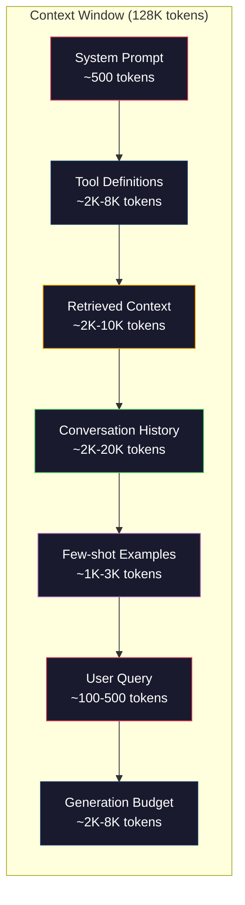
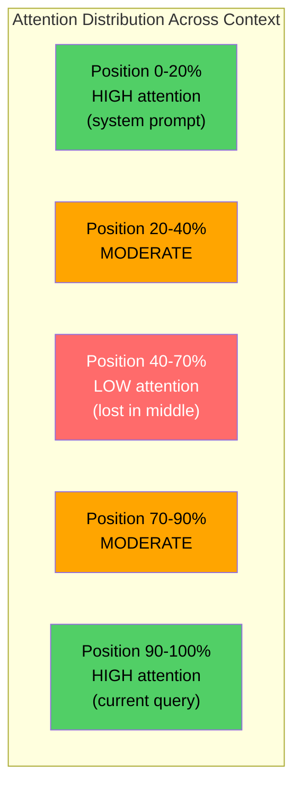
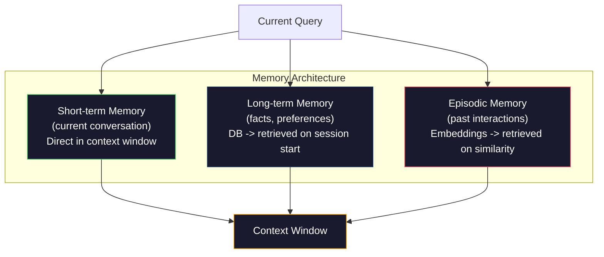

# Kontext Mühendisliği: Window­t,Budget,Memory ve Retrieval

> Hızlı mühendislik bir parça. Konteks mühendisliği 才是全局。 Hızlı muhendislik bir parça 字符串。 Konteks model penceresine girer. İçerikleri: sistem talimatları、 kurtarılmış belgeleri、 araç tanımları、 sohbet tarihi、 birkaç fotoğraf örneği, yanı sıra hızlı bir şekilde  本身──2026 yılının en iyi AI mühendisleri kontekst mühendisleri── onlar neyi bırakmaya karar verirler, neyi dışarıda bırakır, neyi sırayla bırakır, neyi sırayla bırakırlar──

**类型：**Yapım
**语言：**Python
**前置要求：**Eğitimler: Eğitimler: Eğitimler: Eğitimler: Eğitimler: Eğitimler: Eğitimler: Eğitimler: Eğitimler: Eğitimler: Eğitimler: Eğitimler: Eğitimler: Eğitimler: Eğitimler: Eğitimler: Eğitimler: Eğitimler: Eğitimler: Eğitimler: Eğitimler: Eğitimler: Eğitimler: Eğitimler: Eğitimler: Eğitimler: Eğitimler: Eğitimler: Eğitimler: Eğitimler: Eğitimler: Eğitimler: Eğitimler: Eğitimler: Eğitimler: Eğitimler: Eğitimler: Eğitimler: Eğler: Eğler: Eğler: Eğler: Eğler: Eğler: Eğler: Eğler: Eğler: Eğler: Eğl.
**时间：**90 dakika kadar .
**相关：**EY 11 · 15(Hızlı Kayıtlama)  Kaş dostu düzenlenme  Konekst mühendisliği 延伸──5 · 28(Uzun Konekst değerlendirme)讲解如何使用NIAH/RULER 衡量 lost-in-the-middle──

## Öğrenme hedefi

- 计算所有 context window 组件的 Token 预算(sistem prompt、tools、history、recovered docs、generation headroom)
- 实现 context window 管理策略:截断、摘要,以及用于对话历史的滑窗
- Konekst bileşenlerine öncelik vererek sıralama yaparak, modelin dikkatinin en fazla en ilgili bilgilere odaklanmasına izin verin.
- Köntem bir monte oluşturmak, sorguya göre 类型和可用窗口空间动态分配 Token

## 问题

Claude Opus 4.7 200K Token  Window(beta ortalaması 1M) ・・・GPT-5 400K ・・・Gemini 3 Pro 2M ・・・Llama 4  iddia 10M ・・・ Bu rakamlar gerçekten dolduruncaya kadar çok büyük görünüyor

Aşağıda bir kodlama asistanı var. Sistem promptı: 500 Token──50 个 个工具 工具的工具定义: 8,000 Token──检索文件:4,000 Token──对话历史(10轮): 6,000 Token──当前用户查询:200 Token──生成预算──最大输出):4,000 Token──总计:22,700 Token──这只占 128K 窗口的 18%──

Ancak dikkat bağlam uzunluğu 線性拡張── 128K Token bağlamı modeline sahip olmak ikinci dikkat ödemelidir 成本(n^2), ancak çoğu üretim modeli yüksek verimlilik kullanır dikkat 变体)── daha da önemlisi, geri kazanma 准确率会下降──Haystack 测试'taki İhtilaf, modelin uzun bağlamda yerleştirilmesi zor olduğunu gösterdi.

實踐上的教學是:可用200K Token并非意味着使用200K Token 就有效──精心选的10K Token context 往往胜过直接倾倒的100K Token context──文本工程 是在文本窗口内最大化信号-噪音比的学科──

Pencerede yerleştirdiğiniz her bir simge, daha fazla ilgili bilgi taşıyabilecek başka bir simge dışarı çıkarır. Her bir bağlantısız araç tanımlaması, her geçici konuşma dönüşü, her bölümde sorunun cevabını alamadığı metin, tüm modellerin görev üzerinde biraz daha farklı bir performans göstermesini sağlar.

## 概念

### Kontext Pencereyi Rar Mank Mank Resource

Çizgi disk yerine RAM olarak düşün. Çok hızlı, doğrudan erişebilir, ama kapasite sınırlıdır.



Her bir bileşen, bir araya gelmek için bir alan var. Daha fazla araç tanımını ekle. Konuşma tarihini daha az alan değiştirir. Daha fazla alınan bağlamı ekle. Daha az alan değişir.

### Ortada Kaybolmuş

Bu, bağlam mühendisliği'nde en önemli deneyimin bulunmasıdır. Model daha iyi bağlamda  başlama ve sonlama bilgileri üzerinde odaklanır.

Liu et al. ((2023) bunun üzerine sistemli bir test yapıldı. Onlar 20 ilişkisi olmayan dosya arasında farklı konumlara bir ilgili dosya yerleştirdiler ve cevapların doğruluk oranını ölçtüler.

Bu doğrudan tasarımını etkileyecektir:

- En önemli bilgileri en önde koyun. Sistem prompt, anahtar talimatlar.
- Bu soruları ve en çok ilgili konektüel konularda yerleştirmek için son bir kısıtlama yapın.
- Konekstü en düşük öncelikli bölge olarak gör
- Eğer bilgiyi ortada koymak gerekiyorsa, en sonunda tekrar et.



### Kontext 组件

**System prompt**: person 、约束和行为规则──;;;;;;;;;;;;;;;;;;;;;;;;;;;;;;;;;;;;;;;;;;;;;;;;;;;;;;;;;;;;;;;;;;;;;;;;;;;;;;;;;;;;;;;;;;;;;;;;;;;;;;;;;;;;;;;;;;;;;;;;;;;;;;;;;;;;;;;;;;;;;;;;;;;;;;;;;;;;;;;;;;;;;;;;;;;;;;;;;;;;;;;;;;;;;;;;;;;;;;;;;;;;;;;;;;;;;;;;;;;;;;;;;;;;;;;;;;;;;;;;;;;;;;;;;;;;;;;;;;;;;;;;;;;;;;;;;;;;;;;;;;;;;;;;;;;;;;;;;;;;;;;;;;;;;;;;;;;;;;;;;;;;;;;;;;;;;;;;;;;;;;;;;;;;;;;;;;;;;;;;;;;;;;;;;;;;;;;;;;;;;;;;;;;;;;;;;;;;;;;;;;;;;;;;;;;;;;;;;;;;;;;;;;;;;;;;;;;;;;;;;;;;;;;;;;;;;;;;;;;;;;;;;;;;;;;;;;;;;;;;;;;;;;;;;;;;;;;;;;;

**Tool definitions**: Her araç 50-200 Token ekleyecek (Name, Description, Parameter Scheme) ⋅ 50 ⋅ Token ⋅ Her 150 Token, herhangi bir konuşmadan önce 7500 Token ⋅ Dinamik araç seçimi, yani sadece mevcut sorgu ile ilgili araçları içerir, %60-80% azaltabilir ⋅

**Retrieved context**Vector veritabanından gelen: Dokümanlar, arama sonuçları, dosya içeriği. Retrieval 質量直接決定応答質量.

**Conversation history**Önceki kullanıcı mesajı ve yardımcı cevabı: 線性增長──50 轮 sohbet、200 Token,就是 10,000 Token tarihi── bunların çoğu mevcut sorgu ile 无关──

**Few-shot examples**Bu, bir dizi simgeyi oluşturan bir simgeyi oluşturur.

**Generation budget**Eğer pencereleri doldursan modelde hiç yer yok cevaplamak için. En az iki bin- dört bin tane token bırakmak için.

### Kontext Sıkıştırma 策略

**History summarization**Bu yüzden, bu konuşma, bir kez daha gerçekleşecek ve bir kez daha gerçekleşecek.

**Relevance filtering**: Şu anki sorguya göre 打分,并丢弃低于值的文档── Eğer 打分,并丢弃低于值的文档── eğer 打分,并丢弃的文档. Eğer 打分,并丢弃的文档.

**Tool pruning**:分类用户的查询意图,只包含与该意图相关的工具──代码问题不需要日历工具──排期问题不需要文件系统工具──这可以把工具定义从8,000 Token 降至1,000──

**Recursive summarization**Bu kısımların özetini yeniden özetlemek için, 50 sayfalık bir belge 500 Token'in bir dijesine dönüşecek ve aynı zamanda önemli noktaları ele geçirecektir.

### Hatırlama Sistemleri

Konekst mühendisliği 跨越三个时间尺度──

**Short-term memory**:当前对话──直接存储在文本窗 中──随着每轮对话增长──通过总结和缩写 管理──

**Long-term memory**:跨 conversations 持久存在的事实和偏好──GPT  Project, PostgreSQL. 存储在数据库中,并在会议开始时获取──Claude Code 保存在CLAUDE.md 文件中──ChatGPT 保存在内存功能中──

**Episodic memory**:可能相关的特定过去交互── Geçen Salı günü, yazar modülünde benzer bir sorunu düzelttik. 作为 Embeddings 存储,并在当前对话匹配某个过去节时恢复──



### Dinamik Konekst Meclisi

关键洞察: farklı sorgu 需要不同的背景──静态系统提示 + 静态工具 + 静态历史 很浪费──最好的系统会为每个查询 动态组装背景──

1. 分类 sorgu niyeti
2. 选择相关工具(not all tools)
3. Kaydetme  相关文件(不是固定集合)
4. 包含相关历史转(not all history)
5. 添加与任务类型 匹配的少数shot例
6. 按重要性排序所有内容:关键的放最前,重要放最后,可选的放中

Bu, mükemmel bir AI uygulaması ile üstün bir AI uygulamasının ayrılığıdır.


```figure
lost-in-the-middle
```

## Yapın onu.

### 步骤 1: Token Counter

Siz ölçülmez bir şey için bütçe yapamazsınız. Bir basit Token counter inşa edin.

```python
import json
import numpy as np
from collections import OrderedDict

def count_tokens(text):
    if not text:
        return 0
    return int(len(text.split()) * 1.3)

def count_tokens_json(obj):
    return count_tokens(json.dumps(obj))
```

### 步骤 2:Kontext Bütçe Yöneticisi

核心抽象──预算 yöneticisi, her bileşenin kaç tane Token kullandığını takip eder,并强制执行限制──

```python
class ContextBudget:
    def __init__(self, max_tokens=128000, generation_reserve=4000):
        self.max_tokens = max_tokens
        self.generation_reserve = generation_reserve
        self.available = max_tokens - generation_reserve
        self.allocations = OrderedDict()

    def allocate(self, component, content, max_tokens=None):
        tokens = count_tokens(content)
        if max_tokens and tokens > max_tokens:
            words = content.split()
            target_words = int(max_tokens / 1.3)
            content = " ".join(words[:target_words])
            tokens = count_tokens(content)

        used = sum(self.allocations.values())
        if used + tokens > self.available:
            allowed = self.available - used
            if allowed <= 0:
                return None, 0
            words = content.split()
            target_words = int(allowed / 1.3)
            content = " ".join(words[:target_words])
            tokens = count_tokens(content)

        self.allocations[component] = tokens
        return content, tokens

    def remaining(self):
        used = sum(self.allocations.values())
        return self.available - used

    def utilization(self):
        used = sum(self.allocations.values())
        return used / self.max_tokens

    def report(self):
        total_used = sum(self.allocations.values())
        lines = []
        lines.append(f"Context Budget Report ({self.max_tokens:,} token window)")
        lines.append("-" * 50)
        for component, tokens in self.allocations.items():
            pct = tokens / self.max_tokens * 100
            bar = "#" * int(pct / 2)
            lines.append(f"  {component:<25} {tokens:>6} tokens ({pct:>5.1f}%) {bar}")
        lines.append("-" * 50)
        lines.append(f"  {'Used':<25} {total_used:>6} tokens ({total_used/self.max_tokens*100:.1f}%)")
        lines.append(f"  {'Generation reserve':<25} {self.generation_reserve:>6} tokens")
        lines.append(f"  {'Remaining':<25} {self.remaining():>6} tokens")
        return "\n".join(lines)
```

### 步骤 3:Lost-in-the-Middle yeniden düzenleme

实现重排策略: en önemli öğeleri 最前和最后,最不重要在中间放置──

```python
def reorder_lost_in_middle(items, scores):
    paired = sorted(zip(scores, items), reverse=True)
    sorted_items = [item for _, item in paired]

    if len(sorted_items) <= 2:
        return sorted_items

    first_half = sorted_items[::2]
    second_half = sorted_items[1::2]
    second_half.reverse()

    return first_half + second_half

def score_relevance(query, documents):
    query_words = set(query.lower().split())
    scores = []
    for doc in documents:
        doc_words = set(doc.lower().split())
        if not query_words:
            scores.append(0.0)
            continue
        overlap = len(query_words & doc_words) / len(query_words)
        scores.append(round(overlap, 3))
    return scores
```

### 步骤 4:Düşüşmeler Tarihi Kompresör

总结旧的对话转转,以回收 标志 预算。

```python
class ConversationManager:
    def __init__(self, max_history_tokens=5000):
        self.turns = []
        self.summaries = []
        self.max_history_tokens = max_history_tokens

    def add_turn(self, role, content):
        self.turns.append({"role": role, "content": content})
        self._compress_if_needed()

    def _compress_if_needed(self):
        total = sum(count_tokens(t["content"]) for t in self.turns)
        if total <= self.max_history_tokens:
            return

        while total > self.max_history_tokens and len(self.turns) > 4:
            old_turns = self.turns[:2]
            summary = self._summarize_turns(old_turns)
            self.summaries.append(summary)
            self.turns = self.turns[2:]
            total = sum(count_tokens(t["content"]) for t in self.turns)

    def _summarize_turns(self, turns):
        parts = []
        for t in turns:
            content = t["content"]
            if len(content) > 100:
                content = content[:100] + "..."
            parts.append(f"{t['role']}: {content}")
        return "Previous: " + " | ".join(parts)

    def get_context(self):
        parts = []
        if self.summaries:
            parts.append("[Conversation Summary]")
            for s in self.summaries:
                parts.append(s)
        parts.append("[Recent Conversation]")
        for t in self.turns:
            parts.append(f"{t['role']}: {t['content']}")
        return "\n".join(parts)

    def token_count(self):
        return count_tokens(self.get_context())
```

### 步骤 5: Dinamik Araç Seçicisi

Sadece mevcut sorgu ile ilgili araçları içerir.

```python
TOOL_REGISTRY = {
    "read_file": {
        "description": "Read contents of a file",
        "tokens": 120,
        "categories": ["code", "files"],
    },
    "write_file": {
        "description": "Write content to a file",
        "tokens": 150,
        "categories": ["code", "files"],
    },
    "search_code": {
        "description": "Search for patterns in codebase",
        "tokens": 130,
        "categories": ["code"],
    },
    "run_command": {
        "description": "Execute a shell command",
        "tokens": 140,
        "categories": ["code", "system"],
    },
    "create_calendar_event": {
        "description": "Create a new calendar event",
        "tokens": 180,
        "categories": ["calendar"],
    },
    "list_emails": {
        "description": "List recent emails",
        "tokens": 160,
        "categories": ["email"],
    },
    "send_email": {
        "description": "Send an email message",
        "tokens": 200,
        "categories": ["email"],
    },
    "web_search": {
        "description": "Search the web for information",
        "tokens": 140,
        "categories": ["research"],
    },
    "query_database": {
        "description": "Run a SQL query on the database",
        "tokens": 170,
        "categories": ["code", "data"],
    },
    "generate_chart": {
        "description": "Generate a chart from data",
        "tokens": 190,
        "categories": ["data", "visualization"],
    },
}

def classify_intent(query):
    query_lower = query.lower()

    intent_keywords = {
        "code": ["code", "function", "bug", "error", "file", "implement", "refactor", "debug", "test"],
        "calendar": ["meeting", "schedule", "calendar", "appointment", "event"],
        "email": ["email", "mail", "send", "inbox", "message"],
        "research": ["search", "find", "what is", "how does", "explain", "look up"],
        "data": ["data", "query", "database", "chart", "graph", "analytics", "sql"],
    }

    scores = {}
    for intent, keywords in intent_keywords.items():
        score = sum(1 for kw in keywords if kw in query_lower)
        if score > 0:
            scores[intent] = score

    if not scores:
        return ["code"]

    max_score = max(scores.values())
    return [intent for intent, score in scores.items() if score >= max_score * 0.5]

def select_tools(query, token_budget=2000):
    intents = classify_intent(query)
    relevant = {}
    total_tokens = 0

    for name, tool in TOOL_REGISTRY.items():
        if any(cat in intents for cat in tool["categories"]):
            if total_tokens + tool["tokens"] <= token_budget:
                relevant[name] = tool
                total_tokens += tool["tokens"]

    return relevant, total_tokens
```

### 步骤 6:完整 Context Assembly Pipeline

Bütün bölümleri bağlayın.

```python
class ContextEngine:
    def __init__(self, max_tokens=128000, generation_reserve=4000):
        self.budget = ContextBudget(max_tokens, generation_reserve)
        self.conversation = ConversationManager(max_history_tokens=5000)
        self.system_prompt = (
            "You are a helpful AI assistant. You have access to tools for "
            "code editing, file management, web search, and data analysis. "
            "Use the appropriate tools for each task. Be concise and accurate."
        )
        self.knowledge_base = [
            "Python 3.12 introduced type parameter syntax for generic classes using bracket notation.",
            "The project uses PostgreSQL 16 with pgvector for embedding storage.",
            "Authentication is handled by Supabase Auth with JWT tokens.",
            "The frontend is built with Next.js 15 using the App Router.",
            "API rate limits are set to 100 requests per minute per user.",
            "The deployment pipeline uses GitHub Actions with Docker multi-stage builds.",
            "Test coverage must be above 80% for all new modules.",
            "The codebase follows the repository pattern for data access.",
        ]

    def assemble(self, query):
        self.budget = ContextBudget(self.budget.max_tokens, self.budget.generation_reserve)

        system_content, _ = self.budget.allocate("system_prompt", self.system_prompt, max_tokens=1000)

        tools, tool_tokens = select_tools(query, token_budget=2000)
        tool_text = json.dumps(list(tools.keys()))
        tool_content, _ = self.budget.allocate("tools", tool_text, max_tokens=2000)

        relevance = score_relevance(query, self.knowledge_base)
        threshold = 0.1
        relevant_docs = [
            doc for doc, score in zip(self.knowledge_base, relevance)
            if score >= threshold
        ]

        if relevant_docs:
            doc_scores = [s for s in relevance if s >= threshold]
            reordered = reorder_lost_in_middle(relevant_docs, doc_scores)
            doc_text = "\n".join(reordered)
            doc_content, _ = self.budget.allocate("retrieved_context", doc_text, max_tokens=3000)

        history_text = self.conversation.get_context()
        if history_text.strip():
            history_content, _ = self.budget.allocate("conversation_history", history_text, max_tokens=5000)

        query_content, _ = self.budget.allocate("user_query", query, max_tokens=500)

        return self.budget

    def chat(self, query):
        self.conversation.add_turn("user", query)
        budget = self.assemble(query)
        response = f"[Response to: {query[:50]}...]"
        self.conversation.add_turn("assistant", response)
        return budget


def run_demo():
    print("=" * 60)
    print("  Context Engineering Pipeline Demo")
    print("=" * 60)

    engine = ContextEngine(max_tokens=128000, generation_reserve=4000)

    print("\n--- Query 1: Code task ---")
    budget = engine.chat("Fix the bug in the authentication module where JWT tokens expire too early")
    print(budget.report())

    print("\n--- Query 2: Research task ---")
    budget = engine.chat("What is the best approach for implementing vector search in PostgreSQL?")
    print(budget.report())

    print("\n--- Query 3: After conversation history builds up ---")
    for i in range(8):
        engine.conversation.add_turn("user", f"Follow-up question number {i+1} about the implementation details of the system")
        engine.conversation.add_turn("assistant", f"Here is the response to follow-up {i+1} with technical details about the architecture")

    budget = engine.chat("Now implement the changes we discussed")
    print(budget.report())

    print("\n--- Tool Selection Examples ---")
    test_queries = [
        "Fix the bug in auth.py",
        "Schedule a meeting with the team for Tuesday",
        "Show me the database query performance stats",
        "Search for best practices on error handling",
    ]

    for q in test_queries:
        tools, tokens = select_tools(q)
        intents = classify_intent(q)
        print(f"\n  Query: {q}")
        print(f"  Intents: {intents}")
        print(f"  Tools: {list(tools.keys())} ({tokens} tokens)")

    print("\n--- Lost-in-the-Middle Reordering ---")
    docs = ["Doc A (most relevant)", "Doc B (somewhat relevant)", "Doc C (least relevant)",
            "Doc D (relevant)", "Doc E (moderately relevant)"]
    scores = [0.95, 0.60, 0.20, 0.80, 0.50]
    reordered = reorder_lost_in_middle(docs, scores)
    print(f"  Original order: {docs}")
    print(f"  Scores:         {scores}")
    print(f"  Reordered:      {reordered}")
    print(f"  (Most relevant at start and end, least relevant in middle)")
```

## Kullan

### Claude Code'ın Kontext 策略

Claude Code kullanımı ayrımlı yöntem yönetim bağlamı。System prompt 包含行为规则和工具定义(约6K Token)。When you open files, file content will be as context 注入。When you search, results will be added。Old conversation turns 会被总结。CLAUDE.md 提供跨会议 持久存在的长期记忆。

Key Engineering Decision is: Claude Code will not put your entire code base 倾倒 into context── it will be on demand Retrieval 相关文件──

### Cursor'ın Dinamik Konekst yükleme

Cursor tüm kod tabanınızı yerleştirme için indeksileyecektir. Soruyu girerken, vektör benzerliği Arama'yı kullanır. En ilgili dosya ve kod blokları için yalnızca bu parçalar bağlam penceresine girer. 500K 行 kod tabanı 5-10 en ilgili kod bloklarına sıkıştırılır.

Modul budur: her şeyi içerebilir, sadece önemli içeriği içerir.

### ChatGPT hafızası

ChatGPT, kullanıcı tercihlerini ve gerçeklerini uzun süreli hafıza için depolayacaktır. Her konuşmanın başlaması sırasında, ilgili hatıralar geri alınır ve sistem promptinde yer alır. Kullanıcı Python'u tercih eder. Sadece 5 Token harcamayı tercih eder.

### RAG 作为 Kontext Engineering

RAG, biçimlendirilmiş bağlam mühendisliği değildir. Bu bilgiyi model ağırlığı (öğrenme) veya sistem promptı (static context) içine koymak değil, sorgu zamanında Retrieval 相关文档,并将它们注入文本窗口中. Çunking, Embedding, Retrieval, Rerenking dahil tüm RAG borusu, bir sorunu çözmek için kullanılır.

## - Söyle.

本课会产 出 `outputs/prompt-context-optimizer.md`, bu bir tekrarlanabilir istasyon, bir bağlam toplama için kullanılır 策略并推优化──把你的系统提示、工具计数、平均历史长度 和检索策略 输入给它,它会识别代币 浪费并提出改进建议──

Yine ortaya çıkacak.`outputs/skill-context-engineering.md`,Bu bir karar çerçevesidir, görev türüne göre kullanılır, bağlam penceresinin boyutu ve gecikme bütçesi bağlam montaj borularını tasarlamak için kullanılır.

## 练习

1. Bu, bütçeye göre %30'dan fazla bileşen kullanımı ile işaretlenmeli ve her bileşen tipine yönelik belirli sıkıştırma stratejileri önermelidir.

2. Çıkarılan bağlamı  semantik deduplasyonu gerçekleştirmek için── eğer iki çıkarılan belgenin benzerliği %80'den fazla olursa, sözcük üst üstelik veya yerleşimlerinin kozine benzerliği ile, sadece 分数更高的那个保留──衡量这能回收多少 代币预算──

3. 构建一个语境重播工具──给定对话转录,通过 ContextEngine 重放,并可视化预算配置 如何逐轮变化──绘制每个组件随时间变化的Token usage──识别文本──开始被压缩的那一轮──

4. 实现一个优先基础工具选择器――不要使用二元包括/排除,而是为每个工具 分配其对当前查询的相关性分点――根据相关性降序包含工具,直到工具预算耗尽――比较包含 5、10、20 和 50 个工具 时的任务表现――

5.  Bir çok strateji bağlam kompresörü oluşturmak, üç tür sıkıştırma stratejisini gerçekleştirmek,  truncation, summation, key sentences extraction) ve 20 个文档集合上 benchmark 它们──  compress ratio and information retention                                                                                                                                                                                                                                                      

## 关键术语

| Term | 人们通常怎么说 | 它实际意味着什么 |
|------|----------------|----------------------|
| Context window | “模型能读多少内容” | 模型在单次 forward pass 中处理的最大 Token 数（input + output）——GPT-5 为 400K，Claude Opus 4.7 为 200K（1M beta），Gemini 3 Pro 为 2M |
| Context engineering | “高级 prompt engineering” | 决定什么进入 context window、按什么顺序、以什么优先级进入的学科——涵盖 Retrieval、compression、tool selection 和 memory management |
| Lost-in-the-middle | “模型会忘记中间的东西” | 经验发现：LLMs 更关注 context 的开头和结尾，放在中间的信息会出现 10-20% 的准确率下降 |
| Token budget | “你还剩多少 Token” | 对 context window 容量在各组件之间的显式分配（system prompt、tools、history、retrieval、generation），并带有按组件设置的限制 |
| Dynamic context | “临时加载东西” | 根据 intent classification、relevant tool selection 和 retrieval results，为每个 query 以不同方式组装 context window |
| History summarization | “压缩对话” | 用简洁摘要替换逐字记录的旧 conversation turns，在保留关键信息的同时降低 Token 成本 |
| Tool pruning | “只包含相关 tools” | 分类 query intent，并只包含匹配的 tool definitions，将 tool Token 成本降低 60-80% |
| Long-term memory | “跨 sessions 记住内容” | 存储在数据库中并在 session start 时 retrieved 的事实和偏好——CLAUDE.md、ChatGPT Memory 及类似系统 |
| Episodic memory | “记住特定过去事件” | 作为 Embeddings 存储的过去交互，并在当前 query 与过去 conversation 相似时 retrieved |
| Generation budget | “给答案留空间” | 为模型输出预留的 Token——如果 context 完全填满窗口，模型就没有空间响应 |

## 延伸阅读

- [Liu et al., 2023 -- "Lost in the Middle: How Language Models Use Long Contexts"](https://arxiv.org/abs/2307.03172)                                                                                                                                                                                                                                                              
- [Anthropic's Contextual Retrieval blog post](https://www.anthropic.com/news/contextual-retrieval) Antropik  nasıl bağlamdan haberdar parça geri almak, geri alma başarısızlığı  düşürmek 49%
- [Simon Willison's "Context Engineering"](https://simonwillison.net/2025/Jun/27/context-engineering/)                                                                                                                                                                                                                                                              
- [LangChain documentation on RAG](https://python.langchain.com/docs/tutorials/rag/) RAG'yi bağlam mühendisliği örneği olarak uygulamaya koyma
- [Greg Kamradt's Needle in a Haystack test](https://github.com/gkamradt/LLMTest_NeedleInAHaystack) 揭示所有主流模型中位置依赖的检索失败的基准
- [Pope et al., "Efficiently Scaling Transformer Inference" (2022)](https://arxiv.org/abs/2211.05102) Neden bağlam uzunluğu 会驱动内存和延迟, KV önbelleği、MQA、GQA 如何改变预算计算──
- [Agrawal et al., "SARATHI: Efficient LLM Inference by Piggybacking Decodes with Chunked Prefills" (2023)](https://arxiv.org/abs/2308.16369) sonucu iki aşamada, make长 prompts 在 TTFT 上昂贵、 在 TPOT 上便宜; bu bağlam-paketleme pazarlamalar 背后的事实依据──
- [Ainslie et al., "GQA: Training Generalized Multi-Query Transformer Models from Multi-Head Checkpoints" (EMNLP 2023)](https://arxiv.org/abs/2305.13245) gruplandırılmış sorgu dikkat 论文, 不损失质量的情况下, 将生产解码器中的KV حافظه 降低 8×──
