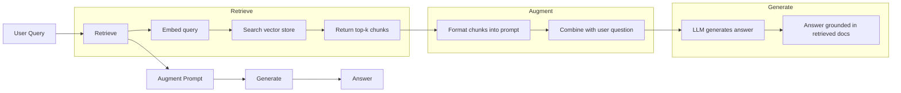
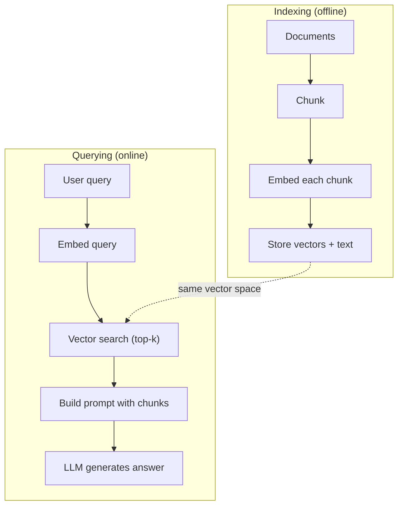

# RAG (Kendirme Geliştirilmiş Nesil)

> LLM'iniz eğitim sonuna kadar olan her şeyi bilir. Şirketinizin belgeleri, kod defteriniz, önceki hafta toplantı kayıtları da bilmiyor. RAG, bu sorunu çözmek için araştırma ile ilgili belgeleri içeriye sokar. Bu, üretim ortamında en geniş AI modelidir. Eğer bu dersden sadece bir şey inşa ederseniz, bir RAG boru hattı inşa edersiniz.

**Type:** Build
**Languages:** Python
**Prerequisites:** Phase 10 (LLMs from Scratch), Phase 11 Lessons 01-05
**Time:** ~90 minutes
**Related:**5 · 23 (RAG için parçalanma stratejileri) 讲解六种 chunking 算法以及各自适用场景──Fase 5 · 22 (Embedding Models Deep Dive) 讲解如何选择嵌入器──Fase 11 · 07 (Advanced RAG) 讲解混合搜索、重排和查询转换──

## Öğrenme hedefi
- 构建完整的RAG管道:document loading·chunking·embedding·vector storage·recovery·generation
- Vectör veritabanı kullanmak (ChromaDB、FAISS veya Pinecone)
- 解释为什么在知识基础的应用中 RAG 优于细调 (BİLGİN) 详细调度 (Kostı, Yenilik, Yöntemlilik)
- İstihbarat ölçümleri (precision, recall) ve jenerasyon ölçümleri (generation metrics)

## 问题
Şirket için bir sohbet aracı oluşturduğunuzu ve müşteriler sorusu: Enterprise programının geri ödeme politikası nedir?LLM tipik SaaS geri ödeme politikası hakkında genel bir cevap verdi.

Düzgün ayarlama bir çözümdür. Bu LLM'yi al, iç kayıtlarını kullanarak eğit, sonra da yeni bir model hazırla. Bu uygulanabilir, ama ciddi sorunlar var. Düzgün ayarlama işlemleri, binlerce dolara ulaşabilir.

RAG başka bir çözümdür. Biçimsel bir model tutmak. Sorun geldiğinde, belge mağazanızda ilgili pasajlar arayın, onları sorunun önüne sürükleyin. Bu pasajları bağlam olarak cevaplamak için model oluşturun. Belge mağazası birkaç dakika içinde güncelleyebilir. Hangi dosyaları özel olarak araştırmak istediğinizi açıkça görebilirsiniz.

## 概念
### RAG Şablonu

Tüm modül dört adım olarak genel olarak ifade edilebilir:



Sorgu -> İndir -> Artırma Cevapı -> Yükleme Cevapı -> Yükle.

### RAG Neden İyi Düzenlemeyi Yararlı Kaldı

| Concern | Fine-tuning | RAG |
|---------|------------|-----|
| 成本 | 每次 training run 需要 $1,000-$100,000+ | 每次 query 约 $0.01-$0.10（embedding + LLM） |
| 新鲜度 | 重新训练前一直过时 | 通过重新 indexing docs，可在几分钟内更新 |
| 可审计性 | 无法追踪 answer 到 source | 可以展示准确检索到的 passages |
| Hallucination | 仍然会自由 hallucinate | 基于检索到的 documents |
| 数据隐私 | training data 被烘焙进 weights | documents 留在你的 vector store 中 |

Düzgün ayarlama, modelin ağırlığını sürekli değiştirir. RAG, modelin bağlamını geçici olarak değiştirir. Çoğu uygulamada, geçici bağlam sadece istediğin şeydir.

İyi ayarlama 胜出的唯一场景: You need a model to adopt a certain style、语气 or reasoning pattern, while these cannot simply by prompting 实现──

### Modeller yerleştirmek

Eklenti modeli 会把文本转换成密集向量──相似文本会在这个高维空间中产生彼此接近的向量──Password'ımı nasıl yeniden ayarlarım? 和 Password'ımı değiştirmem gerekiyor 尽管共享的词很少,却会产生几乎相同的向量──猫坐在床上则会产生非常不同的向量──

常见嵌入型(2026 阵容  完整分析见 5 · 22 aşaması):

| Model | Dimensions | Provider | Notes |
|-------|-----------|----------|-------|
| text-embedding-3-small | 1536 (Matryoshka) | OpenAI | 适合大多数用例的最佳性价比 |
| text-embedding-3-large | 3072 (Matryoshka) | OpenAI | 更高准确率，可截断到 256/512/1024 |
| Gemini Embedding 2 | 3072 (Matryoshka) | Google | 顶级 MTEB retrieval；8K context |
| voyage-4 | 1024/2048 (Matryoshka) | Voyage AI | 领域变体（code、finance、law） |
| Cohere embed-v4 | 1024 (Matryoshka) | Cohere | 强 multilingual，128K context |
| BGE-M3 | 1024 (dense + sparse + ColBERT) | BAAI (open-weight) | 一个模型提供三种视图 |
| Qwen3-Embedding | 4096 (Matryoshka) | Alibaba (open-weight) | 顶级 open-weight retrieval score |
| all-MiniLM-L6-v2 | 384 | Open-weight (Sentence Transformers) | prototyping baseline |

Bu derste, TF-IDF'yi kendi basit yerleşimlerini oluşturmak için kullanacağız. TF-IDF üretim sisteminde kullanılan bir program olduğu için değil, kavramın spesifik hale gelmesine neden olduğu için: metin giriş, vektör ışığa, benzer metin benzer vektörler üretmek için kullanıyoruz.

### vektör benzerliği

 iki vektör belirlemiş, benzerliği nasıl ölçülebilir?

**Cosine similarity**: iki vektör 之间角的余弦值──范围从 -1(相反) to 1(完全相同)──忽略大小,只关注方向──这是RAG的默认选择──

```
cosine_sim(a, b) = dot(a, b) / (||a|| * ||b||)
```

**Dot product**:Original inner product── daha büyük vektörler daha yüksek oranlar elde eder── büyüklüğünde  taşıyan bilgi kullanılırsa daha uzun belgeler daha fazla ilişki olabilir)──

```
dot(a, b) = sum(a_i * b_i)
```

**L2 (Euclidean) distance**:vektor alanı Orta düz çizgi mesafe¬¬¬¬¬¬¬¬¬¬¬¬¬¬¬¬¬¬¬¬¬¬¬¬¬¬¬¬¬¬¬¬¬¬¬¬¬¬¬¬¬¬¬¬¬¬¬¬¬¬¬¬¬¬¬¬¬¬¬¬¬¬¬¬¬¬¬¬¬¬¬¬¬¬¬¬¬¬¬¬¬¬¬¬¬¬¬¬¬¬¬¬¬¬¬¬¬¬¬¬¬¬¬¬¬¬¬¬¬¬¬¬¬¬¬¬¬¬¬¬¬¬¬¬¬¬¬¬¬¬¬¬¬¬¬¬¬¬¬¬¬¬¬¬¬¬¬¬¬¬¬¬¬¬¬¬¬¬¬¬¬¬¬¬¬¬¬¬¬¬¬¬¬¬¬¬¬¬¬¬¬¬¬¬¬¬¬¬¬¬¬¬¬¬¬¬¬¬¬¬¬¬¬¬¬¬¬¬¬¬¬¬¬¬¬¬¬¬¬¬¬¬¬¬¬¬¬¬¬¬¬¬¬¬¬¬¬¬¬¬¬¬¬¬¬¬¬¬¬¬¬¬¬¬¬¬¬¬¬¬¬¬¬¬¬¬¬¬¬¬¬¬¬¬¬¬¬¬¬¬¬¬¬¬¬¬¬¬¬¬¬¬¬¬¬¬¬¬¬¬¬¬¬¬¬¬¬¬¬¬¬¬¬¬¬¬¬¬¬¬¬¬¬¬¬¬¬¬¬¬¬¬¬¬¬¬¬¬¬¬¬¬¬¬¬¬¬¬¬¬¬¬¬¬¬¬¬¬¬¬¬¬¬¬¬¬¬¬¬¬¬¬¬¬¬¬¬¬¬¬¬¬¬¬¬¬¬¬¬¬¬¬¬¬¬¬¬¬¬¬¬¬¬¬¬¬¬¬¬¬¬¬¬¬¬¬¬¬¬¬¬¬¬¬¬¬¬¬¬¬¬¬¬¬¬¬¬¬¬¬¬¬¬¬¬¬¬¬¬¬¬¬¬¬¬¬¬¬¬¬¬¬¬¬¬¬¬¬¬¬¬¬¬¬¬¬¬¬¬¬¬¬¬¬¬¬¬¬¬¬¬¬¬¬¬¬¬¬¬

```
L2(a, b) = sqrt(sum((a_i - b_i)^2))
```

Kosin benzerliği standart bir seçimdir. Büyüklüğü ile birlikte, farklı boyutlu belgelerle işlenme yeteneği vardır.

### Çürükleme Strategiları

Belgeler 太长,単向矢量 olarak yerleştiremez. 50 sayfalık bir PDF, birkaç on konu içeren çok kötü yerleştirme oluşturabilir.

**Fixed-size chunking**Her N 个代币 拆分一次──简单且可预测──512 代币 parçası 配合50 代币重叠, yani 1 个是代币 0-511, 2 个是代币 462-973,以此类推──重叠 确保你不会在不走运的边界处切断句子──

**Semantic chunking**: 在自然边界处拆分──段落、章节或标记标题──每块都是一个语义连贯的单元──实现更复杂,但检索效果更好──

**Recursive chunking**İlk olarak, en büyük sınırda ayrılma bölümlerinin başlıklarını kullanın. Eğer bir bölüm çok büyükse, paragraf sınırlarına göre ayrılma yapın.

İnsanların hayalinden daha önemli olan parça boyutu:

- 太小(64-128 tokens): Her parça 文脈不足── Geçen çeyrekte %15 artış gösterdi
- 太大(2048+ token): Her parça 多主题,稀释相关性──
- 理想范围(256-512 token):context 足够自包含,同时足够聚焦以保持相关性──

Büyük çoğunluk üretim sınıfı RAG  sistemleri 256-512 token parçaları kullanır, 50 token üst üste geçiyor.

### Vektör Veritabanları

Bir kere yerleştirilmiş olduktan sonra, depolamak ve arama yapmak için bir yere ihtiyacınız var. Seçenekler şunları içerir:

| Database | Type | Best for |
|----------|------|----------|
| FAISS | Library (in-process) | Prototyping，中小型 datasets |
| Chroma | Lightweight DB | 本地开发，小型部署 |
| Pinecone | Managed service | 无需运维负担的生产环境 |
| Weaviate | Open source DB | 自托管生产环境 |
| pgvector | Postgres extension | 已经在使用 Postgres |
| Qdrant | Open source DB | 高性能自托管 |

Bu ders sırasında, biz basit bir hafıza vektör mağazası inşa edeceğiz. Vectörleri mevcut listede yerleştiriyor ve kaba kuvvetli kozine benzerlik arayışı yapmaktadır. Bu, düz indeksi FAISS kullanmakla aynıdır.

### Tam Boru hattı



İndeksleme aşaması her belge için bir kez yürütülür veya bir kez yürütülür.

### Gerçek Sayılar

Çoğu üretim sınıfı RAG  sistemi bu parametreleri kullanır:

- **k = 5 to 10**: Her sorgu 检索's parçalar
- **Chunk size = 256 to 512 tokens**,并配 50 token örtüşmesi
- **Context budget**: Her sorgu 2500-5000 jeton kullanmak
- **Total prompt**: yaklaşık 8.000-16.000 token(sistem istekleri + alınan parçalar + konuşma tarihi + kullanıcı sorusu)
- **Embedding dimension**:84-3072, modelden
- **Indexing throughput**: API yerleştirmelerini kullan 时每秒 100-1,000 belge
- **Query latency**: 50-200 ms, nesil 500-3000 ms


```figure
rag-chunking
```

## Yapın onu.
### 步骤 1: Belge Çunking

```python
def chunk_text(text, chunk_size=200, overlap=50):
    words = text.split()
    chunks = []
    start = 0
    while start < len(words):
        end = start + chunk_size
        chunk = " ".join(words[start:end])
        chunks.append(chunk)
        start += chunk_size - overlap
    return chunks
```

### 步骤 2: TF-IDF yerleştirmeleri

Biz basit bir yerleştirme işlevi inşa ediyoruz. TF-IDF (Term Frequency-Inverse Document Frequency) nöral yerleştirme değil, ancak bir sözcük önemini kavramak ve metni vektörlere dönüştürmek için bir şekilde kullanır. Bir belge içinde sıkça ortaya çıkan kelimeler daha yüksek TF elde eder.

```python
import math
from collections import Counter

def build_vocabulary(documents):
    vocab = set()
    for doc in documents:
        vocab.update(doc.lower().split())
    return sorted(vocab)

def compute_tf(text, vocab):
    words = text.lower().split()
    count = Counter(words)
    total = len(words)
    return [count.get(word, 0) / total for word in vocab]

def compute_idf(documents, vocab):
    n = len(documents)
    idf = []
    for word in vocab:
        doc_count = sum(1 for doc in documents if word in doc.lower().split())
        idf.append(math.log((n + 1) / (doc_count + 1)) + 1)
    return idf

def tfidf_embed(text, vocab, idf):
    tf = compute_tf(text, vocab)
    return [t * i for t, i in zip(tf, idf)]
```

### 步骤 3: Cosine Benzerliği Arama

```python
def cosine_similarity(a, b):
    dot = sum(x * y for x, y in zip(a, b))
    norm_a = math.sqrt(sum(x * x for x in a))
    norm_b = math.sqrt(sum(x * x for x in b))
    if norm_a == 0 or norm_b == 0:
        return 0.0
    return dot / (norm_a * norm_b)

def search(query_embedding, stored_embeddings, top_k=5):
    scores = []
    for i, emb in enumerate(stored_embeddings):
        sim = cosine_similarity(query_embedding, emb)
        scores.append((i, sim))
    scores.sort(key=lambda x: x[1], reverse=True)
    return scores[:top_k]
```

### 4 adım: Hızlı İnşaat

İşte RAG'de augmented gerçekleşen yer. Çıkışın parçalarını çıkarıp onları bir an önce biçimlendirip sonra belirli bir bağlamda cevaplar üzerine LLM'yi talep etmektedir.

```python
def build_rag_prompt(query, retrieved_chunks):
    context = "\n\n---\n\n".join(
        f"[Source {i+1}]\n{chunk}"
        for i, chunk in enumerate(retrieved_chunks)
    )
    return f"""Answer the question based ONLY on the following context.
If the context doesn't contain enough information, say "I don't have enough information to answer that."

Context:
{context}

Question: {query}

Answer:"""
```

### 步骤 5: Tam RAG boru hattı

```python
class RAGPipeline:
    def __init__(self):
        self.chunks = []
        self.embeddings = []
        self.vocab = []
        self.idf = []

    def index(self, documents):
        all_chunks = []
        for doc in documents:
            all_chunks.extend(chunk_text(doc))
        self.chunks = all_chunks
        self.vocab = build_vocabulary(all_chunks)
        self.idf = compute_idf(all_chunks, self.vocab)
        self.embeddings = [
            tfidf_embed(chunk, self.vocab, self.idf)
            for chunk in all_chunks
        ]

    def query(self, question, top_k=5):
        query_emb = tfidf_embed(question, self.vocab, self.idf)
        results = search(query_emb, self.embeddings, top_k)
        retrieved = [(self.chunks[i], score) for i, score in results]
        prompt = build_rag_prompt(
            question, [chunk for chunk, _ in retrieved]
        )
        return prompt, retrieved
```

### 步骤 6: Nesil (sümüle)

Bu dersde, en ilgili cümleleri inceleme bağlamından çıkararak, benzer nesil oluşturmaya başladık.

```python
def simple_generate(prompt, retrieved_chunks):
    query_words = set(prompt.lower().split("question:")[-1].split())
    best_sentence = ""
    best_score = 0
    for chunk in retrieved_chunks:
        for sentence in chunk.split("."):
            sentence = sentence.strip()
            if not sentence:
                continue
            words = set(sentence.lower().split())
            overlap = len(query_words & words)
            if overlap > best_score:
                best_score = overlap
                best_sentence = sentence
    return best_sentence if best_sentence else "I don't have enough information."
```

## Kullan
kullanmak gerçek gömülme modeli 和 LLM 时,代码几乎不变:

```python
from openai import OpenAI

client = OpenAI()

def embed(text):
    response = client.embeddings.create(
        model="text-embedding-3-small",
        input=text
    )
    return response.data[0].embedding

def generate(prompt):
    response = client.chat.completions.create(
        model="gpt-4o-mini",
        messages=[{"role": "user", "content": prompt}],
        temperature=0
    )
    return response.choices[0].message.content
```

Veya Antropik kullanın:

```python
import anthropic

client = anthropic.Anthropic()

def generate(prompt):
    response = client.messages.create(
        model="claude-sonnet-4-20250514",
        max_tokens=1024,
        messages=[{"role": "user", "content": prompt}]
    )
    return response.content[0].text
```

Pipeline is the same. ⇒ ⇒ ⇒ ⇒ ⇒ ⇒ ⇒ ⇒ ⇒ ⇒ ⇒ ⇒ ⇒ ⇒ ⇒ ⇒ ⇒ ⇒ ⇒ ⇒ ⇒ ⇒ ⇒ ⇒ ⇒ ⇒ ⇒ ⇒ ⇒ ⇒ ⇒ ⇒ ⇒ ⇒ ⇒ ⇒ ⇒ ⇒ ⇒ ⇒ ⇒ ⇒ ⇒ ⇒ ⇒ ⇒ ⇒ ⇒ ⇒ ⇒ ⇒ ⇒ ⇒ ⇒ ⇒ ⇒ ⇒ ⇒ ⇒ ⇒ ⇒ ⇒ ⇒ ⇒ ⇒ ⇒ ⇒ ⇒ ⇒ ⇒ ⇒ ⇒ ⇒ ⇒ ⇒ ⇒ ⇒ ⇒ ⇒ ⇒ ⇒ ⇒ ⇒ ⇒ ⇒ ⇒ ⇒ ⇒ ⇒ ⇒ ⇒ ⇒ ⇒ ⇒ ⇒ ⇒ ⇒ ⇒ ⇒ ⇒ ⇒ ⇒ ⇒ ⇒ ⇒ ⇒ ⇒ ⇒ ⇒ ⇒ ⇒ ⇒ ⇒ ⇒ ⇒ ⇒ ⇒ ⇒ ⇒ ⇒ ⇒ ⇒ ⇒ ⇒ ⇒ ⇒ ⇒ ⇒ ⇒ ⇒ ⇒ ⇒ ⇒ ⇒ ⇒ ⇒ ⇒ ⇒ ⇒ ⇒     ⇒ ⇒    ⇒       ⇒               ⇒                                                                                                                                                                                           

Büyük ölçekli vektör depolama için, uygun vektör veritabanı ile  Hırçlı kuvvet arama yerine:

```python
import chromadb

client = chromadb.Client()
collection = client.create_collection("my_docs")

collection.add(
    documents=chunks,
    ids=[f"chunk_{i}" for i in range(len(chunks))]
)

results = collection.query(
    query_texts=["What is the refund policy?"],
    n_results=5
)
```

Chroma 会在内部处理嵌入式 (默认使用全-MiniLM-L6-v2),并把向量 存储在本地数据库中──同样模式,不同的管道实现──

## - Söyle.
Bu ders:
- `outputs/prompt-rag-architect.md` Özel kullanım için kullanılan RAG 系统in bir istasyonu
- `outputs/skill-rag-pipeline.md` Bir öğretmen ajanı RAG boru hattlarını nasıl inşa edeceğimizi ve düzenleyeceğimizi öğrenmek

## 练习
1. Metod: TF-IDF yerleşimlerini değiştirmek için basit bir kelime çantası kullanın.

2. 试验不同分量: 上尝试 50、100、200 和 500 kelimeler için aynı büyüklükte bir dizi belge üzerinde çalışmak, her bir büyüklükte aynı 5 soruyu yürütmek,并统计有多少能在前3中返回相关分量――找到检索质 达到峰值的甜点――

3. Bu nedenle, her bir bölüm için metadata eklenmesi için, kaynak belgesinin adı, bölüm pozisyonu, sorgu şablonunu değiştirmek ve kaynak atributunu içermek için, LLM'nin kaynaklarını kullanmasına izin verin.

4. 实现一个简单评估:给定10个问题答复对,让每个问题通过RAG管道,并衡量检索到的块中有多少比例含答──这是k的检索回忆.

5. 构建对话意识的RAG管道:维护最近3轮交易的历史,并将其与检索的块 一起包含在快速中──使用后续问题 测试,例如在询问价格 后再问  企业怎么样?──

## 关键术语
| Term | What people say | What it actually means |
|------|----------------|----------------------|
| RAG | “能阅读你文档的 AI” | 检索相关 documents，把它们粘贴到 prompt 中，并生成一个基于这些 documents 的 answer |
| Embedding | “把文本转换成数字” | 文本的 dense vector representation，其中相似含义会产生相似 vectors |
| Vector database | “面向 AI 的搜索引擎” | 为存储 vectors 并按 similarity 找到 nearest neighbors 而优化的数据存储 |
| Chunking | “把 docs 拆成片段” | 将 documents 拆成更小的 segments（通常 256-512 tokens），以便每个 segment 可以独立 embed 和 retrieve |
| Cosine similarity | “两个 vectors 有多相似” | 两个 vectors 之间夹角的余弦值；1 = 方向相同，0 = 正交，-1 = 相反 |
| Top-k retrieval | “取 k 个最佳匹配” | 从 vector store 中返回与 query 最相似的 k 个 chunks |
| Context window | “LLM 能看到多少文本” | LLM 在单次请求中可以处理的最大 tokens 数；retrieved chunks 必须放入这个范围内 |
| Augmented generation | “使用给定 context 回答” | 使用检索到的 documents 作为 context 来生成响应，而不是仅依赖训练得到的知识 |
| TF-IDF | “词语重要性评分” | Term Frequency 乘以 Inverse Document Frequency；根据词语在 corpus 中的区分度为其加权 |
| Indexing | “为搜索准备 docs” | 离线执行 chunking、embedding 和 storing documents 的过程，使它们能在 query time 被搜索 |

## 延伸阅读
- Lewis et al., Bilgi yoğun NLP görevleri için geri kazanma-genişlendirilmiş nesil (2020)  Facebook AI Araştırması 提出的原始 RAG 论文,形式化了 geri kazanma-den sonra oluşturma 模式
- Anthropic'in RAG belgesi (docs.anthropic.com)                                                                                                                                                                                                                                                     
- Pinecone Öğrenme Merkezi, RAG nedir?  用清晰可视化解释RAG borusu,并包含生产环境考量
- Ceza-BERT: Reimers & Gurevych (2019)  tüm MiniLM gömleyici modeller 背后的论文,展示如何为语义相似性 训练双码码器
- [Karpukhin et al., “Dense Passage Retrieval for Open-Domain Question Answering” (EMNLP 2020)](https://arxiv.org/abs/2004.04906) DPR 论文, denli iki kodlayıcı geri alımı kanıtladı Açık alan QA 上优于BM25,并建立了现代RAG geri alıcıların模式──
- [LlamaIndex High-Level Concepts](https://docs.llamaindex.ai/en/stable/getting_started/concepts.html)RAG boru hattları inşa etmek için ana kavramı öğrenmek gerekir: veri yükleyici, düğüm parçacıkları, indeksi, geri alıcı, cevap sentezleyicileri.
- [LangChain RAG tutorial](https://python.langchain.com/docs/tutorials/rag/) 另一种风格的管弦乐器;以链运行物 视角理解同一个获取-然后生成模式──
