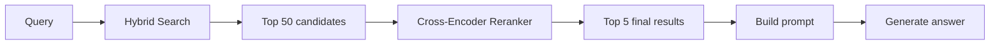
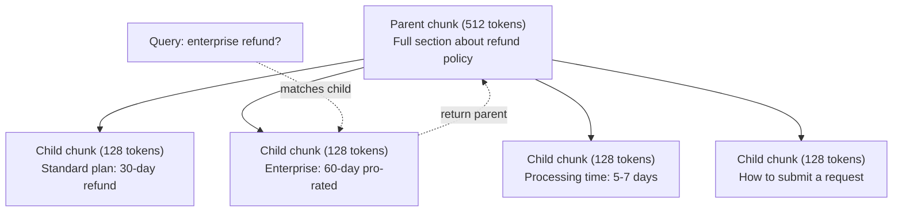
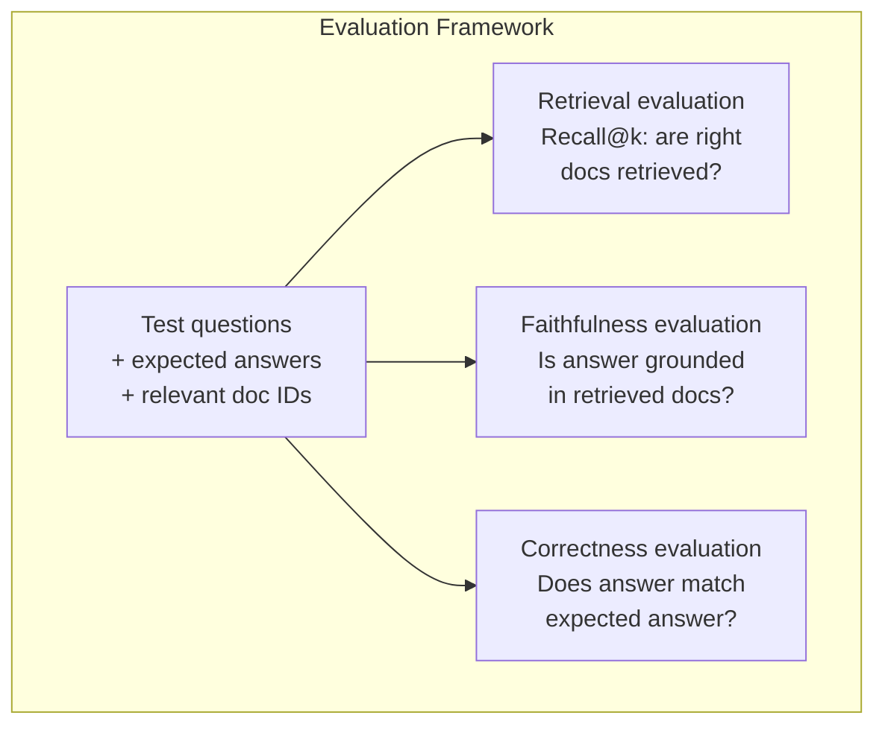

# Gelişmiş RAG(Kürtülme、Yüzeltme、Yüzyıl Arama)

> Temel RAG'lar en benzer üst-k parçacıkları kontrol eder. Bu basit bir soruya uygundur. Ancak, çoklu hop mantıklandırma, bulanık sorular ve büyük çaplı korpuslar karşısında başarısız olur.

**类型：**Yapım
**语言：**Python
**前置要求：**11 Eylül, Ders 06 (RAG)
**时间：**~ 90 dakika
**相关：**5 · 23 (RAG için parçalanma stratejileri) tüm altı çeşit parçalanma algoritmasını kapsar: geri dönüşlü, semantik, cümle, ana belge, geç parçalanma, bağlamsal geri alınma, vectara/antropik bir referans içerir.

## Öğrenme hedefi

- 实现能够保留文档结构和上下文的先进分断策略 (semantik, ricursive, ebeveyn- çocuğu)
- Bir hibrid arama borusu oluşturmak, BM25 anahtar kelime eşleşebilir semantik vektör arama ve çapraz kodlayıcı yeniden sıralama 结合起来
- 应用查询转变 技术 技术 HyDE、多查询、step-back),模糊或复杂问题的检索效果改善
- 诊断并修复常见 RAG 失败:检索到错误块、答案不在背景 中、多跳推理 崩

## 问题

6. Derste temel bir RAG borusu inşa ettiniz. Küçük bir korpusda doğrudan sorulara cevap verir.

**模糊 query**:"Geçen çeyrek gelir neydi?" Semantik arama  dönüşüm gelir stratejisi  gelir tahminleri, ayrıca CFO'nun gelir büyüme bakışının bir parçası── hepsi " gelir " kelimesi ile 语义相似── ama hepsi içermez gerçek rakamlar── gerçek bir parçası  yazıyor "$47.2M in Q3 2025"，但使用的是 "earnings" 而不是 "revenue"。Embedding model 认为 "revenue strategy" 比 "Q3 earnings were $47.2M' daha yakın sorgu.

**Multi-hop question**:"Hiçbir ekip en yüksek müşteri memnuniyeti puanı iyileştirdi?" Bu, her bir ekip memnuniyet puanını bulmak, karşılaştırmak, ve en büyük değerleri tanımlamak gerekir.

**大规模 corpus 问题**#14、#89,201、#1,200,000、#44 和 #901,333── bunlar yerleşim alanında yakınlaşır, ancak içeren bir cevap yoktur── bu boyutta, en yakın komşu aramaları yeterince hatalar içeriyor, sonuçları üst-k’den çıkarır.

RAG'in başarısız olmasının temel nedeni vektör benzerliği değildir. Bir parça, bir arama ile aynıdır, ancak cevap sorusuna yardımcı değildir.

## 核心概念

### Hibrit Arama:Semantik + Anahtar Kelime

Semantik arama(Vektör benzerliği)擅长理解含义──"Abonelimi nasıl iptal edebilirim?" 即使与"Planınızı iptal etmenin adımları" 没有共享单词,也能匹配──但它会漏掉精确匹配──"E-4021 hata kodu" 可能不能匹配包含"E-4021" 的部分,因为嵌入式可能把它当作噪声──

Anahtar kelime arama(BM25) 正好相反──它擅长精确匹配──"E-4021" 能完美匹配──但如果文档写的是"终止你的计划","取消我的订阅" 会返回零结果──

Hibrit arama iki şeyi aynı anda yürütür, sonra sonuçları birlikte çıkarır.

**BM25**(Best Matching 25) standart anahtar kelime arama algoritmasıdır. 1990'lardan beri arama motorunun merkezi olmuştur.

```
BM25(q, d) = sum over terms t in q:
    IDF(t) * (tf(t,d) * (k1 + 1)) / (tf(t,d) + k1 * (1 - b + b * |d| / avgdl))
```

İçinde tf(t,d) t termidir, t d) d) d) d) d) d) d) d) d) d) d) d) d) d) d) d) d) d) d) d) d) d) d) d) d) d) d) d) d) d) d) d) d) d) d) d) d) d) d) d) d) d) d) d) d) d) d) d) d) d) d) d) d) d) d) d) d) d) d) d) d) d) d) d) d) d) d) d) d) d) d) d) d) d) d) d) d) d) d) d) d) d) d) d) d) d) d) d) d) d) d) d) d) d) d) d) d) d) d) d) d) d) d) d) d) d) d) d) d) d) d) d) d) d) d) d) d) d) d) d) d) d) d) d) d) d) d) d) d) d) d) d) d) d) d) d) d) d) d) d) d) d) d) d) d) d) d) d) d) d) d) d) d) d) d) d) d) d) d) d) d) d) d) d) d) d) d) d) d) d) d) d) d) d) d) d) d) d) d) d) d) d) d) d) d) d) d) d) d) d) d) d) d) d) d) d) d) d) d) d) d) d) d) d) d) d) d) d) d) d) d) d) d) d) d) d) d) d) d) d) d) d) d) d) d) d) d) d) d) d) d) d) d) d) d) d) d) d) d) d) d) d) d) d) d) d) d) d) d

Genel olarak şöyle denir: Bir belge sorgu terimini içerirken, BM25'in bir kez daha fazla değer vermesi, ancak tekrarlama terimini kazançları azaltılması.

### Karşılıklı Rank Füzyonu ((RRF)

İki sıralama listesi var: biri Vektör Arama'dan, biri BM25'den.

```
RRF_score(d) = sum over rankings R:
    1 / (k + rank_R(d))
```

K, genellikle 60'da bulunan bir konulardır.

Bir Vektör Arama İçinde Rangout #1  BM25 İçinde Rangout #5 文档得分为:1/(60+1) + 1/(60+5) = 0.0164 + 0.0154 = 0.0318

Bir Vektör Arama İçinde sıralama #3  BM25 İçinde sıralama #2 文档得分为:1/(60+3) + 1/(60+2) = 0.0159 + 0.0161 = 0.0320

RRF bu iki tür sinyalleri doğal olarak dengeleyecektir. İki listeden en yüksek bir sıralama alanı olan bir dosya en iyi puan alacaktır. Bir listeden bir sıralama alanı #1 olacak, ancak diğer listeden eksik olan dosyalar ortalama puan alacaktır.

### Değişiklik

Retrieval (BİÇİN Vektor キーワード 還是混合) hızlı, ama yeterince kesin değil. Bi-encoder kullanıyor: query 和每个文档 独立进行嵌入,然后比较.

Ranking kullanmak için çapraz kodlayıcı kullanın: query 和 candidate document 会一起输入模型,模型输出相关性分数。模型能同时看到两段文本,因此可以捕捉它们之间的细粒度交互── Cross-encoder 能理解 "Q3 kazançları neydi?"

权衡是:cross-encoder 双码码码码码码码码码码码码码码码码码码码码码码码码码码码码码码码码码码码码码码码码码码码码码码码码码码码码码码码码码码码码码码码码码码码码码码码码码码码码码码码码码码码码码码码码码码码码码码码码码码码码码码码码码码码码码码码码码码码码码码码码码码码码码码码码码码码码码码码码码码码码码码码码码码码码码码码码码码码码码码码码码码码码码码码码码码码码码码码码码码码码码码码码码码码码码码码码码码码码码码码码码码码码码码码码码码码码码码码码码码码码码码码码码码码码码码码码码码码码码码码码码码码码码码码码码码码码码码码码码码码码码码码码码码码码码码码码码码码码码码码码码码码码码码码码码码码码码码码码码码码码码码码码码码码码码码码码码码码码码码码码码码码码码码码码码码码码码码码码码码码码码码码码码码码码码码码码码码码码码码码码码码码码码码码码码码码码码码码码码码码码码码码码码码码码码码码码码码码码码码码码码码码码码码码码码码码码码码码码码码码码码码码码码码码码码码码码码码码码码码码码码码码码码码码码码码码码码码码码码码码码码码码码码码码码码码码码码码码码码码码码码码码码码码码码码码码码码码码码码码



常见 yeniden sıralama modeli(2026 阵容):
- Kohere Rerank 3.5: yönetilen API,多语言,在混合 corpus 上 geri çağırma kazancı en iyisi
- Seyahat yeniden sıralaması-2.5: yönetilen API,托管选项中延迟 最低
- Jina-Reranker-v2 Çok Dilli:Açık ağırlık,支持 100+ 语言
- bge-re-ranker-v2-m3: açık ağırlıklı, güçlü başlangıç çizgi
- Çarşı kodlayıcı/ms-marco-MiniLM-L-6-v2: açık ağırlıklı, CPU 上运行, uygun prototipleme
- ColBERTv2 / Jina-ColBERT-v2: geç etkileşim çok vektör yeniden sıralamacı, 评分时是 O(tokens) değil O(docs)

### Sorgu dönüşümü

Bazen soru çekilmez, fakat sorgu içi olarak. "Yeni politika değişikliği hakkında ne vardı?" çok kötü bir arama sorgulamasıdır.

**Query rewriting**:把用户查询 改写成更好的搜索查询――LLM bunu yapabilirsiniz:

```
User: "What was that thing about the new policy change?"
Rewritten: "Recent policy changes and updates"
```

**HyDE（Hypothetical Document Embeddings）**Sorgulamadan değil, bir hipotetik cevapla yapıp, içine yerleştirerek, sonra da benzer gerçek dosyaları arayın.

```
Query: "What is the refund policy for enterprise?"
Hypothetical answer: "Enterprise customers are eligible for a full refund
within 60 days of purchase. Refunds are pro-rated based on the remaining
subscription period and processed within 5-7 business days."
```

Hipotetik cevap için yapın Embedding,并搜索与它相似的真实文档──直觉是:相比原始问题,hypothetical answer 在 Embedding 空间中更接近真答案──问题和答案具有不同的语言结构──通过生成假答,你在 Embedding 中架建立了"问题空间"和"答题空间"之间的桥梁──

HyDE 会在检索前增加一次LLM调调――这会增加500-2000ms latency――当原始查询的检索质量较差时,这是值得的――

### Ebeveyn-Çocuk Çıkışları

標準 chunking 迫使你做取舍: 細分 用精确回取, 大分 用提供足够的背景──親子 chunking 消除了這個取舍──

索引小块(128 token) geri alınması için kullanılır。当检索到小块 时,把它的母块(512 token) 返回给提示──小块 能精确匹配查询──母块 为 LLM 生成好答案提供足够的背景──



"Enterprise refund" sorusu, çocuk parçacığı C2'ye doğru uyuyor mu?

### Metadata Filtrasyonu

Vector arama 之前, metadata 过 corpus:date、source、category、author、language── This will shrink search space并避免不相关结果──

"Geçen ay güvenlik politikasında ne değişmişti?"  sadece son 30 gün içinde arama yapılması gerekir  güvenlik kategorisi 中的文档── eğer metadata filtresi yoksa, tüm korpusu arayacaksın, 2 yıl önce bir güvenlik belgesine bakabilirsin, çünkü bu ifadeyle aynıdır──

Üretim RAG  sistemi metadataları her parça ile bir depolama: kaynak belge, yaratma tarihi, kategorisi, yazar, versiyonu, vektör veritabanı, benzerlik aramalarına destek ön metadata göre filtreleme yapılır, bu büyük ölçek performans için çok önemlidir.

### Değerlendirme

Bir RAG sistemi oluşturdun. Nasıl bildireceksin?

**Retrieval relevance（Recall@k）**Bir grup bilinen ilgili dosya ile ilgili test sorusu için, ilgili dosyaların en üst-k sonuçlar arasında oranı nedir? Eğer bir sorunun cevabı bölüm # 47, bölüm # 47'de ise, ilk 5'te yer alıyor mu?

**Faithfulness**Eğer arama parçası "60 günlük geri ödeme penceresi" yazılırsa, model "90 günlük geri ödeme penceresi" cevabını verirse, bu da sadakat 失败── model doğru bağlamda hala halüsinasyonlu olur.

**Answer correctness**Bu, son sonuncu gösterge mi? Bu, geri alınma kalitesi ve jenerasyon kalitesi ile birleşti.

Bir basit sadakat 检查:取生成答案中的每个索赔,并验证它是否(实质上) 出现在复苏的部分中――答案中没有任何事实的部分包含的如果答案中没有任何事实,它很可能是幻觉的──




```figure
agentic-rag-loop
```

## Yapım

### 步骤 1:BM25  gerçekleştirmek

```python
import math
from collections import Counter

class BM25:
    def __init__(self, k1=1.2, b=0.75):
        self.k1 = k1
        self.b = b
        self.docs = []
        self.doc_lengths = []
        self.avg_dl = 0
        self.doc_freqs = {}
        self.n_docs = 0

    def index(self, documents):
        self.docs = documents
        self.n_docs = len(documents)
        self.doc_lengths = []
        self.doc_freqs = {}

        for doc in documents:
            words = doc.lower().split()
            self.doc_lengths.append(len(words))
            unique_words = set(words)
            for word in unique_words:
                self.doc_freqs[word] = self.doc_freqs.get(word, 0) + 1

        self.avg_dl = sum(self.doc_lengths) / self.n_docs if self.n_docs else 1

    def score(self, query, doc_idx):
        query_words = query.lower().split()
        doc_words = self.docs[doc_idx].lower().split()
        doc_len = self.doc_lengths[doc_idx]
        word_counts = Counter(doc_words)
        score = 0.0

        for term in query_words:
            if term not in word_counts:
                continue
            tf = word_counts[term]
            df = self.doc_freqs.get(term, 0)
            idf = math.log((self.n_docs - df + 0.5) / (df + 0.5) + 1)
            numerator = tf * (self.k1 + 1)
            denominator = tf + self.k1 * (1 - self.b + self.b * doc_len / self.avg_dl)
            score += idf * numerator / denominator

        return score

    def search(self, query, top_k=10):
        scores = [(i, self.score(query, i)) for i in range(self.n_docs)]
        scores.sort(key=lambda x: x[1], reverse=True)
        return scores[:top_k]
```

### 步骤 2: karşılıklı sıra birleşimi

```python
def reciprocal_rank_fusion(ranked_lists, k=60):
    scores = {}
    for ranked_list in ranked_lists:
        for rank, (doc_id, _) in enumerate(ranked_list):
            if doc_id not in scores:
                scores[doc_id] = 0.0
            scores[doc_id] += 1.0 / (k + rank + 1)
    fused = sorted(scores.items(), key=lambda x: x[1], reverse=True)
    return fused
```

### 步骤 3: Hibrit Arama Boru hattı

```python
def hybrid_search(query, chunks, vector_embeddings, vocab, idf, bm25_index, top_k=5, fusion_k=60):
    query_emb = tfidf_embed(query, vocab, idf)
    vector_results = search(query_emb, vector_embeddings, top_k=top_k * 3)
    bm25_results = bm25_index.search(query, top_k=top_k * 3)
    fused = reciprocal_rank_fusion([vector_results, bm25_results], k=fusion_k)
    return fused[:top_k]
```

### 4 adım: basit bir sıralama

Burada bir yeniden sıralamacı oluşturduk, kelimelerin üst üste geçmesi, terimlerin önemini ve ifade eşleşmesini kullanarak soru-doküman doğruluğunu sağladık.

```python
def rerank(query, candidates, chunks):
    query_words = set(query.lower().split())
    stop_words = {"the", "a", "an", "is", "are", "was", "were", "what", "how",
                  "why", "when", "where", "do", "does", "for", "of", "in", "to",
                  "and", "or", "on", "at", "by", "it", "its", "this", "that",
                  "with", "from", "be", "has", "have", "had", "not", "but"}
    query_terms = query_words - stop_words

    scored = []
    for doc_id, initial_score in candidates:
        chunk = chunks[doc_id].lower()
        chunk_words = set(chunk.split())

        term_overlap = len(query_terms & chunk_words)

        query_bigrams = set()
        q_list = [w for w in query.lower().split() if w not in stop_words]
        for i in range(len(q_list) - 1):
            query_bigrams.add(q_list[i] + " " + q_list[i + 1])
        bigram_matches = sum(1 for bg in query_bigrams if bg in chunk)

        position_boost = 0
        for term in query_terms:
            pos = chunk.find(term)
            if pos != -1 and pos < len(chunk) // 3:
                position_boost += 0.5

        rerank_score = (
            term_overlap * 1.0
            + bigram_matches * 2.0
            + position_boost
            + initial_score * 5.0
        )
        scored.append((doc_id, rerank_score))

    scored.sort(key=lambda x: x[1], reverse=True)
    return scored
```

### 步骤 5:HyDE(Hipotetik Belge Eklemeleri)

```python
def hyde_generate_hypothesis(query):
    templates = {
        "what": "The answer to '{query}' is as follows: Based on our documentation, {topic} involves specific policies and procedures that define how the process works.",
        "how": "To address '{query}': The process involves several steps. First, you need to initiate the request. Then, the system processes it according to the defined rules.",
        "default": "Regarding '{query}': Our records indicate specific details and policies related to this topic that provide a comprehensive answer."
    }
    query_lower = query.lower()
    if query_lower.startswith("what"):
        template = templates["what"]
    elif query_lower.startswith("how"):
        template = templates["how"]
    else:
        template = templates["default"]

    topic_words = [w for w in query.lower().split()
                   if w not in {"what", "is", "the", "how", "do", "does", "a", "an",
                                "for", "of", "to", "in", "on", "at", "by", "and", "or"}]
    topic = " ".join(topic_words) if topic_words else "this topic"

    return template.format(query=query, topic=topic)


def hyde_search(query, chunks, vector_embeddings, vocab, idf, top_k=5):
    hypothesis = hyde_generate_hypothesis(query)
    hypothesis_emb = tfidf_embed(hypothesis, vocab, idf)
    results = search(hypothesis_emb, vector_embeddings, top_k)
    return results, hypothesis
```

### 步骤 6: Ebeveyn-Çocuk Çüklenmesi

```python
def create_parent_child_chunks(text, parent_size=200, child_size=50):
    words = text.split()
    parents = []
    children = []
    child_to_parent = {}

    parent_idx = 0
    start = 0
    while start < len(words):
        parent_end = min(start + parent_size, len(words))
        parent_text = " ".join(words[start:parent_end])
        parents.append(parent_text)

        child_start = start
        while child_start < parent_end:
            child_end = min(child_start + child_size, parent_end)
            child_text = " ".join(words[child_start:child_end])
            child_idx = len(children)
            children.append(child_text)
            child_to_parent[child_idx] = parent_idx
            child_start += child_size

        parent_idx += 1
        start += parent_size

    return parents, children, child_to_parent
```

### 步骤 7: Sadakat değerlendirme

```python
def evaluate_faithfulness(answer, retrieved_chunks):
    answer_sentences = [s.strip() for s in answer.split(".") if len(s.strip()) > 10]
    if not answer_sentences:
        return 1.0, []

    grounded = 0
    ungrounded = []
    context = " ".join(retrieved_chunks).lower()

    for sentence in answer_sentences:
        words = set(sentence.lower().split())
        stop_words = {"the", "a", "an", "is", "are", "was", "were", "and", "or",
                      "to", "of", "in", "for", "on", "at", "by", "it", "this", "that"}
        content_words = words - stop_words
        if not content_words:
            grounded += 1
            continue

        matched = sum(1 for w in content_words if w in context)
        ratio = matched / len(content_words) if content_words else 0

        if ratio >= 0.5:
            grounded += 1
        else:
            ungrounded.append(sentence)

    score = grounded / len(answer_sentences) if answer_sentences else 1.0
    return score, ungrounded


def evaluate_retrieval_recall(queries_with_relevant, retrieval_fn, k=5):
    total_recall = 0.0
    results = []

    for query, relevant_indices in queries_with_relevant:
        retrieved = retrieval_fn(query, k)
        retrieved_indices = set(idx for idx, _ in retrieved)
        relevant_set = set(relevant_indices)
        hits = len(retrieved_indices & relevant_set)
        recall = hits / len(relevant_set) if relevant_set else 1.0
        total_recall += recall
        results.append({
            "query": query,
            "recall": recall,
            "hits": hits,
            "total_relevant": len(relevant_set)
        })

    avg_recall = total_recall / len(queries_with_relevant) if queries_with_relevant else 0
    return avg_recall, results
```

## kullanımı

Gerçek çapraz kodlayıcı kullanmak  yeniden sıralama yapmak:

```python
from sentence_transformers import CrossEncoder

reranker = CrossEncoder("cross-encoder/ms-marco-MiniLM-L-6-v2")

def rerank_with_cross_encoder(query, candidates, chunks, top_k=5):
    pairs = [(query, chunks[doc_id]) for doc_id, _ in candidates]
    scores = reranker.predict(pairs)
    scored = list(zip([doc_id for doc_id, _ in candidates], scores))
    scored.sort(key=lambda x: x[1], reverse=True)
    return scored[:top_k]
```

Cohere'nin yönetilen yeniden sıralamasını kullan:

```python
import cohere

co = cohere.Client()

def rerank_with_cohere(query, candidates, chunks, top_k=5):
    docs = [chunks[doc_id] for doc_id, _ in candidates]
    response = co.rerank(
        model="rerank-english-v3.0",
        query=query,
        documents=docs,
        top_n=top_k
    )
    return [(candidates[r.index][0], r.relevance_score) for r in response.results]
```

kullanmak için gerçek LLM 实现 HyDE:

```python
import anthropic

client = anthropic.Anthropic()

def hyde_with_llm(query):
    response = client.messages.create(
        model="claude-sonnet-4-20250514",
        max_tokens=256,
        messages=[{
            "role": "user",
            "content": f"Write a short paragraph that would be a good answer to this question. Do not say you don't know. Just write what the answer would look like.\n\nQuestion: {query}"
        }]
    )
    return response.content[0].text
```

Weaviate kullanılarak üretim hibrid aramaları yapılır:

```python
import weaviate

client = weaviate.connect_to_local()

collection = client.collections.get("Documents")
response = collection.query.hybrid(
    query="enterprise refund policy",
    alpha=0.5,
    limit=10
)
```

Alfa 参数控制平衡:0.0 = 纯关键词(BM25),1.0 = 纯向量,0.5 = 等权重── çoğu üretim 系统 0.3 ~ 0.7 之间 alpha──

## 交付

Bu ders:
- `outputs/prompt-advanced-rag-debugger.md`-- Diagnostik ve Düzeltme için RAG kalitesi sorunu
- `outputs/skill-advanced-rag.md`-- Hibrit arama ve yeniden sıralama yapım sınıfı RAG becerileri oluşturmak için kullanılır

## 练习

1. Örnek belgesinde BM25 ‒ Vector arama ve hibrid arama ‒ 5 test sorguları arasında her biri için, kayıt hangi yöntem #1 pozisyonda ‒ en ilgili parçaya geri dönmek ‒ Hibrit arama ‒ en az 5 ‒ 3 ‒ kazanmak ‒ ‒ ‒ ‒ ‒ ‒ ‒ ‒ ‒ ‒ ‒ ‒ ‒ ‒ ‒ ‒ ‒ ‒ ‒ ‒ ‒ ‒ ‒ ‒ ‒ ‒ ‒ ‒ ‒ ‒ ‒ ‒ ‒ ‒ ‒ ‒ ‒ ‒ ‒ ‒ ‒ ‒ ‒ ‒ ‒ ‒ ‒ ‒ ‒ ‒ ‒ ‒ ‒ ‒ ‒ ‒ ‒ ‒ ‒ ‒ ‒ ‒ ‒ ‒ ‒ ‒ ‒ ‒ ‒ ‒ ‒ ‒ ‒ ‒ ‒ ‒ ‒ ‒ ‒ ‒ ‒ ‒ ‒ ‒ ‒ ‒ ‒ ‒ ‒ ‒ ‒ ‒ ‒ ‒ ‒ ‒ ‒ ‒ ‒ ‒ ‒ ‒ ‒ ‒ ‒ ‒ ‒ ‒ ‒ ‒ ‒ ‒ ‒ ‒ ‒ ‒ ‒ ‒ ‒ ‒ ‒ ‒ ‒ ‒ ‒ ‒ ‒ ‒ ‒ ‒ ‒ ‒ ‒ ‒ ‒ ‒ ‒ ‒ ‒ ‒ ‒ ‒ ‒ ‒ ‒ ‒ ‒ ‒ ‒ ‒ ‒ ‒ ‒ ‒ ‒ ‒ ‒ ‒ ‒ ‒ ‒ ‒ ‒ ‒ ‒ ‒ ‒ ‒ ‒ ‒ ‒ ‒ ‒ ‒ ‒ ‒ ‒ ‒ ‒ ‒                                                                                          

2. 实现 metadata filter──为每个文档 添加一个"类别"字段(security、billing、api、product)──在运行矢量搜索 前,只过出相关类别的部分──用" Hangi şifreleme kullanılır?" 测试,并验证它只搜索安全类别的部分──

3. Uygula Lesson 06 中的简单生成函数 构建完整HyDE管线──在全部 5 测试查询 上比较直接查询搜索与HyDE搜索的检索质量(top-3 相关性)──HyDE 应能改善模糊查询的结果──

4. Örnek belgesinde, ana-baba parçalanma stratejisini gerçekleştirmek için çocuk parçalanması kullanın.

5. 创建评估数据集:10 个问题,带已知答案分别测量 (a) 仅 Vector search,(b) 仅 BM25,(c) 混合搜索,(d) 混合 + 排名重回的 Recall@3、Recall@5 和 Recall@10──绘制结果,并识别重回排名 最有帮助的位置──

## 关键术语

| Term | 人们通常怎么说 | 实际含义 |
|------|----------------|----------------------|
| BM25 | "Keyword search" | 一种概率排序算法，根据 term frequency、inverse document frequency 和 document length normalization 给文档打分 |
| Hybrid search | "Best of both worlds" | 并行运行 semantic（Vector）search 和 keyword（BM25）search，然后用 rank fusion 合并结果 |
| Reciprocal Rank Fusion | "Merge ranked lists" | 对每个文档在所有列表中的 1/(k + rank) 求和，从而组合多个 ranked list |
| Reranking | "Second pass scoring" | 使用成本更高的 cross-encoder model，对 initial retrieval 得到的 candidate set 重新打分 |
| Cross-encoder | "Joint query-document model" | 将 query 和 document 作为单个输入并生成相关性分数的模型；比 bi-encoder 更准确，但对 full corpus search 来说太慢 |
| Bi-encoder | "Independent embedding model" | 独立对 query 和 document 做 Embedding 的模型；由于 Embedding 可预计算，因此速度快，但不如 cross-encoder 准确 |
| HyDE | "Search with a fake answer" | 为 query 生成 hypothetical answer，对其做 Embedding，并搜索与它相似的真实文档 |
| Parent-child chunking | "Small search, big context" | 为精确 retrieval 索引小 chunk，但返回更大的 parent chunk 以提供足够 context |
| Metadata filtering | "Narrow before searching" | 在运行 Vector search 前，根据属性（date、source、category）过滤文档以缩小搜索空间 |
| Faithfulness | "Did it stay grounded" | 生成答案是否由 retrieved document 支持，而不是来自模型训练数据的 hallucination |

## 延伸阅读

- Robertson & Zaragoza, "The Probabilistic Relevance Framework: BM25 and Beyond" (2009) -- BM25'in otoritesi, açıklama公式背后的概率基础
- Cormack et al., "Reciprocal Rank Fusion Outperforms Condorcet and Individual Rank Learning Methods" (2009) -- RRF 原始论文,展示它优于更复杂的融合方法
- Gao et al., "Precise Zero-Shot Dense Retrieval without Relevance Labels" (2022) -- HyDE 论文, proving hypothetical document Embeddings can improve retrieval without any training data
- Nogueira & Cho, "BERT ile Geçit Yeniden Ranklama" (2019) -- 展示在 BM25 之上進行交叉編碼重新排序 能显著提升检索质
- [Khattab et al., "DSPy: Compiling Declarative Language Model Calls into Self-Improving Pipelines" (2023)](https://arxiv.org/abs/2310.03714)-- Bu yazıyı okuyarak "Hızlı LLM" yerine "Program LLM" anlamasını öğrenmek için.
- [Edge et al., "From Local to Global: A Graph RAG Approach to Query-Focused Summarization" (Microsoft Research 2024)](https://arxiv.org/abs/2404.16130)-- GraphRAG 论文: entite-relation çıkarımı + Leiden topluluk tespit, sorgu odaklı özetleme için kullanılır; ayrıca küresel vs yerel geri alımın 区别──
- [Asai et al., "Self-RAG: Learning to Retrieve, Generate, and Critique through Self-Reflection" (ICLR 2024)](https://arxiv.org/abs/2310.11511)-- 带 reflection tokens 的自评估 RAG;静态 geri almak-den sonra oluşturmak 后后的代理前沿──
- [LangChain Query Construction blog](https://blog.langchain.dev/query-construction/)-- 如何将自然语言查询 转换为结构化数据库查询(Text-to-SQL、Cypher), ön kurtarma adımı olarak。
