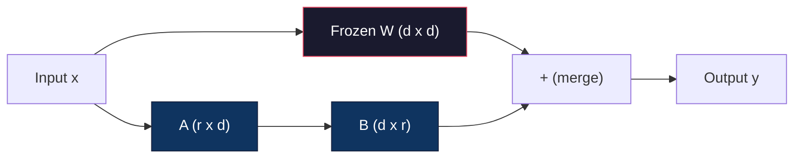
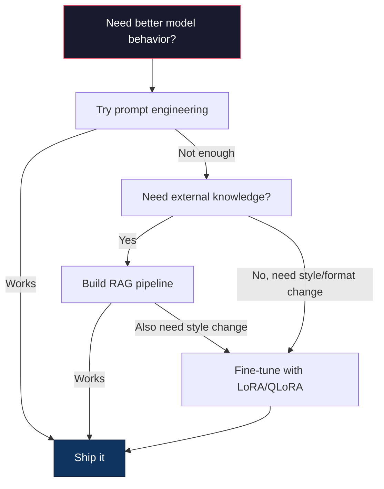

# LoRA & QLoRA kullanın  ince ayarlama yapın

> 7B modeline tam ince ayarlama yapın 56GB VRAM gerekir. Bu kadar çok yok. Çoğu şirket de yok. LoRA'nın %1 oranında eğitim yaparak aynı modelle 6GB'de ince ayarlama yapmanıza olanak sağlıyor. Bu bir anlaşmazlık değil.

**Type:** Build
**Languages:** Python
**Prerequisites:** Phase 10, Lesson 06 (Instruction Tuning / SFT)
**Time:** ~75 minutes
**Related:**Eğitim ve eğitim programı için hazırlanan programlar,

## Öğrenme hedefi
- 通過将低排調整調整矩陣(A 和 B) LoRA'yı gerçekleştirmek için önceden eğitilmiş modellerin dikkat katmanlarına entegre
- 計算 LoRA 相比全细调的参数节省:rank r、d_model 维度时, training is 2*r*d 个参数, not d^2
- QLoRA kullanın(4 bit kuantit bazı + LoRA adaptörleri) ince ayarlı bir model, GPU belleğini uygun hale getirir
- LoRA ağırlıklarını 合并回基模型 用于部署,并比较带适配器与不带适配器的推理速度

## 问题
Sınavlar için bir temel modeliniz var. Llama 3 8B.

Tam ince ayarlama 会更新模型 中的每一个参数──Llama 3 8B 有8亿个参数──在fp16 中,每个参数占有2字节──仅载重量 就需要16GB──训练期间,你还需要梯度(16GB)、Adam'ın optimizer states(momentum + variance 需要32GB) 以及激活──总计:单个8B model 大约需要56GB VRAM──

A100 80GB 勉强能装下──两张 A100 云 sağlayıcılarında 上每小时花费 $3-4。用 50,000 个样本训练 3 个 epochs 需要 6-10 小时。每次实验就是 $30-40.. hiperparametreyi düzeltmek için 10 kez deney yap. Herhangi bir şeyi dağıtmadan önce 400 dolar harcadın.

Llama 3 70B'ye kadar genişletirken, sayısal olarak çok daha fazla. Sadece 140 GB'lık ağırlıklar gerekir.

Daha derin bir sorun daha var. Tam ince ayarlama, modelin her bir ağırlığını değiştirir. Müşteri desteği verilerine ince ayarlama yaparsanız, modelin genel kullanım kapasitesini bozabilirsiniz.

Daha az parametrini eğitmek, daha az hafıza kullanmak ve modelin ışığını bozmak için bir yöntem gerekir.

## 概念
### LoRA: Düşük Ranklı Adaptasyon

Edward Hu ve Microsoft'un meslektaşları LoRA'yı Haziran 2021'de yayınladılar.

数学如下──一个标准线性层 计算:

```
y = Wx
```

W'nin içinde bir d_out x d_in matrisi vardır. 4096x4096 dikkat projesi için 16,777,216 个参数 vardır.

LoRA 结 W,并添加一个低排分解:

```
y = Wx + BAx
```

Bunlardan B ise (d_out x r), A ise (r x d_in)。rank r 远小于 d-- genellikle 8、16 veya 32、

4096x4096 katman için   上的 r=16:
- İlk elementler: 4996 x 4096 = 16 777 216
- LoRA 参数:(4096 x 16) + (16 x 4096) = 65,536 + 65,536 = 131,072
-  減少比例:131,072 / 16,777,216 = 0,78%

Bu eğitim %0.78'lik bir performansla %95-100'lik bir performans elde etti.



Bir Gaussian başlangıçlı kullanımı.B başlangıçlı olarak sıfır. Bu, LoRA katkılarını anlamaktadır.

### Ölçekleme Faktörü: Alfa

LoRA, düşük sıralama güncelleştirmesini kontrol etmek için bir ölçekleme faktörü alfa'yı kullanıyor:

```
y = Wx + (alpha / r) * BAx
```

Bu hiperparametre  temel öğrenme oranından bağımsız  kontrol LoRA yolunun öğrenme oranını。

实践建议:
- alfa = 2 * sıralama is常见社区约定(原始论文在多数实验中使用 alfa = sıralama)
- Alfa = sıralama 提供 1x ölçekleme,保守但稳定
- Daha yüksek alfa, her adım daha büyük güncellemeler, daha hızlı gelir, ve de kararsızlığa yol açabilir.

### LoRA Nereye Uygulabilir

Bir Transformer çok sayıda doğrusal katman var.

| Target Layers | Trainable Params (7B) | Quality |
|--------------|----------------------|---------|
| q_proj only | 4.7M | 好 |
| q_proj + v_proj | 9.4M | 更好 |
| q_proj + k_proj + v_proj + o_proj | 18.9M | 对 attention 最好 |
| All linear (attention + MLP) | 37.7M | 边际收益，参数量 2x |

Çoğu görevden tatlı nokta:q_proj + v_proj。 bu program 准 স্ব-attention 中的查询和价值预测,它们控制模型 关注什么以及提取什么信息──添加 MLP层对代码生成等复杂任务有帮助,但会让参数数翻倍,对简单任务则收益递减──

### Renk Seçimi

r  kontrol uyumluluk gösterme yeteneği:

| Rank | Trainable Params (per layer) | Best For |
|------|---------------------------|----------|
| 4 | 32,768 | 简单 classification、sentiment |
| 8 | 65,536 | 单领域 Q&A、summarization |
| 16 | 131,072 | 多领域任务、instruction following |
| 32 | 262,144 | 复杂 reasoning、代码生成 |
| 64 | 524,288 | 大多数任务收益递减 |
| 128 | 1,048,576 | 很少值得使用 |

Hu et al.                                                                                                                                                                                                                                                                                                                                                                                                                                                                                                                          

### QLoRA: 4 bitli kuantitasyon + LoRA

Tim Dettmers ve Washington Üniversitesi'ndeki meslektaşları 2023 yılının 5 ayında QLoRA yayınladı.

Bu hafızayı önemli ölçüde değiştirecek:

| Method | Weight Memory (7B) | Training Memory (7B) | GPU Required |
|--------|-------------------|---------------------|-------------|
| Full fine-tune (fp16) | 14GB | ~56GB | 1x A100 80GB |
| LoRA (fp16 base) | 14GB | ~18GB | 1x A100 40GB |
| QLoRA (4-bit base) | 3.5GB | ~6GB | 1x RTX 3090 24GB |

QLoRA üç teknik katkı sağladı:

**NF4 (Normal Float 4-bit)**Nöral Ağ Ağ ağırlıkları için özel bir yöntem: Yeni veri tipi tasarlanmıştır. Nöral Ağ ağırlıkları, normal dağılımlara büyük ölçüde uymaktadır. NF4 16 adet kuantitasyon seviyesini standart normal dağılımın kuantitelerine yerleştirir.

**Double quantization**:kvantizasyon sabitleri 本身也占存量──每 64 个重量的块 需要一个fp32 ölçek faktörü(4 byte)──7B modeli için, bu 0.4GB'yi oluşturacaktır──双量化将这些常数量化到fp8,把上空费率降至0.1GB──尽管小但会积──

**Paged optimizers**Eğitim sırasında, uzun sırada optimizer durumları (Adam'ın momentum ve varyansi) GPU bellekinden daha fazla olabilir. NVIDIA birleşik bellek kullanan sayfa optimizerleri, GPU bellekinde ızdıran zaman otomatik olarak optimizer durumlarını sayfayı CPU RAM'e gönderir ve tekrar tekrar sayfa geri döner.

### Kalite Sorusu

減参数或量化基因会损害质量吗?多篇论文的结果:

| Method | MMLU (5-shot) | MT-Bench | HumanEval |
|--------|--------------|----------|-----------|
| Full fine-tune (Llama 2 7B) | 48.3 | 6.72 | 14.6 |
| LoRA r=16 | 47.9 | 6.68 | 14.0 |
| QLoRA r=16 (NF4) | 47.5 | 6.61 | 13.4 |
| QLoRA r=64 (NF4) | 48.1 | 6.70 | 14.2 |

LoRA r=16'da, çoğu referans değerinde, %1 oranında değişikliği vardır.

### Gerçek Dünya Masrafları

50.000 个样本上精细调 Llama 3 8B(3 dönemler):

| Method | GPU | Time | Cost |
|--------|-----|------|------|
| Full fine-tune | 2x A100 80GB | 8 hours | ~$32 |
| LoRA r=16 | 1x A100 40GB | 4 hours | ~$8 |
| QLoRA r=16 | 1x RTX 4090 24GB | 6 hours | ~$5 |
| QLoRA r=16 (Unsloth) | 1x RTX 4090 24GB | 2.5 hours | ~$2 |
| QLoRA r=16 | 1x T4 16GB | 12 hours | ~$4 |

Bu nedenle açık ağırlıklı ince ayarlama 社区 2023 yılında patladı, ayrıca neden aşağıdaki her eğitim çerçevesinde 2026 yılında tüm defalarca QLoRA sunmak için kabul edildi.

### 2026 PEFT yığın

| Framework | What it is | Pick when |
|-----------|-----------|-----------|
| **Hugging Face PEFT** | 规范的 LoRA/QLoRA/DoRA/IA3 library | 你想要原始控制权，并且 training loop 已经基于 `transformers.Trainer` |
| **TRL** | HF 的 reinforcement-from-feedback trainers（SFT, DPO, GRPO, PPO, ORPO） | 你在 SFT 后需要 DPO/GRPO；构建在 PEFT 之上 |
| **Unsloth** | forward/backward pass 的 Triton-kernel 重写 | 你想要 2-5x 加速 + 一半 VRAM 且无 accuracy loss；Llama/Mistral/Qwen 系列 |
| **Axolotl** | PEFT + TRL + DeepSpeed + Unsloth 之上的 YAML-config wrapper | 你想要可复现、版本控制的 training runs |
| **LLaMA-Factory** | PEFT + TRL 之上的 GUI/CLI/API | 你想要 zero-code fine-tuning；支持 100+ model families |
| **torchtune** | Native PyTorch recipes，无 `transformers` 依赖 | 你想要最少依赖，且组织已经标准化使用 PyTorch |

经验法则:研究用途或一次性实验 → PEFT──可重复的生产管eline → 启用 Unsloth çekirdeklerinin Axolotl──一次性原型 → LLaMA-Factory──

### Adaptörleri Birleştirmek

Treyning sonrasında, iki şey var: 结的基模型和一个小型LoRA adaptörü(通常10-100MB) ――你可以:

1. **保持分离**: yükleme temel modeli, üzerinde yükleme adaptörü, farklı görev değiştirme adaptörleri için.

2. **永久合并**:计算 W' = W + (alfa/r) * BA,并把结果保存为一个新的全模型──原始模型与合并模型 大小相同──没有推断过费──没有适配器 需要管理──

Eğer servis çok görevli ise, bu durumda, tek özel model kullanırsa, bu da aynı şekilde yapılır.

Çoklu adaptörleri bir araya getirmek için kullanılan yüksek birleştirme teknolojisi:

- **TIES-Merging**(Yadav et al. 2023): 参数, işaret çatışmalarını çözmek, sonra 合并──减少适配器 之间的干扰──
- **DARE**(Yu et al. 2023): Before Aside Tossed Adapter Parameters,并重新缩放剩余部分──组合能力时出人意料地有效──
- **Task arithmetic**Bir "kod" adaptörü ve bir "matematika" adaptörü ekle, genellikle her ikisi de iyi bir model elde edilir.

### Ne Zaman Düzene Yapmamak

Düzgün ayarlama üçüncü seçim, ilk değil.

**第一：prompt engineering。**写一个更好的系统提示──加入几次举例──使用链思维──这没有成本,只需几分钟──如果提示已经能达到80%,你可能不需要细调──

**第二：RAG。**Eğer model                                                                                                                                                                                                                                                                                                                                                                                                                                                                                                                            

**第三：fine-tuning。**Eğer modelin  belirli bir stil 、 biçim veya mantık kalıbı kullanılması gerekiyorsa, ve uyarı ̇ bunu kullanırken gerçekleştiremezsiniz. Eğer uyumlu yapılandırılmış çıkışın ̇ ̇ ̇ ̇ ̇ ̇ Eğer daha büyük bir modelin daha küçük bir modele distil edilmesi gerekiyorsa ̇ ̇ ̇ Zamanın ̇ ̇ ̇ ̇ ̇ ̇ ̇ ̇ ̇ ̇ ̇ ̇ ̇ ̇ ̇ ̇ ̇ ̇ ̇ ̇ ̇ ̇ ̇ ̇ ̇ ̇ ̇ ̇ ̇ ̇ ̇ ̇ ̇ ̇ ̇ ̇ ̇ ̇ ̇ ̇ ̇ ̇ ̇ ̇ ̇ ̇ ̇ ̇ ̇ ̇ ̇ ̇ ̇ ̇ ̇ ̇ ̇ ̇ ̇ ̇ ̇ ̇ ̇ ̇ ̇ ̇ ̇ ̇ ̇ ̇ ̇ ̇ ̇ ̇ ̇ ̇ ̇ ̇ ̇ ̇ ̇ ̇ ̇ ̇ ̇ ̇ ̇ ̇ ̇ ̇ ̇ ̇ ̇ ̇ ̇ ̇ ̇ ̇ ̇ ̇ ̇ ̇ ̇ ̇ ̇ ̇ ̇ ̇ ̇ ̇ ̇ ̇ ̇ ̇ ̇ ̇ ̇ ̇ ̇ ̇ ̇ ̇ ̇ ̇ ̇ ̇ ̇ ̇ ̇ ̇ ̇ ̇ ̇ ̇ ̇ ̇ ̇ ̇ ̇ ̇ ̇ ̇ ̇ ̇ ̇ ̇ ̇ ̇ ̇ ̇ ̇ ̇ ̇ ̇ ̇ ̇ ̇ ̇ ̇ ̇ ̇ ̇ ̇ ̇ ̇ ̇ ̇ ̇ ̇ ̇ ̇ ̇ ̇ ̇ ̇ ̇ ̇ ̇ ̇ ̇ ̇ ̇ ̇ ̇ ̇ ̇ ̇ ̇ ̇ ̇ ̇ ̇ ̇ ̇ ̇ ̇ ̇ ̇ ̇ ̇ ̇ ̇ ̇ ̇ ̇ ̇ ̇ ̇ ̇ ̇ ̇ ̇ ̇ ̇ ̇




```figure
lora-params
```

## Yapın onu.
Biz tam PyTorch ile LoRA'yı gerçekleştiririz. Kitaplık yok.

### 步骤 1: LoRA katmanı

```python
import torch
import torch.nn as nn
import math

class LoRALayer(nn.Module):
    def __init__(self, in_features, out_features, rank=8, alpha=16):
        super().__init__()
        self.rank = rank
        self.alpha = alpha
        self.scaling = alpha / rank

        self.A = nn.Parameter(torch.randn(in_features, rank) * (1 / math.sqrt(rank)))
        self.B = nn.Parameter(torch.zeros(rank, out_features))

    def forward(self, x):
        return (x @ self.A @ self.B) * self.scaling
```

Bir kullanım küçültülmesinden sonra bir asane değer başlangıcı.B başlangıcı olarak sıfır.

### 步骤 2: LoRA-Wrapped Linear Layer

```python
class LinearWithLoRA(nn.Module):
    def __init__(self, linear, rank=8, alpha=16):
        super().__init__()
        self.linear = linear
        self.lora = LoRALayer(
            linear.in_features, linear.out_features, rank, alpha
        )

        for param in self.linear.parameters():
            param.requires_grad = False

    def forward(self, x):
        return self.linear(x) + self.lora(x)
```

İlk doğrusal katmanı 结──只有LoRA 参数(A 和 B) 是可训练的──

### 步骤 3: LoRA'yı bir Modelle enjekte edin

```python
def inject_lora(model, target_modules, rank=8, alpha=16):
    for param in model.parameters():
        param.requires_grad = False

    lora_layers = {}
    for name, module in model.named_modules():
        if isinstance(module, nn.Linear):
            if any(t in name for t in target_modules):
                parent_name = ".".join(name.split(".")[:-1])
                child_name = name.split(".")[-1]
                parent = dict(model.named_modules())[parent_name]
                lora_linear = LinearWithLoRA(module, rank, alpha)
                setattr(parent, child_name, lora_linear)
                lora_layers[name] = lora_linear
    return lora_layers
```

İlk olarak, model içindeki her parametreyi 结. Sonra model ağacını dolaşarak hedef adlarına uygun çizgi katmanları bul, bunları LoRA-bunglu  versiyonlarla değiştir. LoRA A ve B matrisleri tüm model içindeki tek antren edilebilir parametrelerdir.

### 步骤 4: Sayım parametreleri

```python
def count_parameters(model):
    total = sum(p.numel() for p in model.parameters())
    trainable = sum(p.numel() for p in model.parameters() if p.requires_grad)
    frozen = total - trainable
    return {
        "total": total,
        "trainable": trainable,
        "frozen": frozen,
        "trainable_pct": 100 * trainable / total if total > 0 else 0
    }
```

### 5 adım: Ağırlıkları Geri Birleştir

```python
def merge_lora_weights(model):
    for name, module in model.named_modules():
        if isinstance(module, LinearWithLoRA):
            with torch.no_grad():
                merged = (
                    module.lora.A @ module.lora.B
                ) * module.lora.scaling
                module.linear.weight.data += merged.T
            parent_name = ".".join(name.split(".")[:-1])
            child_name = name.split(".")[-1]
            if parent_name:
                parent = dict(model.named_modules())[parent_name]
            else:
                parent = model
            setattr(parent, child_name, module.linear)
```

合并后,LoRA katmanları 消失──model与原始模型大小相同,adaptation 被进重量──没有推断过费──

### 步骤 6: Simülasyon QLoRA Kvantisi

```python
def quantize_to_nf4(tensor, block_size=64):
    blocks = tensor.reshape(-1, block_size)
    scales = blocks.abs().max(dim=1, keepdim=True).values / 7.0
    scales = torch.clamp(scales, min=1e-8)
    quantized = torch.round(blocks / scales).clamp(-8, 7).to(torch.int8)
    return quantized, scales

def dequantize_from_nf4(quantized, scales, original_shape):
    dequantized = quantized.float() * scales
    return dequantized.reshape(original_shape)
```

Bu şekilde ağırlıkları 映射 ederek her 64 element bloğunun içindeki 16 离散 seviyesi ile 4 bit kuantizasyonu oluşturur.

### 步骤 7: Eğitim Çubuğu

```python
def train_lora(model, data, epochs=5, lr=1e-3, batch_size=4):
    optimizer = torch.optim.AdamW(
        [p for p in model.parameters() if p.requires_grad], lr=lr
    )
    criterion = nn.MSELoss()

    losses = []
    for epoch in range(epochs):
        epoch_loss = 0.0
        n_batches = 0
        indices = torch.randperm(len(data["inputs"]))

        for i in range(0, len(indices), batch_size):
            batch_idx = indices[i:i + batch_size]
            x = data["inputs"][batch_idx]
            y = data["targets"][batch_idx]

            output = model(x)
            loss = criterion(output, y)

            optimizer.zero_grad()
            loss.backward()
            optimizer.step()

            epoch_loss += loss.item()
            n_batches += 1

        avg_loss = epoch_loss / n_batches
        losses.append(avg_loss)

    return losses
```

### 步骤 8: Tam Demo

```python
def demo():
    torch.manual_seed(42)
    d_model = 256
    n_classes = 10

    model = nn.Sequential(
        nn.Linear(d_model, 512),
        nn.ReLU(),
        nn.Linear(512, 512),
        nn.ReLU(),
        nn.Linear(512, n_classes),
    )

    n_samples = 500
    x = torch.randn(n_samples, d_model)
    y = torch.randint(0, n_classes, (n_samples,))
    y_onehot = torch.zeros(n_samples, n_classes).scatter_(1, y.unsqueeze(1), 1.0)

    data = {"inputs": x, "targets": y_onehot}

    params_before = count_parameters(model)

    lora_layers = inject_lora(
        model, target_modules=["0", "2"], rank=8, alpha=16
    )

    params_after = count_parameters(model)

    losses = train_lora(model, data, epochs=20, lr=1e-3)

    merge_lora_weights(model)
    params_merged = count_parameters(model)

    return {
        "params_before": params_before,
        "params_after": params_after,
        "params_merged": params_merged,
        "losses": losses,
    }
```

Bu demo  küçük bir model oluşturur, LoRA'yı iki katman içine yerleştiriyor, onu eğitir, ve ağırlıkları 合并回去──parametr hesaplamalarını tam olarak eğitilebilirden 降低到LoRA eğitiminde 期间約1% eğitimli, sonra 合并后回到原始架构──

## Kullan
Öğünmüş Yüz 生态中, gerçek model için LoRA kullanmak yaklaşık 20 行 gerektirir:

```python
from transformers import AutoModelForCausalLM, AutoTokenizer
from peft import LoraConfig, get_peft_model, TaskType

model = AutoModelForCausalLM.from_pretrained("meta-llama/Llama-3.1-8B")
tokenizer = AutoTokenizer.from_pretrained("meta-llama/Llama-3.1-8B")

lora_config = LoraConfig(
    task_type=TaskType.CAUSAL_LM,
    r=16,
    lora_alpha=32,
    lora_dropout=0.05,
    target_modules=["q_proj", "v_proj"],
)

model = get_peft_model(model, lora_config)
model.print_trainable_parameters()
```

QLoRA için bit ve byte kuantitasyonu ekle:

```python
from transformers import BitsAndBytesConfig

bnb_config = BitsAndBytesConfig(
    load_in_4bit=True,
    bnb_4bit_quant_type="nf4",
    bnb_4bit_compute_dtype=torch.bfloat16,
    bnb_4bit_use_double_quant=True,
)

model = AutoModelForCausalLM.from_pretrained(
    "meta-llama/Llama-3.1-8B",
    quantization_config=bnb_config,
    device_map="auto",
)

model = get_peft_model(model, lora_config)
```

Aynı eğitim döngüsü, aynı veri borusu, aynı temel model, şu anda 4 bitli LoRA adaptörleri, fp16 eğitimleri ve tüm süreç 6GB'ye yüklenebilir.

Üstünü Kucaklayan Yüz Eğitimi 訓練:

```python
from transformers import TrainingArguments, Trainer
from datasets import load_dataset

dataset = load_dataset("tatsu-lab/alpaca", split="train[:5000]")

training_args = TrainingArguments(
    output_dir="./lora-llama",
    num_train_epochs=3,
    per_device_train_batch_size=4,
    gradient_accumulation_steps=4,
    learning_rate=2e-4,
    fp16=True,
    logging_steps=10,
    save_strategy="epoch",
    optim="paged_adamw_8bit",
)

trainer = Trainer(
    model=model,
    args=training_args,
    train_dataset=dataset,
)

trainer.train()

model.save_pretrained("./lora-adapter")
```

保存的适配器是10-100MB──基型 保持不变──Hogging Face Hub'da 保存的适配器上共享,而无需重新分发完整模型──

## - Söyle.
本课产 出:
- `outputs/prompt-lora-advisor.md`- Bir istek, belirli görevler için size yardımcı olmak için LoRA sıralamasını belirlemek için hedef modüller ve hiperparametre
- `outputs/skill-fine-tuning-guide.md`- Bir yetenek, öğretmenleri  karar ne zaman ve nasıl ince ayarlama karar ağacı

## 练习
1. **Rank ablation study。**Rankı kullanmak 2、4、8、16、32 和 64 运行 demo。 son kaybı vs. sıralamak。 elde edilen kazanç oranını bulmak, yani sıra 倍増不再让損失 减半的位置── 256-dim özellikleri için 上的简单分类任务, this should be located r=8-16 附近──

2. **Target module comparison。**修正 inject_lora, make it separate only target layer "0"、 只有 target layer "2"、 只有 target layer "4" 以及全部三层──每个变体 训练 20 epochs──比较融合速度和最终损失──这应应真实场景中选择目标 q_项目、v_项目 或所有线性层的决策──

3. **Quantization error analysis。**获取训练模型 在 quantize_to_nf4 / dequantize_from_nf4 前后的权重矩阵――计算平均平方错、最大绝对错,以及原始与重复的权重之间的相关性──尝试 block_size 取值 32、64、128 和 256──

4. **Multi-adapter serving。**Bu nedenle, bu sistemin üretimi için bir temel kullanılması gerekir. Bu sistemin üretimi için bir bası kullanılması gerekir.

5. **Merge vs. unmerged inference。**Benzer şekilde 100 个输入 上 LoRA modeli 在 merge_lora_weights 前后的输出――验证输出 相同(在 1e-5 浮点容忍内) ・・・ Sonra 两个的推断速度 - 合并 应该稍快,因为它是单次矩阵乘,而不是两次――

## 关键术语
| Term | What people say | What it actually means |
|------|----------------|----------------------|
| LoRA | "Efficient fine-tuning" | Low-Rank Adaptation：冻结 base weights，训练两个小 matrices A 和 B，其乘积近似完整 weight update |
| QLoRA | "Fine-tune on a laptop" | Quantized LoRA：以 4-bit NF4 加载 base model，在其上用 fp16 训练 LoRA adapters，从而让 7B fine-tuning 能在 6GB VRAM 中完成 |
| Rank (r) | "How much the model can learn" | A 和 B matrices 的内部维度；控制表达能力与参数量之间的权衡 |
| Alpha | "LoRA learning rate" | 应用于 LoRA output 的 scaling factor；alpha/r 会缩放 adaptation 对 final output 的贡献 |
| NF4 | "4-bit quantization" | Normal Float 4：一种 4-bit data type，其 quantization levels 位于 normal distribution quantiles 上，对 Neural Network weights 最优 |
| Adapter | "The small trained part" | 作为单独文件保存的 LoRA A 和 B matrices（10-100MB），可以加载到 base model 的任意副本之上 |
| Target modules | "Which layers to LoRA" | 注入 LoRA adapters 的特定 linear layers（q_proj、v_proj 等） |
| Merging | "Bake it in" | 计算 W + (alpha/r) * BA 并替换原始 weight，从而消除 inference 时的 adapter overhead |
| Paged optimizers | "Don't OOM during training" | 当 GPU memory 耗尽时，将 optimizer states（Adam momentum、variance）offload 到 CPU |
| Catastrophic forgetting | "Fine-tuning broke everything else" | 更新所有 weights 导致 model 丢失先前学到的能力 |

## 延伸阅读
- Hu et al., "LoRA: Low-Rank Adaptation of Large Language Models" (2021) -- 介绍低秩分解方法的原始论文,在 GPT-3 175B 上测试,rank 低至 4
- Dettmers et al., "QLoRA: Quantized Language Models'in Verimli Finetuning" (2023) -- NF4 、 ikili kuantitasyon ve sayfa optimizerlerini kullanmak, 48GB GPU'yu üstün 65B  become possible
- PEFT kütüphane belgesi (huggingface.co/docs/peft) -- Hugging Face 生态中 LoRA、QLoRA 及其他参数-efficient 方法的标准图书馆
- Yadav et al., "TIES-Merging: Merging Models'de Engelliği Çözmek" (2023) -- 在不降低质量情况下组合多个LoRA adaptörleri 的技术
- [Rafailov et al., "Direct Preference Optimization: Your Language Model is Secretly a Reward Model" (NeurIPS 2023)](https://arxiv.org/abs/2305.18290)-- DPO 推导;SFT 后的偏好调整阶段,无需奖励模型──
- [TRL documentation](https://huggingface.co/docs/trl/)- ...`SFTTrainer`- Evet.`DPOTrainer`- Evet.`KTOTrainer`Ve PEFT/bitsandbytes/Unsloth 集成面的官方参考──
- [Unsloth documentation](https://docs.unsloth.ai/)-- birleşik çekirdekler, 翻倍并将内存 减半;TRL 下方的性能层──
- [Axolotl documentation](https://axolotl-ai-cloud.github.io/axolotl/)-- YAML-konfigürlü çoklu GPU SFT/DPO/QLoRA eğitmeni; ⇒ ⇒ ⇒ ⇒ ⇒ ⇒ ⇒ ⇒ ⇒ ⇒ ⇒ ⇒ ⇒ ⇒ ⇒ ⇒ ⇒ ⇒ ⇒ ⇒ ⇒ ⇒ ⇒ ⇒ ⇒ ⇒ ⇒ ⇒ ⇒ ⇒ ⇒ ⇒ ⇒ ⇒ ⇒ ⇒ ⇒ ⇒ ⇒ ⇒ ⇒ ⇒ ⇒ ⇒ ⇒ ⇒ ⇒ ⇒ ⇒ ⇒ ⇒ ⇒ ⇒ ⇒ ⇒ ⇒ ⇒ ⇒ ⇒ ⇒ ⇒ ⇒ ⇒ ⇒ ⇒ ⇒ ⇒ ⇒ ⇒ ⇒ ⇒ ⇒ ⇒ ⇒ ⇒ ⇒ ⇒ ⇒ ⇒ ⇒ ⇒ ⇒ ⇒ ⇒ ⇒ ⇒ ⇒ ⇒ ⇒ ⇒ ⇒ ⇒ ⇒ ⇒ ⇒ ⇒ ⇒ ⇒ ⇒ ⇒ ⇒ ⇒ ⇒ ⇒ ⇒ ⇒ ⇒ ⇒ ⇒ ⇒ ⇒ ⇒   ⇒ ⇒   ⇒ ⇒ ⇒       ⇒                                                                                                                                                                                                                                                
