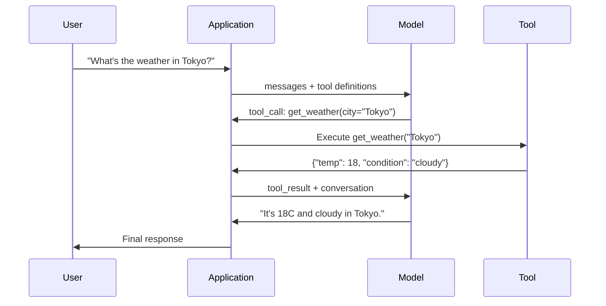

# Fonksiyon Çağrı ve Araç Kullanımı

> LLM'ler kendiliğinden hiçbir şey yapamazlar. Yazıyı oluşturuyorlar. İşte tüm yetenekleri. Hava durumu, veri tabanını, e-posta gönderiyor, kod kullanıyor veya bir dosya okuyor. Gördüğünüz her bir AI ajanı, aslında bir LLM'dir. JSON'u oluşturuyor. Hangi fonksiyonu kullanmak gerektiğini açıklıyor, sonra kodunuz tarafından gerçekten uygulanıyor.

**Type:** Build
**Languages:** Python
**Prerequisites:** Phase 11 Lesson 03 (Structured Outputs)
**Time:** ~75 minutes
**Related:**11 · 14 aşama (Model Konteks Protokolü)  当一个工具 需要跨主共享时,应从线上函数调用升级为MCP服务器──本课覆盖线上场景;MCP 覆盖协议 场景──

## Öğrenme hedefi
- 实现 a function calling loop: define tool schemas、解析模型的 tool-call JSON、执行 functions,并返回结果
-  tasarım, net açıklamalar ve tipi parametre ile araç şemaları, modelin güvenilir bir şekilde düzenlenmesini sağlar
- Bir çok dönüşlü ajan döngüsünü oluşturmak, karmaşık sorulara cevap vermek için bir çok fonksiyon çağrısı ile bağlantılı
- 处理 function calling 边界情况:parallel tool calls、error propagation, as well as preventing unlimited tool loops

## 问题
Tuşlu bir chatbot oluşturdu. kullanıcı sorusu: Tokyo'da hava durumu nedir?

Model cevap:  Gerçek zamanlı hava verilerine erişimim yok, ama mevsimden dolayı Tokyo'nun muhtemelen 15 derece Sölsiyüs civarında olması...

Bu açık açık dış elbiseler halüsinasyonudur. Model hava durumu bilmiyor.

正确答案需要调用OpenWeatherMap API,获取当前温度,并返回真实数值──模型不能调用API──你的代码可以──缺失的一环是:一个结构化协议,让模型可以说我需要使用这些参数 调用天气API,并让你的代码执行它,再把结果回模型──

İşte Bu: Fonksiyon Çağrıması. Model Output Structured JSON, Description to use what arguments 调用哪个函数──你的应用程序 执行函数──结果回到对话 中──模型使用结果生成最终答案──

- Fonksiyon Çağrıları yok, LLM'ler birer kitap.

## 概念
### Çelişki Çekici Fonksiyon

Her bir araç kullanımı 交互都遵循同一个五步循环──



Adım 1: Kullanıcı gönderir mesajı。Adım 2: Model alıcı mesajı ve araç tanımları(Yol kullanılabilir fonksiyonların JSON Şemalarını açıklayın)。Adım 3: Model doğrudan metine geri dönmez, aksine bir araç çağrısı çıkarır, yani işlev adı ve argümanların yapılandırılmış JSON nesnesi içerir。Adım 4: Kodunuzun icra edilmesi işlevini ve elde edilmesi sonucu。Adım 5: Sonuçlar modeline geri döner, model şimdi gerçek verilere sahip, son cevapları oluşturabilir。

Model hiçbir şeyi gerçekleştirmez. Sadece neyi kullanmayacağını ve hangi argümanları kullanmayacağını belirler.

### Araç Tanımları: JSON Şema Sözleşmesi

Her araç bir JSON Şema tarafından tanımlanmıştır, bu işlevi modelin ne yapmasını, hangi argümanları almasını ve bu argümanların nasıl bir tür olması gerektiğini söyler.

```json
{
  "type": "function",
  "function": {
    "name": "get_weather",
    "description": "Get current weather for a city. Returns temperature in Celsius and conditions.",
    "parameters": {
      "type": "object",
      "properties": {
        "city": {
          "type": "string",
          "description": "City name, e.g. 'Tokyo' or 'San Francisco'"
        },
        "units": {
          "type": "string",
          "enum": ["celsius", "fahrenheit"],
          "description": "Temperature units"
        }
      },
      "required": ["city"]
    }
  }
}
```

`description`Alanlar 至关重要──模型会读取它们,以决定何时以及如何使用工具──如get weather这样含糊的描述,比Get current weather for a city.

### Sağlayıcıların Özetleme

Her ana sağlayıcı fonksiyon çağrısını destekler, ancak API yüzeyin farklılıkları vardır.

| Provider | API Parameter | Tool Call Format | Parallel Calls | Forced Calling |
|----------|--------------|-----------------|---------------|----------------|
| OpenAI (GPT-5, o4) | `tools` | `tool_calls[].function` | Yes (multiple per turn) | `tool_choice="required"` |
| Anthropic (Claude 4.6/4.7) | `tools` | `content[].type="tool_use"` | Yes (multiple blocks) | `tool_choice={"type":"any"}` |
| Google (Gemini 3) | `function_declarations` | `functionCall` | Yes | `function_calling_config` |
| Open-weight (Llama 4, Qwen3, DeepSeek-V3) | Native `tools` on Llama 4; Hermes or ChatML on others | Mixed | Model-dependent | Prompt-based or `tool_choice` if supported |

2026 yılına kadar, üç kapalı sağlayıcı neredeyse aynı JSON Şema'ya dayalı biçimleri elde etmiştir.`tools`Alan, şekil ve OpenAI 匹配──Open-weight ince tonlar 仍然各不相同, Hermes biçimi (NousResearch) ise üçüncü taraf ince tonlar arasında en yaygın biçimdir──<br /><br /><br /><br /><br /><br /><br /><br /><br /><br /><br /><br /><br /><br /><br /><br /><br /><br /><br /><br /><br /><br /><br /><br /><br /><br /><br /><br /><br /><br /><br /><br /><br /><br /><br /><br /><br /><br /><br /><br /><br /><br /><br /><br /><br /><br /><br /><br /><br /><br /><br /><br /><br /><br /><br /><br /><br /><br /><br /><br /><br /><br /><br /><br /><br /><br /><br /><br /><br /><br /><br /><br /><br /><br /><br /><br /><br /><br /><br /><br /><br /><br /><br /><br /><br /><br /><br /><br /><br /><br /><br /><br /><br /><br /><br /><br /><br /><br /><br /><br /><br /><br /><br /><br /><br /><br /><br /><br /><br /><br /><br /><br /><br /><br /><br /><br /><br /><br /><br /><br /><br /><br /><br /><br /><br /><br /><br /><br /><br /><br /><br /><br /><br /><br /><br /><br /><<br /><br /><<<br /><br /><<<br /><<<<<br /><<<<<<<<<<<br /><br /><<<<<<<<<<<<

### Araç Seçimi: Otomatik, Gerekli, Özel

Araçları nasıl kullanacağınızı kontrol edebilirsiniz.

**Auto**(默认):模型自行决定是调用工具 还是直接回答── 2+2 nedir? 会直接回答──  气候 nedir? 会调用工具──

**Required**Model en az bir araç kullanmalıdır. Kullanıcıların bu araçtan ne istediğini bildiğinde kullanın.

**Specific function**: zorunlu model belirli bir fonksiyonu kullanmak.`tool_choice={"type":"function", "function": {"name": "get_weather"}}`Güven Hava Aracı, sorgu ne olursa olsun, kullanılacak. Bu da yollama için kullanılacak. Yani akıntı mantığı                                                                                                                                                                                                                                                                                                                                                                                                                                                                                                   

### Paralel Fonksiyon Aramaları

GPT-4o 和 Claude bir tek dönüşte 中调用多个功能──用户问:Tokio ve New York'ta hava nasıl?模型会同时输出两个工具调用:

```json
[
  {"name": "get_weather", "arguments": {"city": "Tokyo"}},
  {"name": "get_weather", "arguments": {"city": "New York"}}
]
```

Suçlama işleminin sonuçları, iki sonuçta sonuçlanır ve model bir cevap oluşturur. Bu da geri dönüş yolculuğunu 2 kezden 1 kezye düşürür.

### Yapılandırılmış Çıktıranlar ve Fonksiyon Çağrıları Karşılığı

Ders 03 strukturlu çıkışları kapsar. Fonksiyon çağrısı kullanma aynı JSON Schema mekanizması, ama amaç farklıdır.

**Structured outputs**: zorunlu model belirli biçimlerde oluşturur.`{name, price, in_stock}`- Evet.

**Function calling**Model deklarasyon: bir eylemin gerçekleştirilmesi için bir plan oluşturmak.`get_weather(city="Tokyo")`Model, son cevabı üretmek yerine bir eylem istemekle ilgilidir.

Eğer bir veri çıkarma ihtiyacı varsa, yapılandırılmış çıkışları kullanın.

### Güvenlik: anlaşılmaz kuralları

Fonksiyon çağrısı, LLM'nin en tehlikeli yeteneğini sağlar. Model seçmek için ne yapılması gerekiyor? Eğer araç kümeniz veritabanı sorgularını içerirse, model sorguları oluşturacaktır.

**Rule 1: Never pass model-generated SQL directly to a database.**Model可能且确实会生成 DROP TABLE、UNION enjeksiyonları,或返回每一行查询──始终参数化──始终验证──始终使用操作允许列──

**Rule 2: Allowlist functions.**Model sadece açıkça tanımladığınız işlevleri kullanabilir. Asla bir genel kullanılabilir  adı altında  herhangi bir işlev  aracı inşa etmeyin. Eğer 50 iç işleviniz varsa, yalnızca kullanıcıların ihtiyaçlarını ortaya çıkarın.

**Rule 3: Validate arguments.**Model可能传入一个城市名称:`"; DROP TABLE users; --"` Execution ⇒ ⇒ ⇒ ⇒ ⇒ ⇒ ⇒ ⇒ ⇒ ⇒ ⇒ ⇒ ⇒ ⇒ ⇒ ⇒ ⇒ ⇒ ⇒ ⇒ ⇒ ⇒ ⇒ ⇒ ⇒ ⇒ ⇒ ⇒ ⇒ ⇒ ⇒ ⇒ ⇒ ⇒ ⇒ ⇒ ⇒ ⇒ ⇒ ⇒ ⇒ ⇒ ⇒ ⇒ ⇒ ⇒ ⇒ ⇒ ⇒ ⇒ ⇒ ⇒ ⇒ ⇒ ⇒ ⇒ ⇒ ⇒ ⇒ ⇒ ⇒ ⇒ ⇒ ⇒ ⇒ ⇒ ⇒ ⇒ ⇒ ⇒ ⇒ ⇒ ⇒ ⇒ ⇒ ⇒ ⇒ ⇒ ⇒ ⇒ ⇒ ⇒ ⇒ ⇒ ⇒ ⇒ ⇒ ⇒ ⇒ ⇒ ⇒ ⇒ ⇒ ⇒ ⇒ ⇒ ⇒ ⇒ ⇒ ⇒ ⇒ ⇒ ⇒ ⇒ ⇒ ⇒ ⇒ ⇒ ⇒ ⇒ ⇒ ⇒ ⇒ ⇒  ⇒ ⇒ ⇒  ⇒ ⇒  ⇒    ⇒ ⇒ ⇒    ⇒      ⇒ ⇒    ⇒ ⇒      ⇒               ⇒                                                                                                                                                                                                                  

**Rule 4: Sanitize tool results.**Eğer bir araç hassas verileri geri gönderirse, bu yöntemin sonuçları, yanıtları içerir.

**Rule 5: Rate limit tool calls.**处于循环中的模型可能调调用工具 数百次──设置一个最大值──每次对话 10-20次电话是合理的──打断无限循环──

### Hata İşlemesi

Aletler 会失败──API 会超时──Databases 会机──Fayllar yok──Model, araçları bilmesi gerekir, ne zaman başarısız olur ve neden başarısız olur──

Hataları  yapılandırma aracı olarak  istisnaları atmak yerine sonuçları  geri gönderin:

```json
{
  "error": true,
  "message": "City 'Toky' not found. Did you mean 'Tokyo'?",
  "code": "CITY_NOT_FOUND"
}
```

模型读取这个结果,调整论点,并重试――Models 很擅长从结构化错误信息中自我纠正――它们不擅长从空反应或泛泛的有错误中恢复――

### MCP: Model Konektsel Protokol

MCP, Antropik 面向工具互操作性的开放标准──它不让每个应用定义自己的工具,而是提供一个通用协议:MCP sunucuları tarafından 提供的工具,并由MCP客户端提供的工具 (如Claude Code、Cursor 或你的应用) 消费──

Bir MCP sunucusu herhangi bir uyumlu müşteriye ırklara açık olabilir. Postgres MCP sunucusu ırkın herhangi bir MCP uyumlu ajanı ırkın veritabanına erişimi sağlar. GitHub MCP sunucusu ırkın herhangi bir ajanı ırkın depolarına erişimi sağlar.

MCP 之于功能调用,就像 HTTP 之于网络化──它标准化运输层,使工具变得便携式──


```figure
mx-tool-call-loop
```

## Yapın onu.
### 步骤 1: Araç Kayıtını Define Et

Bir kayıt yapın, depolama araç tanımları ve uygulamaları için kullanılır. Her araçta JSON Schema tanımı vardır.

```python
import json
import math
import time
import hashlib


TOOL_REGISTRY = {}


def register_tool(name, description, parameters, function):
    TOOL_REGISTRY[name] = {
        "definition": {
            "type": "function",
            "function": {
                "name": name,
                "description": description,
                "parameters": parameters,
            },
        },
        "function": function,
    }
```

### 步骤 2: 5 Araç uygulaması

Bir hesap makinesi oluşturun, hava durumu aramak, web arama simülatörü, dosya okuyucu ve kod çalıştırıcı.

```python
def calculator(expression, precision=2):
    allowed = set("0123456789+-*/.() ")
    if not all(c in allowed for c in expression):
        return {"error": True, "message": f"Invalid characters in expression: {expression}"}
    try:
        result = eval(expression, {"__builtins__": {}}, {"math": math})
        return {"result": round(float(result), precision), "expression": expression}
    except Exception as e:
        return {"error": True, "message": str(e)}


WEATHER_DB = {
    "tokyo": {"temp_c": 18, "condition": "cloudy", "humidity": 72, "wind_kph": 14},
    "new york": {"temp_c": 22, "condition": "sunny", "humidity": 45, "wind_kph": 8},
    "london": {"temp_c": 12, "condition": "rainy", "humidity": 88, "wind_kph": 22},
    "san francisco": {"temp_c": 16, "condition": "foggy", "humidity": 80, "wind_kph": 18},
    "sydney": {"temp_c": 25, "condition": "sunny", "humidity": 55, "wind_kph": 10},
}


def get_weather(city, units="celsius"):
    key = city.lower().strip()
    if key not in WEATHER_DB:
        suggestions = [c for c in WEATHER_DB if c.startswith(key[:3])]
        return {
            "error": True,
            "message": f"City '{city}' not found.",
            "suggestions": suggestions,
            "code": "CITY_NOT_FOUND",
        }
    data = WEATHER_DB[key].copy()
    if units == "fahrenheit":
        data["temp_f"] = round(data["temp_c"] * 9 / 5 + 32, 1)
        del data["temp_c"]
    data["city"] = city
    return data


SEARCH_DB = {
    "python function calling": [
        {"title": "OpenAI Function Calling Guide", "url": "https://platform.openai.com/docs/guides/function-calling", "snippet": "Learn how to connect LLMs to external tools."},
        {"title": "Anthropic Tool Use", "url": "https://docs.anthropic.com/en/docs/tool-use", "snippet": "Claude can interact with external tools and APIs."},
    ],
    "MCP protocol": [
        {"title": "Model Context Protocol", "url": "https://modelcontextprotocol.io", "snippet": "An open standard for connecting AI models to data sources."},
    ],
    "weather API": [
        {"title": "OpenWeatherMap API", "url": "https://openweathermap.org/api", "snippet": "Free weather API with current, forecast, and historical data."},
    ],
}


def web_search(query, max_results=3):
    key = query.lower().strip()
    for db_key, results in SEARCH_DB.items():
        if db_key in key or key in db_key:
            return {"query": query, "results": results[:max_results], "total": len(results)}
    return {"query": query, "results": [], "total": 0}


FILE_SYSTEM = {
    "data/config.json": '{"model": "gpt-4o", "temperature": 0.7, "max_tokens": 4096}',
    "data/users.csv": "name,email,role\nAlice,alice@example.com,admin\nBob,bob@example.com,user",
    "README.md": "# My Project\nA tool-use agent built from scratch.",
}


def read_file(path):
    if ".." in path or path.startswith("/"):
        return {"error": True, "message": "Path traversal not allowed.", "code": "FORBIDDEN"}
    if path not in FILE_SYSTEM:
        available = list(FILE_SYSTEM.keys())
        return {"error": True, "message": f"File '{path}' not found.", "available_files": available, "code": "NOT_FOUND"}
    content = FILE_SYSTEM[path]
    return {"path": path, "content": content, "size_bytes": len(content), "lines": content.count("\n") + 1}


def run_code(code, language="python"):
    if language != "python":
        return {"error": True, "message": f"Language '{language}' not supported. Only 'python' is available."}
    forbidden = ["import os", "import sys", "import subprocess", "exec(", "eval(", "__import__", "open("]
    for pattern in forbidden:
        if pattern in code:
            return {"error": True, "message": f"Forbidden operation: {pattern}", "code": "SECURITY_VIOLATION"}
    try:
        local_vars = {}
        exec(code, {"__builtins__": {"print": print, "range": range, "len": len, "str": str, "int": int, "float": float, "list": list, "dict": dict, "sum": sum, "min": min, "max": max, "abs": abs, "round": round, "sorted": sorted, "enumerate": enumerate, "zip": zip, "map": map, "filter": filter, "math": math}}, local_vars)
        result = local_vars.get("result", None)
        return {"success": True, "result": result, "variables": {k: str(v) for k, v in local_vars.items() if not k.startswith("_")}}
    except Exception as e:
        return {"error": True, "message": f"{type(e).__name__}: {e}"}
```

### 步骤 3: Tüm Araçları Kaydet

```python
def register_all_tools():
    register_tool(
        "calculator", "Evaluate a mathematical expression. Supports +, -, *, /, parentheses, and decimals. Returns the numeric result.",
        {"type": "object", "properties": {"expression": {"type": "string", "description": "Math expression, e.g. '(10 + 5) * 3'"}, "precision": {"type": "integer", "description": "Decimal places in result", "default": 2}}, "required": ["expression"]},
        calculator,
    )
    register_tool(
        "get_weather", "Get current weather for a city. Returns temperature, condition, humidity, and wind speed.",
        {"type": "object", "properties": {"city": {"type": "string", "description": "City name, e.g. 'Tokyo' or 'San Francisco'"}, "units": {"type": "string", "enum": ["celsius", "fahrenheit"], "description": "Temperature units, defaults to celsius"}}, "required": ["city"]},
        get_weather,
    )
    register_tool(
        "web_search", "Search the web for information. Returns a list of results with title, URL, and snippet.",
        {"type": "object", "properties": {"query": {"type": "string", "description": "Search query"}, "max_results": {"type": "integer", "description": "Maximum results to return", "default": 3}}, "required": ["query"]},
        web_search,
    )
    register_tool(
        "read_file", "Read the contents of a file. Returns the file content, size, and line count.",
        {"type": "object", "properties": {"path": {"type": "string", "description": "Relative file path, e.g. 'data/config.json'"}}, "required": ["path"]},
        read_file,
    )
    register_tool(
        "run_code", "Execute Python code in a sandboxed environment. Set a 'result' variable to return output.",
        {"type": "object", "properties": {"code": {"type": "string", "description": "Python code to execute"}, "language": {"type": "string", "enum": ["python"], "description": "Programming language"}}, "required": ["code"]},
        run_code,
    )
```

### 步骤 4: İşlev Çağrı Çelişkisi Oluştur

Bu çekirdek motor. Bu model hangi aracı kullanmayı, hangi aracı kullanmayı ve hangi sonucu elde etmeyi belirler.

```python
def simulate_model_decision(user_message, tools, conversation_history):
    msg = user_message.lower()

    if any(word in msg for word in ["weather", "temperature", "forecast"]):
        cities = []
        for city in WEATHER_DB:
            if city in msg:
                cities.append(city)
        if not cities:
            for word in msg.split():
                if word.capitalize() in [c.title() for c in WEATHER_DB]:
                    cities.append(word)
        if not cities:
            cities = ["tokyo"]
        calls = []
        for city in cities:
            calls.append({"name": "get_weather", "arguments": {"city": city.title()}})
        return calls

    if any(word in msg for word in ["calculate", "compute", "math", "what is", "how much"]):
        for token in msg.split():
            if any(c in token for c in "+-*/"):
                return [{"name": "calculator", "arguments": {"expression": token}}]
        if "+" in msg or "-" in msg or "*" in msg or "/" in msg:
            expr = "".join(c for c in msg if c in "0123456789+-*/.() ")
            if expr.strip():
                return [{"name": "calculator", "arguments": {"expression": expr.strip()}}]
        return [{"name": "calculator", "arguments": {"expression": "0"}}]

    if any(word in msg for word in ["search", "find", "look up", "google"]):
        query = msg.replace("search for", "").replace("look up", "").replace("find", "").strip()
        return [{"name": "web_search", "arguments": {"query": query}}]

    if any(word in msg for word in ["read", "file", "open", "cat", "show"]):
        for path in FILE_SYSTEM:
            if path.split("/")[-1].split(".")[0] in msg:
                return [{"name": "read_file", "arguments": {"path": path}}]
        return [{"name": "read_file", "arguments": {"path": "README.md"}}]

    if any(word in msg for word in ["run", "execute", "code", "python"]):
        return [{"name": "run_code", "arguments": {"code": "result = 'Hello from the sandbox!'", "language": "python"}}]

    return []


def execute_tool_call(tool_call):
    name = tool_call["name"]
    args = tool_call["arguments"]

    if name not in TOOL_REGISTRY:
        return {"error": True, "message": f"Unknown tool: {name}", "code": "UNKNOWN_TOOL"}

    tool = TOOL_REGISTRY[name]
    func = tool["function"]
    start = time.time()

    try:
        result = func(**args)
    except TypeError as e:
        result = {"error": True, "message": f"Invalid arguments: {e}"}

    elapsed_ms = round((time.time() - start) * 1000, 2)
    return {"tool": name, "result": result, "execution_time_ms": elapsed_ms}


def run_function_calling_loop(user_message, max_iterations=5):
    conversation = [{"role": "user", "content": user_message}]
    tool_definitions = [t["definition"] for t in TOOL_REGISTRY.values()]
    all_tool_results = []

    for iteration in range(max_iterations):
        tool_calls = simulate_model_decision(user_message, tool_definitions, conversation)

        if not tool_calls:
            break

        results = []
        for call in tool_calls:
            result = execute_tool_call(call)
            results.append(result)

        conversation.append({"role": "assistant", "content": None, "tool_calls": tool_calls})

        for result in results:
            conversation.append({"role": "tool", "content": json.dumps(result["result"]), "tool_name": result["tool"]})

        all_tool_results.extend(results)
        break

    return {"conversation": conversation, "tool_results": all_tool_results, "iterations": iteration + 1 if tool_calls else 0}
```

### 步骤 5: Düzeni Doğrulama

Construct a validator,在执行前根据 JSON Schema 检查工具调用参数──

```python
def validate_tool_arguments(tool_name, arguments):
    if tool_name not in TOOL_REGISTRY:
        return [f"Unknown tool: {tool_name}"]

    schema = TOOL_REGISTRY[tool_name]["definition"]["function"]["parameters"]
    errors = []

    if not isinstance(arguments, dict):
        return [f"Arguments must be an object, got {type(arguments).__name__}"]

    for required_field in schema.get("required", []):
        if required_field not in arguments:
            errors.append(f"Missing required argument: {required_field}")

    properties = schema.get("properties", {})
    for arg_name, arg_value in arguments.items():
        if arg_name not in properties:
            errors.append(f"Unknown argument: {arg_name}")
            continue

        prop_schema = properties[arg_name]
        expected_type = prop_schema.get("type")

        type_checks = {"string": str, "integer": int, "number": (int, float), "boolean": bool, "array": list, "object": dict}
        if expected_type in type_checks:
            if not isinstance(arg_value, type_checks[expected_type]):
                errors.append(f"Argument '{arg_name}': expected {expected_type}, got {type(arg_value).__name__}")

        if "enum" in prop_schema and arg_value not in prop_schema["enum"]:
            errors.append(f"Argument '{arg_name}': '{arg_value}' not in {prop_schema['enum']}")

    return errors
```

### 步骤 6: Demo çalıştır

```python
def run_demo():
    register_all_tools()

    print("=" * 60)
    print("  Function Calling & Tool Use Demo")
    print("=" * 60)

    print("\n--- Registered Tools ---")
    for name, tool in TOOL_REGISTRY.items():
        desc = tool["definition"]["function"]["description"][:60]
        params = list(tool["definition"]["function"]["parameters"].get("properties", {}).keys())
        print(f"  {name}: {desc}...")
        print(f"    params: {params}")

    print(f"\n--- Argument Validation ---")
    validation_tests = [
        ("get_weather", {"city": "Tokyo"}, "Valid call"),
        ("get_weather", {}, "Missing required arg"),
        ("get_weather", {"city": "Tokyo", "units": "kelvin"}, "Invalid enum value"),
        ("calculator", {"expression": 123}, "Wrong type (int for string)"),
        ("unknown_tool", {"x": 1}, "Unknown tool"),
    ]
    for tool_name, args, label in validation_tests:
        errors = validate_tool_arguments(tool_name, args)
        status = "VALID" if not errors else f"ERRORS: {errors}"
        print(f"  {label}: {status}")

    print(f"\n--- Tool Execution ---")
    direct_tests = [
        {"name": "calculator", "arguments": {"expression": "(10 + 5) * 3 / 2"}},
        {"name": "get_weather", "arguments": {"city": "Tokyo"}},
        {"name": "get_weather", "arguments": {"city": "Mars"}},
        {"name": "web_search", "arguments": {"query": "python function calling"}},
        {"name": "read_file", "arguments": {"path": "data/config.json"}},
        {"name": "read_file", "arguments": {"path": "../etc/passwd"}},
        {"name": "run_code", "arguments": {"code": "result = sum(range(1, 101))"}},
        {"name": "run_code", "arguments": {"code": "import os; os.system('rm -rf /')"}},
    ]
    for call in direct_tests:
        result = execute_tool_call(call)
        print(f"\n  {call['name']}({json.dumps(call['arguments'])})")
        print(f"    -> {json.dumps(result['result'], indent=None)[:100]}")
        print(f"    time: {result['execution_time_ms']}ms")

    print(f"\n--- Full Function Calling Loop ---")
    test_queries = [
        "What's the weather in Tokyo?",
        "Calculate (100 + 250) * 0.15",
        "Search for MCP protocol",
        "Read the config file",
        "Run some Python code",
        "Tell me a joke",
    ]
    for query in test_queries:
        print(f"\n  User: {query}")
        result = run_function_calling_loop(query)
        if result["tool_results"]:
            for tr in result["tool_results"]:
                print(f"    Tool: {tr['tool']} ({tr['execution_time_ms']}ms)")
                print(f"    Result: {json.dumps(tr['result'], indent=None)[:90]}")
        else:
            print(f"    [No tool called -- direct response]")
        print(f"    Iterations: {result['iterations']}")

    print(f"\n--- Parallel Tool Calls ---")
    multi_city_query = "What's the weather in tokyo and london?"
    print(f"  User: {multi_city_query}")
    result = run_function_calling_loop(multi_city_query)
    print(f"  Tool calls made: {len(result['tool_results'])}")
    for tr in result["tool_results"]:
        city = tr["result"].get("city", "unknown")
        temp = tr["result"].get("temp_c", "N/A")
        print(f"    {city}: {temp}C, {tr['result'].get('condition', 'N/A')}")

    print(f"\n--- Security Checks ---")
    security_tests = [
        ("read_file", {"path": "../../etc/passwd"}),
        ("run_code", {"code": "import subprocess; subprocess.run(['ls'])"}),
        ("calculator", {"expression": "__import__('os').system('ls')"}),
    ]
    for tool_name, args in security_tests:
        result = execute_tool_call({"name": tool_name, "arguments": args})
        blocked = result["result"].get("error", False)
        print(f"  {tool_name}({list(args.values())[0][:40]}): {'BLOCKED' if blocked else 'ALLOWED'}")
```

## Kullan
### OpenAI fonksiyon çağrısı

```python
# from openai import OpenAI
#
# client = OpenAI()
#
# tools = [{
#     "type": "function",
#     "function": {
#         "name": "get_weather",
#         "description": "Get current weather for a city",
#         "parameters": {
#             "type": "object",
#             "properties": {
#                 "city": {"type": "string"},
#                 "units": {"type": "string", "enum": ["celsius", "fahrenheit"]}
#             },
#             "required": ["city"]
#         }
#     }
# }]
#
# response = client.chat.completions.create(
#     model="gpt-4o",
#     messages=[{"role": "user", "content": "Weather in Tokyo?"}],
#     tools=tools,
#     tool_choice="auto",
# )
#
# tool_call = response.choices[0].message.tool_calls[0]
# args = json.loads(tool_call.function.arguments)
# result = get_weather(**args)
#
# final = client.chat.completions.create(
#     model="gpt-4o",
#     messages=[
#         {"role": "user", "content": "Weather in Tokyo?"},
#         response.choices[0].message,
#         {"role": "tool", "tool_call_id": tool_call.id, "content": json.dumps(result)},
#     ],
# )
# print(final.choices[0].message.content)
```

OpenAI araç çağrılarını  geri dönüş için `response.choices[0].message.tool_calls`Her çağrıda bir tane var.`id`Bu ID'yi kullanmakla sonuçlar çağrılara uyumludur. GPT-4o, tek bir cevapta birden fazla araç çağrısına cevap verebilir, tüm çağrıları geçerek gerçekleştirmelidir.

### Antropik Araç Kullanımı

```python
# import anthropic
#
# client = anthropic.Anthropic()
#
# response = client.messages.create(
#     model="claude-sonnet-4-20250514",
#     max_tokens=1024,
#     tools=[{
#         "name": "get_weather",
#         "description": "Get current weather for a city",
#         "input_schema": {
#             "type": "object",
#             "properties": {
#                 "city": {"type": "string"},
#                 "units": {"type": "string", "enum": ["celsius", "fahrenheit"]}
#             },
#             "required": ["city"]
#         }
#     }],
#     messages=[{"role": "user", "content": "Weather in Tokyo?"}],
# )
#
# tool_block = next(b for b in response.content if b.type == "tool_use")
# result = get_weather(**tool_block.input)
#
# final = client.messages.create(
#     model="claude-sonnet-4-20250514",
#     max_tokens=1024,
#     tools=[...],
#     messages=[
#         {"role": "user", "content": "Weather in Tokyo?"},
#         {"role": "assistant", "content": response.content},
#         {"role": "user", "content": [{"type": "tool_result", "tool_use_id": tool_block.id, "content": json.dumps(result)}]},
#     ],
# )
```

Antropik araç çağrıları  geri dönüş için 带有`type: "tool_use"`                                                                                                                                                                                                                                                                                                                                                                                                                                                                                                                             `type: "tool_result"`Çeviri:Seviri:Seviri:Seviri:Seviri:Seviri:Seviri:Seviri:Seviri:Seviri:Seviri:Seviri:Seviri:Seviri:Seviri:Seviri:Seviri:Seviri:Seviri:Seviri:Seviri:Seviri:Seviri:Seviri:Seviri:Seviri:Seviri:Seviri:Seviri:Seviri:Seviri:Seviri:Seviri:Seviri:Seviri:Seviri:Seviri:Seviri:Seviri:Seviri:Seviri:Seviri:Seviri:Seviri:Seviri:Seviri:Seviri:Seviri:Seviri:Seviri:Seviri:Seviri:Seviri:Seviri:Seviri:Seviri:Seviri:Seviri:Seviri:Seviri:Seviri:Seviri:Seviri:Seviri:Seviri:Seviri:Seviri:Seviri:Seviri:Seviri:Seviri:Seviri:Seviri:Seviri`input_schema` define tool parameters, while OpenAI 使用 `parameters`- Evet.

### MCP Entegreliği

```python
# MCP servers expose tools over a standardized protocol.
# Any MCP-compatible client can discover and call these tools.
#
# Example: connecting to a Postgres MCP server
#
# from mcp import ClientSession, StdioServerParameters
# from mcp.client.stdio import stdio_client
#
# server_params = StdioServerParameters(
#     command="npx",
#     args=["-y", "@modelcontextprotocol/server-postgres", "postgresql://localhost/mydb"],
# )
#
# async with stdio_client(server_params) as (read, write):
#     async with ClientSession(read, write) as session:
#         await session.initialize()
#         tools = await session.list_tools()
#         result = await session.call_tool("query", {"sql": "SELECT count(*) FROM users"})
```

MCP, araç uygulamasını ve araç tüketimini 解──Postgres sunucusu 了解 SQL── GitHub sunucusu 了解 API──你的代理 只是发现并调用工具,它不需要每一个集成 编写供应商特定代码──

## - Söyle.
本课会产 出 `outputs/prompt-tool-designer.md`, Bu bir tasarım aracı tanımlamaları için tekrarlanabilir bir süsleme şablonu. Bu, tanımlar, türler ve kısıtlamalar dahil olmak üzere tam bir JSON Şema tanımını oluşturacak.

Yine ortaya çıkacak.`outputs/skill-function-calling-patterns.md`, Bu bir üretim içinde işlev çağrısı gerçekleştirmek için kullanılan bir karar çerçevesidir, araç tasarım, hata yönetimi, güvenlik ve tedarikçi-specifik kalıpları kapsar.

## 练习
1. **Add a 6th tool: database query.**实现一个模拟 SQL aracı,使用内存表――该工具 接收表名 和过条件(不是原始SQL) ――验证表名 位于允许列中,并且过操作员 仅限于 `=`- Evet.`>`- Evet.`<`- Evet.`>=`- Evet.`<=`△ △ △ △ △ △ △ △ △ △ △ △ △ △ △ △ △ △ △ △ △ △ △ △ △ △ △ △ △ △ △ △ △ △ △ △ △ △ △ △ △ △ △ △ △ △ △ △ △ △ △ △ △ △ △ △ △ △ △ △ △ △ △ △ △ △ △ △ △ △ △ △ △ △ △ △ △ △ △ △ △ △ △ △ △ △ △ △ △ △ △ △ △ △ △ △ △ △ △ △ △ △ △ △ △ △ △ △ △ △ △ △ △ △ △ △ △ △ △ △ △ △ △ △ △ △ △ △ △ △ △ △ △ △ △ △ △ △ △ △ △ △ △ △ △ △ △ △ △ △ △ △ △ △ △ △ △ △ △ △ △ △ △ △ △ △ △ △ △ △ △ △ △ △ △ △ △ △ △ △ △ △ △ △ △ △ △ △ △ △ △ △ △ △ △ △ △ △ △ △ △ △ △ △ △ △ △ △ △ △ △ △ △ △ △ △ △ △ △ △ △ △ △ △ △ △ △ △ △ △ △ △ △ △ △ △ △ △ △ △  △ △ △   △ △     △       △  △

2. **Implement retry with error feedback.**Bu nedenle, bu durumun bir sonraki yönünde, bir diğer yönü, bir diğer yönü, bir diğer yönü, bir diğer yönü, bir diğer yönü, bir diğer yönü, bir diğer yönü, bir diğer yönü, bir diğer yönü, bir diğer yönü, bir diğer yönü, bir diğer yönü, bir diğer yönü, bir diğer yönü, bir diğer yönü, bir diğer yönü, bir diğer yönü, bir diğer yönü, bir diğer yönü, bir diğer yönü, bir diğer yönü, bir diğer yönü, bir diğer yönü, bir diğer yönü, bir diğer yönü, bir diğer yönü, bir diğer yönü, bir diğer yönü, bir diğer yönü, bir diğer yönü, bir diğer yönü, bir diğer yönü, bir diğer yönü, bir diğer yönü, bir diğer yönü, bir diğer yönü, bir diğer yönü, bir diğer yönü, bir diğer yönü, bir diğer yönü, bir diğer yönü, bir diğer yönü, bir diğer yönü, bir diğer yönü, bir diğer yönü, bir diğer yönü, bir diğer yönü, diğer yönü, diğer yönü, diğer yönü, diğer yönü, diğer yönü, diğer yönü, diğerü, diğer yönü, diğerü, diğerü, diğerü, diğerü, diğerü de de diğerü, diğerü, diğerü, diğerü, diğerü, diğerü, diğerü, diğerü de de de de de de de de de de de de de de de de de de de de de de de de de de de de de de de de de de de de de de de de de de de de de de de de de de de de de de de de de de de de de de de de de de de de de de de de de de de de de de de de de de de de de de de de de de de de de de de de de de de de de de de de de de de de de de de de de de de de de de de de de de de de de de de de de de de de de de de de de de de de de de de de de de de de de de de de de de de de de de de de de de de de de de de de de de de de de de de de de de de de de de de de de de de de de de de de de de

3. **Build a multi-step agent.**某些 queries 需要串联工具调用:Kontfig dosyasını okuyun ve bana hangi modeli yapılandırıldığını söyleyin, sonra web'de model fiyatlandırmasını arayın. 实现一个循环,持续运行直到模型决定不再需要工具,并把累积结果传进每个决策步――限制为10次回复制,以防止无限循环──

4. **Measure tool selection accuracy.**创建30个带有预期工具名的测试查询──在全部30个查询 上运行你的决策功能,并衡量它选择正确工具的比例──识别哪些查询最容易导致工具之间的混──

5. **Implement tool call caching.**Eğer aynı araç 60 saniye içinde aynı argümanlarla çağrılırsa, yeniden gerçekleştirmek yerine önbelleğe alınan sonucu geri gönderir.`(tool_name, frozenset(args.items()))`Çeviri: Çeviri: Çeviri: Çeviri: Çeviri: Çeviri: Çeviri: Çeviri: Çeviri: Çeviri: Çeviri: Çeviri: Çeviri: Çeviri: Çeviri: Çeviri: Çeviri: Çeviri: Çeviri: Çeviri: Çeviri: Çeviri: Çeviri: Çeviri: Çeviri: Çeviri: Çeviri: Çeviri: Çeviri: Çeviri: Çeviri: Çeviri: Çeviri: Çeviri: Çeviri: Çeviri: Çeviri: Çeviri: Çeviri: Çeviri: Çeviri: Çeviri: Çeviri: Çeviri: Çeviri: Çeviri: Çeviri: Çeviri: Çeviri: Çeviri: Çeviri: Çeviri: Çeviri: Çeviri: Çeviri: Çeviri: Çeviri: Çeviri: Çeviri: Çeviri: Çeviri: Çeviri: Çeviri: Çeviri: Çeviri: Çeviri: Çeviri: Çeviri: Çeviri: Çeviri: Çeviri: Çeviri: Çeviri: Çeviri: Çeviri: Çeviri: Çeviri: Çeviri: Çeviri: Çeviri: Çeviri: Çeviri: Çeviri: Çeviri: Çeviri: Çeviri: Çeviri: Çeviri: Çeviri: Çeviri: Çeviri: Çeviri: Çeviri: Çeviri: Çeviri: Çeviri: Çeviri: Çeviri: Çeviri: Çeviri: Çeviri: Çeviri: Çeviri: Çeviri: Çeviri: Çeviri: Çeviri: Çeviri: Ç Ç Çeviri: Ç Ç Ç Ç Ç Ç Ç Ç Ç Ç Ç Ç Ç Ç Ç Ç Ç Ç Ç Ç Ç Ç Ç Ç Ç Ç Ç Ç Ç Ç Ç Ç Ç Ç Ç Ç Ç Ç Ç Ç Ç Ç Ç Ç Ç Ç Ç Ç Ç Ç Ç Ç Ç Ç Ç Ç Ç Ç Ç Ç Ç Ç Ç Ç Ç Ç Ç Ç Ç Ç Ç Ç

## 关键术语
| Term | What people say | What it actually means |
|------|----------------|----------------------|
| Function calling | “Tool use” | 模型输出结构化 JSON，描述要用特定 arguments 调用的 function，由你的代码执行，而不是模型执行 |
| Tool definition | “Function schema” | 一个 JSON Schema object，描述 tool 的 name、purpose、parameters 和 types，模型读取它来决定何时以及如何使用该 tool |
| Tool choice | “Calling mode” | 控制模型必须调用 tool（required）、可以调用 tool（auto），还是必须调用特定 tool（named） |
| Parallel calling | “Multi-tool” | 模型在单个 turn 中输出多个 tool calls，从而减少 round trips，GPT-4o 和 Claude 都支持这一点 |
| Tool result | “Function output” | 执行 tool 后得到的 return value，作为 message 发回模型，使它能在 response 中使用真实数据 |
| Argument validation | “Input checking” | 在执行 tool 前，验证模型生成的 arguments 是否匹配预期 types、ranges 和 constraints |
| MCP | “Tool protocol” | Model Context Protocol，即 Anthropic 的 open standard，用于通过 servers 暴露 tools，让任何兼容 client 都能发现并调用 |
| Agent loop | “ReAct loop” | model-decides-tool、code-executes-tool、result-feeds-back 的迭代循环，直到模型拥有足够信息作出回答 |
| Tool poisoning | “Prompt injection via tools” | 一种攻击，其中 tool results 包含会操纵模型行为的 instructions，因此要 sanitize 所有 tool outputs |
| Rate limiting | “Call budget” | 设置每个 conversation 中 tool calls 的最大数量，以防止 infinite loops 和失控的 API costs |

## 延伸阅读
- [OpenAI Function Calling Guide](https://platform.openai.com/docs/guides/function-calling) GPT-4o kullanmak  paralel çağrılar, zorla çağrılar ve yapılandırılmış argümanlar dahil olmak üzere araç kullanma yetkisi
- [Anthropic Tool Use Guide](https://docs.anthropic.com/en/docs/tool-use) Claude'un araç kullanımı 实现, input_schema、multi-tool cevapları ve tool_choice yapılandırmasını içerir
- [Model Context Protocol Specification](https://modelcontextprotocol.io) 跨 AI uygulamaları 工具互操作性 オープン標準,包含服务器/client architecture
- [Schick et al., 2023 — “Toolformer: Language Models Can Teach Themselves to Use Tools”](https://arxiv.org/abs/2302.04761)  Dolayısıyla, eğitim LLM'lerinin ne zaman ve nasıl dış araçlar kullanılacağını belirleme konusundaki temel makaleler
- [Patil et al., 2023 — “Gorilla: Large Language Model Connected with Massive APIs”](https://arxiv.org/abs/2305.15334)  1.645 API'ye yönelik doğru API çağrıları LLM'lere yönelik ince ayarlamalar yapılmalı ve halüsinasyon azaltılmalıdır
- [Berkeley Function Calling Leaderboard](https://gorilla.cs.berkeley.edu/leaderboard.html) 实时基准, GPT-4o、Claude、Gemini 和 açık modellerdeki işlev çağrı doğruluğuna karşı
- [Yao et al., “ReAct: Synergizing Reasoning and Acting in Language Models” (ICLR 2023)](https://arxiv.org/abs/2210.03629) Düşünce- eylem- gözlem döngüsü, bu her araç çağrısı dış kattaki ajan döngüsü; bu ders bitmek üzere, tam olarak Fase 14 接续之处──
- [Anthropic — Building effective agents (Dec 2024)](https://www.anthropic.com/research/building-effective-agents) Tek bir araç kullanımı ilkel 构建出的五种可组合模式 (birbirinden oluşmuş) 
