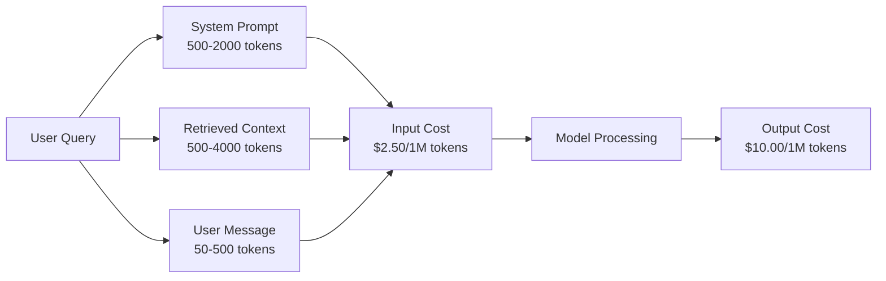
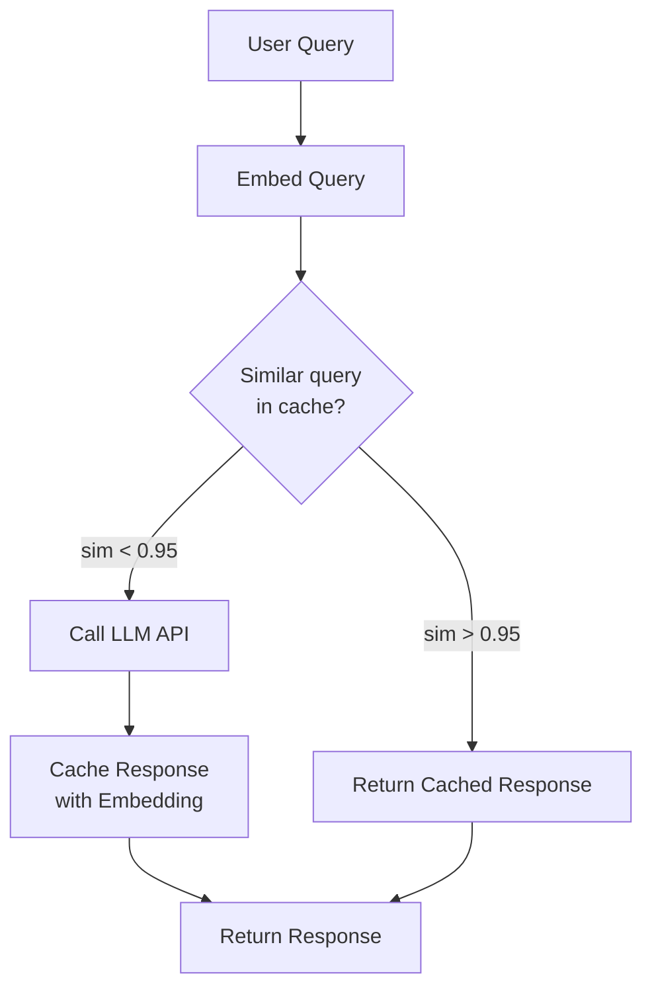
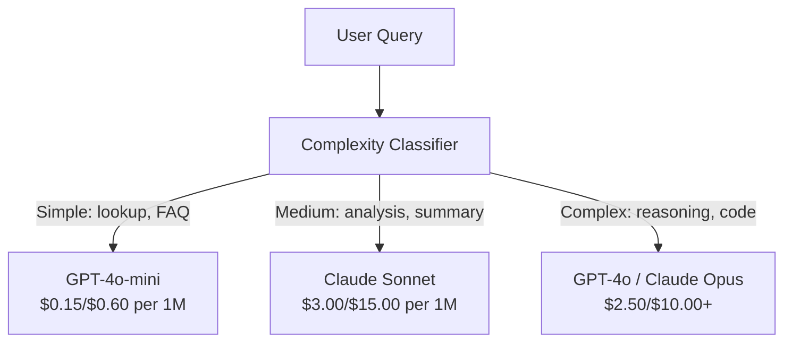

# 缓存、限流与成本优化

> Çoğu AI başlangıç şirketi kötü modelden değil kötü birim ekonomik modelden ölüyor. GPT-4o'nun bir kez kullanılması günde sadece birkaç sent bir sent dolarlık bir işlem olarak kullanılıyor. GPT-4o'nun her kullanıcısı günde 10 kez kullanıyor.

**类型：**Yapım
**语言：**Python
**前置要求：**Eğlence 11 Ders 09 (Fonksiyon Çağırımı)
**时间：**~ 45 dakika
**相关：**Eğitim 15 (Hatırlı Kaşlama) Bu ders, uygulamanın aşamasını kapsar.

## Öğrenme hedefi

- 实现语义缓存响应重复或相似查询, yerine yeni API 调用
- 计算不同供应商的单请求成本,并实现 Token 感知流与预算告警
- 构建成本优化层,包含快速压缩、模型路由(昂贵模型 vs 便宜模型) ve cevap önbelleği
- 设计分层缓存策略,针对不同查询类型使用精确匹配、语义相似和预写缓存

## 问题

RAG chatbot'u inşa ettin. Çok güzel çalışıyor. Kullanıcılar çok hoşlanıyor.

Sonra da bir tane geldi.

GPT-5 Her milyon giriş tokeni $5，每百万 output $15―Claude Opus 4.7 giriş $15 / output $75―Gemini 3 Pro giriş$1.25 / output $5―GPT-5-mini $0.25/$2。 下面价格仅作示例;始终检查提供商 当前的价格页面──

Aşağıda, yeni kurulan şirketlerin matematikleri:

- 10.000 日利用户
- Her kullanıcı günde 10 kez soru sorar .
- Her seferinde 1000 giriş simgesi sorgulaması yapılır.
- Her seferinde 500 çıkış tokeni

**每日 input 成本：**10.000 x 10 x 1.000 / 1.000.000 x $2.50 = **$250/gün**
**每日 output 成本：**10.000 x 10 x 500 / 1.000.000 x $10.00 = **$500/gün**
**每月总计：** **$22,500/month**

Bu sadece LLM. Bu da eklenir. Bu da Embeddings vector veritabanı.

Kötü olan şu: Bu sorulardan %40-60'sı yakın bir şekilde tekrarlanır. Kullanıcılar aynı soruyu sormak için biraz farklı kelime kullanır. Sisteminiz istekleri tamamen aynıdır.

Yeterli hesap için tüm fiyatı ödüyorsun.

## 核心概念

### Bir LLM 调用成本构成

Her API'nin 5 maliyet parçası vardır.



Sistem istekleri sessiz bir maliyet öldürücüdür. 1500 Token'li bir sistem istekleri her istekle gönderilince, sadece bu önbellek milyon istekler arasında harcanır.$3.75。每天 100K 请求时，这就是 $375 gün - 11.250 dolar / ay - ve bunlar hiç değişmiyor.

### Sağlayıcı Kayıt:内置折扣

2026 yılına kadar, üç büyük sağlayıcı sağlayıcı tarafında hızlı önbelleğe sahip olacak, ancak mekanizma farklı olacaktır.

| Provider | 机制 | 折扣 | 最小值 | Cache Duration |
|----------|-----------|----------|---------|----------------|
| Anthropic | 显式 cache_control 标记 | cache hit 享 90% 折扣（写入多付 25%） | 1,024 tokens（Sonnet/Opus），2,048（Haiku） | 默认 5 分钟；扩展 1 小时（2x 写入溢价） |
| OpenAI | 自动 prefix matching | cache hit 享 50% 折扣 | 1,024 tokens | 尽力最多 1 小时 |
| Google Gemini | 显式 CachedContent API | ~75% 降幅（另加存储） | 4,096（Flash）/ 32,768（Pro） | 用户可配置 TTL |

**Anthropic 的方式**- Evet, açıkça.`cache_control: {"type": "ephemeral"}`标记提示 中的部分──第一次请求支付 25% 写入溢价──后续使用相同的预写的请求获得90%折──一个2000-Token的系统提示,正常成本$0.005，cache hit 时成本 $0.000625―100K Lütfen 437.50 dolar/gün

**OpenAI 的方式**Önceki taleple uyumlu herhangi bir hızlı önbölüm için %50 indirim elde edilir.

### Semantik Kayıtlama:Your Self Definition Layer

Provider caching sadece aynı önbellek için uygundur.

"Dönüş politikası nedir?" 和 "Bir öğeyi nasıl geri verebilirim?" 是不同字符串,但意相同──语 cache 会对两个查询做 嵌入,计算 cosine benzerliği; eğer benzerlik 值以上 (通常 0.92-0.95),就返回缓存响应──



Bu nedenle, bu programın en iyi bir şekilde kullanılması için gereken paraları ve değerleri kullanmak için kullanılır.

### Tam Kaşlama: Hash ile eşleşme

对于确定性调用(temperature=0、相同模型、相同 prompt),exact caching 更简单也更快──对完整提示做 Hash,检查缓存,命中就返回──

Bu çok uygun:
- Sistem prompt + 固定 context + 相同 kullanıcı sorguları
- Aynı araç tanımlarını kullanın Funksiyon çağrısı
- Aynı dosya çok kez işlenmiş seri işleme

### Ödül Sınırlaması: bütçenizi korumak

Sadece adalet için değil, hayatta kalmak için.

**Token bucket algorithm：**Her kullanıcı N 个符号含的桶,并以每秒 R 的速度补充. 个请求将从桶中消耗代币. 个请求将从桶中消耗代币. 个请求将被拒绝.

**Per-user quotas：**用户级设置每日/每月 代币限量──

| Tier | Daily Token Limit | Max Requests/min | Model Access |
|------|------------------|------------------|-------------|
| Free | 50,000 | 10 | 仅 GPT-4o-mini |
| Pro | 500,000 | 60 | GPT-4o、Claude Sonnet |
| Enterprise | 5,000,000 | 300 | 所有模型 |

### Model yönlendirme: göreve uygun bir model kullanmak

Her sorunun GPT-4o olması gerekmiyor.

"Dükkan kaçta kapanıyor?" İhtiyacın yok.$10/M-output 的模型。GPT-4o-mini 以 $0.60/M çıkışı çok iyi işlenebilir. Claude Haiku 1,25 $/M çıkışı da işlenebilir.



优良路由器 仅在模型成本上就能节省40~70%──

### Maliyet izleme: Know money spend is where

无法衡量,就无法优化.

- Zaman damgası
- Model adı
- Girit simgeler
- Çıktı tokens
- Gecikme (ms)
- Hesaplanmış maliyet ($)
- Kullanıcı Kimliği
- Önbelleği vurma/kaybolma
- Başvuru kategorisi

Bu veriler, hangi işlevlerin en pahalı olduğunu, hangi kullanıcıların en fazla tükettiğini ve hangi yerlerin en fazla etkilendiğini ortaya çıkaracak.

### Satış: Satış fiyatı indirim

OpenAI'nin Satış API'si %50 indirimli bir işlem istekleri ile.. en fazla 50.000 tane istek gönderdiğiniz için, sonuç 24 saat içinde geri dönecektir..

İbadet 适用于:
- Gece İçin Arşiv İşleme
- Bütük sınıflandırması
- Değerlendirme süreleri
- Veri artırma ırmak ırmak ırmak ırmak ırmak ırmak ırmak ırmak ırmak ırmak ırmak ırmak ırmak ırmak ırmak ırmak ırmak ırmak ırmak ırmak ırmak ırmak ırmak ırmak ırmak ırmak ırmak ırmak ırmak ırmak ırmak ırmak ırmak ırmak ırmak ırmak ırmak ırmak ırmak ırmak ırmak ırmak ırmak ırmak ırmak ırmak ırmak ırmak ırmak ırmak ırmak ırmak ırmak ırmak ırmak ırmak ırmak ırmak ırmak ırmak ırmak ırmak ırmak ırmak ırmak ırmak ırmak ırmak ırmak ırmak ırmak ırmak ırmak ırmak ırmak ırmak ırmak ırmak ırmak ırmak ırmak ırmak ırmak ırmak ırmak ırmak ırmak ırmak ırmak ırmak ırmak ırmak ırmak ırmak ırmak ırmak ırmak ırmak ırmak ırmak ırmak

Not applicable: real time face to user's query (doğru zaman)

### Bütçe Alarmları ve Çeviri Kırıkları

Bir devrim kesici, sınırlamalar karşısında harcamaları durdurur.

设置三个值:
1. **Warning**(Budget %70):
2. **Throttle**(Büdçe % 85): Sadece daha ucuz modellere dönüştürülmüştür
3. **Stop**(Budget 95%): Yeni talepleri reddetmek, sadece geri dönmek

### 优化

Bu teknikleri uygulayarak, her katın ön katın karmaşıklığı artışına sahip olması gerekir.

| Layer | Technique | Typical Savings | Implementation Effort |
|-------|-----------|----------------|----------------------|
| 1 | Provider prompt caching | 30-50% | 低（添加 cache markers） |
| 2 | Exact caching | 10-20% | 低（hash + dict） |
| 3 | Semantic caching | 15-30% | 中（embeddings + similarity） |
| 4 | Model routing | 40-70% | 中（classifier） |
| 5 | Rate limiting | 预算保护 | 低（token bucket） |
| 6 | Prompt compression | 10-30% | 中（重写 prompts） |
| 7 | Batching | 符合条件时 50% | 低（batch API） |

Bir uygulama 1-5 katlı RAG uygulaması, genellikle maliyetleri düşürebilir.$22,500/month 降到 $4,000-6,000 / ay. Bu, burn light pist ve işletme kurma arasındaki fark.

### Gerçekte tasarruf: 优化前后

Aşağıda 10.000 DAU'nun RAG chatbot'unun gerçek çözümü yerle bir.

| Metric | Before Optimization | After Optimization | Savings |
|--------|--------------------|--------------------|---------|
| Monthly LLM cost | $22,500 | $5,200 | 77% |
| Avg cost per query | $0.0075 | $0.0017 | 77% |
| Cache hit rate | 0% | 52% | -- |
| Queries routed to mini | 0% | 65% | -- |
| P95 latency | 2,800ms | 900ms（cache hits: 50ms） | 68% |
| Monthly embedding cost | $0 | $180 | （新增成本） |
| Total monthly cost | $22,500 | $5,380 | 76% |

Semantik önbelleğe yerleştirme 成本($180/ay)


```figure
semantic-cache
```

## Yapın onu.

### 步骤1:Kost Hesaplayıcı

构建一个了解主流模型当前定价的代币 成本计算器──

```python
import hashlib
import time
import json
import math
from dataclasses import dataclass, field


MODEL_PRICING = {
    "gpt-4o": {"input": 2.50, "output": 10.00, "cached_input": 1.25},
    "gpt-4o-mini": {"input": 0.15, "output": 0.60, "cached_input": 0.075},
    "gpt-4.1": {"input": 2.00, "output": 8.00, "cached_input": 0.50},
    "gpt-4.1-mini": {"input": 0.40, "output": 1.60, "cached_input": 0.10},
    "gpt-4.1-nano": {"input": 0.10, "output": 0.40, "cached_input": 0.025},
    "o3": {"input": 2.00, "output": 8.00, "cached_input": 0.50},
    "o3-mini": {"input": 1.10, "output": 4.40, "cached_input": 0.55},
    "o4-mini": {"input": 1.10, "output": 4.40, "cached_input": 0.275},
    "claude-opus-4": {"input": 15.00, "output": 75.00, "cached_input": 1.50},
    "claude-sonnet-4": {"input": 3.00, "output": 15.00, "cached_input": 0.30},
    "claude-haiku-3.5": {"input": 0.80, "output": 4.00, "cached_input": 0.08},
    "gemini-2.5-pro": {"input": 1.25, "output": 10.00, "cached_input": 0.3125},
    "gemini-2.5-flash": {"input": 0.15, "output": 0.60, "cached_input": 0.0375},
}


def calculate_cost(model, input_tokens, output_tokens, cached_input_tokens=0):
    if model not in MODEL_PRICING:
        return {"error": f"Unknown model: {model}"}
    pricing = MODEL_PRICING[model]
    non_cached = input_tokens - cached_input_tokens
    input_cost = (non_cached / 1_000_000) * pricing["input"]
    cached_cost = (cached_input_tokens / 1_000_000) * pricing["cached_input"]
    output_cost = (output_tokens / 1_000_000) * pricing["output"]
    total = input_cost + cached_cost + output_cost
    return {
        "model": model,
        "input_tokens": input_tokens,
        "output_tokens": output_tokens,
        "cached_input_tokens": cached_input_tokens,
        "input_cost": round(input_cost, 6),
        "cached_input_cost": round(cached_cost, 6),
        "output_cost": round(output_cost, 6),
        "total_cost": round(total, 6),
    }
```

### 步骤 2: Tam Kaş

Tam bir istek için Hash yapın, aynı istek için缓存响应返回します.

```python
class ExactCache:
    def __init__(self, max_size=1000, ttl_seconds=3600):
        self.cache = {}
        self.max_size = max_size
        self.ttl = ttl_seconds
        self.hits = 0
        self.misses = 0

    def _hash(self, model, messages, temperature):
        key_data = json.dumps({"model": model, "messages": messages, "temperature": temperature}, sort_keys=True)
        return hashlib.sha256(key_data.encode()).hexdigest()

    def get(self, model, messages, temperature=0.0):
        if temperature > 0:
            self.misses += 1
            return None
        key = self._hash(model, messages, temperature)
        if key in self.cache:
            entry = self.cache[key]
            if time.time() - entry["timestamp"] < self.ttl:
                self.hits += 1
                entry["access_count"] += 1
                return entry["response"]
            del self.cache[key]
        self.misses += 1
        return None

    def put(self, model, messages, temperature, response):
        if temperature > 0:
            return
        if len(self.cache) >= self.max_size:
            oldest_key = min(self.cache, key=lambda k: self.cache[k]["timestamp"])
            del self.cache[oldest_key]
        key = self._hash(model, messages, temperature)
        self.cache[key] = {
            "response": response,
            "timestamp": time.time(),
            "access_count": 1,
        }

    def stats(self):
        total = self.hits + self.misses
        return {
            "hits": self.hits,
            "misses": self.misses,
            "hit_rate": round(self.hits / total, 4) if total > 0 else 0,
            "cache_size": len(self.cache),
        }
```

### 步骤 3: Semantik Kaş

Sorular için yapım yapım yapım yapım yapım yapım yapım yapım yapım yapım yapım yapım yapım yapım yapım yapım yapım yapım yapım yapım yapım yapım yapım yapım yapım yapım yapım yapım yapım yapım yapım yapım yapım yapım yapım yapım yapım yapım yapım yapım yapım yapım yapım yapım yapım yapım yapım yapım yapım yapım yapım yapım yapım yapım yapım yapım yapım yapım yapım yapım yapım yapım yapım yapım yapım yapım yapım yapım yapım yapım yapım yapım yapım yapım yapım yapım yapım yapım yapım yapım yapım yapım yapım yapım yapım yapım yapım yapım yapım yapım yapım yapım yapım yapım yapım yapım yapım yapım yapım yapım yapım yapım yapım yapım yapım yapım yapım yapım yapım yapım yapım yapım yapım yapım yapım yapım yapım yapım yapım yapım yapım yapım yapım yapım yapım yapım yapım yapım yapım yapım yapım yapım yapım yapım yapım yapım yapım yapım yapım yapım yapım yapım yapım yapım yapım yapım yapım yapım yapım yapım yapım yapım yapım yapım yapım yapım yapım yapım yapım yapım yapım yapım yapım yapım yapım yapım yapım yapım yapım yapım yapım yapım yapım yapım yapım yapım yapım yapım yapım yapım yapım yapım yapım yapım yapım yapım yapım yapım yapım yapım yapım yapım yapım yapım yapım yapım yapım yapım yapım yapım yapım yapım yapım yapım yapım yapım yapım yapım yapım yapım yapım yapım yapım yapım yapım yapım yapım yapım yapım yapım yapım yapım yapım yapım yapım yapım yapım yapım yap yap yapım yapım yap yap yap yap yap yapım yap yap yapım yapım yap yap yap yap yap yap yap yap yap yap yap yap yap yap yap yap yap yap yap yap yap yap yap yap yap yap yap yap yap yap yap yap

```python
def simple_embed(text):
    words = text.lower().split()
    vocab = {}
    for w in words:
        vocab[w] = vocab.get(w, 0) + 1
    norm = math.sqrt(sum(v * v for v in vocab.values()))
    if norm == 0:
        return {}
    return {k: v / norm for k, v in vocab.items()}


def cosine_similarity(a, b):
    if not a or not b:
        return 0.0
    all_keys = set(a) | set(b)
    dot = sum(a.get(k, 0) * b.get(k, 0) for k in all_keys)
    return dot


class SemanticCache:
    def __init__(self, similarity_threshold=0.85, max_size=500, ttl_seconds=3600):
        self.entries = []
        self.threshold = similarity_threshold
        self.max_size = max_size
        self.ttl = ttl_seconds
        self.hits = 0
        self.misses = 0

    def get(self, query):
        query_embedding = simple_embed(query)
        now = time.time()
        best_match = None
        best_sim = 0.0
        for entry in self.entries:
            if now - entry["timestamp"] > self.ttl:
                continue
            sim = cosine_similarity(query_embedding, entry["embedding"])
            if sim > best_sim:
                best_sim = sim
                best_match = entry
        if best_match and best_sim >= self.threshold:
            self.hits += 1
            best_match["access_count"] += 1
            return {"response": best_match["response"], "similarity": round(best_sim, 4), "original_query": best_match["query"]}
        self.misses += 1
        return None

    def put(self, query, response):
        if len(self.entries) >= self.max_size:
            self.entries.sort(key=lambda e: e["timestamp"])
            self.entries.pop(0)
        self.entries.append({
            "query": query,
            "embedding": simple_embed(query),
            "response": response,
            "timestamp": time.time(),
            "access_count": 1,
        })

    def stats(self):
        total = self.hits + self.misses
        return {
            "hits": self.hits,
            "misses": self.misses,
            "hit_rate": round(self.hits / total, 4) if total > 0 else 0,
            "cache_size": len(self.entries),
        }
```

### 步骤 4:Satım sınırı

带 kullanıcı başına kvotalar ✓ Token bucket rate limiter

```python
class TokenBucketRateLimiter:
    def __init__(self):
        self.buckets = {}
        self.tiers = {
            "free": {"capacity": 50_000, "refill_rate": 500, "max_requests_per_min": 10},
            "pro": {"capacity": 500_000, "refill_rate": 5_000, "max_requests_per_min": 60},
            "enterprise": {"capacity": 5_000_000, "refill_rate": 50_000, "max_requests_per_min": 300},
        }

    def _get_bucket(self, user_id, tier="free"):
        if user_id not in self.buckets:
            tier_config = self.tiers.get(tier, self.tiers["free"])
            self.buckets[user_id] = {
                "tokens": tier_config["capacity"],
                "capacity": tier_config["capacity"],
                "refill_rate": tier_config["refill_rate"],
                "last_refill": time.time(),
                "request_timestamps": [],
                "max_rpm": tier_config["max_requests_per_min"],
                "tier": tier,
                "total_tokens_used": 0,
            }
        return self.buckets[user_id]

    def _refill(self, bucket):
        now = time.time()
        elapsed = now - bucket["last_refill"]
        refill = int(elapsed * bucket["refill_rate"])
        if refill > 0:
            bucket["tokens"] = min(bucket["capacity"], bucket["tokens"] + refill)
            bucket["last_refill"] = now

    def check(self, user_id, tokens_needed, tier="free"):
        bucket = self._get_bucket(user_id, tier)
        self._refill(bucket)
        now = time.time()
        bucket["request_timestamps"] = [t for t in bucket["request_timestamps"] if now - t < 60]
        if len(bucket["request_timestamps"]) >= bucket["max_rpm"]:
            return {"allowed": False, "reason": "rate_limit", "retry_after_seconds": 60 - (now - bucket["request_timestamps"][0])}
        if bucket["tokens"] < tokens_needed:
            deficit = tokens_needed - bucket["tokens"]
            wait = deficit / bucket["refill_rate"]
            return {"allowed": False, "reason": "token_limit", "tokens_available": bucket["tokens"], "retry_after_seconds": round(wait, 1)}
        return {"allowed": True, "tokens_available": bucket["tokens"]}

    def consume(self, user_id, tokens_used, tier="free"):
        bucket = self._get_bucket(user_id, tier)
        bucket["tokens"] -= tokens_used
        bucket["request_timestamps"].append(time.time())
        bucket["total_tokens_used"] += tokens_used

    def get_usage(self, user_id):
        if user_id not in self.buckets:
            return {"error": "User not found"}
        b = self.buckets[user_id]
        return {
            "user_id": user_id,
            "tier": b["tier"],
            "tokens_remaining": b["tokens"],
            "capacity": b["capacity"],
            "total_tokens_used": b["total_tokens_used"],
            "utilization": round(b["total_tokens_used"] / b["capacity"], 4) if b["capacity"] else 0,
        }
```

### 步骤 5:Kost Tracker

记录每次调用并计算运行中的总计――

```python
class CostTracker:
    def __init__(self, monthly_budget=1000.0):
        self.logs = []
        self.monthly_budget = monthly_budget
        self.alerts = []

    def log_call(self, model, input_tokens, output_tokens, cached_input_tokens=0, latency_ms=0, user_id="anonymous", cache_status="miss"):
        cost = calculate_cost(model, input_tokens, output_tokens, cached_input_tokens)
        entry = {
            "timestamp": time.time(),
            "model": model,
            "input_tokens": input_tokens,
            "output_tokens": output_tokens,
            "cached_input_tokens": cached_input_tokens,
            "latency_ms": latency_ms,
            "cost": cost["total_cost"],
            "user_id": user_id,
            "cache_status": cache_status,
        }
        self.logs.append(entry)
        self._check_budget()
        return entry

    def _check_budget(self):
        total = self.total_cost()
        pct = total / self.monthly_budget if self.monthly_budget > 0 else 0
        if pct >= 0.95 and not any(a["level"] == "stop" for a in self.alerts):
            self.alerts.append({"level": "stop", "message": f"Budget 95% consumed: ${total:.2f}/${self.monthly_budget:.2f}", "timestamp": time.time()})
        elif pct >= 0.85 and not any(a["level"] == "throttle" for a in self.alerts):
            self.alerts.append({"level": "throttle", "message": f"Budget 85% consumed: ${total:.2f}/${self.monthly_budget:.2f}", "timestamp": time.time()})
        elif pct >= 0.70 and not any(a["level"] == "warning" for a in self.alerts):
            self.alerts.append({"level": "warning", "message": f"Budget 70% consumed: ${total:.2f}/${self.monthly_budget:.2f}", "timestamp": time.time()})

    def total_cost(self):
        return round(sum(e["cost"] for e in self.logs), 6)

    def cost_by_model(self):
        by_model = {}
        for e in self.logs:
            m = e["model"]
            if m not in by_model:
                by_model[m] = {"calls": 0, "cost": 0, "input_tokens": 0, "output_tokens": 0}
            by_model[m]["calls"] += 1
            by_model[m]["cost"] = round(by_model[m]["cost"] + e["cost"], 6)
            by_model[m]["input_tokens"] += e["input_tokens"]
            by_model[m]["output_tokens"] += e["output_tokens"]
        return by_model

    def cache_savings(self):
        cache_hits = [e for e in self.logs if e["cache_status"] == "hit"]
        if not cache_hits:
            return {"saved": 0, "cache_hits": 0}
        saved = 0
        for e in cache_hits:
            full_cost = calculate_cost(e["model"], e["input_tokens"], e["output_tokens"])
            saved += full_cost["total_cost"]
        return {"saved": round(saved, 4), "cache_hits": len(cache_hits)}

    def summary(self):
        if not self.logs:
            return {"total_calls": 0, "total_cost": 0}
        total_latency = sum(e["latency_ms"] for e in self.logs)
        cache_hits = sum(1 for e in self.logs if e["cache_status"] == "hit")
        return {
            "total_calls": len(self.logs),
            "total_cost": self.total_cost(),
            "avg_cost_per_call": round(self.total_cost() / len(self.logs), 6),
            "avg_latency_ms": round(total_latency / len(self.logs), 1),
            "cache_hit_rate": round(cache_hits / len(self.logs), 4),
            "cost_by_model": self.cost_by_model(),
            "cache_savings": self.cache_savings(),
            "budget_remaining": round(self.monthly_budget - self.total_cost(), 2),
            "budget_utilization": round(self.total_cost() / self.monthly_budget, 4) if self.monthly_budget > 0 else 0,
            "alerts": self.alerts,
        }
```

### 步骤 6: Model yönlendiricisi

Sorgu yoluyla en ucuz modelini ele alabilecektir.

```python
SIMPLE_KEYWORDS = ["what time", "hours", "address", "phone", "price", "return policy", "hello", "hi", "thanks", "yes", "no"]
COMPLEX_KEYWORDS = ["analyze", "compare", "explain why", "write code", "debug", "architect", "design", "trade-off", "evaluate"]


def classify_complexity(query):
    q = query.lower()
    if len(q.split()) <= 5 or any(kw in q for kw in SIMPLE_KEYWORDS):
        return "simple"
    if any(kw in q for kw in COMPLEX_KEYWORDS):
        return "complex"
    return "medium"


def route_model(query, tier="pro"):
    complexity = classify_complexity(query)
    routing_table = {
        "simple": {"free": "gpt-4.1-nano", "pro": "gpt-4o-mini", "enterprise": "gpt-4o-mini"},
        "medium": {"free": "gpt-4o-mini", "pro": "claude-sonnet-4", "enterprise": "claude-sonnet-4"},
        "complex": {"free": "gpt-4o-mini", "pro": "gpt-4o", "enterprise": "claude-opus-4"},
    }
    model = routing_table[complexity].get(tier, "gpt-4o-mini")
    return {"query": query, "complexity": complexity, "model": model, "tier": tier}
```

### 步骤 7:运行 Demo

```python
def simulate_llm_call(model, query):
    input_tokens = len(query.split()) * 4 + 500
    output_tokens = 150 + (len(query.split()) * 2)
    latency = 200 + (output_tokens * 2)
    return {
        "model": model,
        "response": f"[Simulated {model} response to: {query[:50]}...]",
        "input_tokens": input_tokens,
        "output_tokens": output_tokens,
        "latency_ms": latency,
    }


def run_demo():
    print("=" * 60)
    print("  Caching, Rate Limiting & Cost Optimization Demo")
    print("=" * 60)

    print("\n--- Model Pricing ---")
    for model, pricing in list(MODEL_PRICING.items())[:6]:
        cost_1k = calculate_cost(model, 1000, 500)
        print(f"  {model}: ${cost_1k['total_cost']:.6f} per 1K in + 500 out")

    print("\n--- Cost Comparison: 100K Requests ---")
    for model in ["gpt-4o", "gpt-4o-mini", "claude-sonnet-4", "claude-haiku-3.5"]:
        cost = calculate_cost(model, 1000 * 100_000, 500 * 100_000)
        print(f"  {model}: ${cost['total_cost']:.2f}")

    print("\n--- Anthropic Cache Savings ---")
    no_cache = calculate_cost("claude-sonnet-4", 2000, 500, 0)
    with_cache = calculate_cost("claude-sonnet-4", 2000, 500, 1500)
    saving = no_cache["total_cost"] - with_cache["total_cost"]
    print(f"  Without cache: ${no_cache['total_cost']:.6f}")
    print(f"  With 1500 cached tokens: ${with_cache['total_cost']:.6f}")
    print(f"  Savings per call: ${saving:.6f} ({saving/no_cache['total_cost']*100:.1f}%)")

    exact_cache = ExactCache(max_size=100, ttl_seconds=300)
    semantic_cache = SemanticCache(similarity_threshold=0.75, max_size=100)
    rate_limiter = TokenBucketRateLimiter()
    tracker = CostTracker(monthly_budget=100.0)

    print("\n--- Exact Cache ---")
    messages_1 = [{"role": "user", "content": "What is the return policy?"}]
    result = exact_cache.get("gpt-4o-mini", messages_1, 0.0)
    print(f"  First lookup: {'HIT' if result else 'MISS'}")
    exact_cache.put("gpt-4o-mini", messages_1, 0.0, "You can return items within 30 days.")
    result = exact_cache.get("gpt-4o-mini", messages_1, 0.0)
    print(f"  Second lookup: {'HIT' if result else 'MISS'} -> {result}")
    result = exact_cache.get("gpt-4o-mini", messages_1, 0.7)
    print(f"  With temp=0.7: {'HIT' if result else 'MISS (non-deterministic, skip cache)'}")
    print(f"  Stats: {exact_cache.stats()}")

    print("\n--- Semantic Cache ---")
    test_queries = [
        ("What is the return policy?", "Items can be returned within 30 days with receipt."),
        ("How do I return an item?", None),
        ("What are your store hours?", "We are open 9am-9pm Monday through Saturday."),
        ("When does the store open?", None),
        ("Tell me about quantum computing", "Quantum computers use qubits..."),
        ("Explain quantum mechanics", None),
    ]
    for query, response in test_queries:
        cached = semantic_cache.get(query)
        if cached:
            print(f"  '{query[:40]}' -> CACHE HIT (sim={cached['similarity']}, original='{cached['original_query'][:40]}')")
        elif response:
            semantic_cache.put(query, response)
            print(f"  '{query[:40]}' -> MISS (stored)")
        else:
            print(f"  '{query[:40]}' -> MISS (no match)")
    print(f"  Stats: {semantic_cache.stats()}")

    print("\n--- Rate Limiting ---")
    for i in range(12):
        check = rate_limiter.check("user_1", 1000, "free")
        if check["allowed"]:
            rate_limiter.consume("user_1", 1000, "free")
        status = "OK" if check["allowed"] else f"BLOCKED ({check['reason']})"
        if i < 5 or not check["allowed"]:
            print(f"  Request {i+1}: {status}")
    print(f"  Usage: {rate_limiter.get_usage('user_1')}")

    print("\n--- Model Routing ---")
    routing_queries = [
        "What time do you close?",
        "Summarize this quarterly earnings report",
        "Analyze the trade-offs between microservices and monoliths",
        "Hello",
        "Write code for a binary search tree with deletion",
    ]
    for q in routing_queries:
        route = route_model(q, "pro")
        print(f"  '{q[:50]}' -> {route['model']} ({route['complexity']})")

    print("\n--- Full Pipeline: Before vs After Optimization ---")
    queries = [
        "What is the return policy?",
        "How do I return something?",
        "What are your hours?",
        "When do you open?",
        "Explain the difference between TCP and UDP",
        "Compare TCP vs UDP protocols",
        "Hello",
        "What is your phone number?",
        "Write a Python function to sort a list",
        "Analyze the pros and cons of serverless architecture",
    ]

    print("\n  [Before: no caching, single model (gpt-4o)]")
    tracker_before = CostTracker(monthly_budget=1000.0)
    for q in queries:
        result = simulate_llm_call("gpt-4o", q)
        tracker_before.log_call("gpt-4o", result["input_tokens"], result["output_tokens"], latency_ms=result["latency_ms"], cache_status="miss")
    before = tracker_before.summary()
    print(f"  Total cost: ${before['total_cost']:.6f}")
    print(f"  Avg cost/call: ${before['avg_cost_per_call']:.6f}")
    print(f"  Avg latency: {before['avg_latency_ms']}ms")

    print("\n  [After: caching + routing + rate limiting]")
    exact_c = ExactCache()
    semantic_c = SemanticCache(similarity_threshold=0.75)
    tracker_after = CostTracker(monthly_budget=1000.0)

    for q in queries:
        messages = [{"role": "user", "content": q}]
        cached = exact_c.get("gpt-4o", messages, 0.0)
        if cached:
            tracker_after.log_call("gpt-4o-mini", 0, 0, latency_ms=5, cache_status="hit")
            continue
        sem_cached = semantic_c.get(q)
        if sem_cached:
            tracker_after.log_call("gpt-4o-mini", 0, 0, latency_ms=15, cache_status="hit")
            continue
        route = route_model(q)
        result = simulate_llm_call(route["model"], q)
        tracker_after.log_call(route["model"], result["input_tokens"], result["output_tokens"], latency_ms=result["latency_ms"], cache_status="miss")
        exact_c.put(route["model"], messages, 0.0, result["response"])
        semantic_c.put(q, result["response"])

    after = tracker_after.summary()
    print(f"  Total cost: ${after['total_cost']:.6f}")
    print(f"  Avg cost/call: ${after['avg_cost_per_call']:.6f}")
    print(f"  Avg latency: {after['avg_latency_ms']}ms")
    print(f"  Cache hit rate: {after['cache_hit_rate']:.0%}")

    if before["total_cost"] > 0:
        savings_pct = (1 - after["total_cost"] / before["total_cost"]) * 100
        print(f"\n  SAVINGS: {savings_pct:.1f}% cost reduction")
        print(f"  Latency improvement: {(1 - after['avg_latency_ms'] / before['avg_latency_ms']) * 100:.1f}% faster")

    print("\n--- Budget Alerts Demo ---")
    alert_tracker = CostTracker(monthly_budget=0.01)
    for i in range(5):
        alert_tracker.log_call("gpt-4o", 5000, 2000, latency_ms=500)
    print(f"  Total spent: ${alert_tracker.total_cost():.6f} / ${alert_tracker.monthly_budget}")
    for alert in alert_tracker.alerts:
        print(f"  ALERT [{alert['level'].upper()}]: {alert['message']}")

    print("\n--- Cost Breakdown by Model ---")
    multi_tracker = CostTracker(monthly_budget=500.0)
    for _ in range(50):
        multi_tracker.log_call("gpt-4o-mini", 800, 200, latency_ms=150)
    for _ in range(30):
        multi_tracker.log_call("claude-sonnet-4", 1500, 500, latency_ms=400)
    for _ in range(10):
        multi_tracker.log_call("gpt-4o", 2000, 800, latency_ms=600)
    for _ in range(10):
        multi_tracker.log_call("claude-opus-4", 3000, 1000, latency_ms=1200)
    breakdown = multi_tracker.cost_by_model()
    for model, data in sorted(breakdown.items(), key=lambda x: x[1]["cost"], reverse=True):
        print(f"  {model}: {data['calls']} calls, ${data['cost']:.6f}, {data['input_tokens']:,} in / {data['output_tokens']:,} out")
    print(f"  Total: ${multi_tracker.total_cost():.6f}")

    print("\n" + "=" * 60)
    print("  Demo complete.")
    print("=" * 60)


if __name__ == "__main__":
    run_demo()
```

## Kullan

### Antropik Cevap Kayıtlama

```python
# import anthropic
#
# client = anthropic.Anthropic()
#
# response = client.messages.create(
#     model="claude-sonnet-4-20250514",
#     max_tokens=1024,
#     system=[
#         {
#             "type": "text",
#             "text": "You are a helpful customer support agent for Acme Corp...",
#             "cache_control": {"type": "ephemeral"},
#         }
#     ],
#     messages=[{"role": "user", "content": "What is the return policy?"}],
# )
#
# print(f"Input tokens: {response.usage.input_tokens}")
# print(f"Cache creation tokens: {response.usage.cache_creation_input_tokens}")
# print(f"Cache read tokens: {response.usage.cache_read_input_tokens}")
```

İlk kez %25 ödemeler yapılır. Sonra her birinde aynı sistemle birlikte, %90 indirim yapılır.

### OpenAI Otomatik Kaşlama

```python
# from openai import OpenAI
#
# client = OpenAI()
#
# response = client.chat.completions.create(
#     model="gpt-4o",
#     messages=[
#         {"role": "system", "content": "You are a helpful customer support agent..."},
#         {"role": "user", "content": "What is the return policy?"},
#     ],
# )
#
# print(f"Prompt tokens: {response.usage.prompt_tokens}")
# print(f"Cached tokens: {response.usage.prompt_tokens_details.cached_tokens}")
# print(f"Completion tokens: {response.usage.completion_tokens}")
```

OpenAI otomatik olarak depolama yapar. 1.024+ token için, yakın zamanda yapılan taleple uyum sağlayan herhangi bir token için %50 indirim elde edilir.`prompt_tokens_details.cached_tokens`Etkili olup olmadığını kontrol etmek için.

### OpenAI Batch API

```python
# import json
# from openai import OpenAI
#
# client = OpenAI()
#
# requests = []
# for i, query in enumerate(queries):
#     requests.append({
#         "custom_id": f"request-{i}",
#         "method": "POST",
#         "url": "/v1/chat/completions",
#         "body": {
#             "model": "gpt-4o-mini",
#             "messages": [{"role": "user", "content": query}],
#         },
#     })
#
# with open("batch_input.jsonl", "w") as f:
#     for r in requests:
#         f.write(json.dumps(r) + "\n")
#
# batch_file = client.files.create(file=open("batch_input.jsonl", "rb"), purpose="batch")
# batch = client.batches.create(input_file_id=batch_file.id, endpoint="/v1/chat/completions", completion_window="24h")
# print(f"Batch ID: {batch.id}, Status: {batch.status}")
```

Satır API tüm tokenler için %50 indirim sağlar. Sonuçlar 24 saat içinde geri dönecektir.

### Redis'in üretim sınıfı Semantic Cache kullan

```python
# import redis
# import numpy as np
# from openai import OpenAI
#
# r = redis.Redis()
# client = OpenAI()
#
# def get_embedding(text):
#     response = client.embeddings.create(model="text-embedding-3-small", input=text)
#     return response.data[0].embedding
#
# def semantic_cache_lookup(query, threshold=0.95):
#     query_emb = np.array(get_embedding(query))
#     keys = r.keys("cache:emb:*")
#     best_sim, best_key = 0, None
#     for key in keys:
#         stored_emb = np.frombuffer(r.get(key), dtype=np.float32)
#         sim = np.dot(query_emb, stored_emb) / (np.linalg.norm(query_emb) * np.linalg.norm(stored_emb))
#         if sim > best_sim:
#             best_sim, best_key = sim, key
#     if best_sim >= threshold and best_key:
#         response_key = best_key.decode().replace("cache:emb:", "cache:resp:")
#         return r.get(response_key).decode()
#     return None
```

Yapım ortamında, Redis Vector Search、Pinecone veya pgvector) alternatif 线性扫描──线性扫描适用于 <1,000 条条条条条条条条条条条条条条条条条条条条条条条条条条条条条条条条条条条条条条条条条条条条条条条条条条条条条条条条条条条条条条条条条条条条条条条条条条条条条条条条条条条条条条条条条条条条条条条条条条条条条条条条条条条条条条条条条条条条条条条条条条条条条条条条条条条条条条条条条条条条条条条条条条条条条条条条条条条条条条条条条条条条条条条条条条条条条条条条条条条条条条条条条条条条条条条条条条条条条条条条条条条条条条条条条条条条条条条条条条条条条条条条条条条条条条条条条条条条条条条条条条条条条条条条条条条条条条条条条条条条条条条条条条条条条条条条条条条条条条条条条条条条条条条条条条条条条条条条条条条条条条条条条条条条条条条条条条条条条条条条条条条条条条条条条条条条条条条条条条条条条条条条条条条条条条条条条条条条条条条条条条条条条条条条条条条条条条条条条条条条条条条条条条条条条条条条条条条条条条条条条条条条条条条条条条条条条条条条条条条条条条条条条条条条条条条条条条条条条条条条条条条条条条条条条条条条条条条条条条条条条条条条条条条条条条条条条条

## - Söyle.

本课会产 出 `outputs/prompt-cost-optimizer.md`- LLM başvurularınızı analiz etmek için tekrarlanabilir bir ipucu, ve tahmin edilen tasarruf miktarının özel maliyetleri optimize etmesi için öneriler verin.

Yine ortaya çıkacak.`outputs/skill-cost-patterns.md`-- bir karar çerçevesini, sizin için uygun bir önbelleğe strateji seçmek için kullanılır — hızı sınırlama yapılandırması ve model yönlendirme kuralları

## 练习

1. **为 semantic cache 实现 LRU eviction。**En eski ilk çıkarma  replaced for the least-recently used― for each entry 跟踪 last access time, and缓存满时淘汰 access time 最旧的 entry― 100 soruya karşı karşılaştırın iki stratejinin hit rate¬leri

2. **构建成本预测工具。**给定一份 API 调用日志(CostTracker logs),过去 7 天平均值预测月度成本──考虑工作日/周末模式── Eğer tahmin edilen aylık maliyet 预算ın üzerinde 20%,触发告警──

3. **实现分层 semantic caching。**İki benzerlik eşiği kullanın: 0.98 Yüksek Güven Hits için, 0.90 Orta Güven Hits için, 0.90 Orta Güven Hits için, 1.0.98'den, 0.90'dan, 0.90'dan, 0.99.99.99.99.99.99.99.99.99.99.99.99.99.99.99.99.99.99.99.99.99.99.99.99.99.99.99.99.99.99.99.99.99.99.99.99.99.99.99.99.99.99.99.99.99.99.99.99.99.99.99.99.99.99.99.99.99.99.99.99.99.99.99.99.99.99.99.99.99.99.99.99.99.99.99.99.99.99.99.99.99.99.99.99.99.99.99.99.99.99.99.99.99.99.99.99.99.99.99.99.99.99.99.99.99.99.99.99.99.99.99.99.99.99.99.99.99.99.99.99.99.99.99.99.99.99.99.99.99.99.99.99.99.99.99.99.99.99.99.99.99.99.99.99.99.99.99.99.99.99.99.99.99.99.99.99.99.99.99.99.99.99.99.99.99.99.99.99.99.99.99.99.99.99.99.99.99.99.99.99.99.99.99.99.99.99.99.99.99.99.99.99.99.99.99.99.99.99.99.99.99.99.99.99.99.99.99.99.99.99.99.99.99.99.99.99.99.99.99.99.99.99.99.99.99.99.99.99.99.9

4. **构建 model routing classifier。**Embedding tabanlı sınıflandırıcı kullanın anahtar kelime tabanlı sınıflandırıcı değiştirin. 50 条 işaretli sorgulara karşı  Embedding yapın. Sonra son belirlenen örnekleri arayın.

5. **实现带降级等级的 circuit breaker。**Bu nedenle, bu programın en iyi yönlendirmesi, bu yönlendirmenin en iyi yönlendirmesine sahip olması ve bu yönlendirmenin en iyi yönlendirmesine sahip olması için tasarlanmıştır.

## 关键术语

| Term | 人们常说 | 它实际含义 |
|------|----------------|----------------------|
| Prompt caching | "Cache the system prompt" | Provider-level caching，重复 prompt prefixes 会获得折扣（Anthropic 90%，OpenAI 50%）-- OpenAI 不需要改代码，Anthropic 需要显式 markers |
| Semantic caching | "Smart caching" | 对 query 做 Embedding，计算与过去 queries 的 similarity，如果 similarity 超过阈值就返回缓存响应 -- 能捕捉 exact matching 漏掉的改写表达 |
| Exact caching | "Hash caching" | 对完整 prompt（model + messages + temperature）做 Hash，并对相同输入返回缓存响应 -- 只适用于 temperature=0 的确定性调用 |
| Token bucket | "Rate limiter" | 一种算法：每个用户有一个包含 N 个 tokens 的 bucket，并以每秒 R 的速率补充 -- 允许最多 N 的突发，同时强制平均速率为 R |
| Model routing | "Cheapskate routing" | 使用 classifier 将简单 queries 发送到便宜模型（GPT-4o-mini、Haiku），将复杂 queries 发送到昂贵模型（GPT-4o、Opus）-- 可节省 40-70% 模型成本 |
| Cost tracking | "Metering" | 记录每次 API 调用的 model、tokens、latency、cost 和 user ID，让你精确知道钱花在哪里、哪些功能最贵 |
| Circuit breaker | "Kill switch" | 当支出接近预算限制时，自动降级服务（更便宜模型、仅缓存）或完全停止请求 |
| Batch API | "Bulk discount" | OpenAI 的异步处理，享 50% 折扣 -- 最多提交 50,000 个请求，24 小时内获得结果 |
| Prompt compression | "Token diet" | 重写 system prompts 和 context，在保留含义的同时使用更少 tokens -- 更短的 prompts 成本更低，而且通常表现更好 |
| Cache hit rate | "Cache efficiency" | 从缓存服务而不是调用 LLM 的请求百分比 -- 生产 chatbot 中 40-60% 很常见，成本按比例节省 |

## 延伸阅读

- [Anthropic Prompt Caching Guide](https://docs.anthropic.com/en/docs/build-with-claude/prompt-caching)-- Antropik 显式 cache_control markers、 priceing 和 cache yaşam süresi davranışları 的官方文档
- [OpenAI Prompt Caching](https://platform.openai.com/docs/guides/prompt-caching)-- OpenAI'nin otomatik depolaması, kullanım alanları nasıl geçer 验证 cache hits,以及最小 prefix lengths
- [OpenAI Batch API](https://platform.openai.com/docs/guides/batch)-- 异步处理 50% 折扣、JSONL biçimi、24 saatlik tamamlama penceresi
- [GPTCache](https://github.com/zilliztech/GPTCache)-- open source semantic caching library, support多种 Embedding backends、Vector stores 和 eviction politikaları
- [Martian Model Router](https://docs.withmartian.com)-- 生产级 model yönlendirme,可自动选择能处理每个查询的最便宜模型
- [Not Diamond](https://www.notdiamond.ai)-- ML tabanlı model yönlendiricisi, trafik modellerini öğrenir Mid learning, provider  optimize maliyet / kalite pazarlamaları
- [Helicone](https://www.helicone.ai)-- LLM gözlemlenebilirlik platformu, proxy katman şeklinde maliyet izleme, kaydeden kaydetme, oran sınırlaması ve bütçe uyarıları sunar
- [Dean & Barroso, "The Tail at Scale" (CACM 2013)](https://research.google/pubs/the-tail-at-scale/)-- latency, throughput, TTFT/TPOT percentiles, hedged requests; "P95'e still meeting the cheapest model" 背后的成本模型
- [Kwon et al., "Efficient Memory Management for Large Language Model Serving with PagedAttention" (SOSP 2023)](https://arxiv.org/abs/2309.06180)-- vLLM 论文; açıklayın neden pageed KV-cache + sürekli batching 在 throughput 上比天真服务器 快 24×,即"caching and cost" 之下下下下下下下下下下下下下下下下下下下下下下下下下下下下下下下下下下下下下下下下下下下下下下下下下下下下下下下下下下下下下下下下下下下下下下下下下下下下下下下下下下下下下下下下下下下下下下下下下下下下下下下下下下下下下下下下下下下下下下下下下下下下下下下下下下下下下下下下下下下下下下下下下下下下下下下下下下下下下下下下下下下下下下下下下下下下下下下下下下下下下下下下下下下下下下下下下下下下下下下下下下下下下下下下下下下下下下下下下下下下下下下下下下下下下下下下下下下下下下下下下下下下下下下下下下下下下下下下下下下下下下下下下下下下下下下下下下下下下下下下下下下下下下下下下下下下下下下下下下下下下下下下下下下下下下下下下下下下下下下下下下下下下下下下下下下下下下下下下下下下下下下下下下下下下下下下下下下下下下下下下下下下下下下下下下下下下下下下下下下下下下下下下下下下下下下下下下下下下下下下下下下下下下下下下下下下下下下下下下下下下下下下下下下下下下下下下下下下下下下下下下下下下下下下下下下下下下下下下下下下下下下下下
- [Dao et al., "FlashAttention-2: Faster Attention with Better Parallelism and Work Partitioning" (ICLR 2024)](https://arxiv.org/abs/2307.08691)-- Raport önbelleğe doğru işlem çekirdek seviyesinde giderek düşer;
