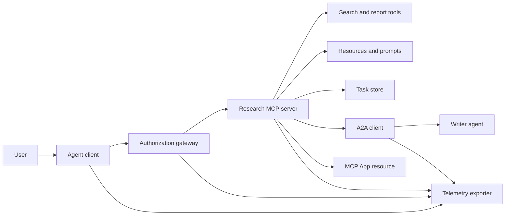
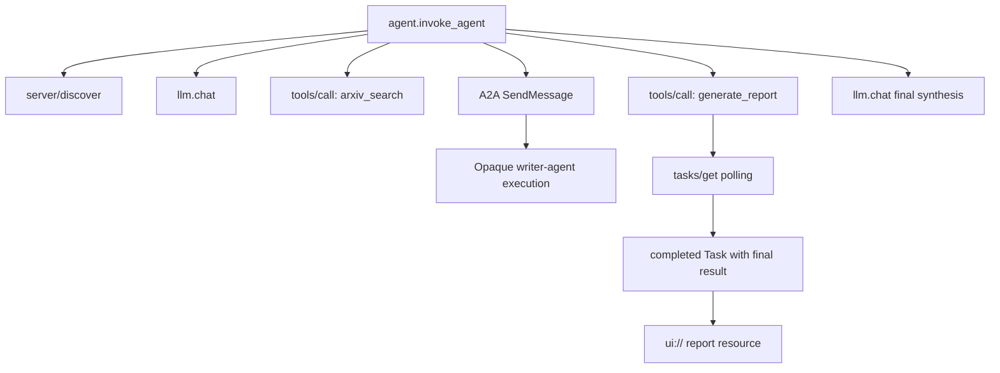
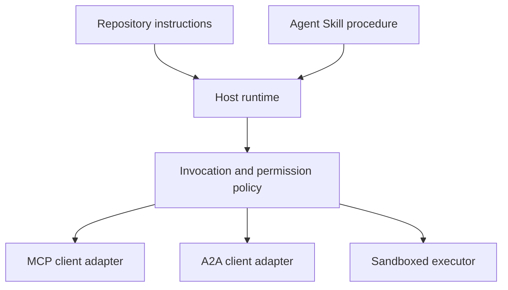

# 综合实战项目: 无状态工具生态系统

> Üretim sınıfı ajanı  sistemi, net sınırların bir kümesi, fakat özelliği olmayan basit bir komplo. Bu gerçek savaş projesi, net bir şekilde okuyabilir bir süreç içinde benzerleşecek, gerçek bir dağıtımda gerekli olan protokol müşteriler, yetkili hizmetçiler, yürütme kutusu ve uzaktan ölçüm çıkartıcıları ile sıkı bir şekilde çözülecek.

**Type:** Build
**Languages:** Python (stdlib, in-process simulation)
**Prerequisites:** Phase 13 · 01 through 22, using MCP revision `2026-07-28`
**Time:** ~120 minutes

## Öğrenme hedefi

- Bu yöntemler, görev seviyesinin sonuçlarını, ajanlar arası kaynakları, yetki ve dağıtımlı takip kayıtlarını oluşturmak için kullanılır.
- Her MCP'nin isteklerinde sıkı bir protokol sürümü, müşteri kimliği ve yetenekleri, ileti aşamasındaki konuşmalara tamamen bağlılık.
- Bu nedenle, bu görevler, işlerin süresi ve süresi ile ilgili olarak, bu görevlerin tümüyle yapılması gerekir.
- 清晰区分符合协议形态的本地模拟 (protokoll şeklinde simülasyon) gerçek MCP、A2A、OAuth 及 OpenTelemetry 生产实现──
- Simülasyon makinesi'ndeki her bir soyut sınırının, üretim sırasında değiştirilmesi gereken fiziksel bileşenlere kadar doğru bir şekilde harekete geçirilmesi gerekir.
- 确保 `AGENTS.md`、Agent becerileri、运行时适配器、工具 及安全策略 、各自坚守正确的架构职责──
- 明确指出哪些技术断言可以直接由本地输出证明,哪些必须依赖于真实端到端集成测试──

## 问题

设计一个学术研究和报告生成系统:用户请求检查关于代理 通信协议的论文――系统检查论文目录、委托编写总结、生成分析报告、返回 UI 交互资源,并完整记录系统执行的链路踪――

Bu cümle basit görünüyor, aslında birbirinden bağımsız birçok anlaşma saklıyor:

- 面向模型的工具方案 声明;
- 无状态请求信封与服务发现契约;
- 针对主体(attor) 、范围和工具 身份的网关决策;
- 长周期任务操作契约;
- 跨 agent 委托协作协议(A2A);
- 宿主 ile前端应用 (MCP App) arasındaki iletişim köprü;
- 链路追踪的上下文传播与导出;
- Çözümlü bir standartlama

`code/main.py`Temiz Python fonksiyonlarını ve kitaptaki kullanımını açık bir şekilde görüyoruz. Bu, ağın açılmasını engellemiyor. Arxiv'i gerçekleştirmiyor.

## 概念

### 目标架构



Bu yapı, açık standart protokol modelinin kavramsal bir birleşimidir ve herhangi bir tek özel ürünün özel iç realizasyonu değildir.

### 目标 dağıtılmış takip bağlantısı



Gerçek üretim aşamasında, her bir ağ atış aşamasında doğruca yayılması gerekir.

### Çevreye girdi

Yeni bir yöntem kullanın.

| 边界 | 当前标准交互表面 | 本实战项目的本地模拟实现 |
|---|---|---|
| MCP 服务发现 | 强制性的 `server/discover` | 返回版本、capabilities 和服务器身份的直接函数 |
| MCP 请求上下文 | 每个 `params._meta` 均携带版本、capabilities 及客户端信息 | 传递给每次模拟调用的全新请求元数据 |
| MCP 工具调用 | `tools/call` | Python 本地函数直接分发 |
| MCP 任务轮询 | `io.modelcontextprotocol/tasks` 扩展与 `tasks/get` | 先返回处理中的任务句柄，后返回内联最终结果的完成任务 |
| A2A 跨代理委托 | gRPC 和 JSON-RPC 中为 `SendMessage`；HTTP+JSON 中为 `POST /message:send` | 无远程调用与人为延迟的单层嵌套 Span |
| MCP App 调用宿主工具 | `app.callServerTool({ name, arguments })` | 无实时通信桥梁的纯 HTML 字符串 |
| OAuth 鉴权 | 授权服务器、受保护资源元数据、Audience 与 Scope 校验 | 静态 Token 字典查找与 Scope 集合判断 |
| OpenTelemetry | SDK、传播器（Propagator）、导出器（Exporter）及收集器（Collector） | 纯内存 Span 字典数组 |

协议名称仅仅是最外层的表象――生产测试必须覆盖真实网络线缆上的序列化反序列化、认证失败、取消中断、超时重试以及协议多版本兼容――

### 无状态 MCP 重构集成边界

`2026-07-28`修订版本 Anlaşmanın oturumu tamamen kaldırıldı ve `initialize`- Ne ?`notifications/initialized`握手阶段──同时废除 `Mcp-Session-Id` Herkesin istekleri var `params._meta`İçinde:

```json
{
  "io.modelcontextprotocol/protocolVersion": "2026-07-28",
  "io.modelcontextprotocol/clientCapabilities": {
    "extensions": {
      "io.modelcontextprotocol/tasks": {}
    }
  },
  "io.modelcontextprotocol/clientInfo": {
    "name": "capstone-client",
    "version": "1.0.0"
  }
}
```

服务端必须实现 `server/discover`◊常规结果使用 `resultType: "complete"`;返回任务句柄时使用 `resultType: "task"`                                                                                                                                                                                                                                                              `_meta.io.modelcontextprotocol/serverInfo`中表示服务器自身身份──

Görevler 扩展包含 `tasks/get`- Evet.`tasks/update`Ve `tasks/cancel`❖ Araç ilk kez kullanılabilir.`resultType: "task"`Ve sonraki sorguların`tasks/get`Ben de dönüyorum.`resultType: "complete"`, ve tamamlanmış durumda `Task`Bu nedenle, bu konuyla ilgili olarak, bu konuyla ilgili olarak, bu konuyla ilgili olarak, bu konuyla ilgili olarak, bu konuyla ilgili olarak, bu konuyla ilgili olarak, bu konuyla ilgili olarak, bu konuyla ilgili olarak, bu konuyla ilgili olarak, bu konuyla ilgili olarak, bu konuyla ilgili olarak, bu konuyla ilgili olarak, bu konuyla ilgili olarak, bu konuyla ilgili olarak, bu konuyla ilgili olarak, bu konuyla ilgili olarak, bu konuyla ilgili olarak, bu konuyla ilgili olarak, bu konuyla ilgili olarak, bu konuyla ilgili olarak, bu konuyla ilgili olarak, bu konuyla ilgili olarak, bu konuyla ilgili olarak, bu konuyla ilgili olarak, bu konuyla ilgili olarak, bu konuyla ilgili olarak, bu konuyla ilgili olarak,`tasks/result`ile`tasks/list`已已完全移除──客户端必须在可能收到任务句柄的同一个请求中声明支持 `io.modelcontextprotocol/tasks`扩展; eğer açıklanmamışsa, servis端将返回 `-32021`错误, ve `requiredCapabilities`Mid明指出缺失的扩展项──

### Güvenlik durumu (Security posture)

预期的生产部署环境必须采用全深防御:

- PKKCE ile koruma ihtiyacı olan müşteri türlerinin zorunlu kullanımı için OAuth  otoritesi;
- Çekilme Token 强制实施资源 (resurs) 与受众 (audience) 绑定
- 网关  rolden kaynaklı sert bir değerlendirme ve kullanılabilirlik araçları   etki alanı  sınırları;
- 访问上游 API'nin anahtar bilgilerini model görünen üst aşağıdaki metinlerde sıkı bir şekilde açıklamak yasaklanmıştır;
- 严格锁定并审查 aracı 描述元数据清单(Manifest);
-  Güvenilmez giriş, hassas veri ve önemli dış etkileri karşısında                                                                                                                                                                                                                                                                                                                       
- Ayrı bir şekilde yürütülen bir uygulama kutusunda, dosya sistemleri, süreçleri, ağları, sertifikaları ve kaynak tüketimini sınırlamak, Yetenek Dış Bakanlığı tarafından zorunlu olarak uygulanmalıdır.

Bu ders örnek kodları sadece statistik Token、Scope 校验 ve açıklamaları gerçekleştirir.

### Bilgiler, ağ aktarımı değil, işletim düzenlemesi.

Agent Skill, çalışmada çalışma akışını nasıl ilerletmesi gerektiğini, hangi araçların uygun olacağını, hangi süreç denetimlerinin ne zaman sona ereceğini ve görevlerin ne zaman sona ereceğini anlatmak için kullanılır. Ancak boşlukta MCP sunucuları oluşturamaz, A2A anlaşması bağlantısı oluşturamaz, izin verilebilir, kapsamını oluşturamaz veya bir kod kutu oluşturamaz.



İşlem kuralları, bir kaynak dosyasını alıntı yapması gerektiğinde, bu dersin erken teslimatlarındaki tek dosya bileşenlerinin tamamlanmış bir beceri klasörü biçiminde dağıtılması gerekir.

###  ders ürünleri için veri bu yerel adaptör

Bu ders için kayıt göstergesi ve montaj cihazı tanımlanabilir.`skill-*.md`Bu, bu sınıfın üst düzey birinci sınıf anahtarı olan bir çözücü tarafından sadece okunabilir. Bu nedenle, bu ders, standart bölüm ve ders özel bölümlerini aynı sınıfta tutarak yapılabilir:

```yaml
---
name: ecosystem-blueprint
description: Produce a full Phase 13 ecosystem architecture for a product need.
version: "1.0.0"
phase: "13"
lesson: "23"
tags: [mcp, capstone, ecosystem, architecture, a2a, otel]
---
```

`name`ile`description`Yapılacak standartların temel özelliği:`version`- Evet.`phase`- Evet.`lesson`和 `tags`Bu, programın genişletilmesi için yapılması gereken bir programdır.`tags`写为单行内联数组,以便 `--tag capstone`- Evet.

标准的可移植目录  Seçilebilir beceriler kullanılabilir`metadata`字典存放自定义扩展数据──但在本仓库单文件中,如果将`version`Ya da`tags`嵌套缩进写入 `metadata`İçinde, çok basit çözücü doğrudan göz ardı edilir, bu da, sürüm numarasını çıkaramayacak ve etiketlenemeyecek şekilde başarısızlığa neden olur.

### Yerel simülasyon gerçek üretim ortamına karşı

| 架构分层 | `code/main.py` 实现 | 生产落地替换方案 | 必须出示的验收证据 |
|---|---|---|---|
| 服务发现 | `server_discover()` 加静态 `TOOLS` | `server/discover` 配合带缓存的 `tools/list` | 报文轨迹、确定性排序与 Schema 校验 |
| 身份认证 | 基于 Token 的内存字典 | 独立的 OAuth 授权服务器与资源服务器验证 | 签发者、受众、Scope、过期与故障降级测试 |
| 授权鉴权 | Scope 集合成员判定 | 绑定主体、tool、目标和租户的网关策略 | 允许与拒绝分支的完整审计日志用例 |
| 论文检索 | 静态论文测试夹具（Fixtures） | 真实检索 API 或专门的 MCP Server | 数据溯源、排序打分与网络异常测试 |
| 异步任务 | 本地句柄加立即 `tasks/get` | 持久化 `io.modelcontextprotocol/tasks` 存储，实现 get/update/cancel 与 TTL | 状态迁移、用户输入、取消及宕机恢复测试 |
| 跨 Agent 委托 | 本地 Sleep 加嵌套 Span | 真实的 A2A 客户端与远程 Agent Card | 契约校验、超时重试与不透明执行测试 |
| 前端交互 App | HTML 字符串与 URI 协议头 | MCP Apps 资源与官方 `App` 通信桥梁 | CSP 安全策略、权限受控、tool 调用与浏览器渲染测试 |
| 链路遥测 | 内存 Python 字典列表 | 完整的 OTel SDK 与远程导出器（Exporter） | 收集端接收凭证与父子 Span 关联断言 |
| 执行沙箱 | 无 | 宿主强制隔离的安全沙箱执行器 | 沙箱逃逸、出站网络、敏感凭证与资源上限测试 |

Bu karşılaştırma, bir tasarım bağlantısının net sınırlarını oluşturur.

### 13. aşama

| 课次区间 | 核心贡献与架构职责 |
|---|---|
| 01-05 | Tool 接口标准、模型调用、Schema 设计、结构化输出及确定性校验 |
| 06-14 | 无状态 MCP 请求信封、服务发现、底层传输、资源、Prompt、扩展及 Apps |
| 15-18 | 防投毒安全防线、OAuth 鉴权、网关路由、Registry 准入及生产部署落地 |
| 19 | A2A 协议：跨代理的消息传递与异步任务协作 |
| 20 | 基于 OpenTelemetry 的 GenAI 分布式链路追踪设计 |
| 21 | 面向大模型供应商的智能路由与降级分流层 |
| 22 | 可移植 Agent Skill 契约规范与运行时安全边界 |

```figure
t3-capstone-chain
```

## 动手构建

运行进程内综合实战模拟脚本:

```bash
cd phases/13-tools-and-protocols/23-capstone-tool-ecosystem
python3 code/main.py
```

重点审查 Aşağıdaki altı önemli özellik:

1. `server/discover`Doğruca dışa çıkmış.`2026-07-28`协议版本 ve Görevler  genişleme kapasitesi
2. Alice, başarıya ulaşmak için çalışmayı ve raporları oluşturmayı başarmış, Bob ise sadece kapsamına yazma isteğini reddetmişti.
3. Birlikte düzenleme ve yürütme sırasındaki tüm yerel Span 均共享唯一的Trace ID,并准确记录了父级 Span ID──
4. 報告生成操作首先返回任务句柄──随后`tasks/get`返回完成的任务,其最终结果同时包含总结文本与 `ui://`资源引用。
5. Görevli yazma ajanı                                                                                                                                                                                                                                                                                                                                                                                                                                                                                                                       
6. Kontrolde bulunan bir ağ istek oluştu, gerçek bir ağ istek oluştu, OAuth 标志换、遥测收集器网络导出、浏览器 染或沙箱隔离──

脚本会连续执行两次,分别生成两条独立的根追踪链路──审计日志完全保存在本地内存中,进程退出即重置──

## Kullan

按部就班将模拟层替换为生产级真实组件:

1. - Ben de .`server_discover()`和静态 tool 列表替换为标准的 `server/discover`ile`tools/list`网络请求──在每个请求中完整携带协议版本、客户端身份与能力──
2. 将静态 Token 字典替换为遵循 RFC 标准的独立授权服务器与受保护资源验证中间件──
3. Tamamıyla bağlan .`io.modelcontextprotocol/tasks`扩展,测试 `tasks/get`- Evet.`tasks/update`- Evet.`tasks/cancel`、超时时间、TTL 清理及进程重启恢复──坚决不增加已废弃的`tasks/result`Ya da`tasks/list`- Evet.
4. Yazmayı görevlendirmek için, A2A 客户端 客户端 客户端 客户端 客户端 客户端 客户端 客户端 客户端 客户端 客户端 客户端 客户端 客户端 客户端 客户端 客户端 客户端 客户端 客户端 客户端 客户端 客户端 客户端 客户端 客户端 客户端 客户端 客户端 客户端 客户端 客户端 客户端 客户端 客户端 客户端 客户端 客户端 客户端 客户端 客户端 客户端 客户端 客户端 客户端 客户端 客户端 客户端 客户端 客户端 客户端 客户端 客户端 客户端 客户端 客户端 客户端 客户端 客户端 客户端 客户端 客户端 客户端 客户端 客户端 客户端 客户端 客户端 客户端 客户端 客户端 客户端 客户端 客户端 客户端 客户端 客户端 客户端 客户端 客户端 客户端 客户端 客户端 客户端 客户端 客户端 客户端 客户端 客户端 客户端 客户端 客户端 客户端 客户端 客户端 客户端 客户端 客户端 客户端 客户端 客户端 客户端 客户端 客户端 客户端 客户端 客户端 客户端 客户端 客户端 客户端 客户端 客户端 客户端 客户端 客户端 客户端 客户端 客户端 客户端 客户端 客户端 客户端 客户端 客户端
5. kullanmak için resmi SDK 开发前端交互 App, `app.callServerTool`规范发起反向工具调用──
6.                                                                                                                                                                                                                                                               
7. Tüm araçları düzenlemek ve senaryo uygulaması 26 Kural Kuralı'nın sandık güvenli konteynerinde çalıştırılmalıdır.
8. İşlem kurallarını standart bir liste seviyesinde bir beceri kitle olarak hazırlamak ve 27. sınıfın yayımlanmasını kabul etmek.

Her değişen bir katman, tüm gerçek fizik sınırları çapında birleştirme testini yazmak zorunda.

## - Söyle.

本课交付 `outputs/skill-ecosystem-blueprint.md` Bu, tek bir dosya yapısal planı, bir sayfa boyutunda temel yapısal seçimi, güvenlik durumu, vekillik vasıtası, gözlemli mesafe ölçümü, paket yapısal düzenleme ve en ciddi taşımacılık riskleri, en üst kattaki veriler tarafından doğrudan sınıf defteri ve montaj araçları tarafından normal olarak çözülebilir.

Tek bir dosya bloosu olduğu için referans, senaryo, varlık veya değerlendirme kullanımı örnekleri taşımak mümkün değildir.

## 课后深练习

1. 运行  İşlem`code/main.py`◊仔细别控制台输出中已在本地验证的事实,与在生产中仍需表现真实集成测试证的断言──
2. Simulatorde ikinci duruş sonunu artırmak, iki aynı isimli aracı tanımlamak 发生命名冲突时的解决规则── ardından iki sert kod listesi gerçek olarak değiştirmek `tools/list`- Evet.
3. Yazıcı ajanın kodunu gerçek A2A test servisine değiştirmek.
4. Görev durumunda geliştirilebilir süreç yeniden başlatılması için kalıcı depolama katmanı.`tasks/get`恢复执行、遵守 `pollIntervalMs`轮询间隔, ve bağımlı `tasks/result`Bu, bir görev için bir başvuru olarak kullanılır.
5.  Çok basit bir MCP uygulaması oluşturun, ciddi CSP ve açık bir yetki sınırlama stratejisi ile gerçek tarayıcı ortamında test edilsin `app.callServerTool`- Evet.
6. Bu, bir simge oluşturulan bir zaman aralığıdır. Bu zaman, bir simge oluşturulan bir zaman aralığıdır.
7. Bölümsel olarak bir kural hazırlamak için kullanılır.`AGENTS.md`Bu iki açıklama dosyasının neden doğrudan yayın araçlarının yetkili bir yetkisi olmadığını açıklayan bağımsız bir beceri programı ve bir kılavuzluk literatürü araştırması için kullanılan bir kitapçık.

## 关键术语

| 术语 | 通俗说法 | 精确工程含义 |
|---|---|---|
| 实战项目（Capstone） | "把所有东西串起来" | 分阶段构建的集成系统，其本地模拟与真实线上边界保持绝对清晰 |
| 协议形态模拟（Protocol-shaped simulation） | "差不多就是个 MCP" | 在本地构建的与协议数据结构高度相似的代码，但未实现底层的网络传输契约 |
| Tasks 扩展 | "长耗时 tool 调用" | 可选的 `io.modelcontextprotocol/tasks` 扩展规范，定义了持久化标识、轮询、客户端补全、最终结果与取消机制 |
| 不透明边界（Opacity boundary） | "丢给另一个 agent 处理" | 调用方仅能看到公开声明的接口与交付成果，无法窥探其内部思维链与私有状态 |
| 运行时适配器（Runtime adapter） | "接入 Skill 的胶水代码" | 宿主层负责将通用可移植的操作规程映射到服务发现、交互调用、工具权限、安全策略及上下文管理的代码 |
| 集成证据（Integration evidence） | "测试跑通了" | 完整的报文日志、交付产物或接收端实测数据，确凿证明系统跨越了真实的物理边界 |

## 延伸阅读

- [MCP 2026-07-28 核心规范](https://modelcontextprotocol.io/specification/2026-07-28)- Devlete sahip olma durumu istekleri, hizmet bulma, araç kullanımı, tanınma hakkı ve alt düzey nakliye kuralları
- [MCP 2026-07-28 关键变更日志](https://modelcontextprotocol.io/specification/2026-07-28/changelog)- 了解会话移移、逐请求元数据、MRTR、官方扩展及废弃特性的发展细节──
- [MCP Tasks 扩展规范草案](https://tasks.extensions.modelcontextprotocol.io/specification/draft/tasks)- 学习 `tasks/get`- Evet.`tasks/update`- Evet.`tasks/cancel`及 görev sonucunun tam dönüş mekanizması.
- [MCP Apps 官方 SDK](https://github.com/modelcontextprotocol/ext-apps/blob/main/docs/overview.md)- Elini tut .`App`类及 `app.callServerTool`Önceki bölümden ayrıntılar...
- [A2A 跨代理协议最新规范](https://a2a-protocol.org/latest/)- Ajan Kartları, mesaj aktarma, görev işbirliği, işleme teslimatı ve ağ nakliye bağlama yetki standartlarını öğrenmek
- [OpenTelemetry GenAI 语义约定](https://opentelemetry.io/docs/specs/semconv/gen-ai/)-                                                                                                                                                                                                                                                               
- [Agent Skills 规范官方文档](https://agentskills.io/specification)- Bu gerçek savaş projesinin düzenlemelerinin çekim seviyesini ve taşınabilir paket yapı anlaşmasını ele almak.
