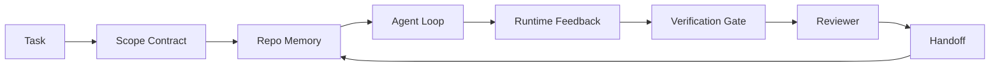

# Ajan İş Masa Mühendisliği: Neden yetenekli güçlü model hala başarısız olacak ?

> Sadece güçlü bir model yeterli değil. Güvenilir bir ajan. Bir çalışma tabanına ihtiyaç vardır.

**Type:** Learn + Build
**Languages:** Python (stdlib)
**Prerequisites:** Phase 14 · 01 (Agent Loop), Phase 14 · 26 (Failure Modes)
**Time:** ~45 minutes

## Öğrenme hedefi
- 区分模型能力与执行可靠性──
- Bu yüzden, bu bir işçi için bir çözüm.
- Küçük bir repo görevinde sadece hızlı 运行 ile çalışma deski yönlendirilen 运行ı karşılaştırın.
- 產出一個失败模式 報告, 該每個缺失的表面 映射到它造成的症状──

## 问题
Bir sınır modeli ızdırdın ızdırdın ızdırdın ızdırdın ızdırdın ızdırdın ızdırdın ızdırdın ızdırdın ızdırdın ızdırdın ızdırdın ızdırdın ızdırdın ızdırdın ızdırdın ızdırdın ızdırdın ızdırdın ızdırdın ızdırdın ızdırdın ızdırdın ızdırdın ızdırdın ızdırdın ızdırdın ızdırdın ızdırdın ızdırdın ızdırdın ızdırdın ızdırdın ızdırdın ızdırdın ızdırdın ızdırdın ızdırdın ızdırdın ızdırdın ızdırdın ızdırdın ızdırdın ızdırdın ızdırdın ızdırdın ızdırdın ızdırdın ızdırdın ızdırdın ızdırdın ızdırdın ızdırın ızdırın ızdırın ızdırın ızdırın ızdırın ızdırın ızdırın ızdırın ızdırın ızdırın ızdırın ızdırın ızdırın ızdırın ızdırın ızdırın ızın ızdırın ızdırın ızdırın ızın ızdırın ızın ızdırın ızdırın ızın ızın ızdırın ızdırın ızın ızdırın ızın ızdırın ız ızın ızdırın ızın ız ızdırın ızın ızın ız ızdırın ızın ız ızın ızın ızın ız ız ızın ız ızın ızın ız ız ız ız ızın ız ız ız ız ız ız ız ız ız ız ız ız ız ız ız ız ız ız ız ız ız ız ız ız ız ız ız ız ız ız ız ız ız ız ız ız ız ız ız ız ız ız ız ız ız ız ız ız ız ız

模型不是不懂Python──它是不懂这个工作──它不知道什么才算完成──允许写入哪里──哪些测试有权威性,也不知道下一次会议 应如何接手──

Bu bir model hatası değil. Bu bir çalışma masa hatasıdır. Bu, bir ajanın etrafındaki yüzeylerin eksik olması için gerekli bir bölümdür.

## 概念
İş stolunun yedi yüzeyine sahiptir:

| Surface | 它承载什么 | 缺失时的失败 |
|---------|------------|--------------|
| Instructions | 启动规则、禁止动作、完成定义 | Agent 猜测交付意味着什么 |
| State | 当前任务、已触碰文件、blockers、下一步动作 | 每个 session 都从零开始 |
| Scope | 允许文件、禁止文件、验收标准 | 修改泄漏到无关代码 |
| Feedback | 捕获进 loop 的真实命令输出 | Agent 在 400 上宣布成功 |
| Verification | Tests、lint、smoke run、scope check | “看起来不错”进入 main |
| Review | 由不同角色执行的第二遍检查 | Builder 批改自己的作业 |
| Handoff | 改了什么、为什么改、还剩什么 | 下一个 session 重新发现一切 |

çalışma deski 独立于模型──你可以替换模型并保留这些表面──你不能替换表面 还保持可靠性──



Bu döngü, sohbet tarihine değil, devlet dosyalarına bağlı.

### İş masası ve hızlı mühendislik

Çabuk  anlatın model bu tur ne istiyorsun. İş koltuğu  anlatın model nasıl跨轮次、跨 सत्र 地完成工作── çoğu ajan 失败故事,其实是披着快速工程 外衣的工作板 失败──

### İş masası ile çerçeve karşılığı

Çerçeve                                                                                                                                                                                                                                                                                                                                                                                                                                                                                                                          

### Satıcı taksonomilerinden değil, ilkel düşüncelerden kaynaklanıyor.

harness mühendisliği hakkında şimdi çok fazla yazı var. Addy Osmani, OpenAI, Anthropic, LangChain, Martin Fowler, MongoDB, HumanLayer, Augment Code, Thoughtworks, Walkinglabs, Medium ve Hacker News'in devam eden yazıları üzerinde tartışılıyor.

Bir süreliğine ajanı çıkarın bu etiket. Bir kez ajan çalıştırmak zamanın, süreçlerin ve makinelerin hesaplanmasıdır.

| Primitive | 它是什么 | 它为 agent 承载什么 |
|-----------|----------|---------------------|
| Function | 类型化 handler。尽可能保持纯。拥有自己的 inputs 和 outputs。 | 一次 tool call、一次 rule check、一个 verification step、一次模型调用 |
| Worker | 拥有一个或多个 functions 和 lifecycle 的长生命周期进程 | builder、reviewer、verifier、一个 MCP server |
| Trigger | 调用 function 的事件源 | Agent loop tick、HTTP request、queue message、cron、file change、hook |
| Runtime | 决定什么在哪里运行、使用什么 timeouts 和 resources 的边界 | Claude Code 的 process、LangGraph 的 runtime、一个 worker container |
| HTTP / RPC | caller 与 worker 之间的网络线缆 | Tool-call protocol、MCP request、model API |
| Queue | trigger 与 worker 之间的持久 buffer；back-pressure、retry、idempotency | task board、feedback log、review inbox |
| Session persistence | 在 crashes、restarts、model swaps 后仍保留的 state | `agent_state.json`、checkpoints、KV stores、repo 本身 |
| Authorization policy | 谁能以什么 scope 调用什么 function | allowed/forbidden files、approval boundaries、MCP capability lists |

Şimdi yedi çalışma masası yüzeylerini bu ilkelere yerleştir.

- **Instructions** politika + fonksiyon metadataları。Kötülükler ‒ kontroller`AGENTS.md`) Runtime başlatma politikasına bağlıdır.
- **State** oturum kalıcılığı──hareket zamanı──Hızlı depolamaları──File、KV veya DB;kalıcılık semantikası  önemli, depolama arka planı  önemli değil──
- **Scope** Her görev için izin politikaları  izinli/ yasaklı küpleri  ACL  onay gerektirir  izin redücüsü 
- **Feedback** 写入 queue 写入 queue 写入 queue 写入 queue 写入 queue 写入 queue 写入 queue 写入 queue 写入 queue 写入 queue 写入 queue 写入 queue 写入 queue 写入 queue 写入 queue 写入 queue 写入 queue 写入 queue 写入 queue 写入 queue 写入 queue 写入 queue 写入 queue 写入 queue 写入 queue 写入 queue 写入 queue 写入 queue 写入 queue 写入 queue 写入 queue 写入 queue 写入 queue 写入 que 写入 que 写入 que 写入 que 写入 que 写入 que 写入 que 写入 que 写入 写入 写入 写入 写入 写入 写入 写入 写入 写入 写入 写入 写入 写入 写入 写入 写入 写入 写入 写入 写入 写入 写入 写入 写入 写入 写入 写入 写入 写 写入 写 写 写入 写 写 写 写 写 写 写 写 写 写 写 写 写 写 写 写 写 写 写 写 写 写 写 写 写 写 写 写 写 写 写 写 写 写 写 写 写 写 写 写 写 写 写 写 写 写 写 写 写 写 写   写 写   写 写 写   写            写 写   写 写     写     写    写 写           写 写           写          写      写 写     写
- **Verification**  一个函数――对输入 确定性――由任务 close 触发――失败时关闭――
- **Review**                                                                                                                                                                                                                                                              
- **Handoff** Sessiyon sonu tetikleyicisi tarafından  yayımlanan kalıcı kayıt。

Agent loop 本身就是一個工作者,它消费事件(user message、工具結果、timer tick),调用函数(先是模型,然后是模型选择的工具),写记录(state、feedback),并发发发发触发器(verify、review、handoff)。没有神秘之处;形状与工作处理器相同──

### 流行模式,转换为原始

Her türlü popüler harman örneği yaklaşık sekiz primitif olarak sınıflandırılabilir.

| Vendor or community pattern | 它实际是什么 |
|------------------------------|--------------|
| Ralph Loop（Claude Code、Codex、agentic_harness book）— 当 agent 试图过早停止时，把原始意图重新注入一个新的 context window | 一个将 task 以干净 context 重新入队的 trigger；session persistence 负责把目标向前传递 |
| Plan / Execute / Verify (PEV) | 三个 workers，每个角色一个，通过 state 和 phases 之间的 queue 通信 |
| Harness-compute separation（OpenAI Agents SDK，April 2026）— 将 control plane 与 execution plane 分开 | 对 control-plane / data-plane 的重新表述。比 agent 标签早几十年就存在 |
| Open Agent Passport（OAP，March 2026）— 在执行前根据声明式 policy 签名并审计每次 tool call | 由 pre-action worker 强制执行的 authorization policy，并带有 signed audit queue |
| Guides and Sensors（Birgitta Böckeler / Thoughtworks）— feedforward rules + feedback observability | Authorization policy + verification functions + observability traces |
| Progressive compaction, 5-stage（Claude Code reverse engineering，April 2026） | 一个 state-management worker，像 cron 一样在 session persistence 上运行，使其保持在 budget 内 |
| Hooks / middleware（LangChain、Claude Code）— 拦截 model 和 tool calls | 包裹 runtime invocation path 的 triggers + functions |
| Skills as Markdown with progressive disclosure（Anthropic、Flue） | 一个 function registry，其中 function metadata 会 just-in-time 加载到 context 中 |
| Sandbox agents（Codex、Sandcastle、Vercel Sandbox） | compute plane：具备隔离 filesystem、network 和 lifecycle 的 runtime |
| MCP servers | 通过稳定 RPC 暴露 functions 的 workers，capability lists 作为 authorization |

Bu tabloda bulunan her bir şey, bir ajan olarak 社区 dağıtılan sistemlerde zaten bilinen bir isim primitifine ulaştı, sonra ona yeni isimler verdi.

### Kitsler aslında ne olduğunu açıklıyor

Harness-over-model ifadesi şimdi veri tabanına sahip. Bu da anlamaya değer, çünkü daha zeki bir modelin iyi bir model üzerinde tek dürüst bir kanıt olması gerekmektedir.

- Terminal Bench 2.0  Aynı model, sadece kullanma değişikliği 就让一个编码代理从前30 之外提升到第五名(LangChain,*Agent Harness'in Anatomy*) 
- Vercel  削除 its agent 80% ツール; başarının oranı 80% 跳到100%
- Harvey  yasal ajanlar  sadece harness optimizasyonu                                                                                                                                                                                                                                                         
- İşletme AI ajan projelerinin %88'i üretim yapmaya başlamıyor.
- Bir 2025 referans çalışması üç popüler açık kaynak çerçevesinde; uzun bağlamlı WebAgent'in görev tamamlanmasının yaklaşık% 50'ini rapor etti; uzun bağlamlı koşullarda, aşağıda 40-50%'den % 10'a düştü, temel olarak sonsuz döngüler ve hedef kaybı nedeniyle;

Önemli olan harness 永远胜出──模型 zamanla harness hilelerini emiyor. Önemli olan, bugün, yükü taşıyan işlerin modelin içinde değil, etrafında olmasıdır.

### Satıcı yazıları 止步的地方

Bu senin müşterinin bir parçası değil.

- LangChain'ın *Anatomy of an Agent Harness*'da on bir bileşeni toplanmıştır  istekler, araçlar, haklar, kum kutuları, orkestrasyon, hafıza, beceri, alt üstelik bir çalıştırma süresi  aptal bir döngü ── bu, sırada isimlendirilmemiş ‒ dağıtım birimi çalışanları ‒ tetikleyici semantikası ‒ bağımsız odak noktası oturum devamlılığı veya yetki politikası olarak ‒ harness'i bir sizin yerleştirdiğiniz nesne olarak kullanıyor, bir sizin yerleştirdiğiniz sistem değil ‒──
- Addy Osmani ' nin * Ajan Harness Mühendisliği *  önerdi `Agent = Model + Harness`Çerçeve ve çubuk örneği, ama harness ne tarafından oluşturulduğunu daha fazla açıklamıyor.
- Antropik ve OpenAI yüzeyler üzerinde en derin bir tartışmaya girdi, ancak hala kendi çalışma süresinde kaldı.
- Agent_harness kitabı 将 harness 视为 config object(Jaymin West'ın *Agentic Engineering*, bölüm 6), en güçlü cümlelerden biri ise harness bir ajan sistemindeki ana güvenlik sınırıdır──这是只是授权政策的重新表述──
- Hacker News threads 一直抵达同一个地方──4 Nisan 2026 thread *Agent harness sandbox dışında yer alır* 认为 harness 应该位于更像是一个处在一切之外、并基于文本 和用户 授权访问的超级浏览器──这再次是作为独立平面的授权政策──

Bu yazılardaki herhangi bir yazıya karşı çıkmak zorunda değilsiniz, ayrıca eksiklikler görüleceksiniz. Onlar mevcut bir sistemin UX'ini yazıyor. Yazmak istediğimiz sistem. Sistem doğru bir şekilde inşa edildiğinde, yedi yüzey ortaya çıkıyor.`AGENTS.md`色也修不好缺失的队伍──

Bu nedenle, başka yerlerde harness mühendisliği 时, onu ilkelere çevir. Hardness mühendisliği 时, onu ilkelere çevir. Prompts 和 rules is policy and functions──Scaffolding is runtime──Guardrails is authorization + verification──Hooks are triggers──Memory is session persistence──Ralph Loop is requeue──Subagents are workers──Sandboxes are computing planes──词汇会变;工程不会──workbench is agent-facing UX;而而能够挺过下一次的供应商重构的harness,本质是函数、工人、触发器、运行时间、排列、persist 和政策被正确连接在一起────


```figure
wb-seven-surfaces
```

## Yapın onu.
`code/main.py`Birinci defa sadece bir prompt, ikinci defa yedi yüzey ile bağlantılı olarak bir repo görevi yapar. Aynı model, aynı görev.

repo görevi 刻意设计得很小:给一个单文件 FastAPI-style handler 添加输入验证,并写一个通过测试──

- Yapma .

```
python3 code/main.py
```

输出: 两次运行的横横日志,一个总结  `failure_modes.json`Ve iş kürsüsünün ilk yargısı.

Agent, bir kural tabanlı küçük bir parça. Üstünlükler üzerinde odaklanır, model değil. Bu mini-track'in geri kalan kısmında her yüzeyi gerçek ve tekrarlanabilir bir eser olarak yeniden inşa edersiniz.

## Kullan
Üç yer zaten gerçekte çalışma masa yüzeyleri vardır, hatta hiç kimse onları böyle çağırır:

- **Claude Code, Codex, Cursor.** `AGENTS.md`和 `CLAUDE.md`Bu, bir dizi yönlendirme.
- **LangGraph, OpenAI Agents SDK.**Kontrol noktaları ve oturma depoları devlet yüzeyi.
- **真实 repo 上的 CI。**Testler、lint 和 tip kontrolü verifikasyondır。PR şablonı handoff。CODEOWNERS review。

İş masası mühendisliği bir kural: bu yüzeyleri 显式化、可复用化, her ekibin kendisini yeniden keşfetmesine izin vermek yerine.

## - Söyle.
`outputs/skill-workbench-audit.md`Bu, mevcut repoların yedi işleme tahtası yüzeylerini denetlemek ve hangi eksikliği rapor etmek için kullanılabilir bir taşınabilir yetenektir. Hangi bölümlerin varlığı, hangi sağlıkları vardır.

## 练习
1. 选择一个你已经运行代理的 repo――把七个表面从0(缺失) to2(健康)打分──你最弱的表面是什么?
2. 扩展 `main.py`Sadece hızlı çalıştırın. Yalanca bir başarısızlık bildirimi de ortaya çıkar.
3. Kendi ürününe sekizinci yüzey ekle. Neden mevcut yedi yüzeyden biri olarak yer almadığını açıkla.
4. Başka bir halüsinasyonla. Bir de bir de bir de bir de bir de bir de bir de bir de bir de bir de bir de bir de bir de bir de bir de bir de bir de bir de bir de bir de bir de bir de bir de bir de bir de bir de bir de bir de bir de bir de bir de bir de bir de bir de bir de bir de bir de bir de bir de bir de bir de bir de bir de bir de bir de bir de bir de bir de bir de bir de bir de bir de bir de bir de bir de bir de bir de bir de bir de bir de bir de bir de bir de bir de bir de bir de bir de bir de bir de bir de bir de bir de bir de bir de bir de bir de bir de bir de bir de bir de bir de bir de bir de bir de bir de bir de bir de bir de bir de bir de bir de bir de bir de bir de bir de bir de bir de bir de bir de bir de bir de bir de bir de bir bir de bir bir de bir de bir bir de bir bir de bir bir de bir bir bir de bir de bir bir bir de bir bir de bir bir bir de bir bir de bir bir bir de bir bir de bir bir bir de bir bir de bir bir bir de bir bir bir de bir bir de bir bir bir bir de bir de bir bir bir bir de bir de bir bir bir bir de bir bir bir bir bir de bir de bir de bir bir bir bir de bir bir bir bir bir bir de bir de bir bir bir de bir bir bir bir bir de bir bir bir bir de bir de bir bir bir bir bir de bir bir bir bir bir de bir de bir bir bir bir de bir de bir bir bir bir bir de bir bir bir bir bir de bir de bir bir bir bir de bir bir bir bir bir de bir de bir bir bir bir bir de bir bir bir bir bir de bir de bir bir bir bir de bir bir bir bir bir bir de bir bir bir bir bir bir de bir bir bir bir bir de bir de bir bir bir bir bir de bir bir bir bir bir de bir de bir bir bir bir bir de bir de bir bir bir bir de bir bir bir bir bir bir de bir de bir bir bir bir bir de bir de bir bir bir bir bir bir de bir bir bir bir bir bir de bir de bir bir bir bir bir de bir bir bir bir de bir bir bir bir bir bir de bir bir bir bir de bir bir
5. Fase 14 · 26 İçinde beş sektörün tekrar tekrar ortaya çıkan başarısızlık modları yedi yüzeye yerleştirilir.

## 关键术语
| Term | What people say | What it actually means |
|------|----------------|------------------------|
| Workbench | “那套 setup” | 围绕模型设计的 engineered surfaces，使工作可靠 |
| Surface | “一个 doc” 或 “一个 script” | agent 每一轮读取或写入的命名、machine-readable input |
| System of record | “那些 notes” | chat history 消失后 agent 视为 truth 的文件 |
| Definition of done | “Acceptance” | 一个客观、file-backed 的 checklist，agent 无法伪造 |
| Workbench audit | “Repo readiness check” | 在工作开始前遍历七个 surfaces，标记缺失部分 |

## 延伸阅读
Bu bilgiyi bir yetki yerine bir veri noktası olarak kullanın. Her bir makale bir taksonomidir.

Satıcı çerçeveleri:

- [Addy Osmani, Agent Harness Engineering](https://addyosmani.com/blog/agent-harness-engineering/) `Agent = Model + Harness`Ürünler ve altyapılar
- [LangChain, The Anatomy of an Agent Harness](https://blog.langchain.com/the-anatomy-of-an-agent-harness/) 十一个组件:bkz:coldings, tools, hooks, orchestration, sandbox, memory, skills, subagents, runtime,省略 queues, deployment, autz
- [OpenAI, Harness engineering: leveraging Codex in an agent-first world](https://openai.com/index/harness-engineering/) Codex 团队                                                                                                                                                                                                                                                                                                                                                                                                                                                                                                                        
- [OpenAI, Unrolling the Codex agent loop](https://openai.com/index/unrolling-the-codex-agent-loop/)                                                                                                                                                                                                                                                              `while`
- [Anthropic, Effective harnesses for long-running agents](https://www.anthropic.com/engineering/effective-harnesses-for-long-running-agents) 特定 runtime 内 uzun ufuk yüzeyleri
- [Anthropic, Harness design for long-running application development](https://www.anthropic.com/engineering/harness-design-long-running-apps) 应用型设计笔记
- [LangChain Deep Agents harness capabilities](https://docs.langchain.com/oss/python/deepagents/harness) Çalışma zamanı yapılandırma yüzeyi

Hayal edilebilir detaylar için uygulayıcı 文章:

- [Martin Fowler / Birgitta Böckeler, Harness engineering for coding agent users](https://martinfowler.com/articles/harness-engineering.html) rehberler(feedforward) + sensörler(feedback);最清晰的控制理论框架
- [HumanLayer, Skill Issue: Harness Engineering for Coding Agents](https://www.humanlayer.dev/blog/skill-issue-harness-engineering-for-coding-agents)Bu model sorunu değil, yapılandırma sorunu.
- [MongoDB, The Agent Harness: Why the LLM Is the Smallest Part of Your Agent System](https://www.mongodb.com/company/blog/technical/agent-harness-why-llm-is-smallest-part-of-your-agent-system) 证据:Vercel %80 to 100%,Harvey 2x doğruluk,Terminal Bench Top 30 to Top 5
- [Augment Code, Harness Engineering for AI Coding Agents](https://www.augmentcode.com/guides/harness-engineering-ai-coding-agents) Zorluk-İlk yürüyüş
- [Sequoia podcast, Harrison Chase on Context Engineering Long-Horizon Agents](https://sequoiacap.com/podcast/context-engineering-our-way-to-long-horizon-agents-langchains-harrison-chase/) Çalışma süresi endişeleri 高于 model endişeleri

书籍、论文与参考实施:

- [Jaymin West, Agentic Engineering — Chapter 6: Harnesses](https://www.jayminwest.com/agentic-engineering-book/6-harnesses) kitap boyutunda tedavi, 将 harness 视为 ana güvenlik sınırı
- [preprints.org, Harness Engineering for Language Agents (March 2026)](https://www.preprints.org/manuscript/202603.1756) Onu kontrol / ajans / çalıştırma zamanının akademik çerçevesini oluşturmak
- [walkinglabs/awesome-harness-engineering](https://github.com/walkinglabs/awesome-harness-engineering)  跨文脈、評価、可观性、オーケストレーションのキュレーティング 読みリスト
- [ai-boost/awesome-harness-engineering](https://github.com/ai-boost/awesome-harness-engineering)  başka bir kurate listesi (aletler, değerler, bellek, MCP, izinler)
- [andrewgarst/agentic_harness](https://github.com/andrewgarst/agentic_harness) üretim hazır referans uygulaması, Redis desteklenen bellek ve eval süiti
- [HKUDS/OpenHarness](https://github.com/HKUDS/OpenHarness) İçeride özel ajanın açık ajan harnesini

Hakkeri Haber 讨论 阅读其分歧而非共识的 Hacker News 讨论:

- [HN: Effective harnesses for long-running agents](https://news.ycombinator.com/item?id=46081704)
- [HN: Improving 15 LLMs at Coding in One Afternoon. Only the Harness Changed](https://news.ycombinator.com/item?id=46988596)
- [HN: The agent harness belongs outside the sandbox](https://news.ycombinator.com/item?id=47990675) 主张将 作为独立平面 olarak yetki

Bu eğitim programında çapraz referanslar:

- Fase 14 · 23  OpenTelemetry GenAI konvensiyonları:sensor literatürü
- Fase 14 · 26  七个表面 设计来吸收的故障模式目录
- Fase 14 · 27  位于 izin politikaları ilkel 上的快速注射防御
- Eğitim süreleri:
