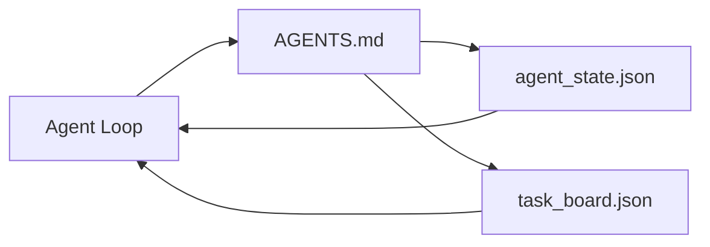

# En küçük ajan çalışma tahtası

> En küçük kullanılabilir iş desti  Sadece üç dosya: bir kök talimat yönlendiricisi  bir durum dosyası, ayrıca bir görev tahtası  Diğer her şey üzerinde yerleştirilmiştir  Eğer bir repo  bu üçü taşımazsa, onu kurtarabilecek hiçbir model yoktur 

**Type:** Build
**Languages:** Python (stdlib)
**Prerequisites:** Phase 14 · 31（为什么强大的模型仍然失败）
**Time:** ~45 分钟

## Öğrenme hedefi
- 定义构构成最小可行工作台的三个文件──
- Neden kısa bir root yönlendiricisi uzun bir tek birinden daha başarılı olduğunu açıklayın .`AGENTS.md`- Evet.
- Bir ajan oluşturun. Her seferinde okuyabilir ve sonunda da bir dosya yazabilirsiniz.
- Chat tarihine bağımlı olmayan bir konuşma kurmak, ayrıca daha fazla seans desteklemek için çalışma görev kurulu oluşturmak.

## 问题
Çoğu ekip 3000 sayılı bir yazı yazmayı kabul eder.`AGENTS.md`Bir çalışma deskeyi inşa etmek için, sonra da tamamlandığını düşünerek, model yüklenecek, sonucunu alamayan kısımları göz ardı edecek ve sonra da başarısız olduğu aynı yüzey üzerinde kalmaya devam edecek.

Ne gerekiyorsa tam tersine bir şey. Sadece ilgili bir süre içinde ajanı daha derin bir yere yönlendirmek için küçük bir kök belge. Sürekli bir durumda, ajanı hareket öncesi okumak için, hareket sonrası yazmak için bir görev kurulu oluşturarak, şu anda ne yapıldığını, neyi engellediğini, bir sonraki adımı ne olduğunu açıklar.

Üç dosya. Her dosyanın bir görevi vardır. Her dosya makine okuyabilir, böylece gerçek bir sisteme dönüşebilir.

## 概念


### AGENTS.md yönlendiricidir, el yazısı değil.

- İyi .`AGENTS.md`Çok kısa.

- Devlet dosyası (你在哪里)
- Görev kurulu.
- Daha derin seviyede kurallar`docs/agent-rules.md`Aşağı) ❖
- Verifikasyon komutu (How do you know it can work)

Daha uzun içeriği daha derin düzeylere yerleştirir, sadece yüklenme zamanı için.

### agent_state.json kayıt sistemi

Durum 携带:active task id、被触及的文件、已做的假设、阻塞者,以及下一步的行动──Agent 每一轮都会读取它──下一个会议 读取它,而不是重放聊天──

Devlet 存在文件里, çünkü sohbet tarihi güvenilmez. Sessiyonlar sona erecek.

### task_board.json sırada

Görev panosu  taşıyın her görevi, durum için `todo | in_progress | done | blocked`️Devamı boş zaman, bu ajan ️ görev alıyor sırada; eğer sen de bir ajanın doğru yolda olup olmadığını öğrenmek için sırada, bu da senin için bir sırada.️

Yukarıdaki görev, bir kimlik, bir hedef, bir sahibi.`builder`- Evet.`reviewer`Ya da`human`Bu yüzden, bir tabloyu oluşturmak için bir planlama sorunu ile karşılaşırsın.

### Üç dosya da üst sınır değil, alt çizgidir.

后续课程将添加范围合同、反运行者、验证门、审查者检查列和交付包──其中的三个文件是它们共同假设的基础──


```figure
wb-three-files
```

## Yapın onu.
`code/main.py`Bir boş repo yazıp, tek tekerlekli ajan dönüşünü gösterir.

1. 读取 `agent_state.json`- Evet.
2. Eğer boş bir durum varsa,`task_board.json`Bir görev al.
3. Bu da bir tek dosya.
4. 写回更新后的状态──

- Yapma .

```
python3 code/main.py
```

脚本会在自身旁边创建 `workdir/`Bu üç dosyayı yerleştir, bir tur yürüt, sonra bir farklılık yazdır.

## Kullan
Üretim sınıfı ajan ürünlerinde, aynı üç dosya farklı isimlerle ortaya çıkar:

- **Claude Code:**Kullan .`AGENTS.md`Ya da`CLAUDE.md`作为路由器,用 `.claude/state.json`Şirketler, tahta olarak haklar kullanıyor.
- **Codex / Cursor:**İş alanı kuralları 作为路由器,session memory 作为状态,chat sidebar 中的排列任务 作为板──
- **Custom Python agent:**İşte bu dosyaları yazdın.

名称会变──形状不会──

## Gerçek sahne içindeki üretim modeli

Üç farklı model en az çalışma masasına eklendiğinde, gerçek monorepos sınavlarını geçirebilir.

**带 nearest-wins precedence 的嵌套 `AGENTS.md`。**OpenAI , ana repo'sunda 88 adet yayınladı .`AGENTS.md`文件, her alt bileşen bir bir;;Codex、Cursor、Claude Code 和 Copilot  都会从当前工作文件一路向 repo root 遍历,并连接沿途找到的每个 `AGENTS.md`◊ Alt Dizin 文件扩展 kök dosyası。Kodex 添加了 `AGENTS.override.md`, değiştirmek için değil genişletmek için; üstlenme mekanizması Kodeks-specifiktir, yapma çapraz araç 工作时应避免使用──Augment Code'ın ölçüm sonuçları yalnızca önemli: en iyi`AGENTS.md`Dosyaların getirilen kalitesi yükseltilmiş, Haiku'dan Opus'a yükseltilmiş gibi; en kötü dosyaların çıkışı tamamen olmayan dosyalardan daha kötü olacaktır.

**即使看起来像 coverage，也要拒绝的 anti-patterns。**相互冲突的指示 会把代理 互动模式 降至贪模式(ICLR 2026 AMBIG-SWE:48.8% → 28% çözünürlük oranı); öncelikleri 编号, onları düzleştirmek yerine 编号, onları düzleştirmek yerine 编号, onları düzleştirmek yerine 编号, onları düzleştirmek yerine 编号;不可验证的风格规则(遵循Google Python Style Guide) Eğer uygulama komutu yoksa,就会让代理自行想象遵守;每条风格规则都应配上精确的 lint命令;;

**Cross-tool symlinks。**Bir tek kök dosyası  配合 symlinks(`ln -s AGENTS.md CLAUDE.md`- Evet.`ln -s AGENTS.md .github/copilot-instructions.md`- Evet.`ln -s AGENTS.md .cursorrules`), her kodlama ajanının aynı gerçek kaynağı kullanmasına izin verebilir.`nx ai-setup`Bu olayı Claude Code,Cursor,Copilot,Gemini,Codex ve OpenCode arasında otomatik olarak tamamlayacak.

## - Söyle.
`outputs/skill-minimal-workbench.md`Yeni bir repo için bir proje ayarlama yapılır.`AGENTS.md`Router, doğru anahtarları içerir.`agent_state.json`, ve bir kullanılmış geçmiş gerileme başlangıç `task_board.json`- Evet.

## 练习
1. - Ver .`agent_state.json`Bir ekle.`last_run`Zaman damgası: Eğer dosya 24 saatten önce, operatör onaylamamışsa, işlemi reddetmiştir.
2. Görev panosuna bir ekle .`priority`alanı,并修改拉,使其总是选择优先级最高的`todo`- Evet.
3. - Ben de .`task_board.json`迁移到 JSON Lines,让每个任务占一行,并让变异在版本控制中保持清晰──
4. Bir tane yaz .`lint_workbench.py`- Ne ?`AGENTS.md`80'den fazla, ya da var olmayan dosyaları alıntılıyor başarısızlık.
5. Bu üç dosyanın en büyük yarasını kaybedenleri yargılamak için seçeneğini seç.

## 关键术语
| Term | What people say | What it actually means |
|------|----------------|------------------------|
| Router | `AGENTS.md` | 指向更深层 docs 和 files 的简短 root file |
| State file | "The notes" | 记录 agent 所在位置的 machine-readable 记录，每一轮都会写入 |
| Task board | "The backlog" | 带有 status、owner、acceptance 的工作 JSON queue |
| System of record | "Source of truth" | 当 chat 消失时，workbench 视为权威的文件 |

## 延伸阅读
- [agents.md — the open spec](https://agents.md/) 被 Cursor、Code、Claude Code、Copilot、Gemini、OpenCode  Kullanım
- [Augment Code, A good AGENTS.md is a model upgrade. A bad one is worse than no docs at all](https://www.augmentcode.com/blog/how-to-write-good-agents-dot-md-files) 测得的质量提升
- [Blake Crosley, AGENTS.md Patterns: What Actually Changes Agent Behavior](https://blakecrosley.com/blog/agents-md-patterns)Ne gerçekte geçerli, ne de geçersiz.
- [Datadog Frontend, Steering AI Agents in Monorepos with AGENTS.md](https://dev.to/datadog-frontend-dev/steering-ai-agents-in-monorepos-with-agentsmd-13g0) yuva önceliği pratik
- [Nx Blog, Teach Your AI Agent How to Work in a Monorepo](https://nx.dev/blog/nx-ai-agent-skills) 跨六种工具的单源生成
- [The Prompt Shelf, AGENTS.md Best Practices: Structure, Scope, and Real Examples](https://thepromptshelf.dev/blog/agents-md-best-practices/) 能经受审的部分订单
- [Anthropic, Claude Code subagents and session store](https://docs.anthropic.com/en/docs/agents-and-tools/claude-code/sub-agents)
- Fase 14 · 31  En az en düşük en düşük en düşük en düşük en düşük en düşük en düşük en düşük en düşük en düşük en düşük en düşük en düşük en düşük en düşük en düşük en düşük en düşük en düşük en düşük en düşük en düşük en düşük en düşük en düşük en düşük en düşük en düşük en düşük en düşük en düşük en düşük en düşük en düşük en düşük en düşük en düşük en düşük en düşük en düşük en düşük en düşük en düşük en düşük en düşük en düşük en düşük en düşük en düşük en düşük en düşük en düşük en düşük en düşük en düşük en düşük en düşük en düşük en düşük en düşük en düşük en düşük en düşük en düşük en düşük en düşük en düşük en düşük en düşük en düşük en düşük en düşük en düşük en düşük en düşük en düşük en düşük en düşük en düşük en düşük en düşük en düşük en düşük en düşük en düşük en düşük en düşük en düşük en düşük en düşük en düşük en düşük en düşük en düşük en düşük en düşük en düşük en düşük en düşük en düşük en düşük en düşük en düşük en düşük en düşük en düşük en düşük en düşük en düşük en düşük en düşük en düşük en düşük en düşük en düşük en düşük en düşük en düşük en düşük en düşük en düşük en düşük en düşük en düşük en düşük en düşük en düşük en düşük en düşük en düşük en düşük en düşük en düşük en düşük en düşük en düşük en düşük en düşük en düşük en düşük en en düşük en en en en en en en düşük en en en en en en en en en en en en yüksek en en en en en en en yüksek en en en en en yüksek en yüksek en yüksek
- Fase 14 · 34  本课预览'ın kalıcı devlet şeması
