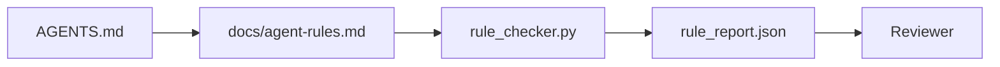

# Ajanı Yönlendirme Yapılandırılabilir Bir Bağlantı

> İşlev kuralı, her kuralın ajanı olarak kullanılır. İşlem sırasında kontrol edilebilir, değerlendirici sonrasında doğrulanabilir şeylerdir.

**类型：**Yapım
**语言：**Python (stdlib)
**前置要求：**Fase 14 · 32 (Minimal Çalışma Masaları)
**时间：**Yaklaşık 50 dakika .

## Öğrenme hedefi

- Yol açıklaması ve çalışma kuralları ayrılık.
- Başlatma kuralları, yasaklama işlemleri, tanımlamaları, belirsizlikleri ve onay sınırlarını ifade etmek için makine kontrol edilebilir bir sınırlama olarak kullanmak.
- 实现一个规则检查器, 规则集对一次运行进行评分──
- 让规则集便于变化,以便评审能够查看发生了什么变化──

## 问题

Tipik `AGENTS.md`阅读起来像进入职档――Agent'e dikkatli ve tam olarak denemek gerektiğini söyledi, ayrıca sorgulamada belirsizlik olduğunu söyledi.

Kurallar işlevsel olduğunda, onlar çok güçlüdür; Kurallar sadece görsel olduğunda, onlar çok zayıfdır.

## 概念

Kurallar yerleştirilmelidir.`docs/agent-rules.md`Orta, uzak kısaltma kök yolcuları.



### 覆盖大多数规则的五个类别

| 类别 | 规则回答的问题 | 示例 |
|----------|---------------------------|---------|
| Startup | 工作开始前必须满足什么？ | “state file exists and is fresh” |
| Forbidden | 什么事情绝对不能发生？ | “do not edit `scripts/release.sh`” |
| Definition of done | 什么能证明任务已完成？ | “pytest exits 0 and acceptance line passes” |
| Uncertainty | Agent 不确定时该做什么？ | “open a question note instead of guessing” |
| Approval | 什么需要人工审批？ | “any new dependency, any prod write” |

Bu beş sınıfın birinde yer alamayacak, genellikle iki kural olarak bölünmelidir.

### 規則是机器可读的

Her kuralın bir kuralı var, bir sınıf, bir tanım ve bir de bir.`check`字段,指向 `rule_checker.py`Orta bir fonksiyon── eklem kuralları, eklem kontrol anlamına gelir; kontrol cihazı çalışma tabanıyla birlikte büyür──

### 规则便于不同

規則在一个Markdown文件中,每条规则占一个标题──重命名在不同中可见──新规则放在其类别的顶部──过时规则应删除,而不是注释掉,因为工作台才是真相来源,不是团队上个季度感受如何的聊天记录──

### 規則与框架 gardrails

框架 guardrails(OpenAI Agents SDK guardrails、LangGraph interrupts) in运行时层面执行规则──本课中的规则集是这些 guardrails在实现的人类可读、可评审的契约──两者都需要:运行时会在一轮中捕获违规,而规则集会证明运行时正在做正确的事──

### Gelişmiş açıklama: 図書,而非百科全书

`AGENTS.md`Bu süre devam eder, çünkü her olayda yeni bir kural geliştirilir, ama çok az bir olayda bir kural silinir. Bir yıl sonra bu dosya iki bin satır olabilir.

修复方式不是写一个更短的文件,而是写一个分层的文件――根路由器必须小到每次都能读完,并且只保存指针――深度内容放在主题文件里,只有当任务触及应主题时代理才加载――给代理一个地图,而不是整本百科全书,让它自己走到所需的页面――

```text
AGENTS.md                  # router，少于 50 行：这个 repo 是什么、去哪里看、5 条硬规则
docs/
  agent-rules.md           # 完整规则集（本课）
  architecture.md          # 任务触及 module boundaries 时加载
  testing.md               # 任务编写或运行 tests 时加载
  deploy.md                # 只在 release 工作中加载，并受 approval rule 保护
feature_list.json          # backlog（Phase 14 · 36）
```

| Tier | 存放位置 | 读取时机 | 大小预算 |
|------|----------|----------|----------|
| Router | `AGENTS.md` | 每个 session，始终读取 | 少于约 50 行 |
| Rules | `docs/agent-rules.md` | 每个 session 启动时 | 每个 category 一屏 |
| Topic docs | `docs/<topic>.md` | 只有任务触及该主题时 | 需要多深就多深 |

两个测试能让分层保持诚实――第一个是可达性测试:agent 应能从路由器出发,最多两跳抵达任何规则,所以路由器 必须按路径链接每个主题 doc,而不是用散文模糊描述――第一个是新鲜性测试:路由器 足够短,评论员会在每个 PR 里重读它,这是防止它长回百科全书的唯一办法――指针效果失效比缺一条规则更糟糕,所以路由器中断的链接本身就是启动检查违规――


```figure
wb-rule-checkoff
```

## Yapın onu.

`code/main.py`提供:

- `agent-rules.md`Parser,将规则加载到数据类 中──
- `rule_checker.py`风格的检查函数,每个 `check`引用对应一个.
- Bir demo ajanı, iki kuralın karşısına çıkıyor ve bir kez de bu ihlallerin kontrolünü yakalayabiliyor.

- Yapma .

```
python3 code/main.py
```

输出:解析后的规则集、运行追踪、每条规则的通过/失败,以及保存在脚本旁边的 `rule_report.json`- Evet.

## 生产中的模式

Üç modü vardır. Bir dönem boyunca devam edebilecek bir kurallar topluluğunun, bir hafta içinde gerileme kurallar topluluğunun farkını yapabilir.

**编写时标注严重性。**Her kural var.`severity`- ...`block`- Evet.`warn`Ya da`info`❖ Kontrolcüler rapor;`block`Ü reddetmek. Çoğu ekip erken erken ciddiyetini yüksek derecede değerlendirir, sonra son tarih basıncı altında zayıflar. Yazma sırasında etiketleme ekibini ön plana çıkaracaktır.`block`规则的过渡 签入                                                                                                                                                                                                                                                                                                                                                                                                                                                                                                                     `overrides.jsonl`denetim kayıtları

**规则过期作为强制机制。**Her kural var.`expires_at`Gün boyunca, bir kontrol cihazı herhangi bir ihlal olmadığı zaman uyarı yayınlar; bir sonraki dönem değerlendirmesi, tutmanın nedenini veya zayıflamasını açıklar.`info`Cloudflare'ın üretimi AI Code Review DATA(2026 yıl 4 月,30 天内跨 5,169 repo 运行 131,246 kez inceleme) gösterir ki, belirli bir sürenin geçmişi mekanizmasının kuralları bir araya gelerek her repo'nun 30 条 kuralları içinde kalabilir; sürenin geçmişi mekanizmasının kuralları toplanması 80'e kadar büyüdü ve çoğu asla başlamadı.

**Markdown 作为 source，JSON 作为 cache。** `agent-rules.md`Yapılan işlevlerin yazarı;`agent-rules.lock.json`Yapılan işlemler için kullanılan bir sistem olarak, bu sistemin kullanımı için kullanılan bir sistem olarak, bu sistemin kullanımı için kullanılır.`package.json`- Ne ?`package-lock.json`和 `Cargo.toml`- Ne ?`Cargo.lock`Benzer.

## Kullan

Üretim sırasında:

- Claude Code、Code、Cursor  seansın başında kuralları okuyor ve işlemden vazgeçerken bunları alıntılıyor.
- OpenAI Ajanlar SDK korumalar aynı şekilde kontrol edilir Giriş ve çıkış korumalar için kayıtlı olacaktır.
- LangGraph, yürütmekte olan düğümün oluşumunu keser                                                                                                                                                                                                                                                                                                                                                                                                                                                                                                              

Bu kural bir üç kişi arasında aktarılabilir çünkü sadece bir işlev adı ile işaretlenir.

## - Söyle.

`outputs/skill-rule-set-builder.md`Görüşme projesi sahibi, mevcut散文式指示分类中五類,并输出带版 of `agent-rules.md`Bir kontrol cihazı var.

## 练习

1. Eğer ürününüzün gerçekten altıncı sınıfı gerekiyorsa, ekleyin.
2. 扩展检查器,让规则可以携带严重性(`block`- Evet.`warn`- Evet.`info`Raporların ciddiyetle toplanmasını sağlama.
3. Kontrolcüye Bağlantı: Eğer en son ajanın çalışması blok ağırlığı kuralları başarısız olursa, inşaat başarısız olur.
4. Bu kuralın bir sonucu var.
5. Gerçek bir tane bul .`AGENTS.md`Bu yüzden, bu sayede, bu sayede, bu sayede, bu sayede, bu sayede, bu sayede, bu sayede, bu sayede, bu sayede, bu sayede, bu sayede, bu sayede, bu sayede, bu sayede, bu sayede, bu sayede, bu sayede, bu sayede, bu sayede, bu sayede, bu sayede, bu sayede, bu sayede, bu sayede, bu sayede, bu sayede, bu sayede, bu sayede, bu sayede, bu sayede, bu sayede, bu sayede, bu sayede, bu sayede, bu sayede, bu sayede, bu sayede, bu sayede, bu sayede, bu sayede, bu sayede, bu sayede, bu sayede,

## 关键术语

| 术语 | 人们的说法 | 它实际意味着什么 |
|------|----------------|------------------------|
| Operational rule | “一条真正的指令” | 工作台可在运行时检查的规则 |
| Aspirational rule | “谨慎一点” | 没有检查的规则；要么删除，要么升级 |
| Definition of done | “Acceptance” | 证明任务已完成的客观、基于文件的证据 |
| Block severity | “硬规则” | 违规会中止运行；没有 operator 不能静默处理 |
| Rule expiry | “过时规则清理” | 在 N 天内没有失败的规则可以考虑退役 |

## 延伸阅读

- [OpenAI Agents SDK guardrails](https://platform.openai.com/docs/guides/agents-sdk/guardrails)
- [LangGraph interrupts](https://langchain-ai.github.io/langgraph/how-tos/human_in_the_loop/breakpoints/)
- [Anthropic, Building Effective Agents](https://www.anthropic.com/research/building-effective-agents)
- [Rick Hightower, Agent RuleZ: A Deterministic Policy Engine](https://medium.com/@richardhightower/agent-rulez-a-deterministic-policy-engine-for-ai-coding-agents-9489e0561edf) 生产中的 bloc/warn/info 严重性
- [Cloudflare, Orchestrating AI Code Review at Scale](https://blog.cloudflare.com/ai-code-review/) 131k 次 inceleme 运行,规则组合经验
- [microservices.io, GenAI development platform — part 1: guardrails](https://microservices.io/post/architecture/2026/03/09/genai-development-platform-part-1-development-guardrails.html) 规则与 CI arasındaki savunma derinliği
- [Type-Checked Compliance: Deterministic Guardrails (arXiv 2604.01483)](https://arxiv.org/pdf/2604.01483) Lean 4  作为规则-as-check 的上限
- [logi-cmd/agent-guardrails](https://github.com/logi-cmd/agent-guardrails) birleşme kapısı 实现:scope、mutasyon testleri、salıkonma bütçeleri
- Fase 14 · 32  Bu kuralların bir araya gelmesi gereken en az çalışma masa
- Fase 14 · 38  消费规则报告的验证门
- Fase 14 · 39  Kurallar ve Kurallar ile ilgili değerlendirme yapan temsilci
