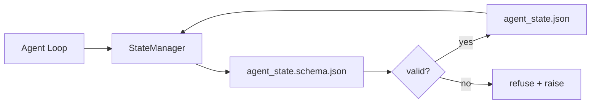

# Repo hafızası ve Kalıcı Durum

> Çat tarihi kolay kaybolur. Repot uzun süredir. İşleme desti, ajanı DATA versiyon dosyalarında saklayacak.

**Type:** Build
**Languages:** Python (stdlib + `jsonschema` optional)
**Prerequisites:** Phase 14 · 32 (Minimal Workbench)
**Time:** ~60 minutes

## Öğrenme hedefi
- Repo hafızasına ne aittir, sohbet geçmişine ne aittir?
- Çı`agent_state.json`和 `task_board.json`JSON Şemaları Yazı:
- Atomik bir devlet yöneticisi oluşturmak, atomik bir devlet yükleme, test etme, değişim ve kalıcılık için kullanılır.
- Bu yüzden de bu programı reddetmiş olmalıyız.

## 问题
Agent  complet one session── chat 关闭── next session 打开并询问从哪里开始──model 说让我检查文件,读取过时的笔记,然后重复已经完成的工作──更糟的是,它会重写已完成文件,因为没有人告诉它该文件已经完成──

İş stolunun modification methodı repo bellekidir:stat 存在 repo 中的 JSON 文件里, schema 写入,以原子方式持久化,并且在代码评论中对差 友好。Chat 是临时 feed;repo 是记录系统。

## 概念


### Ne repo hafızasına ait ?

| 属于 | 不属于 |
|---------|-----------------|
| Active task id | 原始 chat transcripts |
| 本 session 触碰过的文件 | Token-level reasoning traces |
| agent 做出的假设 | "The user seemed frustrated" |
| 未解决的 blockers | Sampled completions |
| 下一步 action | Vendor-specific model ids |

判断标准是持久性: 3 ay sonra CI yeniden çalıştırıldığında, bu da işe yarar mı?

### Şema birinci durum

JSON Şema bir anlaşma değildir. Yoksa, her ajan yeni bir bölüm ortaya çıkarır, her eleştirmen yeni bir biçim öğrenir, her bir CI metni geçmiş sürümlere özel bir durum oluşturmalıdır.

Şema 覆盖:

- - Anahtar lazım.
- 允许的  izin`status`Değerler
- 禁止的值 (örneğin diziler)`null`)。
- Şekil kısıtlamaları(Task ID 匹配 `T-\d{3,}`)。
- Göçmenlik'in versiyonu alanı kullanılmıştır.

### Atomik yazıyor

Devlet 写入需要能承受部分失败:写入 tempfile,fsync,然后改名覆盖目标――devlet dosyası gerçeğin kaynağıdır;写到一半的状态文件比没有文件更糟――

### Göçmenlik

Şema değişikliği sırasında, şema çarpması yanında bir göç metni teslim et.`schema_version`alan; yöneticisi taşınamayan sürüm dosyasını yüklemeyi reddedecektir.


```figure
wb-state-persist
```

## Yapın onu.
`code/main.py`实现:

- `agent_state.schema.json`和 `task_board.schema.json`- Evet.
- Bir stdlib'in onaylayıcıyı kullanmak için bir JSON Şema 子集:required、type、enum、pattern、items)
- Atom temp ve renomlu 写入的`StateManager.load`- Evet.`StateManager.update`- Evet.`StateManager.commit`- Evet.
- Bir demo:变更状态、持久化、重新加载,并证明回路──

- Yapma .

```
python3 code/main.py
```

Yazı yazısı 会写入 `workdir/agent_state.json`和 `workdir/task_board.json`, iki dönüm boyunca 变更它们, ve her adım üzerinde denetim durumunu yazdırmak.

## Gerçek sahne içindeki üretim modeli

Dört farklı modül bu dersleri en azına dönüştürür.

**Atomic temp-and-rename 不是可选项。**2026 yılının 3 ayı bir Hive proje hata raporunu 清晰记录了这种故障模式:`state.json`- Evet .`write_text()`写入,并且例外 被捕后静默忽略──部分写入让会议 在没有信号的情况下基于损坏状态 恢复──修复永远是:在与目标相似的目录中使用`tempfile.mkstemp`, yazın,`fsync`- Evet .`os.replace`(POSIX ve Windows'da hepsi atomik olarak yeniden adlandırılıyor)`atomic_write`İşte böyle yapılıyor.

**每个非幂等 tool call 都要有 idempotency keys。**Eğer ajan 调用工具 之后、checkpoint 结果之前崩,恢复过程会重试该工具调用――对读安全;对电子邮件、DB插件、文件上传 危险――模式是:在执行前将每个工具调用 ID 记录到`pending_calls.jsonl`重试时检查该 ID; eğer varsa,跳过调用并使用缓存结果──Anthropic 和 LangChain 都在2026 yönergeleri içinde bu noktayı belirtti; LangGraph'in kontrol noktası aynı sebepten dolayı devamlı bekleyen yazılar nedeniyle──

**将大型 artifacts 与 state 分离。**CSV'leri, uzun metinleri veya oluşturulan dosyaları saklama .`agent_state.json`△将文物 保存为单独文件(或上传到物体存储),state 中只保留路径──检查点 保持小而快;文物 独立增长──

**Event sourcing 用于 audit，snapshots 用于 resume。**Her mutasyon olay loguna eklenir.`state.events.jsonl`); düzenli olarak anlık fotoğraf`state.json`❖ Resume 读取快照,然后播放快照时刻印 之后的所有事件──这会消耗更多磁盘,但允许你逐字播放代理决策,这对调试长视线运行至关重要──Postgres 内部用于WAL的也是一样的形状──

**Schema migrations，否则拒绝加载。** `schema_version`tam sayı ise anlaşma. Yöneticisi, bilinmeyen sürüm dosyalarını yüklerken, onu okumayı reddeder.`tools/migrate_state.py`Her başlangıçta 时等运行──

## Kullan
Üretim sırasında:

- **LangGraph checkpointers。**Aynı fikir, farklı depolama. Kontrol noktası grafik durumu  SQLite  Postgres veya özel arka planına dönüştürecek.
- **Letta memory blocks。**带结构化方案的持续块 (Fase 14 · 08) ⋅同样纪律,作用域是长期的人物──
- **OpenAI Agents SDK session store。**Pluggable backends, schema-aware──本课中的状态 dosyası──────────────────────────────────────────────────────────────────────────────────────────────────────────────────────────────────────────────────────────────────────────────────────────────────────────────────────────────────────────────────────────────────────────────────────────────────────────────────────────────────────────────────────────────────────────────────────────────────────────────────────────────────────────────────────────────────────────────────────────────────────────────────────────────────────────────────────────────────────────────────────────────────────────────────────────────────────────────────────────────────────────────────────────────────────────────────────────────────────────────────────────────────────────────────────────────────────────────────────────────────────────────────────────────────────────────────────────────────────────────────────────────────────────────────────────────────────────────────────────────────────────────────────────

## - Söyle.
`outputs/skill-state-schema.md`会生成一对项目特定 JSON Schema(state + board) 、一个连接到原子写的Python `StateManager`, ve bir göç asası, bir sonraki schema çarpması çalışma deskenini bozar emin olmak için.

## 练习
1. Bir ekle.`last_human_touch`Zaman damgası── reddetme 后五秒内任何代理写──
2. 扩展 validator 以支持 `oneOf`Bu tür görevler yapılandırma görevi, inceleme görevi olabilir ve her ikisi de farklı alanlara sahip olabilir.
3. 添加 `schema_version`alanı,并编写从v1到v2的迁移将`blockers`重命名为 `risks`)。
4. Yerel dosyalardan SQLite'e taşınır.`StateManager`API değişmiyor.
5. İki ajanı 50 ms'da bir rakam yazmaya çalıştır.

## 关键术语
| Term | What people say | What it actually means |
|------|----------------|------------------------|
| Repo memory | "Notes file" | 按 schema 存储在 repo 的 tracked files 中的 state |
| Schema-first | "Validate inputs" | 先定义契约再写 writer，拒绝漂移 |
| Atomic write | "Just rename" | 写入 temp，fsync，rename，因此 partial failures 无法破坏 |
| Migration | "Schema bump" | 将 vN state 转换为 v(N+1) state 的 script |
| System of record | "Source of truth" | workbench 视为权威的 artifact |

## 延伸阅读
- [JSON Schema specification](https://json-schema.org/specification.html)
- [LangGraph checkpointers](https://langchain-ai.github.io/langgraph/concepts/persistence/)
- [Letta memory blocks](https://docs.letta.com/concepts/memory)
- [Fast.io, AI Agent State Checkpointing: A Practical Guide](https://fast.io/resources/ai-agent-state-checkpointing/) Şema-birinci kontrol noktası
- [Fast.io, AI Agent Workflow State Persistence: Best Practices 2026](https://fast.io/resources/ai-agent-workflow-state-persistence/) eşzamanlı kontrol TTL  olay kaynaklama
- [Hive Issue #6263 — non-atomic state.json writes silently ignored](https://github.com/aden-hive/hive/issues/6263) gerçek proje 中的 başarısızlık modu
- [eunomia, Checkpoint/Restore Systems: Evolution, Techniques, Applications](https://eunomia.dev/blog/2025/05/11/checkpointrestore-systems-evolution-techniques-and-applications-in-ai-agents/) OS 历史 应用于代理的CR primitives
- [Indium, 7 State Persistence Strategies for Long-Running AI Agents in 2026](https://www.indium.tech/blog/7-state-persistence-strategies-ai-agents-2026/)
- [Microsoft Agent Framework, Compaction](https://learn.microsoft.com/en-us/agent-framework/agents/conversations/compaction) Satıcı kontrol noktası yöneticisi
- Fase 14 · 08  hafıza blokları ve uyku zamanı hesaplama
- Eğitim: 14 · 32  本课为其方案化三档最低
- Fase 14 · 40  Aynı schema 读取的 handoff paketler
