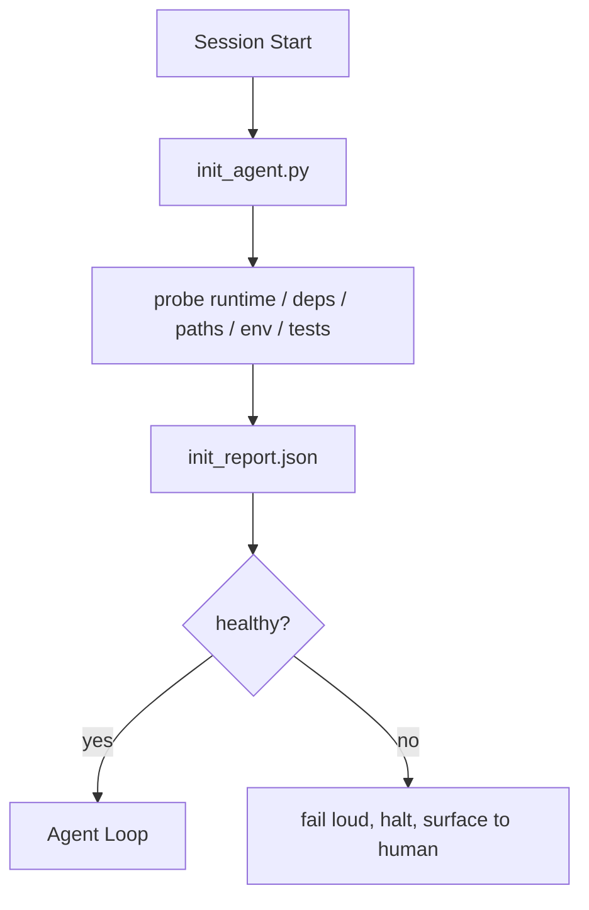

# Ajanın Başlangıç Özetleri

> Her soğuk başlatma seansı bir bedel ödemek zorunda. Ajan aynı dosyaları okuyor, aynı aramaları tekrar dener, aynı yolları yeniden keşfeder.

**Type:** Build
**Languages:** Python (stdlib)
**先修要求：**Fase 14 · 32 (Minimal Çalışma Masa), Fase 14 · 34 (Repo Hatırlama)
**Time:** ~45 分钟

## Öğrenme hedefi
- 识别代理, her seansta tekrar tekrar iş yapmamalıdır.
- Bir kesin init skripti oluşturmak, çalıştırma süresini, bağımlılıklarını ve repo sağlığını araştırmak için.
- Araştırma sonuçlarını devam ettirmek yerine, ajanı araştırmaya devam etmesini sağlayın.
- Başlangıç başarısız olduğunda, çal çal                                                                                                                                                                                                                                                           

## 问题
打开一个会议──Agent 猜测 Python versiyonu──猜测测试命令──Entration point,列出 repo root 五次──尝试 import a package 未安装──询问用户配置文件 在哪里──等到它真正开始编辑时,已经有了万代币花在本应由一个脚本完成的设置工作 上──

修复方式是使用一个初始化脚本:它在代理做任何事之前运行,并写入一个供代理 启动时读取的`init_report.json`- Evet.

## 概念


### init script 探查什么

| Probe | 为什么重要 |
|-------|------------|
| Runtime versions | 错误的 Python 或 Node version 意味着悄无声息的错误版本 bug |
| Dependency availability | 缺失的 package 如果到后面才发现，成本会是现在捕获它的十倍 |
| Test command | Agent 必须知道如何 verify；如果 command 缺失，workbench 就坏了 |
| Repo paths | Hard-coded paths 会漂移；一次性解析并固定下来 |
| Environment variables | 缺失 `OPENAI_API_KEY` 是一个 failure surface，而不是 runtime mystery |
| State + board freshness | 崩溃 session 留下的陈旧 state 是一个 footgun |
| Last-known-good commit | 作为 session 结束时 handoff diff 的锚点 |

### 快速显然失败,并集中在一个失败的地方

Test başarısızlığı, insan için gösterilmeyi durdurmak anlamına gelir.

### Gücün yetersiz

连续运行两次──第二次除刷新时间打印 之外应该是无-op──Idempotency 让你可以把脚本连接到CI、hooks 或预任务 slash命令──

### Başlangıç kuralları karşı karşıya

Kurallar (Fase 14 · 33) 行动前必须满足什么――Init is to establish these rules 可检查的脚本――没有 init 的 rules将变成要小心──没有规则的 init将变成精致的失败――


```figure
wb-init-probes
```

## Yapın onu.
`code/main.py`Başarılı oldu .`init_agent.py`- ...

- Beş tane sonda: Python versiyonu, geçiyor.`importlib.util.find_spec`列出的依存性、test komutu çözülebilirliği、required env vars、state file freshness。
- Her bir sonda geri döner .`(name, status, detail)`- Evet.
- 脚本写入包含完整探测组 的 `init_report.json`, ve herhangi bir blok ağırlığı araştırması başarısız olduğunda sıfır dışı bir durumdan çıkmak.

- Yapma .

```
python3 code/main.py
```

脚本会打印探表,写入 `init_report.json`, mutlu yolda yukarı sıfırdan geri çekilmek veya başarısız olduğunda sıfırdan geri çekilmek ve başarısız araştırmaların listesi oluşturmak

## Gerçek sahne içindeki üretim modeli

Üç farklı modül kullanışlı başlangıç metni ve ritüel anlamı arasında ayrım yapabilir.

**Last-known-good commit anchoring.**Bu , bir sonraki başarıyla birleşmek için bir süreliğine bir süreliğine bir süreliğine bir süreliğine bir süreliğine bir süreliğine bir süreliğine bir süreliğine bir süreliğine bir süreliğine bir süreliğine bir süreliğine bir süreliğine bir süreliğine bir süreliğine bir süreliğine bir süreliğine bir süreliğine bir süreliğine bir süreliğine bir süreliğine bir süreliğine bir süreliğine bir süreliğine bir süreliğine bir süreliğine bir süreliğine bir süreliğine bir süreliğine bir süreliğine bir süreliğine bir süreliğine bir süreliğine bir süreliğine bir süreliğine bir süreliğine bir süreliğine bir süreliğine bir süreliğine bir süreliğine bir süreliğine bir süreliğine bir süreliğine devam edecektir .`LKG`Dosya  araştırmak için. Eğer fark  bütçeden fazlasa  defalarca 50 dosya), başlatmayı reddetmek,  yeni bir temel çizgiyi onaylamak için insan gerekmektedir.

**Lock files with TTL.**İlk başarılı araştırmanın geçişinden sonra yazılı.`prereqs.lock`▽后续运行会在 N 小时内信任该锁(默认 24h),并跳过昂贵的探测.

**No network, no LLM, no surprises in the hot path.**Init sondaları kesinlik tesisatıdır. LLM'yi kullanarak başarısızlığı sınıflandırır, veya dış hizmetleri ziyaret eder.

## Kullan
Üretim sırasında:

- **Claude Code hooks.** `pre-task`Hakk 调用 init skripti, ve失败时拒绝启动代理──
- **GitHub Actions.** `setup-agent`İş 运行 init script; ajan işi buna bağlı.
- **Docker entrypoint.**Ajan konteyneri execuc ajan çalıştırma süresi 之前运行 init skripti;失败时呈现日志──

init script ise aktarılabilir çünkü herhangi bir çerçeve kullanmaz.

## - Söyle.
`outputs/skill-init-script.md`Görüşme projesi, kurulum çalışmaları, araştırmalar, özel projeler üretmek`init_agent.py`, ve herhangi bir ajan aşamasında  önce onun bilgi akışı iş akışı çalıştırmak.

## 练习
1. 添加一个探,用于不同 当前提交和最后知名好的提交;变更超过50文件,就拒绝启动──
2. Yazı yazın, yazın.`prereqs.lock`Dosya, kilit ve kilit 超七天时拒启---
3. Bir ekle.`--fix`Bayrak, otomatik olarak monte edilmeyen dev bağımlılıkları, ancak onaylanmamıştır kesinlikle çalıştırma süresi bağımlılıklarını değiştirmez.
4. Bu işlem için YAML'de çalıştırılacak.
5. Her bir probe için bir zamanlama bütçesi eklenir.

## 关键术语
| Term | 人们会怎么说 | 它实际意味着什么 |
|------|--------------|------------------|
| Probe | “一个 check” | 返回 `(name, status, detail)` 的确定性函数 |
| Init report | “Setup output” | 与 state 放在一起、写有 probe results 的 JSON |
| Idempotent | “可以安全重新运行” | 连续两次运行会生成除 timestamp 外完全相同的 reports |
| Fail loud | “不要吞掉” | 停止并呈现给 human；没有 silent fallback |
| Setup tax | “Bootstrap cost” | Agent 每个 session 为重新发现显而易见信息所花费的 Token |

## 延伸阅读
- [Anthropic, Effective harnesses for long-running agents](https://www.anthropic.com/engineering/effective-harnesses-for-long-running-agents)
- [GitHub Actions, composite actions for setup](https://docs.github.com/en/actions/sharing-automations/creating-actions/creating-a-composite-action)
- [microservices.io, GenAI 开发平台：guardrails](https://microservices.io/post/architecture/2026/03/09/genai-development-platform-part-1-development-guardrails.html) önceden görev + CI 检查作为 init
- [Augment Code, How to Build Your AGENTS.md (2026)](https://www.augmentcode.com/guides/how-to-build-agents-md) init beklentileri
- [Codex Blog, Codex CLI Context Compaction](https://codex.danielvaughan.com/2026/03/31/codex-cli-context-compaction-architecture/) Sessiyon başlangıcı kompaktasyon farkındadır
- Fase 14 · 33  此脚本启用规则集合
- Fase 14 · 34   此脚本播种的状态文件
- Fase 14 · 38  init script   ızdırılan doğrulama kapısı
- Fase 14 · 40  消费 init raporu son bilinen iyi
