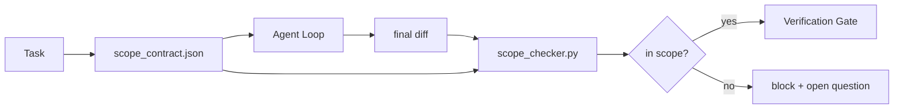

# Görev Sınırı Sözleşmesi

> model Bilmiyorum çalışma nerede biter. Sıkıntı sözleşmesi, çalışmaların nereden başladığını, nerede bittiğini ve bir kez nasıl geri döndürüleceğini açıklamak için bir görev dosyasıdır.

**类型:**Yapım
**语言:**Python (stdlib)
**先修:**Fase 14 · 32 (Minimal Çalışma Masaları), Fase 14 · 33 (Kötülükler olarak Kurallar)
**时间:**~ 50 dakika

## Öğrenme hedefi

- Bir sözleşme yapın, görev başlatılınca ajanı okuyun, görev bitince doğrulayıcıyı okuyun.
- 指定允许的文件、禁止的文件、接受标准、反弹计划和批准界限──
-  bir kapsam kontrolü gerçekleştirmek, sözleşme ile karşılaştırıldığında farklı olacaktır ve ihlal işareti olacaktır.
- 让范围 creep 可见、自动化且可审查──

## 问题

Agent 会 creep── görev  login bug ──diff 触碰了登录路径、email helper、database driver、README 和 release script── her dokunma sırasında mantıklı gibi görünen bir neden var── birlikte, bunlar önceki incelemenin içeriğinden farklı bir değişime dönüşmüşlerdir──

Sıkıntılı bir şekilde, bir ajanın her adımı anlatması için en çok kontrolsüz bir başarısızlık modudur.

## 概念



### Sözleşme kapsamı içerir

| Field | Purpose |
|-------|---------|
| `task_id` | 链接到 board 上的 task |
| `goal` | reviewer 可以验证的一句话 |
| `allowed_files` | agent 可以写入的 globs |
| `forbidden_files` | agent 即使意外也不得触碰的 globs |
| `acceptance_criteria` | 证明完成的 test commands 或 assertion lines |
| `rollback_plan` | 如果需要 halt，operator 可以执行的一段说明 |
| `approvals_required` | scope 外需要明确 human sign-off 的 actions |

Hiç .`forbidden_files`Sözleşme tamamlanmamıştı.

### Çömlek yolları yerine küresel kullanın.

Gerçek repo 会移动文件──把合同 固定到球星(`app/**/*.py`- Evet .`tests/test_signup*.py`Bu şekilde bir oturumda                                                                                                                                                                                                                                                                                                                                                                                                                                                                                                                        

### Rollback , kapsamın bir parçası .

列出如何滚回会迫使合同作者思考可能出什么问题──不能滚回的合同是不应批准的合同──

### Kapsam kontrolü = fark kontrolü

Agent 写出 diff―checker 读取 diff― allowed glo­bs、 prohibited glo­bs,以及任何已运行的接受命令的列表──每个违法都是一个带标签的发现,验证网关可以拒绝它──

### Kapsamı: Özellikler listesi ve görev sözleşmesi

kapsam sözleşmesi ışıklanacak bir görevdir. Bu projeyi tümüyle sınırlı değildir. Ajan, konuyla ilgili bir sorunla birlikte, bir sonraki dönemde bir projeyi yeniden belirleyebilir.

İkinci seviye kendi ilkelerini gerektirir: bir seans  start time reading `feature_list.json`△ It is the backlog of the project △ Birlikte çalışmak için bir araç var.`status`Çı`todo`Bu özellik, onu çıkar.`id` write into active scope contract,并被禁止在同一会议中启动第二个功能. 一次只做一个功能.  不再是提示里代理可以绕过过去的一句话,而一个写在磁盘上的值,也是门可以执行的检查.

```json
{
  "project": "knowledge-base",
  "active": "import-pdf",
  "features": [
    { "id": "import-pdf", "status": "in_progress", "goal": "import a PDF into the library", "done_when": "pytest tests/test_import.py && a sample PDF appears in the library view" },
    { "id": "full-text-search", "status": "todo", "goal": "search document text and rank hits", "done_when": "query returns ranked results with snippets" },
    { "id": "cite-answers", "status": "todo", "goal": "answers carry source citations", "done_when": "every answer renders at least one clickable citation" }
  ]
}
```

| Field | Purpose |
|-------|---------|
| `active` | 当前 session 唯一允许触及的 feature；为空时表示选择一个并设置它 |
| `features[].id` | scope contract 的 `task_id` 指向的稳定 slug |
| `features[].status` | `todo`、`in_progress`、`done`、`blocked`；同一时间最多一个 `in_progress` |
| `features[].goal` | reviewer 能验证的一句话 |
| `features[].done_when` | 将 `in_progress` 翻转为 `done` 的 acceptance line |

两条规则让这个列表成为承重结构,而不是装饰.`at most one in_progress`Bu değişken 本身就是起動チェック(Fase 14 · 33): Eğer listede 里出現二,セッション 会拒絕啟動,直到人 解決──第二, özellik listesi dosyadır, sohbet mesajı değil, çünkü sohbet sohbetleri süreci boyunca geçer, dosya ise seanslar 跨代理 持久存在──handoff(Fase 14 · 40) özelliği durumu tamamlayacaktır 写回`done`Bu yüzden bir sonraki seansın açılışında, bir sonraki seansın yeniden başlatılmasında, bir sonraki seansın açılışında, bir sonraki seansın açılışında, bir sonraki seansın açılışında, bir sonraki seansın açılışında, bir sonraki seansın açılışında, bir sonraki seansın açılışında, bir sonraki seansın açılışında, bir sonraki seansın açılışında, bir sonraki seansın açılışında, bir sonraki seansın açılışında, bir sonraki seansın açılışında, bir sonraki seansın açılışında, bir sonraki seansın açılışında değil, bir sonraki seansın açılışında, bir sonraki seansın açılışında, bir sonraki seansın açılışında, bir sonraki seansın açılışında, bir sonraki seansın açılışında, bir sonraki seansın açılışında, bir sonraki seansın açılışında, bir sonraki seansın açılışında, bir sonraki seansın gerçekleşmesi, bir sonraki seansın gerçekleşmesi, bir sonraki seansın gerçekleşmesi, bir sonraki seansın gerçekleşmesi, bir sonraki seansın gerçekleşmesi, bir sonraki seansın gerçekleşmesi, bir sonraki toplantı.

Sözleşme ile listesi  通過最小特権 组合,方式与下文描述的合併 相同:タスク契約の `allowed_files`Bu özellikler, etkin bir özelliğin içindeki sınırları aşamaz.


```figure
wb-scope-bounce
```

## Yapın onu.

`code/main.py`实现:

- `scope_contract.json`schema(JSON Schema'nın küçük bölümleri, küresel diziler)
- Bir farklı analiz cihazı, dokunmuş dosyaları listeler ve çalıştırma komutları listeler dönüştürmek için`RunSummary`- Evet.
- Bir tane .`scope_check`, sözleşmeye göre        `(violations, in_scope, off_scope)`- Evet.
- İki demo çalışması: biri kapsamda kalır, diğeri ürperir.

运行:

```
python3 code/main.py
```

输出: sözleşme 两个运行 每个运行的判决,以及保存的`scope_report.json`- Evet.

## Gerçek üretimdeki desenler

Bir çalışma specsmaxxing(在调用代理前使用YAML scope contracts) 实践者报告说,在没有更换代理的情况下,

**Violation budgets，而不是 binary failures。** `agent-guardrails`(Claude Code、Cursor、Windsurf、Codex 通过MCP使用的OSS merge gate)`violationBudget`Bütçe içindeki küçük kapsamlı slaytlar, uyarılar olarak ortaya çıkarılır; sadece bütçeyi aşan zaman, birleşme kapısı reddedilecektir.`violationSeverity: "error" | "warning"`Bu bütçe kapıyı kabul edecek mi, yoksa takımı tarafından yasaklanmaya mı karar verir.

**按 path family 做 severity asymmetry。**- Evet .`docs/**`Of-scope yazıyor genellikle `warn`-`scripts/**`- Evet.`migrations/**`- Evet.`config/prod/**`Bu yüzden de bu konuda çok fazla şey yazıyorum.`block`Bu asimetri, çalıştırma süresi yerine sözleşme içinde olmalıdır, çünkü projeye özgüdür ve her görev değişir.

**Time 和 network budgets 与 file budgets 并列。** `time_budget_minutes`alanı 约束 duvar saati; çalıştırma zamanı                                                                                                                                                                                                                                                                                                                                                                                                                                                                                                                `network_egress`izinsiz  engelleme ajanı  ziyaret görev dışı API'ye ait değildir.

**Multi-contract merge semantics（least privilege）。**İki kapsamlı sözleşme aynı zamanda uygulanırsa (örneğin proje kapsamlı sözleşme ve görev-özel sözleşme), birleşme  kuralları şunlardır:**intersect** `allowed_files`(İki sözleşme bu yolu kabul etmesi gerekiyor),**union** `forbidden_files`(herhangi bir şey yasaklayabilir),`time_budget_minutes`取最严格值(min),`approvals_required`- Evet.`network_egress`İçeride,`None`Gösterme yapılmaz,`[]`Her şeyi inkâr etmeyi ifade eder.`[...]`% % % % % % % % % % % % % % % % % % % % % % % % % % % % % % % % % % % % % % % % % % % % % % % % % % % % % % % % % % % % % % % % % % % % % % % % % % % % % % % % % % % % % % % % % % % % % % % % % % % % % % % % % % % % % % % % % % % % % % % % % % % % % % % % % % % % % % % % % % % % % % % % % % % % % % % % % % % % % % % % % % % % % % % % % % % % % % % % % % % % % % % % % % % % % % % % % % % % % % % % % % % % % % % % % % % % % % % % % % % % % % % % % % % % % % % % % % % % % % % % % % % % % % % % % % % % % % % % % % % % % % % % % % % % % % % % % % % % % % % % % % % % % % % % % % % % % % % % % % % % % % % % % % % % % % % % % % % % % % % % % % % % % % % % % % % % % % % % % % % % % % % % % % % % % % % % % % % % % % % % % % % % % % % % % % % % % % % % % % % % % % % % % % % % % % % % % % % % % % % % % % % % % % % % % % % % % % % % % % % % % % % % % % % % % % % % % % % % % % % % % % % % % % % % % % % % % % % % % % % % % % % % % % % % % % % % % % % % % % % % % % % % % % % % % % % % % % % % % % % % % % % % % % % % % %`None`让位于另一侧,两个列表取交集,拒绝-all 保持否认-all──把这一点写入合同方案,这样合并就是机械且可审查的──

## Kullan

Üretim biçimleri:

- **Claude Code slash commands.** `/scope`Komut 写入合同,并将其固定为会议文脈──Subagents 在行动前读取合同──
- **GitHub PRs.**Sözleşmeyi JSON dosyası olarak PR organına göndermek veya kontrol edilen eser olarak oluşturmak için yapılan birleştirme amacıyla yapılan bir işlemdir.
- **LangGraph interrupts.**Sınır ihlal 触发 interrupt;handler 询问人 是需要扩大合同,还是代理 需要后退──

Sözleşme   流转. 当任务 关闭时, sözleşme 会归档到 `outputs/scope/closed/`- Evet.

## - Söyle.

`outputs/skill-scope-contract.md`Görev tanımı için bir kapsam sözleşmesi oluşturmak, ayrıca bir algılama küresinin ve CI'de her bir ajanın farklı çalışmalarını kontrol etmek için bir kontrolcü oluşturmak.

## 练习

1. Bir ekle.`network_egress`alanı,列出允许的外部主机──拒绝触碰其他主机的运行──
2.  Extend kontrolcü, onu `docs/**`软失败、对 `scripts/**`Bu eşsizliğin nedenini açıklayın.
3. İstifadeden kurallar belirlenir`goal`alanı 推导 `allowed_files`İlk uç davası, ne sorun çıkıyor?
4. 添加 `time_budget_minutes`Ve duvar saatini aşarak devam etmekten vazgeçti.
5. Aynı 运行两个合同的不同.

## 关键术语

| Term | What people say | What it actually means |
|------|----------------|------------------------|
| Scope contract | “任务 brief” | per-task JSON，列出 allowed/forbidden files、acceptance、rollback |
| Scope creep | “它还 touched 了...” | 同一 task 中发生了 contract 外的文件变更 |
| Rollback plan | “我们可以 revert” | 用于 halt 的一段 operator runbook |
| Approval boundary | “需要 sign-off” | contract 中列出的、需要明确 human approval 的 action |
| Diff check | “Path audit” | 将 touched files 与 contract globs 比较 |

## 延伸阅读

- [LangGraph human-in-the-loop 中断](https://langchain-ai.github.io/langgraph/concepts/human_in_the_loop/)
- [OpenAI Agents SDK tool approval policies](https://platform.openai.com/docs/guides/agents-sdk)
- [logi-cmd/agent-guardrails — merge gates 与 scope validation](https://github.com/logi-cmd/agent-guardrails) ihlal bütçeleri  ciddiyet seviyeleri
- [Dev|Journal, Preventing AI Agent Configuration Drift with Agent Contract Testing](https://earezki.com/ai-news/2026-05-05-i-built-a-tiny-ci-tool-to-keep-ai-agent-configs-from-drifting-in-my-repo/) 无外部 deps 的 `--strict`mod
- [Agentic Coding Is Not a Trap (production logs)](https://dev.to/jtorchia/agentic-coding-is-not-a-trap-i-answered-the-viral-hn-post-with-my-own-production-logs-33d9) Specsmaxxing kârları:52% → 21%
- [OpenCode permission globs](https://opencode.ai/docs/agents/) 细粒度 izin alanı
- [Knostic, AI Coding Agent Security: Threat Models and Protection Strategies](https://www.knostic.ai/blog/ai-coding-agent-security)En az ayrıcalık olarak bir bölümün kapsamı
- [Augment Code, AI Spec Template](https://www.augmentcode.com/guides/ai-spec-template) Üç katlı sınır sistemi(must/ask/never)
- Fase 14 · 27  配套 配套 配套 配套 配套 配套 配套 配套 配套 配套 配套 配套 配套 配套 配套 配套 配套 配套 配套 配套 配套 配套 配套 配套 配套 配套 配套 配套 配套 配套 配套 配套 配套 配套 配套 配套 配套 配套 配套 配套 配套 配套 配套 配套 配套 配套 配套 配套 配套 配套 配套 配套 配套 配套 配套 配套 配套 配套 配套 配套 配套 配套 配套 配套 配套 配套 配套 配套 配套 配套 配套 配套 配套 配套 配套 配套 配套 配套 配套 配套 配套 配套 配套 配套 配套 配套 配套 配套 配套 配套 配套 配套 配套 配套 配套 配套 配套 配套 配套 配套 配套 配套 配套 配套 配套 配套 配套 配套 配套 配套 配套 配套 配套 配套 配套 配套 配套 配套 配套 配套 配套 配套 配套 配套 配套 配套 配套 配套 配套 配套 配套 配套 配套 配套
- Fase 14 · 33  Bu sözleşme  Her göreve yönelik  Özel kurallar
- Fase 14 · 38  kontrolci 汇报 girişinin doğrulama kapısı
