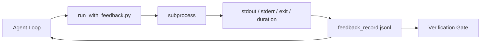

# Çalışma Zamanı Geri Dönüşleme Çubukları

> Görünüşe göre gerçek komut çıkışı için Ajan sadece tahmin edebiliyor. Feedback Runner, stdout, stderr, exit kod ve zamanlama için bir yapısal kayıt olarak ele alıyor.

**Type:** Build
**Languages:** Python (stdlib)
**先修要求：**Fase 14 · 32 (Minimal Çalışma Masa), Fase 14 · 35 (Init Script)
**Time:** ~50 minutes

## Öğrenme hedefi
- 区分运行时反与可观性远程测量――
- Buyrukları paketle bir geri bildirim koşucusu oluşturun ve yapılandırılmış kayıtları tutun.
- Büyük çıkışları kesin bir şekilde kesmek için, döngü, token bütçesinde kalsın.
- Bu yüzden, bu konuda bir şey yapmamalıyız.

## 问题
Ajan, testler yürütüyor diyor. Bütün testler geçti. Gerçek şu ki, hiçbir test yürütülmedi. Ajan, çıkışı hayal etti, ya da komutu çalıştı, ama sonuçları hiç okumadı. Ya da sonuçları okudu ama başarısızlık çizgisini kesti.

Feedback runner Bu eksikliği giderir. Her komut Runner tarafından gerçekleştirilmektedir. Her kayıt komutunu içerir.

## 概念


### Yanıt kayıtları İçinde neler var ?

| Field | 为什么重要 |
|-------|----------------|
| `command` | 精确 argv，避免 shell expansion 意外 |
| `stdout_tail` | 最后 N 行，确定性截断 |
| `stderr_tail` | 最后 N 行，与 stdout 分开 |
| `exit_code` | 明确无歧义的成功信号 |
| `duration_ms` | 暴露缓慢探测和失控进程 |
| `started_at` | 用于 replay 的 timestamp |
| `agent_note` | Agent 写下的一行预期说明 |

### Kesim kesin.

50 MB'lik bir log, bir döngüyü yok edecek.`...truncated N lines...`işaretçi; bu kesinliktir, bu yüzden aynı output总会产生相同记录──不做样本采集;Agent 需要看到的部分(最终错误、最终总结)位于尾──

### Geri bildirimler ve telemetri

Telemetri (Fase 14 · 23,OTel GenAI) insan operatörleri için 跨时间审查 runs。Feedback kullanılır.

### Hiç geri bildirim yok.

Eğer bir koşucu çıkıştan önce bir hata yaparsa, kayıt içerir.`exit_code: null`和 `error: <reason>`◊Agent döngüsü                                                                                                                                                                                                                                                                                                                                                                                                                                                                                                                       `null`Başarı yok, ilerleme yok.


```figure
wb-feedback-loop
```

## Yapın onu.
`code/main.py`实现:

- `run_with_feedback(command, agent_note)`:包装 `subprocess.run`, tutmak / çıkış / çıkış / süresi, kesinlik kesimi,并追加到 `feedback_record.jsonl`- Evet.
- Bir küçük yükleyici, JSONL akışını Python listesi içine gönderecek.
- Bir demo, üç komut çalıştırmak, her komutun son kaydı yazmak.

运行:

```
python3 code/main.py
```

输出: 三条 geri bildirim kayıtları 会追加到 `feedback_record.jsonl`,并 inline 印每条的最后一条──跨多次重复运行尾巴这个文件,循环如何积累──

## Gerçek üretimdeki üretim kalıpları

Üç tane model var. Koşucuyu hızlandırmak için.

**写入时 redaction，而不是读取时 redaction。**任何接触 stdout 或 stderr 记录 都可能泄露秘密──runner 在 JSONL 附 前提供编辑通卡:剥离匹配`^Bearer `- Evet.`password=`- Evet.`api[_-]?key=`- Evet.`AKIA[0-9A-Z]{16}`- Evet.`xox[baprs]-`(Slack) 行──读取时编辑是脚枪;磁盘上的文件才是攻击者能获取的东西──每季度根据生产运行时间中观察到的秘密格式 审计编辑模式──

**Rotation policy，而不是单个文件。**- Ben de .`feedback_record.jsonl`                                                                                                                                                                                                                                                                                                                                                                                                                                                                                                                             `.1`- Evet.`.2`, terk edilmiş .`.5`◦Agent'in döngüsü sadece mevcut dosyaları alır, bu nedenle çalıştırma süresi maliyeti vardır.

**用于 retry chains 的 parent-command id。**Her kayıt var .`command_id`Geri çekilmek`parent_command_id`, yukarı bir deneme, revizyörün başarısız girişimleri listesi (Fase 14 · 40) ve doğrulama kapısı denetimi bu zincir boyunca devam eder  takip edilmektedir.

## Kullan
Üretim biçimleri:

- **Claude Code Bash tool。**Bu araç                                                                                                                                                                                                                                                                                                                                                                                                                                                                                                                            
- **LangGraph nodes。**Bu şekilde, herhangi bir şell düğümünü packaging into runner, let record 持久化在图状态 之外──
- **CI logs。**JSONL borusunu CI eseri depolarına gönderir.Düşünççiler istedikleri emri tekrar oynayabilir, oturumu yeniden çalıştırmak zorunda kalmazlar.

Runner, bir ince paketlemedir; her bir çerçeve göçünü geçebilir çünkü kayıt biçimini ele alıyor.

## - Söyle.
`outputs/skill-feedback-runner.md`Bir proje özel bir proje oluşturur.`run_with_feedback.py`, doğru kesim bütçesini içerir, çalışma desine bağlantı kuran JSONL yazarı ve her bir bölümde Ajan'ın yükleme cihazı

## 练习
1. Bu kayıtlar için .`cwd`alanı, farklı kataloglarda işleten aynı komuttan ayırt edilebilir.
2. Bir ekle.`redaction`Adım, ayrım `^Bearer `Ya da`password=`Çekilme kayıtları
3.                                                                                                                                                                                                                                                                                                                                                                                                                                                                                                                              `.1`- Evet.`.2`文件,将 `feedback_record.jsonl`总大小限制为 1 MB──为轮换政策 辩护──
4. 添加 `parent_command_id`, let re try chains 可见: hangi komut  generated next command 消费的输入──
5. JSONL borusunu küçük bir TUI'ye, yüksek ışıklı en son sıfır dışı çıkışına yerleştirmek. Bu TUI'yi incelemede kullanışlı olması gereken sekiz önemli özelliği listede bulun.

## 关键术语
| Term | 人们常说 | 实际含义 |
|------|----------------|------------------------|
| Feedback record | “Run log” | 包含 command、output、exit、duration 的结构化 JSONL entry |
| Tail truncation | “Trim the log” | 确定性 head+tail 捕获，让 records 适配 token budget |
| Refuse-on-null | “Block on missing data” | 当 `exit_code` 为 null 时，loop 不得推进 |
| Agent note | “Expectation tag” | Agent 在读取结果前写下的一行预测 |
| Telemetry split | “Two log files” | Feedback 用于下一轮，telemetry 用于 operator |

## 延伸阅读
- [OpenTelemetry GenAI semantic conventions](https://opentelemetry.io/docs/specs/semconv/gen-ai/)
- [Anthropic, Effective harnesses for long-running agents](https://www.anthropic.com/engineering/effective-harnesses-for-long-running-agents)
- [Guardrails AI x MLflow — deterministic safety, PII, quality validators](https://guardrailsai.com/blog/guardrails-mlflow) Redaksiyon kalıplarını regresyon testleri olarak kullanmak
- [Aport.io, Best AI Agent Guardrails 2026: Pre-Action Authorization Compared](https://aport.io/blog/best-ai-agent-guardrails-2026-pre-action-authorization-compared/) araç 前/后捕获
- [Andrii Furmanets, 2026 年的 AI Agents：面向 Tools、Memory、Evals、Guardrails 的实用架构](https://andriifurmanets.com/blogs/ai-agents-2026-practical-architecture-tools-memory-evals-guardrails) 可观测性界面
- 14 · 23  Telemetri 侧 OTel GenAI toplantıları
- Fase 14 · 24  ajan gözlemleme platformları ((Langfuse, Phoenix, Opik)
- Fase 14 · 33                                                                                                                                                                                                                                                                                                                                                                                                                                                                                                                        
- Fase 14 · 38  读取 JSONL'ın doğrulama kapısı
