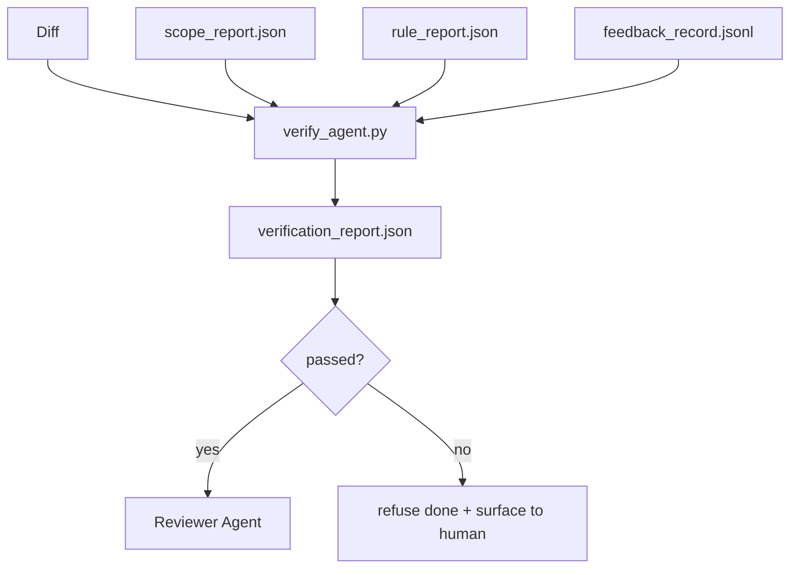

# Verifikasyon Kapıları

> Agent, kendi işini tamamlamak için işaretleyemez. Verification gate 会读取 scope contract、feedback log、rule report 和 diff,并回答一个问题:

**Type:** Build
**Languages:** Python (stdlib)
**Prerequisites:** Phase 14 · 33 (Rules), Phase 14 · 36 (Scope), Phase 14 · 37 (Feedback)
**Time:** ~55 分钟

## Öğrenme hedefi
- Verifikasyon kapısı 定义为作用对工作台文物的确定性函数──
- Kural rapor, kapsam rapor, geri bildirim kayıtları, farklılıkları bir hüküm haline getirmek.
- 输出审查员 agentleri ve CI şehirleri okuyacak `verification_report.json`- Evet.
- Eğer blok ağırlığı başarısızlık olursa, görevleri kabul etmeyi reddetmek için bir istisna yoktur.

## 问题
Ajanlar 太容易宣称成功──三种失败形态最常见:

-  görünüşe göre yanlış. model  öz farkını okudu, sonra doğru olduğunu fark etti.
- 测试通过了──说得很自信──但没有测试实际运行的记录──
-  satisfy acceptance── acceptance criteria  sufficiently broadly explained, until anything like is completed to be completed

İş masası 修复方式 修复方式 修复方式 修复方式 修复方式 修复方式 修复方式 修复方式 修复方式 修复方式 修复方式 修复方式 修复方式 修复方式 修复方式 修复方式 修复方式 修复方式 修复方式 修复方式 修复方式 修复方式 修复方式 修复方式 修复方式 修复方式 修复方式 修复方式 修复方式 修复方式 修复方式 修复方式 修复方式 修复方式 修复方式 修复方式 修复方式 修复方式 修复方式 修复方式 修复方式 修复方式 修复方式 修复方式 修复方式 修复方式 修复方式 修复方式 修复方式 修复方式 修复方式 修复方式 修复方式 修复方式 修复方式 修复方式 修复方式 修复方式 修复方式 修复方式 修复方式 修复方式 修复方式 修复方式 修复方式 修复方式 修复方式 修 修复方式 修方式 修复方式 修 修 修 修 修 方法 修 方法 修 方法 修 方法 修 方法 修 方法 方法 修 方法

## 概念


### kapı 检查什么

| Check | Source artifact | Severity |
|-------|-----------------|----------|
| 所有 acceptance commands 都已运行 | `feedback_record.jsonl` | block |
| 所有 acceptance commands 都以零退出码结束 | `feedback_record.jsonl` | block |
| Scope check 没有 forbidden writes | `scope_report.json` | block |
| Scope check 没有 off-scope writes | `scope_report.json` | block or warn |
| 所有 block-severity rules 都通过 | `rule_report.json` | block |
| feedback 中没有 `null` exit codes | `feedback_record.jsonl` | block |
| Touched files 匹配 `scope.allowed_files` | both | warn |

`warn`Yargılama için bir karar bulmak 添注释;`block`Bir engel bul .`passed: true`- Evet.

### 确定性, değil olasılık

 Aynı eser kümesi için, her seferinde aynı hüküm üretmek gerekir.

### Bir rapor, bir yol.

Her görev kapanır, şehir kapısı bir çıkış yapar.`verification_report.json`, yazın `outputs/verification/<task_id>.json`❖CI 消费同一个路──使用不同路的多个门 会分叉真理源──

### ısalı yok reddedilmek

Blok ağırlığı bulgular, ajan tarafından geçersiz kılınamaz. Sadece insan tarafından geçersiz kılınır ve kaydedilmelidir.`override_reason`和 `overridden_by`Kullanıcı kimliği: “Sırırır “, “bir kez “, “bir kez “, “bir kez “, “bir kez “, “bir kez “, “bir kez “, “bir kez “, “bir kez “, “bir kez “,” değil “bir kez “,” diye bir kez “bir kez “,” diye bir kez “sizin değiştirmek” diye bir kez “,” diye bir kez “bir kez “bir kez “bir kez “bir kez “bir kez “bir kez “birleştirebilir” diye bir kez” değil.


```figure
wb-gate-sequence
```

## Yapın onu.
`code/main.py`实现:

- Her giriş eserinin yükleyicisi, hepsi kendiliğinden içerir.
- Bir tane .`verify(task_id, artifacts) -> VerdictReport`saf bir işlev.
- Bir baskıcısı, her kontrolün sonuçlarını ve son geçiş/başarısızlığı gösterir.
- Üç tane görev senaryoları: Demo: temiz geçiş, kapsam ürperti, eksik kabul.

- Yapma .

```
python3 code/main.py
```

输出: üç yargıçlık raporu, her biri yazı yanında saklanıyor.

## Gerçek sahne içindeki üretim modeli

Dört tane model, kapıyı bir diğer çamaşır işinden çıkaracak.

**Defense-in-depth，而不是 single gate。**Önbulduk hok → CI durum kontrolü → ön alet authz hok → ön birleşim kapısı。 her bir katman belirtilmiş, bu nedenle bir katmanın başarısızlığı 会被下一层捕获──microservices.io'nun 2026 yılının 3 aylık oyun kitabı 明确指出: önbulduk hok kaçınılmaz, çünkü model taraflı beceriyle farklıdır, ajanın  अनुसरण etmesine bağımlı değildir── doğrulama kapısı 位于 CI / pre-merge 层。

**通过确定性 check 做 defense，model-judge 只处理细微差别。**Anthropic'in 2026 Hibrit Norm çiftleşmesi:可验证 rewards(unit tests、schema checks、exit codes) cevap code 是否解决了问题?LLM rubrics 回答code 是否可读、安全、符合风格?gate 运行第一类;reviewer(Phase 14 · 39)运行第二类──混用它们会让信号塌──

**签名 override log，而不是 Slack threads。**Her seferinde bir şehirden bir şehirden bir şehirden bir şehirden bir şehirden bir şehirden bir şehirden bir şehirden bir şehirden bir şehirden bir şehirden bir şehirden bir şehirden bir şehirden bir şehirden bir şehirden bir şehirden bir şehirden bir şehirden bir şehirden bir şehirden bir şehirden bir şehirden bir şehirden bir şehirden bir şehirden bir şehirden bir şehirden bir şehirden bir şehirden bir şehirden bir şehirden bir şehirden bir şehirden bir şehirden bir şehirden bir şehirden bir şehirden bir şehirden bir şehirden bir şehirden bir şehirden bir şehirden bir şehirden bir şehirden bir şehirden bir şehirden bir şehirden bir şehirden bir şehirden bir şehirden bir şehirden bir şehirden bir şehirden bir şehirden bir şehirden bir şehirden bir şehirden bir şehirden bir şehirden bir şehirden bir şehirden bir şehirden bir şehirden bir şehirden bir şehirden bir şehirden bir şehirden bir şehirden bir şehirden bir şehirden bir şehirden bir şehirden bir yere geçiyor .`outputs/verification/overrides.jsonl`中输出一行,包含:zaman damgası, kod bulmak, neden, kullanıcı imzalama, mevcut HEAD komisyonu, çalıştırma süresi, herhangi bir eksik imzanı reddetmek, denetim izini takip etmek, bu, kontrol kontrol politikası ve kontrol kontrolü arasındaki sınırı,

**将 coverage floor 作为一等 check。** `coverage_report.json`Bir tane içeri girecek .`coverage_floor`(tanımlı 80%) kontrol. Eğer testlerin kapsamı zeminden düşükse, veya önceki birleştirme zeminden düşükse %1'den fazla, kapı başarısız olur.

**`--strict` mode 会将 warns 提升为 blocks。** serbest bırakma dalları  gemi bloklama ilişkiler veya olay sonrası triaj için,`--strict`Bu bayrakı şubenin seçimiyle tamamlanmış değil, çünkü her şey sıkı olacak.

## Kullan
Üretim biçimleri:

- **CI step。** `verify_agent`İşleşme için bir ajanın son eserleri yok.`passed: true`, birleşme koruma reddedilecek.
- **Pre-handoff hook。**Agent çalıştırma zamanı. Doktora hazırlanmak için.
- **Manual triage。**Bir ajanın başarının olduğunu iddia ederken insan şüphe ederken, operatörler rapor okuyacak.

Kapı, çalışma masası akışının ortasındaki karar kenarıdır. Diğer tüm yüzeyler onun üzerinde yer almaktadır.

## - Söyle.
`outputs/skill-verification-gate.md`Hangi kabul komutları içeri girecek, hangi kurallar blok ciddiyetidir, hangi alan dışı yazılar tolerant, kontrol logunu geçersiz bırakacak  nasıl depolanır.

## 练习
1. Bir ekle.`coverage_floor`kontrol:test komutu yaratılması gerekir, ve en az %80'e ulaşmak gerekir.
2. 支持 `--strict`Mod, `warn`提升为 `block` Kaydetmek için sıkı mod 适合作为默认值的场景──
3. 让 gate JSON dışında da oluşturmak Markdown özet.
4. Bir ekle.`time_since_last_human_touch`Kontrol:İnsan tuş basması 后 60秒内编辑过的任何文件,都免于离境旗──
5. Ürünlerinizde gerçek ajan farkı var. Ne kadar bulgu gerçek, ne kadar gürültü?

## 关键术语
| Term | What people say | What it actually means |
|------|----------------|------------------------|
| Verification gate | “阻止事情的 check” | 作用于 workbench artifacts 的确定性函数，生成 pass/fail verdict |
| Block severity | “Hard fail” | 会阻止 `passed: true` 并要求签名 override 的 finding |
| Override log | “我们为什么放行它” | 带有 reason 和 user id 的签名条目，由 review 审计 |
| Acceptance command | “证明” | 一个 shell command，其零退出码就是 `done` 的含义 |
| One report path | “Source of truth” | `outputs/verification/<task_id>.json`，由 CI 和 humans 共同消费 |

## 延伸阅读
- [Anthropic, Harness design for long-running application development](https://www.anthropic.com/engineering/harness-design-long-running-apps)
- [OpenAI Agents SDK guardrails](https://platform.openai.com/docs/guides/agents-sdk/guardrails)
- [microservices.io, GenAI dev platform: guardrails](https://microservices.io/post/architecture/2026/03/09/genai-development-platform-part-1-development-guardrails.html) Öntanımlı ve CI arasındaki savunma derinliği
- [ICMD, The 2026 Playbook for Agentic AI Ops](https://icmd.app/article/the-2026-playbook-for-agentic-ai-ops-guardrails-costs-and-reliability-at-scale-1776661990431) onay kapısı 阶梯(öntem → onay → eşiklerin altında otomobil)
- [Type-Checked Compliance: Deterministic Guardrails (arXiv 2604.01483)](https://arxiv.org/pdf/2604.01483) Lean 4  deterministik kapılama olarak 
- [logi-cmd/agent-guardrails — merge gate 规范](https://github.com/logi-cmd/agent-guardrails) kapsam + mutasyon testi kapıları
- [Guardrails AI x MLflow](https://guardrailsai.com/blog/guardrails-mlflow) Deterministik onaylayıcılar 作为 CI 评分器
- [Akira, Real-Time Guardrails for Agentic Systems](https://www.akira.ai/blog/real-time-guardrails-agentic-systems) araç 调用前/后的 kapılar
- Fase 14 · 27  hızlı enjeksiyon savunmaları(gate' ın karşılaşma çiftleri)
- Fase 14 · 36  Bu kapı uygulanması kapsamı sözleşmesi
- Fase 14 · 37  此 gate skor さんの geri bildirim kayıtları
- Fase 14 · 39  kapı eleştirmen ajanına teslim
