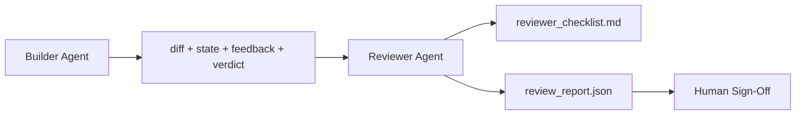

# Recenseur Ajan: Genel Yapıcı ve Marker ayrıldı

> 写代码的代理 不能给它打分──reviewer is a second loop, using different system prompt、 different goals, and for builder 产品 all content is only read access permissions──builder and reviewer 间隔, is the majority of reliability ∼

**Type:** Build
**Languages:** Python (stdlib)
**Prerequisites:** Phase 14 · 38 (Verification Gate)
**Time:** ~55 分钟

## Öğrenme hedefi
- Bir ajanın kendi işini neden güvenilir bir şekilde inceleyemediğini açıklayın.
- 构建一个评论员代理 循环,它消费建筑物,并输出结构化评论报告──
- 编写一个评论员条目,根据具体维度评分,而不是凭感──
- Bu yüzden, bu yeni bir eser için bir çalışma yaptırmak için, bir çalışma dizisine girmek için, bir çalışma dizisine girmek için, bir sanat eserinin gerçek yapısını incelemek için bir adım atmak için, bir çalışma dizisine girmek için, bir çalışma dizisine girmek için, bir çalışma dizisine girmek için, bir çalışma dizisi yapın.

## 问题
您让代理 修复一个bug──它编辑了四个文件,运行了测试,并报告完成──验证门(Phase 14 · 38) 已运行且 scope 保持不变──gate 显示 `passed: true`İki gün sonra, bu düzeltmenin bugün diğer yarısı olduğunu fark ettin.

Kabul gerekli, ancak yeterli değil. Eleştirmen kabul sorusunu soramaz: Bu doğru bir sorunu çözdü mü? Açıklama olmadan kapsamını genişletti mi? Sorguya çekilmesi gereken varsayımları kaydetti mi?

## 概念


### Değerlendirici rubrik

5 boyut, her boyut 0 ila 2 arasında değerlendirilir.

| Dimension | Question |
|-----------|----------|
| Problem fit | 这个变更是否解决了任务所陈述的问题，而不是相近的问题？ |
| Scope discipline | 编辑是否限制在 contract 内，或者 contract 的扩展是否是有意为之？ |
| Assumptions | 所有隐藏 assumptions 是否都写在了某个可 review 的地方？ |
| Verification quality | acceptance command 是否真的证明了目标，还是只证明了一个更弱的版本？ |
| Handoff readiness | 下一个 session 是否能从当前状态干净地接手？ |

总分 10 分──7 分以下は軟失敗; 5 分以下はハード失敗──

### eleştirmen bağımsız rol, bağımsız model değil.

Builder ile aynı model kullanılabilir 运行评论器──关键约束是角色分离: farklı sistem prompt、 farklı giriş、对差 没有写权──姿态的变化就是信号的变化──

### eleştirmen 不能编辑 diff

yorumcu 读取 diff、state、feedback、verdict。 o bir rapor yazıyor。 o bir patch diff。 eğer rapor diyor 修复这个,下一轮 constructor turns 去做修复;reviewer 回到 review。混合角色会破坏这个段间隔。

### Tekrarlayıcı rubri ve doğrulama kapısı karşılığı

kapı(Fase 14 · 38) Kontrol kesinlik fakti: kabul edilmesi, yürütülmesinin olup olmadığı, kuralların olup olmadığı, kapsamının olup olmadığı, tutulması, kontrol edilmesi ve karar vermesi: bu doğru bir iş olup olmadığı, dosya kayıtları olup olmadığı, onaylanması, kullanılabilir olup olmadığı, her ikisi de gereklidir.


```figure
wb-builder-marker
```

## Yapın onu.
`code/main.py`实现:

- Bir tane .`ReviewerInputs`Dataclass,用来打包评论者 读取的文物──
- Bir rubrik puanlayıcı, her boyut bir fonksiyon. Her fonksiyon belirgin ve ders için stub derecesi kullanılır.
- Bir tane .`review_report.json`yazar, içerir beş bölüm, toplam bölüm ve hüküm`pass`- Evet.`soft_fail`- Evet.`hard_fail`)。
- İki demo vaka: bir temiz değişim ve bir doğru, bir yanlış test değişim.

运行:

```
python3 code/main.py
```

输出: 两份复习报告 写入磁盘,并显示在控制台中一张维度分数表──

## Gerçek sahne içindeki üretim modeli

证据如下:Cloudflare 2026 yılının 4 月 AI Code Review sisteminde, 30 天内跨 5,169  repos、48,095 合并 istekleri 运行了 131,246 次 review。 review 完成时间中位数为 3 分 39 秒──最多七专家评论员 ((güvenlik, performans, kod kalitesi、doklar、üretme yönetimi、 uyumluluk、Mühendislik Kodesi) ⇒ Review Coordinator 下并行运行, model koordinatör tarafından tekrar sonuçlar belirlemek.

Dört çeşit bir model, büyüklüğüne ulaştırır.

**Specialist pool, not one big reviewer.**Solo repos için, bir 5 维 rubrik değerlendiricisi 足足── bir kez kod tabanı güvenlik-kritik、performans-kritik 和 doklar yüzeyleri varsa, hemen daha küçük uzmanlara ayırmak gerekir── koordinatör yapmak için; uzmanlar tam rubrikleri kullanmıyor──model-sınıf ayrımı da doğal olarak oluşur: ucuz uzmanlar, pahalı koordinatör──

**Bias mitigation as design requirement, not optimization.**LLM yargıçları 会表现出四类稳定偏见(Adnan Masood,2026年 4 月): pozisyon偏见(GPT-4 在 (A,B) 与 (B,A) 排序上约40%不一致) 变态偏见(更长输出有约15% puan enflasyon) 自我偏见(yargıçlar 偏好同一模型家族的输出) 权威(yargıçlar 会高估对知名作者的引用) 缓解方式:同时评估两种排序,只计算一致获胜;使用明确奖励简洁性的 1-4 ölçekleri;跨模型家庭 轮换 yargıçları;评分前移除作者姓名──

**Calibration set, not vibes.** hazırlanın 10-20 tarih görevleri içeren bir toplam  ve bilinen doğru hükümler vardır  her değişiklik prompt                                                                                                                                                                                                                                                  

**Hybrid norm with the gate.**Verifikasyon kapısı(Fase 14 · 38) Doğruluk kontrolü işlemi (Testiler kabul edilmemesi, yürütülmemesi, geçmemesi, kapsamı tutmaması) ・・・Düşünceden işlemi (Special Language Testing) ---Bu doğru bir iş mi, varsayımlar mı, kayıtlar mı, verilebilir mi) ・・・Antropik'in 2026 kılavuzu 明确 vurgulamıştır:

## Kullan
Üretim biçimleri:

- **Claude Code subagents.**Bu PR'de yayınlanan yorumlar üzerinde bir puanla yorum yapılıyor.
- **OpenAI Agents SDK handoffs.**Yapıcı, görev tamamlandığında eleştirmenlere teslim edebilir. Eleştirmen bulgu listesi ile birlikte eleştirmek, insanlara teslim etmek veya teslim etmek mümkündür.
- **Two-model pairing.**Builder 运行在更快、更便宜的模型上──Reviewer 运行在更强的模型上,更小的文本,专注判断,

İnsan her incelemeyi kendiliğinden yapamıyorsa, iş masası ikinci gözlerini çıkarıyor.

## - Söyle.
`outputs/skill-reviewer-agent.md`Bir projeye özel bir incelemeci rubrik, bir bağlantı yapıcı eserlerinin incelemeci ajanı stübu ve doğrulama kapısı ile entegrasyon, yapay incelemeyi boş sayfalardan başlamak yerine, yazılı rapordan  başlatın.

## 练习
1. 添加第六个与你的产品域相关维度――为什么它没有现有五维吸收――
2. İki farklı sistem sorgulaması kullanmak için kullanılır.
3. Her bir boyut için eklenir.`confidence`En düşük güven oranı 0.6'dan düşük olduğunda rapor yayınlamayı reddetti.
4. Kalibrasyon kümesi oluşturmak: 10 个 带有已知正确判决的历史任务 close-outs──对它们运行审查者──它在哪里与历史记录不一致?
5. 添加一个请求更多证据 供应:评论员可以在评分前要求构建者 运行某特定测试――合适的后退是什么,才能避免循环?

## 关键术语
| Term | What people say | What it actually means |
|------|----------------|------------------------|
| Reviewer rubric | “Checklist” | 五维 0-2 评分，每个维度都有一个书面问题 |
| Soft fail | “Needs revisions” | 总分低于 7；builder 获得需要处理的 findings |
| Hard fail | “Reject” | 总分低于 5，或任一维度为 0；暂停并呈现给 human |
| Role separation | “Different prompt” | 同一个 model 可以承担两个角色；关键约束是 inputs 和 posture |
| Confidence floor | “Don't ship low-signal reports” | 当 rubric 不确定时，拒绝输出 verdict |

## 延伸阅读
- [OpenAI Agents SDK handoffs](https://platform.openai.com/docs/guides/agents-sdk/handoffs)
- [Anthropic Claude Code subagents](https://docs.anthropic.com/en/docs/agents-and-tools/claude-code/sub-agents)
- [Cloudflare, Orchestrating AI Code Review at Scale](https://blog.cloudflare.com/ai-code-review/) 7 个 Uzman + Koordinatör 架构,30 天 131k 次 runs
- [Agent-as-a-Judge: Evaluating Agents with Agents (OpenReview / ICLR)](https://openreview.net/forum?id=DeVm3YUnpj)DevAI referans değerleri,366 hiyerarşik çözüm gereksinimleri
- [Adnan Masood, Rubric-Based Evaluations and LLM-as-a-Judge: Methodologies, Biases, Empirical Validation](https://medium.com/@adnanmasood/rubric-based-evals-llm-as-a-judge-methodologies-and-empirical-validation-in-domain-context-71936b989e80) 4                                                                                                                                                                                                                                                              
- [MLflow, LLM-as-a-Judge Evaluation](https://mlflow.org/llm-as-a-judge) İstehsalcı/Örtümci'nin üretim aletleri ile
- [LangChain, How to Calibrate LLM-as-a-Judge with Human Corrections](https://www.langchain.com/articles/llm-as-a-judge) Kalibrasyon ayarlı iş akışı
- [Evidently AI, LLM-as-a-judge: a complete guide](https://www.evidentlyai.com/llm-guide/llm-as-a-judge)
- [Arize, LLM as a Judge — Primer and Pre-Built Evaluators](https://arize.com/llm-as-a-judge/)
- EYİN 14 · 05  Kendini Düzeltme ve NEMİTİK
- Fase 14 · 30  Eval-driven ajan geliştirme(kalibrasyon seti jeneratörü)
- Fase 14 · 38  değerlendirici 读取的验证门
- Fase 14 · 40  değerlendirme raporı 输入的交付包
