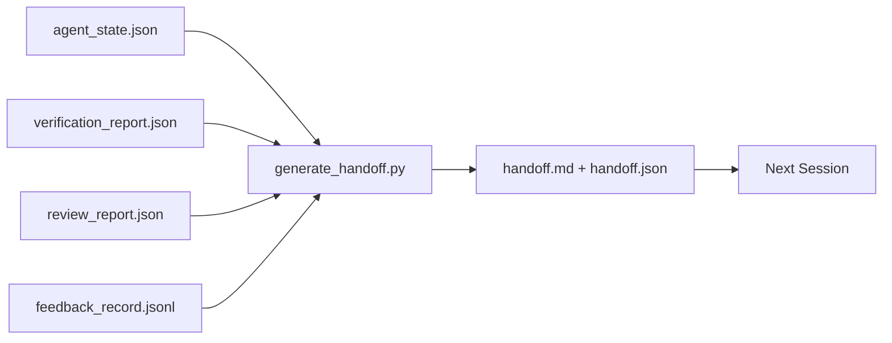

# Çoklu Sessiyonlar

> Sessiyon bitmiş olmalı. İş bitmemiş. Yükleme paketi bir eserdir. Bir saatlik bir süreli bir çalışma için devreye dönüştürülmüştür.

**类型:**Yapım
**语言:**Python (stdlib)
**先修:**Fase 14 · 34 (Repo hafızası), Fase 14 · 38 (Tahqiqat), Fase 14 · 39 (Düşünç)
**时间:**~ 50 dakika

## Öğrenme hedefi

- Her bir teslimat paketini tanımlamak için yedi bölüm gereklidir.
- İş masası eserlerinden 生成 handoff, değil el yazısı说明文字
- Büyük geri bildirim kayıtlarını 剪成适合交付的摘要──
- 让下一个会议的第一动作具有确定性──

## 问题

Sessiyon sona erdi. Ajan dedi: "Yeterince iyi, ilerleme kaydedik". Bir sonraki seans açıldı. Bir sonraki seansın sonu geldi. Bir sonraki seansın sonu gelmedi. Bir sonraki seansın sonu gelmedi.

糟糕的交付成本,任务生命周期内每次中持续支付──修复方式在会议结束时自动生成一个包:改了什么;为什么;改了什么;尝试过什么;失败了什么;还剩什么;下次首先做什么; 修复方式在会议结束时自动生成一个包:改了什么;为什么;尝试过什么;失败了什么;还剩什么; 下次首先做什么;

## 概念



### Her bir elbise yedi bölüm taşır .

| Field | 它回答的问题 |
|-------|---------------------|
| `summary` | 一段话说明完成了什么 |
| `changed_files` | 一眼看清 diff |
| `commands_run` | 实际执行过什么 |
| `failed_attempts` | 尝试过什么，以及为什么没有成功 |
| `open_risks` | 下个 session 可能踩到什么坑，附 severity |
| `next_action` | 下个 session 采取的第一个具体步骤 |
| `verdict_pointer` | 指向 verification + review reports 的路径 |

`next_action`字段是承重字段── 一包含所有内容但缺少 `next_action`Yapacak olan durum raporudur, yapma değil.

### Yapacaklar, yazmayacaklar.

Handwriting handoff,就是在困难日子里会被跳过的 handoff── Generator 读取工作桌文物并输出包──Agent'in görevi, çalışma deskiyi jeneratörün genel sonucu haline getirmek, kendi başından özet yazmak değil──

### 两种形式:İnsan okuyabilir ve makine okuyabilir

`handoff.md`供人 阅读。`handoff.json`供下一个代理 加载── ikisi de aynı kaynaklı eserlerden oluşur── eğer ayrılığa düşerlerse, JSON olarak hazırlanırlar──

### İsteğe bağlı kayıtlar

Tamamen.`feedback_record.jsonl`Belki yüzlerce kayıt vardır. Sadece son K 条 ve her bir sıfır dışı çıkış kayıtları ile birlikte.

### 留下干净 durum

Handoff 描述工作; clean state 让工作可恢复──它们不是同一件事──如果下一个会议 开开时面对的是半截截差、代理 忘了的临时文件、游离分支,以及尚未真正运行就报错的测试,那么再完美`handoff.md`Ayrıca hiçbir değeri yok. Bir sonraki ajan, bir seansta bırakılan şeyleri temizlemek için 10 dakika harcar. Yapmayı sürdürmek yerine; bu maliyet görev yaşam döngüsünde her seansta reyi artır.

Bu yüzden seans, bir özellik 能跑通 sırasında bitmez, ama bir çalışma masasında 能跑通时结束, 能跑通时结束, 能跑通时结束, 能跑通时结束, 能跑通时结束, 能跑通时结束, 能跑通时结束, 能跑通时结束, 能跑通时结束, 能跑通时结束, 能跑通时结束, 能跑通时结束, 能跑通时结束, 能跑通时结束, 能跑通时结束, 能跑通时结束, 能跑通时结束, 能跑通时结束, 能跑通时结束, 能跑通时结束, 能跑通时结束, 能跑通时结束, 能跑通时结束, 能跑通时结束, 能跑通时结束, 能跑通时结束, 能跑通时结束, 能跑通时结束, 能跑通时结束, 能跑通时结束, 能跑通时结束, 能跑通时结束, 能跑通时结束, 能运通前时结束, 能经过的阶段, 经过的阶段, 经过的阶段, 经过的阶段, 经过的阶段, 经过的经过的经过的经过的经过的经过的经过的经过的经过的经过的经过的经过的经过的经过的经过的经过的经过的经过的经过的经过的经过的经过的经过的经过的经过的经过的经过的经过的经过的经过.

| Check | Clean means | Dirty blocks because |
|-------|-------------|----------------------|
| Working tree | 每个变更都已 commit，或明确 stash 并附带说明 | 半截 diff 会被下一个 agent 看成有意图的工作 |
| Temp artifacts | 没有 `*.tmp`、scratch dirs、debug prints 或留下的注释块 | 游离文件会污染 diff 和下一个 agent 的 mental model |
| Tests | 绿色，或红色但在 `open_risks` 中命名了失败 | 沉默的红色 test 是下一个 session 会踩进去的陷阱 |
| Feature board | `feature_list.json` status 反映真实状态（Phase 14 · 36） | 过期 board 会把下一个 session 派去做已经完成的工作 |
| Branch | 位于预期 branch，没有 detached HEAD，没有 orphan branches | 错误 branch 会让下一个 session 的第一个 commit 落到错误位置 |

temizlik aşaması                                                                                                                                                                                                                                                                                                                                                                                                                                                                                                                          `clean_state.json`, listede bloklama sorunları var;空列表是手机发电机 写包 前要断言的前置条件──建立在脏树上的手机不是手机,而是转发混乱──两件成对出现:清洁 证明工作桌可以安全离开,handoff 证明下一个会议 知道从哪里开始──


```figure
wb-handoff-packet
```

## Yapın onu.

`code/main.py`实现了:

- Bir yüklemeci, bir durum, bir hüküm, bir inceleme ve bir geri bildirim`WorkbenchSnapshot`- Evet.
- Bir tane .`generate_handoff(snapshot) -> (markdown, payload)`函数。
- Bir filtre, son K 条 geri bildirim girişlerini seçin, tüm sıfır dışı çıkışları seçin.
- Bir demo çalıştırma, senaryoya yan yana yazılı.`handoff.md`和 `handoff.json`- Evet.

- Yapma .

```
python3 code/main.py
```

输出: Tasarımlı bir parça, ayrıca diskedeki iki belge.

## Gerçek üretim modüsü

Codex CLI、Claude Code 和 OpenCode her biri farklı sıkıştırma 方案ları sunmaktadır; yapılandırılmış teslim paketleri 位于这三者之上──

**Compaction 策略各不相同；packet schema 不变。**Codex CLI'nin POST /v1/response/compact ise bir sunucu taraflı çürük AES blobudur.`_summary`Kullanıcı rol mesajı 追加。Claude Code  контексте  95% 时运行五阶段 渐进的紧缩──OpenCode 使用基于时间盖的信息隐藏加上5-head LLM概要──三种不同机制,同一个需求:把压缩后保留下来的内容序列化成可移植的艺术品──paket就是这个艺术品──

**Fresh-session handoff 不是 compaction。**Compaction 延长一个会议;handoff 干净地关闭一个会议,并启动下一个──Hermes Issue #20372 的框架(2026 年 4 月) 是对的:当在场压缩时 开始降低质量时,Agent 应写一个紧紧的交付,结束会议,并在新背景恢复──paket 让这种转换变得便宜──错误做法是直压缩到质量崩;修复方式是为早期干净的交付 预留预算──

**每个 branch 和 topic 只保留一个 active handoff。**Çoklu ajan koordinasyonu 崩更多 始终包含 始终包含 始终包含 始终包含 始终包含 始终包含 始终包含 始终包含 始终包含 始终包含 始终包含 始终包含 始终包含 始终包含 始终包含 始终包含 始终包含 始终包含 始终包含 始终包含 始终包含 始终包含 始终包含 始终包含 始终包含 始终包含 始终包含 始终包含 始终包含 始终包含 始终包含 始终包含 始终包含 始终包含 始终`branch`- Evet.`last_known_good_commit`, ve `active | superseded | archived`之一的 `status`❖ Dayanmış elveriler arşivlenir; sadece aktif olanın o sürükleyen bir sonraki oturum.

**在 50-75% context 之前收尾，不要等到撞墙。**Handwriting Mode playbook(CLAUDE.md + HANDOVER.md) raporunda, sesyonun bağlam bütçesinin %50-75'i sona erdiği, %95'i değil, en iyi etkisi olduğu bildiriliyor.

## Kullan

生产模式:

- **Session-end hook。**Çıkış zamanı: %s %s %s %s %s %s %s %s %s %s %s %s %s %s %s %s %s %s %s %s %s %s %s %s %s %s %s %s %s %s %s %s %s %s %s %s %s %s %s %s %s %s %s %s %s %s %s %s %s %s %s %s %s %s %s %s %s %s %s %s %s %s %s %s %s %s %s %s %s %s %s %s %s %s %s %s %s %s %s %s %s %s %s %s %s %s %s %s %s %s %s %s %s %s %s %s %s %s %s %s %s %s %s %s %s %s %s %s %s %s %s %s %s %s %s %s %s %s %s %s %s %s %s %s %s %s %s %s %s %s %s %s %s %s %s %s %s %s %s %s %s %s %s %s %s %s %s %s %s %s %s %s %s %s %s %s %s %s %s %s %s %s %s %s %s %s %s %s %s %s %s %s %s %s %s %s %s %s %s %s %s %s %s %s %s %s %s %s %s %s %s %s %s %s %s %s %s %s %s %s %s %s %s %s %s %s %s %s %s %s %s %s %s %s %s %s %s %s %s %s %s %s %s %s %s %s %s %s %s %s %s %s %s %s %s %s %s %s %s %s %s %s %s %s %s %s %s %s %s %s %s %s %`outputs/handoff/<session_id>/`- Evet.
- **PR template。**Üreticinin belirtilmesi de PR organı olarak kullanılabilir.
- **Cross-agent handoff。**Bir ürün oluşturmak için bir başka kullanmak için bir başka kod kullanmak için bir başka kod kullanmak için bir başka kod kullanmak için bir paket kullanmak için bir başka kod kullanmak için bir başka kod kullanmak için bir başka kod kullanmak için bir başka kod kullanmak için bir başka kod kullanmak için bir başka kod kullanmak için bir başka bir kod kullanmak için bir başka bir kod kullanmak için bir başka bir kod kullanmak için bir başka bir kod kullanmak için bir başka bir kod kullanmak için bir başka bir paket kullanmak için bir başka bir yöntem kullanmak için bir başka bir yöntem kullanmak için bir başka bir yöntem kullanmak için bir yöntem kullanmak için bir yöntem kullanmak için bir yöntem kullanmak için bir yöntem kullanmak için bir yöntem kullanmak için bir yöntemdir.

Paket 小、规则、生成成本低──省下来的成本会随着每次会议 复利增──

## Yayınla

`outputs/skill-handoff-generator.md`Bir projeyi oluşturur, bir projeyi çalıştırır, bir projeyi çalıştırır, bir sonraki ajanı çalıştırır.`handoff.json`Şema

## 练习

1. Bir ekle.`assumptions_to_validate`字段, exposed constructor has recorded, but reviewer 评分 does not exceed 1 of every assumption──
2. Başarısız koşular için, geçiş koşular için farklı yöntemlerle geri bildirim özetini kesmek.
3. 加入一个 问题对人类的列表――一个问题进入包,而不是进入聊天消息的值是什么?
4. 让发电机 具有无效力:运行两次产生相同的包――成立,需要什么内容保持稳定?
5. 添加一个 下一个会程预备条例节,精确列出 下一个会程 在行动前必须加载的文物──

## 关键术语

| Term | 人们常说 | 实际含义 |
|------|----------------|------------------------|
| Handoff packet | “Session summary” | 携带七个字段的生成 artifact，同时包含 markdown 和 JSON |
| Next action | “首先做什么” | 启动下一个 session 的一个具体步骤 |
| Feedback trim | “Log summary” | 最后 K 条 records 加上每个非零 exit |
| Status report | “我们做了什么” | 缺少 `next_action` 的文档；有用，但不是 handoff |
| Verdict pointer | “Receipt” | 指向 verification + review reports 的路径，用于 traceability |

## 延伸阅读

- [Anthropic，面向 long-running agents 的有效 harnesses](https://www.anthropic.com/engineering/effective-harnesses-for-long-running-agents)
- [OpenAI Agents SDK handoffs](https://platform.openai.com/docs/guides/agents-sdk/handoffs)
- [Codex Blog，Codex CLI Context Compaction：架构、配置、管理长会话](https://codex.danielvaughan.com/2026/03/31/codex-cli-context-compaction-architecture/) POST /v1/response/compact 和 yerel geri dönüş
- [Justin3go，Shedding Heavy Memories：Context Compaction in Codex, Claude Code, OpenCode](https://justin3go.com/en/posts/2026/04/09-context-compaction-in-codex-claude-code-and-opencode) Üç satıcının kompaktleşmesi karşılaştırma
- [JD Hodges，Claude Handoff Prompt：如何跨 Sessions 保持 Context (2026)](https://www.jdhodges.com/blog/ai-session-handoffs-keep-context-across-conversations/) CLAUDE.md + HANDOVER.md,50-75% bağlam bütçesi
- [Mervin Praison，Managing Handoffs in Multi-Agent Coding Sessions：Fresh Context Without Losing Continuity](https://mer.vin/2026/04/managing-handoffs-in-multi-agent-coding-sessions-fresh-context-without-losing-continuity/) dağıtılmış sistemler 视角
- [Hermes Issue #20372 — compression 变得有风险时自动 fresh-session handoff](https://github.com/NousResearch/hermes-agent/issues/20372)
- [Hermes Issue #499 — Context Compaction Quality Overhaul](https://github.com/NousResearch/hermes-agent/issues/499) Codex CLI 中面向 handoff'ın talimatları
- [Microsoft Agent Framework，Compaction](https://learn.microsoft.com/en-us/agent-framework/agents/conversations/compaction)
- [OpenCode，Context Management and Compaction](https://deepwiki.com/sst/opencode/2.4-context-management-and-compaction)
- [LangChain，Context Engineering for Agents](https://www.langchain.com/blog/context-engineering-for-agents)
- Fase 14 · 34  jeneratör 读取的状态文件
- Fase 14 · 38  paket dire direc
- Fase 14 · 39  打包进 paket değerlendirme raporu
