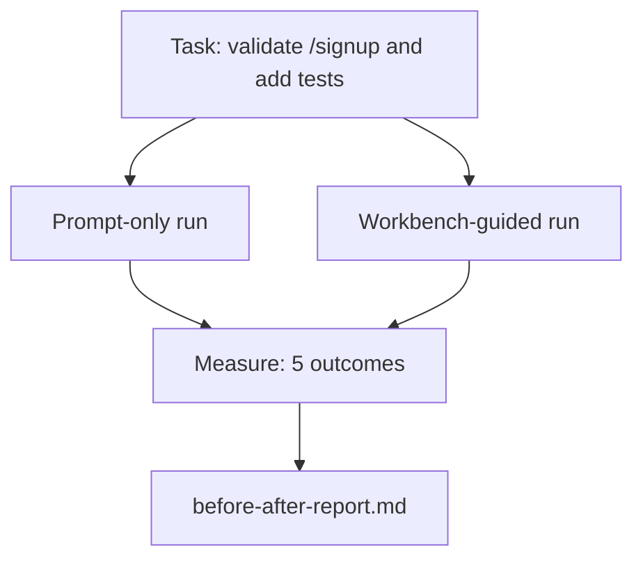

# Çalışma desti kullan

> 十一节 Yüzey hakkında dersler, gerçek kod tabanı kontrolünü geçirmemişse, değersiz olacaktır. Bu ders küçük bir örnek uygulamada iki kez aynı görevi gerçekleştirecektir:

**Type:** Build
**Languages:** Python (stdlib)
**Prerequisites:** Phases 14 · 32 to 14 · 40
**Time:** ~60 minutes

## Öğrenme hedefi
- Yedi iş masası yüzeyini küçük bir uygulamaya birleştirmek.
- Aynı görev iki kez çalıştırılır, sadece hızlı ve çalışma tahtası yönlendirilir)
- 阅读前/后报告,并判断哪些表面提供最大杆──
- 面对但我的模型已经足够好的反驳时,为工作台辩护

## 问题
Oyuncak görevi üzerinde demo yapın kimseyi yemeyecek. İş masası değerini gerçek anlamlı bir repo üzerinde gerçek anlamlı bir görev tamamlamak için ortaya çıkar: daha az başarısızlık, daha az geri dönüş ve bir sonraki seans için kullanılabilir bir paket üretmek.

Bu ders, aynı görevin iki boru hattından geçmesini sağlıyor ve sonuçta şüpheciye ön/sonra rapor verebileceğiniz bir rapor.

## 概念


### Örnek uygulaması

`sample_app/`Orta en az FastAPI 风格 işlemcisi:

- `app.py`, içerir`/signup`(Tamamlanmıştır)
- `test_app.py`, mutlu yol testi içerir.
- `README.md`和 `scripts/release.sh`Yasak bölge yem olarak.

### Görev

> Çı`/signup`添加输入验证:拒绝短于 8 个字符的密码,返回带输入错误包的 422──添加一个测试证明新行为──

### İki boru hattı

Sadece hemen:

1. 阅读 README。
2. Okuyucu`app.py`- Evet.
3. 编辑文件。
4. 声称完成。

İş stolundan yönlendirilmiş:

1. 运行 init script (İşçiliği başlatmak)
2. 阅读 阅读 sözleşmenin kapsamı(Düşünme 36)。
3. 读取 devlet(Düşünme 34)。
4. Sadece izin verdiğin dosyaları düzenle.
5. 通过反反运行 运行 接受命令 (Tevbi Ders 37)
6. 运行 doğrulama kapısı (Deneyim 38)
7. 运行 reviewer (Çıkış 39)
8. Üretim: Ders 40.

### Ölçümün beş sonucu

| Outcome | Why it matters |
|---------|----------------|
| `tests_actually_run` | 大多数“tests passed”声明都无法验证 |
| `acceptance_met` | 证明目标达成的 test 必须就是实际运行过的 test |
| `files_outside_scope` | Scope creep 是主要的静默 failure |
| `handoff_quality` | 下一次 session 会为此付出代价或从中受益 |
| `reviewer_total` | 在 gate 之上的定性判断 |


```figure
wb-ab-runs
```

## Yapın onu.
`code/main.py`针对同样样应用 fixture 编排两条管eline──两条管eline 都是脚本的(loop 中没有LLM),因此测量可复现──该脚本会将比较 写入`before-after-report.md`和 `comparison.json`- Evet.

运行:

```
python3 code/main.py
```

输出: pipeline  göster sonuç konsol tablosu, yazı 旁边的标记报告,以及给想做图的人使用的 JSON──

## Gerçek üretimdeki üretim kalıpları

Şüpheci sorusu: İş masası ne kadar yardımcı oluyor?

**Terminal Bench Top-30 到 Top-5，使用同一个 model。**LangChain'ın *Agent Harness'in Anatomiyası*(2026 yıl 4 月): Bir kodlama ajanı  Sadece harnası değiştirerek, Terminal Bench 2.0'ın 30 ından 5 ətə tırmanır.

**Vercel 通过删除 tools 从 80% 到 100%。**Vercel'in raporuna göre, %80'i ortadan kaldırmak için, %80'den %100'e yükseltmek için %80'e kadar başarılı bir yöntem.

**Harvey 仅靠 harness 实现 2x accuracy。**Hukuk ajanları harness optimizasyonu ile doğruluk 提升到两倍以上,没有更换模型──

**88% 的企业 AI agent projects 未能进入 production。**preprints.org'un *Harness Engineering for Language Agents* makalesi(2026 yıl 3 月) başarısızlık: sabit durum, kırılgan bir yeniden deneme, aşırı büyümüş bir bağlam, orta hatalı bir gerileme kapasitesinin zayıflığı değil, çalıştırma süresi nedeniyle gerçekleşecek.

**Long-context collapse。**WebAgent'in başlangıç çizgisi uzun vadede %40-50 başarısı  Şartlar %10'a düştü aşağıda, temel neden sonsuz döngüler ve hedef kaybı ‒ Ralph Loop ve el koyu paketi ‒ bu sorunları kabul etmek için varlıklı ‒

**False negatives 仍然存在。**Tek adımlı gerçek görevler, tek satırlı lints, formatör çalışmalar, herhangi bir model 已逐字记住的内容, bunlar sadece hızlı bir şekilde 会更快──ベンチマーク 诚实地列出它们,这样工作桌 才不会被描述成过度设计──

Sonucunda, mühendislik yükü bu yedi yüzey üzerinde düştü, sayısal kanıtlar bunu kanıtladı.

## Kullan
Aşağıdaki durumlar ortaya çıktığında, bu dersleri dava dosyası olarak kullanabilirsiniz:

- Herkes neden her PR'de bir şey olduğunu sorar .`agent-rules.md`Üzerinde sözleşme kapsamı vardır.
- Bu sprint'i kontrol kapısı yok etti.
- Yeni bir ajan ürünü yayınlıyor, ama zaman tasarrufu olup olmadığını anlamak için taşınabilir bir referans gerekmektedir.

Sayfalar daha uzakta yayılıyor.

## - Söyle.
`outputs/skill-workbench-benchmark.md`Bu, bir projeye herhangi bir temsilci ürünü göndermek için kullanılabilir bir değerlendirme harnesidir. Kendi örnek uygulaması, iki boru hattını aşarak, beş sonuç rapor edebilir.

## 练习
1. 添加第六个结果: zaman-to-first-meaningful-edit──如何干净地衡量它?
2. Kod tabanında gerçek ikinci gün görevinin birinde, iş benchinin rakamları aşağıda ne kadar düşüyor?
3. 添加一个 假负通过:列出快速只有 本会更快、工作桌上费是真实成本的任务──然后为继续保留工作桌 辩护──
4. Yazı yazılmış bir ajanı gerçek bir LLM çağrısına değiştirmek.
5. Bir sayfa yazarak mühendis olmayanlara özetlemiş olmalısınız.

## 关键术语
| Term | What people say | What it actually means |
|------|----------------|------------------------|
| Sample app | “Toy repo” | 足够小，但也足够现实，能够演练全部七个 surface |
| Pipeline | “Workflow” | agent 遵循的 surface read/write 有序序列 |
| Before/after report | “The receipts” | 你交给怀疑者的 artifact |
| False negative | “Workbench overkill” | prompt-only 更快的任务；诚实列出它们很有用 |
| Workbench benchmark | “Reliability score” | 在你的 codebase 上运行 comparison 的 portable harness |

## 延伸阅读
- [LangChain, The Anatomy of an Agent Harness](https://blog.langchain.com/the-anatomy-of-an-agent-harness/)Terminal Bench Top-30'a Top-5'e kadar kanıt
- [MongoDB, The Agent Harness: Why the LLM Is the Smallest Part of Your Agent System](https://www.mongodb.com/company/blog/technical/agent-harness-why-llm-is-smallest-part-of-your-agent-system) Vercel + Harvey 数字
- [preprints.org, Harness Engineering for Language Agents](https://www.preprints.org/manuscript/202603.1756) 88% Enterprise failure rate runtime root causes
- [HN: Improving 15 LLMs at Coding in One Afternoon. Only the Harness Changed](https://news.ycombinator.com/item?id=46988596) 在 15 个模型 上复现
- [Cloudflare, Orchestrating AI Code Review at Scale](https://blog.cloudflare.com/ai-code-review/) üretim 中 30 天 / 131k inceleme süreleri
- [Anthropic, Building Effective Agents](https://www.anthropic.com/research/building-effective-agents)
- 14 · 32 ila 14 · 40 aşamaları 本课端到端演练的表面
- Eğitim ve eğitim döneminin en önemli dönemleri, bu dönem için de önemli bir rol oynadı.
- Fase 14 · 30  eval-driven ajan geliştirme, aynı harness içine girebilir
