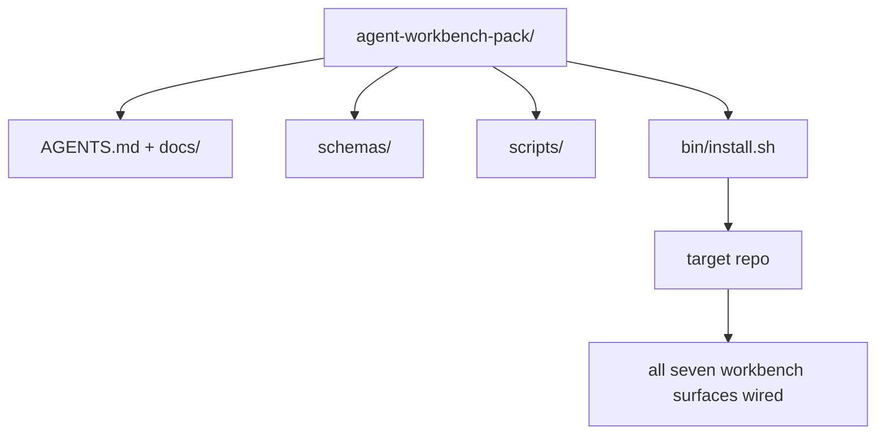

# Capstone:交付一个可复用代理工作板包

> Bu mini-track, her repo paketine yerleştirilebilir.`cp -r`Sonra ertesi sabah da bir ajanı çalıştıralım. Bu, dersimizin gerçek bir ürünü.

**类型：**Yapım
**语言：**Python (stdlib)
**前置要求：**14 · 31 · 14 · 41 aşamaları
**时间：**~ 75 dakika

## Öğrenme hedefi

- Yedi işleme masası yüzeyini doğrudan yerleştirilebilir bir katalog olarak toplayın.
- Fixed schema、script 和 template, let new repo  get a known available baseline──
- 添加一个安装脚本,用等方式放置这个包──
- Hangi içerik paket içinde kalır, hangi içerik dışarıda kalır, karar vererek, her birinin kendi görüşünü belirler.

## 问题

Bir çalışma tabanı Google Dokümanında var, sohbet tarihi ve üç sadece bulanık olarak hatırlanan senaryoda, bir çalışma tabanı her ay yeniden inşa edilir. Çözüm bir versiyon paketine sahiptir: bir repo veya bir katalog, içinde yüzey, şema, senaryo ve bir bir bir emir vardır.

Bu ders bitince, disket üzerinde teslimat yapacaksın.`outputs/agent-workbench-pack/`Ve bir de onu istediğin repoya koyabilirsin.`bin/install.sh`- Evet.

## 概念



### Paket düzenlemesi

```
outputs/agent-workbench-pack/
├── AGENTS.md
├── docs/
│   ├── agent-rules.md
│   ├── reliability-policy.md
│   ├── handoff-protocol.md
│   └── reviewer-rubric.md
├── schemas/
│   ├── agent_state.schema.json
│   ├── task_board.schema.json
│   └── scope_contract.schema.json
├── scripts/
│   ├── init_agent.py
│   ├── run_with_feedback.py
│   ├── verify_agent.py
│   └── generate_handoff.py
├── bin/
│   └── install.sh
└── README.md
```

### Ne bırakıyorsun, ne bırakıyorsun?

留下:

- Yüzey şeması... Bunlar kontrat.
- Yukarıdaki dört senaryo...
- Dört bölüm. Bunlar kural ve kural.

Dışarıda:

- 项目特定任务──任务属于目标 repo的董事会,不属于包──
- 供应商 SDK 调用──这个包与框架无关──
- Bu paket, takımın yanında değil, yanında yerleştirilmiştir.

### Kurulucu

Bir kısaca.`bin/install.sh`(Yada `bin/install.py`):

1. Hiç .`--force`时, 拒绝覆盖安装到已有包上.
2. Bu paketleri hedef repo'ya geri yükleyeceğim.
3. Eğer varsa`.github/workflows/`,                                                                                                                                                                                                                                                               
4. 打印后续步骤:填写板、设置接受命令、运行 init脚本──

### 版本管理

Bu paket bir taneyle beraber.`VERSION`文件──需要迁移的 schema bump 和脚本 变更会出现重大突破──仅 doc 的变更会出现突破补丁──目标 repo 的 `agent_state.json`Başlangıçta kayıtlı olan paket versiyonuna karşı.


```figure
wb-pack-install
```

## Yapın onu.

`code/main.py`Bu dersin yanında bir paket toplayacağım.`outputs/agent-workbench-pack/`Bu mini-track'i, ön planda bulunan schema ve script'i ve yazmış olduğunuz dokümanı bir parça olarak kullanıyorum.

- Yapma .

```
python3 code/main.py
```

Bu yazı, kopyalanıp sabitlenmiş yüzeyde, README'ye yazıp, paket ağacını basıp sıfırdan çıkıyor.

## Gerçek üretim modüsü

Bir paket sadece çatalın geçebilmesi ve iyi olmayan akıntılı bir şekilde değerlidir.

**`VERSION` 是 contract，不是 marketing。**Büyük bir çarpma  devlet göçü gerekir。 Küçük çarpma  tekrar çalıştırmak gerekir kontrolcü。 Yapıştırma çarpması sadece kullanılır。 Kurulucu Her zaman yüklemek için `.workbench-version`写入目标 repo; eğer hedeflerin kilitlenmesi ve paketlenmesi `VERSION`İttifak`lint_pack.py`Bu yüzden teslimatını reddetti.`npm`- Evet.`Cargo`和 `pyproject.toml`10 yıl boyunca bu kuralları değiştirmek için bir ajanın elinde.

**跨工具分发的单一来源。**Nx           `nx ai-setup`, tek bir yapılandırma    `AGENTS.md`- Evet.`CLAUDE.md`- Evet.`.cursor/rules/`- Evet.`.github/copilot-instructions.md`Bu paket de bunu yapmalı; kurutma 输出 symlink(`ln -s AGENTS.md CLAUDE.md`Bu paket, başarısızlık modudur.

**`uninstall.sh` 会在存在非平凡 state 时拒绝执行。**Bu paket kaldırılamıyor .`agent_state.json`- Evet.`task_board.json`Ya da`outputs/`❖ Uinstaller 会削除 schema、script、doc 和 `AGENTS.md`(带 `--keep-agents-md`Seçmeyi reddet), ve eğer devlet dosyası herhangi bir gönderilmemiş değişiklik varsa,就拒绝继续──State 属于用户;pack 并不拥有它──

**Skill-as-publishable。SkillKit-style 分发。**Bu paket SkillKit yeteneği olarak 交付:`skillkit install agent-workbench-pack`Bu, bir tek kaynaktan 32 AI ajanına kadar yerleştirilmiştir.

## Kullan

Paket üç yerde teslimat:

- **作为一个你放进 repo 的目录。** `cp -r outputs/agent-workbench-pack /path/to/repo`- Evet.
- **作为一个公开 template repo。**Kork ve özelleştir,并用 `VERSION`- Kontrol et.
- **作为一个 SkillKit skill。**Bir emir ver, bir emir ver.

Paket bir tarif. Her kurulum bir servis.

## - Söyle.

`outputs/skill-workbench-pack.md`Programlar için bir paket oluşturulur: kurallar, ekip tarihinin daha netleşmesi, küresel kapsam, repo ile uyumlu bir boyut, rubrik boyut, bir alanın belirli bir yöntemi genişletmesi.

## 练习

1. Bu konuda bir seçim yapabilmek için hangi beşinci belgeye yükseltilmesi gerektiğini belirleyin.
2. Python'da yeniden yazma yükleyici,并添加 `--dry-run`Bayrak, ergonomi ile bash karşılaştırıldığında.
3. Bir ekle.`bin/uninstall.sh`...güvenli bir paket taşımak ve devlet dosyasına girmek için.
4. Bir ekle.`lint_pack.py`, paketleme        `VERSION`时失败──把它插入包──自备备用的CI──
5. 手工作業台 移動到本包のランブに書き込み― hangi işlemler zamanını en aza indirmek için yapılabilir?

## 关键术语

| 术语 | 人们常说 | 它实际含义 |
|------|----------------|------------------------|
| Workbench pack | “starter kit” | 一个带版本的目录，携带全部七个 surface |
| Installer | “Setup script” | 以幂等方式放置 pack 的 `bin/install.sh` |
| Pack version | “VERSION” | schema/script 变更使用 major bump，仅 doc 变更使用 patch |
| Drop-in pack | “cp -r and go” | Pack 在第一天无需按 repo 定制即可工作 |
| Forkable template | “GitHub template” | GitHub 的 “Use this template” 可以从中 clone 的公开 repo |

## 延伸阅读

- 14 · 31 ~ 14 · 41  Bu paket 打包的每一面
- [SkillKit](https://github.com/rohitg00/skillkit)Bu yeteneği 32 AI ajanında yerleştir .
- [Nx Blog, Teach Your AI Agent How to Work in a Monorepo](https://nx.dev/blog/nx-ai-agent-skills) 跨六种工具的单一来源发电机
- [agents.md — the open spec](https://agents.md/)Paketin yönlendiricisi  İçeriğini gerçekleştirmek zorundadır
- [HKUDS/OpenHarness](https://github.com/HKUDS/OpenHarness) paket eşdeğerliğinin referans gerçekleşmesi
- [andrewgarst/agentic_harness](https://github.com/andrewgarst/agentic_harness) 带 eval suite' ın Redis desteklenen 参考实现
- [Augment Code, A good AGENTS.md is a model upgrade](https://www.augmentcode.com/blog/how-to-write-good-agents-dot-md-files) paket dokı 
- [Anthropic, Effective harnesses for long-running agents](https://www.anthropic.com/engineering/effective-harnesses-for-long-running-agents)
- [Anthropic, Harness design for long-running application development](https://www.anthropic.com/engineering/harness-design-long-running-apps)
- Fase 14 · 30  消费 消费 消费 消费 消费 消费 消费 消费 消费 消费 消费 消费 消费 消费 消费 消费 消费 消费 消费 消费 消费 消费 消费 消费 消费 消费 消费 消费 消费 消费 消费 消费 消费 消费 消费 消费 消费 消费 消费 消费 消费 消费 消费 消费 消费 消费 消费 消费 消费 消费 消费 消费 消费 消费 消费 消费 消费 消费 消费 消费 消费 消费 消费 消费 消费 消费 消费 消费 消费 消费 消费 消费 消费 消费 消费 消费 消费 消费 消费 消费 消费 消费 消费 消费 消费 消费 消 消 消 消 消 消 消 消 消 消 消 消 消 消 消 消 消 消 消 消 消 消 消 消 消 消 消 消 消 消 消 消 消 消 消 消 消 消 消 消 消 消 消 消 消 消 消 消 消 消 消 消 消 消 消 消 消 消 消 消 消 消 消 消 消 消 消 消 消 消 消 消 消 消 消 消 消 消 消 消 消 消 消 消 消 消 消 消 消 消 消 消 消 消 消 消 消 消 消 消 消 消 消 消 消 消 消 消 消 消 消 消 消 消 消 消 消 消 消 消 消 消 
- Fase 14 · 41  Bu paket önce/sonra referans değerinin geliştirilmesi gerekiyor
