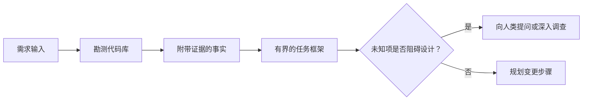

# Bu görevler için bir görev belirlenmiş.

> 编码智能体 (Coding Agent) 极其快速实现一个清晰的任务――它也极其快速实现一个模糊的任务―― ikisi de tam olarak aynı hızda, ancak maliyetleri çok farklıdır――

**Type:** Learn + Build
**Languages:** Python (stdlib)
**Prerequisites:** Phase 14 第 31 课与第 36 课
**Time:** ~60 分钟

## Öğrenme hedefi

- Kod değiştirmeden önce, orijinal ihtiyaçlar açık bir sınırlı görev çerçevesine dönüştürülür.
- Kod kutuunun objektif gerçeklerini ve temel varsayımları, karar verme sorunlarını açık bir şekilde bırakmak.
- 明确定义 izin değiştirme yolları, dokunmayı yasaklama yolları ve onaylama kanıtları.
- 判断何时代码勘测(Recognition) yeterli, resmi olarak iş başlatabilir.

## 代价高昂的失败

                                                                                                                                                                                                                                                              

Bu boşlukları doldurmak için çok güçlü bir yetenekli akıllı bir vücut kullanıyor. Bu en tehlikeli durumdur: kodunu gerçekleştirmek mümkün olabilir, ancak tüm sistemle aynı şekilde uyumludur.

Bu nedenle, kodlama akıllı vücudunun işinin ilk birimi kesinlikle doğrudan kod değiştirmek değil, kod kütlesinin gerçek kanıtları tarafından desteklenen bir görev çerçevesini oluşturmak.

## 任务框架(Task Frame)

Bir pratik görev çerçevesinde altı temel unsur bulunur:

| 字段 | 核心问题 |
|---|---|
| 目标（Goal） | 必须改变哪些可观测的行为？ |
| 代码库事实（Repository facts） | 你在代码、测试、配置或历史提交中验证了什么？ |
| 允许修改路径（Allowed paths） | 变更允许落在哪些位置？ |
| 禁止触碰路径（Forbidden paths） | 哪些文件与目录必须保持原样？ |
| 验收证据（Acceptance evidence） | 哪些具体命令或观测现象能证明目标已达成？ |
| 未知项（Unknowns） | 哪些决策仍需补充证据或依赖人类判断？ |

Gerçekler, kesin bir belge ile birlikte olmalıdır. Bu gerçekler, test kullanımı durumunu veya işleme işlevini belirten bir durum değil.



## 勘测旨在寻找束

Tüm kod defterini okumaya çalışmayın. Bu değişimlerin çeşitli sınırları üzerinde bir bağ oluşturulabilecek bir şey aramalısınız.

1. Geçmişte yapılan davranışların göstergesi ve kullanımı:
2. En yakın test kullanımı var.
3. 公共契约或序列化后的数据结构──
4. Bu yolun yönetimi altında olan projeler ve talimatlar
5. 构建与验证命令──
6. Daha önce yapılan benzer değişiklikler,

Planlı kararların her birinin objektif kanıtları varsa, belirlenmiş yetkili kararlar verildiğinde veya bilinmeyen kararlar olarak sıralandığında, araştırmalar durdurulabilir.

## Bilinmeyen İşler

Bilinmeyen konular kontrol edilemez bilgi boşluğudur; deneysiz varsayımlar ise bu boşluğu kontrol etmemiş bir varsayımdır.

Her bilinmeyen bölümünü:

- **可探查的（Discoverable）：**Kodu kitlesinin kendisi veya işletimindeki sistemler cevap verebilir.
- **可自决的（Decidable）：**任务契约 任务契约 任务契约 任务契约 任务契约 任务契约 任务契约 任务契约 任务契约 任务契约 任务契约 任务契约 任务契约 任务契约 任务契约 任务契约 任务契约 任务契约 任务契约 任务契约 任务契约 任务契约 任务契约 任务契约 任务契约 任务契约 任务契约 任务契约 任务契约 任务契约 任务契约 任务契约 任务契约 任务契约 任务契约 任务契约 任务契约 任务契约 任务契约 任务契约 智能体 智能体 智能体 智能体 智能体 智能体 智能体 智能体 智能体 智能体 智能体 智能体 智能体 智能体 智能体 智能体 智能体 智能体 智能体 智能体 智能体 智能体 智能体 智能体 智能体 智能体 智能体 智能体 智能体 智能体 智能体 智能 智能 智能 智能 智能 智能 智能 智能 智能 智能 智能 智能 智能 智能 智能 智能 智能 智能 智能 智能 智能 智能 智能 智能 智能 智能 智能 智能 智能 智能 智能 智能 智能 智能 智能 智 智 智 智 智 智 智 智 智 智 智 智 智 智 智 智 智 智 智 智 智 智 智 智 智 智 能 智 智 智 智 智 智 智 智 智 智 智 智 智 智 智 智 智 智 智 智 智 智 智 智 智 智 智 智 智 智 智 智 智 
- **需人类判断的（Human）：**Bu seçenek ürün davranışını, maliyetini, sistem riskini veya dış uyumluluğunu değiştirecektir.
- **延后处理的（Deferred）：**Bu seçim, mevcut parçacıkların kapsamından çok daha fazla, amacına uygun olmayanlara aittir.

Zeki bir vücut, araştırılabilir ve yetkili bir şekilde karar verme yetkisi verilen bilinmeyen konularda kendiliğinden işlem yapmalıdır; ancak insan yargılarına ihtiyaç duyulan bilinmeyen konularda kararların kodlara sabitlenmeden önce aktif olarak durdurulması ve onaylanması gerekir.

## 实现之前先定验收标准

Yapılan değişiklikleri yazmadan önce, önce tamamlanma kanıtını yazın.

- Birim test veya birleştirme test emri;
- Bir seçilen görüntüleme noktası ve beklenen durumun sonuna kadar tarayıcı işletim süreci;
- Bir ağ talebi ve tam olarak uyumlu bir cevap anlaşması;
- Bir belirli değerle ilgili performans ölçüsüne ulaşmak;
- Bir onay yok ilgili dosyaların değiştirildiğini kontrol etmektedir.

 test pass 并非有效证明方案──必须明确确定具有裁决权的试用例及其证明的主张──

## Yapın onu.

Bu ders deneyimi bir tane yaratır.`TaskFrame`Bu, bir kişinin, sınırı ve kanıtı değerlendirmesinin, çıkarımının ve çıkışının geçerliliğini gösterir.`outputs/task-frame.md`- Evet.

Şu anki dersler dizisi:

```bash
python3 code/main.py
python3 -m unittest discover code/tests -v
```

尝试通过四种方式故意破坏示例:删除目标、删除事实凭证、制造允许路径与禁止路径的重叠,以及删除验收命令──校验器应针对不同原因分别拒绝这些任务框架──

## Haklılık Kodak Kutusu

Bu yüzden, bu konuda bir şey yapmamalıyız.

1. Amaçları belirli bir dosyanın değiştirilmesi yerine, belirli bir davranış için ifade etmek.
2. Kayıtlı iki üç yazı, gerçeklerle birlikte.
3. 指定最小的允许修改路径集合──
4. 明确写出禁止触碰的负空间 (Negative space)
5. 编写能够宣告任务闭环的验证命令或观测手段──
6. 列出你目前未查清且无权决定的决策项──

Görev çerçevesinin bir ekranın içinde tam olarak gösterilmesi gerekir. Eğer bir ekranın ötesinde ise, görevin bağımsız olarak doğrulanabilecek birçok değişimi içerebileceğini belirtmek için ayrıştırılmalıdır.

## 练习

1. Bir kod defterindeki gerçek hatalar bir görev çerçevesini belirlerken, tüm süreç herhangi bir özel çözüm önermez.
2. 找出任务框架中的一条实际上只是主观假设的主张,用客观证据替换它──
3. Bu nedenle, insan kararlarının bilinmeyen yönleri tarafından değiştirilmesi gerekir.
4. Bir genişlikten fazla değişikliğe izin verilen yolları en küçük güvenlik yolları topluluğuna ayırmak.
5. On accept certificate in addition to an item for defence over boundary modification of scope diploma (Scope receipt) (Scope receipt)

## 延伸阅读

- [Nuseibeh and Easterbrook, Requirements Engineering: A Roadmap](https://www.cs.toronto.edu/~sme/papers/2000/ICSE2000.pdf)Bu nedenle, bu programın gerçek dünya hedeflerine ve sürekli gelişen koşullara dayalı olarak nasıl gerçekleştirileceğini araştırmak.
- [Yang et al., SWE-agent: Agent-Computer Interfaces Enable Automated Software Engineering](https://arxiv.org/abs/2405.15793): kodlama akıllı vücut çevresindeki bağlama ve bağlama sisteminin çalışma sonuçlarına belirleyici bir etkisi olduğunu kanıtladı.

## 交付物与沉

Lütfen iyice koruyun .`outputs/task-frame.md`Bu, bir sonraki bölümün doğrudan girişidir ve bu çerçeve, bir kanıtlı bir uygulama planına dönüştürülecek.
