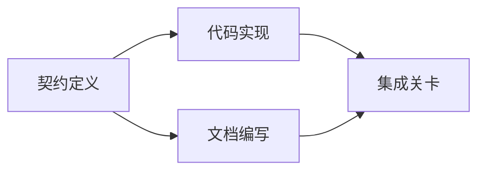

# Deliliğine dayalı bir yürütme planı oluşturmak

> Plan kesinlikle daha güzel bir bekleme listesi değildir. Bu bir bağımlılık çizgisi.

**Type:** Learn + Build
**Languages:** Python (stdlib)
**Prerequisites:** Phase 14 第 43 课
**Time:** ~65 分钟

## Öğrenme hedefi

- Görev çerçevesini objektif kanıt ve doğrulama kanıtları ile birlikte çalışma projelerine dönüştürmek.
- Bu, bir dizi yapısal adım yerine bir ilişki çizgisine bağlı olarak gerçekleştirilecek.
- Değiştirilmeden önce verifiye edilmeyen faktörlere ve döngülere bağlılıklara
- Hangi adımları uygulayabileceğimizi ve hangi adımları sıradan beklemek zorunda olduğumuzu ayırt et.

## Neden akıllı bedenin planları her zaman başarısız olur ?

脆弱的计划只是以后的时态来将用户需求重复复述:

1. 更新API♪
2. 添加测试──
3. Yeni bir makale.

Bu liste, hangi kod gerçeklerini bulduğunu, neden bu dosyaların değiştirilmesi doğru olduğunu, hangi anlaşmanın öncelikli olarak değiştirilmesi gerektiğini ve hangi işlerin başlatılabileceğini belirtmez.

Bir sağlam plan ve her bir çalışma projesi için beş sözleşme yapıldı:

| 承诺要素 | 核心作用 |
|---|---|
| 标识符（Identifier） | 用于依赖声明与会话交接（Handoff）的稳定引用 |
| 变更内容（Change） | 最小颗粒度的行为或契约改动 |
| 事实证据（Evidence） | 证明该变更合情合理且必要据实的代码库证据 |
| 前置依赖（Dependencies） | 必须率先完成并成立的前置工作项 |
| 验收证明（Proof） | 能够确凿宣告该工作项闭环的检查手段 |

## Bu anlaşmayı gerçekleştirmeden önce planlama anlaşması yapılması gerekiyor.

Çok farklı kod yüzeyi aynı davranışa bağlı olduğunda, davranış anlaşmasını öncelikli olarak tanımlamak gerekir. Böylece test, gerçekleştirme, belge ve ortak başarılar, birbirlerine uyumsuz dört versiyon oluşturmak yerine aynı anlaşmayı paylaşabilir.



Bu değişiklik, güvenlik ve gelişme olasılığını açıkça ortaya koyuyor: Sözleşme sabitlenmesinden sonra, kod uygulaması ve belge yazımı birlikte ilerleyebilir, ancak son birleştirme aşaması ikisinin de hazır olmasını bekliyor.

## Gerçek kanıtların değişim planı yapma yeteneğine sahip olması gerekir.

Kode kitlesinin gerçekte hiçbir şeyi yok, bu da çalışma planlarını gerçekten etkileyebilmelidir:

- Bu nedenle, mevcut yardımcı fonksiyonları bulup, orijinal planın yeni inşaatının çekim aşamasını kaldırmak için kullanılır.
- 兼容性 testlerin varlığı, zorunlu bir planda bir adım daha fazla veri taşımacılığı artırılması gerekir.
- 部署環境の约束,将模式(Schema) 变更分割中〜
- 公共响应类型 biçimi, kod uygulamasını ve belge yazmalarının öncesini değiştirmiştir.

Eğer bir delil planınızı değiştiremezse, bu kararın geçerli bir kanıtı olmayabilir.

## 面向会话中断而设计

编码智能体的会话往往会无预警中断──一个具有可恢复性 (bkz. "bkz. "bkz. "bkz. "bkz. "bkz. "bkz. "bkz. "bkz. "bkz. "bkz. "bkz. "bkz. "bkz. "bkz. "bkz. "bkz. "bkz. "bkz. "bkz. "bkz. "bkz. "bkz. "bkz. "bkz. "bkz. "bkz. "bkz". "bkz. "bkz". "bkz". "bkz". "bkz". "bkz". "bkz". "bkz". "bkz". "bkz". "bkz". "bkz". "bkz". "bkz". "bkz". "bkz". "bkz". "bkz". "bkz". "bkz". "bkz". "bkz". "bkz" "bkz" "bkz" "bkz" "bkz" "bkz" "bkz: "bkz: "bkz: "bkz: "bkz: "bkz: "bkz: "bkz: "bkz: "tkz: "tkz: "tkz: "tkz: "h" y" y" ç ç ç ç ç ç ç ç ç ç ç ç ç ç ç ç ç ç ç ç ç ç ç ç ç ç ç ç ç ç ç ç ç ç ç ç ç ç ç ç ç ç ç ç ç ç ç ç ç ç ç ç ç ç ç ç ç ç ç ç ç ç ç ç ç ç ç ç ç ç ç ç ç ç ç ç ç ç ç ç ç ç ç ç ç ç ç ç ç ç ç ç ç ç ç ç ç ç ç ç ç ç ç ç ç ç ç ç ç ç ç ç ç ç ç ç ç ç ç ç ç ç ç ç ç ç ç ç ç ç ç ç ç ç ç ç ç ç ç ç ç ç ç ç ç ç ç ç ç ç ç ç ç ç ç ç ç ç ç ç ç ç ç ç ç ç ç ç ç ç ç ç ç ç ç ç ç ç ç ç ç ç ç ç ç ç ç ç ç ç ç ç ç ç ç ç ç ç ç ç ç ç ç ç

- 哪项工作已完成;
- 哪项验收证明已经走通;
- 哪些产物文件已修改;
- 哪些依赖项目已解除阻塞;
- Sonraki işlemi ne olacak?

Çalışma alanı diskinde çalışma sonuçları ile birlikte planlama ve çalışma sonuçlarını sadece sohbet penceresindeki çizgi çerçeveye yerleştirmeyin.

## 计划有效性校验

Resmi olarak yürütülmeden önce, aşağıdaki durumlar ortaya çıkarsa doğrudan reddedilmelidir:

- 存在重复工作项标识符;
- 某工作项缺乏事实证支;
- 某工作项缺乏验证;
- Var olmayan bir iş için;
- Çevrelik bir döngü vardır;
- İlgili belirsizlikler ortadan kaldırılmadan önce, ilk geri dönüşü olmayan operasyon düzenlendi.

Önceki beş kontrol, otomatik olarak işlemle tamamlanabilir; sonuncusu, incelemede belirgin olarak vurgulanmalıdır.

## Yapın onu.

`code/main.py`建模了工作项,校验其证凭证,通过拓排序计算执行波次(Execution Waves),并将结果写入 `outputs/evidence-plan.json`- Evet.

运行命令:

```bash
python3 code/main.py
python3 -m unittest discover code/tests -v
```

Bu örnek üç işlemci oluşur: öncelikle bir anlaşma tanımlanır; sonra bir kodun gerçekleşmesi ve bir dosya yazılması ve yürütülmesidir; son olarak birleştirilmiş bir bağlantı vardır.

## 配合编码智能体使用

Zeki bir vücut için kod dosyasını değiştirmek için izin vermeden önce, önce bu planı çıkarmasını istesin.

1. Her yol ve davranışın belirli bir kod kütlesinin olup olmadığını belirten bir sertifika servisi vardır.
2. Her bir çalışma projesinin bir tek kesin bir tamamlanma kanıtı olup olmadığını göstermek için.
3. Bu, işlerin pahalı veya geri dönüşü olmayan olup olmayacağı konusunda belirsizliklerin ortadan kaldırılmasından sonra ertelenmeye bağlıdır.

审核, bir cümle boşlukta değil, spesifik bir plandır.

## 练习

1. Açıkça insan onayına ihtiyaç duyulan bir veri tabanı taşıma projesi eklenir.
2. Bir döngü oluşturmak, arkasında saklanan ürün ayrımlarını açıklamak.
3. 拆分一个包含两条不同证明命令的工作项──
4. İkinci dalga boyunca çalışabilmek için bir tane ekleyin ve mevcut olan herhangi bir iş parçasıyla temas etmeyin.
5. Planı 染 için Markdown biçiminde gösterim, aynı zamanda JSON 作为单一事实来源.

## 延伸阅读

- [Nuseibeh and Easterbrook, Requirements Engineering: A Roadmap](https://www.cs.toronto.edu/~sme/papers/2000/ICSE2000.pdf): hedefleri, kuralları, anlaşma ve gelişme arasındaki generasyon ilişkileri araştırmak
- [Barry Boehm, A Spiral Model of Software Development and Enhancement](https://dl.acm.org/doi/10.1145/12944.12948)Bu nedenle, bu süreçte, gelişme ve gelişme için gereken düzenlemeyi nasıl yapılması gerektiğini açıklamak için,

## 交付物与沉

Lütfen iyice koruyun .`outputs/evidence-plan.json`Bu, bir sonraki dersinde görev verilmiş bir anlaşmaya dayanacak.
