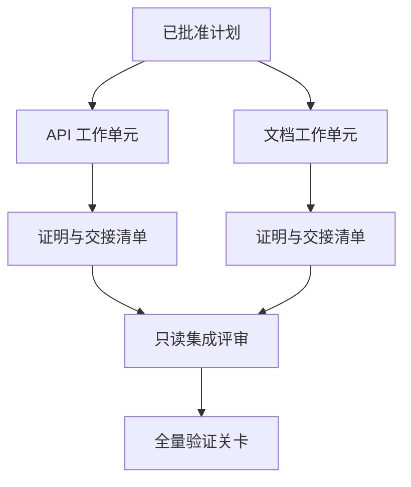

# 带隔离与合并契约的代理委托

> Ve akıllı bedenler sadece gerçek bir şekilde birbirinden bağımsız olarak çalışırken fiziksel zaman tasarruf edebilirler. Aksi halde, onlar sadece net bir görevi daha yüksek koordine maliyetlerine, daha hızlı başarısızlık hızına dönüştürürler.

**Type:** Learn + Build
**Languages:** Python (stdlib)
**Prerequisites:** Phase 14 第 39 课与第 44 课
**Time:** ~70 分钟

## Öğrenme hedefi

- Gerçek bağımsızlık karar vermesi görevi verilmiş ve birlikte yürütülüyor mu?
- Bu nedenle, işçi, işinin tamamlanması için bir işçiye, işinin tamamlanması için bir işçiye, işinin tamamlanması için bir işçiye, işinin tamamlanması için bir işçiye, işinin tamamlanması için bir işçiye, işinin tamamlanması için bir işçiye, işinin tamamlanması için bir işçiye, işinin tamamlanması için bir işçiye, işinin tamamlanması için bir işçiye, işinin tamamlanması için bir işçiye, işinin tamamlanması için bir işçiye, işinin tamamlanması için bir işçiye, işinin tamamlanması için bir işçiye, işinin tamamlanması için bir işçiye, işçiye, işçiye, işçiye, işçiye, işçiye, işçiye, işçiye, işçiye, işçiye, işçiye, işçiye, işçiye, işçiye, işçiye, işçiye, işçiye, işçiye, işçiye, işçiye, işçiye, işçiye, işçiye, işçiye, işçiye, işçiye, işçiye, işçiye, işçiye, işçiye, işçiye, işçiye, işçiye, işçiye, işçiye, işçiye, işçiye, işçiye, işçiye, işçiye, işçiye, işçiye, işçiye, işçiye, işçiye, işçiye, işçiye, işçiye, işçiye, işçiye, işçiye, işçiye, işçiye, işçiye, işçiye, işçiye, işçiye, işçiye, işçiye, işçiye, işçiye, işçiye, işçiye, işçiye, işçiye, işçiye, işçiye, işçiye, işçiye, işçiye, işçiye, işçiye, işçiye, işçiye, işçiye, işçiye, işçiye, işçiye, işçiye, işçiye, işçiye, işçiye, işçiye, işçiye, işçiye, işçiye, işçiye, işçiye, işçiye, işçiye, işçiye, işçiye,
- 基于依赖关系计算安全的执行波次 (Bununla ilgili olarak, bu işlemlerin gerçekleşmesi için bir süre önce yapılmıştı)
- 设计合并契约 (Merge Agreement) Güvenli bir şekilde bir çok akıllı iş ürünü birleştirmek için.

## İşlemsel inceleme standartları

Sadece daha fazla akıllı vücut olduğu için kör olarak görev vermeye çalışmayın. Sadece aşağıdaki şartlardan en az biri yerine geldiğinde, görev vermenin mantıklı olması gerekir:

-  iki araştırma bağımsız olarak farklı bilinmeyen sorulara cevap verebilir;
-  iki kodun birbirinden uzanan dosya yolları ve anlaşma bağlantılarını gerçekleştirmek;
- 评审智能体(Reviewer) değişmeyen ürünlerin şartıyla bağımsız olarak kontrol yapabilmek;
- Daha uzun süren dış kontroller, yerel çalışmaların ilerlemesiyle birlikte, arka planda da yapılabilir.

Bir çok zeki vücut aynı dosyayı değiştirmek zorunda kaldığında, aynı çözülmemiş kararlara veya aynı değişen değişen ortamlara bağlıyken, bir dizi uygulamaya devam etmeleri gerekir.

## 工作单元就是一份契约 İş birliği bir anlaşma

Her görevli iş birimi için açık bir düzenleme gerekir:

| 字段 | 含义 |
|---|---|
| 目标（Goal） | 单一可观测的结果 |
| 负责人（Owner） | 单一负责执行的工作智能体 |
| 路径（Paths） | 排他的写入所有权 |
| 前置依赖（Dependencies） | 启动前必须已完工的前置单元 |
| 证明（Proof） | 返回给集成者的确凿验证证据 |
| 交接清单（Handoff） | 已修改的文件、已做出的决策以及残留风险 |

 İşlem sonrası                                                                                                                                                                                                                                                            `app/accounts.py`Bu işlemlerin başarısı için, başvuruda bulunulan ve başvuruda bulunulan iş birimlerinin başarısı için yapılan sınavlar, başvuruda bulunmak ve başvuruda bulunmak için yapılan sınavlar, başvuruda bulunmak üzere yapılan sınavlar ve başvuruda bulunmak için yapılan sınavlar, başvuruda bulunmak üzere yapılan sınavlar ve başvuruda bulunmak için yapılan sınavlar, başvuruda bulunmak üzere yapılan sınavlar ve başvı gerçekleştirmek için yapılan sınavlar.

## 隔離的三层体系

1. **文件系统隔离（Filesystem isolation）：**独立工作树 (Yapalı iş ağaçları) veya 沙箱,
2. **所有权隔离（Ownership isolation）：**嚴嚴的契约限制, iki akıllı bedenin aynı yoldan akılla değiştirilmesini önlemek.
3. **状态隔离（State isolation）：**独立日志与输出目录, bir akıllı bedenin diğer akıllı bedenin yükünü örtmesini önlemek için

文件系统隔离无法解决设计所有权问题―― iki干干净净的工作树仍然可能产出彼此冲突的架构设计――合并契约必须在工作开始之前就彻底了解共享接口――



## 集成者不负责重构代码

集成者(Integrator) nın sorumlulukları şunlardır:

1.  her iletişimin sonuçlarının, dağıtım alanına sıkıca bağlı olduğunu belirlemek;
2. 认真审查验证证明的输出, sadece kör inançlı işçi akıllı bedenin kendi yazdığı özet değil;
3. 依赖关系的时序依次合并改动;
4. 运行覆盖跨单元的全量验证关卡;
5.  दृढ़ olarak gizli olan herhangi bir alanın yayılmasını reddetmek;
6. Bu nedenle, bu konuyla ilgili bir görüşme yapılması gerekmektedir.

Eğer bir entegrasyon aşamasında bir işçi akıllı vücudunun kod ürünlerinin büyük kısmını yeniden yazmak gerekiyorsa, ilk görev çözümü kendisinin yanlış olduğunu gösterir.

## İnsan ve akıllı bedenin rolü

Görev vermesi, insan yargı yetkisini bırakmak anlamına gelmez. İnsan, sistem dış davranışlarını, risk seviyesini, güvenlik yetkisini veya geri dönüşü olmayan maliyetleri getirecek temel kararları güçlü bir şekilde ele alır. Akıllı bedenler, sınırları geniş çapta araştırmalar, uygulamalar, doğrulama ve incelemeler yapma sorumluluğunda bulunmaktadır.

İşte bu.**校准型自主（Calibrated Autonomy）**Sistemler, kanıtların tam ve kolayca kaydedilmesi gereken yerlerde akıllı vücutlara yüksek bir özgürlük verirken, son derece ciddi bir anahtar noktada insan kontrol kartı oluşturmak zorunlu hale gelir.

## Yapın onu.

Bu ders için deney programı, yolların üst üste geçmesini, bağımlılıkların doğrulanmasını, hesaplama güvenliğinin uygulanma dalgalarını kontrol eder ve sonuçları dışarı çıkarır.`outputs/delegation-plan.json`- Evet.

运行命令:

```bash
python3 code/main.py
python3 -m unittest discover code/tests -v
```

尝试修改文档单元,让它拥有 `app/`% % % % % % % % % % % % % % % % % % % % % % % % % % % % % % % % % % % % % % % % % % % % % % % % % % % % % % % % % % % % % % % % % % % % % % % % % % % % % % % % % % % % % % % % % % % % % % % % % % % % % % % % % % % % % % % % % % % % % % % % % % % % % % % % % % % % % % % % % % % % % % % % % % % % % % % % % % % % % % % % % % % % % % % % % % % % % % % % % % % % % % % % % % % % % % % % % % % % % % % % % % % % % % % % % % % % % % % % % % % % % % % % % % % % % % % % % % % % % % % % % % % % % % % % % % % % % % % % % % % % % % % % % % % % % % % % % % % % % % % % % % % % % % % % % % % % % % % % % % % % % % % % % % % % % % % % % % % % % % % % % % % % % % % % % % % % % % % % % % % % % % % % % % % % % % % % % % % % % % % % % % % % % % % % % % % % % % % % % % % % % % % % % % % % % % % % % % % % % % % % % % % % % % % % % % % % % % % % % % % % % % % % % % % % % % % % % % % % % % % % % % % % % % % % % % % % % % % % % % % % % % % % % % % % % % % % % % % % % % % % % % % % % % % % % % % % % % % % % % % % % % % % % % % % % %

## 练习

1. Gerçek bir işletmeyi iki bağımsız iş birimi ve bir bütünleşen rolü olarak ayırmak.
2. birine bağımsız görünen fakat aslında  birleşmiş bir ortaklık ayrımcılık programını bulup, ortak gizli kararları açıkça belirtmek.
3. 增加一个只读的研究型智能体 (Bilişimci) ), ürünleri bir gerçek şablonı oluşturur.
4. 增加一个合并关卡(Merge Gate),对照所有工作单元契约检查最终修改的文件集合──
5. Çözüm: İş birimi tanımlanması: İş birimi tanımlanması: İş birimi tanımlanması: İş birimi tanımlanması: İş birimi tanımlanması: İş birimi tanımlanması: İş birimi tanımlanması: İş birimi tanımlanması: İş birimi tanımlanması: İş birimi tanımlanması: İş birimi tanımlanması: İş birimi tanımlanması: İş birimi tanımlanması: İş birimi tanımlanması: İş birimi tanımlanması: İş birimi tanımlanması: İş birimi tanımlaması: İş birimi tanımlaması: İş birimi tanımlaması: İş birimi tanımlaması: İş birimi tanımlaması: İş birimi tanımlaması: İş birimi tanımlaması: İş birimi tanımlamak

## 延伸阅读

- [Reid Smith, The Contract Net Protocol](https://doi.org/10.1109/TC.1980.1675516): dağıtılmış görev dağılımı ve sonuç汇报'nın erken biçimlendirilmiş klasik araştırması
- [Eric Horvitz, Principles of Mixed-Initiative User Interfaces](https://dl.acm.org/doi/10.1145/302979.303030)Bu konuyu ele almak için, bu konuyu ele almak için, bu konuyu ele almak için, bu konuyu ele almak için, bu konuyu ele almak için, bu konuyu ele almak için, bu konuyu ele almak için, bu konuyu ele almak için, bu konuyu ele almak için, bu konuyu ele almak için, bu konuyu ele almak için, bu konuyu ele almak için, bu konuyu ele almak için, bu konuyu ele almak için, bu konuyu ele almak için, bu konuyu ele almak için, bu konuyu ele almak için, bu konuyu ele almak için, bu konuyu ele almak için, bu konuyu ele almak için, bu konuyu ele almak için, bu konuyu eleştirmek için, bu konuyu eleştirmek için, bu konuyu eleştirmek için, bu konuyu eleştirmek için,

## 交付物与沉

Lütfen iyice koruyun .`outputs/delegation-plan.json` Bölünme programının neden güvenli olduğunu, her yolu kime ait olduğunu ve entegrasyonun hangi kanıtları kabul etmesi gerektiğini kaydeder.
