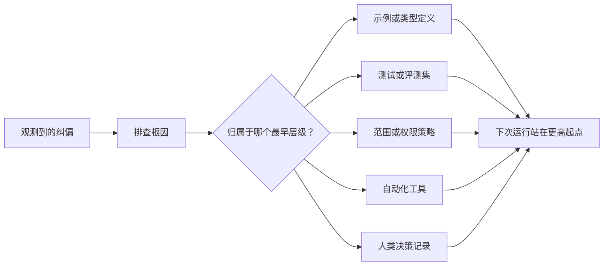

# Her ajanı sistem geliştirme için değiştirmek

> Sadece sohbet kayıtlarında kalmak sadece mevcut çalışmayı düzeltmek için geçerlidir. Test, sınırı stratejisi, örnek veya araç kontrol mekanizması üzerinde yoğunlaşmak, her sonraki çalışmayı daha iyi hale getirebilir.

**Type:** Learn + Build
**Languages:** Python (stdlib)
**Prerequisites:** Phase 14 第 37 至 41 课
**Time:** ~65 分钟

## Öğrenme hedefi

- Akıllı bedenlere yönelik geçici düzeltme ve dönüşüm uzun süreli sistem kontrol mekanizması olacaktır.
- Her kontrol mekanizması, sorunların tekrar oluşmasını önleyebilecek en erken seviyede yerleştirilmelidir.
- Dönüştürme için sabit parmaklık özellikleri kullanın.
- 及时退役 及时退役 及时退役 及时退役 及时退役 及时退役 及时退役 及时退役 及时退役 及时退役 及时退役 及时退役 及时退役 及时退役 及时退役 及时退役 及时退役 及时退役 及时退役 及时退役 及时退役 及时退役 及时退役 及时退役 及时退役 及时退役 及时退役 及时退役 及时退役 及时退役 及时退役 及时退役 及时退役 及时退役 及时退役 及时退役 及时退役 及时退役 及时退役 及时退役 及时退役 及时退役 及时退役 及时退役 及时退役 及时退役 及时退役 及时退役 及时退役 及时退役 及时退役 及时退役 及时退役 及时退役 及时退役 及时退役 及时退役 及时退役 及时退役 及时 及时退役 及时 及时 及时 及时 及时 及时 及时 及时 及时 及时 及时 及时 及时 及时 及时 及时 及时 及时 及时 及时 及时 及 及 及 及 及 及 及 及 及 及 及 及 及 及 及 及 及 及 及 及 及 及 及 及 及                                                                                              

## Düzgün bir kanıt .

Zeki bir organizmaya "o dosyayı düzenlemeyin" dediğinde, aslında şu gerçeği fark etmiş olursun: mevcut kapsam sınırları (Scope limit) yürütülebilir kısıtlamaların eksikliği. Bu çıkış biçimindeki hataları belirttiğinde, aslında standart örnekler veya otomatik testlerin eksik olduğunu fark etmiş olursun.

智能体的纠正偏见, iş sisteminin kendisinin hataları hakkında gözlemsel bir anlayış olarak görülmelidir, fakat yazma sırasında yapılan tek bir dilbilim hatası olarak görülmelidir.

## En erken geçerli seviyeye yükseltmek

 aşağıdaki kontrol önceliklerini takip edin:

| 频发故障类型 | 长效沉淀去处 |
|---|---|
| 错误计算结果或代码回归 | 自动化测试或评测集（Test / Evaluation） |
| 超范围越界或不安全操作 | 范围契约或权限策略（Scope / Permission Policy） |
| 重复出现的环境配置或命令错误 | 自动化脚本或专用工具（Automation / Tool） |
| 重复出现的输出格式错误 | 标准规范示例外加数据校验器（Canonical Example + Validator） |
| 模糊不清的本地工程惯例 | 附带具体场景检查的指令（Instruction + Scenario Check） |
| 产品层面的分歧与争议 | 人类决策记录（Human Decision Record） |

越早有效的控制机制成本越低── 越早有效的控制机制成本越低── 越早有效的控制机制成本越低── 越早有效的控制机制成本越低── 越早有效的控制机制成本越低── 越早有效的控制机制成本越低── 越早有效的控制机制成本越低── 越早有效的控制机制成本越低── 越早有效的控制机制成本越低── 越早有效的控制机制成本越低── 越早有效的控制机制成本越低── 越早有效的控制机制成本越低── 越早有效的控制机制的控制成本越低── 越早有效的控制机制的控制成本越低── 越低的控制成本越低── 越早有效的控制的控制成本越低── 越早的控制的控制成本越低于于于于于于于于于于于于于于于于于于于于于于于于于于于于于于于于于于于于于于于于于于于于于于于于于于于于于于于于于于于于于于于于于于于于于于于于于于于于于于于于于于于于于于于于于于于于于于于于于于于于于于于于于于于于于于于于于于于于于于于于于于于于于于于于于于于于于于于于于于于于于于于于于于于于于于于于于于于于于于于于于于于于于于于于于于于于于于于于于于于于于于于于于于于于于于于于于于于于于于于于于于于于于于于于于于于于于于于于于于于于于于于于于于于于于于于于于于于于于于于于于于于于于于于于于于于于于于于于于于于于于于于于于于于于于于于于于于于于于于于于于于于于于于于于于于于于于于于于于于于于于于于于于于于于于于于于于于于于于于于于于



## 反棘轮记录 (Ratchet Kaydı)

完整的记录应包含:

- 故障表象(Semptom);
- 根因分析(Kök nedeni);
- 造成的后果 (sonucun sonucunu);
- 重复出现次数 (Çıkış sayısı);
- Seçili kontrol mekanizması;
- Kontrol mekanizmasının doğrulama tarzı (verification);
- 责任人(Mülkiyet sahibi);
- 审查或退役日期 (Bazılama / Emeklilik tarihi)

Bu nedenle, bu durumun, sorunların tekrarlanma sıklığı veya olası sonuçların ciddiyetinin uzun süreli bakım karmaşıklığının makulluğunu arttırmak için yeterli olduğu için, sürekli kontrol mekanizması olarak yükseltilmesi gerekir.

## 区分根因与表象

 Akıllı vücut modifiye README sadece bir gösteri.

- 任务框架 allow to modify the entire code.
- Dosya dosyaları her zaman güvenli bir şekilde düzenlenebilir olarak kabul edilir.
- 执行计划将功能实现与文件编写捆绑在一起;
- 两个工作智能体存在重叠的文件所有权──

Farklı köklerden dolayı tamamen farklı kontrol araçları karşı karşıya. Eğer sadece mekanik olarak bir kopyalama yapma yasaklanması, bir sonraki kez benzer sorunun biraz değişik bir biçimde ortaya çıktığında, sistem yine başarısız olacaktır.

## Kontrol kuralları da aynı şekilde geri dönüyor.

Eski kontrol kuralları çatışmaya neden olur, aşağıdaki pencerede büyür ve eski sistem paketlerini pekiştirir.

- Alt kat yapı değişmiştir.
- Daha güçlü bir yürütülebilir kontrol mekanizması ortaya çıktı;
- Bu hata uzun süreli bir süre boyunca tekrarlanmamıştır.
- Bu kuralın oluşturduğu engeller ve çizikler, kendi kendini koruyan riskleri aşmıştır.

İnşaatın amacı en uzun talimat dosyalarını yazmak değil, en azını azaltan sistem mekanizmaları kullanarak kolay olmayan injiner yargılarını korumak.

## Yapın onu.

Bu ders deneysel programı, düzeltme yöntemi sınıflandırmak, kontrol mekanizması olarak yükseltmek, tekrarlama projelerinde parmak izi oluşturmak ve sonuçları yazmak için yapılacak.`outputs/feedback-ratchet.json`- Evet.

运行命令:

```bash
python3 code/main.py
python3 -m unittest discover code/tests -v
```

尝试输入两条表述不同但根源于相同的纠偏记录――, bunlar birleştirilmiş bir kontrol mekanizması haline gelene kadar, aynı zamanda yanlış birleştirilmemiş bir sorunla bağlantılı olmayan birleştirilmeye kadar, sürekli olarak optimize edilmektedir.

## 练习

1. Son bir editör toplantısı sırasında 5 düzeltme ve yanlışı seçerek, analiz ve onları gerçek aşamalara yerleştirmek için bir araya getirildi.
2. Bir yazı kuralını tekrar yapılandırmak için bir otomatik test.
3. 增加后果权重 (Büyük sonuç ağırlığı) değerlendirme, ciddi yüksek riskli başlama hatalarının da hemen düzenli kontrol altına alınmasını sağlar.
4. Bu süreçte, kontrol mekanizması için görevlilerin görevden çıkması ve görevden çıkması için gerekli düzenlemeler yapılır.
5. 审查, mevcut bir akıllı vücut talimatını kaldırmak ve daha güçlü bir kontrol mekanizması varlığını kanıtlamak için kullanılır.

## 延伸阅读

- [Basili, Caldiera, and Rombach, The Goal Question Metric Approach](https://www.cs.toronto.edu/~sme/CSC444F/handouts/GQM-paper.pdf)Yüksek sınıf hedeflerini sorun ve kullanılabilir ölçüm göstergesi olarak nasıl dönüştürüleceğini araştırmak.
- [Shinn et al., Reflexion](https://arxiv.org/abs/2303.11366)Bu nedenle, bu konularda, daha fazla bilgi almak için, daha fazla bilgi için lütfen yayına bakın.
- [Madaan et al., Self-Refine](https://arxiv.org/abs/2303.17651)Görev kapalı çevrede kendi kendine yapılan değişiklikler için uygulanmaktadır.

## 交付物与沉

Lütfen iyice koruyun .`outputs/feedback-ratchet.json`Bu, akıllı vücut yardımcı mühendisliği yolunun uzun ve son sonuçları ve gelecekte daha fazla gelişme için Workbench'in temel girişidir.
