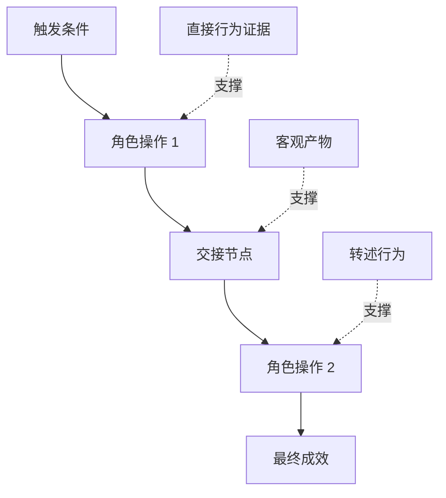

# 发掘人们真正执行的工作流

> Gerçek ihtiyaçlar asla eski gerçekler gibi oturmaz. Toplanmaya geldiğin toplantı odasında otururlar.

**Type:** Learn + Build
**Languages:** Python (stdlib)
**Prerequisites:** Phase 14 第 47 课
**Time:** ~70 分钟

## Öğrenme hedefi

- Bu, mevcut çalışmaların, kanıtların desteklenmesi için düzenli olarak yapılması gereken bir süreçtir.
-                                                                                                                                                                                                                                                               
- 定位流程中的摩擦阻力(Tırma) 交接节点(Handffs) 审批权限(Authority) 以及隐性状态(Hidden state) 💚
- ⇒ Önemli bir konunun açıkça görülebilirliği konusunda belirsiz kalmak, fakat kolayca doğrudan sertlik gereksinimlerine dönüştürülmek.

## Var olan sistemden çıkış

切勿一开始就问用户想要什么功能──你应该做的是回原现在究竟发生了什么──

针对工作流中的每一个步骤,记录下段:

| 字段 | 示例 |
|---|---|
| 执行角色（Actor） | 值班工程师 |
| 触发条件（Trigger） | 生产环境告警到达 |
| 具体操作（Action） | 打开告警详情，随后在监控看板中搜索 |
| 输入信息（Input） | 告警 Payload 与发布记录 |
| 产出结果（Output） | 疑似故障服务及责任人 |
| 摩擦阻力（Friction） | 在三个不同运维工具之间来回切换上下文 |
| 审批权限（Authority） | 事故指挥官批准执行写入操作 |
| 支撑证据（Evidence） | 屏幕录像、事故复盘日志、运维手册 |

Gerçek iş akışı ekranda görülen arayüzden daha geniş bir alandadır. Bekleme zamanı, kopyalama yapısı, çevrimiçi sohbet, onay süreci, hata geri kazanımı ve insanların alışık olduğu hatta dikkat etmedikleri küçük hareketler de dahiltir.

## Güçlü ve zayıf bir seviye olduğuna dair kanıtlar var .

建立简单的证据阶梯(Evidence Ladder):

1. **直接行为（Direct behavior）：**现场观测、系统调用追踪(Trace) 、屏幕录屏或系统事件日志──
2. **客观产物（Artifact）：**İşleme kayıtları, çalışmaları, denetim günlüğü, çalışmaları veya tamamlanmış sonuç belgeleri
3. **转述行为（Reported behavior）：**İnsanlar genellikle ne yaptıklarını anlatıyor.
4. **主观推断（Inference）：**团队推断大概会发生什么──

Bu dört bilgi kaynağı değerlidir, ancak sadece ilk ikisi mevcut gerçek davranışları doğrudan doğrulayabilir.



## 重点搜寻四大要素

- **摩擦阻力（Friction）：**Tekrarlı iş, gereksiz bekleme gecikmesi, veriyi tekrar kaydetme veya zorlu bir felçden kurtulma.
- **隐性状态（Hidden state）：**Sadece çalışanların zihninde kalır, anında iletişim sohbet kayıtları veya kişisel kişisel notlarda bilgi faktörleri vardır.
- **审批权限（Authority）：**Yüksek sonuçlar getiren önemli kararlar verme hakkı, belirli bir personel veya kontrol sisteminde bulunur.
- **异常分支（Exceptions）：**Normal süreçler kesintiye uğramaktadır, artık çalışmaların kenarlıklarındaki koşullara göre yapılmaz.

AI 功能之所以经常在交交与异常处理时崩,往往是因为最初设计的目的只是一切顺利的理想路径 (Happy path) 

## 切勿通过 求平均 抹杀分歧

İki kullanıcı, birbirinden çok farklı işletim süreçlerini kullanıyor, genellikle çok haklı nedenlerle.

- Farklı organizasyonel roller ve sorumluluklar;
- farklı risk tolerans dereceleri;
- Eski süreci bırakıp mevcut yeni süreci değiştirmek;
-  Mesleki deneyim ve beceriler arasındaki fark;
- Gerçek iş kuralı ve yönetim ayrılığı.

Bir iş akışı, genellikle gerçek bir insanı tanımlayamıyor.

## Yapın onu.

Bu ders deney programı, çalışma akışının her aşamasında kayıtlı kanıtlar, okulda gerçekleştirilen uygulama sırası ve güvenliği, hesaplanan doğrudan kanıt oranı, doğrudan kanıt oranı, ve sonuçlar yazılacak.`outputs/workflow-evidence.json`- Evet.

运行命令:

```bash
python3 code/main.py
python3 -m unittest discover code/tests -v
```

尝试增加一条部署记录缺失的异常分支路径──保持主流程顺序不变,并清晰记录该分支的起点位置──

## 练习

1. Hiçbir kişiyle görüşme, sadece bir sistemle çalışın.
2. 面谈一位真实用户,标注出其主张中所有仍缺乏直接客观证支的陈述──
3. 增加一处权限审批边界(Ametlik sınırı)
4. Aynı durum için iki farklı süreç değişikliği oluşturmak, onları güçlendirmek ve birlikte oluşturmak.
5. Bir önerinin yeni bir özelliğini bul: Oysa görünüşte bir aşama görebilir işlevi ortadan kaldırır, ancak arkasındaki gizli işlevi tamamen etkilemez.

## 延伸阅读

- [Nuseibeh and Easterbrook, Requirements Engineering: A Roadmap](https://www.cs.toronto.edu/~sme/papers/2000/ICSE2000.pdf)Özellikle ihtiyaçları hakkında bilgi almak için basit değil, açıklama, yapılandırma ve test yapılması için daha fazla önem verilmiştir.
- [Gotel and Finkelstein, An Analysis of the Requirements Traceability Problem](https://doi.org/10.1109/ICRE.1994.292398): Bakım gereksinimleri ve kaynak temelleri arasındaki takip ilişkisinin ciddi zorluklarını analiz etti.

## 交付物与沉

Lütfen iyice koruyun .`outputs/workflow-evidence.json`■■■■■■■■■■■■■■■■■■■■■■■■■■■■■■■■■■■■■■■■■■■■■■■■■■■■■■■■■■■■■■■■■■■■■■■■■■■■■■■■■■■■■■■■■■■■■■■■■■■■■■■■■■■■■■■■■■■■■■■■■■■■■■■■■■■■■■■■■■■■■■■■■■■■■■■■■■■■■■■■■■■■■■■■■■■■■■■■■■■■■■■■■■■■■■■■■■■■■■■■■■■■■■■■■■■■■■■■■■■■■■■■■■■■■■■■■■■■■■■■■■■■■■■■■■■■■■■■■■■■■■■■■■■■■■■■■■■■■■■■■■■■■■■■■■■■■■■■■■■■■■■■■■■■■■■■■■■■■■■■■■■■■■■■■■■■■■■■■■■■■■■■■■■■■■■■■■■■■■■■■■■■■■■■■■■■■■■■■■■■■■■■■■■■■■■■■■■■■■■■■■■■■■■■■■■■■■■■■■■■■■■■■■■■■■■■■■■■■■■■■■■■■■■■■■■■■■■■■■■■■■■■■■■■■■■■■■■■■■■■■■■■■■■■■■■■■■■■■■■■■■■■■■■■
