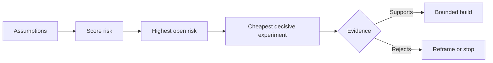

# 理假设并优先化解最高风险

> 产品路线图 (Route map) genellikle belirsizlikleri işlev listesi içinde gizler; hypothetical diagram (Assumption Map) ise ortaya çıkar: Bu işlevlerin inşa edilmesi gereken önlemleri önce doğrulanmalıdır.

**Type:** Learn + Build
**Languages:** Python (stdlib)
**Prerequisites:** Phase 14 lesson 48
**Time:** ~65 minutes

## Öğrenme hedefi

- Önerilen işlerin ayrılması ve açıklıksız bir şekilde ortaya çıkması için açıklıksız bir şekilde öngörülmüş bir varsayım haline getirilmesi.
- Bölüm: Etkileme derecesi: Etkileme: belirsizlik: belirsizlik: ve geri dönüşülemez: bağımsız değerlendirme:
- 风险排序选择下一个实验,而不是主观热情驱动──
- Test edilmiş varsayımların yerine uygulanan kanıt ve belirlenmiş karar sonuçları kullanılmıştır.

## Her inşaat bir bahis.

Bir kit故障排查工具 (Hazır Aracı) değerinin, aşağıdaki her bir ön önlem hipotezinin tamamen geçerli olup olmadığından değişebilir:

- Alarm'daki aşağıdaki mesajlar, hataları tespit etmek için yeterli bilgi içerir;
- Mühendislerin güvenliği , onların kendiliğinden önerilen önerilerle sonuçlanmamıştır .
-                                                                                                                                                                                                                                                                                                                                                                                                                                                                                                                              
- Gerekli verilere erişmek için, güvenliksiz yetkiyi (Unsecur Authority) kullanmak gerekir.
- Bu çalışma akışının gerçekleşme sıklığı yeterince yüksek olduğundan, sistemin bakım masraflarının makul olduğunu kanıtlayabilmektedir.

Bunlar sadece kodla gerçekleştirilen görevler değil, ancak yapıların değerli hale gelmesi için kullanılabilir olması için şartlar.

## 假设的类别

| 类别 | 核心问题 |
|---|---|
| 价值（Value） | 产出的最终结果是否足够重要？ |
| 可用性（Usability） | 用户能否理解并据此采取行动？ |
| 可行性（Feasibility） | 现有系统能否利用可获取的数据和约束产出该结果？ |
| 存续性（Viability） | 组织能否长期承受其成本、归属权与运维负担？ |
| 安全性（Safety） | 系统出现故障时是否不会造成无法接受的后果？ |

Bu işlev çok yararlı ve test edilemez. 10 işçi sınıf mühendisinden 8 kişi sadece analiz sonuçlarını doğru hizmetlere daha hızlı yerleştirmek için kullanılabilir.

## 风险并非单一维度的数字

Bu deney 1 ila 5 dakika arasında üç boyut değerlendiriyor:

- **影响（Impact）：**Eğer bu varsayım geçerli olmazsa, sistem veya işletme üzerindeki hasarın büyüklüğü­
- **不确定性（Uncertainty）：**Bu, bir delil olarak kabul edilmemek için bir neden.
- **不可逆性（Irreversibility）：**Büyük bir sözleşme veya yatırım yapıldıktan sonra yanlış bir geri dönüş maliyeti tespit edilmiştir.

Örnek değerlendirmeleri, belirsizlik oranını çarpıp, geri dönüşü olmayan bir şekilde etkileyecektir. Bu formül, tüm insanların kabul ettiği standartları bırakmıyor.



## 设计实验,而非确认仪式

Gerçek değerli bir deneyin aşağıdaki unsurları vardır:

- Bir olası sahte bir iddia;
- Gerçek bir katılımcı grup veya temsilcilik bir örnek;
- Bir gözlemlenmiş objektif sonuç;
- Sonuçları görmek için önceden belirlenmiş değer değerleri;
-  Başarısızlık ve belirsiz kanıtlar için belirlenen bir sonraki karar yolu

避免设计, 团队有能力的设计, 团队的设计, 团队的能力的设计, 团队的设计, 团队的设计, 团队的设计, 团队的设计, 团队的设计, 团队的设计, 团队的设计, 团队的设计, 团队的设计, 团队的设计, 团队的设计, 团队的设计, 团队的设计, 团队的设计, 团队的设计, 团队的设计, 团队的设计, 团队的设计, 团队的设计, 团队的设计, 团队的设计, 团队的设计, 团队的设计, 团队的设计, 团队的设计, 团队的设计, 团队的设计, 团队的设计, 团队的设计, 团队的设计, 团队的设计, 团队的设计, 团队的设计, 团队的设计, 团队的设计, 团队的设计, 团队的设计, 团队的设计, 团队的设计, 团队的设计, 团队的设计, 团队的设计, 团队的设计, 团队的设计, 团队的设计, 团队的设计, 团队的设计, 团队的设计, 团队的设计, 团队的设计, 团队的设计, 团队的设计, 团队的设计, 团队的设计, 团队的设计, 团队的设计, 团队的的的设计, 团队的设计, 团队的

## Çelişki değişir.

后果严重且不可逆的选择需要更早获得证据支持──只读重放(只读重播) önce üretim ortamı entegrasyonuna; geçici adaptörler önce büyük ölçekli veri aktarımına; 经人工审批的建议 önce tamamen otomatik olarak yerine getirilmelidir──

Sistem yapılandırmasının ilerleme hızının, belirsiz çözüme ulaşma hızıyla uyumlu olması gerekir.

## 动手实现

Bu deney, varsayımları sıralamak, kanıtlanmış ve belirlenmemiş ifadeler arasında ayrım yaparak, en yüksek riskli belirlenmemiş varsayımları seçerek, ortaya çıkarır.`outputs/assumption-map.json`- Evet.

```bash
python3 code/main.py
python3 -m unittest discover code/tests -v
```

修改最高风险假设上的证据状态,观察系统推的下一个实验将如何动态调整──

## 课后练习

1. Bir fonksiyon oluşturmaya hazırlanmak için beş önemli varsayım yazın.
2. 補充一条你原本的功能列表中遗漏的安全假设──
3. Bu yapının sertliğini sonlandırmaya karar ver.
4. Bir büyük test deneyini daha düşük maliyetli ve kararlı bir testle değiştirmek.
5. Risk önceliği ile orijinal ürünlerin önceliği arasında, ikinci nedenin yanlış olduğunu açıklamak için:

## 延伸阅读

- [Barry Boehm, A Spiral Model of Software Development and Enhancement](https://dl.acm.org/doi/10.1145/12944.12948), daha derin bir aşamada girişim yapılması ve belirsizliklerin riskli ve gelişme yönlendirici döngüsünü araştırmak.
- [Dardenne, van Lamsweerde, and Fickas, Goal-Directed Requirements Acquisition](https://doi.org/10.1016/0167-6423(93)90021-G), aşamalı olarak ortaya çıkış engelleri ve bağlamaları aynı zamanda geliştirme sistem hedeflerini araştırmak

## 交付物沉

Kalmak`outputs/assumption-map.json`❖ Next Section Ders bu dosya seçeneğini kararlı kanıtların en küçük parçalarını üretebilmek için kullanır.
