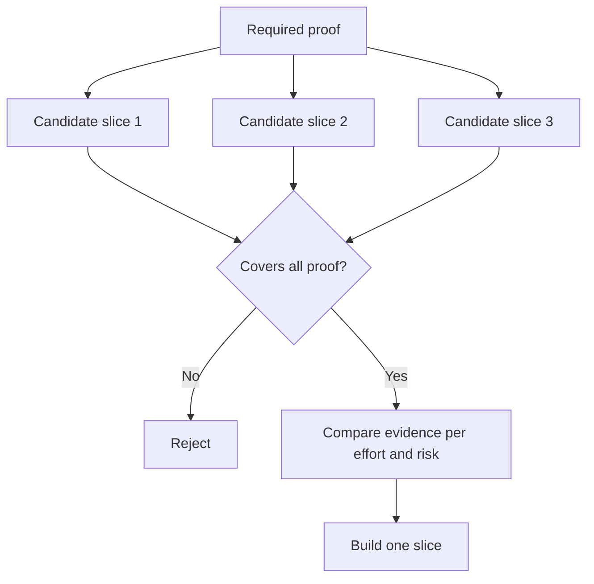

# 选择能够改变决策的最小片

> Sadece önemli sorunun doğru olduğunu kanıtlayabildiklerinde, basitleşmenin değerleri vardır. Bir sonraki kararın küçük yapılandırmasını değiştiremez.

**Type:** Learn + Build
**Languages:** Python (stdlib)
**Prerequisites:** Phase 14 lesson 49
**Time:** ~65 minutes

## Öğrenme hedefi

- Çizgilik'in temel varsayımına göre, çizgilik'in anlamını tanımlamak için bir çizgilik yapın.
- 权衡结果价值 (Bunun sonucu değer) 无确定性化解、研发投入与潜在后果──
-  öncelikle doğuştan erken bir şekilde gerçekleşen bir yaşamın gerçekleştiği kanıtını seçmek yerine,
- Karar vermeye karar vermeye karar vermeye karar vermeye karar vermeye karar vermeye karar vermeye karar vermeye karar vermeye karar vermeye karar vermeye karar vermeye karar vermeye karar vermeye karar vermeye karar vermeye karar vermeye karar vermeye karar vermeye karar vermeye karar vermeye karar vermeye karar vermeye karar vermeye karar vermeye karar vermeye karar vermeye karar vermeye karar vermeye karar vermeye karar vermeye karar vermeye karar vermeye karar vermeye karar vermeye karar vermeye karar vermeye karar vermeye karar vermeye karar vermeye karar vermeye karar vermeye karar vermeye karar vermeye karar vermeye karar vermeye karar vermeye karar vermeye karar vermeye karar vermeye karar vermeye karar vermeye karar vermeye karar vermeye karar vermeye karar vermeye karar vermeye karar vermeye karar vermeye karar vermeye karar vermeye karar vermeye karar vermeye karar vermeye karar vermeye karar vermeye karar vermeye karar vermeye karar vermeye karar vermeye karar vermeye karar vermeye karar vermeye karar vermeye karar vermeye karar vermeye karar vermeye karar vermeye karar vermeye karar vermeye karar vermeye karar vermeye karar vermeye karar vermeye karar vermeye karar vermeye karar ver ver vermeye karar ver ver ver ver ver ver ver ver ver ver ver ver ver ver ver

## Düz bir kesim , sonuna kadar gerçek anlamına gelir .

垂直切片 (垂直切片) 垂直切片 (垂直切片) 垂直切片 (垂直切片) 垂直切片 (垂直切片) 垂直切片 (垂直切片) 垂直切片 (垂直切片) 垂直切片 (垂直切片) 垂直切片 (垂直切片) 垂直切片 (垂直切片) 垂直切片 (垂直切片) 垂直切片 (垂直切片) 垂直切片 (垂直切片) 垂直切片 (垂直切片) 垂直切片 (垂直切片) 垂直切片 (垂直切片) 垂直切片) 垂直切片 (垂直切片) 垂直切片 (垂直切片) 垂直切片 (垂直切片) 垂直切片 (垂直切片) 垂直切片 (垂直切片) 垂直切片 (垂直切片) 垂直切片 (垂直切片) 垂直切片 (垂直切片) 切片) 切片 (垂直切片) 切片 (切片) 切片) 切片 (切片) 切片 (切片) 切片 (切片) 切片 (切片) 切片) 切片 (切片) 切片 (切片) 切片 (切片) 切片 (切片) 切片 (切片) 切片 (切片) 切片 (切片) 切片 (切片) 切片 (切片) 切片 (切片 (切片) 切片 (切片) 切片 (切片) 切片 (切片) 切片 (切片) 切片 (切片) 切片 (切片) 切片 (切片 (切片) (切片) (切片) (切片) (切片) (切片) (切片) (切片 (切片) (切片) (切片) (切片) (切片) (切) (切片) (切片 (切片) (切片) (切) (切

Örnek:

- 基于 10 起真故障的只读重放 (tek okuyucu tekrarlama),能够检查服务识别准确性与操作员的信任度──
- Yapılandırılmış verilere dayanan mükemmel bir araç çubuğu, belki de ara yüz anlayışını test edebilir, ancak verilerin elde edilebilirliğini tamamen test edemez.
- Üretim ortamında tüm otomatik bozuklukları onarmak için, tek seferlik test tüm bölümleri, ancak dayanılmaz büyük zarar riskini getirmiştir.

## Önceden belirlenmiş kanıtlar

提取风险最高的未决假设,将将其转化为必证集 (必证集) ──候选片片只有在完全覆盖该证集时才具备入选资格 (必证集) ──

Daha sonra, yeterli kesimler arasında karşılaştırma değerlendirilir:

| 评估维度 | 期望方向 |
|---|---|
| 产出价值（Outcome value） | 越大越好 |
| 化解的不确定性（Uncertainty reduced） | 越多越好 |
| 研发投入（Effort） | 越小越好 |
| 潜在后果（Consequence） | 越轻越好 |
| 可逆性（Reversibility） | 越高越好 |

Bu deney kullanımı için değerlendirme modeli basit kalmaya hazırdır, çünkü yeterlilik kapısı, dijital işlemden daha önemlidir.



## 常见的伪极小值陷

- **纯界面极小值（UI-only minimum）：** En önemli veri elde edilmesinden ve ulaşımında belirsizliklerden kaçınmak.
- **纯基础设施极小值（Infrastructure-only minimum）：**☐ ☐ ☐ ☐ ☐ ☐ ☐ ☐ ☐ ☐ ☐ ☐ ☐ ☐ ☐ ☐ ☐ ☐ ☐ ☐ ☐ ☐ ☐ ☐ ☐ ☐ ☐ ☐ ☐ ☐ ☐ ☐ ☐ ☐ ☐ ☐ ☐ ☐ ☐ ☐ ☐ ☐ ☐ ☐ ☐ ☐ ☐ ☐ ☐ ☐ ☐ ☐ ☐ ☐ ☐ ☐ ☐ ☐ ☐ ☐ ☐ ☐ ☐ ☐ ☐ ☐ ☐ ☐ ☐ ☐ ☐ ☐ ☐ ☐ ☐ ☐ ☐ ☐ ☐ ☐ ☐ ☐ ☐ ☐ ☐ ☐ ☐ ☐ ☐ ☐ ☐ ☐ ☐ ☐ ☐ ☐ ☐ ☐ ☐ ☐ ☐ ☐ ☐ ☐ ☐ ☐ ☐ ☐ ☐ ☐ ☐ ☐ ☐ ☐ ☐ ☐ ☐ ☐ ☐ ☐ ☐
- **纯顺境极小值（Happy-path minimum）：**刻意省略构成大部分风险的异常边界处理──
- **演示极小值（Demo minimum）：** çok güçlü bir kanıt üretildi, ancak gerçekçi bir ölçümsel değerlendirme sağlayamadı.
- **平台化极小值（Platform minimum）：**Tek bir çalışma akışı değeri henüz doğrulanmamışken, genel tekrar kullanımı bileşenleri çok erken inşa edilmiştir.

## 预先设定停止规则 (Bekleme)

Başlangıç gerçekleşmeden önce, eğer bu test başarısız olursa, alınan önlemleri belirtmek gerekir:

-  放弃该预期结果;
- Hedef kullanıcı grubu veya iş sahnesini değiştirmek;
- 测试替代的技术机制;
-  daha yüksek kalite alt katı kanıt toplamak;
- 进一步收窄系统的执行权──

Eğer her test sonucu sonunda yönlendirilmişse, o zaman bu parça aslında gerçek bir deney değil.

## 动手实现

Bu deney gerekli kanıtlara göre yapılan seçimler, değerlendirme yapıldı, ve sonuçlar çıkardı.`outputs/slice-decision.json`- Evet.

```bash
python3 code/main.py
python3 -m unittest discover code/tests -v
```

Daha düşük bir maliyet eklemeye çalışmak ancak yalnızca tek bir şartı doğrulamak için gerekli olan bir adaylık parçası oluşturmak için çaba göstermek.

## 课后练习

1.  Aynı beklenen sonuçlara göre, üç farklı sonuçlara karşı karşı karşıya olan test parçaları 
2. Seçimlerin değerlendirilmesinden önce, gerekli kanıtların net bir listesi bulunmalıdır.
3. 尝试裁减一项功能,同时确保能够保留关键决定性证据──
4. Bu nedenle, bu programın tamamlanması için, gerçekte uygulanabilir bir durdurma kuralları vardır.
5. Çizgilik onayından sonra yeniden başlatılması için bir neden bul.

## 延伸阅读

- [Barry Boehm, A Spiral Model of Software Development and Enhancement](https://dl.acm.org/doi/10.1145/12944.12948), her gelişme devresi, mevcut çözülmesi gereken risklerle nasıl uyumlu hale getirileceğini araştırmak.
- [Lenarduzzi and Taibi, MVP Explained: A Systematic Mapping Study on the Definitions of Minimal Viable Product](https://arxiv.org/abs/1609.07592), dizayn uygulamasında en az                                                                                                                                                                                                                                                           

## 交付物沉

Kalmak`outputs/slice-decision.json`Bu dosya, bu kesimlerin neden kararları değiştirebilme gücüne sahip olduğunu belirten kanıtlara dayanarak kaydediyor.
