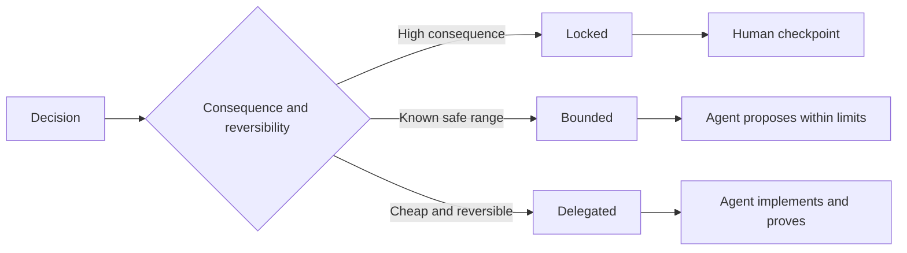

# 编写保留自主裁决权的任务规范

> Değerli kurallar, değişmezlik ve kanıtlarla sabitlenmeli ve tersine gerçekleşme seçeneğine açık kalmalıdır.

**Type:** Learn + Build
**Languages:** Python (stdlib)
**Prerequisites:** Phase 14 lesson 50
**Time:** ~75 minutes

## Öğrenme hedefi

- Bu, bir diğer deyişle, bir diğer deyişle, bir diğer deyişle, bir diğer deyişle, bir diğer deyişle, bir diğer deyişle, bir diğer deyişle, bir diğer deyişle, bir diğer deyişle, bir diğer deyişle, bir diğer deyişle, bir diğer deyişle, bir diğer deyişle, bir diğer deyişle, bir diğer deyişle, bir diğer deyişle, bir diğer deyişle, bir diğer deyişle, bir diğer deyişle, bir diğer deyişle, bir diğer deyişle, bir diğer deyişle, bir diğer deyişle, bir deyişle, bir deyişle, bir deyişle, bir deyişle, bir deyişle, bir deyişle, bir deyişle, bir deyişle, bir deyişle, bir deyişle, bir deyişle, bir deyişle, bir deyişle, bir deyişle, bir deyişle, bir deyişle, bir deyişle, bir deyişle, bir deyişle, bir deyişle, bir deyişle, bir deyişle, bir deyişle, bir deyişle, bir deyişle, bir deyişle, bir deyişle, bir deyişle, bir deyişle, bir deyişle, bir deyişle, bir deyişle, bir deyişle, bir deyişle, bir deyişle, bir deyişle, bir deyişle, bir de, bir deyişle, bir deyişle, bir de, bir de, bir de, bir deyişle, bir de, bir de, bir de, bir de, de, bir de, bir de, de, bir de, de, de, bir de, de, de, de, de, de, de, de, de, de, de, de, de, de, de, de, de, de, de, de, de, de, de, de, de, de, de, de, de, de, de, de, de, de, de, de, de, de, de, de, de, de, de, de, de, de, de, de, de, de, de, de, de, de, de, de, de, de, de, de, de, de, de, de,
- Çatıştırılmış, kısıtlanmış, sınırlı, görevlendirilen, üç farklı modülde görevlendirilen.
- Düşük maliyetli ve yüksek derecede tersine çevreyi seçerken, Ajanın kendi kararını verme hakkını tam olarak korur.
- Ciddi sonuçlar veya kamu davranışlarının bozulması ile ilgili noktalarda, yapay denetim kontrol noktası (Human Checkpoints) kurulması zorunlu.

## İki kötü uç.

规范不足 (Undespecified) 之任务迫迫 Agent 凭空猜测系统行为;而过度规范 (Over specified) 之任务则让 Agent 机械照抄可能本身就存在缺陷的具体设计──

Yapılan etkinlik şöyledir.**可执行契约（Executable Contract）**- ...

| 规范要素 | 核心作用 |
|---|---|
| 预期产出（Outcome） | 可直接观测的最终交付结果 |
| 不变量（Invariants） | 必须始终严格成立的前置与后置约束 |
| 范例（Examples） | 能够直观展现真实意图的具体用例 |
| 非目标（Non-goals） | 明确刻意排除在外的周边行为 |
| 决策策略（Decision policy） | 标明哪些选择属于锁定、受限或完全委派 |
| 验证证据（Proof） | 任务验收前必须提供的测试或观测实据 |

## Üç çeşit karar biçimi

- **锁定（Locked）：**严禁代理 擅自选择;; kamu uyumluluğu için uygundur; yazma hakkı, güvenlik red线, geri dönüşü olmayan maliyet veya çekirdek ürün sözleşmesi için uygundur;
- **受限（Bounded）：**允许 Agent 在明确界定的安全区内自主选择――搜索预算、重试次数上限、白名单依赖库或既定接口族──
- **委派（Delegated）：**授权代理 全权裁量并附带解释说明── yerel kod yapı、命名规范、可逆重构及内部实现细节──



## 通过具体范例界定行为

Özel örnekler ile aktarma niyetleri, çok daha etkili olanından çok daha fazla.                                                                                                                                                                                                                                                      

范例不能替代不变量: single pass success use cases, cannot prove general use                                                                                                                                                                                                                                                     

## Dayanıklılık belgesi, açıklama sınıfına uygun olmalıdır.

- 单元测试(Unit Test) yerel işlevi için kullanılır
- 传输协议测试 (Wire Test) 网络通信行为与序列化的证明 (网络通信行为) için kullanılır.
- 浏览器旅程(Browser Journey) kullanıcı arayüzünün yollarını kanıtlamak için kullanılır.
- 重放测试集(Replay Set) temsilcilik sahnesindeki bütün gösterimi kanıtlamak için kullanılır.
- 审计日志(Audit Log) kanıtlama sisteminin yetki sınırları daima geçerlidir.

️Yüksek seviye açıklamalarının kabul kanıtı olarak düşük seviye sınavlarını kesinlikle kullanmayın.

## 刻意保留合理的未知空间

                                                                                                                                                                                                                                                              

 Tanınma kanıtlarının birikmesiyle, kural zamanla birlikte gelişmelidir.  Kayıtlar kilitlenir ve kısıtlı seçimlerin arkasındaki temel nedenler, sonraki ekipler   kod kullanımı                                                                                                                                                                                                                                       

## 动手实现

Bu deney, karar verme modunun yasallığını kontrol etmek için yapılan düzenlemelerin her bir boyutunu oluşturur.`outputs/executable-specification.json`- Evet.

```bash
python3 code/main.py
python3 -m unittest discover code/tests -v
```

尝试将生产环境写权从锁定调整为委派──分析为什么数据方案 能够通过校验,而产品层面的风险控制却坚决不允许这种变化──

## 课后练习

1. Bir mirasın bir tekliğinin, bir tekliğin, bir teklifinin, bir teklifinin, bir teklifinin, bir teklifinin, bir teklifinin, bir teklifinin, bir teklifinin, bir teklifinin, bir teklifinin, bir teklifinin, bir teklifinin, bir teklifinin, bir teklifinin, bir teklifinin, bir teklifinin, bir teklifinin, bir teklifinin, bir teklifinin, bir teklifinin, bir teklifinin, bir teklifinin, bir teklifinin, bir teklifinin, bir teklifinin, bir teklifinin, bir teklifinin, bir teklifinin, bir teklifinin, bir teklifinin, bir teklifinin, bir teklifinin, bir teklifinin, bir teklifinin, birlifinin, birlifinin, birlifinin, birlifinin, birlifinin, birlifinin, birlifinin, birlifinin, birlifinin, birlifinin, birlifinin, birlifinin, birlifinin, birlifinin, birlifinin, birlifinin, birlifinin, birlifinin, birlifinin, birlifinin,
2. Bir değişmez kural ile iki tipik örnekle, üç zorlu yönlendirmenin bir yerine bir örnekle,
3. Etiketleme görevindeki her karar, her bir kısıtlama veya kısıtlama seçeneğinin açıklaması için gereklidir.
4. Bu konuda bir diğer önemli nokta da, bu konuda bir diğer önemli nokta da vardır.
5. 找出一条既无实证支又不依据的冗余束并将其删除──

## 延伸阅读

- [Nuseibeh and Easterbrook, Requirements Engineering: A Roadmap](https://www.cs.toronto.edu/~sme/papers/2000/ICSE2000.pdf), , , , , , , , , , , , , , , , , , , , , , , , , , , , , , , , , , , , , , , , , , , , , , , , , , , , , , , , , , , , , , , , , , , , , , , , , , , , , , , , , , , , , , , , , , , , , , , , , , , , , , , , , , , , , , , , , , , , , , , , , , , , , , , , , , , , , , , , , , , , , , , , , , , , , , , , , , , , , , , , , , , , , , , , , , , , , , , , , , , , , , , , , , , , , , , , , , , , , , , , , , , , , , , , , , , , , , , , , , , , , , , , , , , , , , , , , , , , , , , , , , , , , , , , , , , , , , , , , , , , , , , , , , , , , , , , , , , , , , , , , , , , , , , , , , , , , , , , , , , , , , , , , , , , , , , , , , , , , , , , , , , , , , , , , , , , , , , , , , , , , , , , , , , , , , , , , , , , , , , , , , , , , , , , , , , , , , , , , , , , , , , , , , , , , , , , , , , , , , , , , , , , , , , , , , , , , , , , , , , , , , , , , , , , , , , , , , , , , , , , , , , , , , , , , , , , , , , , , , , , , , , , , , , , , , , , , , , , , , , , , , , , , , , , , , , , , , , , , , , , , , , , , , , , , ,
- [Zave and Jackson, Four Dark Corners of Requirements Engineering](https://doi.org/10.1145/237432.237434), derinlemesine analiz ortamı varsayımları, sistem gereksinimleri ve teknik kuralları üç kişinin temel farkı
- [Gotel and Finkelstein, An Analysis of the Requirements Traceability Problem](https://doi.org/10.1109/ICRE.1994.292398), ihtiyaçların nedenlerini ve geri dönüşümselliğini nasıl koruyacağını araştırmak.

## 交付物沉

Kalmak`outputs/executable-specification.json` İnsan değerlendiricileri ile birlikte uygulanan bir işbirliği anlaşması haline gelecek.
