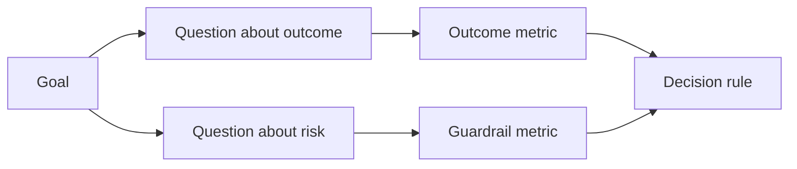

# Sonuçlar ortaya çıkmadan önce tasarım başarısı göstergesi

> Ölçüm göstergesi sadece bir araç çubuğunun dekorasyonu olarak değil, hareket kararlarına hizmet etmelidir.

**Type:** Learn + Build
**Languages:** Python (stdlib)
**Prerequisites:** Phase 14 lessons 47 and 51
**Time:** ~70 minutes

## Öğrenme hedefi

- Beklenen sonuç hedeflerinden temel sorun ve ölçüm göstergesi çıkarılmaktadır.
- Gözetimden önce, değerleri, zaman pencerelerini, veri kaynaklarını ve optimize yönlerini önceden belirleyin.
- Üretim göstergesi ve koruma göstergesi (Gardrails)
- Bu değerlendirme kanıtlarının, inşaat için gerekli destekle uyumlu olması için gerekli kararları alınması.

## 目標、問題與指标 (GQM)

Çekim:

> ), herhangi bir güvenliksiz işlem artırmakla birlikte, etkilenen hizmetlerin ihtiyaç duyduğu zamanı kısaltmak.

推导出问题(Soru):

- Doğru servis hızı ne kadar hızlı?
- 定位出勤率 çok yüksek mi?
-  Diagnostik süreci her zaman sadece okumak mı?
- İş akışı, alarmların sıklıkla göz ardı edilmesine veya operatör yükünün ağırlaşmasına neden oldu mu?

随后挑选将这些问题操作化 (Operation) 的指标 (Metrik) 



## Her bir gösterge kuralları gerektirir.

Her bir göstergeye sahip olmak zorundadır:

| 契约字段 | 示例 |
|---|---|
| 指标名称（Name） | `median_identification_seconds` |
| 方向（Direction） | 至多不超过（at most） |
| 阈值（Threshold） | 120 |
| 窗口（Window） | 10 次故障事件重放 |
| 数据源（Source） | 重放事件日志 |
| 统计样本（Population） | 参与试点的在岗工程师 |
| 类别（Kind） | 成果指标（outcome）或护栏指标（guardrail） |

Eğer verilerin kayıp kaynakları ve istatistik pencereleri varsa, herhangi bir sayı tekrarlanamaz; eğer öntanım değerleri eksikse, gösterge kesin kararları yönlendiremez.

## 成果 göstergesi 护 göstergesi ve ölçüm göstergesi

- **成果指标（Outcome metric）：**期望改善的状态是否真正升升?
- **护栏指标（Guardrail）：**Güvenlik ve bağlılık şartları her zaman mu yerine gelecek?
- **制衡指标（Counter-metric）：**Yerel optimizasyon gizli maliyetleri veya zararları diğer bölümlere aktarır mı?

                                                                                                                                                                                                                                                              

## İletişim Hakkında Kanıt

离线重放(Offline Replay) çok uygundur kontrol edilebilirlik ve kenar sahne kapsamı oranı;受控试点(Bunded Pilot)则擅长检验真实人类行为、信任度建立与工作流上下游影响──二者互补充,不可替代──

始终选择能够支当前决策的最低成本证据――绝不能仅仅因为代码已经写好就商业将真正用户暴露给未知风险――

## Öncelikle ölçüm kararları

Statistik sonuçları görmeden önce, başarısızlık ve belirsiz durumlar altında hareket yollarını önce yazılı olarak belirlemek gerekir.

Örnek kuralları:

- 通過(Pass): servis konum doğrulama oranı 0.9'dan düşük değildir ve konumlandırma zamanı ortalama 120 saniyeden fazla değildir;
- 失败(Fail): yasadışı üretim işlemleri veya 0.75'ten düşük bir konum doğruluğu oranı oluştu.
- 模糊(Bütükenli): performans küçük bir gelişme olmasına rağmen, büyük bir fark, yeniden test edilmesi gereken bir örnekleme kitlesi yeniden test edilmesi gerekir.

## 动手实现

Bu deney, sınırı değerini içeren ölçüm planının bütünlüğünü değerlendirir, eksiklik göstergesi kaydını kaydetir, çıkarır.`outputs/measurement-report.json`- Evet.

```bash
python3 code/main.py
python3 -m unittest discover code/tests -v
```

尝试删除在度量计划中的护指标, observe why even if the outcome indicator still exists, the whole plan will still be systematically condemned as illegal.

## 课后练习

1. Aynı başarı hedefiyle ortaya çıkan üç farklı konuyla ilgili soru ortaya çıkarılmıştır.
2. 补充一条 其他角色负担加重的衡量指标的捕获, 其他角色负担加重的控制, 其他角色负担加重的控制, 其他角色负担加重的控制, 其他角色负担加重的控制, 其他角色负担加重的控制, 其他角色负担加重的控制, 其他角色负担加重的控制, 其他角色负担加重的控制, 其他角色负担加重的控制, 其他角色负担加重的控制, 其他角色负担加重的控制, 其他角色负担加重的控制, 其他角色负担加重的控制, 其他角色负担加重的控制, 其他角色负担加重的控制, 其他角色负担加重的控制, 其他角色负担加重的控制, 其他角色负担加重的控制, 其他角色负担的控制, 其他角色负担的控制, 其他角色负担的控制, 其他角色负担的控制, 其他角色负担的控制, 其他角色负担负担的控制,
3. Her bir gösterge için verilerin kaynağını belirleyin, istatistik örnek grupları ve zaman penceresi.
4. Gerçek değer üretmeden önce, önce yazın aşağıda geçi­n ̊ başarısızlık ve模糊 üç durumda kararlar.
5.                                                                                                                                                                                                                                                               

## 延伸阅读

- [Basili, Software Modeling and Measurement: The Goal/Question/Metric Paradigm](https://drum.lib.umd.edu/items/8119803a-362b-42ec-b6ce-2311713e7236),GQM 范式) ◊
- [Basili, Caldiera, and Rombach, The Goal Question Metric Approach](https://www.cs.toronto.edu/~sme/CSC444F/handouts/GQM-paper.pdf)Bu yöntemin, sürekli gelişen sistemlerin kapalı bir dönemi olarak uygulanmasını açıklar.

## 交付物沉

Kalmak`outputs/measurement-report.json`△ Bu, ilk olarak, ilk olarak, ilk olarak, ilk olarak, ilk olarak, ilk olarak, ilk olarak, ilk olarak, ilk olarak, ilk olarak, ilk olarak, ilk olarak, ilk olarak, ilk olarak, ilk olarak, ilk olarak, ilk olarak, ilk olarak, ilk olarak, ilk olarak, ilk olarak, ilk olarak, ilk olarak, ilk olarak, ilk olarak, ilk olarak, ilk olarak, ilk olarak, ilk olarak, ilk olarak, ilk olarak, ilk olarak, ilk olarak, ilk olarak, ilk olarak, ilk olarak, ilk olarak, ilk olarak, ilk olarak, ilk olarak, ilk olarak, ilk olarak, ilk olarak, ilk olarak, ilk olarak, ilk olarak, ilk olarak, ilk olarak, ilk olarak, ilk olarak, ilk olarak, ilk olarak, ilk kez, ilk kez, ilk kez, ilk kez, son olarak, son olarak, son olarak, son derece, son derece, son derece, son derece, son derece, daha fazla, daha sonra, daha sonra, daha sonra, daha sonra, daha sonra, daha sonra, daha sonra, daha sonra, daha sonra, daha sonra, daha sonra, daha sonra, daha daha daha daha daha daha daha daha daha daha fazla, daha daha daha daha daha daha daha daha daha daha daha daha daha daha daha fazla, daha daha daha daha daha daha daha daha daha daha daha daha daha daha daha daha daha daha daha daha daha daha daha daha daha daha daha daha daha daha daha daha daha daha daha daha daha daha daha daha daha daha daha daha daha daha daha daha daha daha daha daha daha daha daha daha daha daha daha daha daha daha daha daha daha daha daha daha daha daha daha daha daha daha daha daha daha daha daha daha daha daha daha daha daha daha daha daha daha daha daha daha daha daha daha daha daha daha daha daha daha daha daha daha daha daha daha daha daha daha daha daha daha daha daha daha daha daha daha daha daha daha daha daha daha daha daha daha daha daha daha daha daha daha daha daha daha daha daha daha daha daha daha daha daha daha daha daha daha daha daha daha daha daha daha daha daha daha daha daha daha daha daha daha daha daha daha daha daha daha daha daha daha daha daha daha daha daha daha daha daha daha daha daha daha daha daha daha daha daha daha daha daha daha daha daha daha daha daha daha daha daha daha daha daha daha daha daha daha daha daha daha daha daha daha daha daha daha daha daha daha daha daha daha daha daha daha daha daha daha daha daha daha daha daha daha daha daha daha daha daha daha daha daha daha daha
