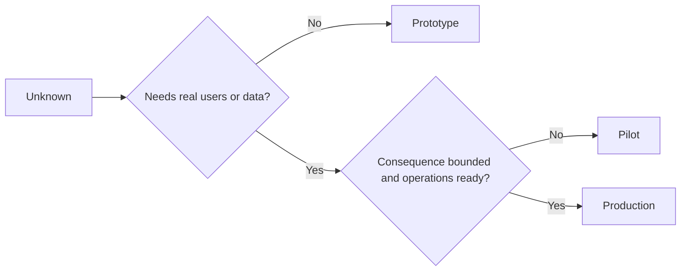

# 审慎择原型、试点还是生产

> Bu, sadece basit bir ayrıntılılık değil, tamamen farklı bir biliş ortamını temsil eder.

**Type:** Learn + Build
**Languages:** Python (stdlib)
**Prerequisites:** Phase 14 lessons 50 to 52
**Time:** ~70 minutes

## Öğrenme hedefi

- Bilinmeyen türlere göre, kitle alanı, veri hassasiyeti, sonuçları ve sonuçları bozan, yapım aşamasını seçen ve dikkatli bir şekilde yapım aşamasını seçen.
-                                                                                                                                                                                                                                                               
-                                                                                                                                                                                                                                                               
- Bu nedenle, bu süre içinde, bu süre içinde, bu süre içinde, bu süre içinde, bu süre içinde, bu süre içinde, bu süre içinde, bu süre içinde, bu süre içinde, bu süre içinde, bu süre içinde, bu süre içinde, bu süre içinde, bu süre içinde, bu sürece, bu süre içinde, bu sürece, bu sürece, bu sürece, bu sürece, bu sürece, bu sürece, bu sürece, bu sürece, bu sürece, bu sürece, bu sürece, bu sürece, bu sürece, bu sürece, bu sürece, bu sürece, bu sürece, bu sürece, bu sürece, bu sürece, bu sürece, bu sürece, bu sürece, bu sürece, bu sürece, bu sürece, bu sürece, bu sürece, bu sürece, bu sürece, bu sürece, bu sürece, bu sürece, bu sürece, bu sürece, bu sürece, bu sürece, bu sürece, bir süreye, bu sürece, bu sürece, bir süreye, bir süreye, bir süreye, bir süreye, bir süreye, bir süreye, bir süreye, bir süreye, bir sürece, bir sürece, bir sürece, bir sürece, bir sürece, bir sürece, bir sürece, bir sürece, bir sürececececececececececececececececececececececececececececececececececececececececececececececececececececececececececececececececececececececececececececececececececececececececececececececececececececececececececececececececececececececececececececececececececececececececececececececececececececececececececececececececececececececececececececececececececececececececececececececececececececececececececececececececececececece

## Üç farklı temel sorun

| 阶段 | 核心问题 |
|---|---|
| 原型（Prototype） | 该技术机制到底能不能产生预期的实证结果？ |
| 试点（Pilot） | 在受控真实受众与真实工况下，它能否安全稳定运行？ |
| 生产（Production） | 组织能否按照既定的可靠性与风险承诺，持续对该系统承担长期责任？ |

Teknolojiyle son derece tamamlanmış bir prototip, hala terk edilmiş atıklar için tasarlanabilir; bir deney noktası gerçek üretim verilerini kullanabilir, ancak kullanıcılarının büyüklüğü ve çalışma yetkisi sıkı şekilde sınırlandırılmalıdır; ancak organizasyon resmi olarak yükümlülük altına girdiğinde ve uzun süreli sorumluluk aldığında, üretim aşaması gerçek anlamda başlıyor.

## Çönem aşama

Gerçek kullanıcı veya gerçek üretim verisini girmek zorunda kalmadığı bilinmeyen varsayımların çözülmesi gerektiğinde, orijinal aşamaları kullanın.

- 随时可废弃 (Sıkıştırılabilir);
- 严格隔离(Yapalı);
- 功能边界狭窄 (karışıklık kısıtlı)
- 核心验证问题显式明确 (öğrenme sorusu hakkında açıkça konuşun);
- Yalancı bir yükümlülük ve sabitlik sözünü vermiyor.

Mekanistlerin kendileri, bir sonraki aşamaya girmeye değer olduğunu kanıtlamadan önce, tüm sistem yapılarını çok erken optimize etmeyin.

## 试点阶段

Bilinmeyen varsayımlar gerçek operasyon davranışlarına, gerçek verilere veya gerçek çalışma akışlarına dayanarak denetlenmesi gerektiğinde, ancak sonuçları veya çalışmalarını tamamen yayımlamak için yetersiz hale getirildiğinde, deneme aşamasını kullanmak gerekir.

Bir kalifiye deneyinin sahip olması gerekir:

-                                                                                                                                                                                                                                                               
- 明确 insan sorumluları;
- Sıkı kısıtlı çalışma döngüsü ve çalışma yetkisi;
- 审计追溯与快速回滚方案;
- 成果 göstergesi ve 护 değer göstergesi;
- Açıklama: Açıklama: Açıklama: Açıklama: Açıklama: Açıklama: Açıklama: Açıklama: Açıklama: Açıklama: Açıklama: Açıklama: Açıklama: Açıklama: Açıklama: Açıklama: Açıklama: Açıklama: Açıklama: Açıklama: Açıklama: Açıklama: Açıklama: Açıklama: Açıklama: Açıklama: Açıklama: Açıklama: Açıklama: Açıklama: Açıklama: Açıklama: Açıklama: Açıklama: Açıklama: Açıklama: Açıklama: Açıklama: Açıklama: Açıklama: Açıklama: Açıklama: Açıklama: Açıklama: Açıklama: Açıklama: Açıklama: Açıklama: Açıklama: Açıklama: Açıklama: Açıklama: Açıklama: Açıklama: Açıklama: Açıklama: Açıklama: Açıklama: Açıklama: Açıklama: Açıklama: Açıklama: Açıklama: Açıklama: Açıklama: Açıklama: Açıklama: Açıklama: Açıklama: Açıklama: Açıklama: Açıklama: Açıklama: Açıklama: Açıklama: Açıklama: Açıklan: Açıklan: Açıklan: Açıklan: Açıklan: Açıklan: Açıklan: Açıklan: Açıklan: Açıklan: Açıklan: Açıklan: Açıklan: Açıklan: Açıklan: Açıklan: Açıklan: Açıklan: Açıklan: Açıklan: Açıklan: Açıklan: Açıklan: Açıklan: Açıklan: Açıklan: Açıklan: Açıklan: Açıklan: Açıklan: Açıklan: Açıklan: Açıklan: Açıklan: Açıklan: Açıklan: Açıklan: Açıklan: Açıklan: Açıklan: Açıklan: Açıklan: Açıklan: Açıklan: Açıklan: Açıklan: Açıklan: Açıklan: Açıklan: Açıklan: Açıklan: Açık

## Çöneme aşaması

生产阶段 kesinlikle sadece kod tamamlama için gönderilmeye eşit değildir:

- 明确的服务等级目标(SLO);
- 值班排班与故障事件处理责任人;
- Güvenlik ve Gizlilik konusunda inceleme;
- Üst sınır ve yumuşaklık kapasitesi kontrolü;
- Complete rolling and capacity recovery mechanism;
- 7x24 小時全天候监控;
- 清晰的退役与下线路径──



## 阶段漂移陷

Eğer orijinal kod uzun süreli bir işletim ve sorumluluk sistemi oluşturulmamışsa, gerçek kullanıcı ̋ hassas veriler ̋ veya çekirdek işletim yetkisi elde edildikçe, bu fenomenin çok tehlikeli hale gelmesi bilinmektedir.**阶段漂移（Stage Drift）** Sistem konumu, yetki kontrolü, uzaktan ölçüm göstergeleri ve mimarlık dosyalarında zorunlu bir şekilde yapılandırılmış olan ilk ve ilk deneylerin sertlik sınırları  sadece ara yüzünde bir  test versiyonu uyarısı 横幅远远不够的

Sistemde bulunan aşama, sistemin işleyiş hali içinde doğrudan gözlemlenmiş ve denetlenmiş olmalıdır.

## 动手实现

Bu deney, kararlara göre, her aşamada gerekli gerekli yönetim önlemlerini geri dönüştürmek için otomatik olarak önerilen bir aşama oluşturdu.`outputs/stage-decisions.json`- Evet.

```bash
python3 code/main.py
python3 -m unittest discover code/tests -v
```

Bu deney örneği,  düşük yıkıcı sonuçlara ve 运维成熟度 ── için değiştirmek.

## 课后练习

1. 认知探索阶段 (Bilgi araştırması aşamasında) ve sadece kod dağıtım durumunda değil, başınızdaki üç mevcut projenin yeniden sınıflandırılması için.
2.                                                                                                                                                                                                                                                               
3.  bir teknik kontrol önlemini artırmak, temel olarak orijinal kodun üretim çevre verilerine dokunmasını önlemek için
4.  ilk belirlenen sistemin gerçek anlamda üretim derecesindeki sorumlulukların taşımacılık ve sorumluluklarına dönüşmesi.
5. Örgütü, bir seti tamamlanmış bir çalışma sertifikası tasarımı için.

## 延伸阅读

- [Barry Boehm, A Spiral Model of Software Development and Enhancement](https://dl.acm.org/doi/10.1145/12944.12948), her neslin kaynak harcamalarının çözülmüş risk derecesine nasıl uygulanacağını araştırmak.
- [Fagerholm et al., Building Blocks for Continuous Experimentation](https://doi.org/10.1145/2601248.2601276),anatoloji ve teknik önlemleri, mühendislik deneylerinin devamlı yürütülmesi için gerekli örgütleme süreçleri ve teknik önlemleri

## 交付物沉

Kalmak`outputs/stage-decisions.json`❖ Bu, her aşama neden seçildiğini ve sonraki aşama girmeden önce uygulanması gereken yönetim önlemlerini kaydeder.
