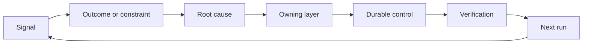

# Konuşturma ve geri dönüş mekanizması için bir dönüm

> Kod yayınlaması, mevcut yapı döngüsünü sona erdirir ve aynı zamanda uzun süreli öğrenme döngüsünü açar.

**Type:** Learn + Build
**Languages:** Python (stdlib)
**Prerequisites:** Phase 14 lessons 46 and 53
**Time:** ~75 minutes

## Öğrenme hedefi

- Yapılan hataları, değerlendirme verilerini, kullanıcı davranışlarını ve yanlışlarını sorumlu bir eylem olarak dönüştürmek.
- Bu nedenle, bu programın kullanımı için gerekli olan araçların kullanımı için gerekli olan araçların kullanımı için gerekli olan araçların kullanımı için gerekli olan araçların kullanımı için gerekli olan araçların kullanımı için gerekli olan araçların kullanımı için gerekli olan araçların kullanımı için gerekli olan araçların kullanımı için gerekli olan araçların kullanımı için gerekli olan araçların kullanımı için gerekli olan araçların kullanımı için gerekli olan araçların kullanılması için gerekli olan araçların kullanılması için gerekli olan araçların kullanılması için gerekli olan araçların kullanılması için gerekli olan araçların kullanılması için gerekli olan araçların kullanılması için gerekli olan araçların kullanılması için gerekli olan araçların kullanılması için gerekli olan araçların kullanılması için gerekli olan araçların kullanılması için gerekli olan araçların kullanılması için gerekli olan araçların kullanılması için gerekli olan araçların kullanılması için gerekli olan araçların kullanılması için gerekli olan araçların kullanılması için gerekli olan araçların kullanılması için gerekli olan araçların kullanılması için gerekli olan araçların kullanılması için gerekli olan araçların kullanılması gereklidir.
- Devam ve tekrar oluşma risklerine göre öncelik sıralanması
- Bu nedenle, her bir sistem kontrol mekanizması, emeklilik koşullarını belirlemiştir.

## Bu da bir altyapıdır.

Bir ekip, çok sayıda sistem bağlantısı takip (sıra) ̊ değerlendirme kayıtları ̊ destek iş tekli ve eksiklik günlüğü ̊ toplayabilir, ancak tamamen herhangi bir biliş dersleri almıyor.**晋级通道（Promotion）**Bu, bir kişinin, bir kişinin, bir kişinin, bir kişinin, bir kişinin, bir kişinin, bir kişinin, bir kişinin, bir kişinin, bir kişinin, bir kişinin, bir kişinin, bir kişinin, bir kişinin, bir kişinin, bir kişinin, bir kişinin, bir kişinin, bir kişinin, bir kişinin, bir kişinin, bir kişinin, bir kişinin, bir kişinin, bir kişinin, bir kişinin, bir kişinin, bir kişinin, bir kişinin, bir kişinin, bir kişinin, bir kişinin, bir kişinin, bir kişinin, bir kişinin, bir kişinin, bir kişinin, bir kişinin, bir kişinin, bir kişinin, bir kişinin, bir kişinin, bir kişinin, bir kişinin, bir kişinin veya bir diğerinin, bir diğerinin, bir diğerinin, bir diğerinin, bir diğerinin, bir diğerinin, bir diğerinin, bir diğerinin, bir diğerinin, bir diğerinin, bir diğerinin, bir diğerinin, bir diğerinin, bir diğerinin, bir diğerinin, bir diğerinin, bir diğerinin, bir diğerinin, bir diğerinin, bir diğerinin, bir diğerinin, bir diğerinin, bir diğerinin, bir diğerinin, bir diğerinin, bir diğerinin, bir diğerinin, bir diğerinin, bir diğerinin, bir diğerinin, bir diğerinin, bir diğerinin, bir diğerinin, bir diğerinin, bir diğerinin, bir diğerinin, bir diğerinin, bir diğerine karşı karşı karşı karşı karşı karşı karşı karşı karşı karşı karşı karşı karşı karşı karşı karşı karşı karşı karşı karşı karşı karşı karşı karşı karşı karşı karşı karşı karşı karşı karşı karşı karşı karşı karşı karşı karşı karşı karşı karşı karşı karşı karşı karşı karşı karşı karşı karşı karşı karşı karşı karşı karşı karşı karşı karşı karşı karşı karşı karşı karşı karşı karşı karşı karşı karşı karşı karşı karşı karşı karşı karşı karşı karşı karşı karşı karşı karşı karşı karşı karşı karşı karşı karşı karşı karşı karşı karşı karşı karşı karşı karşı karşı karşı karşı karşı karşı karşı karşı karşı karşı karşı karşı karşı karşı karşı karşı karşı karşı karşı karşı karşı karşı karşı karşı karşı karşı karşı karşı karşı karşı karşı karşı karşı karşı karşı karşı karşı karşı karşı karşı karşı karşı karşı karşı karşı karşı karşı karşı karşı karşı karşı karşı karşı karşı karşı karşı karşı karşı karşı karşı karşı karşı karşı karşı karşı karşı karşı karşı karşı karşı karşı karşı karşı karşı karşı karşı karşı karşı karşı karşı karşı karşı karşı karşı karşı karşı karşı karşı karşı karşı karşı karşı karşı karşı karşı karşı karşı karşı karşı karşı karşı karşı karşı karşı karşı karşı karşı karşı karşı karşı karşı karşı karşı karşı karşı karşı karşı karşı karşı karşı karşı karşı karşı karşı karşı karşı karşı karşı karşı karşı karşı

Çekilme (Ratchet)

1. 观测到具体实测信号;
2. Bu durumun, beklenen ürün sonuçları, koşulları veya ön önlenme varsayımlarıyla bağlantılı olması;
3.                                                                                                                                                                                                                                                               
4. 实施受控的持久化改进;
5. 验证该故障复发的概率已切实降低;
6. 定期复审该控制机制是否应继续保留──

## 精准路由至应责任 seviyesine kadar

| 信号类型 | 归属目的地 |
|---|---|
| 误报、功能倒退、错误输出结果 | 评测集（Evaluation）或自动化测试 |
| 上下文缺失、重复劳动、过时事实 | 上下文数据源或检索路由策略 |
| 不安全操作或越权漏洞 | 安全策略（Policy）或权限硬边界 |
| 超时、重试风暴、依赖服务不可用 | 运行时控制（Runtime Control） |
| 新的产品需求或尚未决断的权衡取舍 | 经过规范成型（Shaped）的待办项 |

Bu nedenle, otomatik test veya sertlik yetkisi tamamen hataları gerçekleştiremeyecek kadar yüksek olduğunda, Prompte'de bir daha bir bölüm eklemeyi unutmayın.



## 责任归属本身就是控制机制的一部分

Her bir dönümsel eylemin içinde:

- 唯一的人类责任人 (Büyük kişi);
-                                                                                                                                                                                                                                                               
- 拟修改的目标系统组件 (Artifact)
- Dönüşümün gerçekçi bir şekilde gerçekleşmesini kanıtlamak;
- 复审或自动失效窗户;
- 明确的退役条件 (Retirement Condition)

Bir insan tarafından tanınmamış bir  iyileştirme programı,  dolu                                                                                                                                                                                                                                                      

## 果断退役过时的控制机制

Bu kuralların sürekli bir şekilde bir araya gelmesi ve kontrol edilmesi için, bu kuralların birbirine karşı çıkması ve maliyetleri yüksek olması mümkündür.

- Sistem yapı veya iş akışı temel değişimlere yol açtı;
- Alt kattaki değişmezlik mekanizması üst kattaki metin talimatlarını tamamen değiştirmiştir.
- Önceki zaman penceresinde, önlenilen hatalar bir daha ortaya çıkmadı;
- Kontrol kuralları normal işletme gelişimini engelledi ve zarar önleme avantajlarını aşmıştı.

Bu yüzden de, bu durumun gerçekleştiğini göstermek için, bu durumun tamamen ortadan kaldırılması gerekir.

## 打通 ürün yapılandırma ve kodlama ajanının karşı karşı bağlama

Aynı çelişkili mekanizma aynı anda ürün işletmesi ve akıllı vücut geliştirme iki rota hizmet edebilmektedir:

- 产品业务实证驱动预期产出框架、假设图谱、最小切片或量度计划的发展;
- Kodlama Ajansı'nın çalışması, otomatikleştirme testinin yapılması, yüklenmesi, işletim alanının optimize edilmesi, otomatik yazılım veya iletişim mekanizması;
- 线上真故障既能促成产品功能边界调整,也能促成代理工作台的加固──

Bu nedenle görev çerçevesinin, kodlama öncesi ilan edilme aşamasında değil, her sistem tarafından kabul edilen değişimlerin ortasında geçmesinin nedeni de budur.

## 动手实现

Bu deney, gerçek test sinyallerini sınıflandırmak, öncelikli sıralama ve çıkışlar yaparak, sorumluluk yüklenme ile ilgili bir dizi eylem oluşturmak için yapılmıştır.`outputs/feedback-backlog.json`- Evet.

```bash
python3 code/main.py
python3 -m unittest discover code/tests -v
```

尝试添加一个运行时超时信号,验证它将被正确路由至运行时控制层,而不是泛化混入通用需求待遇列表――

## 课后练习

1. Yakın dönemde bir hata ve bir kullanıcı gerçek şikayetleri ile birlikte, ayrılığı olarak belirli bir sorunlu hareket olarak dönüştürülür.
2. Bu, bir daha tekrar oluşmasını engelleyebilecek en alt düzey sistem düzeyleri olarak belirlenmektedir.
3. Deneyim çıkışı eylemleri tamamlamak için gerçekleştirilebilir otomatik test talimatı veya gözlem göstergesi
4. Bu, bir güvenlik stratejisi kuralının belirgin bir şekilde geri çekilme şartlarını oluşturmasıdır.
5. Sistem tarafından kabul edilen bir düzeltme eğiticiyi, geriye doğru takip etmeyi ve bir sonraki görev çerçevesine dahil etmeyi.

## 延伸阅读

- [Basili, Caldiera, and Rombach, The Goal Question Metric Approach](https://www.cs.toronto.edu/~sme/CSC444F/handouts/GQM-paper.pdf), hedef yönlendirilmiş ölçüm mekanizması yoluyla organizasyon düzeyinde sürekli algılama yükünü nasıl gerçekleştirmek için araştırılmaktadır.
- [Fagerholm et al., Building Blocks for Continuous Experimentation](https://doi.org/10.1145/2601248.2601276), analiz, gerçek kanıtlara dayanarak ürünlerle sürekli olarak bağlantılı olan teknik ve organizasyon kapsamını oluşturur.
- [Nuseibeh and Easterbrook, Requirements Engineering: A Roadmap](https://www.cs.toronto.edu/~sme/papers/2000/ICSE2000.pdf), açıklama ihtiyaçları tüm sistem yaşam döngüsü hareketlerinin gelişimi için bir mühendislik bakış açısı olarak görülecek.

## 交付物沉

Kalmak`outputs/feedback-backlog.json` It is  product judgment and delivery  Product Judgment and Delivery  Learning Pathways'ın kısıtlı ürünleri, ayrıca bir sonraki beklenen üretim çerçevesinin giriş başlangıç noktasını da açmaktadır.
