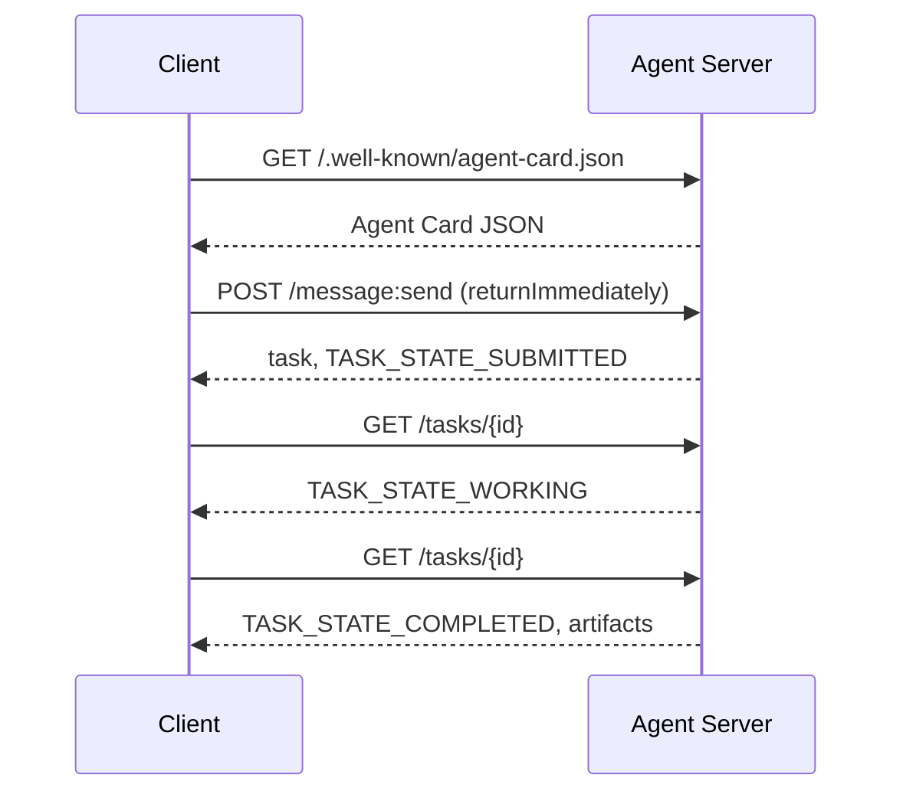

# A2A  智能体间通信协议(Agent-Agent Protokolü)

> Google, 2025 yılının Nisan ayında A2A'yı yayınladı; 2026 yılının Nisan ayında, resmi kuralları 1.0.1'e kadar gelişmiş ve AWS, Microsoft, Salesforce ve diğer 150+ kuruluşların desteğini elde etmiştir. A2A, MCP'nin yan yönlü bir tamamlama protokolüdür: MCP 聚焦纵向 (Agent  Tools), A2A ise yan yönlü bir noktaya odaklanmıştır. A2A ise A2A'nın kullanımını geniş bir şekilde tanımlamıştır.

**Type:** Learn + Build
**Languages:** Python (stdlib, `http.server`, `json`)
**Prerequisites:** Phase 16 · 04（原语模型）
**Time:** ~75 分钟

## 问题背景

Agentiniz başka bir sistem veya organizasyon içindeki bir ajanı dağıtmaya ihtiyaç duyduğunda nasıl iletişim kurmalı? Kesinlikle özel bir HTTP uç noktasını ortaya koyabilir, özel bir JSON şema tanımlayabilir ve diğerlerinin sizin kurallarınızı uygulayabilmesini bekleyebilirsiniz.

A2A bu şapalı sistem için genel kullanımlı bir şapalı protokol (Wire Protocol) sağladı. Standart servis keşifleri, standart görev çekimleri, standart nakliye bağlama ve standart çıkış ürünleri, örneğin akıllı vücut için belirlenen HTTP+REST  altyapısı tanımladı.

## 核心概念

### Dört temel unsur

**Agent Card（智能体名片）。**- Saklayın .`/.well-known/agent-card.json`JSON dosyası, genel olarak tanımlamak için kullanılır Ajan:名称、Skills、`supportedInterfaces`(端点 URL、协议绑定、协议版本)、默认输入与输出媒体类型,以及鉴权要求(`securitySchemes`ile`securityRequirements`)。 için için için için için için için için için için için için için için için için için için için için için için için için için için için için için için için için için için için için için için için için için için için için için için için için için için için için için için için için için için için için için için için için için için için için için için için için için için için için için için için için için için için için için için için için için için için için için için için için için için için için için için için için için için için için için için için için için için için için için için için için için için için için için için için için için için için için için için için için için için için için için için için için için için için için için için için için için için için için için için için için için için için için için için için için için için için için için için için için için için için için için için için için için için için için için için için için için için için için için için için için için için için için için için için için için için için için için için için için için için için için için için için için için için için için için için için için için için için için için için için için için için için için için için bir bir.

```http
GET /.well-known/agent-card.json HTTP/1.1
Host: agent.example.com
```

```json
{
  "name": "code-review-agent",
  "description": "审查 Python 与 TypeScript 代码。",
  "version": "1.0.0",
  "supportedInterfaces": [
    {
      "url": "https://agent.example.com",
      "protocolBinding": "HTTP+JSON",
      "protocolVersion": "1.0"
    }
  ],
  "capabilities": {"streaming": false, "pushNotifications": false},
  "securitySchemes": {
    "bearer": {"httpAuthSecurityScheme": {"scheme": "Bearer"}}
  },
  "securityRequirements": [{"schemes": {"bearer": {"list": []}}}],
  "defaultInputModes": ["text/plain", "application/json"],
  "defaultOutputModes": ["application/json"],
  "skills": [
    {
      "id": "review-python",
      "name": "审查 Python 代码",
      "description": "审查传入的 Python 源码并给出改进建议。",
      "tags": ["code-review", "python"]
    },
    {
      "id": "review-typescript",
      "name": "审查 TypeScript 代码",
      "description": "审查传入的 TypeScript 源码并给出类型与逻辑改进建议。",
      "tags": ["code-review", "typescript"]
    }
  ]
}
```

**Task（任务）。**基本工作委托单元── yaşam döngüsüne sahip bir durum değişken nesne:`TASK_STATE_SUBMITTED`→ `TASK_STATE_WORKING`→ `TASK_STATE_COMPLETED`- Ne ?`TASK_STATE_FAILED`- Ne ?`TASK_STATE_CANCELED` Müşteri 发送消息,Server 创建任务,随后客户端 通过轮询或流式订阅获取更新──

**Artifact（产物）。**Görev                                                                                                                                                                                                                                                                                                                                                                                                                                                                                                                            `text`- Evet.`raw`- Evet.`url`Ya da`data`之一并可指明其 `mediaType`- Evet.

**不透明生命周期（Opaque Lifecycle）。**A2A 绝不规定远程代理 *内部* nasıl görevleri tamamlayacağını;; Müşteri sadece durumunu, dönüşümünü ve son ürününü gözlemliyor; kullanıcının tamamen özgürce herhangi bir alt model ve çerçeve seçmesi gerekir;;

### MCP ile A2A'nın ayrımı

- **MCP**:Agent  Tool。Agent 借助 JSON-RPC 读写工具 Server,核心完全无状态。
- **A2A**Ajan  Ajan¬¬¬¬¬¬¬¬¬¬¬¬¬¬¬¬¬¬¬¬¬¬¬¬¬¬¬¬¬¬¬¬¬¬¬¬¬¬¬¬¬¬¬¬¬¬¬¬¬¬¬¬¬¬¬¬¬¬¬¬¬¬¬¬¬¬¬¬¬¬¬¬¬¬¬¬¬¬¬¬¬¬¬¬¬¬¬¬¬¬¬¬¬¬¬¬¬¬¬¬¬¬¬¬¬¬¬¬¬¬¬¬¬¬¬¬¬¬¬¬¬¬¬¬¬¬¬¬¬¬¬¬¬¬¬¬¬¬¬¬¬¬¬¬¬¬¬¬¬¬¬¬¬¬¬¬¬¬¬¬¬¬¬¬¬¬¬¬¬¬¬¬¬¬¬¬¬¬¬¬¬¬¬¬¬¬¬¬¬¬¬¬¬¬¬¬¬¬¬¬¬¬¬¬¬¬¬¬¬¬¬¬¬¬¬¬¬¬¬¬¬¬¬¬¬¬¬¬¬¬¬¬¬¬¬¬¬¬¬¬¬¬¬¬¬¬¬¬¬¬¬¬¬¬¬¬¬¬¬¬¬¬¬¬¬¬¬¬¬¬¬¬¬¬¬¬¬¬¬¬¬¬¬¬¬¬¬¬¬¬¬¬¬¬¬¬¬¬¬¬¬¬¬¬¬¬¬¬¬¬¬¬¬¬¬¬¬¬¬¬¬¬¬¬¬¬¬¬¬¬¬¬¬¬¬¬¬¬¬¬¬¬¬¬¬¬¬¬¬¬¬¬¬¬¬¬¬¬¬¬¬¬¬¬¬¬¬¬¬¬¬¬¬¬¬¬¬¬¬¬¬¬¬¬¬¬¬¬¬¬¬¬¬¬¬¬¬¬¬¬¬¬¬¬¬¬¬¬¬¬¬¬¬¬¬¬¬¬¬¬¬¬¬¬¬¬¬¬¬¬¬¬¬¬¬¬¬¬¬¬¬¬¬¬¬¬¬¬¬¬¬¬¬¬¬¬¬¬¬¬¬¬¬¬¬¬¬¬¬¬¬¬¬¬¬¬¬¬¬¬¬¬¬¬¬¬¬¬¬¬¬¬¬¬¬¬¬¬¬¬¬¬¬¬

Çok akıllı sistem üretimi sırasında, iki ortaklık vardır: A2A kendi tarafında kendi tarafında yerel konutlama MCP araçları için kullanmak için.

### 发现与调用时序



Yukarıdaki yollar HTTP+JSON  Bağlantı kurallarını takip eder ve her istek de taşır.`A2A-Version: 1.0`Lütfen başlıyoruz.`SendMessage`Görev sona erene kadar tıkacak, bu yüzden müşteriye sorgu yapma şekli ayarlandı.`configuration.returnImmediately`Görevini hemen gerçekleştirmek için.

流式传输 için:`POST /message:stream`返回 Server-Send Events(首先输出 `task`, sonra 陆续推送 `statusUpdate`ile`artifactUpdate`事件), ve `/tasks/{id}:subscribe`则用于重新附加到运行中的任务――流在任务进入终态时正常关闭,报文中不包含单独的 `final`- Evet.

### Öz identity认证与安全 (Aut)

A2A 原生支持三种主流安全模式:

- **Bearer Token**:OAuth2 或不透明 Token(`httpAuthSecurityScheme`Ya da`oauth2SecurityScheme`)。
- **mTLS**:双向 TLS 认证,组织间强证明身份(`mtlsSecurityScheme`)。
- **API Key**: located request head、URL 查询参数或 Cookie içindeki anahtarı(`apiKeySecurityScheme`)。

认证规则在代理卡 中公布:`securitySchemes`命名方案,`securityRequirements`規定调用方必須满足の要求──

```figure
sw-agent-card-discovery
```

## 动手实践

`code/main.py`A2A 1.0 HTTP+JSON'a dayalı  Bağlantı protokolü, sadece Python kullanıyor  standart kitle `http.server`ile`json`极简的 A2A Server与 Client 实现了. Server 功能包括:

-  exposition `/.well-known/agent-card.json`- ...
-  Kabul et`POST /message:send`调用;
- 管理 Görev 状态机转换;
- - Evet .`GET /tasks/{id}`Ünlü ürünleri geri getirmek.

Müşteri fonksiyonu:

- 拉取并解析 Ajan Kartı;
- Gönderim`returnImmediately`Yeni bir görev oluşturmak;
- 持续轮询直至任务完成;
- 读取并验证最终 Artifact。

运行命令:

```bash
python3 code/main.py
```

Scenario, arka planda sunucuyu başlatır ve sonra Client tarafından tüm süreci düzenler, doğrudan gösterir, bulur, gönderir, sorgular ve elde edilen ürünlerin tüm süreci oluşturur.

## 交付物

本课交付 `outputs/skill-a2a-integrator.md` Planlama için tam bir A2A integrasyon programı:Agent Kartı içeriği  Görev 校验契约、鉴权选型以及流式与轮询策略──

## 核心专业术语

| 术语 | 规范定义 |
|------|---------|
| A2A | 跨系统异构智能体间互相调用的对等开放协议 |
| Agent Card | 暴露于 `/.well-known/agent-card.json` 的元数据卡片，声明技能、端点与鉴权要求 |
| Task | 具备明确生命周期、完成时生成产物的异步工作单元 |
| Artifact | 任务产出的具名、带类型结果（文本、结构化 JSON、音视频媒体等） |
| 不透明生命周期 (Opaque lifecycle) | 内部解决过程对调用方隐藏，仅对外暴露状态流转与产物 |
| 服务发现 (Discovery) | 通过发起 `GET /.well-known/agent-card.json` 获取名片并了解支持能力 |
| MCP 对比 A2A | MCP 属于垂直的 Agent 与工具交互，A2A 属于水平的 Agent 间对等协作 |

## 延伸阅读

- [A2A 规范主站](https://a2a-protocol.org/latest/specification/) 官方权威规范
- [A2A v1.0.1 源码发布](https://github.com/a2aproject/A2A/tree/v1.0.1) Bu ders takip eden kod anlaşması ve kural tanımı
- [Google Developers Blog — A2A 发布说明](https://developers.googleblog.com/en/a2a-a-new-era-of-agent-interoperability/) 官方设计背景
