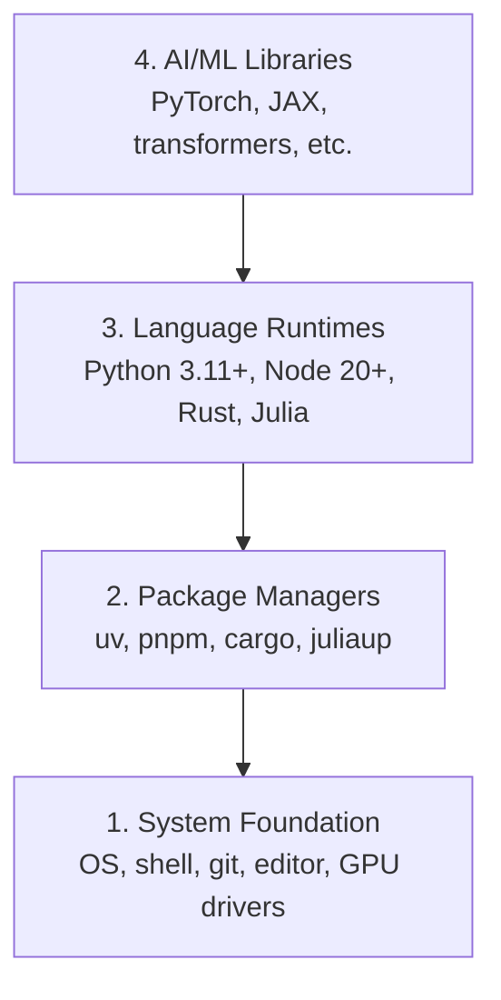

# Môi trường phát triển

> Công cụ của bạn sẽ hình thành cách suy nghĩ của bạn. Một lần định vị, đúng định vị.

**Type:** Build
**Languages:** Python, Node.js, Rust
**Prerequisites:** None
**Time:** ~45 分钟

## Học mục tiêu
- Từ zero bắt đầu thiết lập Python 3.11+、Node.js 20+ và Rust toolchains
-  cấu hình môi trường ảo và quản lý gói, để thực hiện xây dựng có thể tái tạo
- Sử dụng CUDA/MPS 验证 GPU truy cập,并运行一个测试 Tensor hoạt động
- Nghĩ 4 tầng: hệ thống, gói, thời gian chạy, thư viện AI

## 问题
Bạn sẽ học 200+ bài học về kỹ thuật AI bằng Python, TypeScript, Rust và Julia. Nếu môi trường của bạn bị hỏng, mỗi bài học sẽ trở thành một công cụ để đấu tranh, thay vì học.

Nhiều người sẽ bỏ qua cài đặt môi trường. Sau đó họ dành vài giờ để gỡ lỗi nhập khẩu, xung đột phiên bản và thiếu tài xế CUDA. Chúng tôi phải làm điều này một lần và đúng.

## 概念
Một môi trường kỹ thuật AI có bốn tầng:



Chúng ta tự đặt lên tầng dưới. Mỗi tầng đều phụ thuộc vào tầng dưới.


```figure
s0-env-stack
```

##  xây dựng nó
### 步骤 1: Hệ thống Foundation

Kiểm tra hệ thống của bạn và cài đặt các bộ phận cơ bản.

```bash
# macOS
xcode-select --install
brew install git curl wget

# Ubuntu/Debian
sudo apt update && sudo apt install -y build-essential git curl wget

# Windows (use WSL2)
wsl --install -d Ubuntu-24.04
```

### 步骤 2: Python với uv

Chúng tôi sử dụng `uv`Nó nhanh hơn pip 10-100x, và sẽ tự động xử lý môi trường ảo.

```bash
curl -LsSf https://astral.sh/uv/install.sh | sh

uv python install 3.12

uv venv
source .venv/bin/activate  # or .venv\Scripts\activate on Windows

uv pip install numpy matplotlib jupyter
```

验证:

```python
import sys
print(f"Python {sys.version}")

import numpy as np
print(f"NumPy {np.__version__}")
a = np.array([1, 2, 3])
print(f"Vector: {a}, dot product with itself: {np.dot(a, a)}")
```

### 步骤 3: Node.js với pnpm

Sử dụng TypeScript 课程(agent、MCP server、web apps)

```bash
curl -fsSL https://fnm.vercel.app/install | bash
fnm install 22
fnm use 22

npm install -g pnpm

node -e "console.log('Node', process.version)"
```

### 步骤 4: Rust

Sử dụng cho các hệ thống quan trọng về hiệu suất (các môn học)

```bash
curl --proto '=https' --tlsv1.2 -sSf https://sh.rustup.rs | sh

rustc --version
cargo --version
```

### 步骤 5: Julia (Tự chọn)

Với Julia, nó rất giỏi về toán học.

```bash
curl -fsSL https://install.julialang.org | sh

julia -e 'println("Julia ", VERSION)'
```

### 步骤 6:GPU 设置( nếu có)

```bash
# NVIDIA
nvidia-smi

# Install PyTorch with CUDA
uv pip install torch torchvision torchaudio --index-url https://download.pytorch.org/whl/cu124
```

```python
import torch
print(f"CUDA available: {torch.cuda.is_available()}")
if torch.cuda.is_available():
    print(f"GPU: {torch.cuda.get_device_name(0)}")
```

没有 GPU?没有问题──大多数课程可在CPU上运行──对于训练重的课程,使用Google Colab或云 GPU──

### Bước 7: Kiểm tra mọi thứ

运行验证脚本:

```bash
python phases/00-setup-and-tooling/01-dev-environment/code/verify.py
```

## Sử dụng nó
Môi trường của bạn hiện đã sẵn sàng để sử dụng mỗi phần của chương trình này. Dưới đây là nội dung sẽ được sử dụng ở mọi nơi:

| Language | Used In | Package Manager |
|----------|---------|-----------------|
| Python | Phases 1-12 (ML, DL, NLP, Vision, Audio, LLMs) | uv |
| TypeScript | Phases 13-17 (Tools, Agents, Swarms, Infra) | pnpm |
| Rust | Phases 12, 15-17 (Performance-critical systems) | cargo |
| Julia | Phase 1 (Math foundations) | Pkg |

## 交付 nó
Bài học này được tạo ra một bản văn chứng minh mà bất cứ ai cũng có thể sử dụng, để kiểm tra thiết lập của mình.

查看 `outputs/prompt-env-check.md`, trong đó có một, có thể giúp trợ lý AI  chẩn đoán các vấn đề môi trường.

## 练习
1. 运行验证脚本并修复 bất kỳ thất bại nào
2. Trong khóa học này tạo ra một môi trường ảo Python, và cài đặt PyTorch
3. Sử dụng tất cả bốn ngôn ngữ  viết một "hào thế giới",并逐个运行
